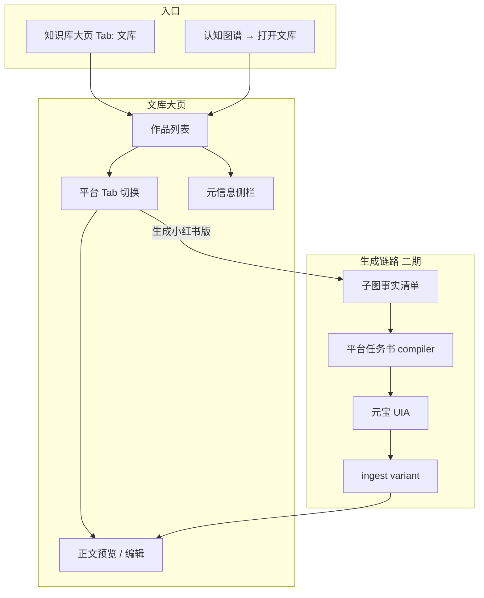

# M6-3-2 多平台文案文库方案

> 状态：一期骨架已落地（Tab + 页面 + 母稿列表）；平台衍生生成二期  
> 关联：M6-3-1 元宝闭环 · 产品设计文档 §5.7 知识库

---

## 1. 背景与问题

M6-3-1 在知识图谱子图上生成的是 **私域朋友圈/社群节奏** 的长图文：口语化、分段促销、emoji、多图穿插。  
直接发到 **小红书 / 今日头条 / 抖音** 会「水土不服」——篇幅、标题、标签、语气、配图比例均不同。

因此需要独立的 **文库大页面**，以「作品（母稿）」为中心，管理各平台衍生版本。

---

## 2. 产品目标

| 目标 | 说明 |
|------|------|
| 统一入口 | 知识库 Tab「文库」+ 认知图谱「打开文库」 |
| 母稿默认 | 元宝首次入库 = `wechat_private`（私域朋友圈/社群） |
| 多平台衍生 | 同一事实清单 → 按平台模板编译任务书 → 元宝生成变体 |
| 可追溯 | 变体共享 `work_id`、`root_doc_ids`、`fact_sheet_hash` |

---

## 3. 信息架构



---

## 4. 页面布局（已实现骨架）

```
┌─────────────────────────────────────────────────────────────────┐
│ 知识库 > 文库 Tab    大类：beauty · 四季护肤                      │
├──────────────┬──────────────────────────────────┬───────────────┤
│ 作品列表      │ 平台版本                          │ 元信息         │
│ [搜索框]      │ [💬私域母稿] [📕小红书] [📰头条]…  │ 入库时间       │
│              │                                   │ 标题公式       │
│ · 斑别拖了…   │  （选中平台正文预览）               │ 配图数         │
│ · 体验套种草  │  [cite 或「待生成」占位        │ 关联 goods_id  │
│              │ [全屏阅读] [复制 Markdown]         │               │
│ [刷新]        │ [生成小红书版] 二期                │               │
└──────────────┴──────────────────────────────────┴───────────────┘
```

### 入口

1. **知识库** → Tab 栏与「投喂学习 / 知识图谱 / 上传记录」并列 → **文库**
2. **认知图谱** Card 右上角 **「打开文库 →」**
3. **文案预览侧栏** **「打开多平台文库 →」**

路由：`#/knowledge?tab=library&category=beauty`

---

## 5. 数据模型

### 5.1 一期（当前）

沿用 `articles/{category}/{article_id}.json`，扩展字段：

```json
{
  "article_id": "20260703_163821_斑别拖了这颗钻光能救你",
  "hook_title": "斑别拖，这颗\"钻\"先给你试个光 ✨",
  "title": "斑别拖，这颗\"钻\"先给你试个光 ✨_20260703163821",
  "platform": "wechat_private",
  "category": "beauty",
  "source": "yuanbao_desktop",
  "root_doc_ids": ["goods_23"],
  "fact_sheet_hash": "sha256:…",
  "full_markdown": "…"
}
```

**标题规则：**

- `hook_title` / 列表展示：正文 **首行钩子**（如「斑别拖，这颗"钻"先给你试个光 ✨」）
- 若历史数据为「未命名文案」，读取时从 `full_markdown` 首行回填，无需手工改文件名

### 5.2 二期（多平台变体）

```
article_works/                    # 作品索引（可选 SQLite 表）
  work_id
  category
  hook_title
  root_doc_ids[]
  fact_sheet_hash
  created_at

articles/{category}/
  {work_id}/
    wechat_private.json           # 母稿
    xiaohongshu.json              # 衍生
    toutiao.json
```

或单 JSON 内嵌：

```json
{
  "work_id": "w_20260703_001",
  "variants": {
    "wechat_private": { "full_markdown": "…", "status": "ready" },
    "xiaohongshu": { "full_markdown": "…", "status": "draft", "tags": ["#淡斑", "#护肤"] }
  }
}
```

---

## 6. 平台差异（任务书模板）

| 平台 | `platform_id` | 结构要点 | 篇幅 |
|------|---------------|----------|------|
| 私域朋友圈/社群 | `wechat_private` | 口语 hook、分段促销、emoji、多图 | 800–2000 字 |
| 小红书 | `xiaohongshu` | 标题≤20字、种草清单、话题标签、封面图 | 600–1200 字 |
| 今日头条 | `toutiao` | 资讯标题、小标题分段、少 emoji | 800–1500 字 |
| 抖音 | `douyin` | 口播脚本 + 字幕要点 | 300–600 字 |

编译器：`writing_brief_compiler.compile_platform_brief(work, platform)` — 二期新增。

---

## 7. API 规划

| 方法 | 路径 | 说明 | 期次 |
|------|------|------|------|
| GET | `/knowledge/article/list` | 母稿列表（含 hook_title） | ✅ 一期 |
| GET | `/knowledge/article/{id}` | 单篇详情 | ✅ 一期 |
| POST | `/knowledge/article/variant` | 基于 work_id + platform 生成变体 | 二期 |
| GET | `/knowledge/article/work/{work_id}` | 作品 + 全部变体 | 二期 |

---

## 8. 客户端文件

| 文件 | 职责 |
|------|------|
| `ArticleLibraryPanel.vue` | 文库大页 UI 骨架 |
| `KnowledgePage.vue` | 新增「文库」Tab |
| `KnowledgeForestPanel.vue` | 跳转文库链接 |
| `article_store.py` | hook 标题提取、platform 字段 |

---

## 9. 分期交付

### 一期（当前迭代）✅

- [x] 标题从正文首行提取，修复「未命名文案」
- [x] 知识库「文库」Tab + 三栏布局骨架
- [x] 母稿列表 / 预览 / 全屏阅读
- [x] 平台 Tab 占位 + 「生成 xx 版」按钮（提示二期）

### 二期

- [ ] `work_id` + 多 variant 存储
- [ ] 平台任务书模板（小红书 / 头条）
- [ ] 元宝 UIA 生成变体 + ingest
- [ ] 变体 diff 对比视图
- [ ] 发布状态（草稿 / 已发 / 排期）

### 三期

- [ ] 抖音口播脚本
- [ ] 一键导出（Markdown / 富文本 / 图片包）
- [ ] 与私域群发 / 内容日历集成

---

## 10. 验收

1. 历史 JSON 标题为「未命名文案」时，列表显示正文首行钩子  
2. 知识库可见「文库」Tab，与图谱 Tab 并列  
3. 认知图谱可跳转文库且带当前大类  
4. 文库可选中母稿并全屏阅读  
5. 切换「小红书」Tab 显示待生成占位（二期按钮可点通元宝）
