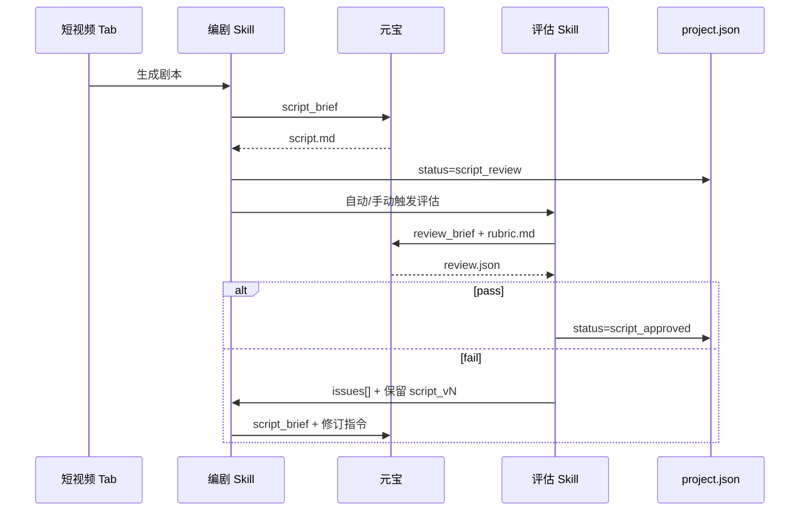

# M7-1-S1 — 编剧 Skill 方案

> **状态**：方案定稿 · **M7-1b 核心落盘已完成（B1–B5）** · **M7-1c 编剧+评估 Skill 已编码（元宝 UIA）** · B6 历史重建 **暂缓待拍板** · 2026-07-04  
> **引擎**：腾讯元宝桌面版 UIA（与 [M6-3-1 元宝闭环](M6-3-1-智能写作-子图事实清单与元宝闭环方案.md) 同链路）  
> **前置开发**：[M7-1b 创作素材包落盘](#〇前置依赖m7-1b--须先开发)（**B1–B5 已完成**；B6 历史重建待办）  
> **下游**：[M7-1-S2 剧本评估 Skill](M7-1-S2-剧本评估Skill方案.md)（待写）  
> **评估标准**：[评估-电商短视频Rubric-v1.md](M7-1-standards/评估-电商短视频Rubric-v1.md)  
> **风格示例**：[风格-美妆种草60s-v1.md](M7-1-standards/风格-美妆种草60s-v1.md)

> **与总方案对齐**：[M7-1 §二 人机交互原则](M7-1-短视频创作-导演智能体总体方案.md) · [§四 创作素材包](M7-1-短视频创作-导演智能体总体方案.md) · [§4.3 编剧输入](M7-1-短视频创作-导演智能体总体方案.md)  
> **统一认识**：**子图事实清单**（点网 UI）**=** `creation_material_bundle.fact_sheet`（落盘名）**=** 编剧/摄影共用的 **知识图谱素材**。

---

## 〇、前置依赖（M7-1b · 须先开发）

> **用户确认（2026-07-04）**：生成母稿时的 **子图事实清单** 就是总方案里的 **创作素材包** 核心内容（节点/边/media 的 vlm、scene 等）。现只存 hash、未落盘 → **M7-1b 须先开发**，编剧 Skill（M7-1c）才能继承这份素材。

### 0.1 现状 vs 缺口

| 环节 | 已有 | 缺失 |
|------|------|------|
| **点网 UI** | `SubgraphFactSheet.vue` 展示子图事实清单（如图：28 节点、media 含 url/vlm/scene） | — |
| **编译任务书** | `writing_brief_compiler` 用 fact_sheet 生成附录；返回 `fact_sheet_hash` | 清单 **未持久化** |
| **文案入库** | `article.json` 存 `root_doc_ids`、`fact_sheet_hash` | **无** `fact_sheet` 全文、**无** media_refs、**无** graph 快照 |
| **短剧编剧** | 方案假定有 `creation_material_bundle` | **代码未实现**；选历史母稿时无法还原当时素材 |

```text
生成母稿时（应有但未落盘）          做短剧时（编剧需要）
─────────────────────────          ─────────────────────
overviewGraph + factSheet     →     script_brief 事实附录
media url / vlm / scene       →     Beat3 产品镜头 + 素材提示
root_doc_ids + 促销文档       →     品名/卖点与 fact_sheet 对齐
writing_brief 快照            →     审计「当时喂了什么」
```

### 0.2 目标：`creation_material_bundle`（= 子图事实清单落盘）

与 [M7-1 总体方案 §四](M7-1-短视频创作-导演智能体总体方案.md) **同一对象**：

| 名称 | 场景 |
|------|------|
| **子图事实清单** | M6-3 点网 UI（`SubgraphFactSheet`）实时展示 |
| **`fact_sheet`** | bundle JSON 内字段，清单全文 |
| **`creation_material_bundle`** | 落盘文件名 / 短剧项目继承的 **创作素材包** |
| **`media_refs`** | 从 fact_sheet 抽出的图片索引（url + vlm + scene） |

在 **元宝文案入库成功时** 写入 sidecar（结构同总方案 §4.1）：

```json
{
  "bundle_id": "bundle_20260704_163821",
  "created_at": "2026-07-04T16:38:21+08:00",
  "source": "graph_compose",
  "root_doc_ids": ["goods_23", "goods_25"],
  "fact_sheet_hash": "sha256:abc…",
  "fact_sheet": {
    "entries": [
      {
        "seq": 4,
        "kind": "media",
        "source": "l0",
        "node_id": "niushop_product_59_media_0",
        "url": "https://…",
        "vlm_description": "银色礼盒…",
        "use_cases": "回答包装与实物对比"
      }
    ],
    "summary": { "node_count": 28, "edge_count": 45, "media_count": 14 }
  },
  "graph_snapshot": {
    "root_doc_ids": ["goods_23", "goods_25"],
    "nodes": [],
    "edges": [],
    "media": [],
    "chunks": []
  },
  "media_refs": [
    {
      "node_id": "niushop_product_59_media_0",
      "url": "https://…",
      "vlm_description": "…",
      "use_cases": "…",
      "role_hint": "texture"
    }
  ],
  "writing_brief_md": "可选：当时《写作任务书》全文快照",
  "compose_options": {
    "depth": "l3",
    "title_formula": "A",
    "include_emoji": true
  },
  "linked_article_ids": ["20260704_163821_尚雅绣体验套"]
}
```

**落盘路径（推荐 sidecar，避免 article.json 过大）**：

```text
articles/{category}/
├── {article_id}.json          # 增加 bundle_id / fact_sheet_hash（已有）
├── {article_id}.md
└── {article_id}.bundle.json   # ← 新增：完整 creation_material_bundle
```

### 0.3 写入时机（M7-1b 开发清单）

| # | 时机 | 动作 | 代码落点 |
|---|------|------|----------|
| B1 | 用户点「开始生成」前 | 客户端 `buildFactSheetFromOverview` + L3 enrich → 传 `factSheet` | `KnowledgeForestPanel.vue` | ✅ |
| B2 | 编译写作任务书 | 将 `fact_sheet.entries` 传入 `compile_writing_brief(fact_entries=…)` | `writing_brief_compiler` + API | ✅ |
| B3 | **元宝入库成功** | 写 `{article_id}.bundle.json`；`article.json` 增 `bundle_id` | `material_bundle_store.py` + ingest | ✅ |
| B4 | 短视频 Tab 选母稿 | 读 sidecar；UI 复用 `SubgraphFactSheet` 只读展示 | `ShortVideoPanel.vue` | ✅ |
| B5 | 创建 `video_project` | **拷贝** bundle → `video_projects/{id}/bundle/` | `video_project_store` | ✅ |
| B6 | 历史母稿无 bundle | 按 `root_doc_ids` **重建 L0** fact_sheet + 提示 | `bundle_rebuilder.ts` | ⏸ 暂缓 |

### 0.4 与编剧 Skill 的衔接

编剧 **不重新点网**，只读项目内 bundle：

```text
选文库母稿
  → 加载 {article_id}.bundle.json
  → 拷贝到 video_projects/{project_id}/bundle/
  → script_brief_compiler 读 bundle.fact_sheet + media_refs
  → 《编剧任务书》「事实附录」= 压缩版 entries（media 全量、document Top N）
  → script.meta.json 记录 bundle_id + fact_sheet_hash（与评估 Rubric 1.2 对齐）
```

**Beat「素材提示」** 字段：从 `media_refs` 按 `use_cases` / `role_hint` 推荐 node_id，供摄影/Vidu img2video 引用。

### 0.5 M7-1b 验收（编剧前置 Gate）

| # | 项 |
|---|-----|
| G1 | 新生成母稿入库后，磁盘存在 `{article_id}.bundle.json`，且 `fact_sheet.entries` 含 **≥1 条 media 含 url** |
| G2 | `article.json.bundle_id` 与 sidecar 一致；`fact_sheet_hash` 与 bundle 内 hash 一致 |
| G3 | 短视频 Tab 选该母稿，可 **只读** 展示与生成时一致的子图事实清单 |
| G4 | 无 bundle 的历史母稿：重建 L0 或 UI 提示「请重新生成母稿以绑定素材」 |
| G5 | `script_brief` 预览中「事实附录」来自 bundle，**非**手贴、**非**空 |

> **M7-1c（编剧元宝 UIA）在 G1–G5 通过后再开发。**

---

## 一、职责边界

| 做 | 不做 |
|----|------|
| 把文库母稿 + 素材包改写成 **30–60 秒推荐**（允许 30–75 秒）竖屏剧本 | 不生成最终 mp4（摄影 Skill） |
| 输出结构化 `script.md` + 元数据 | 不做评估打分（评估 Skill） |
| 编译《编剧任务书》→ 元宝 UIA → 入库 | 不调 DeepSeek / 服务端 compose |
| 接收评估 `issues[]` 后 **增量改写**（保留版本） | 不修改母稿原文 |

---

## 二、输入（与 M7-1 总方案 §二 · §4.3 完全一致）

> **原则**：**文件引用 + 自动血缘**，运营 **不手贴** 母稿全文、Rubric、fact_sheet。  
> 下表与 [M7-1 人机交互原则](M7-1-短视频创作-导演智能体总体方案.md) **同构**；末行 `issues[]` 为评估退回时追加。

| 输入项 | 形式 | 必填 | 路径 / 字段 | 编译进《编剧任务书》 |
|--------|------|------|-------------|---------------------|
| **① 文库母稿** | 系统 `.md` | **是** | `articles/{category}/{work_id}.md` | 「文库母稿」节（系统读文件，不手贴） |
| **② 创作素材包** | JSON + media_refs | **自动** | `{article_id}.bundle.json` → 项目 `bundle/` | 「事实附录」「可用图片」— **即子图事实清单** |
| **③ 评估标准** | 独立 `.md` | **是** | `review_rubric_path`（与 S2 **同一文件**） | **约束摘要**（`extract_rubric_constraints`）— 非全文、非打分 |
| **④ 剧本风格** | 独立 `.md` | 推荐 | `_standards/风格-美妆种草60s-v1.md` | 「风格文档」节 |
| **⑤ 补充说明** | 大文本框 | **否** | `user_notes` | 「运营补充」节 |
| **⑥ 补充图片** | 选图谱 media / 上传 | **否** | `supplemental_media_refs[]` | 追加到 media 列表 |
| **⑦ 修订指令** | JSON | 第 2+ 轮 | `review.json.issues[]` | 「修订指令」节 |

```text
编剧 Skill 输入 =
  ① 文库母稿 .md
+ ② 创作素材包（= 母稿生成时的子图事实清单 + media_refs）
+ ③ 评估标准 .md
+ ④ 剧本风格 .md
+ ⑤ 补充说明（可空）
+ ⑥ 补充图片（可空）
+ ⑦ issues[]（重写轮）
```

**UI**：短视频 Tab → 选母稿（自动加载 **② 素材包只读**）→ 选 ③④（**项目级绑定，创建时一次选定**）→ 可选 ⑤⑥ → **「生成剧本（元宝）」**。

### 2.1 评估标准共用（S1 ↔ S2 · 与总方案 §4.5 一致）

> **为什么要提前给编剧？** 评估标准 **不是评估阶段才第一次出现**。同一 Rubric 在 **编剧阶段注入约束摘要**，让元宝 **按将来打分标准写剧本**，提高 S2 **通过率**；评估阶段再用 **同一文件全文** 正式打分，**标准不漂移**。

| 项 | S1 编剧 | S2 评估 |
|----|---------|---------|
| **文件** | `project.json.review_rubric_path` | **同一路径** |
| **注入** | `extract_rubric_constraints()` → **摘要** | Rubric **全文** |
| **任务书节名** | `## 评估约束摘要（编写时自检）` | `## 评估标准（全文）` |
| **元宝任务** | 写剧本，**不自评打分** | 七维打分 + `review.json` |
| **产物引用** | `script.meta.json` → `rubric_path`, `rubric_version` | `review.json` → `rubric_file`, `rubric_version` |

**摘要内容**（编译器从 Rubric 自动抽取，见总方案 §4.5）：

```text
铁三角 · 商业锚点三要素 · 产品镜头必填 · 一票否决列表
时长 30–60s · Beat 结构 · 通过线 ≥72
（不含：打分表空白、JSON 契约示例）
```

**第 2+ 轮改写**：S2 的 `issues[]` 写入任务书「修订指令」；Rubric 文件 **不变**（除非运营改项目配置）。

**共享模块**：`rubric_compiler.py` / `.ts` — S1、S2 共用 `load_rubric`；见 [S2 §二](M7-1-S2-剧本评估Skill方案.md)。

---

## 三、输出契约

### 3.1 文件落盘

```
video_projects/{project_id}/
├── bundle/
│   ├── creation_material_bundle.json   # 自母稿继承 + 短剧补充
│   └── fact_sheet_snapshot.json        # 可选：与 sidecar 同构，便于 diff
├── briefs/
│   └── script_brief_{ts}.md          # 发给元宝的任务书
├── artifacts/
│   ├── script.md                     # 当前生效剧本
│   ├── script_v1.md, script_v2.md…   # 历史版本（重试不覆盖）
│   └── script.meta.json
└── project.json                      # status: scripting → script_review
```

### 3.2 `script.meta.json`

```json
{
  "source": "yuanbao_desktop",
  "engine": "yuanbao_uia",
  "version": 2,
  "narration_mode": "vidu_audio",
  "brief_path": "briefs/script_brief_20260704165000.md",
  "brief_hash": "sha256:…",
  "style_doc_path": "…/风格-美妆种草60s-v1.md",
  "rubric_path": "…/评估-电商短视频Rubric-v1.md",
  "rubric_version": "v1.2",
  "bundle_id": "bundle_20260704_163821",
  "fact_sheet_hash": "sha256:…",
  "linked_work_id": "20260703_163821_未命名文案",
  "bundle_id": "bundle_20260704_001",
  "duration_target_sec": 60,
  "created_at": "2026-07-04T16:50:00+08:00",
  "rewrite_of_version": 1,
  "review_issues_applied": ["Beat3 口播过长"]
}
```

**`narration_mode`（旁白怎么变成成片里的声音）**：

| 值 | 含义 | 首期 |
|----|------|------|
| `vidu_audio` | **默认**。旁白文案交给 **Vidu 生成带声音 clip**（平台 TTS/配音轨） | ✅ |
| `subtitle_assist` | 旁白 + **字幕叠加**（旁白仍走 Vidu 音频，字幕剪辑时烧录） | 可选 |
| `human_voice` | 真人配音（人工后期，不在自动链路内） | 远期 |

### 3.3 术语：「口播」= 剧本里的「旁白文案」

短视频行业说的 **口播**，在咱们剧本里统一写字段 **「旁白文案」**（也可简称 **旁白**）——指这一 Beat **要说出口的解说词文本**。

| 概念 | 说明 |
|------|------|
| **口播 / 旁白文案** | 编剧阶段写的 **文字**，必填 |
| **成片语音** | 摄影阶段 **Vidu 出带声音视频**，用旁白文案驱动，**不要求真人录音** |
| **字幕** | 可选；可与旁白相同，剪辑时叠加，辅助静音环境观看 |

| 阶段 | 做什么 |
|------|--------|
| **编剧** | 写 **画面 + 旁白文案**（+ 可选字幕） |
| **摄影（Vidu）** | 按旁白 + 画面提示生成 **带声音的** clip |
| **剪辑 / 制片** | 多 clip 拼接；可选烧录字幕轨 |

> 你问的「口播」= **要写说什么**，不是「必须人对着麦录」。成片 **有语音**，由 Vidu 提供。

### 3.4 `script.md` 正文结构（元宝必须遵守）

```markdown
# 剧本标题（≤20字）

- **时长**：约 60 秒 · 竖屏 9:16
- **叙事呈现**：vidu_audio（旁白由 Vidu 配音，成片带声音）
- **品类**：beauty / 尚雅绣钻石光感体验套
- **目标受众**：30+ 黄黑皮宝妈
- **核心卖点**：一条主卖点

---

## Beat 1 · HOOK（0:00–0:03）

**画面**：…
**旁白**：…（必填；即行业所称「口播词」，供 Vidu 配音）
**字幕**：…（可选，可与旁白相同，剪辑时叠加）
**素材提示**：media_refs 中哪张图可对应（可选）

## Beat 2 · 共鸣（0:03–0:15）
…

## Beat 3 · 选品（0:12–0:22）【事前篇 · 必备】

**画面**：手机竖屏 · 微信小程序搜索框输入「栖月汇」（≤3s）→ 肤质测试页一掠（知识画面）
**旁白**：不敢乱试了，我先做了肤质摸底，又比对了一圈成分。（**口播禁**小程序名/搜索路径）
**字幕**：先做功课
**素材提示**：supplemental 小程序屏录（可选）

## Beat 4 · 展示（0:22–0:35）

**画面**：**【必填】实体产品镜头**（手持/特写/质地）；**勿**在本 Beat 首次出现小程序 UI
**旁白**：比对下来，我盯上了这套…（品名 + 成分 + 看中/期待）
**字幕**：…
**素材提示**：media_refs 商品图

## Beat 5 · 信任（0:35–0:50）
…

## Beat 6 · CTA（0:50–1:00）
…

---

## 附录 · 事实引用
- 产品名：…（须来自 fact_sheet，禁止虚构）
- 成分/卖点：…（不写具体价格）
```

**验收**：事前篇 60s 须 **六 Beat**（含独立选品段）；每 Beat 含 **画面 + 旁白**；**展示 Beat 必须有产品镜头**；选品 Beat 须有搜栖月汇**画面**；总时长 30–75 秒。

---

## 四、任务书编译器 `script_brief_compiler`

> 对标 `writing_brief_compiler.py` / `platform_brief_compiler.py`，新增客户端 + 服务端各一份。

### 4.1 编译流程

```text
读 linked_article.md
读 video_projects/{id}/bundle/creation_material_bundle.json   ← 优先
  └─ 若无：读 articles/{category}/{article_id}.bundle.json
  └─ 仍无：bundle_rebuilder(root_doc_ids) → 标记 degraded
读 style_doc.md + rubric 摘要（前 120 行 + 五节拍 + 一票否决）
合并 user_notes + supplemental_media_refs（写入 bundle 副本）
若有 review.json.issues → 追加「修订指令」节
→ 输出 script_brief_{ts}.md
```

### 4.2 任务书模板（核心章节）

```markdown
# 谛听 · 电商短视频编剧任务书

你是短视频编剧，把已有种草长文改写成 **30–60 秒推荐** 竖屏短视频剧本（旁白由 Vidu 配音，成片带声音）。

## 硬性规则
- 只输出剧本 Markdown，不要解释过程
- 禁止（旁白/字幕）：价格、小程序名/搜索路径、私信、功效硬承诺
- 必须：5 Beat（或 30s 四段）、每 Beat **画面 + 旁白**、总时长 30–75 秒
- **必须**：展示 Beat 写清 **实体产品镜头**（手持/特写/质地）
- **事前篇必备**：独立 **选品 Beat**（共鸣与展示之间）· 画面写微信搜索「栖月汇」≤3s；口播禁小程序名
- **段落衔接**：画面须承接上一 Beat 因果，禁止口播说做功课、画面却已在开箱
- 产品事实只能来自下方「事实附录」，禁止虚构
- 头部标注：**叙事呈现：vidu_audio**

## 评估约束摘要（编写时自检 · 非正式打分）

> 摘自同一项目的评估标准 `{rubric_path}` v{rubric_version}；正式打分在评估 Skill 进行。

{rubric_constraints 自动抽取：铁三角、锚点三要素、产品镜头、一票否决、时长、Beat、通过线}

## 风格文档（摘要）

## 文库母稿（改写源，勿照抄句子）
{article_md}

## 事实附录（来自 creation_material_bundle · 禁止虚构）

以下为生成 **母稿当时** 子图事实清单压缩版；Beat「素材提示」须引用其中 media node_id / url。

{fact_sheet 压缩：document 根品 + 全部 media（url+vlm+scene）+ 促销 doc 标题}

## 可用图片（media_refs）

{逐条：node_id · url · vlm · use_cases · role_hint}

## 运营补充（可空）
{user_notes}

## 补充图片
{supplemental_media_refs 列表}

## 修订指令（仅第 2+ 轮）
{issues[] 逐条}

## 输出格式
严格按 SKILL 文档 §3.3 的 Beat 模板输出。
```

### 4.3 代码落点（实施时）

| 层 | 路径 |
|----|------|
| **M7-1b 素材包** | `article_store.py` 写 sidecar；`yuanbao_article_service.ts` 传 bundle |
| | `ditingclient/.../factSheetBuilder.ts`（已有）→ 序列化进 bundle |
| | `bundle_rebuilder.ts`（历史母稿 L0 重建） |
| 服务端 | `salesagent/.../knowledge/material_bundle_store.py`（新建） |
| | `POST /api/knowledge/article/bundle/ingest` |
| | `GET /api/knowledge/article/{id}/bundle` |
| 编剧 brief | `salesagent/.../knowledge/script_brief_compiler.py` |
| **Rubric 共用** | `salesagent/.../knowledge/rubric_compiler.py`（`extract_rubric_constraints`） |
| 客户端 fallback | `ditingclient/.../electron/services/script_brief_compiler.ts` |
| | `ditingclient/.../electron/services/rubric_compiler.ts` |
| API | `POST /api/knowledge/video/script/brief` |
| 入库 | `POST /api/knowledge/video/script/ingest` |

---

## 五、元宝 UIA 闭环

复用 [yuanbao_article](ditingclient/src/com/yanpanji/pcwx/yuanbao_article/) 子进程模式：

```text
Electron YuanbaoVideoScriptService
  → 编译 script_brief
  → spawn: python -m com.yanpanji.pcwx.yuanbao_video_script
       --prompt-file briefs/script_brief_*.md
       --log-dir data/logs/
  → write_one_article() 同源：
       wait_for_yuanbao_window → click_new_chat → paste → send
       → wait_for_article_reply（accept 规则改为「剧本 Beat 结构」）
  → ingest script.md + script.meta.json
  → project.status = script_review
  → 自动触发评估 Skill（或 UI 按钮「提交评估」）
```

### 5.1 剧本回复识别 `_is_likely_script`

在 `yuanbao_article/driver.py` 扩展或新建 `yuanbao_video_script/driver.py`：

```python
def _is_likely_script(text: str) -> bool:
    t = text.strip()
    if len(t) < 200: return False
    if "Beat" not in t and "节拍" not in t: return False
    if not re.search(r"0:\d{2}|0–\d|旁白|口播|字幕", t): return False
    if _reject_reason(t): return False  # 仍是任务书/JSON
    return True
```

### 5.2 配置

复用 `config/yuanbao_doc_graph_skill.json`：

- `article_max_wait_reply_sec`: 180（剧本略长）
- `batch.minimize_main_window`: true

日志：`data/logs/yuanbao_video_{YYYYMMDD}.log`

---

## 六、与评估 Skill 的协作



| 轮次 | 编剧行为 |
|------|----------|
| 第 1 轮 | 母稿 → 剧本 |
| 第 2+ 轮 | **只改 issues 指向的 Beat**；`rewrite_of_version` +1 |
| 上限 | 默认 **3 轮** 自动重试，之后需人工确认 |

---

## 七、API 草案

| 方法 | 路径 | 说明 |
|------|------|------|
| POST | `/knowledge/video/project/create` | 选 work_id + style_path + rubric_path |
| POST | `/knowledge/video/script/brief` | 编译任务书（预览） |
| POST | `/knowledge/video/script/run` | 触发元宝（IPC 到 Electron） |
| POST | `/knowledge/video/script/ingest` | 写入 script.md |
| GET | `/knowledge/video/project/{id}` | 含 artifacts 列表 |

首期 **brief 预览弹窗** 可选（与 M6-3 生成文案弹窗一致）。

---

## 八、UI 要点（短视频 Tab · 编剧工序）

| 元素 | 行为 |
|------|------|
| 母稿下拉 | 读 `article/list`；无 `bundle.json` 的条目标 ⚠️ |
| **子图事实清单** | 只读复用 `SubgraphFactSheet`，数据来自 `creation_material_bundle` |
| 风格 / 评估标准 | 扫描 `_standards/*.md` 下拉 |
| 补充说明 | Textarea；写入 project bundle 的 `user_notes` |
| 补充图片 | 多选 bundle 内 media 或上传 → `supplemental_media_refs` |
| 主按钮 | 「生成剧本（元宝）」 |
| 进度 | 复用 `yuanbaoArticle.onProgress` 文案 |
| 预览 | Beat 折叠展示 script.md |
| 历史 | 侧栏 `script_v1 / v2` 切换 |
| 通过后 | 「进入评估」或自动触发 |

---

## 九、标准文档部署

开发阶段 Rubric / 风格 放仓库：

```
docs/M7-1-standards/
├── 评估-电商短视频Rubric-v1.md
└── 风格-美妆种草60s-v1.md
```

运行时同步或复制到：

```
{data_root}/{category}/video_projects/_standards/
```

`project.json` 存 **相对路径**，便于 diff 与复现。

---

## 十、验收清单

### 10.1 M7-1b 素材包（编剧前置 · 须先过）

见 [§0.5 M7-1b 验收](#05-m7-1b-验收编剧前置-gate) G1–G5。

### 10.2 M7-1c 编剧 Skill（依赖 10.1）

| # | 项 |
|---|-----|
| V1 | 选有 bundle 的母稿 → brief 含 fact_sheet / media_refs |
| V2 | 元宝返回 → `script.md` 含 5 Beat；Beat3 素材提示引用 bundle media |
| V3 | `script.meta.json` 含 `bundle_id`、`fact_sheet_hash` |
| V4 | 第 2 轮改写携带 `issues[]`，生成 `script_v2.md` |
| V5 | 展示 Beat 含产品镜头；旁白/字幕无价格/小程序路径/硬承诺 |
| V6 | 日志 `yuanbao_video_*.log` 可追踪 |

---

## 十一、修订记录

| 版本 | 日期 | 说明 |
|------|------|------|
| v1.7 | 2026-07-04 | M7-1b 编码落地：bundle sidecar（B1–B3） |
| v1.6 | 2026-07-04 | §2.1 评估标准共用（S1 约束摘要 / S2 全文） |
| v1.5 | 2026-07-04 | 与 M7-1 总方案拉齐：子图事实清单=创作素材包 |
| v1.4 | 2026-07-04 | 新增 §〇 M7-1b 前置：子图事实清单/creation_material_bundle 落盘（阻塞编剧） |
| v1.3 | 2026-07-04 | 保留「旁白」字段；默认 `vidu_audio`（Vidu 带声）；澄清口播=旁白文案 |
| v1.2 | 2026-07-04 | 澄清「口播」= 旁白文案文本 |
| v1.1 | 2026-07-04 | 产品镜头必填；栖月汇 UI 知识画面；时长 30–60s；brief 硬规则对齐 Rubric v1.2 |
| v1 | 2026-07-04 | 初稿：输入输出、brief 编译、元宝 UIA、评估协作、API/UI |
