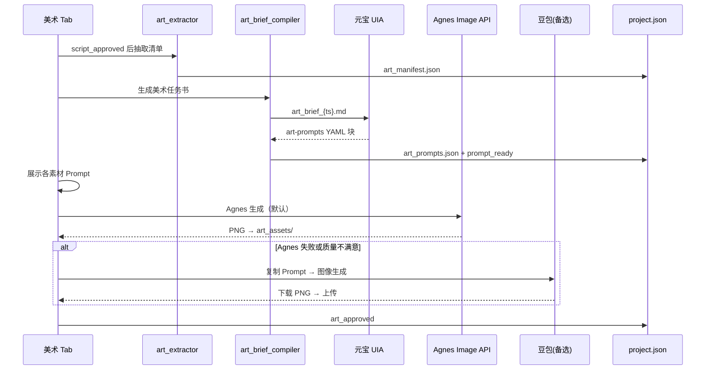
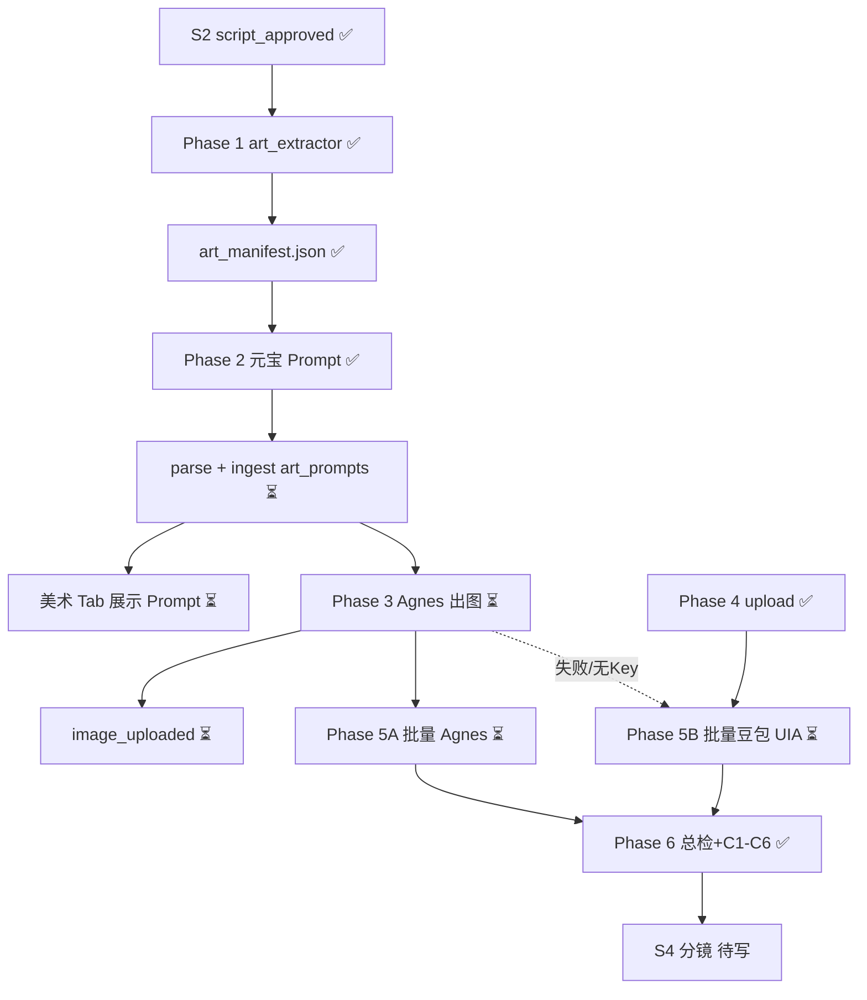

# M7-1-S3 — 美术 Skill 方案

> **状态**：方案定稿 · **PR-1～4 ✅ · PR-5A ✅ · PR-5A.7 ✅ · PR-5B ✅ · Phase 6 ✅** · 2026-07-10（**v2.9 · Prompt 自动规范化 · 零人工改字**）  
> **引擎（首期 · 人机双环 · 省钱模式）**：**Prompt → 元宝 UIA** · **出图 → Agnes Image API（默认）** · **豆包「图像生成」UIA 批量（备选 · Phase 5B）** — 无自有 GPU、不上 MJ/FLUX 付费 API（见 [Agnes 备忘](M7-1-备忘-Agnes-AI与Pavo创作台.md) · [文生图模型选型备忘](M7-1-备忘-文生图模型选型.md)）  
> **上游**：[M7-1-S1 编剧](M7-1-S1-编剧Skill方案.md) · [M7-1-S2 评估](M7-1-S2-剧本评估Skill方案.md)（`script_approved` 后解锁）  
> **下游**：[M7-1-S4 分镜 Skill](M7-1-S4-分镜Skill方案.md)（待写）· [M7-1-S5 摄影 / Vidu](M7-1-S5-摄影Skill方案.md)（待写）  
> **提示词规范**：[美术-提示词规则-v1.md](M7-1-standards/美术-提示词规则-v1.md)  
> **风格对齐**：[风格-美妆种草60s-v1.md](M7-1-standards/风格-美妆种草60s-v1.md)  
> **总方案**：[M7-1 §3.3 资产库](M7-1-短视频创作-导演智能体总体方案.md)  
> **模型选型备忘**：[M7-1-备忘-文生图模型选型.md](M7-1-备忘-文生图模型选型.md)（FLUX / MJ / 商用授权 · 非执行契约）  
> **Agnes / Pavo 备忘**：[M7-1-备忘-Agnes-AI与Pavo创作台.md](M7-1-备忘-Agnes-AI与Pavo创作台.md)  
> **Agnes 结构化规划（轨道 B）**：[M7-1-S3-Agnes结构化规划-试验方案.md](M7-1-S3-Agnes结构化规划-试验方案.md)

---

## 一、职责边界


| 做                                                                 | 不做                                |
| ----------------------------------------------------------------- | --------------------------------- |
| 从 **锁定剧本** 抽取 **演员 / 场景 / 道具** 全量清单                               | 不改写剧本（退回 S1）                      |
| 编译《美术任务书》→ **元宝 UIA** 生成各素材 **中英 Prompt**                         | 不做分镜时间轴（S4）                       |
| 将 Prompt **写入本项目** `art_manifest` / 各 asset JSON，**美术 Tab 逐条展示**  | 不直接调 Vidu 出视频（S5）                 |
| **Agnes Image API** 批量出参考图 → 自动落盘 `art_assets/`（须人工 **approved**） | 首期 **不** 接豆包 UIA / 绘图 API         |
| **豆包「图像生成」** 作 **备选**：Agnes 失败 / 429 / 质量不满意时，人工粘贴 Prompt 出图上传    | —                                 |
| 合并 **创作素材包** 已有商品图，标记「复用 vs 须新生成」                                 | 不修改 `creation_material_bundle` 原文 |
| 分批次出图、打标、**人工确认风格** 后锁定                                           | —                                 |


**核心目标**：**精准还原剧本情绪 + 极致产品质感 + 防错机制**，为 Vidu img2video 提供 **稳定视觉锚点**。

### 1.1 首期人机双环（定稿 · v1.3）

与编剧/评估一致：**文本推理走元宝**；**像素生成默认走 Agnes Image API**（可脚本化、免费档），**豆包人工出图为备选**。谛听负责任务书编译、Prompt 入库、Agnes 调用、图片落盘与 Tab 展示。

```text
┌─────────────────────────────────────────────────────────────────┐
│  输入：锁定剧本 + 创作素材包 + 美术-提示词规则-v1.md + 补充说明      │
└───────────────────────────────┬─────────────────────────────────┘
                                ▼
                    art_extractor → art_manifest.json（素材清单）
                                ▼
                    art_brief_compiler → art_brief_{ts}.md
                                ▼
              ┌─────────────────────────────────────┐
              │  环 A · Prompt 生成（元宝 UIA）        │
              │  新建对话 → 粘贴任务书 → 复制回复       │
              │  → 解析 YAML → 写入各 asset Prompt    │
              │  → 美术 Tab 展示（可复制）              │
              └─────────────────┬───────────────────┘
                                ▼
              ┌─────────────────────────────────────┐
              │  环 B · 出图入库（Agnes 默认）          │
              │  美术 Tab「Agnes 生成」→ API 出图      │
              │  → 自动写入 art_assets/{type}/        │
              │  → status = image_uploaded            │
              └─────────────────┬───────────────────┘
                                │ 失败 / 429 / 质量不满意
                                ▼
              ┌─────────────────────────────────────┐
              │  环 B′ · 出图备选（豆包 · 人工）        │
              │  复制 Prompt → 豆包「图像生成」        │
              │  → 下载 PNG → Tab「上传图片」          │
              └─────────────────┬───────────────────┘
                                ▼
                    确认 C1–C6 → art_approved → 分镜 S4
```


| 环               | 工具                                           | 自动化程度                   | 产出                                            |
| --------------- | -------------------------------------------- | ----------------------- | --------------------------------------------- |
| **A · Prompt**  | **元宝** 桌面版 UIA                               | 谛听自动发任务、解析入库            | `prompt_en` / `prompt_zh` / `negative_prompt` |
| **B · 出图（默认）**  | **Agnes Image API**（`agnes-image-2.1-flash`） | 谛听 **单条/批量** 调 API、下载落盘 | `art_assets/**/*.png`                         |
| **B′ · 出图（备选）** | **豆包** 桌面版「图像生成」                             | **人工**粘贴 Prompt、下载、回传上传 | 同上（`image_source: doubao_manual`）             |


> **成本策略（2026-07 拍板 · v1.3 调整）**：现阶段 **不采购 GPU / MJ 订阅 / 付费绘图 API**；文本与 Prompt 统一 **元宝**；像素 **默认 Agnes 免费 API**（见 [Agnes 备忘 §1.3](M7-1-备忘-Agnes-AI与Pavo创作台.md)），**豆包作兜底**；产品 SKU 靠 **media_refs 实拍**。待团队 **自有商用 GPU** 就绪后，再按备忘引入 FLUX Schnell 等（S3 §6.7）。

### 1.2 通用化与品类扩展（定稿 · 非写死逻辑）

**结论**：S3 **数据模型与流水线是通用的**；文档中的 `char_host_a` / `scene_dressing_a` / `scene_cosmetics_counter_a` / 梳妆台 / 浴室 / 化妆品店展示柜等，是 **美妆品类（beauty）的示例 POV**，**不是**代码里的固定枚举。**禁止**在 `art_extractor` 等模块中写死固定场景枚举。


| 层级            | 通用（跨品类）                                                                   | 品类相关（可配置 / 可扩展）                                                                  |
| ------------- | ------------------------------------------------------------------------- | -------------------------------------------------------------------------------- |
| **资产模型**      | 三类库 `characters` / `scenes` / `props` + `beat_shots`                      | 具体 ID、名称、数量由 **剧本 + 素材包** 决定                                                     |
| **清单来源**      | `art_extractor` 解析 **锁定剧本** 各 Beat **画面** + **素材提示**                      | 家电剧本 → 厨房/客厅/产品安装位；母婴 → nursery；**不由 S3 写死场景名**                                  |
| **Prompt 规则** | [美术-提示词规则-v1](M7-1-standards/美术-提示词规则-v1.md) Core Formula（画质/主体/环境/光影/构图） | 品类 **补充词块**（如美妆 `natural skin texture`）可拆为 `美术-提示词规则-{category}-v1.md` 或风格 md 注入 |
| **叙事风格**      | Beat 结构（Hook / 共鸣 / 展示 / 信任 / CTA）                                        | `project.json.style_doc_path` 按项目选文件（现默认美妆风格 md）                                 |
| **评估合规**      | [评估 Rubric](M7-1-standards/评估-电商短视频Rubric-v1.md) 电商通用                     | 品类特化 Rubric 可增文件，项目创建时选定                                                         |
| **存储路径**      | `video_projects/{category}/{project_id}/artifacts/…`                      | `category` = `beauty` / `appliance` / …                                          |
| **跨项目复用（远期）** | `data/{category}/video_assets/{characters|scenes|props}/`                 | 按 **品类** 分库，不混用美妆角色到家电项目                                                         |


```text
                    ┌─────────────────────────────────────┐
                    │  project.json                        │
                    │  · category (beauty / appliance …)   │
                    │  · style_doc_path                    │
                    │  · art_prompt_rules_path             │
                    │  · art_narrative_mode (beauty)       │
                    │  · primary_scene_id                  │
                    └──────────────┬──────────────────────┘
                                   ▼
              script.md (Beat 画面) + creation_material_bundle
                                   ▼
                         art_extractor（规则引擎 + 可选 LLM 辅助）
                                   ▼
              art_manifest：动态 characters / scenes / props 列表
                                   ▼
              art_brief_compiler：注入 通用 Prompt 规则 + 风格 md + 剧本全文
                                   ▼
              元宝 → 每条 asset 的 prompt_en（内容随剧本变，非模板填空）
```

`**art_extractor` 编码约束（M7-2a 必守 · v1.4 剧本驱动）**：

1. **输入驱动**：以 `script.md` Beat **画面 / 素材提示** 为主；`media_refs` / `fact_sheet` 为辅；**禁止**无剧本依据默认塞满模板资产。
2. **`art_script_analysis`**：extract 层从 Beat 推断 **角色动态 state**（`portrait_base` 固定 + `hook_weary` / `demo_glowing` / `cta_smile` 等按关键词）、**显式道具扫描**（`prop_tier`: core/character/environment）、**主场景 fixed_elements**、**script_term_mapping**（剧本用词→catalog 全称）。
3. **`in_script` 标记**：剧本未提及的 optional 资产（如 `scene_product_bg_c`、未出现的 `prop_phone`）**不入库**；`flatten_manifest_assets` 跳过 `in_script: false`。
4. **`consistency_notes`**：叙事模式冲突、缺 catalog、Beat 缺 asset 等写入 manifest，美术 Tab 与任务书注入元宝。
5. **§五 抽取清单表**：仍为 **beauty 60s 参考模板**；具体条目由分析层 + 剧本 Beat **动态裁剪**。
6. **美妆主场景二选一**：`scene_dressing_a` 与 `scene_cosmetics_counter_a` **至多其一**；由 `art_narrative_mode` + 剧本关键词判定。
7. **轨道 B**（`agnes_production_plan`）可 **参考**，不替代 extractor。

**家电示例（对照美妆，说明非写死）**：


| 美妆（示例 · **二选一主场景**）                               | 家电（示例）                         |
| ------------------------------------------------- | ------------------------------ |
| `vlog_home` → `scene_dressing_a` 梳妆台              | `scene_kitchen_a` 开放式厨房        |
| `retail_display` → `scene_cosmetics_counter_a` 店柜 | `scene_store_a` 家电卖场陈列区        |
| `scene_bathroom_b` 浴室                             | `scene_living_a` 客厅产品展示角       |
| `prop_product_main` 护肤品                           | `prop_product_main` 空气炸锅 / 破壁机 |
| `char_host_a` 女主 vlog                             | `char_host_a` 主讲述者（性别/年龄随剧本）   |
| Beat2 杂乱梳妆台共鸣                                     | Beat2 忙碌厨房 / 旧电器痛点             |


**当前缺口（文档 / 标准，非架构）**：

- 仓库内 **仅** [风格-美妆种草60s-v1](M7-1-standards/风格-美妆种草60s-v1.md)；家电等品类需 **新增风格 md** + 可选 **品类 Prompt 补充 md**。  
- `video_standards_store` 已支持 `{category}/_standards/` 分目录；`list_video_standards` 的默认 style 仍为美妆文件名——**项目创建时选文件即可覆盖**。  
- `agnes_video_planner.py` 内嵌的 `char_host_a` / `scene_dressing_a` 为 **试验占位**，S3 正式 extractor **不得复制该写法**。

---

## 二、输入


| 输入项              | 形式                                      | 必填            | 说明                                                                      |
| ---------------- | --------------------------------------- | ------------- | ----------------------------------------------------------------------- |
| **锁定剧本**         | `artifacts/script.md`（或 `script_vN.md`） | **是**         | `project.status = script_approved`；含 Beat **画面** 字段                     |
| **剧本元数据**        | `script.meta.json`                      | 自动            | `duration_target_sec`、`bundle_id`、锁定版本号                                 |
| **创作素材包**        | `bundle/creation_material_bundle.json`  | **是**         | `media_refs` 中 **已有产品图** 优先复用，减少重复生成                                    |
| **提示词规范**        | `…/_standards/美术-提示词规则-v1.md`           | **是**         | 写入 `project.json.art_prompt_rules_path`                                 |
| **叙事模式（beauty）** | `project.json.art_narrative_mode`       | **是**（beauty） | `vlog_home` 自用分享 **或** `retail_display` 展品特卖；决定梳妆台 / 店柜 **二选一**（§5.2.1） |
| **补充说明**         | UI 文本框                                  | 否             | 如「女主偏成熟」「梳妆台要更乱一点」/「突出专柜陈列感」                                            |
| **参考图**          | 上传 / 选 media                            | 否             | 定调女主长相或产品角度                                                             |


---

## 三、输出与资产库

### 3.1 三类库（与总方案 §3.3 对齐）


| 库                    | 内容                                 | 索引键                                  | 典型数量（60s 美妆）                  |
| -------------------- | ---------------------------------- | ------------------------------------ | ----------------------------- |
| **角色库** `characters` | 主讲述者立绘、表情态、一致性参考                   | `character_id`, tags, `linked_beats` | 1 主角色 + 0–1 关系角色              |
| **场景库** `scenes`     | **主场景二选一**（梳妆台 *或* 店柜）+ 浴室/纯色背景等补充 | `scene_id`, mood, `primary_scene`    | **3** 场景 + 变体光线（1 互斥主场景 + 补充） |
| **道具库** `props`      | 产品特写、化妆镜、手机屏等                      | `prop_id`, `root_doc_id`, tags       | 1 核心 SKU + 3–5 辅助道具           |


**跨项目复用（远期）**：审批通过的条目可 **提升** 到  
`salesagent/data/{category}/video_assets/{characters|scenes|props}/`  
本项目内先落 `video_projects/{id}/artifacts/art_assets/`。

### 3.2 文件落盘

```text
video_projects/{project_id}/
├── briefs/
│   └── art_brief_{ts}.md              # 发给元宝的《美术任务书》
├── artifacts/
│   ├── art_manifest.json              # 清单 + 各素材 Prompt + 状态 + 血缘
│   ├── art_prompts.json               # 可选：元宝回复解析后的 Prompt 快照
│   ├── art_assets/
│   │   ├── characters/
│   │   │   ├── char_host_a.json
│   │   │   └── char_host_a_ref_01.png
│   │   ├── scenes/
│   │   │   ├── scene_dressing_a.json
│   │   │   ├── scene_dressing_a_morning.png
│   │   │   ├── scene_cosmetics_counter_a.json
│   │   │   └── scene_cosmetics_counter_a_warm_light.png
│   │   └── props/
│   │       ├── prop_product_main.json
│   │       └── prop_product_main_front.png
│   └── art_review.json                # 可选：美术自检 / 人工勾选通过项
└── project.json                       # status: script_approved → art_in_progress → art_approved
```

### 3.3 `art_manifest.json` 契约（草案）

```json
{
  "project_id": "vp_20260704_001",
  "script_version_locked": 2,
  "script_path": "artifacts/script_v2.md",
  "art_prompt_rules_path": "video_projects/_standards/美术-提示词规则-v1.md",
  "art_prompt_rules_version": "v1",
  "aspect_ratio_default": "9:16",
  "duration_target_sec": 60,
  "bundle_id": "bundle_20260704_163821",
  "prompt_engine": "yuanbao_desktop",
  "image_engine": "agnes_api",
  "image_engine_model": "agnes-image-2.1-flash",
  "image_engine_fallback": "doubao_manual",
  "art_narrative_mode": "vlog_home",
  "primary_scene_id": "scene_dressing_a",
  "summary": {
    "characters": 1,
    "scenes": 3,
    "props": 5,
    "beat_shots": 12,
    "reuse_from_bundle": 3,
    "to_generate": 9
  },
  "characters": ["char_host_a"],
  "scenes": ["scene_dressing_a", "scene_bathroom_b", "scene_product_bg_c"],
  "props": ["prop_product_main", "prop_mirror", "prop_phone_cta"],
  "beat_shots": [
    {
      "shot_id": "beat1_hook_cheek_spots",
      "beat_index": 1,
      "beat_label": "HOOK",
      "time_range": "0-3s",
      "task": "视觉反差",
      "required_assets": ["char_host_a:state_dull", "scene_dressing_a:night_lamp"],
      "prompt_asset_id": "prompt_beat1_01",
      "status": "pending | prompt_ready | image_uploaded | approved"
    }
  ],
  "batches": [
    { "batch_id": 1, "tier": "prop", "name": "道具·定产品形态", "priority": "P0", "shot_ids": ["prop_mirror", "prop_phone", "prop_product_main_front"] },
    { "batch_id": 2, "tier": "scene", "name": "场景图·梳妆台（vlog_home）", "priority": "P1", "shot_ids": ["scene_dressing_a_morning", "scene_dressing_a_night"] },
    { "batch_id": 3, "tier": "character_base", "name": "角色·基准肖像", "priority": "P1", "shot_ids": ["char_host_a_portrait_base"] },
    { "batch_id": 4, "tier": "composite", "name": "Beat 合成镜头", "priority": "P2", "shot_ids": ["prompt_beat1_01", "prompt_beat4_01"] }
  ],
  "created_at": "2026-07-06T17:00:00+08:00",
  "approved_at": null
}
```

> **零售模式示例**：若 `art_narrative_mode=retail_display`，则 `"primary_scene_id": "scene_cosmetics_counter_a"`，`scenes` 不含 `scene_dressing_a`，Batch 2 为 `场景图·化妆品店展示柜`。

### 3.4 单条资产 JSON（角色示例）

```json
{
  "character_id": "char_host_a",
  "name": "主讲述者·女主A",
  "role": "host",
  "visual_spec": {
    "age": "25-30",
    "ethnicity": "Asian",
    "skin": ["微瑕暗沉", "淡斑后透亮"],
    "makeup": "淡妆/素颜",
    "wardrobe": "简约通勤/家居"
  },
  "states": [
    {
      "state_id": "dull_spots",
      "label": "Hook 暗沉有斑",
      "linked_beats": [1],
      "image_path": "art_assets/characters/char_host_a_dull.png",
      "prompt_en": "…",
      "prompt_zh": "Hook 镜中斑特写…",
      "negative_prompt": "…",
      "prompt_source": "yuanbao_desktop",
      "prompt_brief_path": "briefs/art_brief_20260706170000.md",
      "image_source": "agnes_api",
      "consistency_ref": null,
      "status": "approved"
    },
    {
      "state_id": "confident_cta",
      "label": "CTA 对镜微笑",
      "linked_beats": [5],
      "image_path": "art_assets/characters/char_host_a_cta.png",
      "consistency_ref": { "url": "art_assets/characters/char_host_a_ref_01.png", "weight": 80 },
      "status": "draft"
    }
  ],
  "tags": ["#尚雅绣", "#淡斑", "#60s", "#女主A"],
  "source": "script_extract + art_brief_compiler"
}
```

**场景 / 道具** 结构类似：`scene_id` / `prop_id` + `variants[]`（光线/角度变体）+ `prompt_`* + `image_path`。

---

## 四、方案正文

本 Skill 方案分为 **两大部分**，与运营执行手册一致：

1. **文生图提示词（Prompt）生成规则** → 详见 [美术-提示词规则-v1.md](M7-1-standards/美术-提示词规则-v1.md)
2. **全量素材抽取清单** → 本文 §五–§七

---

## 五、全量素材抽取清单

> **品类说明**：下表为 **美妆（beauty）60s 五节拍** 的 **参考模板与示例 ID**，用于运营对齐与验收对照；**不是** extractor 硬编码枚举。家电等项目应出现 **厨房 / 客厅 / 安装场景** 等，结构同 §3.1 三类库，条目由 **剧本 Beat 画面** 动态生成（见 §1.2）。

### 5.1 核心人物与角色（Characters）


| ID              | 角色           | 视觉特征                               | 必抽素材                                                       | 优先级    |
| --------------- | ------------ | ---------------------------------- | ---------------------------------------------------------- | ------ |
| `char_host_a`   | **主讲述者（女主）** | 25–30 岁亚洲女性；Hook 微瑕/暗沉/有斑 → 展示后段透亮 | ① 素颜/淡妆基准肖像（定调长相）② Hook 暗沉态特写 ③ 展示后透亮态 ④ 手持产品半身 ⑤ CTA 对镜微笑 | **P0** |
| `char_friend_b` | 关系角色（可选）     | 闺蜜/同事；仅 Hook 镜中倒影或旁白提问             | ① 侧脸/背影剪影（避免第二张全脸定调，除非剧本明确要求）                              | P2     |


**与素材包关系**：若 `media_refs` 含 **真人模特图**，标记 `source: bundle_reuse`，仍须补 **剧本态**（暗沉/涂抹/CTA）变体。

### 5.2 核心场景（Scenes）

#### 5.2.1 美妆主场景叙事模式（**二选一 · 定稿**）

梳妆台与化妆品店展示柜 **一般不同时出现在同一项目**，由叙事类型决定：


| `art_narrative_mode` | 中文             | 主场景                                 | 典型脚本特征                    |
| -------------------- | -------------- | ----------------------------------- | ------------------------- |
| `**vlog_home`**      | **自用分享型**      | `scene_dressing_a` 梳妆台/卧室           | 第一人称 vlog、在家护肤、镜前对比、生活化共鸣 |
| `**retail_display`** | **展品介绍 / 特卖型** | `scene_cosmetics_counter_a` 化妆品店展示柜 | 专柜陈列、促销氛围、产品上架、导购/特卖叙事    |


**判定顺序**（`art_extractor`）：

1. `project.json.art_narrative_mode`（项目创建 / 美术 Tab 选定，**优先**）
2. 锁定剧本 Beat **画面** 关键词（如「梳妆台/镜前」→ vlog；「专柜/陈列柜/特卖」→ retail）
3. `style_doc_path` 风格 md 标题或摘要（可选辅助）
4. 仍不确定 → UI 提示运营 **手动选择**，默认 `vlog_home`

**互斥规则**：manifest 的 `scenes[]` 中 `**scene_dressing_a` 与 `scene_cosmetics_counter_a` 至多出现其一**；`primary_scene_id` 指向被选中的主场景。  
**补充场景**（可与任一模式共存）：`scene_bathroom_b`、`scene_product_bg_c` 等，按剧本需要 optional 入库。

#### 5.2.2 场景清单（beauty 参考模板）

**互斥主场景（二选一）**


| ID                          | 场景           | 适用模式             | 占比（该模式内） | 元素                                        | 必抽镜头                                                |
| --------------------------- | ------------ | ---------------- | -------- | ----------------------------------------- | --------------------------------------------------- |
| `scene_dressing_a`          | **梳妆台 / 卧室** | `vlog_home`      | ~70%     | 暖色台灯、化妆镜、散落护肤品、干净或略乱背景墙                   | ① 中景（女主坐桌前）② 特写（脸部斑、手部动作）③ 晨光版 ④ 夜灯版（共鸣段）           |
| `scene_cosmetics_counter_a` | **化妆品店展示柜**  | `retail_display` | ~70%     | 玻璃陈列柜、层板 SKU 陈列、店堂暖光、价签区 **模糊不可读**、同类竞品虚化 | ① 中景（产品上架陈列）② 特写（手持从柜上取下本品）③ 暖店灯版 ④ 促销灯牌氛围版（信任/特卖段） |


**补充场景（共用 · 按需）**


| ID                   | 场景           | 占比   | 元素             | 必抽镜头                  |
| -------------------- | ------------ | ---- | -------------- | --------------------- |
| `scene_bathroom_b`   | **浴室 / 洗漱台** | ~15% | 洗面奶、毛巾、水龙头水流   | ① 洗手台中景 ② 清洁动作手部特写    |
| `scene_product_bg_c` | **产品纯色背景**   | ~15% | 黑/白吸光背景，突出钻光质感 | ① 黑底 rim light ② 白底极简 |


### 5.3 核心道具（Props）


| ID                   | 道具                      | 必抽素材                                                                       | 复用策略                                       |
| -------------------- | ----------------------- | -------------------------------------------------------------------------- | ------------------------------------------ |
| `prop_product_main`  | **核心商品**（fact_sheet 品名） | ① 瓶身正面 ② 侧面/成分区（九肽-1、烟酰胺等 **画面模糊处理**，避免 readable 违规文字）③ 膏体挤出质地 ④ 泵头/滴管使用瞬间 | 优先 `media_refs` 复用                         |
| `prop_mirror`        | 化妆镜                     | Hook 对比、镜中眼神                                                               | `**vlog_home` 模式**；与 `scene_dressing_a` 同批 |
| `prop_phone`         | 手机屏幕                    | CTA/共鸣：工作消息界面（**模糊 UI**，无真实导流信息）                                           | P1                                         |
| `prop_light_sparkle` | 钻光元素                    | 丁达尔/高光点叠加参考（可选 PNG 素材）                                                     | P2                                         |


**fact_sheet 对齐**：`prop_product_main.root_doc_id` / `node_id` 须来自 bundle；**禁止** AI 幻觉出未上市 SKU。

### 5.4 按 Beat 的画面拆解（60s 五节拍）


| Beat         | 时间（60s） | 画面核心任务 | 必须抽取的素材项（按叙事模式）                                           | Prompt 侧重                        |
| ------------ | ------- | ------ | --------------------------------------------------------- | -------------------------------- |
| **1 · HOOK** | 0–3s    | 视觉反差   | ① 女主脸特写 / 产品陈列特写 ② vlog：镜中疲惫眼神；retail：柜前第一眼               | 暗调或店堂聚光；瑕疵/陈列清晰                  |
| **2 · 共鸣**   | 3–15s   | 场景共情   | **vlog**：杂乱梳妆台 + 手机消息（模糊）；**retail**：店堂氛围 / 选购犹豫 / 同类陈列对比 | vlog 暖黄凌乱；retail 店灯、促销感          |
| **3 · 展示**   | 15–35s  | 产品种草   | ① 产品空镜 ② vlog：上脸涂抹；retail：柜上取用 / 质地 close-up ③ macro 质地   | 通透、光泽、成分党视角                      |
| **4 · 信任**   | 35–50s  | 背书/对比  | **vlog**：用后透光肤 + 可选小程序 UI；**retail**：陈列背书 + 并排对比（价签模糊）    | 柔光真实；retail 注意 **价签/竞品 Logo 模糊** |
| **5 · CTA**  | 50–60s  | 行动号召   | ① 手持产品（vlog 对镜 / retail 对柜）② 背景虚化                         | 明亮、干净、直视镜头或产品                    |


**30s 四段映射**（精剪版）：


| 30s 段       | 合并自 60s    | 素材合并策略                                 |
| ----------- | ---------- | -------------------------------------- |
| Hook 0–3s   | Beat 1     | 同左                                     |
| 共鸣 3–8s     | Beat 2 压缩  | **vlog**：1 张夜灯梳妆台；**retail**：1 张店柜陈列氛围 |
| 展示+信任 8–18s | Beat 3 + 4 | 产品空镜 + 涂抹 + 透光肤 **各至少 1 张**            |
| CTA 18–30s  | Beat 5     | 同左                                     |


### 5.5 覆盖率自检（`art_review.json`）

Skill 产出须通过以下 **硬检查** 方可 `art_approved`：


| #   | 检查项     | 规则                                                     |
| --- | ------- | ------------------------------------------------------ |
| C1  | 主角色基准肖像 | ≥1 张 `approved`，作为 `consistency_ref`                   |
| C2  | 核心商品    | ≥3 张（正面/质地/使用瞬间）或 bundle 复用 ≥2 + 新生成 ≥1                |
| C3  | 主场景     | **主场景**（manifest 中 `primary_scene` 或占比最高 scene）≥2 光线变体 |
| C4  | Beat 覆盖 | 每个 Beat ≥1 条 `beat_shots` 且 `status=approved`          |
| C5  | 画幅      | 全部 `aspect_ratio=9:16`（除非项目显式 16:9）                    |
| C6  | 合规      | 无 readable 价格/二维码/竞品 Logo（人工抽检 + 负向 prompt）            |


### 5.6 一镜一动作 · 防「三只手」（`art_shot_constraints.py`）

**问题**：全局 Anchor 若列出全部 Beat 动作 + composite img2img 带入无关产品 ref，Agnes 易把 Beat1（点斑）与 Beat4（滴管/手背）合成一帧 → 多手/恐怖解剖。

**系统落地（v2.6）**：


| 层 | 行为 |
| --- | --- |
| **Anchor** | **tier 分流（v2.8）**：prop/scene **不注入**「Same host / Beat 动作」；仅 composite 含 Beat FORBIDDEN |
| **img2img ref** | **仅 composite** 注入锁定 ref；prop/scene/character 出图 **不带** ref 图（防空镜/静物出现人脸手） |
| **正提示防护** | tier Guardrails：prop=零手 · scene=镜中无人 · composite Beat1=瑕疵弱化 |
| **元宝任务书** | `art_brief_compiler` 强制「一镜一动作」写 Prompt |
| **运营** | 相册 **× 删图** → 单条重跑；总检换锁定 |

**验收**：`verify_m641_art_shot_constraints.py`

### 5.7 重新抽取 · Prompt lint（v2.7）

| 能力 | 说明 |
| --- | --- |
| **重新抽取清空** | Tab「重新抽取」确认后：`reset_art_generated_workflow()` 删除 `art_prompts.json`、`art_assets/`、batch/review；brief 保留；状态从 `art_approved` 回退 `art_in_progress` |
| **Prompt lint** | ingest 严格模式：`art_prompt_lint.py` 拒收多动作 Beat/composite、Beat 禁词、缺 `[Subject]`/`[Composition]` 结构 |
| **元宝任务书** | `art_brief_compiler` 注入优秀特写四段结构模板（参考 `docs/优秀镜头特写提示词实例.docx`，学结构不抄句） |
| **Agnes 拼装** | 「Agnes 生成/重出」= **复制含锚点+负向** 的超集 + `[Shot Guardrails]` +（composite）Beat 过滤 ref |

**验收**：`verify_m643_art_reset.py`

### 5.8 Prompt 自动规范化（v2.9 · `art_prompt_normalize.py`）

| 时机 | 行为 |
| --- | --- |
| **元宝入库** | parse 后批量 normalize → lint → 落盘 |
| **Agnes 单条/重出** | build 时 normalize + Guardrails；变更 **静默回写** `art_prompts.json` |
| **批量 Agnes** | 开跑前 `normalize_art_project_prompts()` 全库修复 |
| **API** | `POST .../art/prompts/normalize` 一键修复已入库 Prompt |

**验收**：`verify_m644_art_prompt_normalize.py`

---

## 六、Prompt 生成与出图流程

### 6.1 总览：两环分工


| 步骤              | 负责方                     | 说明                                                                    |
| --------------- | ----------------------- | --------------------------------------------------------------------- |
| ① 抽取清单          | 谛听 `art_extractor`      | 读锁定剧本 + bundle → `art_manifest.json`（**尚无 Prompt**）                   |
| ② 编译任务书         | 谛听 `art_brief_compiler` | 注入 [提示词规则](M7-1-standards/美术-提示词规则-v1.md) 全文摘要 + 剧本 Beat + media_refs |
| ③ **生成 Prompt** | **元宝 UIA**              | 粘贴任务书 → 按规范输出 **每条素材** 的 Prompt                                       |
| ④ **解析入库**      | 谛听 ingest               | 写入各 asset / `art_prompts.json` → **美术 Tab 展示**                        |
| ⑤ **文生图（默认）**   | **Agnes Image API**     | Tab「Agnes 生成」→ `agnes-image-2.1-flash` → 下载落盘                         |
| ⑤′ **文生图（备选）**  | **豆包 · 人工**             | Agnes 失败时：复制 Prompt → 豆包「图像生成」→ 下载上传                                  |
| ⑥ **图片入库**      | 谛听 + 人工确认               | PNG → `art_assets/` → 更新 `image_path` → 勾选 **approved**               |


> **原则**：Prompt 的「写什么」由 **元宝 + 规则 md + 剧本 + 素材包** 决定；像素 **默认 Agnes API** 生成，**豆包** 作备选。首期 **不对豆包做 UIA**；豆包路径假定运营 **已打开并已登录** 桌面版。

### 6.2 `art_brief_compiler`（任务书编译）

与 S1 `script_brief_compiler` 同模式：

```text
美术-提示词规则-v1.md（约束摘要 + Core Formula）
        +
script.md (locked) + script.meta.json
        +
creation_material_bundle (fact_sheet + media_refs)
        +
art_manifest.json（§5 抽取清单 · asset_id 列表）
        +
user_notes + supplemental_refs
        │
        ▼
art_brief_{ts}.md  →  发给元宝
```

任务书须让元宝 **逐条** 为 `art_manifest` 中每个 `asset_id` 生成 Prompt，并输出 **机器可读块**（见 §6.4）。

### 6.3 元宝 UIA 闭环（环 A · Prompt）

复用 [S1 §五 元宝 UIA](M7-1-S1-编剧Skill方案.md) 子进程模式，新建 `**yuanbao_video_art`**（或扩展现有 `yuanbao_video_script` 模块）：

```text
Electron YuanbaoVideoArtService
  → art_extractor + art_brief_compiler
  → spawn: python -m com.yanpanji.pcwx.yuanbao_video_art
       --prompt-file briefs/art_brief_*.md
       --log-dir data/logs/
  → write_one_article() 同源：
       wait_for_yuanbao_window → click_new_chat → paste → send
       → wait_for_art_reply（accept 规则见 §6.3.1）
  → parse_art_prompts(reply) → art_prompts.json + 合并 art_manifest
  → 各 asset.status = prompt_ready
  → project.status = art_in_progress
```

**日志**：`data/logs/yuanbao_video_art_{YYYYMMDD}.log`（与编剧/评估同目录规范）

#### 6.3.1 元宝回复识别 `_is_likely_art_prompts`

```python
def _is_likely_art_prompts(text: str) -> bool:
    t = text.strip()
    if len(t) < 300:
        return False
    if "asset_id" not in t and "prompt_en" not in t:
        return False
    if "prompt_en" not in t or "negative_prompt" not in t:
        return False
    if _reject_reason(t):  # 仍是任务书复述 / 空泛建议
        return False
    return True
```

#### 6.3.2 配置

复用 `config/yuanbao_doc_graph_skill.json`：

- `article_max_wait_reply_sec`: **240**（Prompt 条数多，略长于剧本）
- `batch.minimize_main_window`: true

### 6.4 任务书模板（节选 · 含元宝输出契约）

```markdown
# 谛听 · 美术任务书（Prompt 生成）

你是短视频美术指导。严格按下方「文生图提示词规则」与「素材抽取清单」，
为 **每一个 asset_id** 各写一条完整 Prompt（英文主提示词 + 中文备注 + 负向提示词）。

## 项目
- 标题：{title}
- 锁定剧本：script_v{version}.md · {duration_target_sec}s · 9:16
- 品类/商品：{fact_sheet 品名}

## 文生图提示词规则（摘要）
{从 美术-提示词规则-v1.md 注入 Core Formula + 六模块 + Vidu 一致性要点}

## 锁定剧本全文
{script.md}

## 创作素材包 catalog（media_refs · 全文 · 手持物唯一来源）
{每条 media_ref 的 vlm_description + use_cases 全文，禁止截断}

## 手持物 / 产品绑定规则（硬性 · v1.2）
- 禁止「护肤礼盒 / skincare set / product box」等笼统词
- 须从 catalog 写 **品牌 + 系列 + 品名 + 包装形态 + 颜色材质**
- CTA / 手持 / 展示 Beat 须绑定具体 SKU（见 美术-提示词规则-v1.md §2.7）

## 待生成 Prompt 清单（须全覆盖）
| asset_id | type | batch | linked_beats | 画面任务 |
|----------|------|-------|--------------|----------|

## 输出要求（严格遵守）
1. 先输出人类可读的「抽取摘要」与「批次建议」（Markdown）
2. 最后必须输出 **唯一** 一个 fenced 代码块，语言标记 `art-prompts`：

```art-prompts
assets:
  - asset_id: char_host_a_portrait_01
    asset_type: character
    batch_id: 1
    linked_beats: [1]
    prompt_en: |
      masterpiece, best quality, ...
    prompt_zh: "女主基准肖像，25岁亚洲女性…"
    negative_prompt: "worst quality, low quality, ..."
    aspect_ratio: "9:16"
    tags: ["#尚雅绣", "#女主A", "#Beat1"]
  - asset_id: scene_cosmetics_counter_a_shelf
    asset_type: scene
    batch_id: 2
    linked_beats: [2, 4]
    prompt_en: |
      masterpiece, cosmetics store display cabinet, glass shelves, ...
    prompt_zh: "化妆品店展示柜陈列，暖店灯，价签模糊…（仅 retail_display 模式）"
    negative_prompt: "readable price tag, competitor logo, ..."
    aspect_ratio: "9:16"
    tags: ["#尚雅绣", "#店柜", "#Beat4"]
  - asset_id: scene_dressing_a_morning
    ...
```

1. **每个** art_manifest 中的 asset_id **恰好一条**；不得遗漏、不得合并。
2. prompt_en 须可直接用于 **Agnes Image API** 与 **豆包「图像生成」**；负向词单独字段。

```

### 6.5 Prompt 解析入库 `parse_art_prompts`

元宝回复中 ```art-prompts` 块解析为 `art_prompts.json`，并 **合并** 到 `art_manifest` / 各 `{character|scene|prop}.json`：

```json
{
  "source": "yuanbao_desktop",
  "brief_path": "briefs/art_brief_20260706170000.md",
  "brief_hash": "sha256:…",
  "created_at": "2026-07-06T18:00:00+08:00",
  "assets": [
    {
      "asset_id": "char_host_a_portrait_01",
      "asset_type": "character",
      "prompt_en": "…",
      "prompt_zh": "…",
      "negative_prompt": "…",
      "aspect_ratio": "9:16",
      "tags": ["#尚雅绣", "#女主A"],
      "status": "prompt_ready"
    }
  ]
}
```

**美术 Tab** 读取上述字段，按 **角色 / 场景 / 道具 / Beat** 分组展示；每条提供 **「Agnes 生成」**（默认）、**「复制 Prompt」**（备选用豆包）、可选 **「复制（含负向）」**。

### 6.6 Agnes 出图（环 B · 默认）

**前置**：`salesagent/.env` 配置 `AGNES_API_KEY`（**不入库**）；服务端 `agnes_client.py` 已连通（见 [Agnes 备忘 §3](M7-1-备忘-Agnes-AI与Pavo创作台.md)）。


| 项        | 值                                      |
| -------- | -------------------------------------- |
| Base URL | `https://apihub.agnes-ai.com/v1`       |
| 默认模型     | `agnes-image-2.1-flash`                |
| 降级模型     | `agnes-image-2.0-flash`（2.1 不可用时）      |
| 鉴权       | `Authorization: Bearer $AGNES_API_KEY` |


| 步骤  | 操作                                                                                          |
| --- | ------------------------------------------------------------------------------------------- |
| 1   | 美术 Tab 选中 `prompt_ready` 素材 → 点 **「Agnes 生成」**                                              |
| 2   | 后端 `POST .../art/asset/{asset_id}/generate` → `client.images.generate(model, prompt_en, …)` |
| 3   | 响应 URL / base64 → 下载 PNG（建议竖屏 9:16）→ 写入 `art_assets/{type}/{asset_id}.png`                  |
| 4   | `status` → `image_uploaded`；批量默认 **auto_lock**；单条路径可人工锁定                  |
| 5   | **Phase 5A**：按 **tier 队列** 批量生成（见 §6.6.2）；Free 档 **RPM 限制** → sleep + 重试（见备忘 §1.3）          |


**图生图（Phase 5A · PR-5A.7）**：合成 tier 出图时 **双通道** 约束——① 保留 `[Locked Visual References]` **文字块**（**Beat 感知过滤**）；② 读取 ①②③ tier 已 `locked_image_id` 的本地 PNG/JPEG → **Data URI Base64** → Agnes `extra_body.image`（1～3 张，**按当前 Beat 过滤 + 优先级**：角色基准 > Beat 所需 prop > 场景）。img2img 失败时 **降级** 为纯文生图 + 文字 refs。

**默认自动锁定（Phase 5）**：批量队列每成功落盘 1 张 → 立即写入相册并 **锁定为正式图**（`locked_image_id`）；**不在 tier 之间暂停等人点锁定**。全 tier 跑完后，运营在美术 Tab **总检**：不满意则相册内换锁定或单条重跑。理由：同批同 tier 风格通常可接受，减少批量自动化中的人机往返。

**bundle 复用**：若 `media_refs` 已有可商用商品图，该 asset 标记 `source: bundle_reuse`，**跳过 Agnes/豆包出图**，仅保留 Prompt 作分镜参考或直接引用原 URL。

**合规**：Agnes 生成图默认 `**reference_only`**；正式 `prop_product_main` 仍以 **media_refs 实拍** 为准（同 [Agnes 备忘 §5](M7-1-备忘-Agnes-AI与Pavo创作台.md)）。

### 6.6.1 豆包出图（环 B′ · 备选）

**触发条件**（任一即可走备选）：

- Agnes API 返回 4xx/5xx / 429 / 超时
- 运营对 Agnes 出图质量不满意，手动点 **「改用豆包」**
- 未配置 `AGNES_API_KEY`（UI 提示并隐藏「Agnes 生成」，仅保留复制 Prompt）

**前置**：豆包桌面版 **已打开、已登录**（用户自行保证）。


| 步骤  | 操作                                                |
| --- | ------------------------------------------------- |
| 1   | 美术 Tab → **「复制 Prompt」**（或「复制（含负向）」）              |
| 2   | 切换到豆包 → **「图像生成」** → 粘贴 Prompt                    |
| 3   | 生成满意后 **下载 PNG**                                  |
| 4   | 回到谛听 → **「上传图片」** → `image_source: doubao_manual` |
| 5   | 运营勾选 **approved**                                 |


**单条路径**（Phase 4 · 仍保留）：复制含锚点 → 豆包 → 下载 → Tab 上传 → 人工锁定。

**批量路径**：见 **§6.6.2 Phase 5B**（UIA 自动化 + 默认自动锁定）。

### 6.6.2 Phase 5 · 批量出图（tier 队列 · 双轨）

> **核心认识**：Prompt 库 **不是 13 张互不相关的单图**。合成 Beat 镜头依赖前面 tier 已定的产品形态、场景光线、演员长相；出图须按 **tier 顺序** 跑队列，并在 Prompt / ref 上继承前层结果。

#### tier 定义（与 `art_prompt_tiers.py` / 全局锚点一致）

| tier | 键 | 内容 | 典型 asset |
|------|-----|------|------------|
| **①** | `prop` | 定产品/道具形态 | `prop_mirror`、`prop_phone`、`prop_product_*` |
| **②** | `scene` | 纯空镜·光线 | `scene_dressing_*` |
| **③** | `character_base` | 定演员长相 | `char_host_a_portrait_base` |
| **④** | `composite` | 场景+人+道具互动 | 各 Beat 镜头、角色 state |

**排序实现**：`sort_assets_by_tier()`；manifest 的 `batches[]` 在 Phase 5 实现时 **对齐上述 tier**（不再使用「角色→场景→道具」旧序）。

#### 共用策略 · 默认自动锁定

| 策略 | 说明 |
|------|------|
| **tier 内顺序** | 同 tier 按 `sort_key_within_tier` 逐条执行，不并行（避免 RPM / UIA 竞态） |
| **tier 间顺序** | 必须 ①→②→③→④；④ 开始前 ①②③ 须各有至少 1 张 **已锁定** 图（批量跑完即满足） |
| **落盘即锁定** | 每条成功出图 → `image_history` 追加 → **自动 `lock_image_entry`**（默认开启） |
| **人工介入点** | **全部 tier 完成后** 一次总检：相册换锁定、单条 Agnes/豆包重跑、必要时改 Prompt |
| **关闭自动锁定** | 项目级 `art_batch_auto_lock: false`（仅调试 / 极挑剔项目） |

角色基准 tier 锁定后，同步写 `consistency_ref`，供 ④ 合成 tier 与 Agnes 图生图使用。

---

#### Phase 5A · 批量 Agnes（API 队列）

**目标**：减少「逐条点 Agnes 生成」；全自动 tier 队列 + 默认锁定。

```text
for tier in [prop, scene, character_base, composite]:
    for asset in sort_assets_by_tier(manifest)[tier]:
        skip if bundle_reuse or prompt 空
        prompt = global_anchor + locked_refs(①②③) + shot_prompt_en
        POST .../art/asset/{id}/generate  （或内部直调 generate_art_asset_image）
        on success → auto lock
        on 429 → sleep + retry；仍失败 → 记入 batch_failures，继续或暂停（可配置）
UI：全部完成后 Toast「批量 Agnes 完成 · N 条已锁定 · 请总检」
```

| # | 任务 | 落点 |
|---|------|------|
| 5A.1 | `POST .../art/batch/tier/{tier}/generate` 或 `.../batch/run?from_tier=prop` | `video_project_store` + 队列模块 |
| 5A.2 | 合成 tier 注入 `consistency_ref`（已锁定 prop/scene/char 路径） | `generate_art_asset_image` |
| 5A.3 | 落盘回调 `auto_lock_after_generate: true`（默认） | `art_image_album.lock_image_entry` |
| 5A.4 | RPM 退避 + 失败清单 | `agnes_client` |
| 5A.5 | UI：「批量 Agnes（按 tier）」+ 进度条 + 完成后总检入口 | `ShortVideoPanel.vue` |
| 5A.6 | manifest `batches[]` 与 tier 对齐 | `art_extractor.py` |
| 5A.7 | 合成 tier img2img：`collect_locked_ref_data_uris` + `extra_body.image` + 失败降级 | `art_consistency_refs.py` · `agnes_client.py` · `art_image_service.py` |

**验收 V5a**：13 条 Prompt 项目 → 一键跑完 4 tier → 全部 `image_uploaded` 且均有 `locked_image_id` → 运营仅总检换 1～2 张。

**验收 V5a.7**：①②③ tier 锁定后 → 合成 tier 调用 Agnes 时 `reference_images` 含 Base64 refs；`art_batch_run.json` / 单条 generate 响应含 `img2img` · `reference_asset_ids`。

---

#### Phase 5B · 批量豆包（UIA Skill · 半自动）

> 豆包桌面版 **无批量 API**；自动化方式为 **UIA 按 tier 顺序** 模拟人工：粘贴含锚点 Prompt → 等待生成 → 下载 → 回传 upload → **自动锁定**。与元宝 UIA 同链路，**首期不接豆包绘图 API**。

**前置**：豆包已打开、已登录、「图像生成」页可达（Skill 自检，失败则中止并提示）。

```text
for tier in [prop, scene, character_base, composite]:
    for asset in tier_assets:
        prompt = fetch global_anchor + wrap_prompt_with_anchor(item)  # 含负向可选
        UIA: 聚焦豆包输入框 → 粘贴 → 提交生成
        UIA: 轮询/等待新图 → 下载至 staging/{project_id}/{asset_id}.png
        POST .../art/asset/{id}/upload  → auto lock（默认）
        sleep(jitter)  # 避免 UI 竞态
全部 tier 完成 → 通知「豆包批量完成 · N/M 成功 · 请总检换锁定」
失败条目写入 art_batch_run.json，可「仅重跑失败项」
```

| # | 任务 | 落点 |
|---|------|------|
| 5B.1 | `doubao_image_batch/` Skill（driver + 选择器配置） | `ditingclient/.../doubao_image_batch/` | ✅ |
| 5B.2 | IPC `doubaoArtBatch` + tier 计划 API | electron + `GET .../art/batch/plan` | ✅ |
| 5B.3 | 自动 upload + **auto_lock**（`force_lock` + `doubao_uia`） | upload API · batch/finish | ✅ |
| 5B.4 | UI：「批量豆包（按 tier）」+ 停止 + 进度 | `ShortVideoPanel.vue` | ✅ |
| 5B.5 | 下载/staging 目录 `%TEMP%/diting-art-batch/` | driver + service | ✅ |
| 5B.6 | Agnes 不可用时 UI 仍可用豆包批量 | 与 Phase 4 提示衔接 | ✅ |

**人工只做**：全批完成后 **总检**（换锁定 / 重跑单条 / 最终 C1–C6 确认）。**不做**：每条生成后切回谛听点锁定。

**与 Phase 5A 关系**：二选一或混用（如 ①②③ Agnes、④ 豆包）；同 asset 以最后一次锁定为准。

---

### 6.7 引擎演进（远期）


| 阶段                   | Prompt                  | 出图                                                        |
| -------------------- | ----------------------- | --------------------------------------------------------- |
| **M7-2a（首期 · v1.3）** | **元宝 UIA**              | **Agnes Image API（默认）** + 豆包单条人工备选 + Tab 上传               |
| **M7-2b（Phase 5）**   | 元宝 UIA                  | **5A** tier 批量 Agnes + **5B** 豆包 UIA 批量；默认自动锁定 · 全批总检        |
| M7-2c                | 元宝 UIA                  | 可选接豆包/即梦 **绘图 API**（替代 UIA）；consistency_ref 图生图增强          |
| M7-2c                | 规则引擎兜底（无元宝时本地模板）        | 按 asset 路由多模型（见 [文生图模型选型备忘](M7-1-备忘-文生图模型选型.md)）          |
| **M7-2d**            | 元宝 UIA                  | 可选 Pavo 样片轨（不替代入库）                                        |
| **M7-2e（试验）**        | **Agnes-2.0-Flash API** | 结构化拆解 / 分镜 / Pavo 简报 — [试验方案](M7-1-S3-Agnes结构化规划-试验方案.md) |


首期 **不做** MJ/SD 直连。**轨道 A** 元宝 Prompt + **Agnes 出图（豆包备选）**；**轨道 B** Agnes 文本规划已编码待验证。

---

## 七、执行流程（美术团队 Action）

### 7.1 项目文件夹命名

```text
{项目标题}_美术素材_{YYYYMMDD}
例：美白淡斑钻光试色_美术素材_20260704
```

对应落盘：`video_projects/{project_id}/artifacts/art_assets/`（逻辑名与 UI 展示名可不同）。

### 7.2 分 tier 执行（Prompt → 出图 · v2.1）

> **与 Prompt 库 UI 分组一致**：① 道具 → ② 场景 → ③ 角色基准 → ④ 合成 Beat。后面的合成镜头在 Prompt / ref 上继承前三层，**禁止乱序整批并行**。

| tier | manifest `batch_id`（对齐后） | 内容 | 出图 | 批量完成后 |
|------|------------------------------|------|------|------------|
| **① prop** | 1 | 镜子、手机、产品形态；bundle 实拍则 **跳过** | 5A Agnes / 5B 豆包 UIA | 自动锁定；总检时可换 |
| **② scene** | 2 | 梳妆台 / 店柜空镜变体 | 同上；可带已锁道具 ref | 主场景 ≥1 张锁定 |
| **③ character_base** | 3 | 女主 `portrait_base` | 同上 | 锁定 → 写 `consistency_ref` |
| **④ composite** | 4 | Beat 镜头 + 角色 state | 同上；**须**带 ①②③ 锁定 ref | 满足 §5.5 C1–C6 |

**单条路径（Phase 3/4 · 仍保留）**：Tab → **「Agnes 生成」** 或 **复制含锚点 → 豆包 → 上传** → 手动锁定。

**批量路径（Phase 5 · 推荐）**：顶栏 **「批量 Agnes（按 tier）」** 或 **「批量豆包（按 tier）」** → 全自动跑完 ①→④ → **默认每条自动锁定** → 运营 **一次性总检** 换锁定 / 重跑单条。

### 7.3 入库与打标

1. **Prompt 入库**（自动）：元宝回复 → `art_prompts.json` + manifest 各条目
2. **图片入库**（Agnes 自动 / 人工上传）：PNG → `art_assets/{type}/`，更新 `image_path`、`image_source`
3. **标签必填**：`#品牌` `#品类` `#时长` `#角色ID` `#场景ID` `#BeatN`
4. 可选：写入 Chroma `video_asset` collection（caption = prompt_zh + tags）

### 7.4 确认关卡（人机协同）

```text
script_approved
      → art_extractor（清单）
      → art_brief_compiler + 元宝 UIA（Prompt 入库）
      → 美术 Tab 展示各素材 Prompt
      → 运营：单条出图 或 Phase 5 批量（Agnes / 豆包 UIA）→ **自动锁定**
      → **全批完成后总检**：相册换锁定 / 单条重跑
      → 导演/运营勾选 C1–C6
      → art_approved → 解锁分镜 S4
```

**关键动作**：③ 角色基准锁定后写入 `consistency_ref`；若总检发现风格漂移，**仅重跑该 asset**（Prompt 不变）或 **反馈后让元宝改写单条 Prompt**。**不必**在每一 tier 结束时人工逐条点锁定。

---

## 八、与创作素材包的协同

```text
creation_material_bundle.media_refs
        │
        ├── role_hint=cover|texture|scene → 映射 prop_product_* / scene_*
        ├── vlm_description → 补充 prompt_zh 主体描述
        └── url → 直接 reuse，art_manifest.summary.reuse_from_bundle++
```


| media_refs 角色 | 美术处理                                     |
| ------------- | ---------------------------------------- |
| 商品主图/质地       | `prop_product_main` **复用**，仅补「手持/黑底钻光」变体 |
| 场景实拍          | 可作 `scene`_* 参考图（img2img），不强制重绘          |
| 无对应 Beat      | 列入「待生成」清单                                |


---

## 九、UI / API 草案（M7-2）

### 9.1 工序 Tab「美术 P2」

替换现有占位「开发中」：


| 区块                | 内容                                                                                                              |
| ----------------- | --------------------------------------------------------------------------------------------------------------- |
| **顶栏**            | 锁定剧本版本 · **叙事模式** · Prompt / 图片进度 · **「元宝生成 Prompt」** · **「批量 Agnes（按 tier）」** · **「批量豆包（按 tier）」** · 批量进度/停止 |
| **左栏**            | 三类库 + Beat 树；徽章：`待 Prompt` / `待出图` / `待确认` / `已通过`                                                              |
| **右栏 · Prompt 区** | `prompt_zh` + `prompt_en` + `negative_prompt` · **「Agnes 生成」**（默认）· **「复制 Prompt」**（豆包备选）                       |
| **右栏 · 出图区**      | 缩略图 · **「上传图片」**（豆包下载后）· 失败时提示：「Agnes 不可用 → 复制 Prompt 至豆包图像生成」                                                  |
| **底栏**            | Beat 覆盖矩阵 · 「确认通过 · 进入分镜」（须 C1–C6）                                                                              |


**单条素材状态机**：

```text
pending → prompt_ready → image_uploaded（含 locked_image_id）→ approved（C1–C6 总确认）
                ↑              ↑
           元宝 ingest    单条：Agnes / 豆包上传
                          批量 Phase 5：tier 队列 → 落盘 → **默认 auto_lock**
```

**approved vs locked**：`locked_image_id` = 该 asset 正式参考图（批量默认可用）；`approved` = 项目级 C1–C6 关卡通过后的终态。

### 9.2 时序（与 S1/S2 对齐）




### 9.3 API（草案）


| 方法   | 路径                                                            | 说明                                       |
| ---- | ------------------------------------------------------------- | ---------------------------------------- |
| POST | `/knowledge/video/project/{id}/art/extract`                   | extractor → `art_manifest.json`          |
| POST | `/knowledge/video/project/{id}/art/brief`                     | 仅编译 `art_brief_{ts}.md`（预览）              |
| POST | `/knowledge/video/project/{id}/art/prompts/generate`          | 编译 + **元宝 UIA** + ingest Prompt          |
| POST | `/knowledge/video/project/{id}/art/prompts/ingest`            | 手工粘贴元宝回复（兜底）                             |
| GET  | `/knowledge/video/project/{id}/art/manifest`                  | 清单 + Prompt + 状态                         |
| PUT  | `/knowledge/video/project/{id}/art/asset/{asset_id}`          | 改 Prompt / 上传图片 / status                 |
| POST | `/knowledge/video/project/{id}/art/asset/{asset_id}/generate` | 调 **Agnes Image API** 出图 → `art_assets/` |
| POST | `/knowledge/video/project/{id}/art/batch/run`                 | **5A** tier 批量 Agnes（服务端队列）              |
| GET  | `/knowledge/video/project/{id}/art/batch/plan`                | **5B** tier 计划 + 含锚点 `full_prompt`       |
| POST | `/knowledge/video/project/{id}/art/batch/finish`              | **5B** 客户端批量完成后落盘 `art_batch_run.json`   |
| GET  | `/knowledge/video/project/{id}/art/batch/status`              | 读取最近批量运行审计                              |
| POST | `/knowledge/video/project/{id}/art/asset/{asset_id}/upload`   | multipart 图片 → `art_assets/`（`force_lock` 可选） |
| POST | `/knowledge/video/project/{id}/art/asset/{asset_id}/image/{image_id}/lock` | 相册换锁定 |
| DELETE | `/knowledge/video/project/{id}/art/asset/{asset_id}/image/{image_id}` | 删除相册单张（`delete_file` 默认 true） |
| GET  | `/knowledge/video/project/{id}/art/review`                    | C1–C6 自检（`compliance_ack` query 可选）       |
| POST | `/knowledge/video/project/{id}/art/approve`                   | C1–C6 → `art_approved`                   |


---

## 十、示例（项目：美白淡斑钻光试色 · `vlog_home`）

### 10.1 抽取摘要（示意 · 自用分享型）


| 类型    | ID                     | 说明               |
| ----- | ---------------------- | ---------------- |
| 模式    | `art_narrative_mode`   | `vlog_home`      |
| 角色    | char_host_a            | 25–30 岁亚洲女性，淡斑叙事 |
| 场景    | scene_dressing_a       | 主场景梳妆台（**不含店柜**） |
| 道具    | prop_product_main      | 尚雅绣钻石光感体验套       |
| Beat1 | beat1_hook_cheek_spots | 镜中斑特写            |
| Beat3 | beat3_product_glow     | 黑底钻光产品空镜         |


> **对照**：若改为 `retail_display`，主场景换为 `scene_cosmetics_counter_a`，Beat 2/4 侧重陈列与特卖背书，**不出现** `scene_dressing_a`。

### 10.2 示例 Prompt

完整英文 Prompt 见 [美术-提示词规则-v1 §5](M7-1-standards/美术-提示词规则-v1.md)。

---

## 十一、验收标准（M7-2）


| #   | 场景                  | 预期                                                        |
| --- | ------------------- | --------------------------------------------------------- |
| V1  | 评估通过后进入美术 Tab       | 自动 extract，展示 manifest（无 Prompt）                          |
| V2  | 点「元宝生成 Prompt」      | 产出 `art_brief_*.md` + `art_prompts.json`；Tab 每条可展示 Prompt |
| V3  | 点「Agnes 生成」         | 对应 asset `image_uploaded`，缩略图可见；失败可改豆包上传                  |
| V3b | Agnes 429/失败 → 豆包备选 | 复制 Prompt → 上传后同样 `image_uploaded`                        |
| V4  | bundle 有商品图         | 标记 `bundle_reuse`，跳过豆包，仍可有 Prompt                         |
| V5  | Batch 1 approved    | 后续 asset 可填 `consistency_ref`                             |
| V6  | 满足 C1–C6            | 「进入分镜」可点，`status=art_approved`                            |


---

## 十二、开发计划（M7-2a-S3）

> **记录日期**：2026-07-07  
> **代号**：M7-2a-S3  
> **原则**：严格对标 S1/S2 的 **compiler → UIA/API → ingest → Tab** 模式；按验收项 **V1→V6** 分阶段交付。

### 12.1 开工条件评估


| 条件                                                | 状态                                                               |
| ------------------------------------------------- | ---------------------------------------------------------------- |
| 方案定稿（双环：元宝 Prompt + Agnes 出图 + 豆包备选 · v1.3）       | ✅                                                                |
| 标准文档 [美术-提示词规则-v1](M7-1-standards/美术-提示词规则-v1.md) | ✅                                                                |
| 上游 S1/S2 全链路（可复用实现模式）                             | ✅                                                                |
| `agnes_client.py` 文本能力 + `salesagent/.env` 模板     | ✅（Image API 待扩展）                                                 |
| S3 业务代码（extractor / store / API）                  | ✅ **PR-1 主体**（`art_extractor` · `extract_art_assets` · `/art/`*） |
| 美术 Tab UI                                         | ✅ **V2 壳**（叙事模式 · 抽取 · manifest · 预览任务书 · 元宝 Prompt · Prompt 库复制） |
| Agnes 连通 smoke（Phase 0）                           | ✅ `verify_agnes.py ping` + `image`（2.1-flash · ~1.3MB PNG）       |


**结论**：**Phase 0 + Phase 1 已验收**；下一步 **PR-2 元宝 Prompt 环**。

### 12.2 进度总览


| 阶段 / PR                         | 状态  | 验收 / 说明                                      |
| ------------------------------- | --- | -------------------------------------------- |
| **Phase 0** 前置验证                | ✅   | ping + image smoke · `agnes-image-2.1-flash` |
| **Phase 1** 清单抽取 + 存储           | ✅   | **V1** · `verify_m632_art_extract.py`        |
| **Phase 2** 元宝 Prompt 环         | ✅   | **V2** · `verify_m633_art_prompts.py`；元宝 UIA E2E ⏳ |
| **Phase 3** Agnes 出图            | ✅   | **V3**                                       |
| **Phase 4** 豆包备选 + bundle 复用    | ✅   | **V3b / V4**                                 |
| **Phase 5A** 批量 Agnes（tier + auto_lock） | ✅   | **V5a** · `verify_m636_art_batch.py`           |
| **Phase 5B** 批量豆包 UIA（tier + auto_lock） | ✅   | **V5b** · 全批完成后总检                          |
| **Phase 6** 确认关卡 + 解锁 S4        | ✅   | **V6** · `verify_m639_art_approve.py` · 总检 + C1–C6 |
| **PR-1** Phase 0 + Phase 1      | ✅   |                                              |
| **PR-2** 元宝 Prompt              | ✅   | 后端 + IPC + Tab · 元宝 E2E ⏳                      |
| **PR-3** Agnes 单条出图               | ✅   |                                              |
| **PR-4** upload + bundle 复用 + approve | ✅   | Phase 4 + Phase 6 整包完成                         |
| **PR-5A** tier 批量 Agnes           | ✅   |                                              |
| **PR-5B** tier 批量豆包 UIA           | ✅   |                                              |


### 12.3 现状与对标（编码前必读）

**已实现（S1/S2，可直接复用模式）：**


| 层           | 路径                                                                                     |
| ----------- | -------------------------------------------------------------------------------------- |
| 项目存储        | `salesagent/src/com/yanpanji/agents/knowledge/video_project_store.py`                  |
| 编剧/评估任务书    | `script_brief_compiler.py` · `review_brief_compiler.py`                                |
| API 路由      | `salesagent/src/com/yanpanji/agents/api/routes/knowledge.py`                           |
| 元宝 UIA      | `ditingclient/src/com/yanpanji/pcwx/yuanbao_video_script/`                             |
| Electron 服务 | `ditingclient/src/com/yanpanji/pcwx/electron/services/yuanbao_video_script_service.ts` |
| 前端工序 Tab    | `ditingclient/.../renderer/components/knowledge/ShortVideoPanel.vue`                   |
| 端到端自测       | `salesagent/scripts/verify_m631.py`                                                    |


**项目状态流（S3 PR-1 已扩展）：**

```text
draft → script_review → script_approved → art_in_progress → art_approved（✅）
```

**轨道 B（试验，不阻塞 S3 主链路）：**


| 模块         | 路径                        | 说明                                         |
| ---------- | ------------------------- | ------------------------------------------ |
| Agnes 文本规划 | `agnes_video_planner.py`  | 结构化 JSON，落盘 `agnes_production_plan_*.json` |
| API        | `GET/POST .../agnes/plan` | Pavo 简报试验                                  |


### 12.4 分阶段计划

#### Phase 0 · 前置验证（0.5 天）✅

**目标**：环境与 Agnes 连通，避免后续联调踩坑。


| #   | 任务                         | 路径 / 命令                                           | 状态                                                                     |
| --- | -------------------------- | ------------------------------------------------- | ---------------------------------------------------------------------- |
| 0.1 | 确认 `AGNES_API_KEY` 已填入     | `salesagent/.env`                                 | ✅                                                                      |
| 0.2 | Agnes 文本 ping              | `python salesagent/scripts/verify_agnes.py ping`  | ✅ ~15s · `agnes-2.0-flash`                                             |
| 0.3 | Agnes Image API smoke test | `python salesagent/scripts/verify_agnes.py image` | ✅ ~22s · `agnes-image-2.1-flash` → `data/_smoke/agnes_image_smoke.png` |
| 0.4 | 确认有 `script_approved` 测试项目 | `verify_m631.py` 或 `verify_m632`                  | ✅ `verify_m632`                                                        |


**出口**：ping 成功 + 至少 1 张 Agnes 测试图下载成功。—— ✅

---

#### Phase 1 · 清单抽取 + 存储层（2–3 天）→ 验收 **V1** ✅

**目标**：`script_approved` 后生成 `art_manifest.json`，美术 Tab 展示清单（尚无 Prompt）。


| #   | 任务                                                | 新建/扩展文件                                         | 状态                                |
| --- | ------------------------------------------------- | ----------------------------------------------- | --------------------------------- |
| 1.1 | `art_extractor`：读锁定剧本 + bundle → 角色/场景/道具/Beat 清单 | `salesagent/.../art_extractor.py`               | ✅                                 |
| 1.2 | manifest 读写、状态 `art_in_progress`                  | 扩展 `video_project_store.py`                     | ✅                                 |
| 1.3 | 标准文档加载（美术提示词规则 path）                              | 扩展 `video_standards_store.py`                   | ✅ `DEFAULT_ART_PROMPT_RULES_FILE` |
| 1.4 | API：`POST .../art/extract`、`GET .../art/manifest` | `api/routes/knowledge.py`                       | ✅                                 |
| 1.5 | 前端：进入美术 Tab 自动 extract + 左栏树展示                    | `ShortVideoPanel.vue`                           | ✅                                 |
| 1.6 | 自测脚本                                              | `salesagent/scripts/verify_m632_art_extract.py` | ✅ ALL PASS                        |


**依赖**：S2 完成（`script_approved`）。—— ✅

**出口**：V1 — 评估通过后进入美术 Tab，展示 manifest（无 Prompt）。—— ✅

---

#### Phase 2 · 元宝 Prompt 环（3–4 天）→ 验收 **V2** ✅（元宝 UIA E2E ⏳）

**目标**：「元宝生成 Prompt」→ 解析入库 → Tab 逐条展示 `prompt_en` / `prompt_zh` / `negative_prompt`。


| #   | 任务                                                                 | 新建/扩展文件                                                         | 状态  |
| --- | ------------------------------------------------------------------ | --------------------------------------------------------------- | --- |
| 2.1 | `art_brief_compiler`（对标 `script_brief_compiler.py`）                | `art_brief_compiler.py`                                         | ✅   |
| 2.2 | `parse_art_prompts` + `ingest_art_prompts`                         | `art_prompt_ingest.py` · `art_asset_index.py`                   | ✅   |
| 2.3 | 元宝 UIA 子进程（`--mode art` · `_is_likely_art_prompts`）              | 扩展 `yuanbao_video_script/`                                      | ✅   |
| 2.4 | Electron 服务 + IPC                                                  | `yuanbao_video_script_service.generateArtPrompts` · `yuanbao_video_art_handler.ts` | ✅   |
| 2.5 | HTTP 代理                                                            | `fetchVideoArtBrief` · `fetchVideoArtPromptsIngest` · `preload.ts` | ✅   |
| 2.6 | API：`/art/brief` · `/art/prompts/ingest` · `GET .../art/prompts`  | `knowledge.py`（generate 走 IPC，与编剧一致）                           | ✅   |
| 2.7 | UI：顶栏「元宝生成 Prompt」+ Prompt 库 + 复制按钮                              | `ShortVideoPanel.vue`                                           | ✅   |
| 2.8 | 自测脚本                                                              | `verify_m633_art_prompts.py`                                    | ✅ ALL PASS |


**依赖**：Phase 1 manifest 已有 `asset_id` 列表。

**出口**：V2 — `art_prompts.json` 落盘，每条 `prompt_ready`，可复制 Prompt。

---

#### Phase 3 · Agnes 出图（2–3 天）→ 验收 **V3** ✅

**目标**：Tab「Agnes 生成」→ 自动落盘 `art_assets/`，缩略图可见。


| #   | 任务                                          | 新建/扩展文件                                           | 状态  |
| --- | ------------------------------------------- | ------------------------------------------------- | --- |
| 3.1 | `agnes_client.generate_image()`             | `agnes_client.py`                                 | ✅   |
| 3.2 | 下载 URL/base64 → PNG 写入 `art_assets/{type}/` | `art_image_service.py` · `video_project_store.py` | ✅   |
| 3.3 | API：`POST .../generate` · `GET .../image` · `GET /agnes/status` | `knowledge.py`                                    | ✅   |
| 3.4 | 429/失败错误码 + 前端提示切豆包                         | API + `ShortVideoPanel.vue`                       | ✅   |
| 3.5 | 未配置 Key 时隐藏 Agnes 按钮                        | UI + IPC · `agnes_configured()`                   | ✅   |
| 3.6 | 自测                                          | `verify_m634_art_image.py`                        | ✅ ALL PASS |


**可并行**：Phase 3.1–3.3 可用硬编码 Prompt 先测，不依赖 Phase 2 全部完成。

**出口**：V3 — 单条 Agnes 出图 + `image_uploaded`。

---

#### Phase 4 · 豆包备选 + bundle 复用（1–2 天）→ 验收 **V3b / V4** ✅


| #   | 任务                                         | 说明              | 状态              |
| --- | ------------------------------------------ | --------------- | --------------- |
| 4.1 | `POST .../art/asset/{id}/upload` multipart | 豆包下载后上传         | ✅               |
| 4.2 | UI：「上传图片」+ 豆包操作提示                          | 备选路径            | ✅               |
| 4.3 | extractor 标记 `bundle_reuse`                | 跳过出图，仍可有 Prompt | ✅ extractor 已标记 |
| 4.4 | `consistency_ref` 字段编辑（Batch 1 定调后）        | 首期可手工填 JSON     | ⏳ Phase 6 前     |


**出口**：V3b / V4 — Agnes 失败可豆包上传；bundle 商品图标记复用。

---

#### Phase 5 · 批量出图（3–5 天 · 5A + 5B）⏳

**目标**：按 **tier ①→④** 自动跑完 Prompt 库；**默认自动锁定**；全批完成后人工 **一次总检**。详见 **§6.6.2**。

**Phase 5A · 批量 Agnes（2–3 天）**

| # | 任务 | 状态 |
|---|------|------|
| 5A.1 | tier 队列 + `batch/run` API | ✅ |
| 5A.2 | 合成 tier 注入 locked refs 文字块 | ✅ |
| 5A.3 | 落盘 `force_lock`（默认 true） | ✅ |
| 5A.4 | RPM 退避 + `art_batch_run.json` | ✅ |
| 5A.5 | UI「批量 Agnes（按 tier）」 | ✅ |
| 5A.6 | `art_extractor` batches 与 tier 对齐 | ✅ |

**Phase 5B · 批量豆包 UIA（2–3 天 · 可与 5A 并行开发）**

| # | 任务 | 状态 |
|---|------|------|
| 5B.1 | `doubao_image_batch` Skill driver | ✅ |
| 5B.2 | 按 tier 复制含锚点 → 粘贴 → 等图 → 下载 | ✅ |
| 5B.3 | 自动 upload + **auto_lock**（与 5A 共用） | ✅ |
| 5B.4 | UI「批量豆包（按 tier）」+ 停止 / 仅重跑失败 | ✅ |
| 5B.5 | `art_batch_run.json` 审计落盘 | ✅（5A 已落盘） |

**验收 V5**：13 条美妆事前篇 → 选 5A 或 5B 一键跑完 → 全部有 `locked_image_id` → 运营总检换 0～2 张 → 进 Phase 6。

**依赖**：Phase 3 单条 generate ✅ · Phase 4 upload ✅ · Prompt 库 tier 排序 ✅。

---

#### Phase 6 · 确认关卡 + 解锁 S4（1–2 天）→ 验收 **V5 / V6** ✅

**目标**：C1–C6 硬检查 → `art_approved` → 分镜 Tab 可点（S4 本身仍占位）。


| #   | 任务                                             | 说明                        | 状态  |
| --- | ---------------------------------------------- | ------------------------- | --- |
| 6.1 | `art_review.json` + C1–C6 校验逻辑                 | `art_review.py` · 见 §5.5   | ✅   |
| 6.2 | `GET .../art/review` · `POST .../art/approve` | `video_project_store.py`  | ✅   |
| 6.3 | UI：C1–C6 列表 + Beat 覆盖矩阵 + 合规勾选 + 「确认通过 · 进入分镜」 | `ShortVideoPanel.vue` 底栏  | ✅   |
| 6.4 | 端到端自测                                          | `verify_m639_art_approve.py` | ✅   |


**出口**：V6 — 满足 C1–C6 后 `art_approved`。—— ✅

### 12.5 总工期估算


| 阶段                | 工期   | 累计   | 状态  |
| ----------------- | ---- | ---- | --- |
| Phase 0 前置        | 0.5d | 0.5d | ✅   |
| Phase 1 抽取        | 2–3d | 3d   | ✅   |
| Phase 2 元宝 Prompt | 3–4d | 7d   | ✅   |
| Phase 3 Agnes 出图  | 2–3d | 10d  | ⏳   |
| Phase 4 豆包备选      | 1–2d | 12d  | ✅   |
| Phase 5A 批量 Agnes | 2–3d | 15d  | ✅   |
| Phase 5B 批量豆包 UIA | 2–3d | 17d  | ✅   |
| Phase 6 确认关卡      | 1–2d | 19d  | ✅   |


**MVP（V1–V4 + V6 最小集）**：约 **10–12 个工作日**（Phase 5 可后移；有 Prompt 库后可用 Phase 4 单条路径先跑通）。

### 12.6 依赖关系

```text
script_approved (S2 ✅)
    → Phase 1 extract / manifest ✅
    → Phase 2 元宝 Prompt ✅
         ├→ Phase 3 Agnes 出图 ⏳（可与 Phase 2 尾部并行）
         └→ Phase 4 豆包 upload ✅（依赖 Phase 2 有 Prompt）
    → Phase 5A tier 批量 Agnes ✅
    → Phase 5B tier 批量豆包 UIA ✅（可与 5A 并行；Agnes 不可用时主推）
    → Phase 6 approve ✅ → art_approved → 解锁 S4（S4 待写）
```




**可并行：**

- `art_extractor` + manifest API（不依赖元宝）
- `agnes_client.generate_image` + 单条 generate API（硬编码 Prompt 先测）
- 美术 Tab 壳 UI（mock manifest）

**必须串行：**

- extractor → brief_compiler → 元宝 UIA → parse/ingest → Tab 展示 Prompt
- Prompt 入库 → Agnes generate / 豆包上传
- 图片齐全 + 人工确认 → `art_approved`

### 12.7 PR 切分建议


| PR       | 内容                                                | 进度  | 可独立 review |
| -------- | ------------------------------------------------- | --- | ---------- |
| **PR-1** | Phase 0 + Phase 1（extract + manifest API + Tab 壳） | ✅   | ✅          |
| **PR-2** | Phase 2（brief compiler + 元宝 UIA + ingest）         | ✅   | ✅          |
| **PR-3** | Phase 3（agnes image + generate API + UI 按钮）       | ✅   | ✅          |
| **PR-4** | Phase 4 + Phase 6（upload + approve + 全链路 verify）  | ✅   | ✅          |
| **PR-5A** | Phase 5A tier 批量 Agnes + auto_lock                  | ✅   | ✅          |
| **PR-5A.7** | 合成 tier img2img 双通道（文字 refs + Base64 图生图）     | ✅   | ✅          |
| **PR-5B** | Phase 5B 豆包 UIA 批量 + auto_lock                    | ✅   | ✅          |


### 12.8 关键扩展文件对照表


| 参考（S1/S2 已有）                        | 新建/扩展（S3）                                                 | 状态                              |
| ----------------------------------- | --------------------------------------------------------- | ------------------------------- |
| `script_brief_compiler.py`          | `art_brief_compiler.py`                                   | ✅                               |
| `yuanbao_video_script/`             | 扩展 `--mode art`                                           | ✅                               |
| `yuanbao_video_script_service.ts`   | `generateArtPrompts` · `yuanbao_video_art_handler.ts`   | ✅                               |
| `knowledge.py` script/review 路由     | `/art/`* 路由块                                              | ✅ extract + manifest            |
| `video_project_store.ingest_script` | `extract_art_assets` · `get_art_manifest` · `approve_art` | ✅                               |
| `agnes_client.chat_json`            | `agnes_client.generate_image`                             | ✅ smoke                         |
| `ShortVideoPanel.vue` review 区      | 美术 Tab 完整面板                                               | ✅ V2 Prompt · ⏳ 出图              |
| `knowledge_service.ts`              | `fetchVideoArt*` + `fetchVideoAgnesStatus` + generate/image | ✅ brief + ingest + extract + 出图 |
| `preload.ts`                        | `yuanbaoVideoArt` · `knowledge.videoArt*`                 | ✅                               |
| —                                   | `art_extractor.py`                                        | ✅                               |
| —                                   | `verify_m632_art_extract.py`                              | ✅                               |
| —                                   | `art_consistency_refs.py` · `verify_m637_art_img2img.py` | ✅ PR-5A.7                       |
| —                                   | `doubao_image_batch/` · `verify_m638_art_doubao_batch.py` | ✅ PR-5B                       |
| —                                   | `art_review.py` · `verify_m639_art_approve.py`            | ✅ Phase 6                       |
| —                                   | `art_shot_constraints.py` · `verify_m641_art_shot_constraints.py` | ✅ v2.6 一镜一动作 |
| —                                   | DELETE `.../art/asset/.../image/{id}` · `verify_m642_art_image_delete.py` | ✅ v2.6 相册删图 |


### 12.9 编码期风险（补充 §十二）


| 风险                         | 缓解                                                   |
| -------------------------- | ---------------------------------------------------- |
| Agnes Image API 响应字段与文档不一致 | Phase 0 smoke；兼容 URL / `b64_json`                    |
| 美术 Tab 组件过大                | 拆 `ArtWorkflowPanel.vue`                             |
| extractor 与剧本 Beat 不对齐     | 首期规则引擎 + 人工补 asset                                   |
| 轨道 B 与 S3 清单重复             | `agnes_production_plan` 仅作参考，不以它替代 `art_manifest` 契约 |


---

## 十三、风险与缓解


| 风险                  | 缓解                                      |
| ------------------- | --------------------------------------- |
| 元宝 Prompt 漏 asset   | 任务书强制 asset_id 列表 + ingest 校验条数         |
| 元宝输出不可解析            | `art-prompts` fenced 块契约 + 手工 ingest 兜底 |
| Agnes API 429 / 不可用 | 队列 + 退避；UI 一键切 **豆包备选**                 |
| Agnes 与 Prompt 风格不符 | 重跑 Agnes 或改豆包；或单条让元宝改写 Prompt           |
| AI 脸/手崩             | 负向 prompt + Batch 1 定调 + **§5.6 一镜一动作** + Beat 过滤 ref + 相册删图重跑 |
| 产品 Logo 文字幻觉        | 负向 `readable text`；优先 bundle 实拍         |
| 与剧本 Beat 脱节         | extractor Beat 覆盖矩阵                     |
| 未配置 AGNES_API_KEY   | UI 隐藏 Agnes 按钮，仅展示豆包复制 Prompt 流程        |
| 豆包未登录（5B 批量）        | Skill 启动前自检；失败中止并提示登录                       |
| 豆包 UIA 选择器漂移          | 配置化 selector + smoke；失败条目进 `art_batch_run.json` 可重跑 |
| 自动锁定误锁不满意图           | 总检相册 **换锁定** 或单条重跑；`art_batch_auto_lock` 可关   |


---

## 十四、修订记录


| 版本   | 日期         | 说明                                                                                                          |
| ---- | ---------- | ----------------------------------------------------------------------------------------------------------- |
| v1   | 2026-07-06 | 初版：双部分结构、三类库契约、Beat 清单、批次流程、API/UI 草案                                                                       |
| v1.1 | 2026-07-06 | **人机双环**：Prompt 走 **元宝 UIA** 入库；出图走 **豆包人工** + Tab 上传；补充 `art-prompts` 契约与状态机                               |
| v1.2 | 2026-07-06 | **省钱拍板**：无 GPU 阶段仅元宝+豆包+实拍；FLUX/MJ 延期至自有 GPU                                                                |
| v1.3 | 2026-07-07 | **文生图默认 Agnes Image API**（`agnes-image-2.1-flash`）；**豆包人工作备选**；补充 generate/batch API、UI「Agnes 生成」           |
| v1.4 | 2026-07-07 | 新增 **§十二 开发计划（M7-2a-S3）**：Phase 0–6、工期、PR 切分、文件对照表                                                          |
| v1.5 | 2026-07-07 | 新增 **§1.2 通用化与品类扩展**；§五 标明 beauty 示例模板；C3 等检查语义化                                                            |
| v1.6 | 2026-07-07 | 美妆主场景增 **化妆品店展示柜**（`scene_cosmetics_counter_a`）；Batch 2 / Beat 4 / manifest 示例同步                            |
| v1.7 | 2026-07-07 | **梳妆台 vs 店柜二选一**：`art_narrative_mode`（`vlog_home` / `retail_display`）；§5.2.1 互斥规则；Beat/Batch/manifest 同步    |
| v1.8 | 2026-07-07 | **§十二 进度标记**：Phase 1 ✅（`verify_m632`）；Phase 0 ⏳（Agnes ping）；PR-2～6 ⏳                                        |
| v1.9 | 2026-07-07 | **Phase 0 ✅**：`verify_agnes.py image` · `agnes-image-2.1-flash`；`agnes_client.generate_image`；**PR-1 整包完成** |
| v2.0 | 2026-07-07 | **Phase 2 / PR-2 ✅**：`art_brief_compiler` · `art_prompt_ingest` · 元宝 `--mode art` · Tab Prompt 库 · `verify_m633_art_prompts.py` ALL PASS |
| v2.2 | 2026-07-10 | **Phase 5A 编码完成**：`art_batch_runner.py` · `POST/GET .../art/batch/*` · tier batches · force_lock · Tab「批量 Agnes（按 tier）」· `verify_m636_art_batch.py` |
| v2.3 | 2026-07-10 | **PR-5A.7 img2img 双通道**：`art_consistency_refs.py` · 合成 tier Base64 refs · `verify_m637_art_img2img.py` |
| v2.4 | 2026-07-10 | **Phase 5B 豆包 UIA 批量**：`doubao_image_batch/` · `GET .../art/batch/plan` · `POST .../art/batch/finish` · upload `force_lock` · Tab「批量豆包（按 tier）」· `verify_m638_art_doubao_batch.py` |
| v2.5 | 2026-07-10 | **Phase 6 总检 approve**：`art_review.py` · `GET/POST .../art/review|approve` · Tab C1–C6 + Beat 矩阵 + 合规勾选 · 分镜 Tab 解锁 · `verify_m639_art_approve.py` |
| v2.6 | 2026-07-10 | **一镜一动作防多手**：`art_shot_constraints.py` Beat 感知 Anchor/ref · `[Shot Guardrails]` · 批量 Agnes 后台轮询 · **相册 DELETE 删图** · `verify_m641` · `verify_m642` |
| v2.7 | 2026-07-10 | **Prompt 自动化**：`art_prompt_lint.py` ingest 拒收多动作 · `art_reset.py` 重新抽取清空旧 Prompt/图 · 元宝四段特写结构 · `verify_m643` · 标准 §2.6 |
| v2.8 | 2026-07-10 | **tier 隔离**：prop/scene Anchor 不含角色 · ref/img2img **仅 composite** · 空镜/静物 Guardrails · Beat1 瑕疵弱化 + lint |
| v2.9 | 2026-07-10 | **`art_prompt_normalize.py` 自动规范化**：入库/出图/批量前修复 · 静默回写 · `POST .../prompts/normalize` · `verify_m644` |
| v2.1 | 2026-07-09 | **Phase 5 扩写**：§6.6.2 **5A 批量 Agnes + 5B 豆包 UIA**；§7.2 **tier 顺序**（道具→场景→角色→合成）对齐 Prompt 库；**默认 auto_lock、全批完成后总检**；API/PR/风险同步 |


