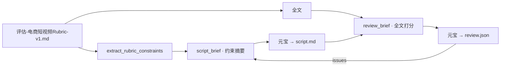
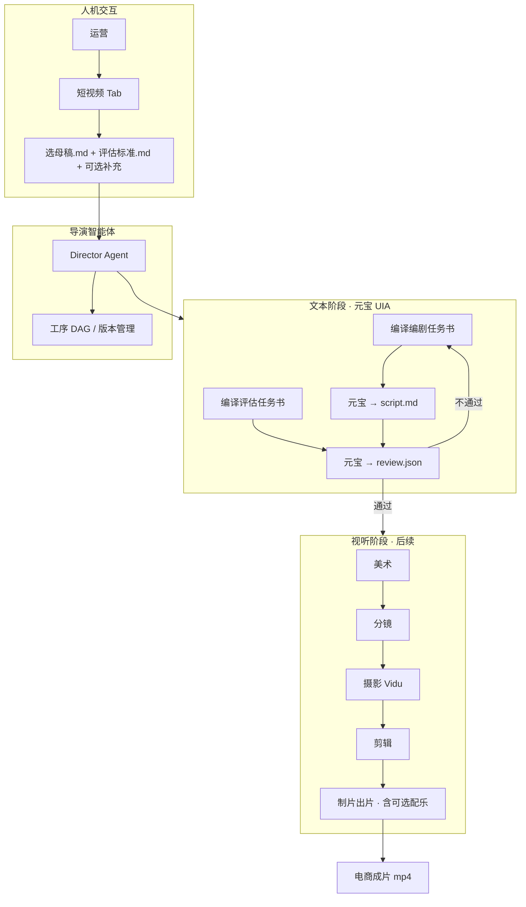

# M7-1 — 短视频创作 · 导演智能体总体方案

> **阶段**：总体设计（各 Skill 详细设计后续单独立项）  
> **状态**：方案初稿 · 2026-07-04  
> **入口**：知识库页新增 Tab **「短视频」**（与投喂学习、知识图谱、文库、上传记录并列）  
> **外部执行**：首期摄影/出片走 [Vidu + SkillHub](环境准备/09-Vidu视频生成-SkillHub接入.md)；导演编排可借助 WorkBuddy  
> **场景定位**：**电商短视频**（种草/带货/商品展示），非影视级长片；配乐要求从简  
> **文本推理**：剧本创作、剧本评估 **首期统一走元宝 UIA**（与 M6-3 写文章同链路，省 DeepSeek 费用）

---

## 一、背景与目标

### 1.1 现状


| 已有能力    | 说明                                             |
| ------- | ---------------------------------------------- |
| 知识图谱    | 子图事实清单、媒体 VLM 描述、跨品关联、勾选索引                     |
| 文库      | 私域母稿 + 小红书/头条/抖音等平台变体                          |
| 生成文案    | 勾选子图 → fact_sheet → 元宝任务书 → 入库预览               |
| Vidu 环境 | SkillHub 安装 `vidu-video-generate-2`，本机 API Key |


**缺口**：文案与视频制作 **割裂**——做剧本时仍需人工回到图谱查素材、手工粘贴；无「影视工序」上的项目化沉淀。

### 1.2 目标


| #   | 目标                                        |
| --- | ----------------------------------------- |
| G1  | 知识库页新增 **「短视频」** Tab，按 **影视制作工序** 组织创作与资产 |
| G2  | **复用** 图谱素材 + 文库文章，不重复录入                  |
| G3  | **生成文案时自动保留创作素材包**，剧本阶段免二次手工贴资料           |
| G4  | **导演智能体 + 专业 Skill 集** 分工协作，人机可介入         |
| G5  | 首期 **Vidu 图/文生视频** 打通 POC；剪辑/多轨后续扩展       |
| G6  | **文本阶段（编剧/评估）走元宝**，剧本与评估结果 **完整入库**可复盘 |


### 1.3 非目标（本期总体方案不写细）

- 各 Skill 的 Prompt / 评估 Rubric 全文（后续 `M7-1-Sx` 单篇）
- 服务端代持 Vidu Key、自动发布抖音
- 替换现有文库 / 图谱 Tab 的行为

---

## 二、知识库页 · Tab 布局

### 2.1 Tab 顺序（商业大类 beauty 等）

```text
投喂学习 | 知识图谱 | 文库 | 短视频 | 上传记录
   local      graph    library  short_video   jobs
```


| Tab     | key               | 变更                 |
| ------- | ----------------- | ------------------ |
| 投喂学习    | `local`           | 不变                 |
| 知识图谱    | `graph`           | 不变；仍为素材勾选与「生成文案」入口 |
| 文库      | `library`         | 不变；母稿/平台版只读引用      |
| **短视频** | `**short_video`** | **新增**             |
| 上传记录    | `jobs`            | 不变                 |


> `主动学习` / `技能策略` 仍仅 `ai_agent` / `agent_skills` 类目显示，与现逻辑一致。

### 2.2 「短视频」Tab 信息架构（首期 UI 骨架）

```text
┌─ 左：项目列表 ─────────────┬─ 中：当前工序 / 产物 ────────┬─ 右：输入与状态 ──┐
│  + 新建短剧项目              │  工序 Stepper               │  关联文库 ▼       │
│  · 尚雅绣体验套种草片        │  ① 剧本 ② 评估 ③ 分镜 …    │  （母稿 .md 只读）│
│                            │  元宝产出预览 + 版本历史      │  评估标准 ▼       │
│                            │                             │  （.md 文件选择） │
│                            │  [补充说明 · 可空]          │  素材包只读       │
│                            │  [可选：补充图片]           │  角色/场景库      │
└────────────────────────────┴─────────────────────────────┴──────────────────┘
```

**人机交互原则（优化定稿）**：

| 输入项 | 形式 | 是否必填 | 说明 |
|--------|------|----------|------|
| **文库母稿** | 系统已有 `.md` 文件 | **是**（或选平台变体 `.md`） | 从下拉选 `work_id`，**读文件路径**，运营 **不手贴全文** |
| **评估标准** | 独立 `.md` 文件 | **是** | 项目创建时选定 **一次**；[S1 注入约束摘要 / S2 注入全文](M7-1-短视频创作-导演智能体总体方案.md#45-评估标准共用编剧--评估) |
| **剧本风格** | 独立 `.md` 文件 | 推荐 | 同上，文件引用 + 版本号 |
| **创作素材包** | JSON + media_refs | 自动 | **即生成母稿当时的「子图事实清单」落盘**（`fact_sheet` 节点/边/media 的 vlm、scene 等 + 图片索引）；生成文案时写入，短剧阶段从母稿 `bundle` **继承**，运营只读、不手贴 |
| **补充说明** | 大文本框 | **否（可空）** | 仅写额外意图，如「多用第 3 张质地特写」 |
| **补充图片** | 上传/选图谱 media | **否** | 文本框为空时可只补图 |

每一工序允许 **人工改稿** 后再进入下一 Skill；改稿仍写回对应 `.md` / `.json` 产物文件。

---

## 三、存储与检索层

### 3.1 四层架构

```text
存储与检索层
├── 对象存储（S3 / MinIO / 本地 staging）— 媒体二进制
│     角色立绘、道具、场景图、分镜板、成片 mp4、工程文件
├── 向量数据库（Chroma · 已有）— 语义检索
│     剧本段落、分镜描述、素材 caption、VLM 描述复用
├── 关系数据库（PostgreSQL · 远期 / 首期 SQLite 元数据）— 结构化元数据
│     项目、工序状态、Skill 版本、评估分数、血缘 ID
└── 缓存层（Redis / 内存 · 远期）— 会话与任务队列
      导演会话、Vidu task_id 轮询、WorkBuddy 任务状态
```

### 3.2 首期 POC 落盘（与现 monorepo 对齐）


| 层级    | 首期实现                                                          | 路径约定                                                          |
| ----- | ------------------------------------------------------------- | ------------------------------------------------------------- |
| 对象存储  | **本地目录** 模拟 MinIO                                             | `{data_root}/{category}/video_projects/{project_id}/`         |
| 向量    | 复用 **Chroma** `knowledge_media` / 新建 `video_asset` collection | `salesagent/data/{category}/chroma`                           |
| 关系元数据 | **JSON + SQLite**（与 article 同级）                               | `salesagent/data/{category}/video_projects/{id}/project.json` |
| 缓存    | Electron 主进程 **Map + 文件锁**                                    | 进程内；Vidu 异步 task 写 `tasks/{task_id}.json`                     |


### 3.3 资产库（美术 Skill 产出）


| 库       | 内容           | 索引键                            |
| ------- | ------------ | ------------------------------ |
| **角色库** | 人设立绘、参考图、提示词 | `character_id`, tags, 关联商品     |
| **道具库** | 产品特写、礼盒、小物件  | `prop_id`, `root_doc_id`       |
| **场景库** | 浴室、梳妆台、直播间等  | `scene_id`, mood, aspect_ratio |


资产 **入库后** 可在分镜/摄影 Skill 中 `@引用`，避免重复生成。

---

## 四、创作素材包（血缘 · 核心新增）

> **统一认识（2026-07-04 拍板）**  
> **知识图谱子图事实清单**（点网 UI「子图事实清单」：`SubgraphFactSheet` / `factSheetBuilder.ts`）  
> **=** 创作素材包 `creation_material_bundle` 的 **核心载荷**（`fact_sheet` + `media_refs`）。  
> 不是另一类东西，而是 **同一份素材的 UI 名 vs 落盘名**。  
> 详细编剧输入与 [M7-1-S1 §二](M7-1-S1-编剧Skill方案.md) **完全一致**。

> **痛点**：现「生成文案」只存 `root_doc_ids` + `fact_sheet_hash`，**未存完整 fact_sheet**（清单日志）。做短剧时无法继承当时 media/vlm/scene，须 **M7-1b 先落盘**。

### 4.1 素材包定义 `creation_material_bundle`

在 **M6-3 文案入库** 与 **M7 短剧项目** 之间增加统一结构：

```json
{
  "bundle_id": "bundle_20260704_001",
  "created_at": "2026-07-04T16:00:00+08:00",
  "source": "graph_compose | library_import | manual",
  "root_doc_ids": ["goods_23", "goods_25"],
  "fact_sheet_hash": "sha256:…",
  "fact_sheet": {
    "entries": [
      {
        "seq": 4,
        "kind": "media",
        "source": "l0",
        "node_id": "niushop_product_59_media_0",
        "url": "https://…",
        "vlm_description": "银色礼盒…",
        "use_cases": "回答包装与实物对比"
      }
    ],
    "summary": {
      "node_count": 28,
      "edge_count": 45,
      "root_doc_count": 2,
      "media_count": 14
    }
  },
  "graph_snapshot": {
    "root_doc_ids": ["goods_23", "goods_25"],
    "nodes": [],
    "edges": [],
    "media": [],
    "chunks": []
  },
  "media_refs": [
    {
      "node_id": "media_…",
      "url": "https://…",
      "vlm_description": "…",
      "use_cases": "…",
      "role_hint": "cover | texture | scene"
    }
  ],
  "user_notes": "短剧阶段可选补充（可空）",
  "supplemental_media_refs": [],
  "writing_brief_md": "可选：生成母稿时《写作任务书》快照",
  "compose_options": { "depth": "l3", "title_formula": "A" },
  "linked_article_ids": ["20260703_163821_未命名文案"]
}
```

| 字段 | 对应 UI / 用途 |
|------|----------------|
| `fact_sheet.entries` | **子图事实清单** 全文（document/section/media/边；含 vlm、scene） |
| `media_refs` | 从 entries 抽取的图片索引，供剧本 Beat「素材提示」、摄影 Vidu img2video |
| `graph_snapshot` | 可选：完整子图快照，供 bundle 重建 / 审计 |
| `writing_brief_md` | 生成母稿时任务书，审计「当时喂给元宝什么」 |

**Sidecar 落盘**：`articles/{category}/{article_id}.bundle.json`（见 [S1 §0.2](M7-1-S1-编剧Skill方案.md)）。

### 4.2 写入时机


| 时机                   | 动作                                                                         |
| -------------------- | -------------------------------------------------------------------------- |
| **生成文案 · 点击「开始生成」前** | 客户端序列化当前子图 fact_sheet + 勾选 media → 暂存 session                              |
| **元宝入库成功**           | `article.json` 增加 `creation_material_bundle` 字段（或 sidecar `*.bundle.json`） |
| **文库选文创建短剧**         | 从母稿/变体 **继承** bundle；若无 bundle（历史数据）则从 `root_doc_ids` **重建** L0 fact_sheet |
| **短视频 Tab 手动新建**     | 选文库 `.md` + 选评估标准 `.md` + 可选补充说明/图片 → 新建 bundle |

### 4.3 编剧 Skill 输入（文件引用 · 非手贴正文）

```text
编剧 Skill 输入 =
  ① 文库母稿文件          articles/{category}/{work_id}.md     ← 系统读取，不手贴
+ ② 创作素材包            creation_material_bundle             ← 自动
+ ③ 评估标准文件          standards/评估-电商短视频Rubric-v1.md  ← 下拉选文件
+ ④ 剧本风格文件          standards/风格-美妆种草60s-v1.md       ← 下拉选文件
+ ⑤ 补充说明（可空）      user_notes 文本框
+ ⑥ 补充图片（可空）      supplemental_media_refs / 本地上传
+ ⑦ 修订指令（第 2+ 轮）  review.json.issues[]
```

③ **评估标准** 与 S2 评估 Skill **共用同一 `.md` 文件**（见 [§4.5](#45-评估标准共用编剧--评估)）：编剧阶段注入 **约束摘要**，评估阶段注入 **全文打分**。

④ 风格文档存 `{data_root}/{category}/video_projects/_standards/*.md`；`project.json` 记录 `review_rubric_path` / `style_doc_path`，**项目创建时选定，两阶段不变**。

### 4.5 评估标准共用（编剧 + 评估）

> **目的**：运营在 **创建短剧项目时** 选定 **一份** Rubric 文件；**编剧阶段提前注入约束**，减少评估退回；**评估阶段用同一文件全文打分**，标准不漂移。

**一份文件 · 两次用法**：

| 阶段 | Skill | 任务书 | Rubric 怎么进 Prompt | 作用 |
|------|-------|--------|----------------------|------|
| **编剧** | S1 | `script_brief_{ts}.md` | **`extract_rubric_constraints()` 摘要**（约 800–1200 字） | 写剧本时的 **硬约束 + 自检清单**（非打分） |
| **评估** | S2 | `review_brief_{ts}.md` | **`rubric.md` 全文** + `script.md` 全文 | **七维打分 + 一票否决 + JSON 契约** |

**摘要须覆盖**（与 [Rubric v1.2](M7-1-standards/评估-电商短视频Rubric-v1.md) 同源，由编译器自动抽取，不手剪）：

- §〇 铁三角（商业锚点优先 / 合规红线 / 内容质量）
- 商业锚点三要素 + **展示 Beat 产品镜头必填**
- **一票否决**完整列表
- 推荐时长 30–60s、Beat 结构要点
- 通过线 ≥72 分（让编剧有预期）

**不注入编剧任务书的内容**（留给评估阶段）：九维打分表空白、JSON 契约示例、加分项细评——避免任务书过长、干扰创作。

**版本与路径绑定**（全项目一致）：

```json
{
  "review_rubric_path": "video_projects/_standards/评估-电商短视频Rubric-v1.md",
  "rubric_version": "v1.2"
}
```

写入：`project.json`、`script.meta.json`、`review.json.rubric_file` + `rubric_version`。

**退回闭环**：S2 `review.json.issues[]` → 下一轮 S1 任务书「修订指令」+ 可追加相关 Rubric 段落；**不换 Rubric 文件**（除非运营改项目配置）。

**共享编译模块**（实施）：

| 模块 | 路径 |
|------|------|
| `load_rubric` / `extract_rubric_constraints` | `salesagent/.../knowledge/rubric_compiler.py` |
| 客户端 fallback | `ditingclient/.../electron/services/rubric_compiler.ts` |
| S1 调用 | `script_brief_compiler` → 注入「评估约束摘要」节 |
| S2 调用 | `review_brief_compiler` → 注入「评估标准（全文）」节 |



### 4.4 元宝文本阶段 · 产出物入库

剧本创作、剧本评估 **复用 M6-3 元宝 UIA 链路**（`yuanbao_article` 子进程或 sibling `yuanbao_video_script`）：

```text
编译《编剧任务书.md》→ 元宝新建对话 → 粘贴发送 → UIA 复制回复
  → ingest script.md + script.meta.json

编译《评估任务书.md》→ 同上 → ingest review.md + review.json
```

**必须落盘**（每个 `video_project` 目录下）：

| 产物 | 路径 | 内容 |
|------|------|------|
| 编剧任务书 | `briefs/script_brief_{ts}.md` | 发给元宝的完整 Prompt |
| 剧本正文 | `artifacts/script.md` | 元宝回复 Markdown |
| 剧本元数据 | `artifacts/script.meta.json` | `source=yuanbao_desktop`, `brief_hash`, `created_at` |
| 评估任务书 | `briefs/review_brief_{ts}.md` | 含剧本全文 + Rubric 文件引用 |
| 评估报告 | `artifacts/review.md` | 元宝结构化评语（人类可读） |
| 评估结果 | `artifacts/review.json` | `{ score, pass, issues[], rubric_file, rubric_version }` |
| 会话日志 | 复用 `data/logs/yuanbao_video_{date}.log` | 与写文章同目录规范 |

评估 **不通过**（`pass: false`）时：导演 Agent 将 `review.json.issues` 写入下一轮编剧任务书，**保留历史版本**（`artifacts/script_v1.md`, `script_v2.md`…），不覆盖。

> **本期不用 DeepSeek** 做剧本/评估；服务端 `article/compose` 不参与此链路。

---

## 五、智能短视频创作架构

### 5.1 模式：导演智能体 + 专业技能集



**导演职责**（可借助 [WorkBuddy](环境准备/skillhub.md) 或 Cursor Agent 会话实现）：

- 读取项目状态 JSON，决定 **当前工序**
- **文本阶段**：触发元宝子进程，等待 UIA 复制，**ingest 剧本/评估** 到 `artifacts/`
- **评估不通过 → 退回编剧**（issues 写入下一轮 brief，保留 `script_vN` 历史）
- **视听阶段**：调度 Vidu 异步 task、成本登记
- 写 **director_log** 供 Tab UI 展示

### 5.2 Skill 一览（电商短视频 · 总体职责）

> **文本类 Skill** 首期引擎 = **元宝 UIA**；**视听类** 首期 = Vidu + 手工/半自动剪辑。

| Skill | 职责 | 主要输入 | 主要输出 | 引擎 | 首期 |
|-------|------|----------|----------|------|------|
| **编剧** | 电商短剧剧本 + 旁白 | 母稿 + 素材包 + 风格 `.md` + **Rubric 约束摘要** + 可选补充 | `script.md` + `script.meta.json` | **元宝** | P1 |
| **剧本评估** | 按 **同一 Rubric 全文** 打分 | `script.md` + **同一** `review_rubric_path` | `review.md` + `review.json` | **元宝** | P1 |
| **美术** | 演员/道具/场景 **Prompt + 参考图** | 锁定剧本 + 素材包 + 提示词规范 `.md` | 角色/场景/道具库（Prompt 元宝生成 · 图豆包人工） | **元宝 UIA + 豆包人工** | P2 |
| **分镜** | 镜头序列、运镜、情绪标签 | 剧本 + 分镜规则 `.md` | `storyboard.json` | 元宝或规则引擎 | P2 |
| **摄影** | 镜头片段生成 | 分镜 + 美术资产 | `clips/*.mp4` | **Vidu** | P1 POC |
| **剪辑** | 时间线组装、字幕 | clips | `timeline.json` / 粗剪 mp4 | 本地 / 开源 | P3 |
| **制片出片** | 成本调度、Vidu 多轨合成、**可选简单 BGM** | 各轨 + 配额 | 最终成片 + 成本报表 | **Vidu compose** | P2 |

**配乐处理（电商级，非影视级）**：

- **不单独设必选「配乐 Skill」**；默认由 **制片出片** 一并处理（Vidu 多轨 `audio` 轨或平台自带 BGM 模板）。
- 若项目勾选 **「启用配乐增强」**（可选开关），再调用轻量 **配乐子步骤**：分镜情绪标签 → 选 BGM / Vidu TTS 口播，**不阻塞主链路**。
- 影视级原创配乐、音效设计 → **远期**，本期不做。


### 5.3 分镜 Skill 能力要点（用户原文沉淀）

- 抽取 **意图、人物、场景、情绪** 标签
- 长文本 → **场景序列 → 镜头序列**
- 自动生成 **故事板草图 / 低分辨率预览**
- 支持叙事模板，例如：  
`情绪铺垫 → 对峙升级 → 情绪爆发 → 余韵收束`
- 分镜规则、优秀案例 → **独立文档**，Skill 只引用不硬编码

### 5.4 摄影 Skill · 工具链


| 阶段     | 工具                                     | 说明                                       |
| ------ | -------------------------------------- | ---------------------------------------- |
| **首期** | [Vidu](环境准备/09-Vidu视频生成-SkillHub接入.md) | text2video / img2video / ref2video / 首尾帧 |
| 远期     | 更多视频 API、特效合成                          | 插件化 `video_backend` 接口                   |
| 剪辑远期   | GitHub 开源 **AI video-edit** 类项目        | 全自动剪辑 POC，单独评估许可证                        |


### 5.5 制片出片 Skill（含可选配乐）

| 能力 | 默认 | 可选 |
|------|------|------|
| Vidu 积分登记 / 排队 | ✅ | — |
| 多轨 compose（video + subtitle + effect） | ✅ | — |
| 简单 BGM / 平台模板音 | ✅ 合并进制片 | — |
| 独立配乐精调、音效设计 | — | 勾选「启用配乐增强」 |
| 成本上限确认 | ✅ 批量 shooting 前 | — |

首期 POC：**单镜头 img2video** + 制片登记 task；多轨与 BGM 在 M7-2 打通。

---

## 六、工序状态机（项目级）

```text
draft → scripting → script_review → script_approved
  → art → storyboard → shooting → editing → production → delivered
                      ↑ fail      ↑ async Vidu
        script_review ─┘ (退回编剧，元宝重跑)
```

| 状态 | 用户可见 | 执行方式 |
|------|----------|----------|
| `scripting` | 剧本生成中 | **元宝** UIA → `script.md` |
| `script_review` | 评估中 | **元宝** UIA → `review.json` |
| `script_approved` | 剧本锁定 | — |
| `shooting` | 镜头生成中 | Vidu 异步 |
| `production` | 合成出片中 | 制片出片（含可选 BGM） |
| `delivered` | 已交付 | 预览 / 导出 |


每个状态产出物路径写入 `project.json` 的 `artifacts` 字段，导演 Agent 只读此文件推进。

---

## 七、与现有模块的关系

```text
                    ┌───────────────┐
                    │  知识图谱 Tab  │
                    │ 勾选 · fact_sheet │
                    └───────┬───────┘
       │────────────────────│ 生成文案时写入 bundle
       ▼                   ▼
┌──────────────┐    ┌───────────────┐    ┌────────────────┐
│ 知识子图的    │    │   文库 Tab     │◄───│  短视频 Tab     │
│ 原始素材资    │───►│ 母稿/平台版    │    │ 选文 · 工序 ·  │
└──────────────┘    └───────┬───────┘    │ 出片预览        │
                            │            └────────┬───────┘
                            │  inherit bundle      │
                            └──────────────────────┘
```


| 模块                  | 关系                                  |
| ------------------- | ----------------------------------- |
| M6-3-1 fact_sheet   | 素材包核心来源；**需扩展入库字段**                 |
| M6-3-2 文库           | 母稿 `.md` 文件路径；「创建短剧项目」入口 |
| M6-3 yuanbao_article | **编剧/评估复用同一 UIA 子进程模式** |
| M6-2 `video_script` | 与「编剧 Skill」合并演进；地图卡片可跳转短视频 Tab      |
| M2-2 媒体 VLM         | `media_refs.vlm_description` 供美术/分镜 |
| 09-Vidu 环境          | 摄影 Skill 后端                         |


---

## 八、数据模型草案 `video_project`

```json
{
  "project_id": "vp_20260704_001",
  "category": "beauty",
  "title": "尚雅绣体验套 · 60s 种草",
  "status": "scripting",
  "linked_work_id": "20260703_163821_未命名文案",
  "linked_article_md": "articles/beauty/20260703_163821_未命名文案.md",
  "linked_platform": "wechat_private",
  "creation_material_bundle_id": "bundle_20260704_001",
  "style_doc_path": "video_projects/_standards/风格-美妆种草60s-v1.md",
  "review_rubric_path": "video_projects/_standards/评估-电商短视频Rubric-v1.md",
  "rubric_version": "v1.2",
  "user_notes": "",
  "supplemental_media_refs": [],
  "text_engine": "yuanbao_desktop",
  "artifacts": {
    "script": "artifacts/script.md",
    "script_meta": "artifacts/script.meta.json",
    "script_versions": ["artifacts/script_v1.md", "artifacts/script_v2.md"],
    "review": "artifacts/review.md",
    "script_review": "artifacts/review.json",
    "storyboard": "artifacts/storyboard.json",
    "clips": ["artifacts/clips/001.mp4"],
    "final": "artifacts/final.mp4"
  },
  "briefs": {
    "script_latest": "briefs/script_brief_latest.md",
    "review_latest": "briefs/review_brief_latest.md"
  },
  "director_log": [],
  "created_at": "…",
  "updated_at": "…"
}
```

存储根：`salesagent/data/{category}/video_projects/{project_id}/`

---

## 九、标准文档库（与 Skill 解耦）


| 文档类型 | 示例路径 | UI 用法 |
|----------|----------|---------|
| 剧本风格方向 | `…/_standards/风格-美妆种草60s-v1.md` | **文件下拉** |
| **剧本评估标准** | `…/_standards/评估-电商短视频Rubric-v1.md` | **文件下拉** |
| 美术提示词规范 | `…/_standards/美术-提示词规则-v1.md` | 美术工序选用 |
| 分镜规则 + 案例 | `…/_standards/分镜-规则与案例.md` | 分镜工序选用 |

`project.json` 存 **`review_rubric_path` / `style_doc_path`**（相对 data_root），便于复现与 diff。

---

## 十、实施分期


| 期         | 交付                                                    | 依赖          |
| --------- | ----------------------------------------------------- | ----------- |
| **M7-0**  | 本文档 + [09-Vidu 环境](环境准备/09-Vidu视频生成-SkillHub接入.md) 验收 | —           |
| **M7-1a** | 知识库 Tab `short_video` 骨架；项目 CRUD；选文库 + 素材包展示          | M6-3 文库 API |
| **M7-1b** | **文案入库写 `creation_material_bundle`**；历史母稿可重建 bundle   | M6-3-1      |
| **M7-1c** | 编剧 + 评估：**元宝 UIA** + 任务书/剧本/评估 **全量落盘**；UI 选母稿.md + 评估标准.md | M6-3 yuanbao 子进程 |
| **M7-1d** | 摄影 POC：Vidu img2video → 项目内预览 | 09-Vidu |
| **M7-2** | 美术 + 分镜；**制片出片**（含默认 BGM） | M7-1d |
| **M7-3** | 剪辑；可选「配乐增强」子步骤 | M7-2 |


**WorkBuddy / 导演 Agent**：M7-1c 起用 Cursor Agent + Skill 目录原型；是否接 WorkBuddy IPC **后续单独立项**。

---

## 十一、风险与约束


| 风险                 | 缓解                                            |
| ------------------ | --------------------------------------------- |
| Vidu 异步、URL 2h 过期  | 摄影 Skill **生成即下载** 到 `video_projects`         |
| 历史文库无 bundle       | 从 `root_doc_ids` 重建；补充说明/图片 **可空** |
| Skill 过多、Prompt 漂移 | 标准文档版本化 + `project.json` 记录引用版本               |
| 成本不可控              | 制片 Skill 单次上限；导演 Agent 需 confirm 再批量 shooting |
| 开源剪辑许可证            | 剪辑 Skill 选型单独法务/技术评审                          |


---

## 十二、后续 Skill 详细设计文档（占位）


| 文档                     | 状态  |
| ---------------------- | --- |
| M7-1-S1 编剧 Skill（元宝） | [方案定稿](M7-1-S1-编剧Skill方案.md) |
| M7-1-S2 剧本评估 Skill（元宝） | [方案定稿](M7-1-S2-剧本评估Skill方案.md) |
| M7-1-S3 美术 Skill | [方案定稿](M7-1-S3-美术Skill方案.md) |
| M7-1-S4 分镜 Skill | 待写 |
| M7-1-S5 摄影 Skill（Vidu） | 待写 |
| M7-1-S6 剪辑 Skill | 待写 |
| M7-1-S7 制片出片 Skill（含可选配乐） | 待写 |
| M7-1-S0 导演智能体 | 待写 |


---

## 十三、修订记录


| 版本   | 日期         | 说明                                                |
| ---- | ---------- | ------------------------------------------------- |
| v0.1 | 2026-07-04 | 初稿：短视频 Tab、存储层、导演+Skill 架构、创作素材包血缘、与 M6-3/Vidu 衔接 |
| v0.2 | 2026-07-04 | 优化：母稿/评估标准改 **文件引用**；补充说明可空；文本阶段 **元宝** + 剧本/评估全量落盘；电商场景 **制片与配乐合并** |
| v0.5 | 2026-07-04 | §4.5 评估标准共用（S1 约束摘要 / S2 全文）；project.json 时长与 rubric_version 对齐 |
| v0.4 | 2026-07-04 | 明确子图事实清单 = 创作素材包 fact_sheet；与 S1 编剧输入拉齐 |
| v0.3 | 2026-07-04 | 链入 S1/S2 方案与 [评估 Rubric v1](M7-1-standards/评估-电商短视频Rubric-v1.md) |


