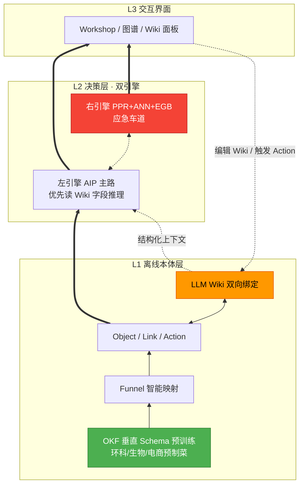
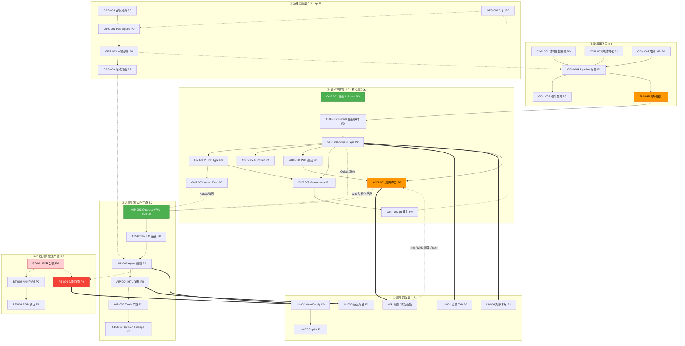
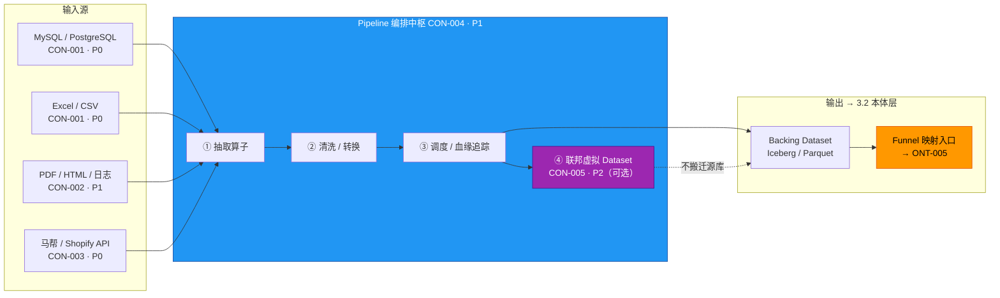
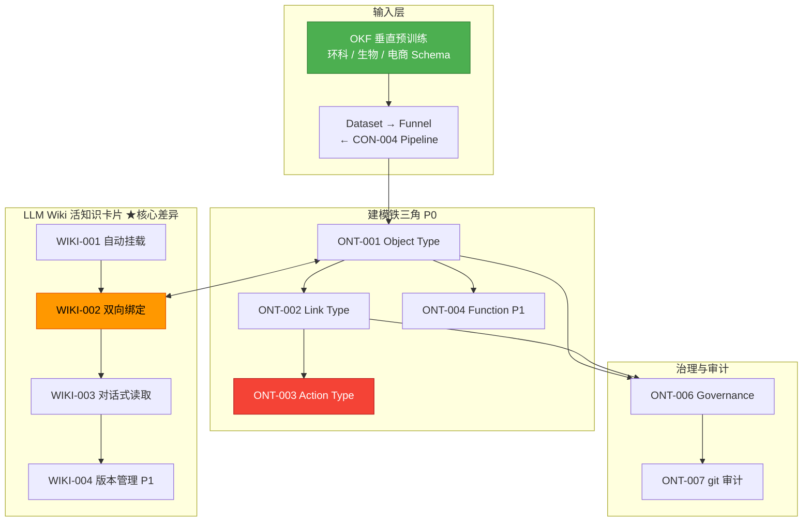
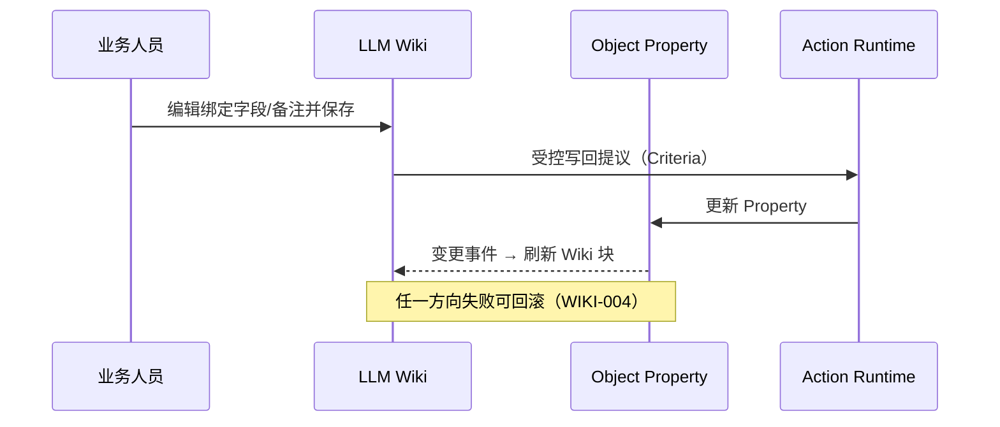
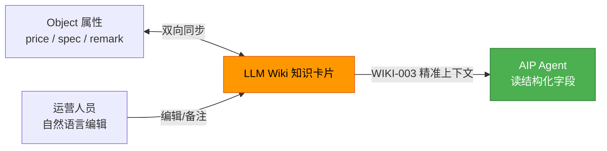
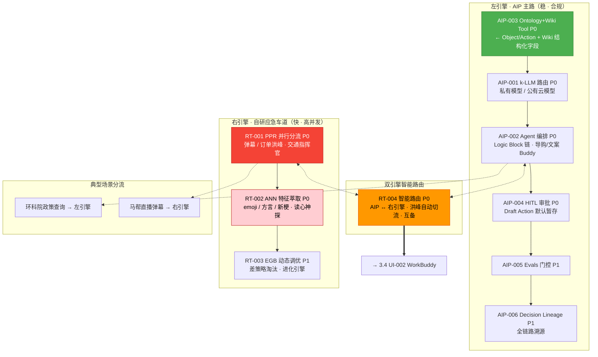
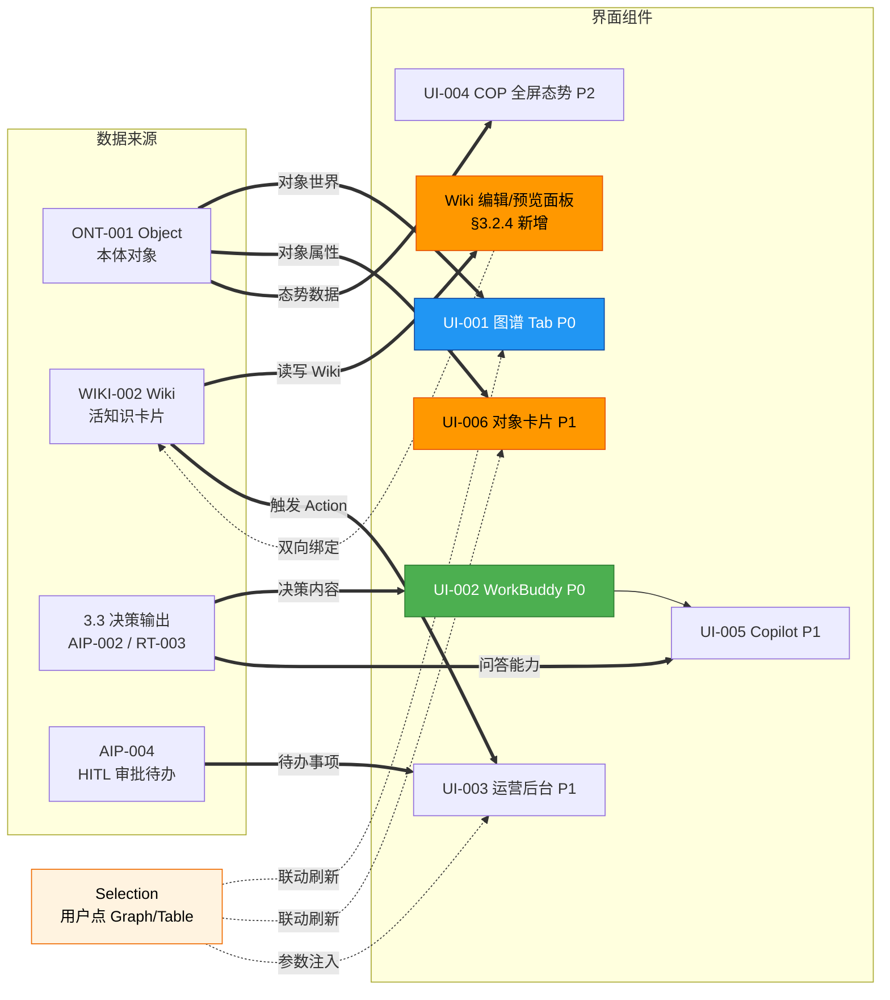
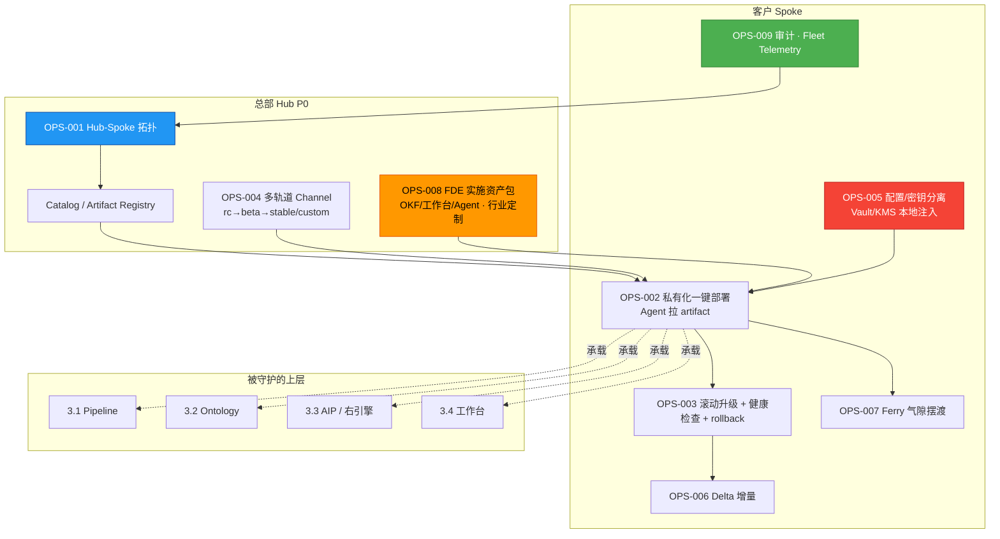

# 第三部分 · 对标 Palantir 的企业级 AI 操作系统（AOS）PRD 框架

> **文档名称**：《对标 Palantir 的企业级 AI 操作系统（AOS）产品需求文档》  
> **版本**：v1.6.1 框架 · 2026-07-17（口径：目标态工程仅 AIP；右引擎为产品备忘 · 对齐 20_tech）  
> **状态**：可直接复制为 PRD 骨架 · 括号内为填写提示或示例

---

## 1. 文档概述

### 1.1 背景

为了提升企业数据决策效率，缩小与国际领先水平的差距，本项目对标 **Palantir Foundry + AIP + Apollo** 构成的企业级 AI 操作系统（AOS），结合国内场景（高并发电商、政策合规、私有化部署）打造自主可控的 **「数据融合 · 业务建模 · AI 决策 · 持续运维」** 一体化平台。

### 1.2 目标


| 目标    | 衡量指标                    | 对标 Palantir       |
| ----- | ----------------------- | ----------------- |
| 数据融合  | 接入 N 类数据源，血缘可追溯         | Foundry Pipeline  |
| 业务建模  | 核心对象类型 ≥ X，Action 可执行   | Ontology          |
| AI 决策 | Agent 上线 Evals 通过率 ≥ Y% | AIP               |
| 持续运维  | 私有化部署升级零停机              | Apollo            |
| 人机协同  | 业务人员零代码使用 Workshop 级界面  | Workshop + Assist |


### 1.3 范围

- **In Scope：** L1 本体层 · L2 双引擎决策层 · L3 交互界面 · 运维底座
- **Out of Scope（v1）：** 全量 200+ Connector · 全球气隙舰队 · 国防级 Gotham 全功能

### 1.4 读者

产品 · 架构 · 研发 · 商务 · 老板

---

## 2. 总体架构设计

### 2.1 总链路图

> 插入 [01-全链路总览 §2.1](01-Palantir全链路总览.md) 竖向价值链图

```text
[底层基石 Apollo] 持续交付与运维
          |
[中台核心 Foundry] 数据接入 → Ontology 本体 → 应用构建
          |
[顶层大脑 AIP] 生成式 AI + Agent + k-LLM 调度
          |
[最终形态] 人类 + AI 协同决策
```

### 2.2 谛听差异化架构（双引擎 L2 + OKF / LLM Wiki 增强）

> 对标 Palantir 但不简单复制 —— **L2 双引擎并行**，**L1 植入 OKF + LLM Wiki** 形成垂直领域智能，降低本体建模门槛、提升 Agent 推理精度。

```text
L3 交互界面（对标 Apollo + Workshop）
    ↑ 读写 Wiki · 触发 Action · 展示决策结果
L2 决策层：左 AIP 主路（检索→生成）‖ 右 自研引擎应急车道（过滤→提纯→快决策）
    ↑ 依赖 Object / Action / Link · 左引擎优先读 Wiki 结构化字段
L1 离线本体层（对标 Foundry Ontology）
    ↑ OKF 垂直 ETL 预训练 + Funnel 智能映射
    ↑ LLM Wiki 双向绑定 Object（活的知识卡片）
```




| 差异化点  | Palantir 做法       | 谛听增强                         |
| ----- | ----------------- | ---------------------------- |
| L1 接入 | 通用 ETL，手工配 Schema | **OKF 垂直预训练**，接入效率 ↑80%      |
| L1 知识 | 静态 Document 挂载    | **LLM Wiki 活卡片**，双向绑定 Object |
| L2 决策 | 单一 AIP 链路         | **双引擎并行**，洪峰右引擎补位            |
| L3 交互 | Workshop 对象视图     | Workshop + **Wiki 编辑面板**     |


详见 [04-谛听对标武器谱](04-谛听对标武器谱.md)

### 2.3 非功能需求


| 类别  | 要求                                    |
| --- | ------------------------------------- |
| 性能  | 常规咨询 P95 < 3s；直播弹幕分流 P95 < 100ms（右引擎） |
| 安全  | 行列权限 · Action 审批 · 审计日志 · 私有化部署       |
| 可用性 | 核心服务 SLA ≥ 99.9%                      |
| 扩展  | Land-and-Expand：Pilot → 部门 → 企业       |


---

## 3. 子系统功能需求

> **读图顺序：** 先看 §3.0 全局依赖总图把握层间关系，再逐层展开 §3.1～§3.5 子系统大图。

### 3.0 子系统全局依赖总图

**核心逻辑：** 3.1 喂 3.2 → 3.2 的 Object/Action/Wiki 是 3.3 的「弹药」→ 3.3 的决策结果是 3.4 的「内容」→ 3.5 兜住全链路安全与交付。OKF（绿）降低 L1 建模成本，LLM Wiki（橙）为左引擎 AIP 提供精准结构化上下文。




| 依赖关系        | 说明                                         |
| ----------- | ------------------------------------------ |
| 3.1 → 3.2   | Pipeline 输出经 FUNNEL + OKF 智能映射进入 Ontology  |
| 3.2 OKF     | 垂直 Schema 预制菜，接入效率较通用 ETL ↑80%             |
| 3.2 Wiki    | 每个 Object 挂载活 Wiki，双向同步属性                  |
| 3.2 → 3.3 左 | Object + Action + **Wiki 字段** = Agent 精准弹药 |
| 3.3 双引擎     | RT-004 智能路由：主路 AIP ↔ 应急右引擎互备               |
| 3.3 → 3.4   | 决策结果 + Wiki 面板 + 审批待办驱动交互层                 |
| 3.5 → 全链路   | 部署、密钥、审计兜住 3.1～3.4                         |


---

### 3.1 数据接入层（Connector / Pipeline）

**对标：** Foundry Pipeline Builder

#### 架构图




#### 依赖说明


| 要点         | 说明                                        |
| ---------- | ----------------------------------------- |
| **P0 先行**  | CON-001 / CON-003 先打通 电商 Demo             |
| **P1 补强**  | CON-002 非结构化服务环科院 / 湃肽 PDF 文献场景           |
| **中枢地位**   | CON-004 编排器汇聚全部数据源，是 3.1 的核心枢纽            |
| **P2 可延后** | CON-005 联邦查询 MVP 可先做物理同步，架构留虚拟 Dataset 口子 |


| 需求 ID   | 描述                                   | 优先级 | 验收标准           |
| ------- | ------------------------------------ | --- | -------------- |
| CON-001 | 支持结构化数据源（MySQL/PostgreSQL/Excel/CSV） | P0  | 增量同步 + 调度      |
| CON-002 | 支持非结构化（PDF/HTML/日志）                  | P1  | 解析入库可检索        |
| CON-003 | 支持电商平台 API（马帮/Shopify 等）             | P0  | 商品/订单/库存对象可映射  |
| CON-004 | 可视化 Pipeline 编排                      | P1  | 拖拽算子 + 血缘预览    |
| CON-005 | 联邦查询（不搬迁源库）                          | P2  | 虚拟 Dataset 可查询 |


**界面要求：** 左数据源树 · 中算子画布 · 右预览与血缘

---

### 3.2 语义本体层（Ontology）【核心更新区】

**对标：** Foundry Ontology Manager · Object Data Funnel (Hydration) · **谛听增强：OKF 垂直 ETL + LLM Wiki 双向绑定**

> **产品方案详稿（必读）：**  
>
> - [06 · Ontology Mapping 产品方案](06-语义本体Ontology-Mapping产品方案.md) — Funnel 四阶段 · OMA 六视图 · 多源解法 A/B/C · Iceberg 契约 · OM-01~08 Backlog  
> - [06a · Ontology Mapping 线框图](06a-语义本体Ontology-Mapping产品设计线框图.md) — WF-OM-01~08 · WF-FN-01  
> - **HTML Demo**：`[foundry/html/ontology.html](foundry/html/ontology.html)`（Discover）· `[ontology-funnel.html](foundry/html/ontology-funnel.html)`（四阶段 Pipeline）· `[funnel.html](foundry/html/funnel.html)`（OKF 映射）

#### 架构图




#### 依赖说明


| 要点            | 说明                                            |
| ------------- | --------------------------------------------- |
| **强依赖 3.1**   | Funnel 入口必须等 Pipeline 产出 Dataset              |
| **OKF 差异化**   | 垂直 Schema 预制菜，较 Palantir 通用 ETL 接入效率 ↑80%     |
| **铁三角 P0**    | 无 Object / Link / Action，3.3 AI 与 3.4 交互均无法启动 |
| **Wiki 核心差异** | 静态 Document → **活知识卡片**，机器可读、人机双向一致           |
| **IP 保护**     | ONT-007 git 审计 + WIKI-004 版本回滚，**必须 P0/P1**   |


---

#### 3.2.1 基础 Ontology 建模（对标 Foundry）


| 需求 ID   | 描述                          | 优先级 | 验收标准                                | 详稿 / Demo                                      |
| ------- | --------------------------- | --- | ----------------------------------- | ---------------------------------------------- |
| ONT-001 | Object Type 定义（属性/主键/显示名）   | P0  | 商品/订单/功效概念可建模                       | 06 §2·§9 · OM-02 · Demo `ontology-object.html` |
| ONT-002 | Link Type 定义（关系/方向/基数）      | P0  | 商品-功效-订单可链接                         | 06 §6 解法 B · OM-04 · `ontology-link.html`      |
| ONT-003 | Action Type（写操作 + 权限 + 副作用） | P0  | 改价/补货 Action 可审批执行                  | [06b](06b-Action与Function产品设计.md) · `ontology-action.html` |
| ONT-004 | Function 注册（确定性计算）          | P1  | 库存周转率等可调用                           | [06b](06b-Action与Function产品设计.md) · `ontology-function.html` |
| ONT-005 | Funnel 映射（Dataset → Object） | P0  | Changelog→Merge→Index→Hydration 自动化 | 06 §4–§5 · OM-07 · `ontology-funnel.html`      |
| ONT-006 | Governance（Markings/RBAC）   | P1  | 行列权限裁剪生效                            | 06 后续补齐                                        |
| ONT-007 | git 版本审计（OKF Bundle）        | P0  | 变更可追溯可回滚                            | 06 OM-08 · `ontology-branches.html`            |


**核心数据模型示例（跨境电商）：**

```text
Object: Product, Concept, Order, Listing, Customer
Link:   mentions, belongs_to, purchased, competes_with
Action: update_price, restock, publish_listing, escalate_to_human
```

---

#### 3.2.2 【新增】OKF 垂直 ETL 预训练（L1 增强）

> **价值说明：** Palantir Foundry 是通用 ETL，Schema 需手工逐字段配置；OKF 是**领域预训练 ETL**，在环科/生物/电商场景接入效率提升约 **80%**，无需人工从零定义字段。


| 需求 ID   | 描述                                                  | 优先级 | 验收标准                                          | 详稿 / Demo                                                    |
| ------- | --------------------------------------------------- | --- | --------------------------------------------- | ------------------------------------------------------------ |
| OKF-001 | **垂直 Schema 预制菜**：内置环保、生物医药、跨境电商等行业标准字段模板           | P0  | 环科项目无需手工建污染物字段；湃肽项目无需手工建氨基酸字段                 | Demo `funnel.html` 行业切换 |
| OKF-002 | **Funnel 智能映射**：预训练模型自动推荐 Dataset 列 → Object 属性映射关系 | P0  | 导入 Excel 时自动识别「CAS No.」→ 映射到 `Product.cas_no` | Demo `funnel.html?industry=env` |
| OKF-003 | **脏数据自动清洗**：行业字段专属纠错规则（化学式格式、电商 SKU 编码等）            | P1  | 分子式大小写自动纠正；SKU 首尾空格自动去除                       | Demo `funnel.html` OKF-003 面板 |


| 行业预制菜 | 典型 Object                         | 典型字段                 |
| ----- | --------------------------------- | -------------------- |
| 环科院   | Pollutant, Regulation, Enterprise | CAS号、排放限值、适用法规       |
| 湃肽/生物 | Peptide, AminoAcid, Batch         | 序列、纯度、批号             |
| 跨境电商  | Product, Listing, Concept         | SKU、功效、平台 Listing ID |


---

#### 3.2.3 【新增】LLM Wiki 双向绑定知识卡片（核心差异）

> **价值说明：** Palantir Document 是**静态死文档**——LLM 难以精准调用、易幻觉。LLM Wiki 是**活知识卡片**：机器可精确读字段、业务人员可自然语言编辑，与 Object **双向绑定**保证人机数据一致，是左引擎 AIP 可靠推理的根基。


| 需求 ID    | 描述                                                                              | 优先级 | 验收标准                                                 | Demo |
| -------- | ------------------------------------------------------------------------------- | --- | ---------------------------------------------------- | ---- |
| WIKI-001 | **Wiki 挂载**：每个 Object（如 Product）自动生成/挂载对应 Wiki 页面                               | P0  | 点击商品对象，侧边栏展示 Wiki 知识卡片                               | `ontology-wiki.html` 左栏 |
| WIKI-002 | **双向绑定机制**：① Object 属性变更 → Wiki 内容自动刷新；② Wiki 人工编辑/备注 → 反向更新 Object 指定 Property | P0  | 改商品价格同步到 Wiki；Wiki 写「备注：近期缺货」→ 回写 Object `remark` 字段 | 「双向绑定」Tab 模拟按钮 |
| WIKI-003 | **对话式接口**：Wiki 结构化存储，LLM 直接读字段推理（非全文向量检索）                                       | P0  | Agent 调用时读 `specification` 等字段；基于 Wiki 内容回答用户问题      | 「Agent 读字段」Tab |
| WIKI-004 | **版本管理**：每次人工编辑与自动同步均版本化，支持回滚                                                   | P1  | 误操作后可回滚 Wiki 内容及关联 Object 属性                         | 「版本」Tab |


##### WIKI-002 双向绑定 · 技术定义（必须写透）

> **核心差异：** 不是「挂一篇说明文档」，而是 **Wiki ↔ Object Property 双向同步**，保证人机同一真相。

```text
方向 A（系统 → 人）：Object 属性变更（Action / Funnel / 导入）
  → 订阅变更事件
  → 按字段映射表刷新 Wiki 结构化块（及可选叙述段模板）
  → 写 Wiki 版本（auto-sync）

方向 B（人 → 系统）：业务人员在 Wiki 编辑绑定字段 / 备注
  → 保存时校验可写 Property + 权限 Marking
  → 生成 **Action 提议或受控写回**（禁止 LLM/Wiki 引擎直写底层存储）
  → Object 属性更新 → 触发方向 A 的一致性确认
```



| 规则 | 说明 |
| --- | --- |
| **字段级映射** | 哪些 Wiki 块 ↔ 哪个 Property 在 OMA 配置；未映射块仅人文叙述，不回写 |
| **冲突** | 同字段短窗双写 → 以带版本号的 **Last-Write-Wins + 审计**；关键字段可升人工仲裁 |
| **与 AIP** | Agent **只读** Wiki 结构化字段做推理；写回仍走 Action（高风险护栏 §7） |





---

#### 3.2.4 界面要求

**布局：Ontology Manager 六视图（对齐官方 OMA · 详稿 06 §9 / 06a）**


| 视图 / 区域                                        | 内容                                                                        | 说明 · Demo                      |
| ---------------------------------------------- | ------------------------------------------------------------------------- | ------------------------------ |
| **Discover**                                   | 收藏 / 最近 / 重要 Object                                                       | OM-01 · `ontology.html`        |
| **Object Overview**                            | 7 Tab：Overview / Properties / Actions / Links / Dependents / Data / Usage | OM-02 · `ontology-object.html` |
| **Property / Link / Action / Function Editor** | 嵌套编辑器                                                                     | OM-03~06 · 对应 HTML 页           |
| **Funnel Datasources**                         | 四阶段进度 · Live/Replacement                                                  | OM-07 · `ontology-funnel.html` |
| **Wiki（谛听增强）**                                 | 属性面板旁 Wiki 编辑/预览                                                          | WIKI-001~004 · Demo `ontology-wiki.html` |


**交互原则（在 06a 基础上保留 Wiki）：**

- 选中 Object → Overview 六区块 + Data Tab 看 Funnel；点 Property 进编辑器
- Wiki 保存 → 触发 WIKI-002 双向同步（与 Object Property 并列）
- 图谱节点右键 → 「打开 Wiki」「触发 Action」
- 旅程 E：`funnel.html` → `ontology-object.html` → `ontology-funnel.html`

---

### 3.3 AI 决策层（AIP 主路 + 自研右引擎备忘）

**对标：** AIP k-LLM + **AIP Logic / Chatbot Studio**（原 Agent Studio）+ **谛听右引擎（产品备忘，非本期目标态工程范围）**

> **口径分层（与技术方案自洽 · 强制）：**  
> - **目标态工程 / [`20_tech`](20_tech/00-技术方案索引.md)**：对外与实现 **仅「AIP 人工智能平台」**（原左引擎）；**不**将右引擎写入 T07/实现排期。  
> - **本文 §3.3.2 及 RT-***：保留为 **产品分期备忘 / 洪峰场景叙事**（标题已标「请忽略」于实现）；启用前须另开产品+技术方案变更，不得与 20_tech 混谈为「已立项实现」。  
> - **左引擎必读产品详稿：** [07 · AIP 产品方案](07-AIP引擎k-LLM与AgentStudio产品方案.md)

> **产品方案详稿（AIP 必读）：** [07 · AIP 引擎产品方案](07-AIP引擎k-LLM与AgentStudio产品方案.md)  
> — Logic Blocks · Draft/提案 · Decision Lineage · 与 [06b Action](06b-Action与Function产品设计.md) 写回契约

#### 架构图




#### 依赖说明


| 要点         | 说明                                                                |
| ---------- | ----------------------------------------------------------------- |
| **左引擎**    | 强依赖 3.2 的 ONT-001 / ONT-003 + **WIKI-002/003**（Wiki 结构化字段优先于向量检索） |
| **路由前置**   | AIP-001 k-LLM 须在 Agent 编排前就绪（模型权限 + 成本管控）                         |
| **右引擎 P0** | RT-001 / RT-002 是直播场景生命线，缺则系统必崩                                   |
| **双引擎灵魂**  | RT-004 智能路由向老板证明：**不是替代 AIP，是并列互备**                               |
| **链路对比**   | 左：检索 → 生成；右：过滤 → 提纯 → 快决策                                         |


#### 3.3.1 左引擎 · AIP 主路


| 需求 ID   | 描述                          | 优先级 | 验收标准                                                          | 详稿 / Demo |
| ------- | --------------------------- | --- | ------------------------------------------------------------- | ----------- |
| AIP-001 | k-LLM 模型路由（私有/公有云模型）        | P0  | 敏感数据不走公网模型                                                    | [07 §6.2](07-AIP引擎k-LLM与AgentStudio产品方案.md) |
| AIP-002 | Agent 编排（Logic Block 链）     | P0  | 导购/文案 Buddy 可配置                                               | [07 §3–§4](07-AIP引擎k-LLM与AgentStudio产品方案.md) · AIP Logic |
| AIP-003 | **Ontology + Wiki Tool 绑定** | P0  | Agent 可调取 Object 属性；**优先读取 LLM Wiki 结构化字段进行逻辑推理**，而非仅依赖向量全文检索 | [07 §6.5](07-AIP引擎k-LLM与AgentStudio产品方案.md) · Wiki Demo |
| AIP-004 | HITL 审批流                    | P0  | Draft Action 默认暂存                                             | [07 §5.1](07-AIP引擎k-LLM与AgentStudio产品方案.md) · Automate 提案 |
| AIP-005 | Evals 门控                    | P1  | 上线前评测集通过                                                      | [07](07-AIP引擎k-LLM与AgentStudio产品方案.md) · AIP Evals |
| AIP-006 | Decision Lineage            | P1  | 每次决策可溯源（含 Wiki 字段来源）                                          | [07 §5.2](07-AIP引擎k-LLM与AgentStudio产品方案.md) |


> **AIP-003 强化说明：** Agent 推理路径为 `Object 属性 → Wiki 结构化字段 → k-LLM 推理 → Action 提议`。Wiki 提供比 RAG chunk 更精准的上下文，显著降低幻觉率与 Token 成本。

**适用场景：** 政策查询 · 常规客服 · 标准化推荐

#### 3.3.2 右引擎 · 自研实时决策（**产品备忘 · 目标态工程请忽略**）

> **实现范围：** 不在 [`20_tech` / T07](20_tech/T07-AIP人工智能平台详细技术方案.md)。洪峰场景若未来立项，另开变更；当前验收与里程碑 **只认 AIP**。


| 需求 ID  | 描述                | 优先级 | 验收标准           |
| ------ | ----------------- | --- | -------------- |
| RT-001 | PPR 并行模式识别（多车道分流） | P0  | 弹幕/订单洪峰不阻塞     |
| RT-002 | ANN 特征萃取（语义理解）    | P0  | emoji/方言/新梗可识别 |
| RT-003 | EGB 动态调优（策略演化）    | P1  | 差策略自动淘汰        |
| RT-004 | 智能路由（AIP ↔ 右引擎切换） | P0  | 洪峰自动切流互为备份     |


**适用场景：** 直播间弹幕 · 大促洪峰 · 毫秒级分流

---

### 3.4 应用交互层（Workshop / 交互界面）

**对标：** Workshop + AIP Chat/Assist + Apollo 可视化交付  
**详稿：** [08-Workshop产品方案](08-Workshop产品方案.md)

> 官方：Workshop 以 **Object 层**为构建块；Actions 写回；Functions 承载对象上业务逻辑；应用形态含 **Inbox** 与 **COP（Common Operational Picture）**，目标接近定制 React 体验，而非典型仪表盘。  
> 来源：[Workshop Overview](https://www.palantir.com/docs/foundry/workshop/overview/)

#### 3.4.1 Workshop 画布结构（Module / Section / Widget）

```text
Workshop App
├── Module（独立业务场景页：运营台 / 知识图谱 / Flight Inbox）
│   ├── Section（纵向分区 · 可折叠 · 可条件显隐 · 可配列宽）
│   └── Widget（最小可视化/交互单元）
└── …
```

Widget 按能力六类（对齐官方 Core display / Visualization / Filtering / Events / Embed）：

| 类别 | 官方 Widget | 对应 PRD |
| --- | --- | --- |
| 对象展示 | Object Table / Object View / Object List | UI-006 |
| 关系可视化 | Graph（+ Map） | UI-001 |
| 交互操作 | Button Group + Action / Action Form | UI-003 |
| 图表分析 | Metric Tile / Chart / Quiver Embed | UI-004 态势指标 |
| AIP 嵌入 | AIP Chat / 嵌入式 Copilot | UI-002 / UI-005 |
| 布局容器 | Tab / Column / Filter List / Conditional Section | — |

**Workshop ↔ L2/L3 绑定（官方）**

| Workshop 概念 | 绑定实体 | 说明 |
| --- | --- | --- |
| Object Table / View | ONT-001 | 列/字段 = Object Property |
| Graph | ONT-002 | 边 = Link，节点 = Object |
| Action Form | ONT-003 | 表单参数 = Action 输入 schema |
| Chart / Metric | ONT-004 | 聚合值 = Function 结果 |
| AIP Chat | AIP-002 | Context = Selection + Ontology |
| Wiki 面板 | WIKI-001~004 | 嵌在 Object View 侧边（行业定制增强） |

#### 3.4.2 变量联动（Selection 驱动）

Workshop **不做 SQL 查询面板**，做**变量传递**：

- **Selection / Active object**：用户当前焦点 Object / Object Set（Graph 点节点 → Table 焦点行）
- **Selected objects**：多选勾选集（批量 Action）
- **Object Set Filter**：Filter List 输出，供下游 Table 消费

典型链路：`用户操作 → Selection 更新 → Object View / 下游 Widget 刷新 → Action 参数自动注入`。  
**L2 Object = 变量类型定义；Selection = 运行时实例。**

#### 3.4.3 AIP 在 Workshop 的两种嵌入

| 模式 | 形态 | 对应 | 说明 |
| --- | --- | --- | --- |
| A · AIP Chat Widget | 独立侧边栏/底栏 | UI-002 WorkBuddy | Context 注入 Selection + Ontology；支持 @Buddy 委托 |
| B · 嵌入式 Copilot | 附着表格/卡片/表单旁 | UI-005 | 流程内提问，不切窗口（Assist 交互隐喻；运行时走业务 Agent + AIP-003） |

两种模式共享 Ontology+Wiki Tool；写回须顶层 **Action**（见 06b / 07）。

#### 架构图




#### 依赖说明


| 要点          | 说明                                                |
| ----------- | ------------------------------------------------- |
| **对象驱动**    | UI-001 / UI-006 强依赖 3.2 Object——无本体则退回裸表格         |
| **变量驱动**    | Selection 联动 Object View / Action 参数——Workshop 灵魂箭头 |
| **Wiki 驱动** | Wiki 编辑/预览面板（§3.2.4）读写活知识卡片，可触发 Action 写回 Object  |
| **决策驱动**    | UI-002 / UI-005 消费 3.3 双引擎输出（WorkBuddy + Copilot） |
| **审批驱动**    | UI-003 运营后台绑定 AIP-004 HITL，是运营核心动作界面              |
| **发布驱动**    | Workshop 造应用 · Apollo（§3.5）发应用                     |
| **可延后**     | UI-004 COP 全屏态势 P2，Phase 1 后期再做                     |


| 需求 ID  | 描述                  | 优先级 | 验收标准           |
| ------ | ------------------- | --- | -------------- |
| UI-001 | 图谱 Tab（对象关系可视化）     | P0  | PPR 传导路径可展示    |
| UI-002 | WorkBuddy 数字员工界面    | P0  | @Buddy 委托任务    |
| UI-003 | 运营操作后台              | P1  | Action 审批/执行   |
| UI-004 | 数字孪生大屏（COP）         | P2  | Workshop 全屏 + Graph/Map + Metric + 实时 Selection（供应链/库存态势） |
| UI-005 | 嵌入式 Copilot（Assist） | P1  | 自然语言查 Ontology |
| UI-006 | 对象卡片视图（非表格）         | P1  | 绑定 Ontology 属性 |


**界面原则：** 展示对象世界，不是裸数据表 · Application ≠ Dashboard

---

### 3.5 运维底座层（Apollo 对标）

**对标：** Apollo Hub-Spoke · Continuous Delivery OS（Run Anywhere）  
**详稿：** [09-Apollo交付引擎产品方案](09-Apollo交付引擎产品方案.md)

> 官方：Apollo 是独立于应用的持续交付层，使同一套 SaaS 可跑在公有云 / 私有化 / 气隙；视为「第三平台」。  
> 来源：[Apollo Blog](https://blog.palantir.com/palantir-apollo-powering-saas-where-no-saas-has-gone-before-7be3e565c379)

#### 架构图



#### 依赖说明

| 要点 | 说明 |
| --- | --- |
| **骨架** | OPS-001 Hub-Spoke——Run Anywhere 的拓扑前提 |
| **密钥先行** | OPS-005 必须在打镜像/发包前就绪，密钥不出客户库 |
| **气隙** | OPS-007 Ferry——断网客户必问项 |
| **差异化** | OPS-008 实施资产通道——OKF/模板 **交给客户**，非黑盒 |
| **审计** | OPS-009 与 ONT-007 / Change Management 对齐 |

| 需求 ID | 描述 | 优先级 | 对标 Apollo |
| --- | --- | --- | --- |
| OPS-001 | Hub-Spoke 拓扑（Hub 可自管；Remote Hub 管气隙） | P0 | Hub-Spoke |
| OPS-002 | 私有化一键部署（Spoke Agent 拉 Plan/artifact） | P0 | Spoke Agent |
| OPS-003 | 安全升级：Probe · 维护窗口 · 自动 rollback | P1 | Plan · Constraints |
| OPS-004 | 多轨道 Channel + 健康晋升；失败 Recall | P2 | Release Channel |
| OPS-005 | 密钥分离 + Config Override（版本区间） | P0 | Secrets · Overrides |
| OPS-006 | Delta 增量发布（Ferry 场景必需） | P1 | Delta Deployment |
| OPS-007 | Ferry / Bundle 气隙摆渡 | P1 | Air-gapped Bundle |
| OPS-008 | FDE 实施资产发布（OKF / 工作台 Module / Agent） | P0 · 行业定制增强 | Implementation Artifact |
| OPS-009 | 审计 + Reported State + Change Management | P0 | Observability · Change Mgmt |

> 旧 v1.3 编号语义迁移见 [09 §5.1](09-Apollo交付引擎产品方案.md)。

---

### 3.6 交付模式分层（产品化 + FDE 实施双轨）

**对标：** Palantir License（native 软件）+ FDE 人天（业务建模）  
**详稿：** [09 §1 / §7](09-Apollo交付引擎产品方案.md)

**认知纠偏：** native 交付 = 标准化安装包发到客户环境；**≠** 客户开箱即完成业务建模。

```mermaid
graph LR
    subgraph PROD["产品化 · Native 交付（Apollo 发）"]
        P1["L1: Data Connection / PB"]
        P2["L2: Ontology Manager / Funnel"]
        P3["L3: 工作台 / AIP Chat"]
        P4["OPS: Apollo Hub"]
    end

    subgraph FDE["FDE 实施（驻场人天）"]
        F1["L1: 客户 Pipeline 建模<br/>（OKF 预制菜加速）"]
        F2["L2: Object/Link/Action 配置"]
        F3["L2: Wiki 初始挂载"]
        F4["L3: 工作台 Module 首搭"]
        F5["AIP: Agent 首配 + Evals"]
    end

    subgraph HANDOVER["梯度移交客户自助"]
        H1["Phase 0: FDE 主导"]
        H2["Phase 1: 业务方自助抬头<br/>OKF+Wiki 降门槛"]
        H3["Phase 2: 以 native 为主"]
    end

    PROD --> FDE
    FDE --> HANDOVER

    style FDE fill:#ff9800,stroke:#e65100,color:#000
```



#### 交付分工表

| 层 | 产品化组件（给客户） | FDE 实施内容 | 移交节奏 |
| --- | --- | --- | --- |
| L1 | Data Connection / PB 画布 | Connector / 清洗 / OKF 映射 | Phase 1 → 客户数据团队 |
| L2 | OMA / Funnel 状态 | Object/Link/Action + Wiki 挂载 | Phase 1 → 业务架构师 |
| L2 增强 | OKF 预制菜 / Wiki 双向绑定 | 选行业模板微调 | **上线即自助（核心差异）** |
| L3 | 工作台 / AIP Chat | 首 Module + 首 Agent | Phase 1 → 业务人员复制 |
| OPS | Apollo Hub | 私有化 + 升级管道 + 资产包 | 长期 IT 自助 |

**老板口径：** 底层软件（L1/L2/AIP/L3+Apollo）native 标准化交付；业务建模初期 FDE 驻场；靠 OKF+Wiki 把人天从「纯从零 Ontology」压短，Phase 1 后客户可自助搭工作台——**软件钱照收，实施更快更便宜。**

#### FDE 资产版本管理（与 Apollo Release Channel 绑定）

| 规则 | 说明 |
| --- | --- |
| **同绑** | OKF 模板 · Workshop Module · Agent 配置打包为 **Asset Bundle**，与平台 **Release Channel** 版本区间绑定（详 [09 §6.1](09-Apollo交付引擎产品方案.md)） |
| **升级同步** | Spoke 拉升平台版本时，**自动拉取绑定资产版本**并解压部署；避免「平台升了、资产失效」 |
| **破坏性变更** | Object Schema 大版本（如新增必填）→ 资产与平台须经 Beta 验证；**禁止生产 Channel 跨大版本裸升**（见 §7） |

---

### 3.7 MVP 边界说明（预期管理 · 强制）

> 避免客户把试用/MVP 当成「已建成全量 AOS」。与 [10_v01](10_v01/10-v0.1技术方案.md) 试用版、目标态 [20](20_tech/20-AOS整体技术方案.md) 对齐。

| 维度 | **MVP / 桌面试用支持** | **明确不支持（留目标态）** |
| --- | --- | --- |
| 知识问答 | 本地 PDF/Office/文本上传问答 · 引用溯源 | 百万级 Dataset 交互分析 |
| 编排 | 简单 Workflow / Agent 问答路径 | 全量 AIP Logic 工厂 + L4 无人值守 |
| 本体 | 左栏对象雏形 / mock 或最小 Object | 完整 OMA + Funnel 生产水合 |
| 工作台 | 三栏壳 / 固定页预览 | Module 画布工厂全量 Widget |
| 并发 | 单机/小团队 | **多用户高并发**生产租户 |
| 交付 | 本机 Docker / Lite 路径 | **气隙 Ferry 舰队**、全量 Hub 多 Spoke |
| 话术 | 「本机可追溯问答 / 数据不出厂」 | **禁止**宣称已建成 Ontology/Workshop/Apollo 全栈 |

---

## 4. 里程碑与交付


| 阶段 | 周期 | 交付 | **客户自助度（量化）** | 对标 |
| --- | --- | --- | --- | --- |
| **Phase 0 POC** | 2 周 | 50 SKU 本体雏形 + 导购问答 + 对比报告 | 业务方可完成 **金牌题问答**；**不要求**自建 Widget | Palantir Pilot |
| **Phase 1 MVP** | 3 月 | OKF + Wiki 双向绑定 + AIP 主路径 + 图谱/工作台子集 | 业务人员可 **自主搭建 ≤3 个 Widget** 的固定 Module；可改 **Wiki 绑定字段备注** | 部门扩展 |
| **Phase 2 年框** | 持续 | 多源接入增强 + 边权/运维 SLA + Apollo 通道 | 业务方可 **自主修改 Agent Prompt**（经 Evals 门禁）；IT 可 **自助升 Lite/Full Spoke** | Enterprise |


---

## 5. 风险与依赖（更新）


| 风险                  | 缓解                                             |
| ------------------- | ---------------------------------------------- |
| **Ontology 建模成本高**  | OKF 模板 + 预制菜 + **LLM Wiki 降低人工录入门槛** |
| **大模型幻觉 / 成本高**     | **LLM Wiki 提供精准结构化上下文** + 评测门禁 / 路由策略（右引擎若启用见 04/M7-6，目标态技术方案可分期）  |
| 纯 AIP 高并发卡顿         | 性能护栏 · 分页 · 熔断（07）· 可选快路径 |
| 私有化交付复杂             | 走 Apollo Hub-Spoke + Ferry + **Lite Spoke**（详 09）；密钥 Vault/KMS |
| Wiki 与 Object 数据不一致 | WIKI-002 双向绑定技术定义 + WIKI-004 版本回滚                  |
| FDE 人天过重              | OKF 预制菜 + Wiki + OPS-008 Asset Bundle 压短交付周期        |
| 客户预期过高 | **§3.7 MVP 边界** 合同/试用说明同款 |


---

## 6. 高风险护栏（技术方案必避坑 · 写错难回头）

| ID | 护栏 | 说明 |
| --- | --- | --- |
| HR-01 | **禁止 LLM 直写 Ontology** | 所有写回必须走 **Action**；Logic 只生成提议。工程上强制校验（禁止直调写接口） |
| HR-02 | **Funnel Backing Dataset 唯一** | 一个 ObjectType **仅一个** Curated Dataset；多源须先 L1 Join（解法 A） |
| HR-03 | **Apollo Channel 不跨破坏性大版本裸升** | Schema breaking → 必须 Beta 验证；否则 FDE 资产失效 |
| HR-04 | **AOS Adapter 层** | MVP 的 Dify/OpenOcta 必须经 Adapter 适配成 AIP 标准接口；换脑不换 Workshop |
| HR-05 | **全链路血缘强制采集** | Dataset → Object → Widget → Action 写回，不允许跳过血缘埋点 |


---

## 7. 附录

- [01-全链路总览](01-Palantir全链路总览.md)
- [02-四大金刚拆解](02-四大金刚与子产品拆解.md)
- [04-谛听对标武器谱](04-谛听对标武器谱.md)
- [08-工作台 Workshop](08-Workshop产品方案.md)
- [09-Apollo 交付引擎](09-Apollo交付引擎产品方案.md)
- [10_v01 试用方案](10_v01/10-v0.1技术方案.md) · [20 整体技术方案](20_tech/20-AOS整体技术方案.md)
- [M7-5 学习笔记](../ref/M7-5-Palantir学习笔记与谛听三层架构白皮书.md)
- [M7-6 实时决策架构](../ref/M7-6-高性能实时决策架构方案.md)
- [Palantir-Apollo 深度解析](../ref/Palantir-Apollo-深度解析.md)

---

*第三部分 · PRD 框架 v1.6 · OKF + Wiki + AIP + 工作台 + Apollo 交付双轨 · MVP 边界 · 高风险护栏*