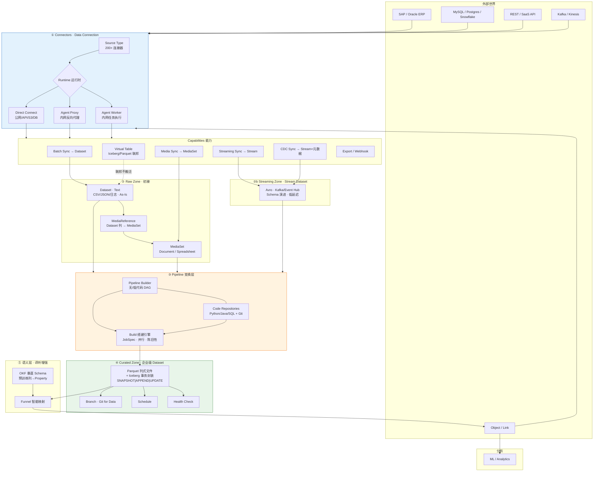
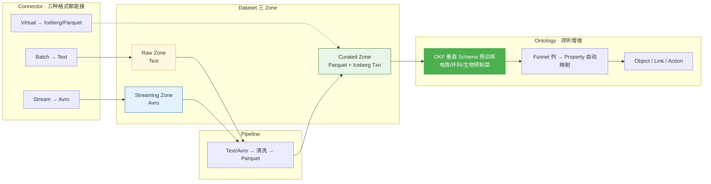
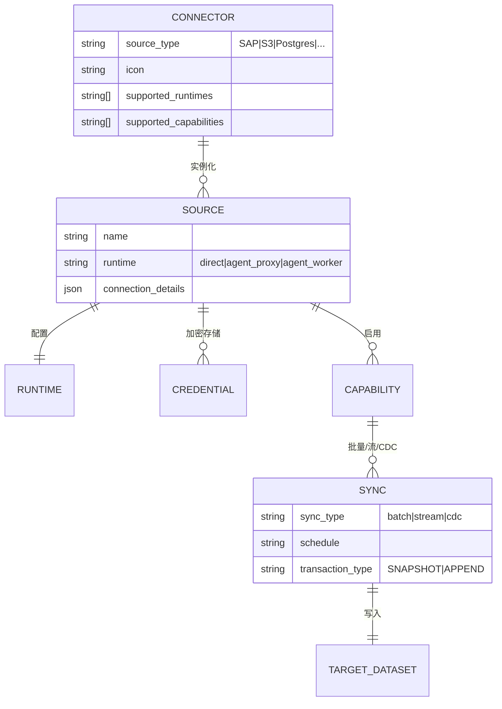
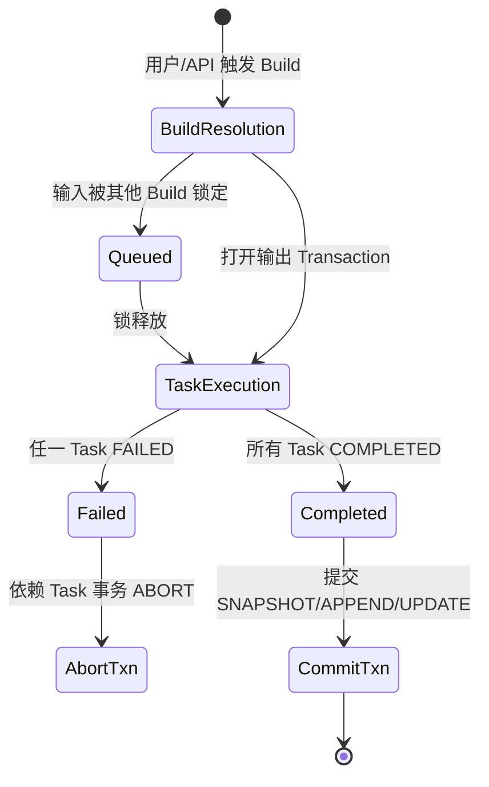
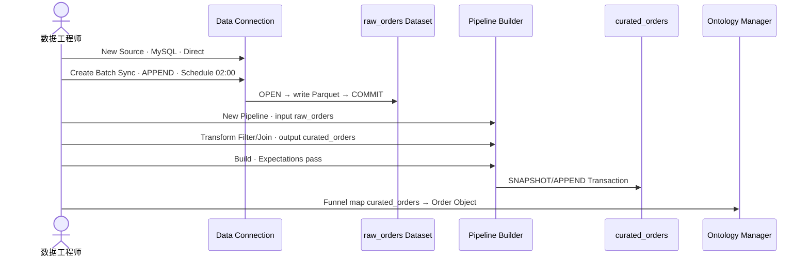

# 05 · Data Integration 产品方案

## Connectors → Pipeline → Dataset (Iceberg / Parquet)

> **文档性质**：对标 Palantir Foundry **Data Integration（数据集成）** 层的产品设计 · 含组件图 · 页面线框 · 交互流程  
> **版本**：v1.4 · 2026-07-16  
> **状态**：可直接作为 PRD 子章节 / 研发 UI 规格 / PPT 素材  
> **v1.4 变更**：总图补 MediaReference · 小文件短路(<128KB) · DocIntel 死信；前序：
> **v1.3 变更**：§2.3 增补 MediaSet · MediaReference · 存储路由；§3.5 四类解析路径；§9 页面清单增补 MS/PB-LLM · 链 [05b 非结构化补充](05b-非结构化数据存储与接入路径补充方案.md)  
> **v1.2 变更**：§2.1 增补「L1 全域数据接入与治理基座」三阶段链路说明 · 共用 vs 个性对照  
> **v1.1 变更**：新增 §2.3 三 Zone 存储格式选型 · §2.4 3.1 闭环（OKF Funnel）· 总链路图对齐 Raw/Streaming/Curated  
> **对标来源**：[Data Integration Overview](https://www.palantir.com/docs/foundry/data-integration/overview) · [Data Connection](https://www.palantir.com/docs/foundry/data-connection/overview) · [Pipeline Builder](https://www.palantir.com/docs/foundry/pipeline-builder/overview) · 本地镜像 `[foundry/pages/](foundry/pages/)`  
> **关联**：[01 全链路总览](01-Palantir全链路总览.md) · [02 四大金刚 §1.1](02-四大金刚与子产品拆解.md) · [03 PRD §3.1](03-对标Palantir-AOS-PRD框架.md) · **[05b 非结构化补充](05b-非结构化数据存储与接入路径补充方案.md)**

---

## 使用的 Rules


| Rule        | 应用                                |
| ----------- | --------------------------------- |
| 中文回答        | 全文中文                              |
| 先方案后代码      | 本文档即方案交付；**不修改业务代码**              |
| 最小更改        | 仅新增 `docs/palantier/` 文档 + 索引条目   |
| 照抄 Palantir | 机制与页面结构优先引用官方文档；Iceberg 表述与本地镜像一致 |
| 产品图详细设计     | §4–§8 含架构图、页面 ASCII 线框、状态机、用户旅程   |


---

## 1. 产品定位

### 1.1 一句话

**Data Integration 不是「把数据搬进来」，而是把原始数据编译成带权限、Schema、版本、血缘的「企业级数据资产（Dataset）」。**

在 Palantir 语境下，这一层位于 Foundry 最底层、Ontology 之上：

```text
外部系统 ──► Connectors ──► Raw Zone (Text) / Streaming Zone (Avro)
                              │
                              ▼ Pipeline 清洗
                         Curated Zone (Parquet + Iceberg 事务)
                              │
                              ▼ OKF Funnel（谛听增强）
                         Ontology Object ──► AIP / Workshop
```

### 1.2 与上下游边界


| 层级    | 产品                                           | 本方案覆盖                          | 不覆盖                      |
| ----- | -------------------------------------------- | ------------------------------ | ------------------------ |
| L0 接入 | **Data Connection** · Connectors             | ✅                              | —                        |
| L0 变换 | **Pipeline Builder** · **Code Repositories** | ✅                              | —                        |
| L0 存储 | **Dataset** · **MediaSet** · **MediaReference** · Transaction · Branch | ✅ | — |
| L1 语义 | Ontology · Funnel · **OKF**                  | Curated → Funnel 闭环 · OKF 自动映射 | Object/Action 运行时细节 → 另文 |
| L2 决策 | AIP · Agent                                  | —                              | —                        |
| L3 交互 | Workshop                                     | —                              | —                        |


### 1.3 官方设计三原则（Data Connection）

摘自 `[data-connection/overview.md](foundry/pages/zh/foundry/data-connection/overview.md)`：

1. **稳健性**：失败自动重试 · 小批量拉取 · Data Health 告警 · 原样摄取（As-Is Ingest）
2. **可扩展性**：200+ 预置 Connector · 插件化 Source Type · 标准化调度/上传
3. **易用性**：后端抽象复杂度 · 业务用户可点选配置 Sync

---

## 2. 端到端架构（产品图）

### 2.1 总链路（大图）

> **层级命名说明**：本节「**L1 基座**」= Palantir **Data Integration**（Data Connection + Pipeline + Lakehouse），对应谛听 [03 PRD §3.1](03-对标Palantir-AOS-PRD框架.md) 数据接入层；**不等于** Ontology 语义层（见 §1.2 表格中的 L1 语义行）。




#### 2.1.1 【L1 层】全域数据接入与标准化链路 · 详细说明

**核心目标**：打破数据孤岛，将企业全域异构数据（ERP · IoT · 日志 · PDF · SaaS API 等）经**统一管道**，转化为**标准化、可治理、可追溯**的 Raw Data 数据湖资产——并在 Curated 层收敛为带 Schema 与事务的 Lakehouse 表，为下游 OKF Funnel / Ontology 提供稳定输入。

**对标 Palantir 产品组合**：


| L1 基座阶段       | Palantir 对标                                          | 本地镜像                                                                                 |
| ------------- | ---------------------------------------------------- | ------------------------------------------------------------------------------------ |
| 第一阶段 · 物理接入   | **Data Connection** · Connectors · Agent             | `[data-connection/overview](foundry/pages/zh/foundry/data-connection/overview.md)`   |
| 第二阶段 · 标准化清洗  | **Pipeline Builder** · **Code Repositories** · Build | `[pipeline-builder/overview](foundry/pages/zh/foundry/pipeline-builder/overview.md)` |
| 第三阶段 · Raw 沉淀 | **Dataset** · Transaction · Branch · Backing FS      | `[data-integration/datasets](foundry/pages/zh/foundry/data-integration/datasets.md)` |
| Lakehouse 能力  | Iceberg 事务 · Parquet 文件 · Metastore/Lineage          | §2.3 · `[data-lineage/overview](foundry/pages/zh/foundry/data-lineage/overview.md)`  |


**三阶段一览（共用 🔵 vs 个性 🟠）**：

```text
┌─────────────────────────────────────────────────────────────────────────────┐
│  L1 · 全域数据接入与治理基座                                                  │
├──────────────┬──────────────────────┬──────────────────────┬──────────────────┤
│   阶段       │  解决什么问题         │  🔵 平台共用          │  🟠 业务个性      │
├──────────────┼──────────────────────┼──────────────────────┼──────────────────┤
│ ① Connector  │ 数据怎么进来          │ SDK/Adapter·安全·Worker│ Source 实例·频率  │
│ ② Pipeline   │ 数据怎么洗干净        │ 格式收敛·Schema·CDC引擎│ ETL 业务逻辑代码  │
│ ③ Dataset    │ 数据放哪儿            │ Lakehouse·Metastore   │ 分层打标 ODS/DWD  │
└──────────────┴──────────────────────┴──────────────────────┴──────────────────┘
                              │
                              ▼ Curated Parquet+Iceberg 就绪
                    ④ OKF Funnel → Object（§2.4 · 语义层，非本 L1 范围）
```

---

**第一阶段：异构数据的「物理接入」（Connector 层）**

> 大图对应：`① Connectors · Data Connection` → Raw Zone / Streaming Zone


|          | 内容                                                    |
| -------- | ----------------------------------------------------- |
| **阶段目标** | 把数据**原样、安全、可审计**地拉进平台边界；Sync 侧不做业务变换                  |
| **输入**   | ERP · 数据库 · Blob · Kafka · REST API · 内网文件共享          |
| **输出**   | Raw Zone Dataset（Text）或 Streaming Zone（Avro / Stream） |


🔵 **共用机制（Platform Shared）**


| 机制                            | Palantir 对标                          | 说明                                                                                                                                                                         |
| ----------------------------- | ------------------------------------ | -------------------------------------------------------------------------------------------------------------------------------------------------------------------------- |
| **Connector SDK & Adapter 库** | Source Type · 200+ Connectors        | JDBC（ERP/DB）· File System（Excel/PDF/CSV）· MQTT/Kafka（IoT）· REST API；新源类型复用插件框架 `[source-type-overview](foundry/pages/zh/foundry/data-integration/source-type-overview.md)` |
| **统一安全与网络策略**                 | Credential Vault · Egress · Agent    | 凭证加密存储 · Direct / Agent Proxy / Agent Worker 三 Runtime · 出站 HTTPS 单向 `[core-concepts#运行时](foundry/pages/zh/foundry/data-connection/core-concepts.md)`                      |
| **Worker 计算资源池**              | Build Worker · Agent Worker          | Sync / 抽取任务在平台统一管理容器执行；Agent Worker 模式下任务在客户 Linux 主机跑，仍由 Coordinator 编排 `[architecture](foundry/pages/zh/foundry/data-connection/architecture.md)`                        |
| **Capability 标准化**            | Batch / Stream / CDC / Virtual Table | 批量同步 · 流同步 · 变更捕获 · 联邦虚拟表——能力矩阵由平台定义，业务只选开关                                                                                                                                |
| **Data Health & 重试**          | 自动重试 · 小批量拉取 · 告警                    | 稳健性三原则 §1.3；不完整数据阻断下游                                                                                                                                                      |


🟠 **个性化配置（Business Specific）**


| 配置项                | 谁配            | 示例                                                                |
| ------------------ | ------------- | ----------------------------------------------------------------- |
| **Source 实例化**     | 数据工程师 / 业务 IT | Oracle ERP vs SAP ERP；Kafka `topic.sensors.env` vs `topic.orders` |
| **Runtime 选择**     | 架构师           | 公网 S3 → Direct；内网 SAP → Agent Proxy                               |
| **抽取频率与触发**        | 业务 + 运维       | ERP 库存表 **每 5 分钟** Batch SNAPSHOT；IoT 传感器 **毫秒级** Stream Push     |
| **Sync 目标路径**      | 项目规范          | `/Raw/ERP/Inventory` · `/Streaming/IoT/temperature`               |
| **Transaction 策略** | 按数据特性         | 全量表 SNAPSHOT；日志型 APPEND                                           |


**阶段产出验收**：Source 可 Explore · Sync 成功写入 Raw/Streaming Dataset · 血缘记录「哪次 Sync → 哪个 Txn」。

---

**第二阶段：数据的「标准化清洗」（Pipeline 层）**

> 大图对应：`③ Pipeline 变换层` · Text/Avro → Curated Parquet


|          | 内容                                                      |
| -------- | ------------------------------------------------------- |
| **阶段目标** | 无论上游多「脏」、多异构，**Pipeline 输出必须收敛**到平台标准列式格式与统一 Schema     |
| **输入**   | Raw Zone（Text）· Streaming Zone（Avro）· Virtual Table（可选） |
| **输出**   | Curated Zone Dataset（**Parquet 文件 + Iceberg 事务封装**）     |


🔵 **共用机制（Platform Shared）**


| 机制                    | Palantir 对标                     | 说明                                                                                                                                                |
| --------------------- | ------------------------------- | ------------------------------------------------------------------------------------------------------------------------------------------------- |
| **存储格式强制收敛**          | Pipeline Output Write Mode      | 终点 **Curated = Parquet**；流式中间态 **Avro**；初接保留 **Text/CSV**（§2.3 三 Zone）                                                                            |
| **统一 Schema 服务**      | Dataset Schema · 类型系统           | BOOLEAN/STRING/DECIMAL/TIMESTAMP 等 Spark 对齐类型；Schema 挂在 Dataset View 上可演进 `[datasets#模式](foundry/pages/zh/foundry/data-integration/datasets.md)`  |
| **Transform 算子库**     | PB 节点 · PySpark/SQL             | Filter · Join · Aggregate · Window · Expression；类型安全 · 搭建前校验 `[pipeline-builder/overview](foundry/pages/zh/foundry/pipeline-builder/overview.md)` |
| **增量 / 批量 / CDC 引擎**  | SNAPSHOT/APPEND/UPDATE · Stream | 批处理默认 SNAPSHOT；增量 APPEND；CDC 流带变更元数据 `[change-data-capture](foundry/pages/zh/foundry/data-integration/change-data-capture.md)`                    |
| **Build 编排**          | JobSpec · 并行 · 陈旧性 · 分支         | Git 分支 + Dataset 分支绑定；Freshness 跳过未变重建 `[builds](foundry/pages/zh/foundry/data-integration/builds.md)`                                            |
| **数据期望（Expectation）** | 输出 PK/行数检查                      | 不满足则 Build 失败，阻断脏数据 COMMIT                                                                                                                        |


🟠 **个性化配置（Business Specific）**


| 配置项                | 谁写         | 示例                                               |
| ------------------ | ---------- | ------------------------------------------------ |
| **ETL / ELT 业务逻辑** | 数据工程师主战场   | PB 拖拽 DAG 或 Code Repos Python/SQL                |
| **字段清洗规则**         | 领域专家 + 工程师 | 见下方场景举例                                          |
| **Join 维表与业务键**    | 业务定义       | `sku_id` 关联商品维表 · 订单头行拆分                         |
| **调度策略**           | 运维         | 上游 Sync 完成触发 · Cron 02:00 · 与 ERP 窗口对齐           |
| **Write Mode 选择**  | 工程师        | 维度表 SNAPSHOT replace · 事实表 APPEND · 缓慢变化维 UPDATE |


**场景举例（个性逻辑）**：


| 场景           | 上游 Raw                        | 业务 Pipeline 逻辑                                        | Curated 输出                              |
| ------------ | ----------------------------- | ----------------------------------------------------- | --------------------------------------- |
| **环保 · IoT** | 设备日志 Text：`temp=25°C,hum=60%` | 正则提取 `env.temperature=25` · `env.humidity=60` · 单位标准化 | `/Curated/Env/sensor_readings` Parquet  |
| **电商 · ERP** | Excel/CSV 分类列：`数码>手机>苹果`      | Split 为 `category_l1/l2/l3` · 映射标准类目码表                | `/Curated/Ecom/sku_dim` Parquet         |
| **电商 · 订单**  | Raw JSON API 响应               | 扁平化 line_items · 币种 cast · 去重 PK                      | `/Curated/Ecom/orders` Parquet + APPEND |


**阶段产出验收**：Build SUCCESS · Expectation 全过 · Curated Dataset Schema 稳定 · Lineage 可追溯到 Raw Sync。

---

**第三阶段：语义化前的「Raw 数据沉淀」（Dataset / Lakehouse 层）**

> 大图对应：`④ Curated Zone` · 对象存储上的 Parquet + Iceberg · 中央 Metastore


|          | 内容                                                 |
| -------- | -------------------------------------------------- |
| **阶段目标** | 清洗后的数据以**不可变文件 + ACID 事务**形态沉入数据湖；全平台可发现、可授权、可回溯   |
| **输入**   | Pipeline Build 提交的 Transaction                     |
| **输出**   | 注册在 Metastore 的 Dataset · 带 Project/Markings · 血缘边 |


🔵 **共用机制（Platform Shared）**


| 机制                             | Palantir 对标                            | 说明                                                                                                      |
| ------------------------------ | -------------------------------------- | ------------------------------------------------------------------------------------------------------- |
| **Lakehouse 存储底座**             | Backing Filesystem + Parquet + Iceberg | S3/OSS/HDFS 上不可变 Parquet；Iceberg 提供 ACID · 时间旅行 · Schema 演进（§2.3）                                       |
| **Transaction · Git for Data** | OPEN → COMMITTED / ABORTED             | SNAPSHOT / APPEND / UPDATE / DELETE；每次 Pipeline = 一次原子提交                                                |
| **Branch 协作**                  | Dataset Branch + Git Branch            | `master` 生产 · `feature/`* 实验；Build 分支回退链                                                                |
| **中央 Metastore / Catalog**     | Dataset RID · Project 树 · 搜索           | 任意用户可搜表名 · 看 Schema · 看 Owner                                                                           |
| **Lineage 血缘**                 | 列级可选                                   | Sync → Raw → Pipeline → Curated 全链路 `[data-lineage](foundry/pages/zh/foundry/data-lineage/overview.md)` |
| **Retention 保留策略**             | DELETE Txn + 物理清理策略                    | 合规删数 · 降存储                                                                                              |
| **Security**                   | Project · Role · Markings              | 行列权限 · 敏感标签 · Sync 配置也可分支测试                                                                             |


🟠 **个性化配置（Business Specific）**


| 配置项                      | 谁定             | 说明                                   |
| ------------------------ | -------------- | ------------------------------------ |
| **数据分层打标（Data Tiering）** | 数据治理委员会 + 项目规范 | 见下表：ODS/DWD/DWS 与三 Zone 映射           |
| **Project / Folder 归属**  | 项目负责人          | `/Raw/Ecom` vs `/Raw/Env` · 权限隔离     |
| **Markings 敏感标签**        | 安全官            | PII · 财务 · 出口管制                      |
| **Retention 策略**         | 合规             | Raw 保留 365d · Curated 永久 · Stream 7d |
| **Health Check 阈值**      | 数据 Owner       | 行数波动 ±20% 告警 · 空值率上限                 |


**数据分层打标 · 与三 Zone 映射（个性规范 · 平台不强制命名，但提供 Folder 模板）**：


| 业务分层                    | 含义                   | 映射 Zone                  | 典型格式                | 变换程度        |
| ----------------------- | -------------------- | ------------------------ | ------------------- | ----------- |
| **RAW / ODS** 贴源层       | 完全照搬上游，有错也不动         | **Raw Zone**             | Text / 弱 Schema CSV | As-Is       |
| **STG / Streaming** 流缓冲 | 实时接入缓冲               | **Streaming Zone**       | Avro                | 仅格式包装       |
| **DWD** 明细层             | 轻度清洗 · 标准化字段 · 单业务事实 | **Curated Zone**（窄表）     | Parquet + Iceberg   | Pipeline 清洗 |
| **DWS** 服务层             | 宽表 · 聚合 · 跨域 Join    | **Curated Zone**（宽表）     | Parquet + Iceberg   | Pipeline 聚合 |
| **ADS** 应用层             | 面向 Ontology / 报表     | Curated → **OKF Funnel** | Object 属性源          | Funnel 映射   |


```text
ODS (Raw/Text) ──Pipeline──► DWD (Curated/明细/Parquet)
                                  │
                                  ├──Pipeline 聚合──► DWS (Curated/宽表)
                                  │
                                  └──OKF Funnel──► ADS (Object Property)
```

**阶段产出验收**：Dataset 可 Preview · History 可查 Txn · Lineage 完整 · Markings 生效 · 下游 Funnel 可读 Schema。

---

#### 2.1.2 L1 基座 → 语义层边界


| 止步于 L1（本方案）                | 进入 L1.5 / 语义层（§2.4）           |
| -------------------------- | ----------------------------- |
| 标准化 Parquet 列 · 强类型 Schema | 列 → Object Property 业务命名      |
| 技术主键 `order_id`            | 业务语义 `Order.primaryKey`       |
| 数据分层 ODS/DWD/DWS           | OKF Concept · Funnel 自动映射     |
| 平台共用血缘 / 权限                | Ontology Action · Workshop 消费 |


> **一句话**：L1 负责「**同构的数据湖**」；OKF Funnel 负责「**同义的业务对象**」。Foundry 通用路径靠人工 Funnel；谛听在 Curated → Object 缝上植入 OKF 垂直预训练（§2.4）。

### 2.2 数据形态演进（三 Zone）

```text
源系统
    │
    ├─ Batch Sync（As-Is）───────────────► Raw Zone · Dataset · Text（CSV/JSON/日志/表）
    │
    ├─ Media Sync ─────────────────────► Raw Zone · MediaSet（Document / Spreadsheet）
    │
    └─ Stream / CDC Sync ──────────────► Streaming Zone · Avro（Stream Dataset）
                │
                ▼  Pipeline：Apply Schema · Explode · Doc Intel · LLM · 清洗 → Parquet
         Curated Zone · Dataset · Parquet + Iceberg（+ media_ref 列回链 MediaSet）
                │
                ▼  OKF Funnel（谛听）或 手工 Funnel（Foundry 通用）
         Ontology Object（含 MediaReference 属性）──► 业务可执行世界
```

Foundry 官方 `[datasets.md](foundry/pages/zh/foundry/data-integration/datasets.md)` 将结构化 / 半结构化 / 非结构化分层；**非结构化原件**另走 `[media-sets.md](foundry/pages/zh/foundry/data-integration/media-sets.md)`。**MediaReference** 桥接结构化列与非结构化原件。详见 [05b §2–§5](05b-非结构化数据存储与接入路径补充方案.md)。

### 2.3 Dataset 存储格式选型（对标 Foundry 内部机制）


| Zone               | 接入方式                                     | **存储格式**                                            | Schema 策略                                  | Transaction                    | 设计意图                                                                                                              |
| ------------------ | ---------------------------------------- | --------------------------------------------------- | ------------------------------------------ | ------------------------------ | ----------------------------------------------------------------------------------------------------------------- |
| **Raw Zone**       | Connector Batch Sync · 文件/表原样拉取          | **Text**（CSV · JSON · 日志行 · 原始 API 响应）              | 可选弱 Schema；半结构化建议下游推断                      | 通常 **SNAPSHOT**                | **保留原始态、可追溯**；Data Connection 设计原则「原样摄取、不在 Sync 侧做变换」                                                             |
| **Raw Zone（非结构化）** | **Media Sync** · 拖拽上传 · Pipeline 输出     | **MediaSet**（Document：PDF/图/音视频；Spreadsheet：XLSX）   | 创建时选定 schema；**XLSX 须 Spreadsheet 型**         | 媒体集事务 / 非事务两种               | PDF/Excel 等 **不推荐** 仅当普通 Dataset 文件；原件经 **MediaReference** 与 Curated 表关联（[05b §2](05b-非结构化数据存储与接入路径补充方案.md)） |
| **Streaming Zone** | Kafka · Event Hub · Kinesis · CDC Stream | **Avro**（行式 + Schema Registry）                      | **Schema 演进**（add field · compatible read） | Stream 追加；落地后可 **APPEND**      | **低延迟 + 业务模型迭代**；官方 Schema 文件格式含 Avro `[datasets.md#文件格式](foundry/pages/zh/foundry/data-integration/datasets.md)` |
| **Curated Zone**   | Pipeline Builder / Code Repos 输出         | **Parquet**（列式数据文件）+ **Iceberg**（事务 / 快照 / 增量元数据封装） | 强类型表格 Schema；PK · 期望检查                     | **SNAPSHOT / APPEND / UPDATE** | **列式 + 谓词下推**；供 Ontology Funnel · 分析 · ML 消费                                                                      |


**格式分工（一句话）**：

- **Parquet** = Curated Zone 的**物理列式存储**（Foundry 内部 Dataset 默认）
- **Iceberg** = Curated Zone 的**事务与版本封装**（Git for Data · 增量 APPEND · 虚拟表联邦），不是与 Parquet 互斥的二选一

**Pipeline 格式洗炼规则（产品默认）**：


| 输入 Zone                       | 典型 Transform                               | 输出                                   |
| ----------------------------- | ------------------------------------------ | ------------------------------------ |
| Raw · Text                    | `infer_schema` · CSV parser · JSON flatten | 中间 Dataset（仍可为 Text，仅预览）             |
| Raw · Text / Streaming · Avro | cast · dedupe · join · 空值清洗                | **Curated · Parquet**                |
| Streaming · Avro              | 微批窗口聚合 · 流批一体                              | **Curated · Parquet + APPEND**       |
| 外部湖仓 · Virtual Table          | 可选物化或下推                                    | Curated 物化 **Parquet+Iceberg** 或保持虚拟 |


**Connector 侧：三种格式都能接**


| Capability             | 默认落地 Zone     | 格式                                    |
| ---------------------- | ------------- | ------------------------------------- |
| Batch Sync · 文件        | Raw           | Text（CSV/JSON/日志）                     |
| Batch Sync · 表         | Raw 或 Curated | JDBC 可读 Parquet；首接建议 Raw 保留审计         |
| **Media Sync · 媒体**    | **Raw**       | **MediaSet**（Document / Spreadsheet）   |
| Streaming Sync / CDC   | Streaming     | Avro（或 Stream 原生格式 → Pipeline 转 Avro） |
| Virtual Table · S3/GCS | 联邦            | Iceberg / Parquet / Delta 外表          |


### 2.3.1 存储三件套 · 入库路由（摘要）

> 完整规格见 [05b](05b-非结构化数据存储与接入路径补充方案.md) · 线框见 [05a §3.0 / WF-DC-04b / WF-MS-01 / WF-PB-03](05a-数据集成Connectors-Pipeline-Dataset产品设计线框图.md)

| 容器 | 职责 | 典型格式 |
|------|------|---------|
| **Dataset** | 通用表格资产 · Git-for-Data | CSV/JSON/Parquet · **含 media_ref 列** |
| **MediaSet · Document** | 非结构化原件 | PDF · Word* · PPTX* · 图 · 音视频 |
| **MediaSet · Spreadsheet** | 不规则 Excel | XLSX（`schema_type: spreadsheet`） |
| **MediaReference** | Dataset 列 → MediaSet 文件指针 | 维修表 `media_ref` → 原始 PDF |

**数据连接 · 存储路由（入库第一决策）**：

```text
数据连接 (Data Connection)
├── 连接器层（200+ · Snapshot / Append）
├── 存储路由
│   ├── Dataset         → CSV / JSON / DB 表 / 时序落地表
│   ├── 小文件短路(<128KB) → 直接进 Dataset（不进 MediaSet，避免元数据过碎）
│   ├── MediaSet(Doc)   → PDF / Word* / PPTX* / 图 / 音视频（≥128KB 或需原件预览）
│   ├── MediaSet(Excel) → XLSX（spreadsheet schema）
│   └── Stream          → IoT / Kafka / MQTT(β)
├── 解析路径（Pipeline 侧 · Sync 仅提示默认）
│   ├── 结构化   → Apply Schema + 拖拽清洗
│   ├── 半结构化 → Explode 炸开
│   ├── 非结构化 → AIP Doc Intel 五步（OCR→MD→抽字段→校验→回链）
│   └── 时序     → Stream + CDC → Time Series Object
└── 桥接 → MediaReference
```

**硬规则**：`.xlsx` **不可**进 Document MediaSet；一 Object Type **只映射一张** Clean 表；Sync **不做** OCR/LLM。

**小文件短路（补强）：** 单文件 **< 128KB** 且无需原件预览时，可直接落入 Dataset（文本/二进制列或附件字段），**不必**创建 MediaSet 条目，避免元数据碎片化。

**DocIntel 异常 / 死信（补强）：** OCR/解析失败的文件进入 **死信队列（DLQ）**，Pipeline 不因单文件失败整批卡死；支持人工重试/跳过；失败原因写入血缘与健康检查。


### 2.4 3.1 子图闭环 · OKF Funnel 增强

> 对齐 [03 PRD §3.1](03-对标Palantir-AOS-PRD框架.md) 数据接入层；**Connector → Pipeline → Dataset → Funnel → Object** 在此闭合。




**Foundry 通用路径 vs 谛听 OKF 增强**：


| 步骤                       | Palantir Foundry（通用）                                               | 谛听增强（OKF）                                                                                                |
| ------------------------ | ------------------------------------------------------------------ | -------------------------------------------------------------------------------------------------------- |
| Curated Dataset → Object | Ontology Manager 中**人工**配置 Funnel：逐列映射 Dataset 列 → Object Property | **OKF 垂直 Schema 预训练**：Curated Parquet 列名/类型与 OKF Concept 对齐，Funnel **自动提议** Property 映射                  |
| 映射维护                     | 源 Schema 变更 → 人工改 Funnel                                           | OKF Lint：列漂移检测 · 映射建议 diff · 与 `[knowledge/schema/OKF_ECOM.md](../../knowledge/schema/OKF_ECOM.md)` 契约校验 |
| 知识反哺                     | 静态 Document 挂载                                                     | Curated 字段 ↔ OKF Concept ↔ LLM Wiki 双向绑定（见 [03 PRD §2.2](03-对标Palantir-AOS-PRD框架.md)）                    |


**闭环验收（3.1 Done 定义）**：

```text
① Shopify Batch Sync → /Raw/Ecom/orders          (Text/CSV, SNAPSHOT)
② PB orders_clean                                (Text → Parquet, APPEND)
③ /Curated/Ecom/orders                           (Parquet + Iceberg txn)
④ OKF Funnel: order_id→Order.id, amount→Order.total  (自动映射 ≥80% 列)
⑤ Ontology Order Object 可查询 · Workshop 可展示
```

### 2.5 Iceberg vs Parquet 定位（准确表述）


| 场景                        | 格式                           | 说明                                                           |
| ------------------------- | ---------------------------- | ------------------------------------------------------------ |
| **Raw Zone**              | **Text**                     | CSV/JSON/日志；半结构化下游 infer schema                              |
| **Streaming Zone**        | **Avro**                     | Stream Dataset · Schema Registry 演进                          |
| **Curated Zone 物理文件**     | **Parquet**                  | Pipeline 输出默认；列式 + 谓词下推                                      |
| **Curated Zone 事务层**      | **Iceberg 元数据**              | SNAPSHOT/APPEND/UPDATE · 版本回溯 · 增量读                          |
| **虚拟表 / 联邦**（S3·ABFS·GCS） | Iceberg · Delta · Parquet 外表 | Connector 文档 · Glue / Unity Catalog                          |
| 谛听对外宣讲                    | **Parquet + Iceberg**        | Curated 标准交付物；与 [03 PRD §3.1](03-对标Palantir-AOS-PRD框架.md) 一致 |


> **产品默认策略**：Raw Sync → **Text**；Stream Sync → **Avro**；Pipeline Sink → **Parquet 文件 + Iceberg 事务封装**；Funnel → **OKF 预训练映射**（可人工 override）。

---

## 3. Connectors（连接器）产品设计

### 3.1 概念模型




核心术语（`[data-connection/core-concepts.md](foundry/pages/zh/foundry/data-connection/core-concepts.md)`）：


| 术语                          | 定义                                                  |
| --------------------------- | --------------------------------------------------- |
| **Connector / Source Type** | 连接器类型模板（200+）                                       |
| **Source**                  | 一次具体连接实例 = Connector + 凭证 + Runtime                 |
| **Runtime**                 | 网络与执行位置：Direct / Agent Proxy / Agent Worker         |
| **Capability**              | 源上可执行能力：Batch Sync、**Media Sync**、Stream、CDC、Virtual Table、Export… |
| **Sync**                    | 将外部数据写入 Foundry **Dataset / MediaSet / Stream** 的配置单元                |


### 3.2 三种 Runtime（接入模式）


| Runtime                | 网络要求                            | 能力执行位置            | 典型场景                    | 优先级  |
| ---------------------- | ------------------------------- | ----------------- | ----------------------- | ---- |
| **Direct Connect** 直连  | 源允许 Foundry 入站 / 源在公网           | Foundry 云端        | S3 · 公网 API · 云数据库      | ⭐ 首选 |
| **Agent Proxy** 代理代理   | Agent 出站 HTTPS → Foundry；内网反向代理 | Foundry 云端（经代理穿网） | 内网 DB，不想开入站 IP 白名单      | 内网首选 |
| **Agent Worker** 代理工作者 | 同上                              | **客户 Linux 主机**   | Connector 不支持 Proxy 模式时 | 兜底   |


**Agent 架构**（`[data-connection/architecture.md](foundry/pages/zh/foundry/data-connection/architecture.md)`）：

```text
┌──────────────── 客户内网 ────────────────┐
│  ERP / 本地 Oracle                       │
│       ▲                                  │
│       │ JDBC / SMB                       │
│  ┌────┴─────┐    ┌──────────────┐        │
│  │ Agent    │◄──►│ Agent Worker │        │
│  │ Proxy    │    │ (执行 Sync)  │        │
│  └────┬─────┘    └──────────────┘        │
│       │ HTTPS 出站（单向）                │
└───────┼──────────────────────────────────┘
        ▼
┌──────────────── Foundry 云隔离区 ────────┐
│  Data Connection App · Coordinator       │
│       │                                  │
│       ▼                                  │
│  Target Dataset (OPEN Transaction)       │
└──────────────────────────────────────────┘
```

### 3.3 Connector 分类目录（UI 左侧栏）

照抄 `[source-type-overview.md](foundry/pages/zh/foundry/data-integration/source-type-overview.md)` 分组：

```text
📁 文件 & Blob          📁 数据库 & 仓库        📁 ERP & CRM
   Amazon S3               PostgreSQL              SAP (+ HyperAuto)
   Azure ABFS                Snowflake               Salesforce
   GCS                       Databricks              NetSuite
   SFTP / SMB                BigQuery                HubSpot
   SharePoint Online         MySQL / Oracle

📁 流式                 📁 通用
   Kafka                   REST API Source
   Kinesis                 Custom JDBC
   Pub/Sub                 Generic Connector
```

**P0 电商 Demo 连接器**（对齐 [03 PRD CON-001/003](03-对标Palantir-AOS-PRD框架.md)）：


| 连接器               | Runtime     | Capability | 输出                 |
| ----------------- | ----------- | ---------- | ------------------ |
| MySQL / Postgres  | Direct      | Batch Sync | 订单/商品 raw Dataset  |
| Shopify / 马帮 REST | Direct      | Batch Sync | API JSON → Dataset |
| S3 / 本地目录         | Direct      | Batch Sync | CSV/Parquet 文件     |
| 内网 ERP            | Agent Proxy | Batch Sync | ERP 表 raw Dataset  |


### 3.4 Data Connection 页面 · 文字 UI 还原

#### 3.4.1 应用入口

```text
┌─ Foundry 顶栏 ─────────────────────────────────────────────────────┐
│ [≡]  Workspace: Acme-Prod     🔍 Search...     [Data Connection]   │
└────────────────────────────────────────────────────────────────────┘
```

#### 3.4.2 首页 · Source 列表

```text
┌──────────────┬─────────────────────────────────────────────────────────────┐
│ + New source │  Data Connection                              [Syncs][Agents]│
├──────────────┼─────────────────────────────────────────────────────────────┤
│ 🔍 Filter    │  Sources (12)                                               │
│              │  ┌─────────────────────────────────────────────────────────┐│
│ All types    │  │ 🟢 prod-mysql-orders    MySQL    Direct    3 syncs     ││
│ ─ Database   │  │ 🟢 shopify-api          REST     Direct    1 sync      ││
│ ─ Blob       │  │ 🟡 erp-sap-internal     SAP      Agent▼    5 syncs     ││
│ ─ ERP        │  │ 🔴 legacy-oracle        Oracle   Worker    0 syncs ⚠   ││
│ ─ Streaming  │  └─────────────────────────────────────────────────────────┘│
│              │  Last sync: 2h ago · 2 failures → [View Data Health]        │
└──────────────┴─────────────────────────────────────────────────────────────┘
```

#### 3.4.3 新建 Source 向导（4 步）

```text
Step 1/4  Choose connector          Step 2/4  Connection
┌─────────────────────────┐        ┌─────────────────────────┐
│ 🔍 Search connectors    │        │ Runtime: ● Direct      │
│ [SAP][Oracle][MySQL]... │   →    │ Host: db.example.com   │
│                         │        │ Port: 5432             │
│ 卡片显示 Supported:     │        │ Database: orders       │
│  Batch✓ Stream✓ VT✓     │        │ Credential: [Vault▾]   │
└─────────────────────────┘        └─────────────────────────┘

Step 3/4  Explore (可选)            Step 4/4  Create Sync
┌─────────────────────────┐        ┌─────────────────────────┐
│ Schema browser          │        │ Sync name: orders_daily │
│ ▼ public                │        │ Mode: Incremental ▾     │
│   ├ orders (1.2M rows)  │        │ Target: /Raw/ERP/Orders │
│   └ customers           │        │ Schedule: 0 2 * * *     │
│ [Preview 100 rows]      │        │ Txn type: APPEND ▾      │
└─────────────────────────┘        │ [Create & Run now]      │
                                   └─────────────────────────┘
```

#### 3.4.4 Sync 详情页


| 区域      | 字段                                                 |
| ------- | -------------------------------------------------- |
| Header  | Sync 名 · Source 链接 · 状态徽章（Running/Success/Failed）  |
| Config  | 源表/路径 · 目标 Dataset RID · Schedule · Transaction 类型 |
| Runs    | 运行历史表格：Start · Duration · Rows · Txn ID · [Logs]   |
| Lineage | 「此 Sync 生成了 Dataset v47」→ 跳转 Lineage 图             |


### 3.5 存储路由与四类解析路径

> 线框：**WF-DC-04b**（存储路由向导）· **WF-MS-01**（媒体集）· **WF-PB-03**（Use LLM）→ [05a](05a-数据集成Connectors-Pipeline-Dataset产品设计线框图.md)

#### 3.5.1 存储路由表

| 数据源 | 存储位 | 默认解析路径 |
|--------|--------|-------------|
| 小文件 <128KB（无需原件预览） | Dataset（短路） | 不建 MediaSet · 避免元数据碎片 |
| CSV / DB 表 / SAP 宽表 | Dataset | 结构化 · Apply Schema → Clean 表（宽表须拆） |
| JSON / XML / API / 日志 | Dataset | 半结构化 · **Explode** → 多表 + Link |
| PDF / Word* / PPTX* / 图 / 音视频 | MediaSet · Document | 非结构化 · **AIP Doc Intel 五步** → Clean 表 + media_ref |
| XLSX | MediaSet · Spreadsheet | LLM 提取 → JSON · Workshop 预览/注解 |
| IoT / OPC-UA / Kafka | Stream + Dataset | 时序 · CDC → Time Series Object |

#### 3.5.2 AIP Document Intelligence 五步（非结构化）

```text
① PDF/文档 → Document MediaSet
② OCR + 多模态视觉 → Markdown
③ LLM 抽业务字段（实体提取模板）
④ 置信度抽样校验（必做）
⑤ Clean 表 + media_ref 列 → OKF Funnel
```

#### 3.5.3 MediaReference 桥接示例

```text
maintenance_clean（Curated Dataset）
├── report_id        STRING
├── maintenance_date DATE
├── part_replaced    STRING
└── media_ref        MediaReference  ──► /media/maintenance_scans/*.pdf
```

---

## 4. Pipeline（管道）产品设计

### 4.1 双模式对照


| 维度   | **Pipeline Builder**                                                                 | **Code Repositories**                                                                  |
| ---- | ------------------------------------------------------------------------------------ | -------------------------------------------------------------------------------------- |
| 用户   | 业务分析师 · 数据分析师                                                                        | 数据工程师                                                                                  |
| 交互   | 拖拽 DAG + 表单 Transform                                                                | IDE · Python/Java/SQL                                                                  |
| 版本   | Pipeline 分支 + Git 风格合并                                                               | 原生 Git · PR · Code Review                                                              |
| 后端   | PB 后端生成 Transform 代码                                                                 | 手写 JobSpec 发布到 Build                                                                   |
| 适用   | 标准 ETL · 快速迭代                                                                        | 复杂 UDF · 增量 · 外部 Transform                                                             |
| 官方文档 | `[pipeline-builder/overview](foundry/pages/zh/foundry/pipeline-builder/overview.md)` | `[code-repositories/overview](foundry/pages/zh/foundry/code-repositories/overview.md)` |


两者**共享同一 Build / Schedule / Dataset Transaction 语义**。

### 4.2 Pipeline Builder 工作流

官方五步（`[pipeline-builder/overview](foundry/pages/zh/foundry/pipeline-builder/overview.md)`）：

```text
Input → Transform → Preview → Deliver(Build) → Output(Dataset/Ontology)
  │         │          │            │                  │
  │         │          │            │                  └─ Curated Zone：Parquet + Iceberg Txn
  │         │          │            └─ Build 引擎：JobSpec · 并行 · 锁定
  │         │          └─ 采样预览 · Schema 校验
  │         └─ **格式洗炼**：Raw Text / Streaming Avro → cast · infer · join → Parquet
  └─ 上游 Raw Dataset / **MediaSet** / Streaming Dataset 或 Virtual Table
```

**输入句柄（画布）**：Dataset（表格）· **MediaSet**（Document/Spreadsheet）· Stream（时序）—— 见 05a **WF-PB-02** 节点图例。

**四类解析路径**（与 §3.5 对应）：

| 路径 | Pipeline 核心操作 | 输出 |
|------|-------------------|------|
| 结构化 | Apply Schema · filter · dedupe | Curated Parquet |
| 半结构化 | inferSchema · **explode** · join | 多 Curated 表 + Link 键 |
| 非结构化 | PDF OCR · **Use LLM** · Get media references | Curated + **media_ref** |
| 时序 | 窗口聚合 · CDC 落地 | Stream/Curated · TSP |

### 4.3 Pipeline Builder 画布 · 文字 UI 还原（核心页）

> 对应用户描述的：**左源列表 · 中画布 · 右属性面板**

```text
┌─ Pipeline Builder: 「电商订单清洗」 ───────────── branch: feature/price-fix ▾ ─ [Build] [Schedule] ─┐
│                                                                                                    │
│ ┌─ Inputs ─────┐ ┌─ Canvas ────────────────────────────────────────┐ ┌─ Properties ──────────────┐ │
│ │ 📂 Datasets  │ │                                                   │ │ Node: Output Dataset      │ │
│ │  raw/orders  │ │   ┌─────────────┐                                 │ │ Name: curated_orders      │ │
│ │  raw/sku     │ │   │ Source      │                                 │ │ ─────────────────────     │ │
│ │  raw/customer│ │   │ raw_orders  │                                 │ │ Format:  ● Parquet        │ │
│ │              │ │   └──────┬──────┘                                 │ │          ○ Iceberg        │ │
│ │ 📂 Sources   │ │          │                                         │ │ Write mode: Default ▾     │ │
│ │  shopify_api │ │   ┌──────▼──────┐    ┌──────────────┐            │ │   (SNAPSHOT / APPEND)     │ │
│ │              │ │   │ Transform   │    │ Transform    │            │ │ ─────────────────────     │ │
│ │ [+ Add input]│ │   │ Filter      ├───►│ Join SKU     │            │ │ Schema (7 cols)           │ │
│ └──────────────┘ │   │ status='paid'│    │ on sku_id    │            │ │  order_id    STRING  PK  │ │
│                  │   └─────────────┘    └──────┬───────┘            │ │  amount      DOUBLE       │ │
│                  │                              │                     │ │  currency    STRING       │ │
│                  │                       ┌──────▼───────┐             │ │  ...                      │ │
│                  │                       │ Transform    │             │ │ ─────────────────────     │ │
│                  │                       │ Dedupe PK    │             │ │ Expectations              │ │
│                  │                       └──────┬───────┘             │ │ ☑ PK unique               │ │
│                  │                              │                     │ │ ☑ row_count > 0           │ │
│                  │                       ┌──────▼───────┐             │ │ ─────────────────────     │ │
│                  │                       │ 🔷 Dataset   │◄── selected │ │ Build Schedule            │ │
│                  │                       │ curated_ord  │             │ │ Daily 02:00 UTC           │ │
│                  │                       └──────────────┘             │ │ + upstream on change      │ │
│                  └───────────────────────────────────────────────────┘ └─────────────────────────────┘ │
│                                                                                                    │
│ ┌─ Build status ───────────────────────────────────────────────────────────────────────────────┐ │
│ │ Last build: ✅ COMPLETED · 2m 14s · Txn #891 APPEND · 12,403 rows · [View logs] [Lineage]      │ │
│ └──────────────────────────────────────────────────────────────────────────────────────────────┘ │
└────────────────────────────────────────────────────────────────────────────────────────────────────┘
```

**节点类型图例**：


| 图标  | 节点              | 说明                                       |
| --- | --------------- | ---------------------------------------- |
| 📥  | Source          | 输入 Dataset / 虚拟表                         |
| ⚙️  | Transform       | Filter · Join · Aggregate · SQL · Python |
| 🔷  | Dataset Output  | Sink · 触发 Transaction                    |
| 🟣  | Ontology Output | Object Type / Link Type（下游）              |
| 👁  | Preview         | 中间采样节点                                   |


### 4.4 Code Repositories 页面 · 文字 UI

```text
┌─ Code Repositories ──────────────────────────────────────────────────────────┐
│ Repo: ecommerce-transforms          branch: master ▾    [Commit] [Build]     │
├───────────────────────────────┬──────────────────────────────────────────────┤
│ 📁 transforms-python/         │  # transforms/orders.py                      │
│   orders.py                   │  @transform(                                 │
│   sku_enrichment.py           │    output=Output("curated_orders"),          │
│ 📁 transforms-sql/            │    inputs={"raw": Input("raw_orders")}       │
│ 📁 ci/                        │  )                                           │
│                               │  def compute(raw):                           │
│ [Problems 0] [Preview dataset]│      return raw.filter(...).join(...)        │
├───────────────────────────────┴──────────────────────────────────────────────┤
│ Git: 3 commits ahead · [Create Pull Request] · Checks: Schema✓ Tests✓        │
└──────────────────────────────────────────────────────────────────────────────┘
```

Commit → 发布 **JobSpec** 到 Build 分支 → 与 PB 输出同一 Dataset。

### 4.5 Build（搭建）引擎

`[builds.md](foundry/pages/zh/foundry/data-integration/builds.md)` 核心机制：




| 概念                | 说明                                 |
| ----------------- | ---------------------------------- |
| **Job**           | 一次计算单元，可产出 1..N 个 Dataset（同生共死）    |
| **JobSpec**       | 输入依赖 + 逻辑定义；Git commit 发布          |
| **Build 锁定**      | 输出 Dataset 上 OPEN Transaction，防并发写 |
| **Freshness 陈旧性** | 输入+逻辑未变则跳过重建                       |
| **Force Build**   | 强制全量重算                             |


### 4.6 Schedule（调度）

`[scheduling-overview.md](foundry/pages/zh/foundry/building-pipelines/scheduling-overview.md)`：

**触发条件（OR 组合）**：

- 定时 Cron（如每天 02:00）
- 上游 Dataset 更新后
- 逻辑（JobSpec）变更后

**搭建范围**：

- 单 Dataset
- Dataset + 全部下游
- 两 Dataset 之间连通子图

---

## 5. Dataset（数据集）产品设计

> **三 Zone 速查**：Raw = Text · Streaming = Avro · Curated = Parquet + Iceberg 事务 → 详见 §2.3。

### 5.1 Dataset 是什么

> **Dataset = 逻辑封装 + 支持文件系统上的文件 + 权限 + Schema + 版本事务**

`[datasets.md](foundry/pages/zh/foundry/data-integration/datasets.md)`

```text
┌──────────────── Dataset: /Curated/Ecommerce/Orders ─────────────────┐
│  Metadata Layer（Foundry）                                          │
│  · RID · Project · Markings · Schema · Branch pointers            │
│  · Transaction log: #889 #890 #891 ...                              │
├─────────────────────────────────────────────────────────────────────┤
│  Backing Filesystem（S3 / HDFS / ABFS）                             │
│  s3://foundry-bucket/datasets/ri.foundry.main.dataset.xxx/          │
│    ├ part-00001.parquet                                             │
│    ├ part-00002.parquet                                             │
│    └ _metadata（Iceberg 时含 manifest）                              │
└─────────────────────────────────────────────────────────────────────┘
```

### 5.2 Transaction · Git for Data


| 状态          | 含义            |
| ----------- | ------------- |
| `OPEN`      | 写入中（Build 锁定） |
| `COMMITTED` | 成为当前 View 一部分 |
| `ABORTED`   | 丢弃本次写入        |


| 类型           | 行为                    | 管道类型         |
| ------------ | --------------------- | ------------ |
| **SNAPSHOT** | 全量替换当前 View           | 批处理默认        |
| **APPEND**   | 仅追加新文件                | 增量管道         |
| **UPDATE**   | 追加 + 覆盖已有文件           | 缓慢变化维        |
| **DELETE**   | 从 View 移除文件引用（保留物理文件） | retention 策略 |


**示例时间线**（官方）：

```text
Txn1 SNAPSHOT {A,B} → Txn2 APPEND {C} → Txn3 UPDATE A→A' → Txn4 DELETE B
当前 View = {A', C}
若 Txn5 SNAPSHOT {D} → 当前 View = {D}，前序进入历史 View
```

### 5.3 Dataset 详情页 · 文字 UI

```text
┌─ Dataset: curated_orders ──────────────────────────────────────────────────────┐
│ [Preview] [Details] [Lineage] [History] [Branches] [Health]                    │
├──────────────────────────────────────────────────────────────────────────────┤
│ Preview 表格（读最新 View）                                                   │
│ ┌──────────┬─────────┬──────────┬───────────────┐                            │
│ │ order_id │ amount  │ currency │ updated_at    │                            │
│ ├──────────┼─────────┼──────────┼───────────────┤                            │
│ │ ORD-001  │ 129.00  │ USD      │ 2026-07-13... │                            │
│ └──────────┴─────────┴──────────┴───────────────┘                            │
├──────────────────────────────────────────────────────────────────────────────┤
│ Details │ Schema                                                          │
│ Format: Parquet          Branch: master ▾                                    │
│ Latest txn: #891 APPEND  Committed: 2026-07-13 02:14 UTC                     │
│ Rows: 1,284,901          Size: 842 MB                                        │
│ Retention: 90d policy    [Edit schema] [Export]                               │
└──────────────────────────────────────────────────────────────────────────────┘
```

### 5.4 Branch（数据分支）

`[branching.md](foundry/pages/zh/foundry/data-integration/branching.md)` — 与 Git 工作流对齐：

```text
master ──●──●──●──●──► 生产数据
          \
           feature/pricing ──●──●──► 实验数据（不影响 master）
                                    │
                                    └── Pull Request → Code Review → Merge 逻辑
                                        （Dataset 分支不支持 merge，仅 merge 代码/JobSpec）
```

**Build 分支回退链**：`feature → master`  
在 `feature` 上 Build 时，输入 Dataset 优先读 `feature` 分支，不存在则回退 `master`。

### 5.5 Write Mode（Pipeline 输出配置）

摘自 `[outputs-add-dataset-output.md](foundry/pages/zh/foundry/pipeline-builder/outputs-add-dataset-output.md)`：


| 模式                   | Transaction             | 场景                      |
| -------------------- | ----------------------- | ----------------------- |
| **Default**          | 增量输入→APPEND；否则 SNAPSHOT | 大多数批/增量                 |
| Always append rows   | APPEND                  | 日志型                     |
| Append new rows only | APPEND（PK 去重）           | 增量事实表                   |
| Changelog            | APPEND 序列               | 变更历史（Object Storage v1） |
| Snapshot diff        | SNAPSHOT（仅新 PK）         | 全量对比增量                  |
| Snapshot replace     | SNAPSHOT（PK 覆盖）         | 维度表刷新                   |


---

## 6. 关键用户旅程（User Journey）

### 6.1 旅程 A：公网 MySQL → 清洗 Dataset → Ontology




### 6.2 旅程 B：内网 SAP · Agent Proxy

```text
1. 运维部署 Agent（出站 HTTPS）→ Foundry 注册
2. DE 创建 Source · SAP · Agent Proxy Runtime
3. Explore → 发现表 MARA/MARC
4. Batch Sync → /Raw/SAP/Material · SNAPSHOT · 每日
5. HyperAuto（可选）→ 自动生成 PB 管道 + Ontology 草稿
```

### 6.3 旅程 C：S3 Iceberg 联邦（不搬迁）

```text
1. Source · Amazon S3 · Direct · 配置 Glue Catalog
2. Capability · Virtual Table · 注册 iceberg://db.orders
3. PB 直接以 Virtual Table 为 Source Join 其他 Dataset
4. 输出仍写入 Foundry 本地 Parquet Dataset（物化）或保持虚拟（查询下推）
```

---

## 7. 横切能力（产品必选）

### 7.1 Data Lineage（血缘）

```text
shopify_sync ──► raw_orders (Text) ──► PB:orders_pipeline ──► curated_orders (Parquet+Iceberg)
     │                │                         │                         │
     └────────────────┴─────────────────────────┴── OKF Funnel ──► Order Object
                              Lineage Graph（列级 · Zone 标签）
```

应用入口：Dataset 详情 · Pipeline 画布 · 独立 Lineage App  
本地文档：`[data-lineage/overview.md](foundry/pages/zh/foundry/data-lineage/overview.md)`

### 7.2 Data Health


| 检查类型           | 触发        | 动作          |
| -------------- | --------- | ----------- |
| Sync 失败        | Connector | 告警 · 自动重试   |
| Expectation 失败 | Build     | 阻断 COMMIT   |
| Health Check   | Schedule  | 列空值率 · 行数漂移 |


### 7.3 Security

- **Project + Role**：Source/Sync/Dataset/Pipeline 资源级 ACL
- **Markings**：强制敏感标签（PII）
- Sync 分支：配置变更先在 branch 测试，不影响 master 生产

官方：`[security/securing-a-data-foundation](https://www.palantir.com/docs/foundry/security/overview)`

---

## 8. 谛听对标实施分期（建议）


| 阶段     | 范围                                                          | 交付物            | 优先级 |
| ------ | ----------------------------------------------------------- | -------------- | --- |
| **P0** | Raw Text + Curated Parquet/Iceberg + PB + **OKF Funnel 映射** | 电商 Demo 3.1 闭环 | 必须  |
| **P0** | MySQL/CSV/REST Batch Sync → Raw Zone                        | CON-001        | 必须  |
| **P1** | Schedule · Lineage · Expectation · Git 分支                   | 生产可运维          | 高   |
| **P1** | Agent Proxy 骨架                                              | 内网 ERP         | 高   |
| **P2** | APPEND 增量 · Iceberg Virtual Table                           | 大数据量           | 中   |
| **P2** | Code Repositories · 外部 Python Transform                     | 工程师深度定制        | 中   |
| **P2** | Streaming Zone · Kafka → Avro → PB → Curated                | 实时增量           | 中   |
| **P3** | Stream/CDC · HyperAuto 类 SAP                                | ERP 自动化        | 低   |


模块 ID 与 [03 PRD §3.1 CON-001~005](03-对标Palantir-AOS-PRD框架.md) 一一对应。

---

## 9. 页面清单（研发 Backlog）

> **UI 线框规格**：详见 [`05a 产品设计线框图`](05a-数据集成Connectors-Pipeline-Dataset产品设计线框图.md)（WF-DC/PB/DS/MS/LN/FN · 含存储路由与非结构化 · 对标 Foundry 官方布局）  
> **非结构化专项**：[05b 补充方案](05b-非结构化数据存储与接入路径补充方案.md)  
> **客户演示 HTML**：[`foundry/html/index.html`](foundry/html/index.html) · **v1.6.0** · 全模块（含 MediaSet · 存储路由 · Doc Intel · Apollo · AIP 门控）· 见 [`foundry/html/README.md`](foundry/html/README.md)

| 页面 ID | 名称                 | 路由建议                           | 线框 ID | 关键组件                      |
| ------- | ------------------ | ------------------------------ | ------- | ------------------------- |
| DC-01 | Data Connection 首页 | `/data-connection`             | WF-DC-01 | Source 列表 · 存储类型标签 · Health |
| DC-02 | New Source 向导      | `/data-connection/new`         | WF-DC-02 | Connector 卡片 · Runtime 选择 |
| DC-03 | Source 详情          | `/data-connection/sources/:id` | WF-DC-03 | Explore · 媒体集同步入口      |
| DC-04 | Sync 编辑器           | `/data-connection/syncs/:id`   | WF-DC-04 | Schedule · Target · 解析路径提示 |
| DC-04b | **存储路由向导**      | `/data-connection/syncs/new/routing` | WF-DC-04b | Dataset/MediaSet/Stream 选择 |
| DC-05 | Agent 管理           | `/data-connection/agents`      | WF-DC-05 | 注册状态 · 日志                 |
| PB-01 | Pipeline 列表        | `/pipeline-builder`            | WF-PB-01 | 文件夹 · Dataset+MediaSet 树 |
| PB-02 | Pipeline 画布        | `/pipeline-builder/:id`        | WF-PB-02 | DAG · 三型输入 · Preview      |
| PB-03 | **Use LLM 节点**     | （画布内面板）                    | WF-PB-03 | 实体提取 · 视觉 · mediaReference |
| BL-01 | Build 控制台          | `/builds`                      | WF-BL-01 | Task 状态 · Live Logs       |
| SC-01 | Schedule 编辑器       | `/schedules/:id`               | WF-SC-01 | Cron · 上游触发               |
| DS-01 | Dataset Preview    | `/datasets/:rid`               | WF-DS-01 | 表格预览 · Schema · media_ref 列 |
| DS-02 | Dataset History    | `/datasets/:rid/history`       | WF-DS-02 | Transaction 时间线           |
| MS-01 | **MediaSet 浏览器**  | `/media-sets/:rid`             | WF-MS-01 | Document/Spreadsheet · 预览  |
| LN-01 | Lineage            | `/lineage`                     | WF-LN-01 | 有向图                       |
| — | OKF Funnel Mapper | `/okf-funnel` | WF-FN-01 | 自动列映射 · Lint · Publish |


---

## 10. 参考文档索引

### 10.1 官方在线


| 主题                      | URL                                                                                                                                                        |
| ----------------------- | ---------------------------------------------------------------------------------------------------------------------------------------------------------- |
| Data Integration 概述     | [https://www.palantir.com/docs/foundry/data-integration/overview](https://www.palantir.com/docs/foundry/data-integration/overview)                         |
| 入门概念                    | [https://www.palantir.com/docs/foundry/getting-started/introductory-concepts](https://www.palantir.com/docs/foundry/getting-started/introductory-concepts) |
| Data Connection         | [https://www.palantir.com/docs/foundry/data-connection/overview](https://www.palantir.com/docs/foundry/data-connection/overview)                           |
| Pipeline Builder        | [https://www.palantir.com/docs/foundry/pipeline-builder/overview](https://www.palantir.com/docs/foundry/pipeline-builder/overview)                         |
| Datasets & Transactions | [https://www.palantir.com/docs/foundry/data-integration/datasets](https://www.palantir.com/docs/foundry/data-integration/datasets)                         |
| 安全                      | [https://www.palantir.com/docs/foundry/security/overview](https://www.palantir.com/docs/foundry/security/overview)                                         |


### 10.2 本地镜像（`docs/palantier/foundry/pages/`）


| 文件                                                          | 内容                            |
| ----------------------------------------------------------- | ----------------------------- |
| `zh/foundry/data-integration/overview.md`                   | 集成层总述                         |
| `zh/foundry/data-integration/datasets.md`                   | Transaction · Schema · 分支     |
| `zh/foundry/data-integration/media-sets.md`                 | MediaSet · MediaReference · 支持格式 |
| `zh/foundry/data-connection/media-set-sync.md`              | 媒体集同步                       |
| `zh/foundry/pipeline-builder/pipeline-builder-llm.md`       | Use LLM · 实体提取 · 视觉        |
| `zh/foundry/building-pipelines/infer-schema.md`             | Apply Schema · CSV/JSON        |
| `zh/foundry/data-integration/builds.md`                     | Build 生命周期                    |
| `zh/foundry/data-integration/branching.md`                  | Git for Data                  |
| `zh/foundry/data-connection/core-concepts.md`               | Source · Runtime · Capability |
| `zh/foundry/data-connection/architecture.md`                | Agent 架构图                     |
| `zh/foundry/pipeline-builder/overview.md`                   | PB 工作流                        |
| `zh/foundry/pipeline-builder/outputs-add-dataset-output.md` | 输出 · Write Mode               |
| `zh/foundry/code-repositories/overview.md`                  | 代码库 IDE                       |
| `zh/foundry/data-integration/source-type-overview.md`       | 200+ 连接器目录                    |
| `zh/foundry/available-connectors/amazon-s3.md`              | Iceberg Catalog 配置示例          |


---

## 11. PPT 可引用金句

1. **「Raw 用 Text 留证、Stream 用 Avro 演进、Curated 用 Parquet+Iceberg 交付——格式跟着生命周期走，不是一刀切。」**
2. **「Dataset 的每次 Pipeline 运行，都是一次 Transaction——这是 Git for Data，不是简单的文件覆盖。」**
3. **「Connector 原样摄取；Pipeline 洗成 Parquet；OKF Funnel 替人配列映射——3.1 到 3.2 的缝，我们用垂直 Schema 预训练填上。」**
4. **「Direct Connect 能不用 Agent 就不用——Agent 是内网堡垒，不是默认选项。」**
5. **「PDF 进 Document MediaSet、XLSX 进 Spreadsheet MediaSet——存错容器，Pipeline 认不出。」**

---

*v1.4 · docs/palantier/05 · L1 基座 · Dataset + MediaSet + MediaReference → OKF Funnel*