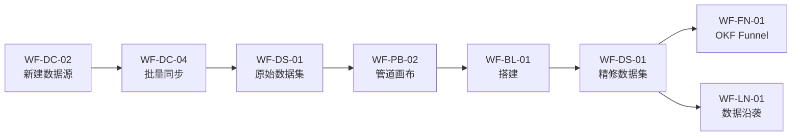
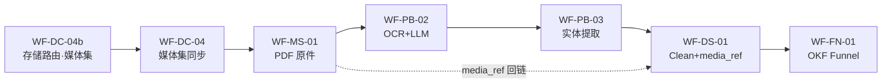

# 05a · 数据集成产品设计线框图

## 连接器 · 管道 · 数据集 · 横切应用

> **文档性质**：`[05 产品方案](05-数据集成Connectors-Pipeline-Dataset产品方案.md)` 的 **UI/UX 线框规格** · 研发可直接对照实现  
> **版本**：v1.2 · 2026-07-13  
> **v1.2 变更**：增补 WF-DC-04b 存储路由 · WF-MS-01 媒体集 · WF-PB-03 Use LLM · 三型输入画布 · 旅程 D（非结构化）· 链 [05b](05b-非结构化数据存储与接入路径补充方案.md)  
> **v1.1 变更**：线框内 UI 文案全面中文化（对标 Foundry 中文文档用语）  
> **绘制原则**：布局与控件 **优先来自 Palantir Foundry 官方文档**（本地镜像 `foundry/pages/`）；非结构化存储路由见 **[05b](05b-非结构化数据存储与接入路径补充方案.md)**；OKF Funnel 按 05 方案 **通用抽象** 绘制  
> **对标在线**：[数据集成概述](https://www.palantir.com/docs/foundry/data-integration/overview) · [数据连接](https://www.palantir.com/docs/foundry/data-connection/overview) · [Pipeline Builder](https://www.palantir.com/docs/foundry/pipeline-builder/overview) · [数据集预览](https://www.palantir.com/docs/foundry/dataset-preview/overview) · [数据沿袭](https://www.palantir.com/docs/foundry/data-lineage/overview)

---

## 使用的 Rules


| Rule     | 应用                                               |
| -------- | ------------------------------------------------ |
| 中文       | 线框内按钮、标签、Tab 一律中文                                |
| 先方案后代码   | 仅文档；不改业务代码                                       |
| 优先官方 UI  | 用语对齐 Foundry 中文镜像（如「数据连接」「搭建」「提议」）               |
| 通用线框     | 占位符 `{数据源}` `{数据集}`；避免绑定单一行业示例                   |
| 覆盖 05 节点 | 映射 §9 Backlog + §2.1 L1 三阶段 + §2.3.1 存储路由 + §2.4 OKF Funnel |


---

## 1. 信息架构（IA）

### 1.1 应用地图 · 对标 Foundry 应用参考

摘自 `[data-integration/application-reference.md](foundry/pages/zh/foundry/data-integration/application-reference.md)`：

```text
┌─ Foundry 工作区 ─────────────────────────────────────────────────────────────┐
│  [≡ 应用门户]  工作区 ▾   🔍 搜索   [通知]  [用户]                              │
├───────────────────────────────────────────────────────────────────────────────┤
│                                                                               │
│  数据集成  基座应用群                                                        │
│  ┌─────────────┐ ┌─────────────┐ ┌─────────────┐ ┌─────────────┐            │
│  │ 数据连接    │ │ Pipeline    │ │ 代码库      │ │ 数据集预览  │            │
│  │             │ │ Builder     │ │             │ │             │            │
│  └─────────────┘ └─────────────┘ └─────────────┘ └─────────────┘            │
│  ┌─────────────┐ ┌─────────────┐ ┌─────────────┐                             │
│  │ 搭建        │ │ 数据沿袭    │ │ 数据健康    │                             │
│  └─────────────┘ └─────────────┘ └─────────────┘                             │
│                                                                               │
│  谛听增强（05 §2.4）                                                           │
│  ┌─────────────┐                                                              │
│  │ OKF Funnel  │  ← 精修数据集 → 对象属性 自动映射                            │
│  │ 映射器      │                                                              │
│  └─────────────┘                                                              │
└───────────────────────────────────────────────────────────────────────────────┘
```

### 1.2 页面对照表（05 §9 → 本文线框）


| 05 ID | 线框 ID         | 应用             | Foundry 文档                              |
| ----- | ------------- | -------------- | --------------------------------------- |
| DC-01 | **WF-DC-01**  | 数据连接首页         | `data-connection/overview`              |
| DC-02 | **WF-DC-02**  | 新建数据源向导        | `set-up-source`                         |
| DC-03 | **WF-DC-03**  | 数据源详情 + 探索     | `source-exploration`                    |
| DC-04 | **WF-DC-04**  | 同步编辑器          | `set-up-sync`                           |
| DC-04b | **WF-DC-04b** | **存储路由向导**    | `05b` §6 · `media-set-sync`             |
| DC-05 | **WF-DC-05**  | 代理管理           | `set-up-agent`                          |
| PB-01 | **WF-PB-01**  | 管道列表/入口        | `pipeline-builder/management-file-tree` |
| PB-02 | **WF-PB-02**  | 管道画布（编辑视图）     | `pipeline-builder/navigation`           |
| PB-03 | **WF-PB-03**  | **Use LLM 节点**   | `pipeline-builder-llm`                  |
| —     | **WF-PB-02b** | 管道提案/历史        | `navigation#提案`                         |
| PB-03 | **WF-BL-01**  | 搭建控制台          | `data-integration/builds`               |
| PB-04 | **WF-SC-01**  | 计划编辑器          | `schedules-create-schedule`             |
| —     | **WF-CR-01**  | 代码库            | `code-repositories/navigation`          |
| DS-01 | **WF-DS-01**  | 数据集预览          | `dataset-preview/overview`              |
| DS-02 | **WF-DS-02**  | 数据集历史（标签页）     | `dataset-preview/overview#历史标签`         |
| MS-01 | **WF-MS-01**  | **媒体集浏览器**      | `data-integration/media-sets`           |
| DS-03 | **WF-LN-01**  | 数据沿袭           | `data-lineage/navigation`               |
| —     | **WF-DH-01**  | 数据健康           | `data-health/overview`                  |
| —     | **WF-FN-01**  | OKF Funnel 映射器 | 05 §2.4 · 谛听增强                          |


### 1.3 全局导航壳（Shell）

> 对标：Foundry 侧边栏与面包屑（镜像 `set-up-source`）

```text
┌──────────────────────────────────────────────────────────────────────────────┐
│ [☰]  {工作区名称}          🔍 搜索资源…              🔔  👤 用户 ▾             │
├──────────┬───────────────────────────────────────────────────────────────────┤
│ 侧栏     │  面包屑：{项目} / {应用} / {资源}                                    │
│          ├───────────────────────────────────────────────────────────────────┤
│ 首页     │                                                                   │
│ ─────    │                    <<  主内容区  >>                                 │
│ 应用     │                                                                   │
│  · 数据  │                                                                   │
│    连接  │                                                                   │
│  · 管道  │                                                                   │
│    构建  │                                                                   │
│  · …     │                                                                   │
│ ─────    │                                                                   │
│ 项目     │                                                                   │
│  └ {树}  │                                                                   │
└──────────┴───────────────────────────────────────────────────────────────────┘
```

**共用控件**：项目树 · 资源 RID · 分支选择器 · 权限标记徽章 · 共享 / 移动 / 重命名（数据集头部）

---

## 2. 线框图例


| 符号       | 含义     |
| -------- | ------ |
| `[ 按钮 ]` | 可点击按钮  |
| `{占位符}`  | 动态字段   |
| `▾`      | 下拉     |
| `☑ / ☐`  | 复选框    |
| `● / ○`  | 单选     |
| `🔵`     | 平台共用能力 |
| `🟠`     | 业务个性配置 |


---

## 3. 数据连接线框

### 3.0 数据连接 · 子模块树（05 §2.3.1 / 05b §6）

```text
数据连接 (Data Connection)
├── 连接器层（200+ · Snapshot / Append）
├── 存储路由 ← WF-DC-04b
│   ├── Dataset         → CSV / JSON / DB 表
│   ├── MediaSet(文档)  → PDF / Word* / PPTX* / 图 / 音视频
│   ├── MediaSet(表格)  → XLSX（spreadsheet schema）
│   └── Stream          → IoT / Kafka / MQTT(β)
├── 解析路径提示（Pipeline 侧执行）
│   ├── 结构化 · Apply Schema
│   ├── 半结构化 · Explode
│   ├── 非结构化 · Doc Intel 五步
│   └── 时序 · Stream + CDC
└── 桥接 · MediaReference ← WF-DS-01 / WF-PB-03
```

### WF-DC-01 · 首页（数据源列表）

> 出处：`data-connection/overview`

```text
┌─ 数据连接 ───────────────────────────────────────────────────────────────────┐
│ 标签：[ 数据源 ] [ 同步 ] [ 代理 ] [ 导出 ]                    [+ 新建 ▾]      │
├──────────────────────────────────────────────────────────────────────────────┤
│ 🔍 按名称、类型、状态筛选          状态：全部 ▾    运行时：全部 ▾               │
├──────────────────────────────────────────────────────────────────────────────┤
│ ┌─ 摘要条 ────────────────────────────────────────────────────────────────┐  │
│ │ 数据源：{N}   同步成功：{n}   24h 失败：{m}   → [ 打开数据健康 ]         │  │
│ └─────────────────────────────────────────────────────────────────────────┘  │
├──────────────────────────────────────────────────────────────────────────────┤
│ 名称              类型          存储类型      运行时        同步数  上次运行      状态      │
│ ─────────────────────────────────────────────────────────────────────────────────────────  │
│ {数据源-erp}      {连接器}     数据集        代理代理      5       2小时前        🟢        │
│ {数据源-blob}     S3            数据集+媒体集  直接连接      3       1天前         🟡        │
│ {数据源-docs}     SharePoint    媒体集·文档    直接连接      1       30分钟前      🟢        │
│ {数据源-iot}      Kafka         流式          直接连接      2       实时          🟢        │
│ {数据源-legacy}   Oracle        数据集        代理工作者    0       —             🔴        │
├──────────────────────────────────────────────────────────────────────────────┤
│ 点击行 → WF-DC-03          [ + 新建数据源 ] → WF-DC-02                        │
└──────────────────────────────────────────────────────────────────────────────┘
```

---

### WF-DC-02 · 新建数据源向导（分步）

> 出处：`set-up-source` · `core-concepts#运行时`

```text
┌─ 新建数据源 ─────────────────────────────────────────────────────────────────┐
│ 步骤：(1) 连接器 ● ─ (2) 运行时 ─ (3) 连接 ─ (4) 凭证                          │
├──────────────────────────────────────────────────────────────────────────────┤
│ 步骤 1 · 选择连接器类型                                                       │
│ 🔍 搜索连接器…     筛选：[全部] [数据库] [对象存储] [ERP] [流式]                 │
│ ┌────────┐ ┌────────┐ ┌────────┐ ┌────────┐                                  │
│ │ {图标} │ │ {图标} │ │ {图标} │ │ {图标} │   ← 卡片：名称 · 支持能力         │
│ │ JDBC   │ │ S3     │ │ Kafka  │ │ REST   │     批量✓ 流式✓ 虚拟表✓          │
│ └────────┘ └────────┘ └────────┘ └────────┘                                  │
├──────────────────────────────────────────────────────────────────────────────┤
│ 步骤 2 · 运行时                          🟠 个性：按网络选择                   │
│   ● 直接连接  （推荐）    Foundry → 公网端点                                  │
│   ○ 代理代理              经客户 VPC 反向代理                                 │
│   ○ 代理工作者            任务在客户 Linux 主机执行                           │
│   代理：[ 选择代理 ▾ ]  （若选代理模式）                                      │
├──────────────────────────────────────────────────────────────────────────────┤
│ 步骤 3 · 连接信息                        🔵 凭证库 · 出口策略 共用              │
│   显示名称：[________________]                                               │
│   项目：    [ /项目/{项目名} ▾ ]                                              │
│   主机/URL：[________________]   端口：[____]                                 │
├──────────────────────────────────────────────────────────────────────────────┤
│ 步骤 4 · 凭证                            🔵 凭证库                           │
│   认证方式：[ 用户名密码 ▾ | OAuth | IAM 角色 ]                               │
│   [ 测试连接 ]                                                               │
├──────────────────────────────────────────────────────────────────────────────┤
│                              [ 取消 ]  [ 上一步 ]  [ 创建并继续 → ]           │
└──────────────────────────────────────────────────────────────────────────────┘
```

**完成后跳转**：WF-DC-03 数据源详情 · 或提示「创建首个同步」→ WF-DC-04

---

### WF-DC-03 · 数据源详情 + 探索

> 出处：`source-exploration`

```text
┌─ 数据源：{数据源名称} ───────────────────────────────────────────────────────┐
│ 状态：🟢 已连接   运行时：{直接|代理}   项目：{项目}                            │
│ 标签：[ 概览 ] [ 探索 ] [ 同步 ] [ 凭证 ] [ 设置 ]                              │
├───────────────────────────────┬──────────────────────────────────────────────┤
│ 概览 / 探索                   │ 右侧面板 · 操作                               │
│                               │                                              │
│ ┌─ 左：资源树 ───────────────┐│ 已选：{表或路径}                              │
│ │ 🔍 搜索…                   ││ 行数（估）：{count}                           │
│ │ ▼ {模式或桶}               ││ 列数：{n}                                    │
│ │   ├ {表_a}                 ││                                              │
│ │   ├ {表_b}  ← 已选         ││ [ 预览样本 ]  （最多 20 行）                  │
│ │   └ {目录/}                ││                                              │
│ └───────────────────────────┘ │ ───────────────────────────────────────────  │
│                               │ 能力卡片：                                    │
│ ┌─ 中：关系图（可选）────────┐│  [ 创建批量同步 ]  → WF-DC-04b → WF-DC-04      │
│ │  {表_a}──外键──{表_b}      ││  [ 创建媒体集同步 ] → WF-DC-04b（默认媒体集）    │
│ │  （仅表格类数据源）         ││  [ 创建流式同步 ]                             │
│ └────────────────────────────┘│  [ 注册虚拟表 ]                               │
├───────────────────────────────┴──────────────────────────────────────────────┤
│ 「同步」标签页：同步列表 → WF-DC-04                                             │
└──────────────────────────────────────────────────────────────────────────────┘
```


| 布局  | 表格源         | 文件源       |
| --- | ----------- | --------- |
| 左树  | 模式 · 表 · 视图 | 目录        |
| 中图  | ER / 外键关系图  | （无图）      |
| 预览  | 20 行样本      | 文件列表 + 筛选 |


---

### WF-DC-04 · 同步编辑器（批量 / 流式）

> 出处：`set-up-sync`

```text
┌─ 同步：{同步名称}  ·  数据源：{数据源} ──────────────────────────────────────┐
│ 标签：[ 配置 ] [ 计划 ] [ 运行记录 ] [ 血缘 ]                                   │
├──────────────────────────────────────────────────────────────────────────────┤
│ 配置                                                                         │
│                                                                              │
│ 同步类型：  ● 批量    ○ 流式    ○ 变更捕获(CDC)    ○ 媒体集              │
│                                                                              │
│ ── 存储目标 🟠（见 WF-DC-04b 向导）──                                         │
│   目标类型：  ● 数据集  ○ 媒体集·文档  ○ 媒体集·电子表格  ○ 流数据集         │
│   目标路径：  [ /{项目}/原始/{域}/{名称}       ▾ ]  或 [ /{项目}/媒体/{名} ▾ ]│
│   解析路径：  [ 结构化 ▾ | 半结构化·Explode | 非结构化·Doc Intel | 时序 ]    │
│                                                                              │
│ ── 源端选择 🟠 ──                                                            │
│   表 / 查询：  [ SELECT * FROM {表} WHERE …     ] [ 预览 ]                   │
│   或 文件路径：[ /{前缀}/**/*.csv              ] [ 筛选… ]                   │
│                                                                              │
│ ── 输出 🟠 分区：原始 / 流式 ──                                               │
│   目标文件夹： [ /{项目}/原始/{域}/{名称}       ▾ ]                            │
│   分层标签：   [ 贴源层 ▾ | 缓冲层 | 自动 ]                                   │
│   格式：       原始区 Text  |  流式区 Avro        🔵 平台默认                  │
│                                                                              │
│ ── 事务 🔵 ──                                                                │
│   类型：[ 全量快照 SNAPSHOT ▾ | 增量追加 APPEND ]                             │
│                                                                              │
│ ── 计划（跳转 WF-SC-01）🟠 ──                                                │
│   ☐ 启用计划   Cron：[ 0 2 * * * ]   时区：[ UTC ▾ ]                         │
│                                                                              │
│ [ 运行预览 ]  [ 保存 ]  [ 立即运行 ]                                          │
├──────────────────────────────────────────────────────────────────────────────┤
│ 「运行记录」标签页                                                             │
│ 开始时间      耗时      行/文件数   事务 ID    状态      [ 日志 ]             │
│ {时间戳}      2分14秒   12,403      #891       ✅ 成功   [ 查看 ]             │
└──────────────────────────────────────────────────────────────────────────────┘
```

**流式变体**：输出 → 流数据集 · 格式锁定 **Avro** · 无 SNAPSHOT（仅追加）

**媒体集变体**：输出 → MediaSet · 类型锁定 Document 或 Spreadsheet · ⚠ `.xlsx` 须选「电子表格」

---

### WF-DC-04b · 存储路由向导（新建同步 · 步骤 3/4）

> 出处：`05b` §6.1 · `media-set-sync` · `file-based-syncs`

```text
┌─ 新建同步 · 步骤 3/4：选择存储目标 ─────────────────────────────────────┐
│  源：{SharePoint / S3 / SAP / Kafka / …}                                  │
├───────────────────────────────────────────────────────────────────────────┤
│  检测到文件类型 / 源类型建议：                                             │
│                                                                           │
│  ○ 数据集（表格/半结构化）     ← CSV · JSON · JDBC 表 · API JSON        │
│  ○ 媒体集 · 文档              ← PDF · 图像 · 音视频 · Word/PPT*        │
│  ○ 媒体集 · 电子表格          ← .xlsx / .xlsm  【schema: spreadsheet】 │
│  ○ 流数据集                   ← Kafka · IoT · MQTT                       │
│                                                                           │
│  ⚠ 提示：.xlsx 请勿选「文档」媒体集，否则 Pipeline Builder 无法识别      │
│                                                                           │
│  默认解析路径：[ 结构化 ▾ ]  [ 半结构化·Explode ]  [ 非结构化·Doc Intel ] │
│                                    [ 时序·Stream ]                          │
├───────────────────────────────────────────────────────────────────────────┤
│                              [ 上一步 ]  [ 创建同步 → WF-DC-04 ]           │
└──────────────────────────────────────────────────────────────────────────────┘
```

| 选择 | 跳转 | 后续 Pipeline 默认 |
|------|------|-------------------|
| 数据集 | WF-DC-04 · 目标=Dataset | Apply Schema / Explode |
| 媒体集·文档 | WF-DC-04 · 目标=MediaSet | Doc Intel 五步 |
| 媒体集·表格 | WF-DC-04 · 目标=Spreadsheet MS | LLM 提取 |
| 流数据集 | WF-DC-04 · 同步类型=流式 | 时序 / 窗口聚合 |

---

### WF-DC-05 · 代理管理

> 出处：`data-connection/architecture` · `set-up-agent`

```text
┌─ 数据连接 › 代理 ────────────────────────────────────────────────────────────┐
│ [ + 注册代理 ]                              🔍 搜索…                          │
├──────────────────────────────────────────────────────────────────────────────┤
│ 代理名称      模式           状态      数据源数  最后心跳    维护窗口          │
│ ──────────────────────────────────────────────────────────────────────────── │
│ {代理-1}      代理+Worker    🟢 在线    12        30秒前     周日 02:00       │
│ {代理-2}      代理+Worker    🟢 在线    12        28秒前     周日 04:00       │
│ {代理-实验}   仅工作者        🔴 离线    0         3天前      —               │
├──────────────────────────────────────────────────────────────────────────────┤
│ 详情面板 · {代理-1}                                                          │
│ ┌─ 架构示意 ──────────────────────────────────────────────────────────────┐  │
│ │  客户 VPC              │ HTTPS 出站 │    Foundry 协调器                │  │
│ │  [代理Worker]──►ERP    │───────────►│    数据连接应用                   │  │
│ │  [Agent Proxy] ◄──────────┼───────────►│                                  │  │
│ └─────────────────────────────────────────────────────────────────────────┘  │
│ 标签：[ 状态 ] [ 已指派数据源 ] [ 日志 ] [ 代理配置 ] [ 驱动程序 ]             │
│ 连通性测试：[ 运行连接检查 ]                                                  │
└──────────────────────────────────────────────────────────────────────────────┘
```

---

## 4. Pipeline Builder 线框

### WF-PB-01 · 管道列表 / 文件树入口

> 出处：`pipeline-builder/management-file-tree`

```text
┌─ Pipeline Builder ─────────────────────────────────────────────────────────────┐
│ [ + 新建管道 ]   🔍 搜索…                    视图：[ 树形 | 最近 ]             │
├──────────────────────┬───────────────────────────────────────────────────────┤
│ 项目树               │  最近 / 已选                                           │
│ ▼ /{项目}            │  ┌─────────────────────────────────────────────────┐  │
│   ▼ 管道             │  │ {管道名}     分支：master   修改于 2小时前       │  │
│     · {管道-a}       │  │ {管道名-2}   分支：feature  修改于 1天前         │  │
│   ▼ 数据集           │  └─────────────────────────────────────────────────┘  │
│     · {原始数据集}   │                                                       │
│     · {精修数据集}   │  双击管道 → WF-PB-02 · 双击媒体集 → WF-MS-01          │
│   ▼ 媒体集           │                                                       │
│     · {文档扫描}     │                                                       │
│     · {电子表格}     │                                                       │
└──────────────────────┴───────────────────────────────────────────────────────┘
```

---

### WF-PB-02 · 画布 · 编辑视图（核心）

> 出处：`pipeline-builder/navigation#编辑` — **官方四区布局**

```text
┌─ {管道名称} ───────────────────────────────────────────────────────────────────┐
│ 视图：[ 编辑 ● ] [ 提案 ] [ 历史记录 ]                                          │
│ 工具栏：[↶][↷]  分支：{分支}▾  [保存] [提议] [部署]  搭建：{状态}               │
│         搭建配置：[默认▾]  [分享] [详情 ≡]                                      │
├────────────┬─────────────────────────────────────────────┬─────────────────────┤
│            │  画布 · 变换 DAG                             │ 输出侧栏            │
│ （可选）   │                                              │ [展开 ◀]            │
│ 详情侧栏   │   ┌──────────────┐  ┌──────────────┐      │ 数据集              │
│ 点击 ≡ 打开│   │ 输入·数据集  │  │ 输入·媒体集  │      │  · {输出集} 5/5 ✓  │
│            │   │ {原始数据集} │  │ {PDF扫描}    │      │    [编辑模式]       │
│            │   └──────┬───────┘  └──────┬───────┘      │    [数据期望]       │
│            │          └────────┬────────┘              │  [ + 添加输出 ]     │
│            │                   ▼                        │ ─────────────────  │
│            │            ┌──────────────┐               │ 对象类型（可选）    │
│            │            │ 变换         │               │ 链接类型            │
│            │            │ OCR/Explode  │──┐            │                    │
│            │            └──────────────┘  │            │                    │
│            │                   …          ▼            │                    │
│            │                        ┌──────────────┐   │                    │
│            │                        │ 输出·数据集  │◀─已选│                    │
│            │                        │ {精修+ref}   │   │                    │
│            │                        └──────────────┘   │                    │
│            │  画布工具：[平移][框选][+数据集][+媒体集][+流]│                    │
├────────────┴─────────────────────────────────────────────┴─────────────────────┤
│ 预览面板（底部，可折叠）                                                         │
│ 节点：{选中节点} ▾   🔍 搜索列…   [样本行表格预览]                               │
└────────────────────────────────────────────────────────────────────────────────┘
```

**选中「输出」节点 · 属性面板** — 对标 `outputs-add-dataset-output`：

```text
┌─ 输出：{精修数据集} ───────────────────────────────────────────────────────────┐
│ 名称：[________________________]                                              │
│ ── 分区 / 分层 🟠 ──                                                          │
│   数据层：[ 明细层 DWD ▾ | 服务层 DWS | 应用层 ADS ]  路径：/精修/{域}/…      │
│ ── 格式 🔵 ──                                                                 │
│   物理格式：  ● Parquet   ○ Avro（旧版）                                      │
│   事务层：    ☑ Iceberg 元数据（ACID · 时间旅行）                              │
│ ── 写入模式 🔵 ──                                                            │
│   [ 默认 ▾ | 始终追加 | 仅追加新主键 | 快照替换 | … ]                           │
│ ── 模式 ──                                                                    │
│   列名          类型        主键  可空    映射来源                             │
│   {列_1}        字符串      ☑    —       ← 自动                               │
│   {列_2}        浮点        ☐    —       ← 自动                               │
│   media_ref     媒体引用    ☐    —       ← Get media references               │
│   [ + 添加列 ]   错误：0/8 列已匹配                                           │
│ ── 数据期望 🔵 ──                                                             │
│   ☑ 主键唯一   ☑ 行数 > 0   [ + 添加期望 ]                                    │
│ ── 计划 🟠 ──                                                                 │
│   [ 打开计划编辑器 → WF-SC-01 ]                                               │
└──────────────────────────────────────────────────────────────────────────────┘
```


| 画布节点 | 图标 | 交互 |
| ---- | ---- | --------------- |
| 输入·数据集 | 圆角矩形 | 双击 → WF-DS-01 |
| 输入·媒体集 | 圆角矩形·胶片 | 双击 → WF-MS-01 |
| 输入·流 | 圆角矩形·波浪 | 流式专用 |
| 变换 | 齿轮 | 选中 → 表达式/SQL · **Use LLM → WF-PB-03** |
| 输出 | 蓝色方块 | 选中 → 上表属性面板 |

---

### WF-PB-03 · Use LLM 节点（变换面板）

> 出处：`pipeline-builder/pipeline-builder-llm`

```text
┌─ 变换 · Use LLM ───────────────────────────────────────────────────────────────┐
│ 模板：[ 实体提取 ▾ | 分类 | 总结 | 翻译 | 空提示 ]                              │
│ ── 输入 ──                                                                     │
│   文本列：[ {markdown_col} ▾ ]                                                 │
│   视觉列：[ {media_ref} ▾ ]   模型：[ GPT-4o ▾ ]  ← mediaReference 必填       │
│ ── 实体提取 🟠 ──                                                              │
│   实体名          类型                                                           │
│   {尾号}          字符串                                                         │
│   {维修日期}      日期                                                           │
│   {更换零件}      字符串数组                                                     │
│ ── 试运行 ──                                                                   │
│   [ 在 5 行样本上试运行 ]   耗时：3s   预览 JSON ↓                              │
│ ── 输出 ──                                                                     │
│   ☑ 追加为新列   ☑ 保留 media_ref 列                                           │
│                              [ 取消 ]  [ 应用到管道 ]                           │
└────────────────────────────────────────────────────────────────────────────────┘
```

**约束**（05b §7）：视觉提示 **不支持** MediaSet 直连 · 须先 **Convert Media Set to Table Rows** 获得 `mediaReference` 列。

---

### WF-PB-02b · 提案 / 历史记录视图

> 出处：`pipeline-builder/navigation#提案`

```text
┌─ {管道名称} ───────────────────────────────────────────────────────────────────┐
│ 视图：[ 编辑 ] [ 提案 ● ] [ 历史记录 ]                                          │
├──────────────────────────────────────────────────────────────────────────────┤
│ 筛选：[ 待处理 ▾ | 已合并 | 已关闭 ]                                           │
│ ┌────────────────────────────────────────────────────────────────────────┐   │
│ │ 🟡 提案 #{id}  {用户}  {日期}  「调整 {域} 关联键」                      │   │
│ │ 🟢 提案 #{id}  {用户}  {日期}  「添加主键期望」            [已合并]     │   │
│ └────────────────────────────────────────────────────────────────────────┘   │
│ 选中提案 → 差异画布（分屏：变更前 | 变更后）· 批准 / 评论                      │
└──────────────────────────────────────────────────────────────────────────────┘

「历史记录」标签：分支 ▾ · 保存时间线 · [ 查看详情 ] [ 查看变更 ] [ 创建分支 ]
```

---

## 5. 代码库线框

### WF-CR-01 · 变换仓库 IDE

> 出处：`code-repositories/navigation`

```text
┌─ 代码库 › {仓库名} ──────────────────────────────────────────────────────────┐
│ [ 代码 ● ] [ 分支 ] [ 拉取请求 ] [ 检查 ] [ 设置 ]                              │
│ 分支：{沙盒分支} ▾  [预览] [测试] [提交] [搭建] [提议变更]                       │
├──────────────┬────────────────────────────────────────────┬──────────────────┤
│ 文件树       │  编辑器                                      │ 辅助面板         │
│ transforms-  │  @transform(                                 │ [资源管理|问题|  │
│  python/     │    output=Output("{精修}"),                  │  调试器]         │
│  · {文件}.py │    inputs={"raw": Input("{原始}")},          │                  │
│ transforms-  │  )                                           │ 问题：0          │
│  sql/        │  def compute(raw): …                         │                  │
├──────────────┴────────────────────────────────────────────┴──────────────────┤
│ 状态栏：第 {n} 行 · UTF-8 · 检查通过 · 提交后将发布 JobSpec                    │
└──────────────────────────────────────────────────────────────────────────────┘
```

---

## 6. 搭建线框

### WF-BL-01 · 搭建控制台

> 出处：`data-integration/builds`

```text
┌─ 搭建 ───────────────────────────────────────────────────────────────────────┐
│ 筛选：分支 [{分支}▾]  状态 [全部▾]  时间 [近24小时▾]  🔍 任务                 │
├──────────────────────────────────────────────────────────────────────────────┤
│ 搭建 ID     分支       触发方式    开始时间      耗时       状态              │
│ #{搭建-id}  master     计划        {时间}       4分02秒    ✅ 已完成          │
│ #{搭建-id}  feature/x  手动        {时间}       —          🔄 运行中          │
├──────────────────────────────────────────────────────────────────────────────┤
│ 搭建详情 · #{搭建-id}                                                          │
│ ┌─ 任务图 ────────────────────────────────────────────────────────────────┐  │
│ │  [同步任务] ──► [变换_a] ──► [变换_b] ──► [{精修}]                        │  │
│ │     ✅            ✅              🔄 运行中         等待中                 │  │
│ └──────────────────────────────────────────────────────────────────────────┘  │
│ 任务：{变换_b}   状态：运行中   [ 查看实时日志 ] [ 中止 ]                       │
│ ┌─ 日志流 ────────────────────────────────────────────────────────────────┐  │
│ │ 信息  … 已解析 {数据集} 的模式                                            │  │
│ │ 警告  …                                                                   │  │
│ │ [ 暂停 ]  [ 格式化为 JSON ]                                               │  │
│ └──────────────────────────────────────────────────────────────────────────┘  │
└──────────────────────────────────────────────────────────────────────────────┘
```

**任务状态**（05 §4.5）：等待中 → 运行中 → 已完成 | 失败 | 已中止

---

## 7. 计划线框

### WF-SC-01 · 计划编辑器

> 出处：`schedules-create-schedule`

```text
┌─ 新建计划 · 数据集：{数据集} ────────────────────────────────────────────────┐
│ 触发条件（满足任一即可）：                                                       │
│   ☑ 父资源更新时        父数据集：[ + 添加 {上游数据集} ]                        │
│   ☑ 定时执行              Cron 构建器 ▾                                         │
│       频率：[ 每天 ▾ ]  时间：[ 02:00 ]  时区：[ {时区} ▾ ]                     │
│   ☐ 逻辑(JobSpec)变更时                                                        │
│ ── 搭建范围 🔵 ──                                                              │
│   ● 仅本数据集                                                                 │
│   ○ 本数据集及全部下游                                                         │
│   ○ [{A}] 与 [{B}] 之间全部数据集                                              │
│ ── 高级（打开 WF-LN-01 计划助手）──                                            │
│   失败时：[ 通知 ▾ ] [ 重试 ▾ ]                                                │
│ [ 取消 ]                                              [ 保存计划 ]             │
└──────────────────────────────────────────────────────────────────────────────┘
```

---

## 8. 数据集线框

### WF-DS-01 · 数据集预览（主视图）

> 出处：`dataset-preview/overview` — **官方五组件**

```text
┌─ 数据集：{数据集路径} ─────────────────────────────────────────────────────────┐
│ 头部：{显示名}   分支：[master▾]  分区：[精修|原始|流式]  [共享]               │
│ 标签：[ 预览 ● ] [ 历史 ] [ 详情 ] [ 健康 ] [ 比较 ] [ 流* ]                   │
├───────────────────────────────┬────────────────────────────────────────────────┤
│ 信息面板                      │  数据预览表                                    │
│ ─ 关于 ─                      │  ┌──────┬──────┬──────────┬──────┐                 │
│ 创建 / 更新时间               │  │ {列1}│ {列2}│ media_ref│ …    │  ← 样本行       │
│ 大小 · 行数                   │  │ …    │ …    │ [📄缩略] │      │     内联预览原件 │
│ 上次搭建 / 同步工具           │  └──────┴──────┴──────────┴──────┘                 │
│ 分层标签：{明细层|贴源层…} 🟠 │  [ 列统计 ] [ 筛选行 ]                         │
│ ─ 列 ─                        │                                                │
│  {列}  字符串  空值 3%        │                                                │
│  media_ref  媒体引用  —       │  ← typeclass: media_reference                  │
│ ─ 计划 ─                      │                                                │
│  → 跳转 WF-SC-01              │                                                │
├───────────────────────────────┴────────────────────────────────────────────────┤
│ 操作：[ 搭建 ] [ 在沿袭中打开 ] [ 在管道中打开 ] [ 导出 ]                       │
└────────────────────────────────────────────────────────────────────────────────┘
```

**「详情」标签子视图**：

```text
┌─ 详情 ─────────────────────────────────────────────────────────────────────────┐
│ [ 模式 ● ] [ 文件 ] [ 任务规格 ] [ 同步 ] [ 自定义元数据 ] [ 用量 ]            │
│ 格式：Parquet + Iceberg 事务   最新事务：#{id} {追加|快照}                      │
│ 模式编辑表 · [ 编辑模式 ] · 保留策略链接                                       │
│ 文件：part-00001.parquet … [ 下载 ]                                          │
└────────────────────────────────────────────────────────────────────────────────┘
```

---

### WF-DS-02 · 历史（标签页内嵌）

> 出处：`dataset-preview/overview#历史标签`

```text
┌─ 历史 ─────────────────────────────────────────────────────────────────────────┐
│ 分支：[master▾]                    摘要图：成功/失败随时间变化                  │
├──────────────────────┬───────────────────────────────────────────────────────┤
│ 搭建 / 事务列表      │  详情 · 事务 #{891}                                   │
│ #{889} 快照    ✅    │  类型：追加 · 提交：{时间} · 行数：{n}                 │
│ #{890} 追加    ✅    │  输入数据集：{列表}                                   │
│ #{891} 追加    ✅◀  │  [ 查看日志 ] [ 与 #{890} 比较 ] [ 打开沿袭 ]          │
│ #{892} 失败    ❌    │  写入文件：{列表}                                     │
└──────────────────────┴───────────────────────────────────────────────────────┘
```

---

### WF-MS-01 · 媒体集浏览器

> 出处：`data-integration/media-sets` · `media-set-sync`

```text
┌─ 媒体集：/{项目}/媒体/{名称} ──────────────────────────────────────────────────┐
│ 类型：[ 文档 ▾ | 电子表格 ]   schema：document | spreadsheet                    │
│ 标签：[ 浏览 ● ] [ 同步 ] [ 变换 ] [ 设置 ] [ 用量 ]                            │
├───────────────────────────────┬────────────────────────────────────────────────┤
│ 文件列表                      │  预览面板                                      │
│ 🔍 筛选…  排序：[路径▾]       │  ┌──────────────────────────────────────────┐  │
│ ┌──────────────────────────┐  │  │  PDF 第 1 页 · OCR 文本摘要              │  │
│ │ ☑ scan_001.pdf           │  │  │  或 XLSX 表格预览（Spreadsheet 型）      │  │
│ │ ☑ scan_002.pdf           │  │  └──────────────────────────────────────────┘  │
│ │   report_Q4.xlsx ⚠       │  │  ⚠ 电子表格文件须位于 Spreadsheet 型媒体集      │
│ └──────────────────────────┘  │  [ 在 Pipeline 中打开 ] [ 获取媒体引用 ]       │
├───────────────────────────────┴────────────────────────────────────────────────┤
│ 操作：[ 从计算机上传 ] [ 配置同步 → WF-DC-04 ] [ 在沿袭中打开 ]                 │
└────────────────────────────────────────────────────────────────────────────────┘
```

| 类型 | 支持格式（镜像） | Pipeline 入口 |
|------|----------------|--------------|
| 文档 | PDF · 图像 · 音视频 | OCR · Extract text · WF-PB-03 视觉 |
| 电子表格 | XLSX/XLSM | LLM 提取 · parseExcel（旧） |

---

## 9. 数据沿袭线框

### WF-LN-01 · 血缘图

> 出处：`data-lineage/navigation` — **六区官方布局**

```text
┌─ 数据沿袭 ─────────────────────────────────────────────────────────────────────┐
│ 分支：[{分支}▾]  回退：[{父分支…}]                    [ 保存图表 ]              │
├──────────────┬─────────────────────────────────────────────────────────────────┤
│ 侧边面板     │  沿袭图（平移 / 缩放 / 多选）                                    │
│ [搜索]       │                                                                 │
│ [浏览树]     │     [{同步}] ──► [{原始集}] ──► [{管道}] ──► [{精修集}]         │
│              │                                      │                           │
│ ─ 属性       │                                      └──► [{下游}]              │
│  （单节点）  │                                                                 │
│ ─ 直方图     │  节点着色：🟢 新鲜  🟡 陈旧  🔴 健康失败                         │
│  （多节点）  │                                                                 │
│ ─ 搭建       │  [ 展开上游 ] [ 展开下游 ] [ 全部自动布局 ]                      │
│ ─ 计划       │                                                                 │
├──────────────┴─────────────────────────────────────────────────────────────────┤
│ 节点详情（底/侧抽屉）：模式 · 上次搭建 · 代码链接 · 预览                         │
└────────────────────────────────────────────────────────────────────────────────┘
```

**05 §7.1 闭环在图上的形态**：

```text
{连接器同步} → {原始 Text / 媒体集} → {管道任务} → {精修 Parquet + media_ref} → [Funnel] → {对象}
         └─────────────────── 列级血缘（可选）────────────────────────────────────┘
```

---

## 10. 数据健康线框

### WF-DH-01 · 健康检查

> 出处：`data-health/overview`

```text
┌─ 数据健康 ─────────────────────────────────────────────────────────────────────┐
│ [ + 添加健康检查 ]     显示：[ 全部 | 我监测的 ▾ ]   🔍 筛选                    │
├──────────────────────────────────────────────────────────────────────────────┤
│ 数据集              检查类型           上次运行     状态      [ 编辑 ]         │
│ {精修数据集}        行数漂移           1小时前      ✅        …                │
│ {原始数据集}        模式变更阻断       2小时前      ❌        …                │
├──────────────────────────────────────────────────────────────────────────────┤
│ 入口：数据集预览 › 健康标签 · 沿袭节点着色 · 项目目录                           │
└──────────────────────────────────────────────────────────────────────────────┘
```

---

## 11. OKF Funnel 映射器线框（增强）

### WF-FN-01 · OKF 智能映射

```text
┌─ OKF Funnel 映射器 ────────────────────────────────────────────────────────────┐
│ 源数据集：[{精修数据集} ▾]   OKF 包：[{电商|环科|生物} ▾]                        │
│ 分支：[master▾]                    [ 自动映射 ] [ 体检 ] [ 发布 ]               │
├──────────────────────────────┬─────────────────────────────────────────────────┤
│ 精修模式（Parquet）          │  OKF 概念 / 对象目标                            │
│                              │                                                 │
│  列名            类型        │  对象类型：[{订单} ▾]                           │
│  ─────────────────────────   │  ┌ 属性 ──────── 映射列 ──────── 置信度 ─┐      │
│  {订单_id}       字符串      │  │ 编号        ← 订单_id          98%  ☑ │      │
│  {金额}          浮点        │  │ 总金额      ← 金额              95%  ☑ │      │
│  {类目原文}      字符串      │  │ 一级类目    ← (建议拆分)        72%  ☐ │      │
│  {更新时间}      时间戳      │  │ 更新时间    ← 更新时间          99%  ☑ │      │
│                              │  └──────────────────────────────────────┘      │
│  未映射：{n} 列              │  链接建议：[{订单}]-[{客户}]                     │
├──────────────────────────────┴─────────────────────────────────────────────────┤
│ 体检面板：⚠ 1 处模式漂移 vs OKF_ECOM.md · [ 查看差异 ] [ 应用修复 ]            │
│ 预览：{样本对象 JSON}     Wiki 绑定：[ 打开概念卡片 ]                           │
└────────────────────────────────────────────────────────────────────────────────┘
```


| 控件   | 🔵 共用              | 🟠 个性        |
| ---- | ------------------ | ------------ |
| 自动映射 | OKF 垂直 Schema 匹配   | 选包 · 确认/覆盖映射 |
| 体检   | 契约校验规则             | 领域 OKF 版本    |
| 发布   | 写入 Ontology Funnel | 对象类型选择       |


---

## 12. 端到端页面流（05 §6）

### 12.1 旅程 A · 批处理闭环




### 12.2 旅程 B · Agent 内网源

`WF-DC-05`（注册代理）→ `WF-DC-02`（运行时=代理代理）→ `WF-DC-03` 探索 → `WF-DC-04`

### 12.3 旅程 C · 虚拟表联邦

`WF-DC-02`（S3 + 虚拟表）→ 可跳过原始区 · 直连 `WF-PB-02` 输入 → 精修物化

### 12.4 旅程 D · 非结构化 PDF + MediaReference（05b §5）



**Excel 变体**：WF-DC-04b 选「媒体集·电子表格」→ WF-MS-01（Spreadsheet）→ WF-PB-03 LLM 提取 JSON。

---

## 13. 三 Zone UI 视觉编码


| 分区  | 徽章色 | 数据集/媒体集头部标签 | 同步默认格式 | 管道输出默认            |
| --- | --- | -------------- | ------ | ----------------- |
| 原始区 | 琥珀  | `贴源 / ODS`     | Text   | —                 |
| 媒体集 | 紫   | `媒体·文档 / 媒体·表格` | 原件   | —                 |
| 流式区 | 蓝   | `缓冲 / 流式`      | Avro   | —                 |
| 精修区 | 绿   | `明细 / 服务 / 应用` | —      | Parquet + Iceberg + media_ref |


---

## 14. 组件清单（研发复用）


| 组件 ID                  | 描述          | 出现页面                |
| ---------------------- | ----------- | ------------------- |
| `cmp-branch-selector`  | Git/数据集分支下拉 | 管道 · 数据集 · 沿袭 · 代码库 |
| `cmp-zone-badge`       | 原始/流式/精修/媒体标签 | 数据集 · 媒体集 · 同步 · 管道输出 |
| `cmp-storage-router`   | Dataset/Media/Stream 单选 | DC-04b              |
| `cmp-media-ref-cell`   | 媒体引用内联缩略图     | DS-01 · WF-PB-03    |
| `cmp-mediaset-preview` | PDF/Excel 预览        | MS-01               |
| `cmp-txn-timeline`     | 事务历史时间线     | DS-02               |
| `cmp-dag-canvas`       | 可平移 DAG 画布  | PB-02 · LN-01       |
| `cmp-schema-table`     | 列名/类型/主键网格  | 数据集 · 管道输出 · FN-01  |
| `cmp-build-status-bar` | 搭建状态条       | PB-02 · BL-01       |
| `cmp-cron-builder`     | 计划 Cron 构建器 | SC-01 · DC-04       |
| `cmp-credential-vault` | 凭证选择器       | DC-02 · DC-03       |
| `cmp-expectation-chip` | 主键/行数期望     | 管道输出                |
| `cmp-lineage-mini`     | 嵌入式沿袭入口     | DC-04 · DS-01       |


---

## 15. 参考文档索引


| 线框组              | Palantir 在线                                                                       | 本地镜像                                                           |
| ---------------- | --------------------------------------------------------------------------------- | -------------------------------------------------------------- |
| 数据连接             | [overview](https://www.palantir.com/docs/foundry/data-connection/overview)        | `foundry/pages/zh/foundry/data-connection/`                    |
| 媒体集               | [media-sets](https://www.palantir.com/docs/foundry/data-integration/media-sets)   | `data-integration/media-sets.md`                               |
| Pipeline LLM       | [pipeline-builder-llm](https://www.palantir.com/docs/foundry/pipeline-builder/pipeline-builder-llm/) | `pipeline-builder/pipeline-builder-llm.md`          |
| Pipeline Builder | [overview](https://www.palantir.com/docs/foundry/pipeline-builder/overview)       | `pipeline-builder/navigation.md`                               |
| 数据集              | [dataset-preview](https://www.palantir.com/docs/foundry/dataset-preview/overview) | `dataset-preview/overview.md`                                  |
| 数据沿袭             | [data-lineage](https://www.palantir.com/docs/foundry/data-lineage/overview)       | `data-lineage/navigation.md`                                   |
| 搭建               | [builds](https://www.palantir.com/docs/foundry/data-integration/builds)           | `data-integration/builds.md`                                   |
| 产品方案             | —                                                                                 | `[05](05-数据集成Connectors-Pipeline-Dataset产品方案.md)` · `[05b](05b-非结构化数据存储与接入路径补充方案.md)` |


---

*v1.2 · docs/palantier/05a · 数据集成 UI 线框图（含 MediaSet · 存储路由）· [HTML Demo](foundry/html/index.html)*