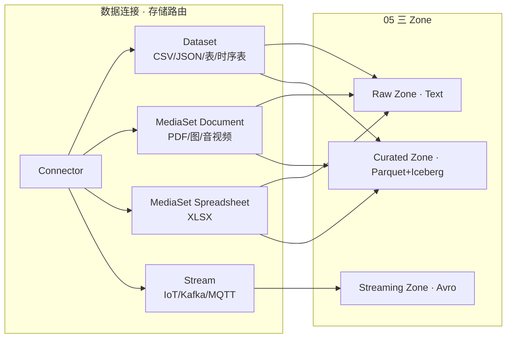

# 05b · 非结构化数据存储与接入路径补充方案

## DataSet + MediaSet + MediaReference · 三类数据三条路径

> **文档性质**：`[05 产品方案](05-数据集成Connectors-Pipeline-Dataset产品方案.md)` 的 **专项补充** · 聚焦非结构化/半结构化/时序 · 回扣「数据连接」线框节点  
> **版本**：v1.0 · 2026-07-13  
> **状态**：方案交付；**不修改 05/05a 正文**；后续可据此增补 05 §2、05a WF-DC 子模块  
> **信息来源**：Foundry 本地镜像 `[foundry/pages/](foundry/pages/)` · 社区/官宣补充（Spreadsheet MediaSet · 2025/10）· 用户本次提供的存储路由表  
> **关联**：[05 产品方案](05-数据集成Connectors-Pipeline-Dataset产品方案.md) · [05a 线框图](05a-数据集成Connectors-Pipeline-Dataset产品设计线框图.md) · [03 PRD §3.1](03-对标Palantir-AOS-PRD框架.md)

---

## 使用的 Rules

| Rule | 应用 |
|------|------|
| 中文回答 | 全文中文 |
| 先方案后代码 | 本文档即方案；不改业务代码、不改 05/05a 正文 |
| 最小更改 | 仅新增 `05b` + 更新 `[00-索引.md](00-索引.md)` 条目 |
| 照抄 Palantir | 机制优先引用镜像文档；镜像未覆盖处 **显式标注「待镜像补全」** |
| 与 05 自洽 | 三 Zone（Raw/Streaming/Curated）不变；本稿补 **存储路由 + 解析路径** 细节 |

---

## 1. 为什么需要 05b

`05` 已定义 **Connectors → Pipeline → Dataset (Iceberg/Parquet)** 与 **Raw · Streaming · Curated 三 Zone**，但对以下场景着墨不足：

| 缺口 | 05 现状 | 05b 补什么 |
|------|---------|-----------|
| PDF / 音视频 / 图像 | Raw Zone 笼统写「Text」 | **MediaSet** 专容器 + Document 型 schema |
| Excel 不规则表 | 提及 parseExcel | **Spreadsheet MediaSet**（LLM 提取 · Workshop 预览） |
| 结构化表 ↔ 原件回链 | 未展开 | **MediaReference** 桥接列 |
| Word / PPTX | 未写 | Document MediaSet + LLM（镜像无原生解析页） |
| IoT / 时序 | Streaming Zone 有 Avro | **Stream + CDC + Time Series Object** 完整路径 |
| 数据连接线框 | 05a 偏 Batch/表同步 | **存储路由 + 四条解析子流程** 展开 |

**Palantir 非结构化设计的「骨架」** 不是单一 Dataset，而是：

```text
DataSet（通用表格资产）
    +
MediaSet（非结构化专用 · 分 Document / Spreadsheet schema）
    +
MediaReference（Dataset 列 → MediaSet 文件指针 · 桥接关键）
```

---

## 2. 存储层三件套（核心设计）

### 2.1 DataSet —— 通用容器

| 属性 | 说明 |
|------|------|
| **存什么** | CSV · JSON · Parquet · 弱 Schema 半结构化 · 时序落地表 · **含 MediaReference 列的结构化表** |
| **版本** | Git-for-Data 式 Transaction · Branch · Snapshot / Append |
| **Foundry 依据** | `[datasets.md](foundry/pages/zh/foundry/data-integration/datasets.md)` · `[file-based-syncs.md](foundry/pages/zh/foundry/data-connection/file-based-syncs.md)` |
| **与 05 三 Zone** | Raw = Text/弱 Schema；Curated = Parquet + Iceberg |

**硬规则（结构化 → Ontology）**：

- 一个 **Object Type 只映射一张 Clean 表**（宽表如 SAP 200 列须 **Pipeline 拆表** 后再 Funnel）。
- Sync 侧 **原样摄取（As-Is）**；列类型识别与清洗在 **Pipeline**，不在 Connector。

---

### 2.2 MediaSet —— 非结构化专用存储单元

创建时需选择 **媒体文件类型 / schema**；错误 schema 会导致 Pipeline Builder **无法识别**（见 §7 踩坑）。

#### 2.2.1 Document 型 MediaSet

| 属性 | 说明 |
|------|------|
| **存什么** | PDF · 图像 · 音视频 · DICOM · 栅格等 |
| **镜像官方支持文档类** | 目前镜像 `[media-sets.md](foundry/pages/zh/foundry/data-integration/media-sets.md)` **仅列 `.pdf`** 为文档类；Word/PPTX **无独立文件类型页**，实践上按 **Document 型 MediaSet + 文件同步原样入库 + 下游 LLM/OCR** |
| **接入** | 数据连接 **媒体集同步**（S3/ABFS）· 拖拽上传 · Pipeline 输出 |
| **变换** | PB：PDF 文本提取 / OCR；Python：`transforms-media` |
| **Foundry 依据** | `[media-sets.md](foundry/pages/zh/foundry/data-integration/media-sets.md)` · `[media-set-sync.md](foundry/pages/zh/foundry/data-connection/media-set-sync.md)` · `[core-concepts.md](foundry/pages/zh/foundry/data-connection/core-concepts.md)` §媒体同步 |

> 官方明确：**处理 PDF、图像、视频等媒体时，推荐 MediaSet 而非普通 Dataset。**

#### 2.2.2 Spreadsheet 型 MediaSet（XLSX）

| 属性 | 说明 |
|------|------|
| **存什么** | `.xlsx` / `.xlsm` 等 Excel；支持 merged cells · 不规则格式 |
| **能力** | **LLM 驱动提取 → JSON** · **Workshop 预览** · **单元格注解**（2025/10 官宣 · **本地镜像暂无专页**） |
| **Schema 标识** | 创建时须指定 **`schema_type: spreadsheet`**（或 UI 选「电子表格」类型）；**不可**放入 Document 型 MediaSet |
| **与旧路径关系** | 镜像仍有 `parseExcelV1` · `TransformsExcelParser` · 文件批量同步进无 Schema Dataset —— **Spreadsheet MediaSet 是 2025 后推荐路径**，旧路径仍可用于简单表格式 Excel |

**待镜像补全**：`foundry/pages` 全文检索 **无** `spreadsheet` / `schema_type` 专页；本节依据用户提供的社区路由表与 2025/10 官宣能力整理。

---

### 2.3 MediaReference —— 桥接设计（关键）

**定义**：指向 MediaSet 内某一媒体项的 **轻量引用**；Dataset 某一列可直接存 MediaReference，**无需复制文件本体**。

**典型例子**：

```text
维修记录表（结构化）
├── report_id      : STRING
├── maintenance_date : DATE
├── part_replaced  : STRING
└── media_ref      : MediaReference  ──► 原始 PDF 扫描件（Document MediaSet）
```

**能力链**：

1. **Pipeline**：`Get media references`（PB）或 `list_media_items_by_path_with_media_reference`（Python）生成引用列  
2. **Dataset**：列 typeclass = `media_reference` → 数据集预览内联缩略图  
3. **Ontology**：对象属性类型 = MediaReference → Workshop / Object Explorer 预览原件  
4. **AIP / LLM**：`Use LLM` 节点可 **以 mediaReference 列为视觉输入**（须先 MediaSet → Table Rows）

**Foundry 依据**：

- `[media-sets.md](foundry/pages/zh/foundry/data-integration/media-sets.md)` §媒体引用  
- `[transforms-python/media-sets.md](foundry/pages/zh/foundry/transforms-python/media-sets.md)`  
- `[pipeline-builder-llm.md](foundry/pages/zh/foundry/pipeline-builder/pipeline-builder-llm.md)` §视觉提示  

---

## 3. 存储路由总表（数据连接 · 入库决策）

> 连接器拉取完成后，**第一件事是路由到正确存储容器** —— 这是「数据连接」节点下 **存储路由** 子模块的产品逻辑。

| 你的数据源 | Foundry 存储位 | 处理方式 | 镜像依据 | 备注 |
|-----------|---------------|---------|---------|------|
| **Text / CSV / JSON / 日志** | **Dataset**（Raw → Curated） | Apply Schema / inferSchema → Pipeline 清洗 → Parquet | `infer-schema.md` · `csv-parsing.md` | 半结构化见 §4 路径二 |
| **DB 表 / SAP 宽表** | **Dataset**（表 Batch Sync） | Apply Schema → 拖拽 PB 过滤去重 → Clean 表；宽表 **必须拆** | `set-up-sync.md` · `core-concepts.md` | 路径一 |
| **Excel (XLSX)** | **Spreadsheet MediaSet** | LLM 提取 + JSON 化 · Workshop 预览/注解 | **待镜像补全** + `parseExcelV1.md`（旧路径） | ⚠️ 不可进 Document MediaSet |
| **PDF** | **Document MediaSet** | AIP Document Intelligence 五步法（§5） | `media-sets.md` | 加密 PDF 不支持 |
| **Word / PPTX** | **Document MediaSet**（实践） | 同步原文件 → LLM 提取（无原生解析 doc） | `sharepoint-online.md`（任意文件进 Dataset 的通用表述） | 镜像无 docx/pptx 专页 |
| **图像 / 音视频** | **Document MediaSet** | OCR / 转录 / 切片 · Access Mode 预览 | `media-sets.md` §支持的文件类型 | |
| **IoT / 传感器 / 时序** | **Stream + Dataset** | CDC / OPC-UA / Kafka → 时序 Object | `streaming-guide.md` · `source-type-overview.md` §IoT | **不走 MediaSet** |

### 3.1 与 05 三 Zone 对照



- **MediaSet 初态** 等价于 Raw 区的 **非结构化原件**；经 Pipeline 抽出字段后写入 **Curated Dataset**，并保留 **MediaReference** 回链。
- **Stream** 对齐 05 **Streaming Zone（Avro）**；时序语义层见 §6。

---

## 4. 三类数据 · 三条路径（解析子流程）

数据连接 **入库路由** 之后，Pipeline Builder / Code Repos 侧走不同解析路径。

### 4.1 路径一：结构化（CSV / DB 表 / SAP 宽表）

```text
连接器 Batch Sync
    ↓
Apply Schema（自动识别列类型 · 表同步自带 Schema）
    ↓
Pipeline Builder：过滤 · 去重 · Join · 类型转换
    ↓
Clean 表（Curated · Parquet）
    ↓
OKF Funnel → Ontology Object Type（一表一 Type）
```

| 硬规则 | 说明 |
|--------|------|
| **一 Object Type ↔ 一 Clean 表** | Funnel 映射粒度 |
| **SAP 200 列宽表必须拆** | Pipeline 按业务域拆成多张 Clean 表后再 Ontology |
| **Sync 不做业务清洗** | `[data-connection/overview.md](foundry/pages/zh/foundry/data-connection/overview.md)` 原样摄取原则 |

**Foundry 依据**：`core-concepts.md` §表批量同步 · `infer-schema.md` · Pipeline Builder 标准表格节点。

---

### 4.2 路径二：半结构化（JSON / XML / API / 日志）

**核心操作：Explode（炸开）** —— 嵌套数组/结构体摊平为多张关联表。

**示例**：

```text
乘客预订 JSON（单文件嵌套）
    ↓ Explode
Passenger 表          Booking 表
├── passenger_id      ├── order_id
├── name              ├── flight_no
└── ...               └── ...
         └── Link：order_id
```

| 步骤 | 操作 |
|------|------|
| 1 | 文件 Batch Sync → Raw Dataset（无/弱 Schema） |
| 2 | `inferSchema` 或 Spark `read.json` 读入 |
| 3 | `explode` / `posexplode` 摊平嵌套列 |
| 4 | 输出多张 Curated 表 + 外键 Link 字段 |
| 5 | Funnel 分别映射多个 Object Type + Link Type |

**Foundry 依据**：

- `[infer-schema.md](foundry/pages/zh/foundry/building-pipelines/infer-schema.md)`  
- `[transforms-python/pyspark-syntax-cheat-sheet.md](foundry/pages/zh/foundry/transforms-python/pyspark-syntax-cheat-sheet.md)` · `F.explode`  
- `[building-pipelines/unstructured-overview.md](foundry/pages/zh/foundry/building-pipelines/unstructured-overview.md)`  

---

### 4.3 路径三：非结构化（PDF / Word / PPT / 图 / 音视频）

分 **Document** 与 **Spreadsheet** 两入口，汇合于 **Clean 表 + MediaReference**。

#### Document 类（PDF / Word / PPTX / 图像）

→ **§5 AIP Document Intelligence 五步法**

#### Spreadsheet 类（XLSX）

```text
Spreadsheet MediaSet（schema_type: spreadsheet）
    ↓
LLM 提取（merged cells / 不规则表头 · 输出 JSON/列）
    ↓
Workshop 预览 · 人工注解（可选）
    ↓
Curated 表 + media_ref 回指原 xlsx（可选）
```

**旧路径（镜像有文档）**：无 Schema Dataset + `parseExcelV1` / Java `TransformsExcelParser` —— 适合规则简单 Excel，**不规则场景优先 Spreadsheet MediaSet**。

---

### 4.4 路径四：IoT / 时序（并列于上三条）

**不走 MediaSet**，走 **Stream + Dataset + CDC**：

```text
OPC-UA / Kafka / Amazon IoT Core / MQTT(β)
    ↓ Stream Sync 或 Push Ingestion
Stream Dataset（低延迟 · Avro 语义）
    ↓ Pipeline（可选聚合 · 窗口）
时序 Dataset 或 直接 Ontology Time Series
    ↓
Ontology：传感器 Object · 动态属性 / Time Series Property（TSP）
```

| 要点 | 说明 |
|------|------|
| **接入层** | `[streaming-guide.md](foundry/pages/zh/foundry/data-integration/streaming-guide.md)` · `[set-up-streaming-sync.md](foundry/pages/zh/foundry/data-connection/set-up-streaming-sync.md)` |
| **IoT 连接器** | `[source-type-overview.md](foundry/pages/zh/foundry/data-integration/source-type-overview.md)`：Amazon IoT Core · Azure Event Hub · Google IoT Core · OPC-UA · OSI PI |
| **语义层** | `[time-series/time-series-overview.md](foundry/pages/zh/foundry/time-series/time-series-overview.md)`（偏 Ontology · 非 Data Connection 首页） |
| **与结构化相同终点** | 最终进 Ontology；**保留流式追加**（Append / CDC） |

---

## 5. AIP Document Intelligence 五步法（非结构化主路径）

适用于 **Document MediaSet** 内的 PDF（Word/PPTX 同理，镜像无逐步文档，流程对齐）。

```text
①  PDF 净化进 Document MediaSet
        │  （媒体集同步 / 上传 · 拒绝加密 PDF）
        ▼
②  OCR + 多模态视觉 AI「看」页面 → 输出 Markdown
        │  PB：Extract text (OCR) · Use LLM Vision + mediaReference
        ▼
③  从 Markdown 抽业务字段
        │  例：飞机尾号 · 维修日期 · 更换零件
        │  PB：Use LLM · Entity extraction 模板
        ▼
④  置信度抽样校验  ←—— 必做，最易翻车
        │  人工 Spot-check · Data Health 规则 · 低置信度回流
        ▼
⑤  输出 Clean Maintenance 表 + media_ref 列回指原始 PDF
        │  Get media references → typeclass media_reference
        ▼
    OKF Funnel → Maintenance Object（结构化字段 + 原件预览）
```

**Foundry 镜像对应**：

| 步骤 | 镜像文档 |
|------|---------|
| ① 入库 | `media-set-sync.md` |
| ② OCR/文本 | `media-sets.md` §文档变换 · PB functions-index「从 PDF 提取文本/OCR」 |
| ③ LLM 抽字段 | `pipeline-builder-llm.md` §实体提取 |
| ④ 校验 | 产品层规范（镜像无「置信度五步」专页） |
| ⑤ 回链 | `media-sets.md` §媒体引用 · `transforms-python/media-sets.md` |

---

## 6. 「数据连接」节点 · 线框展开规格（供 05a 增补）

> 以下树形结构已并入 **05a §3.0 / WF-DC-04b / WF-MS-01 / WF-PB-03**（v1.2）；05 §2.3.1 · §9 Backlog 已同步。

```text
数据连接 (Data Connection)
├── 连接器层
│   ├── 200+ Source Types · 插件化扩展
│   └── 拉取模式：Snapshot（全量/增量）· Append（追加）
│
├── 存储路由（入库第一决策 · 本稿核心）
│   ├── Dataset        → CSV / JSON / DB 表 / 时序落地表
│   ├── MediaSet(Doc)  → PDF / Word* / PPTX* / 图 / 音视频
│   ├── MediaSet(Excel)→ XLSX（schema_type: spreadsheet）
│   └── Stream         → IoT / Kafka / MQTT(β) / Kinesis
│
├── 解析路径（Pipeline 侧 · 数据连接仅提示默认路径）
│   ├── 结构化   → Apply Schema + 拖拽清洗 → Clean 表
│   ├── 半结构化 → Explode 炸开 → 多表 + Link
│   ├── 非结构化 → AIP Doc Intel 五步（OCR→MD→抽字段→校验→回链）
│   └── 时序     → Stream + CDC → Time Series Object
│
└── 桥接
    └── MediaReference（结构化表列 → MediaSet 原件 · Ontology 预览）
```

### 6.1 WF-DC 存储路由 · 配置向导（ASCII 线框草案）

```text
┌─ 新建同步 · 步骤 3/4：选择存储目标 ─────────────────────────────────────┐
│  源：{SharePoint / S3 / SAP / Kafka / …}                                  │
├───────────────────────────────────────────────────────────────────────────┤
│  检测到文件类型 / 源类型建议：                                             │
│                                                                           │
│  ○ Dataset（表格/半结构化）     ← CSV · JSON · JDBC 表 · API JSON        │
│  ○ MediaSet · 文档              ← PDF · 图像 · 音视频 · Word/PPT*        │
│  ○ MediaSet · 电子表格          ← .xlsx / .xlsm  【schema: spreadsheet】 │
│  ○ Stream                       ← Kafka · IoT · MQTT                     │
│                                                                           │
│  ⚠ 提示：.xlsx 请勿选「文档」MediaSet，否则 Pipeline Builder 无法识别    │
│                                                                           │
│  默认解析路径：[结构化 ▾]  [半结构化·Explode]  [非结构化·Doc Intel]       │
│                                    [时序·Stream]                          │
├───────────────────────────────────────────────────────────────────────────┤
│                              [上一步]  [创建同步]                          │
└───────────────────────────────────────────────────────────────────────────┘
```

### 6.2 与 05a 线框映射（v1.2 已落地）

| 05a 线框 | 05b 增补点 | 状态 |
|---------|-----------|------|
| WF-DC-01 首页 | 源卡片 **存储类型** 标签 | ✅ v1.2 |
| WF-DC-03 详情 | **创建媒体集同步** 入口 | ✅ v1.2 |
| WF-DC-04 同步 | 存储目标类型 · 解析路径提示 | ✅ v1.2 |
| WF-DC-04b | **存储路由向导** | ✅ v1.2 新增 |
| WF-PB-02 画布 | **Dataset / MediaSet / Stream** 三型输入 | ✅ v1.2 |
| WF-PB-03 | **Use LLM** · mediaReference 视觉 | ✅ v1.2 新增 |
| WF-DS-01 预览 | **MediaReference** 列内联缩略图 | ✅ v1.2 |
| WF-MS-01 | MediaSet 浏览器 · Document / Spreadsheet | ✅ v1.2 新增 |
| §12.4 旅程 D | PDF → media_ref → Funnel | ✅ v1.2 |

---

## 7. 踩坑与硬规则

### 7.1 `.xlsx` 不能进 Document MediaSet

| 错误 | 后果 |
|------|------|
| 把 `.xlsx` 拖进 **Document 型** MediaSet | Pipeline Builder **无法识别** · 变换节点不可用 |
| **正确** | 创建 **Spreadsheet 型** MediaSet（`schema_type: spreadsheet`） |

> 社区经验（2026-02 仍有人踩坑）：Excel 与 PDF **存储 schema 不同**，必须在数据连接 **存储路由** 阶段选对。

### 7.2 其他硬规则

| 规则 | 说明 |
|------|------|
| 加密/密码 PDF | MediaSet **不支持** |
| LLM 视觉输入 | 须 **MediaSet → Table Rows → mediaReference 列**；不能 MediaSet 直连 Use LLM |
| Sync 侧不做 OCR | OCR/LLM 在 **Pipeline**；Data Connection 只负责 **原样入库 + 路由** |
| 一 Type 一表 | Ontology Funnel 前须拆宽表 |
| Word/PPTX | 无 Foundry 原生解析器文档 · 规划 **LLM + Document MediaSet** 路径 |

---

## 8. Foundry 镜像覆盖度（自检）

| 主题 | 镜像是否有专页 | 05b 处理方式 |
|------|--------------|-------------|
| MediaSet / MediaReference | ✅ `media-sets.md` 完整 | 直接引用 |
| Media Set Sync | ✅ `media-set-sync.md` | 直接引用 |
| 文件批量同步 → Dataset | ✅ `file-based-syncs.md` | 直接引用 |
| parseExcel / inferSchema / explode | ✅ 有多页 | 直接引用 |
| Pipeline LLM / 实体提取 | ✅ `pipeline-builder-llm.md` | 直接引用 |
| IoT / Stream | ✅ `streaming-guide.md` · source-type | 直接引用 |
| **Spreadsheet MediaSet** | ❌ 镜像无 | 标注「2025/10 官宣 · 待镜像补全」 |
| **Word / PPTX 解析** | ❌ 无专页 | 标注「Document MediaSet + LLM · 待产品确认」 |
| **AIP Doc Intel 五步** | ⚠️ 分散在 media-sets + LLM | 本稿归纳为产品流程 |
| **schema_type: spreadsheet** | ❌ 镜像无 | 用户路由表 + 社区 |

---

## 9. 与 05 / 谛听 OKF 的衔接

```text
数据连接（05b 存储路由）
    │
    ├─ Dataset Raw ──────► Pipeline（三条解析路径）──────► Curated Parquet
    ├─ MediaSet ─────────► Pipeline（Doc Intel / LLM Excel）► Curated + media_ref
    └─ Stream ───────────► Pipeline（窗口/聚合）──────────► Curated / TSP
                                    │
                                    ▼
                            OKF Funnel（05 §2.4）
                                    │
                                    ▼
                            Ontology Object + Link
                            （含 MediaReference 属性 · Time Series 属性）
```

**05 v1.3 / 05a v1.2 已落地**：

1. ✅ `05` §1.2 · §2.3 MediaSet 行 · §2.3.1 存储路由 · §3.5 解析路径 · §9 Backlog  
2. ✅ `05a` §3.0 子模块树 · WF-DC-04b · WF-MS-01 · WF-PB-03 · §12.4 旅程 D  

**待办**：

- ~~HTML Demo 增加 MediaSet 浏览 / 存储路由向导页~~ ✅ v1.1 已落地（见 `foundry/html/README.md`）

---

## 10. 方案自洽性检查（v1.0）

| 检查项 | 结论 |
|--------|------|
| 与 05 三 Zone 冲突？ | **否** — MediaSet 为 Raw 非结构化补充；Curated 仍为 Parquet |
| Sync 原样摄取原则？ | **一致** — 解析均在 Pipeline |
| 镜像可验证？ | **大部分可** — Spreadsheet MediaSet / Word 路径待镜像补全已标注 |
| 线框可落地？ | **是** — §6 树 + ASCII 向导可直接并入 05a |
| 风险 | Spreadsheet schema 以官宣为准，实施前需对照最新 Foundry Release Notes |

---

## 11. 本地镜像 · 推荐阅读顺序

```text
data-connection/core-concepts.md       ← Batch / Stream / Media 四类同步
data-connection/file-based-syncs.md    ← 通用文件 → Dataset
data-connection/media-set-sync.md      ← 媒体 → MediaSet
data-integration/media-sets.md         ← MediaReference · 支持格式
data-integration/streaming-guide.md    ← IoT / MQTT
building-pipelines/infer-schema.md     ← CSV/JSON Apply Schema
building-pipelines/unstructured-overview.md
pipeline-builder/pipeline-builder-llm.md ← LLM 实体提取 · 视觉
pb-functions-transform/parseExcelV1.md ← Excel 旧路径
transforms-python/media-sets.md        ← MediaReference 代码示例
time-series/time-series-overview.md    ← 时序 Ontology
```

---

## 变更记录

| 版本 | 日期 | 变更 |
|------|------|------|
| v1.0 | 2026-07-13 | 初稿：存储三件套 · 存储路由表 · 三路径+时序 · Doc Intel 五步 · 数据连接线框展开 · 镜像覆盖度自检 |
