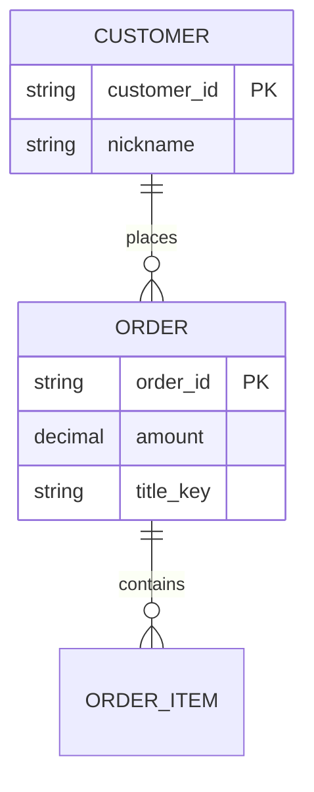
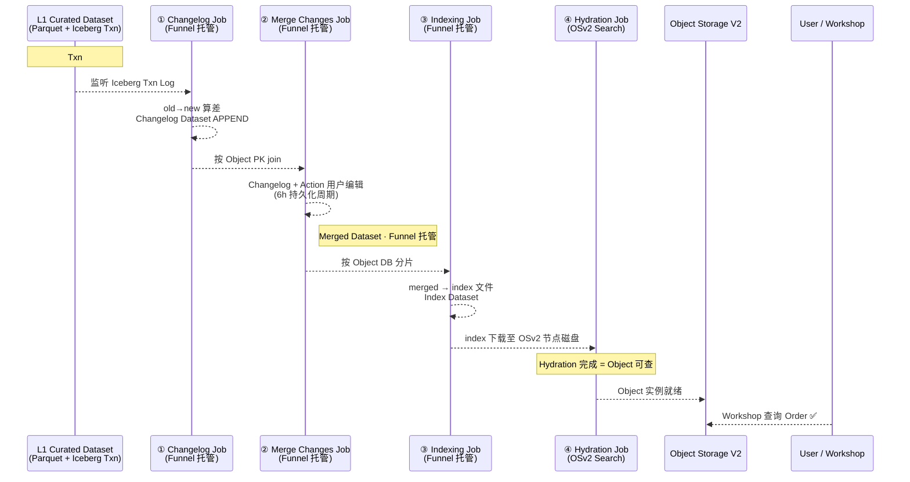
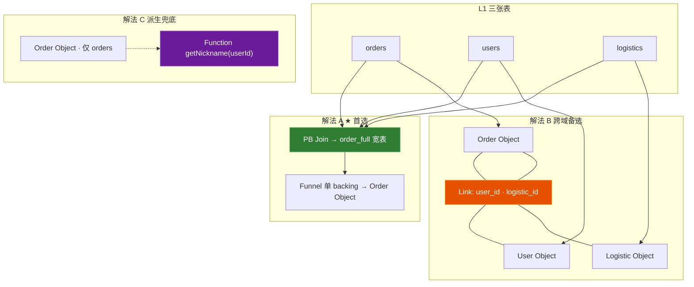
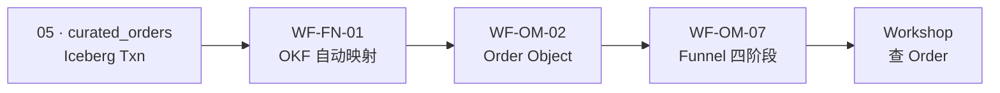

# 06 · Ontology Mapping 产品方案

## L2 语义本体层 · Object Data Funnel · Ontology Manager

> **文档性质**：对标 Palantir Foundry **Ontology / Hydration** 层的产品设计 · 含 Funnel 四阶段 · OMA 六视图 · 页面 Backlog  
> **版本**：v1.3 · 2026-07-17  
> **状态**：可直接作为 [03 PRD §3.2](03-对标Palantir-AOS-PRD框架.md) 子章节 / 研发 UI 规格 / PPT 素材  
> **对标来源**：[Ontology Overview](https://www.palantir.com/docs/foundry/ontology/overview) · [Ontology Manager](https://www.palantir.com/docs/foundry/ontology-manager/overview) · [Object Indexing / Funnel](https://www.palantir.com/docs/foundry/object-indexing/overview) · 本地镜像 `[foundry/pages/](foundry/pages/)`（Ontology 专章：`python scrape_foundry_docs.py --ontology` · meta 前缀 `ontology-*` · 见 §14）  
> **关联**：[03 PRD §3.2](03-对标Palantir-AOS-PRD框架.md) · [05 L1](05-数据集成Connectors-Pipeline-Dataset产品方案.md) · [06a 线框](06a-语义本体Ontology-Mapping产品设计线框图.md) · [**06b Action/Function**](06b-Action与Function产品设计.md) · [**20_tech/25 演进补丁**](20_tech/25-LLM-Wiki启示与L2演进补丁.md) · [HTML Demo](foundry/html/ontology.html) · [01 全链路](01-Palantir全链路总览.md)

---

## 使用的 Rules


| Rule        | 应用                                                         |
| ----------- | ---------------------------------------------------------- |
| 中文回答        | 全文中文                                                       |
| 先方案后代码      | 本文档即方案交付；不改业务代码                                            |
| 照抄 Palantir | Funnel 四阶段 · OMA 六视图 · 多源解法优先级来自官方立场                       |
| 与 L1 自洽     | 强依赖 05 Curated Dataset + Iceberg Txn；单一 backing dataset 原则 |
| 增强          | OKF Funnel 映射 · 对齐 03 §3.2.2 · 05 §2.4                     |


---

## 1. 产品定位

### 1.1 一句话

**L2 不是 ETL，是「Txn 监听器」——L1 Iceberg 的每一次 COMMIT，都是 L2 Object 的一次心跳；Funnel 把扁平二维表「水合」成可关联、可行动的数字孪生体；Action / Function 把孪生升级为企业的神经系统。**

### 1.2 身体比喻（神经系统）

| 组件 | 比喻 | 职责 |
|------|------|------|
| **Object** | 骨头与肌肉 | 构成形态 |
| **Link** | 血管与经络 | 输送关系 |
| **Function** | 肠胃与肝脏 | 静默计算（读） |
| **Action** | 大脑指令与嘴巴 | 对外交互、驱动现实（写） |

> **深度规范** → **[06b · Action 与 Function 产品设计](06b-Action与Function产品设计.md)**（壳核模式 · Submission Criteria · 乐观 UI · FUNC/ACT 条款）

### 1.3 L2 在大厦中的位置

```text
L1 Data Integration（05）
  Curated Dataset · Parquet 书 + Iceberg 索引卡
        │
        ▼ Object Data Funnel（Hydration · 增量水合）
L2 Ontology Mapping（本文 · 06）
  Object / Property / Link / Action / Function
        │
        ▼
L3 Workshop / AIP / 地图 / Quiver（消费层）
```


| 层级     | 角色比喻           | 核心任务                   |
| ------ | -------------- | ---------------------- |
| **L1** | 图书馆 · 书 + 管理系统 | 把数据编成带 Txn 的 Dataset   |
| **L2** | 图书管理员 + 分类法    | Funnel 按索引上架/更新 Object |
| **L3** | 读者 + 调度员       | 查 Object · 触发 Action   |


### 1.4 与上下游边界


| 层级     | 产品                                   | 本方案覆盖                                                     | 不覆盖                                                                 |
| ------ | ------------------------------------ | --------------------------------------------------------- | ------------------------------------------------------------------- |
| L1     | Dataset · Iceberg · Pipeline         | Funnel **输入契约**（backing dataset · PK · Schema）            | Connector / PB 细节 → [05](05-数据集成Connectors-Pipeline-Dataset产品方案.md) |
| **L2** | **Ontology Manager · Funnel · OSv2** | ✅ 全文                                                      | —                                                                   |
| L2 增强  | **OKF Funnel · LLM Wiki**            | 映射自动化 · 契约 Lint → [03 §3.2.2](03-对标Palantir-AOS-PRD框架.md) | Wiki UI 细节 → 另文                                                     |
| L3     | Workshop · AIP · Agent               | Object/Action **被消费** 的验收标准                               | Workshop 页面 → 另文                                                    |


---

## 2. 核心概念：Object / Property / Link

Funnel 要把 L1 数据映射成什么——必须先统一语义：


| 概念               | 定义                                  | 示例                          |
| ---------------- | ----------------------------------- | --------------------------- |
| **Object（对象）**   | 现实世界实体的数字替身 · **Object Type** 的实例   | 一辆具体的车 · 一笔具体订单 · 一个排污口     |
| **Property（属性）** | 对象特征 · 绑定 L1 **列（Column）** 或计算/时间序列 | 订单金额 · 车牌颜色 · 维修日期          |
| **Link（链接）**     | 对象间关系 · **Link Type** · 基数 + FK     | 车主 **拥有** 车辆 · 订单 **包含** 商品 |





---

## 3. L1 → L2 契约：Iceberg 与 Dataset

> 摘自 [05 §2.3](05-数据集成Connectors-Pipeline-Dataset产品方案.md) · 本节从 **L2 消费者视角** 重述。

### 3.1 技术名词对照（PPT 可用）


| 技术名词        | 形象比喻         | 职责                                                             |
| ----------- | ------------ | -------------------------------------------------------------- |
| **Parquet** | 书            | 承载具体数据字节                                                       |
| **Iceberg** | 图书管理系统 / 索引卡 | Manifest · Snapshot · Schema · Partition · **Transaction Log** |
| **Dataset** | 图书分类号        | 用户只说「我要 I247.5」，不关心物理路径                                        |
| **Funnel**  | 图书管理员        | 读 Txn Log → 算差 → 更新 Object 索引                                  |


### 3.2 Iceberg 事务封装层（L2 依赖的三类契约）


| 契约        | 机制                                 | 对 Funnel 的价值                                      |
| --------- | ---------------------------------- | ------------------------------------------------- |
| **增量契约**  | Transaction Log · Change Data Feed | 只消费 Delta/Changelog · **避免全表扫描**                  |
| **一致性契约** | ACID · Snapshot Isolation          | L2 不读到写入中间态脏数据                                    |
| **演化契约**  | Schema Evolution                   | Property 增删改可触发 **Replacement Pipeline** 而不杀 Live |


**硬依赖**：增量索引为 **Object Storage V2（OSv2）** 默认行为 → **L1 必须 Iceberg**；无 Txn Log 则 Funnel 只能全量重算，性能崩溃。

---

## 4. 核心机制：Object Data Funnel（Hydration）

### 4.1 Funnel 是什么 · 不是什么


|          | Funnel                                           | Pipeline ETL               |
| -------- | ------------------------------------------------ | -------------------------- |
| **输入**   | L1 Curated Dataset **Txn 事件**                    | 任意 Raw/Curated 表           |
| **输出**   | OSv2 可查询 **Object 实例**                           | 新 Dataset                  |
| **核心动作** | 监听 → 算 Changelog → Merge → Index → **Hydration** | Join / Filter / 业务清洗       |
| **官方名称** | Funnel batch pipelines · Foundry Build Job 串联    | Pipeline Builder Transform |


### 4.2 平台共用机制

#### 4.2.1 增量合并（Incremental merge）

- L1 Dataset 为 Iceberg · 每笔写入带 **Transaction ID**
- Funnel **不按全表重读**，只索引 **变更行（Delta / Changelog）**
- 官方表述：*按写入数据源流的顺序索引记录，只更新指定主键的给定 Object 的所有属性*
- **价值**：秒级～毫秒级 Object 更新 · 查询性能稳定

#### 4.2.2 严格类型一致（Type Coherence）

- L1 列 `"N/A"`（String）映射到 L2 Property（Double）→ **报错并丢弃记录**，不静默转型
- **价值**：Workshop / 地图前端不会因类型混乱崩溃

#### 4.2.3 主键 Upsert 与 Title Key


| 配置项                    | 作用                                         | 业务配置                     |
| ---------------------- | ------------------------------------------ | ------------------------ |
| **Primary Key**        | 判断 Insert / Update / Delete · Object 实例唯一性 | 业务在 OM 指定 backing column |
| **Title Key**          | 搜索/列表展示名（如订单号而非 UUID）                      | OM Property 标记           |
| **Backing Datasource** | 一个 Object Type ↔ **一个** L1 Dataset         | OM Data/Datasources Tab  |


### 4.3 业务个性化配置（Mapping Rules）

在 **Ontology Manager** 或 **Pipeline Builder Ontology 输出** 中完成：

1. 选择 **Backing Datasource**（Curated Dataset RID）
2. **Column → Property** 拖拽或自动映射（谛听：**OKF-002** 预推荐）
3. 指定 **PK** · **Title Key**
4. （可选）启用 **Object 编辑** → 与 Merge 阶段 6h 用户编辑周期联动

**镜像依据**：`[pipeline-builder/outputs-add-ontology-output.md](foundry/pages/zh/foundry/pipeline-builder/outputs-add-ontology-output.md)` · `[outputs-add-dataset-output.md](foundry/pages/zh/foundry/data-integration/outputs-add-dataset-output.md)`（Dataset 输出作为 OM 搭建基础）

---

## 5. Funnel 四阶段管道（Batch）

> 官方结构：**Changelog → Merge Changes → Indexing → Hydration** · 托管 Dataset 用户不可见 · Live / Replacement 双管道

### 5.1 时序图（增量水合）




### 5.2 四阶段 ASCII（OM-07 · PPT 纵向流水线）

```text
┌─ Funnel Batch Pipeline: Order Object ─────────────────────────────┐
│                                                                  │
│  ┌────────────────────────────────────────┐                     │
│  │ ① CHANGELOG JOB                         │                     │
│  │    Input: Curated Dataset Txn #891      │                     │
│  │    Output: Changelog Dataset (APPEND)   │  ← Funnel 托管      │
│  └──────────────────┬─────────────────────┘                     │
│                     ▼                                            │
│  ┌────────────────────────────────────────┐                     │
│  │ ② MERGE CHANGES JOB                     │                     │
│  │    Input: Changelog + Action Edits      │                     │
│  │    Output: Merged Dataset               │  ← Funnel 托管      │
│  │    PK join · 用户编辑 6h 周期            │                     │
│  └──────────────────┬─────────────────────┘                     │
│                     ▼                                            │
│  ┌────────────────────────────────────────┐                     │
│  │ ③ INDEXING JOB                          │                     │
│  │    Per Object DB 分片                   │                     │
│  │    Output: Index Dataset                │  ← Funnel 托管      │
│  └──────────────────┬─────────────────────┘                     │
│                     ▼                                            │
│  ┌────────────────────────────────────────┐                     │
│  │ ④ HYDRATION JOB                         │                     │
│  │    Index → OSv2 search nodes 磁盘       │                     │
│  │    进度在 OM → Data/Datasources 展示     │                     │
│  └────────────────────────────────────────┘                     │
│                                                                  │
│  Live pipeline: 数据源 Txn 触发 │ Replacement: Schema 变更后台   │
└──────────────────────────────────────────────────────────────────┘
```

### 5.3 Live vs Replacement 双管道


| 管道              | 触发条件                                        | 影响                   |
| --------------- | ------------------------------------------- | -------------------- |
| **Live**        | L1 新 Txn · 用户编辑（6h 周期）                      | 增量 · 线上持续服务          |
| **Replacement** | 新增 Property · 换 backing dataset · Schema 大改 | 后台全量重建 · **不切流直到完成** |


---

## 6. 复杂场景：多源异构三种解法

> **官方优先级**：A（L1 Join 宽表）> B（Link Type）> C（Computed Property + Function）




| 解法                          | 做法                                 | 适用                    | 限制                       |
| --------------------------- | ---------------------------------- | --------------------- | ------------------------ |
| **A · L1 Join**             | PB 合成 **单宽表** · 单 backing dataset  | 同域 · 同更新频率 · **性能最好** | 宽表维护在 L1                 |
| **B · Link Type**           | 多 Object · FK Link · searchAround  | 跨团队归属 · 更新频率差异大       | MDO 不支持流式 · 跨表查询较慢；**见性能红线** |
| **C · Computed + Function** | Property 不在 backing · Function 实时拉 | **仅低频派生** · 外部 API         | **禁止**高频查询字段；**不能**当主建模 · Workshop 易卡 |


#### 6.1 解法 B 性能红线（官方最佳实践）

| 红线 | 规则 |
| --- | --- |
| **Link 规模** | 当某 Object Type 相关 **Link 条数 > 100 万** 时，必须启用 **MDO（多域对象）优化** 或回退解法 A 预聚合；否则 searchAround / 图谱查询性能雪崩 |
| **流式** | MDO **不支持流式** Object；流式场景优先解法 A |
| **验收** | OMA 在 Link 规模接近阈值时告警，并阻断「无优化方案」的发布 |

#### 6.2 解法 C 禁用场景

| 允许 | 禁止 |
| --- | --- |
| 低频派生：展示名、偶发外部只读增强、报表侧计算 | **高频查询字段**（列表筛选/排序/聚合的主路径） |
| 被 Action Logic 偶尔调用 | Workshop 主表列依赖实时 Function 全量扫描 |

> 研发误用代价：Worker 打满、页面卡死。规范见约束 **C-12 / C-13**。

**谛听 OKF 增强**：解法 A 为主战场——OKF 垂直 Schema 在 PB Join 阶段即可建议 `user_id → nickname` · `logistic_id → status`，Funnel 单源映射 **≥80% 自动完成**（[05 §2.4](05-数据集成Connectors-Pipeline-Dataset产品方案.md) · [03 OKF-002](03-对标Palantir-AOS-PRD框架.md)）。

---

## 7. 闭环：Actions（从「看」到「干」）

> **详稿**：[06b Action 与 Function](06b-Action与Function产品设计.md) — 壳核模式 · Submission Criteria · 乐观 UI · `L2-OSV2-FUNC/ACT-SPEC`

```text
L1 Dataset ──Funnel──► L2 Object ──Workshop 选中──► Action 执行
                              ▲                           │
                              └──── 写回 L1 Write-back / Webhook
```


| 环节            | 说明                                                       |
| ------------- | -------------------------------------------------------- |
| **场景**        | 地图选中「故障设备」Object → 点击「派单维修」Action                        |
| **Funnel 逆向** | Action 写回 L1 Write-back Dataset 或声明 Webhook 副作用         |
| **Merge 联动**  | 用户编辑在 Merge 阶段与 Changelog **按 PK join**（6h 持久化）       |
| **完整闭环**      | L1 → Funnel → L2 → Action → L1                           |
| **乐观 UI**     | Workshop 先本地改态；后台失败回滚（06b §3.2）                           |
| **壳与核**       | Action = 交互壳；Function = 算力核（06b §4）                       |


#### 7.0 生产必备：幂等与软删除

| 要求 | 规则 | 验收 |
| --- | --- | --- |
| **Action 幂等** | 同一业务意图重复提交（双击「派单维修」）**不得**产生重复 Object；以幂等键（客户端 `idempotencyKey` 或业务自然键）去重 | 连点 10 次只生成 1 张工单 |
| **Object 软删除** | 删除 = 打 `is_deleted`（或官方 tombstone）标记，**非物理删行**；与 Iceberg 事务/审计对齐，支持回滚与血缘 | 删除后查询默认过滤；审计可还原 |

详条款见 [06b ACT-07/08](06b-Action与Function产品设计.md)。

**镜像提示**：流式 Object 类型 **不支持编辑**（[`funnel-streaming-pipelines`](foundry/pages/zh/foundry/object-indexing/funnel-streaming-pipelines.md)）。

### 7.1 Function 摘要（算力核）

| 要点 | 内容 |
|------|------|
| 定位 | 跨域动态聚合 · Workshop 派生指标 · 合规路径下的外部只读增强 |
| 精髓 | Object Schema → TS 接口 · **类型不一致保存即失败** |
| 规范 | [06b §2.3 FUNC-01~05](06b-Action与Function产品设计.md) |

### 7.2 Action 摘要（交互壳）

| 要点 | 内容 |
|------|------|
| 定位 | 受控 CRUD · 状态流转 · 防呆 · 跨系统 Side Effects |
| 精髓 | **Submission Criteria**（提交标准）+ Optimistic UI + 写回协议 |
| 规范 | [06b §3.3 ACT-01~06](06b-Action与Function产品设计.md) |

---

## 8. Ontology 官方子产品矩阵（Hydration 全家桶）


| 子产品                         | 官方定位                                            | 对应谛听架构                                                                     |
| --------------------------- | ----------------------------------------------- | -------------------------------------------------------------------------- |
| **Pipeline Builder Native** | PB 点选映射 Column → Property · 后端生成 Transform      | L1 PB ↔ L2 Funnel **映射配置入口**                                               |
| **Object Data Funnel**      | L1 Txn → OSv2 Hydration 四阶段                     | **L2 核心引擎**（本文 §4–§5）                                                      |
| **Ontology Manager (OMA)**  | 定义 Object / Link / Property / Action / Function | **L2 主应用**                                                                 |
| **Model Hydration**         | 外部模型绑定 Object/Action · 版本/安全/血缘                 | L2 Function / Action 扩展                                                    |
| **Native Federation**       | 外部湖仓联邦进 Ontology 不搬迁                            | L1 **Virtual Table**（[05 §2.3](05-数据集成Connectors-Pipeline-Dataset产品方案.md)） |


---

## 9. Ontology Manager · 六视图整体布局

> 持久化：**左侧边栏** + **顶栏搜索** · 对标用户提供的 OMA 布局表


| 视图                  | 位置                          | 核心内容                                             |
| ------------------- | --------------------------- | ------------------------------------------------ |
| **Discover**        | 首页 OM-01                    | 收藏 · 最近查看 · 新人「最近修改 + 重要 Object」                 |
| **Object Type**     | 点进某 Object OM-02            | Overview **6+1 区块**（见 §9.1）                      |
| **Property Editor** | Overview → Properties OM-03 | 字段类型 · backing column · title key · TSP          |
| **Link Type**       | Overview → Link graph OM-04 | 左/右 Object · 基数 · FK 映射                          |
| **Action Type**     | Overview → Actions OM-05    | Overview · Logic · Observability（30 天用量 + 监控）    |
| **Function Type**   | Overview → Function OM-06   | Overview · Configuration · Observability · Usage |


### 9.1 Object Type · Overview 页（OM-02 · 官方 6 Tab）

```text
┌─ Ontology Manager: Order Object ──────────────────────────────────┐
│  ← 返回  [🔍 搜索]  [+ 新建]  [分支: master ▾]  [保存]            │
├──────────────────────────────────────────────────────────────────┤
│ [Overview●] [Properties] [Action types] [Link type graph]         │
│ [Dependents] [Data] [Usage]                                       │
├──────────────────────────────────────────────────────────────────┤
│ ① Metadata      图标 · Title Key · PK · 状态标签 · OSv2           │
│ ② Properties    列表 → 点击进入 Property Editor (OM-03)           │
│ ③ Action types  可执行 Action 列表 → OM-05                        │
│ ④ Link graph    关系图 → 点击 Link → OM-04                        │
│ ⑤ Dependents    消费此 Object 的 App / Workshop / Pipeline         │
│ ⑥ Data          ★ Datasources Tab · Funnel 四阶段进度/报错 (OM-07) │
│ ⑦ Usage         30 天读写 · 活跃用户（Control Panel 开 metrics）  │
└──────────────────────────────────────────────────────────────────┘
```

**横切 · Data Health**：`Data → Datasources` 是 L2 监控 Funnel 的 **唯一官方入口**；流式 backing Object 暂不支持完整监控器（镜像限制说明）。

---

## 10. 约束与规则（Constraints）


| ID       | 规则                                                           | 原因                        |
| -------- | ------------------------------------------------------------ | ------------------------- |
| **C-01** | **单一 backing dataset**：一个 Object Type 只挂载 **一张** L1 表        | Funnel 单源水合 · 多表须 L1 Join |
| **C-02** | **主键唯一**：backing dataset **有且仅有一个** PK · 无重复                 | 重复 PK → OSv2 报错或状态错乱      |
| **C-03** | **禁止 Funnel 内业务计算**：汇率换算 · 多表打分等 → L1 Pipeline 或 L2 Function | Funnel 只做映射与水合            |
| **C-04** | **类型严格**：L1/L2 Schema 冲突则丢弃并告警                               | Type Coherence            |
| **C-05** | **Iceberg 前置**：无 Txn Log 无增量 Funnel                          | OSv2 默认增量索引               |
| **C-06** | **Schema 变更走 Replacement**                                   | 不中断 Live 查询               |
| **C-07** | Function 默认只读；写走 Action / 官方 Edits                         | [06b](06b-Action与Function产品设计.md) |
| **C-08** | Action 写回 L1 Write-back / Edits，禁直写底层                      | 06b ACT-03                  |
| **C-09** | Action 必须配置 Submission Criteria                            | 官方提交标准                    |
| **C-10** | 外部写/通知走 Action Webhook，TS Function 不裸调 HTTP               | 官方 input-output-types     |
| **C-11** | 复杂派生用 Function；主建模优先 L1 Join                              | 对齐 §6                      |
| **C-12** | 解法 B：Link > **100 万** 须 MDO/预聚合，否则禁发生产                    | §6.1 性能红线                 |
| **C-13** | 解法 C：禁止用作高频查询/筛选/排序主字段                                      | §6.2 禁用场景                 |
| **C-14** | Action 必须幂等；Object 删除必须软删                                    | §7.0 · 06b ACT-07/08        |


---

## 11. 页面清单（研发 Backlog）

> UI 线框规格：详见 **[06a 线框图](06a-语义本体Ontology-Mapping产品设计线框图.md)** · 本期 OM ASCII 见 §9 · Funnel 见 §5.2  
> **谛听增强页**：WF-FN-01 已在 [05a](05a-数据集成Connectors-Pipeline-Dataset产品设计线框图.md) · 并入 OM 或独立 `/okf-funnel`


| 页面 ID | 名称                   | 路由建议                          | 线框 ID    | 关键组件                             | 对齐官方               |
| ----- | -------------------- | ----------------------------- | -------- | -------------------------------- | ------------------ |
| OM-01 | Discover 首页          | `/ontology`                   | WF-OM-01 | 收藏/最近/重要 Object 卡片               | Discover 视图        |
| OM-02 | Object Type Overview | `/ontology/object-types/:rid` | WF-OM-02 | 7 Tab · Metadata 六区块             | Object type 视图     |
| OM-03 | Property Editor      | 嵌 OM-02                       | WF-OM-03 | backing column · title key · TSP | Property editor    |
| OM-04 | Link Type 编辑器        | 嵌 OM-02                       | WF-OM-04 | 左/右 Object · 基数 · FK             | Link type 视图       |
| OM-05 | Action Type 编辑器      | 嵌 OM-02                       | WF-OM-05 | Logic · Observability · 监控规则     | Action type 视图     |
| OM-06 | Function Type 编辑器    | 嵌 OM-02                       | WF-OM-06 | Code Repo 跳转 · Usage             | Function type 视图   |
| OM-07 | Funnel Pipeline 状态   | OM-02 → Data/Datasources      | WF-OM-07 | 四阶段进度 · Live/Replacement         | Funnel batch       |
| OM-08 | Branch / 版本          | `/ontology/branches`          | WF-OM-08 | Object 分支 · 与 Dataset 分支对齐       | Ontology branching |
| —     | OKF Funnel Mapper    | `/okf-funnel`                 | WF-FN-01 | 自动映射 · Lint · Publish            | 谛听增强               |


---

## 12. 端到端用户旅程

### 12.1 旅程 E · 标准水合（结构化 · 解法 A）




### 12.2 旅程 F · PB Native 映射（Hydration 全家桶）

```text
Pipeline Builder 输出 → 新 Object Type + Link
  → 部署 Pipeline → Funnel 自动挂 backing
  → OM Data Tab 看 Hydration 进度
  → Workshop 消费
```

### 12.3 旅程 G · Action 闭环

```text
Workshop 选中 Device Object → Action「派单」
  → 写回 L1 maintenance_tickets Dataset (APPEND)
  → 下一 Txn 触发 Funnel Changelog
  → Device Object 状态 Property 更新
```

---

## 13. 与 03 / 05 模块 ID 对照


| 03 PRD ID        | 06 方案章节             | 05 衔接       |
| ---------------- | ------------------- | ----------- |
| ONT-001~004      | §4 · §9 · OM-02~06  | —           |
| ONT-005 Funnel   | §4–§5 · OM-07       | 05 §2.4 闭环  |
| OKF-002          | §6 解法 A · WF-FN-01  | 05 WF-FN-01 |
| CON-004 Pipeline | §6 解法 A Join        | 05 WF-PB-02 |
| WIKI-002 双向绑定    | （Object Property 侧） | 03 §3.2.3   |


---

## 14. 本地镜像覆盖度

> Ontology 专章侧栏约 **316** 页；命令：`python docs/palantier/foundry/scrape_foundry_docs.py --ontology --skip-existing`  
> 索引：`foundry/meta/ontology-url-index.json` · 报告：`ontology-scrape-report.json`（不覆盖 L1 的 `url-index.json`）


| 主题                       | 镜像路径                                              | 状态                      |
| ------------------------ | ------------------------------------------------- | ----------------------- |
| PB Ontology 输出           | `pipeline-builder/outputs-add-ontology-output.md` | ✅                       |
| Dataset → OM 搭建          | `pipeline-builder/outputs-add-dataset-output.md`  | ✅                       |
| CDC → OSv2               | `data-integration/change-data-capture.md`         | ✅                       |
| Virtual Table            | `data-integration/virtual-tables.md`              | ✅                       |
| Ontology / Ontologies 概览 | `ontology/*` · `ontologies/*`                     | ✅ 已落盘                   |
| Object / Link Types      | `object-link-types/*`（39 页）                     | ✅                         |
| Action Types             | `action-types/*`（26 页）                          | ✅                         |
| Functions                | `functions/*`（52 页）                             | ✅                         |
| Ontology Manager         | `ontology-manager/*`（8 页）                       | ✅                         |
| Object Indexing / Funnel | `object-indexing/*` · **含 `funnel-batch-pipelines.md`** | ✅ · 对标 OM-07      |
| Object Explorer / Views  | `object-explorer/*` · `object-views/*`            | ✅                         |
| Map Timeline             | `map/timeline.md`                                 | ⚠ stub（官方 hang · 可重试） |
| TSP / 传感器 OT             | `time-series/*` + OM 引用                           | ✅ 部分（多在 L1 TOC）         |


---

## 15. PPT / PRD 金句

1. **「Funnel 不是 ETL，是 Txn 监听器——L1 Iceberg 的每一次 COMMIT，都是 L2 Object 的一次心跳。」**
2. **「多源异构首选 L1 Join 宽表单 backing，Link Type 是跨域备选，Computed Property 是派生兜底——Palantir 官方优先级，不是拍脑袋。」**
3. **「Parquet 是书，Iceberg 是索引卡，Dataset 是分类号，Funnel 是管理员——L2 只认管理员手里的索引，不认仓库里的乱书。」**
4. **「类型不一致就丢弃，不是 Funnel 冷酷，是 Workshop 不能崩。」**
5. **「从后视镜到驾驶舱：Object/Link 看清世界，Function 算账，Action 下令——才是数字孪生操作系统。」**（[06b](06b-Action与Function产品设计.md)）

---

## 16. 变更记录


| 版本   | 日期         | 变更                                                                       |
| ---- | ---------- | ------------------------------------------------------------------------ |
| v1.0 | 2026-07-13 | 初稿：定位 · Iceberg 契约 · Funnel 四阶段 · 多源解法 · OMA 六视图 · OM Backlog · 旅程 E/F/G |
| v1.1 | 2026-07-14 | HTML Demo OM+Funnel；03 §3.2 回写；Ontology 专章镜像 `--ontology`；§14 更新         |
| v1.2 | 2026-07-14 | 神经系统比喻 · §7/C-07~11 · 链 [06b](06b-Action与Function产品设计.md)               |
| v1.3 | 2026-07-17 | 吸收 [25](20_tech/25-LLM-Wiki启示与L2演进补丁.md)：图谱健康 · Constitution · Insight · TTL |


---

## 17. L2 演进补强（对齐 25 · 2026-07-17）

> 详细规则与验收见 [25](20_tech/25-LLM-Wiki启示与L2演进补丁.md) · 技术 [T06](20_tech/T06-Ontology与Action-Function详细技术方案.md)。

| 能力 | 产品一句话 | 优先级 | Demo |
| --- | --- | --- | --- |
| **AOS Constitution** | OKF 升级为可执行、版本化契约（语义·推理·伦理）；Git + Apollo 同绑 | P0 | `funnel.html` |
| **图谱健康度** | 悬空 Link / 属性冲突 / 僵尸 Object / 规则冲突（≠ L1 数据健康） | P1 | `ontology-graph-health.html` |
| **Insight Object** | AIP 回填沉淀的可链接知识对象（写入仍经 Draft/Action） | P0（与 07 共担） | Draft / Lineage |
| **生命周期 / TTL** | Insight 归档与时序 Property 聚合；可审计 | P2 | 合于图谱健康「归档候选」 |

**口径：** Funnel = 数据水合；**不是** Insight Backfill。

---

*v1.3 · docs/palantier/06 · L2 Ontology · Funnel + Action/Function 神经系统*
