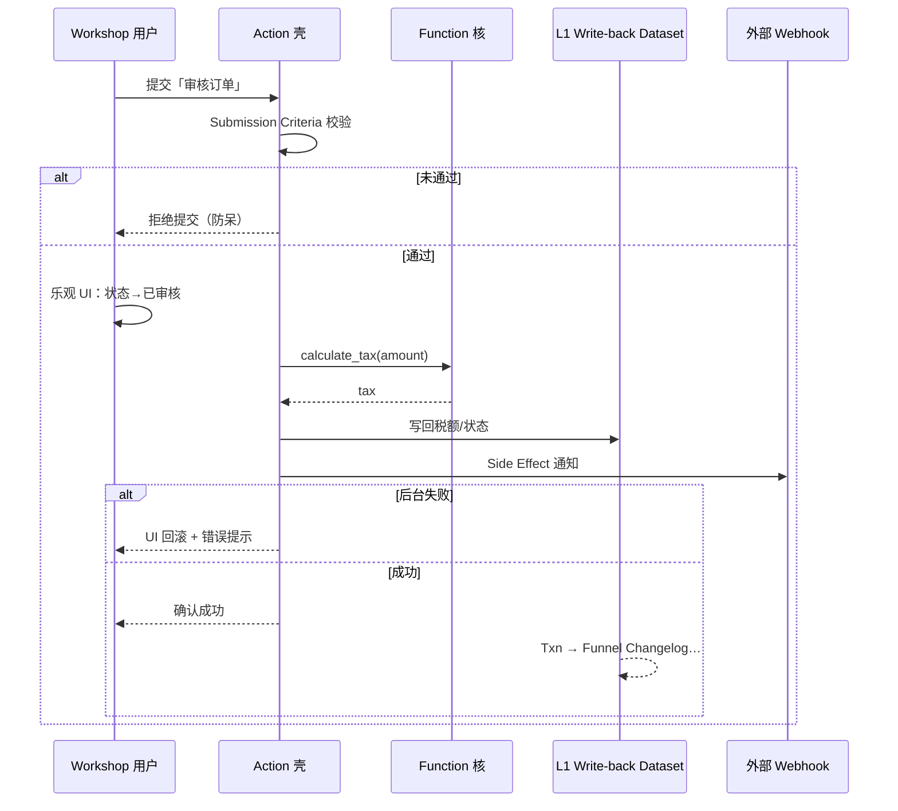

# 06b · Action & Function 产品设计

## L2 神经系统：交互壳 + 算力核

> **文档性质**：[`06` Ontology Mapping 产品方案](06-语义本体Ontology-Mapping产品方案.md) 的 **Action / Function 深度子章** · PRD 规范 + 线框对齐  
> **版本**：v1.0 · 2026-07-14（索引交叉：2026-07-17 · C-12 / 07b）  
> **定位**：L2 不仅是「数字孪生」，更是企业的**神经系统**——Action = 对外反应的神经末梢；Function = 静默算力内核  
> **对标镜像**：[action-types/submission-criteria](foundry/pages/zh/foundry/action-types/submission-criteria.md) · [side-effects / notifications](foundry/pages/zh/foundry/action-types/notifications.md) · [functions/input-output-types](foundry/pages/zh/foundry/functions/input-output-types.md) · [functions/overview](foundry/pages/zh/foundry/functions/overview.md) · [function-actions](foundry/pages/zh/foundry/action-types/)  
> **关联**：[03 §3.2 ONT-003/004](03-对标Palantir-AOS-PRD框架.md) · [06a WF-OM-05/06](06a-语义本体Ontology-Mapping产品设计线框图.md) · [07b Capability](07b-Capability-Adapter重能力接入.md) · Demo `ontology-action.html` / `ontology-function.html`

---

## 使用的 Rules


| Rule     | 应用                                      |
| -------- | --------------------------------------- |
| 中文       | 全文中文                                    |
| 先方案后代码   | 本文即方案；Demo 另改最小页                       |
| 照抄官方再增强  | Submission Criteria · Side Effects · 类型绑定来自镜像 |
| 与 L1/Funnel 自洽 | Action 写回走 L1 Write-back / Changelog · 禁止绕过 Funnel 契约 |
| 谛听差异     | OKF/Wiki 已在 03/其他文；本文聚焦官方 Action/Function |


---

## 1. 身体比喻：形态 → 神经

| 组件 | 身体比喻 | 职责 | 读写 |
|------|---------|------|------|
| **Object** | 骨头与肌肉 | 构成业务实体形态 | 经 Funnel 注入 |
| **Link** | 血管与经络 | 输送关系与上下文 | 图查询 |
| **Function** | 肠胃与肝脏 | 默默消化计算 · **无 UI** | **以读为主** |
| **Action** | 大脑指令与嘴巴 | 对外交互 · 驱动现实 | **写 + 副作用** |

```text
后视镜时代：看报表 → 第二天开会
驾驶舱时代：Workshop 看清现状 → Action 下达指令
              → Function 算账 · Submission Criteria 防呆
              → Webhook/通知联动上下游
```

**金句：** *引入 Action 与 Function 后，平台从「后视镜」变成「驾驶舱」——这才是数字孪生操作系统。*

---

## 2. Function：Ontology 的算力内核

### 2.1 定位

Function 是 L2 处理复杂逻辑的「逃生舱」：开发者用 **TypeScript（主）/ Python** 写逻辑，但**强类型、生存在 Ontology 语境**——不是裸奔脚本。

| 场景 | 说明 | 为何不用 L1 / Action |
|------|------|---------------------|
| **A · 跨域复杂计算** | 如：90 天准时交付率 <80% **且** 物流成本波动 >15% 的订单总金额 | L1 宽表过重；Action 是写通道，不适合纯读聚合 |
| **B · 外部数据增强** | Object 仅有客户 ID，运行时补全评级等 | L1 批处理不够实时 |
| **C · 派生指标** | Workshop 柱状图「健康度评分」仅业务专家懂算法 | 算法封装为 Function，前端直接调 |

> **官方边界（镜像锚定）：** TypeScript Function **不可直接调外部 HTTP API** 做写路径；作为 Action 一部分调外部系统请用 **Webhook**（[`input-output-types`](foundry/pages/zh/foundry/functions/input-output-types.md)）。  
> 场景 B 的产品意图保留：可用 **External Sources / Query Functions / Python 路径**（视栈）做只读增强；写侧统一走 Action + Webhook。

### 2.2 精髓：类型安全（Type Safety）

- 官方 SDK 将 Object Type **编译为 TypeScript 接口**
- `input.customer.name` 若 Schema 无 `name` → **保存即报错，不可部署**
- 发布要求：**所有入参显式类型注解 + 显式返回类型**（镜像原文）

**价值：** 代码逻辑与数据模型绝对一致——Workshop / Agent 不会踩到「运行时属性不存在」。

### 2.3 规范 ID：`L2-OSV2-FUNC-SPEC`


| 条款 ID | 规范 | 验收 |
|---------|------|------|
| **FUNC-01** | **类型绑定**：显式 Input Type（Object / Object Set / 标量）与 Output Type；禁止脱离 Ontology 的「裸奔」代码 | Code Repo 编译失败用例可复现 |
| **FUNC-02** | **执行环境**：服务端隔离沙箱；默认可调用 Ontology **只读** API（写编辑需官方 Edits API / Function-backed Action 显式路径） | 权限探测 |
| **FUNC-03** | **性能约束**：单次执行建议超时 **≤60s**；**内存上限 2GB**/次；禁止 Function 内全表盲扫 | 超时/OOM 与指标告警 |
| **FUNC-04** | **无 UI**：Function 不直接渲染表单；由 Workshop / Action Logic / 其他 Function 调用 | OM-06 无 Submission UI |
| **FUNC-05** | **可组合**：可被其他 Function / Action Logic 复用（壳核模式） | calculate_tax 被「审核订单」Action 调用 |
| **FUNC-06** | **资源隔离**：超内存/超时由 Runtime 杀进程，不影响其他 Worker 上的 Function | 故障演练 |


### 2.4 与解法 C 的关系

[06 §6](06-语义本体Ontology-Mapping产品方案.md) **Computed Property + Function** = 派生兜底，**不能当主建模**。  
主路径仍是 L1 Join 宽表；Function 负责动态、跨域、专家规则。

---

## 3. Action：驱动现实的交互契约

### 3.1 定位

Action 定义「可以对 Object **做什么**」——带 **校验、权限、副作用** 的 API 包装器；打破 L2「只读」魔咒，实现 **Write-back**。

| 场景 | 说明 |
|------|------|
| **A · 状态流转** | 选中故障设备 →「派单维修」→ 改设备状态 + 创建维修工单 Object |
| **B · 防呆校验** | 「已完成」须先上传验收单 → **Submission Criteria**（官方名：提交标准） |
| **C · 跨系统联动** | 「批准大额付款」→ 改财务 Object + **Side Effect**：邮件/钉钉 + 银行 API（Webhook） |

### 3.2 精髓：乐观 UI（Optimistic UI）与闭环

```text
用户点击 Action
  ① 前端先改本地态（待审批 → 已通过）     ← 即时体感
  ② 后台异步：权限 · Criteria · 写库 · 外部调用
  ③ 失败则回滚 UI + 提示（并发冲突等）
```

与 Funnel：**Action 写回 → L1 Write-back Dataset / Ontology Edits → Changelog → 下一次 Hydration**，形成  
`L1 → Funnel → L2 → Action → L1` 闭环（[06 §7](06-语义本体Ontology-Mapping产品方案.md)）。

### 3.3 规范 ID：`L2-OSV2-ACT-SPEC`


| 条款 ID | 规范 | 验收 |
|---------|------|------|
| **ACT-01** | **单一职责**：一个 Action = 一个业务意图（关单 / 批准）；禁止杂糅无关逻辑 | OM 命名与参数审计 |
| **ACT-02** | **强校验**：必须配置 **Submission Criteria**；服务端在改数前完成权限 + 业务前置条件 | Criteria 未满足不可提交（镜像定义） |
| **ACT-03** | **写回协议**：变更写入 L1 **Write-back Dataset** 或 Ontology Changelog / Edits；**严禁绕过 L1 直写底层存储** | 沿袭可见 |
| **ACT-04** | **副作用声明**：邮件 / 钉钉 / 外部 API 必须在 Action 显式声明 Notification / **Webhook** Endpoint | Side Effects 面板非空即配置项可见 |
| **ACT-05** | **乐观 UI**：Workshop 先本地反馈，失败回滚；用户可感知延迟目标 P95 < 体感阈值 | 交互验收 |
| **ACT-06** | **可调用 Function**：Logic 可编排 Function（核），Action 只做壳 | 壳核联调 |
| **ACT-07** | **幂等**：同一 idempotencyKey/业务键重复提交不产生重复 Object 或重复副作用 | 双击派单只一单 |
| **ACT-08** | **软删除协议**：删除类 Action 写 is_deleted（或等价 tombstone），禁物理抹行 | 审计可还原 |
| **ACT-09** | **Draft 隔离存储**：Draft/提案态写入独立 Draft Dataset，与生产主 Dataset 物理隔离 | 提案失败不污染生产 |
| **ACT-10** | **副作用重试**：Webhook/通知失败重试 3 次、间隔 1s；仍失败进死信队列+人工干预 | 死信可重放 |


官方名锚定：

- 提交标准 = [Submission Criteria](foundry/pages/zh/foundry/action-types/submission-criteria.md)（旧称 Validation）
- 副作用 = Side Effects · [Notifications](foundry/pages/zh/foundry/action-types/notifications.md) · Webhooks

##### Draft 存储机制（ACT-09）

生产主 Dataset / Ontology 主状态 ≠ Draft Dataset（提案 / HITL 待审）。审批通过后按 ACT-03 写入 Write-back；过期/拒绝可归档保留审计。

##### 副作用超时与死信（ACT-10）

Webhook 失败 → retry×3（间隔 1s）→ 仍失败进 DLQ → 人工重放或关闭。

---

## 4. 壳与核：Action + Function 组合拳

```text
[L2 Ontology]

  OBJECT 订单
    ├─ Property: 金额 ($1000)
    └─ Property: 税额 (?)

  FUNCTION（逻辑核 · 纯代码 · 无 UI）
    calculate_tax(amount) → amount * 0.13
    └─ 供 Action / 其他 Function 调用

  ACTION（交互壳 · 有表单 · 有副作用）
    INPUT:  用户勾选「减免税」
    LOGIC:  调用 Function calculate_tax
    OUTPUT: 订单.税额 = 结果 · 订单.状态 = 已审核
    SIDE:   发邮件通知风控
```



| 角色 | 做 | 不做 |
|------|----|------|
| **Action 壳** | 表单参数、权限、Criteria、编排、写回、副作用 | 复杂纯算法堆在 UI 规则里 |
| **Function 核** | 类型安全计算、可复用派生 | 直接弹窗 / 发邮件（副作用归 Action） |

---

## 5. 页面与模块对照


| 需求 / 条款 | 06b 章节 | 06a 线框 | HTML Demo |
|-------------|----------|----------|-----------|
| ONT-004 Function | §2 | WF-OM-06 | `ontology-function.html` |
| ONT-003 Action | §3 | WF-OM-05 | `ontology-action.html` |
| FUNC-01~05 | §2.3 | WF-OM-06 Configuration | Function · 类型/超时 |
| ACT-01~06 | §3.3 | WF-OM-05 Logic + Criteria + Effects | Action · 多 Tab |
| 壳核 calculate_tax | §4 | 两页互相链 | Demo 互联 |

**新增 / 增强 Demo 行为（v1.0）：**

- Action：**Submission Criteria** 列表 + **Side Effects** + **调用 Function** + 乐观 UI 演示条  
- Function：**Input/Output 类型**、超时、只读声明、被 Action 引用

---

## 6. 约束总表（并入 06 §10）


| ID | 规则 |
|----|------|
| **C-07** | Function 默认只读 Ontology；写操作走 Action / 官方 Edits 路径 |
| **C-08** | Action 写回必须进 L1 Write-back 或官方 Edits 链路，禁直写湖仓文件 |
| **C-09** | Action 必须有 Submission Criteria（可极简，但不可空声明） |
| **C-10** | 外部写/通知用 Action Side Effect（Webhook/Notification），不在 TS Function 内裸调 HTTP |
| **C-11** | 复杂派生优先 Function；主数据建模优先 L1 Join（对齐 06 解法优先级） |
| **C-12** | 超 FUNC-03（超时/内存/GPU/长会话）的外部包走 Capability Adapter（[07b](07b-Capability-Adapter重能力接入.md)）；写回仍经 Action；回调禁直写库 |

---

## 7. 旅程

### 旅程 G′ · 壳核审核订单

```text
Workshop「审核订单」Action
  → Criteria：金额>0 且当前用户∈财务组
  → 乐观 UI：状态变已审核
  → Function calculate_tax
  → Write-back Dataset APPEND
  → Funnel Changelog → Order.税额 Hydration
  → Side Effect：邮件风控
```

### 旅程 H · 车间健康度（纯 Function）

```text
Workshop 图表绑定 Function health_score(deviceSet)
  → 只读聚合 · 不写 L1
  → 超时 / 缓存策略受 FUNC-03 约束
```

---

## 8. PPT / PRD 金句

1. **Object 是肉身，Link 是经络，Function 是脏腑算力，Action 是神经末梢——缺 Action 的「孪生」只是蜡像。**
2. **Function 动脑，Action 动手；壳核分离，才既可测又可运营。**
3. **Submission Criteria 不是妨碍效率，是把「防呆」写进操作系统。**
4. **从后视镜到驾驶舱：看清 → 下令 → 算账 → 联动，才是 L2 操作系统。**

---

## 9. 变更记录


| 版本 | 日期 | 变更 |
|------|------|------|
| v1.0 | 2026-07-14 | 初稿：身体比喻 · Function/Action 定位 · 壳核 · FUNC/ACT 规范 · 乐观 UI · 官方镜像锚定 |
| v1.0.1 | 2026-07-17 | C-12 链 [07b Capability Adapter](07b-Capability-Adapter重能力接入.md)；重能力不进 Function 沙箱 |


---

*v1.0.1 · docs/palantier/06b · Action 壳 + Function 核 → 企业神经系统*
