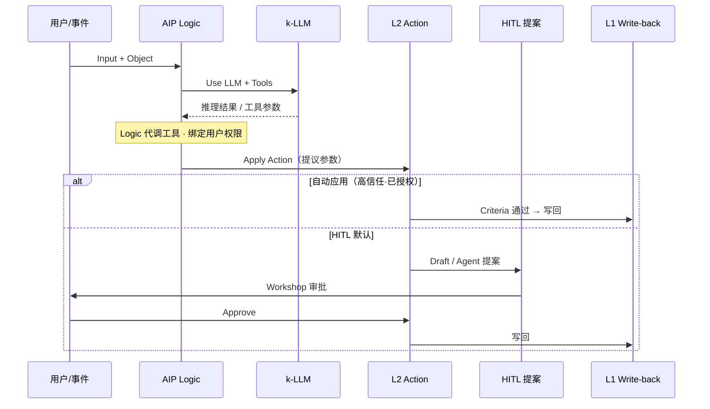

# 07 · AIP 人工智能平台产品方案

## k-LLM 路由 + AIP Logic / Chatbot Studio（原称「左引擎」）

> **文档性质**：对标 Palantir **AIP（Artificial Intelligence Platform）** 的产品设计 · 固化为 PRD 子章  
> **版本**：v1.2.4 · 2026-07-17（口径：对外/技术方案统一称 **AIP**；「左引擎」仅历史别名；吸收 **25 Insight Backfill** · **07b 重能力**）  
> **状态**：可直接作为 [03 PRD §3.3 AIP](03-对标Palantir-AOS-PRD框架.md) 详稿 · 研发 / PPT 素材  
> **目标态技术对齐**：[20_tech / T07](20_tech/T07-AIP人工智能平台详细技术方案.md) · [25 演进补丁](20_tech/25-LLM-Wiki启示与L2演进补丁.md) · **不含右引擎实现**  
> **对标在线（本期深挖）**：  
> · [AIP Logic 概述](https://www.palantir.com/docs/zh/foundry/logic/overview/) · [核心概念](https://www.palantir.com/docs/zh/foundry/logic/concepts/) · [入门/UI](https://www.palantir.com/docs/zh/foundry/logic/getting-started/)  
> · [Platform overview](https://www.palantir.com/docs/foundry/platform-overview/overview/index.html) · [AIP capabilities](https://www.palantir.com/docs/foundry/platform-overview/aip-capabilities/)  
> · [AIP features](https://www.palantir.com/docs/foundry/aip/aip-features/) · [Build with AIP](https://build.palantir.com/)  
> **本地镜像**：`foundry/pages/zh/foundry/logic/`*（overview · concepts · getting-started · automate · evals）  
> **微信文归档（已读入）**：`C:/work/palantir/Palantir官方文档—如何实现AI赋能：代理、逻辑与模型集成.html` · 摘录 [ref/微信-AIP代理逻辑与模型集成-摘录.md](ref/微信-AIP代理逻辑与模型集成-摘录.md)（作者基于官方 docs 整理 · mid=2247484154）  
> **关联**：[03 §3.3](03-对标Palantir-AOS-PRD框架.md) · [06 Ontology](06-语义本体Ontology-Mapping产品方案.md) · [06b Action/Function](06b-Action与Function产品设计.md) · [**07b Capability Adapter**](07b-Capability-Adapter重能力接入.md) · [05 L1 Use LLM](05-数据集成Connectors-Pipeline-Dataset产品方案.md)

---

## 使用的 Rules


| Rule    | 应用                                                                      |
| ------- | ----------------------------------------------------------------------- |
| 中文      | 全文中文                                                                    |
| 先方案后代码  | 本期交付方案文档；HTML Demo 列 Backlog                                            |
| 照抄官方    | 产品名、Logic Block、Automate 提案、安全模型以官方为准                                   |
| 与 L2 自洽 | AIP **编排语法**；L2 提供 **名词(Object)+动词(Action/Function)**；写回须过 06b Criteria |
| AIP决策引擎 | 本文聚焦 **左引擎 AIP**；右引擎另文，RT-004 只声明边界                                     |


---

## 1. 总体定位

### 1.1 一句话

**AIP 不是 Chatbot 外壳，而是把生成式 AI 接到运营上的决策层：模型集成（k-LLM）负责「选哪个脑」，Logic 负责「怎么编排提议」，Agents/Chatbot Studio 负责「谁来交互交付」，L2 Action 负责「怎么干」。**

微信文（官方 docs 整理）概括三大支柱：


| 支柱                    | 解决什么                    | 对应本文                  |
| --------------------- | ----------------------- | --------------------- |
| **Model Integration** | 「用什么模型」· 统一接入与生命周期      | AIP-001 · §2.1 / §2.4 |
| **AIP Logic**         | 「怎么用模型」· 无代码可复用业务函数     | AIP-002 · §2.2 / §3   |
| **AIP Agents**        | 「谁用 / 怎么交付」· 交互封装与多渠道部署 | AIP-002 对话形态 · §5b    |


AI **锚定 Ontology**：本体不止静态结构，更承载动态业务运行逻辑。

### 1.2 官方产品地图（当前命名）

> 官方已更名：**AIP Agent Studio → AIP Chatbot Studio（formerly Agent Studio）**。  
> 「拖拽 Logic Blocks」的主产品是 **AIP Logic**（no-code LLM Functions），不是 Chatbot Studio  alone。


| 官方应用                                   | 定位                                                 | 对应 03/本文            |
| -------------------------------------- | -------------------------------------------------- | ------------------- |
| **AIP Logic**                          | 无代码编排 LLM Function · Prompt · Tool · Ontology 读写提议 | AIP-002 主承载 · §4    |
| **AIP Chatbot Studio**（原 Agent Studio） | 面向对话的 Agent · Ontology 工具 · 部署到应用                  | AIP-002 对话形态 · §4.3 |
| **模型选择 / 自定义模型接入**                     | Model-agnostic：平台支持多 LLM + 自有模型                    | AIP-001 k-LLM · §3  |
| **AIP Evals**                          | 评测集 · 门控上线                                         | AIP-005             |
| **AIP Assist**                         | 平台内上下文助手（非业务 Agent）                                | 横切 · 可选 P2          |
| **AIP Threads**                        | 临时文档/对话探索                                          | 探索态 · 非生产主路径        |
| **Automate + Logic**                   | 条件触发 · **提案暂存 / 人工审核后应用**                          | AIP-004 Draft · §5  |
| **Palantir MCP / OSDK**                | 外部 IDE / 应用调 Ontology + Logic                      | 开发生态 · Backlog      |


### 1.3 与上下游边界

```text
人类意图（自然语言） / 对象事件
        │
        ▼
┌─ AIP（本层 · 左引擎）─────────────────────────────┐
│  k-LLM 路由 → Logic Blocks / Chatbot → Draft 提议  │
└──────────────────────┬────────────────────────────┘
                       ▼ 工具 = Query / Function / Action
┌─ L2 Ontology（06 / 06b）──────────────────────────┐
│  Object · Link · Function（核）· Action（壳+Criteria）│
└──────────────────────┬────────────────────────────┘
                       ▼ Write-back / Edits
┌─ L1 Dataset / Funnel（05 / 06）───────────────────┐
│  ACID · Schema · 权限 · Hydration                  │
└───────────────────────────────────────────────────┘
```


| 层级      | 角色           | AIP 做什么                                 | 不做什么            |
| ------- | ------------ | --------------------------------------- | --------------- |
| **AIP** | 逻辑编排者 / 「语法」 | 路由模型 · 编排推理 · 生成**提议**                  | 不当数据生产者；不直写湖仓   |
| **L2**  | 「名词 + 动词」    | 提供 Object / Wiki 字段 / Function / Action | 不负责多模型路由 UI     |
| **L1**  | 契约与落盘        | Funnel / Write-back 校验落地                | 不跑 Agent Prompt |


**评审金句：** *L2 提供名词和动词，AIP 编排语法，生成「文章」（决策）；LLM 提议，系统按 Action 契约执行。*

### 1.4 官方决策三角 · AI Mesh（Platform Overview）

> 官方一句话：*Palantir AIP connects generative AI to operations.*  
> 来源：[Platform overview](https://www.palantir.com/docs/foundry/platform-overview/overview/index.html)

**AI Mesh：** Apollo（软件交付）+ Foundry（数据运营）+ AIP（智能）组成完整平台；Ontology 是贯穿决策的**关键差异化架构**，Ontology 要表达的是企业的 **decisions（决策）**，而不只是 data 表结构。

**每一个决策拆成三构件（须与 L2 语义对齐）：**


| 构件          | 官方问题                  | 平台载体                                                                    | 对谛听                          |
| ----------- | --------------------- | ----------------------------------------------------------------------- | ---------------------------- |
| **Data**    | 决策依赖的事实与运营真相是什么？      | Object / Link · 语义搜索 · Media · Value Types · **OSDK 作 operational bus** | 06 Object + Wiki 字段          |
| **Logic**   | 护栏规则、相似历史、模型概率与优化结果？  | LLM / 预报 / 优化器 · Rules · Automate · Contour/Quiver 模板分析                 | AIP Logic · Function · Evals |
| **Actions** | 决策如何落到真实世界（kinetics）？ | Action · Function-backed · Webhook · **Scenario 沙箱分叉**                  | 06b Action 壳 + Criteria      |


**Human + AI teaming：** 数据进 Object/Link 后，同时对人与 AI 可读；平台基线探索工具再叠加 **AIP Assist** 缩短摸数时间。

### 1.5 身体/驾驶舱衔接


| L2（06b）             | AIP（07）                          |
| ------------------- | -------------------------------- |
| Function = 肠胃算力     | Logic「Use LLM / Tool」调度何时算       |
| Action = 神经末梢       | Apply Action / Tool Use **提议**派单 |
| Submission Criteria | Draft 批准后仍须过 L2 Criteria         |
| 乐观 UI（人点按钮）         | Draft Approve ≈ 人批准 AI 提议后再写     |


---

## 2. 三大支柱（模型 · 逻辑 · 代理）

### 2.1 k-LLM：模型无关的路由器（AIP-001）

传统痛点：锁死单一公有云模型 → 换模改全栈。


| 说法                                 | 出处                                                                                                        | 产品含义                                                  |
| ---------------------------------- | --------------------------------------------------------------------------------------------------------- | ----------------------------------------------------- |
| **k-LLM**                          | 官方中文 Logic 核心概念明确写出 *符合 Palantir 的 k-LLM 理念*                                                              | 多模型纳管 · **按 Block 选不同 LLM**                           |
| **Language Model Service**         | [Platform overview · Models](https://www.palantir.com/docs/foundry/platform-overview/overview/index.html) | 统一多模态接口 · **抽象具体厂商与实现**                               |
| modeling objective + model adapter | 同文档                                                                                                       | 训练内建 / 自带容器 / 预训练均可绑 Ontology；经 Function 做实时交互，或批量进管道 |


Palantir / 叙事中的 **k-LLM（k-Model LLM）** = **多模型纳管 + 场景路由 + 热切换**（英文文档也常写 choice of LLMs / custom models / model integration）。


| 能力           | 机制                                                    | 价值              |
| ------------ | ----------------------------------------------------- | --------------- |
| **公私混部**     | 公有云（OpenAI / Anthropic 等）+ 私有化 / 自建模型同注册              | 敏感数据可强制走私有      |
| **场景路由**     | 按任务类型、成本、安全等级选模；**Logic 内每个 Block 可绑不同模型**            | 分类走私有小模；复杂推演走大模 |
| **热切换 / 熔断** | Language Model Service 抽象供应商；上层 Prompt **不绑死**具体模型 ID | 降级与切换不改业务编排     |
| **平台治理**     | Control Panel · AIP settings（官方）                      | 管理员开关能力面        |
| **漂移监控**     | Evaluations 跨模型、跨时间对比（官方）                             | 换模有评测依据         |


**路由策略示例（可配置）：**


| 任务类型                 | 建议路由     | 约束                   |
| -------------------- | -------- | -------------------- |
| 摘要 / 标签 / 简单分类       | 私有小模型    | 默认不出境                |
| 业务问答 · 政策解读          | 私有或专有通道  | 优先读 Wiki 字段（AIP-003） |
| 复杂供应链推演 / 长 CoT      | 高强度大模型   | 成本预算与审批              |
| 代码 / 正则辅助（PB Assist） | 平台内嵌 LLM | 与数据通路隔离              |


### 2.2 AIP Logic：LLM 的「操作系统」（AIP-002）

官方定义（[Logic 概述](https://www.palantir.com/docs/zh/foundry/logic/overview/)）：*无代码开发环境，用于搭建、测试和发布由 LLMs 提供支持的函数*；利用 Ontology，避开传统 IDE + API 调用的复杂度；界面可完成提示设计、测试、评估监控、设置自动化等。

- **输入**：Ontology Object / 文本字符串 / 官方列举的基本类型（数组、布尔、日期、数值、字符串、时间戳等）
- **输出**：字符串 / 对象 **或 Ontology edits（建议/应用）**
- **发布后用法**：与平台其他 Function 一样可被 Workshop 等调用；**要写 Ontology，须经 Action 或 Automate 调用已发布的 Logic**（见 §3.5）
- **安全**：与平台一致的用户与 Function 权限 · **仅授予 LLM 完成任务所需访问**

**场景举例（官方配图提示）：** 供应链助手 · Query「配送中心邮件」对象 · 只看正文 · 据历史有效方案推荐解决方案 · 输出 `recommended solution` 字符串。

**Chatbot Studio** 侧重交互式 Agent 与工具目标达成；**Logic** 侧重可发布、可 Automate、可 Eval 的 **确定性工作流函数**。PRD 中二者同属「Agent 编排」，实现上分应用入口。

### 2.3 Logic 与管道侧 LLM 互补（官方）

[Platform overview](https://www.palantir.com/docs/foundry/platform-overview/overview/index.html) 明确两种模交互高度互补：


| 路径                              | 形态                          | 产出                           |
| ------------------------------- | --------------------------- | ---------------------------- |
| **AIP Logic / Chatbot（在线）**     | 请求时推理 · Workshop / Automate | 即时回复或提案                      |
| **Pipeline Builder Use LLM（批）** | 管道内分类 / 情感 / 摘要 / 抽取 / 翻译   | **离线生成提案**供运营审，避免事事 live 打模型 |


谛听对齐：L1「Use LLM 节点」提案进 Object；左引擎 Logic 做交互/事件驱动——勿二选一互斥。

### 2.4 模型集成展开（微信文 §4 · 对齐 Platform Overview）

统一接口接各类模型；经 **Modeling Objectives** 投入生产并接到业务应用。


| 组件                  | 说明                                |
| ------------------- | --------------------------------- |
| **Model Artifacts** | 训练产物：文件、参数、权重、容器或凭证               |
| **Model Adapter**   | Foundry 如何加载 / 初始化 / 推理的交互逻辑与环境依赖 |


**接入方式（PRD 纳管清单）：**


| 方式                 | 来源示例                                                |
| ------------------ | --------------------------------------------------- |
| 模型文件               | pickle · bin · onnx                                 |
| 容器化                | Docker（Flask/Python · Plumber/R · Spring Boot/Java） |
| 外部托管               | Vertex AI · Azure ML · OpenAI · SageMaker           |
| 平台内训               | Code Repositories · Jupyter                         |
| 开箱 LLM / Embedding | 商用与开源语言模型 · 嵌入模型                                    |


**自定义 LLM 注册（Function Interfaces）：** 创建 Source（API 端点）→ Webhook / TypeScript 函数调用 → 发布供平台使用 → **可直供 AIP Logic**。本地 / 自有云 / 微调模型均可。

**操作化：** 开发集成 → 多候选评估发布（实时/批量）→ 经 OSDK / Platform SDK 在业务流中查询函数、对象与 LLM。

---

## 3. Logic Block 与 UI（官方入门对照）

> 锚点：[入门指南](https://www.palantir.com/docs/zh/foundry/logic/getting-started/) · [核心概念](https://www.palantir.com/docs/zh/foundry/logic/concepts/)  
> 用户草稿中的 Block 名与官方一致；下列按**现行文档**补齐全量块表与关键写回约束。

### 3.0 应用界面：三栏（产品 UI 规格）

```text
┌─ AIP Logic ─────────────────────────────────────────────────────────────┐
│  左：输入(A) · 块链(B) · 输出(C)     中：调试器(Debugger)     右：运行面板  │
│       + 右侧栏 Uses → 创建自动化 · 单元测试 · 运行历史                       │
└─────────────────────────────────────────────────────────────────────────┘
```


| 区        | 职责                                               | 研发含义                               |
| -------- | ------------------------------------------------ | ---------------------------------- |
| **输入**   | 基本类型 / Object 入参命名与类型                            | 入参契约 · Automate 条件要求输入为 Object     |
| **块链**   | 可串联 · 前块输出可进后块                                   | 可视化 DAG / 链                        |
| **输出**   | 块中间输出 + **函数最终输出**：值 **或** Ontology 编辑全集         | 无 Ontology edits → 无法建提案式 Automate |
| **调试器**  | 展 CoT · 工具调用 · 展开/折叠块卡 · **试跑中的提议编辑（场景内预览，不真写）** | Decision Lineage 的设计态预览            |
| **运行面板** | 试跑 · 最近运行 · 单元测试快照                               | 与 Evals 衔接                         |


### 3.1 块类型全表（官方）

```text
┌─ AIP Logic Function ─────────────────────────────────────────────────────┐
│  [Input] → [Create Variable / Get Attributes / Execute]*                 │
│         → [Use LLM (+ Tools)] → [Transform] → [Apply Action Block]?      │
│         → Output: 值 | Ontology edits                                    │
└──────────────────────────────────────────────────────────────────────────┘
```


| Logic Block                      | 官方定位                          | 笔记                             |
| -------------------------------- | ----------------------------- | ------------------------------ |
| **Input**                        | 入参区（界面区 A）                    | 自然语言意图常作 string；业务态常作 Object   |
| **创建变量 (Create Variable)**       | 为后续块准备常量/中间量                  | 类型：数组/布尔/日期/数值/字符串/时间戳         |
| **获取对象属性 (Get Object Property)** | 从输入对象选属性                      | 「名词」进上下文                       |
| **使用 LLM (Use LLM)**             | 提示 + **工具** + 块输出 · **核心**    | 可挂 Tools；**可每块选不同 LLM（k-LLM）** |
| **变换 (Transform)**               | 表达式变换                         | 字符串→日期 · JSON 解析 · 数学表达式       |
| **应用操作块 (Apply Action Block)**   | **确定性**调用 Action · **不经 LLM** | 参数精确可控 · 更快；见双模 §3.2           |
| **执行块 (Execute)**                | 确定调用函数（含语义搜索等）                | 预取数据喂 LLM · 补 Transform 不够用时   |


> **硬约束（官方 callout）：** 即便函数里含 **Apply Action 块**，**除非从 Action / Automate 调用已发布 Logic，否则 Ontology 不会被编辑。** 调试器里看到的只是场景内**提议编辑**。

### 3.2 Tool Calling：双模 Apply Action（官方区分）


| 模式                            | 行为                  | 适用                |
| ----------------------------- | ------------------- | ----------------- |
| **A · Use LLM +「应用操作」作 Tool** | LLM **酌情**决定是否、对谁调用 | 开放式诊断 →「要不要建告警」   |
| **B · Apply Action Block**    | 流程走到该步即填表执行（或进提案）   | 已判定严重级 → **必定**建单 |


共同点：产出仍是平台侧 **Ontology edits / Action 调用**，受权限与（HITL 时）提案审批约束——**不是 LLM 直连改库**。

### 3.3 工具集（官方四类 · 映射 Data / Logic / Action）

> 官方：*工具是 LLM 能读写 Ontology、推动现实操作的机制；LLM **没有直接访问工具的权限**——只能 **请求** 使用，由 **AIP Logic 在「调用用户」权限范围内执行。*


| 工具                       | 官方作用                                | 对 06b                   |
| ------------------------ | ----------------------------------- | ----------------------- |
| **查询对象 (Query Objects)** | 指定可访问的 Object 类型与**属性子集**（控词元）      | Object 读 · Wiki 字段作属性子集 |
| **调用函数 (Call Function)** | 代码库 Function 或 **已有 Logic 函数**      | Function 核              |
| **应用操作 (Apply Actions)** | 经 Action Type 编辑 Ontology；可描述「何时该用」 | Action 壳                |
| **计算器 (Calculator)**     | 精确数学                                | 防幻觉算数                   |
| **调用能力 (Call Capability)** | **AOS 扩展**：外部重能力（Job/Session） | [07b](07b-Capability-Adapter重能力接入.md) |


提示写法（官方建议）：**先写任务概述** → 再给数据与工具使用指导；Prompt 内用 `**/`** 注入分析中可用的变量/对象属性。

> **重代码包（短视频 / 数字人等）：** 不进 Function 沙箱扛 GPU；经 **Capability Adapter** 登记后，由本表「调用能力」或 Action 副作用触发。详见 [07b](07b-Capability-Adapter重能力接入.md)。

### 3.4 Prompt 工程

- Prompt 编辑器 · `/` 变量注入（Object 字段 / Wiki 字段）
- Few-shot · 版本管理
- 与 **AIP Evals** 联动：改 Prompt 须过评测门控方可升生产（AIP-005）
- Evals 官方用途：调试 Prompt · **跨模型对比（如 GPT-4 vs 3.5）** · 多次运行方差检查

### 3.5 Ontology 写回发布路径（必读 · 防研发踩坑）

官方「使用 Logic 做 Ontology 编辑」四步：

```text
1. Use LLM 挂「应用操作」工具（及/或 Apply Action 块）
2. 发布 Logic Function
3. 新建 Action Type，以该 Logic Function 为 backing（或 Automate 调 Logic）
4. Workshop 绑定该 Action → 真写 / 或 Automate 提案审核后写
```


| 阶段                        | 会发生什么               | 不会发生什么                   |
| ------------------------- | ------------------- | ------------------------ |
| Logic 画布 **试跑**           | 调试器展示提议 edits + CoT | **不**落 Ontology          |
| **未发布**                   | 可调试                 | 不可被 Workshop Action 生产调用 |
| **已发布 + Action/Automate** | 真执行路径 · 权限/提案约束仍在   | 仍非「LLM 直写 JDBC」          |


其他官方用法：Logic 以 **字符串输出** 支撑 Workshop **Markdown 微件**；Logic 可被其他 Logic / FoO 再调用。

#### 3.5.1 Ontology Edits 合并机制（多 Logic 并发提议）

当多个 Logic / Agent **同时提议修改同一 Object** 时，必须显式合并策略（不可静默互踩）：

| 策略 | 适用 | 说明 |
| --- | --- | --- |
| **字段级合并** | 默认推荐 | 不同 Property 无冲突则自动合并；同字段冲突升级 |
| **Last Write Wins** | 低关键字段 | 带版本号/时间戳；全量审计 |
| **人工仲裁** | 金额/状态等关键字段 | 进 Draft Dataset + Workshop 审批（ACT-09） |

验收：两路提案改同一 `status` → 不得静默覆盖；须进冲突队列或仲裁 UI。

---

### 3.6 执行范围（微信文 §3.5）


| 模式         | 说明                 | PRD 默认   |
| ---------- | ------------------ | -------- |
| **用户范围执行** | 以当前调用用户权限代调工具 / 执行 | **默认**   |
| **项目范围执行** | 以项目身份执行（特殊授权）      | 须单独开关与审计 |


与官方「工具在**调用用户**权限内执行」一致 → 见约束 A-08。

---

## 4. 安全与合规：LLM 没有直接写权限

### 4.1 原则


| 原则                       | 说明                                                                            |
| ------------------------ | ----------------------------------------------------------------------------- |
| **LLM 提议，系统执行**          | LLM 只生成 Proposal / staged edits / Changelog 意图                                |
| **工具中介**                 | 工具调用由 Logic **代调**且绑定**调用用户**权限（官方）                                           |
| **L2 Action 契约**         | 真正写须 Action · **Submission Criteria** · 权限（[06b](06b-Action与Function产品设计.md)） |
| **L1 / Funnel 落盘**       | ACID · Schema · Write-back · 可溯源 Hydration                                    |
| **最小权限 / Control Plane** | Actions 权限构成控制面；Agent **沙箱化**——只能操被授权的数据与工具（Platform overview）                |
| **Scenario 沙箱**          | 紧耦合场景下先改 Ontology **分支**做后果推演（Vertex / Workshop What-if），再生产 Commit           |





### 4.2 与 06 Funnel 的关系

- AIP **不替代** Funnel；AIP 触发的写最终变成 L1 Txn → Funnel Changelog → Object 刷新
- 「AI 改了业务态」在沿袭上应能看到：**Decision Lineage → Action → Write-back Dataset → Funnel**

### 4.3 决策结果回流（官方飞轮）

Platform overview：把决策结果写回 Ontology，使**未来决策带着历史选择语境**——可再训练/微调模型，也可仅让操作员看清「过去怎么做的」。  
→ 谛听：Approve / Reject 元数据进入 Lineage +（可选）右引擎训练集；**不绕过** L2。

---

## 5. 闭环：Draft Action + Decision Lineage

### 5.0 三条提案通道（Platform Overview）

官方：多数模式里 Agent **不直接改**，而是生成提案，再交给人 refinement / feedback / 决策：


| 通道                | 时序                     | 官方锚点                                                                                             |
| ----------------- | ---------------------- | ------------------------------------------------------------------------------------------------ |
| **同步**            | Logic 嵌 Workshop，当场出提案 | AIP Logic ↔ Workshop                                                                             |
| **异步 · Automate** | 对象集条件触发 · 分阶段审批        | [Logic↔Automate](https://www.palantir.com/docs/zh/foundry/logic/aip-logic-integration-automate/) |
| **异步 · 管道**       | PB Use LLM 节点批产提案      | Pipeline Builder                                                                                 |


提案模式同时强化 HITL，并产生**反馈元数据**，使 Agent 可随连续反馈演进。

### 5.1 HITL · Draft Action（AIP-004）

官方落地形态（镜像 `foundry/pages/zh/foundry/logic/aip-logic-integration-automate.md`）：

- AIP Logic 输出 **Ontology edits** → Automate（**Uses** 面板一键生成自动化，按 Logic 预填流程）
- 可配置：**自动应用** 或 **分阶段审批（提案）**
- 触发：现有 Object 变更 / **新 Object 创建**
- **提案 Tab**：查看原因 · 预览建议操作 · **代理决策日志**
- 接受提案 → 操作执行 → 提案移至「已应用」
- **安全窗口：** 开放提案仅对**创建该自动化的用户**可见，且约 **24h**（官方 FAQ）

产品叙事对齐你的「Draft Action」：


| 步骤  | 说明                                  |
| --- | ----------------------------------- |
| 1   | Agent 分析故障 → **不直接下单**              |
| 2   | 生成 Draft（设备 ID · 故障码 · 推荐维修人 · 依据）  |
| 3   | Workshop / 提案台 **一键 Approve**       |
| 4   | 过 L2 Criteria → Write-back → Funnel |


**价值：** AI 提效 + 人保留否决权。

### 5.1.1 Insight Backfill（知识复利 · 对齐 25）

| 项 | 规则 |
| --- | --- |
| 触发 | Logic/Agent 产出高置信业务结论（例：批次纯度异常与设备振动相关） |
| 路径 | Draft 类型 `InsightBackfill` → HITL → 可选改属性 + 创建 Insight Object 并 Link |
| 与 Funnel | **不同**：Funnel 水合 L1 行；Backfill 沉淀推理结论 |
| 与 Lineage | Lineage 记「怎么推的」；Insight 是可查询资产 |
| 护栏 | 无 Human-Approval 不得写受限 ObjectType（Constitution 伦理条款） |

**Automate 创建前置（官方 FAQ）：**


| 现象         | 原因                           |
| ---------- | ---------------------------- |
| 「创建自动化」不可用 | Logic 输出必须返回 **Ontology 编辑** |
| 自动化摘要无条件块  | 确保 Logic **输入是 Object**      |


### 5.2 Decision Lineage（AIP-006）


| 记录项                      | 用途 / 官方 UI 锚点    |
| ------------------------ | ---------------- |
| 选用模型（k-LLM / 块级模型）       | 成本 / 合规审计        |
| Prompt 版本与变量快照           | 复现               |
| 读取的 Object / **Wiki 字段** | 谛听强化 · 降幻觉       |
| CoT / 中间 Block 输出        | **调试器**白盒化       |
| Tool 调用序列                | 可信               |
| 最终 Draft / Action 参数     | 提案详情预览 · 与 L2 对齐 |
| 审批人与结果                   | HITL 闭环 · 反馈飞轮   |


Workshop / 提案详情中的「代理决策日志」即官方 UI 锚点。

---

## 5b. AIP Agents / Chatbot Studio（微信文深挖 · 对标官方）

> 来源：[摘录](ref/微信-AIP代理逻辑与模型集成-摘录.md) · 标题「如何实现 AI 赋能：代理、逻辑与模型集成」· 作者申明基于 [palantir.com/docs](https://www.palantir.com/docs) 整理。  
> 命名：文中仍用 **AIP Agent Studio**；平台现行多写作 **Chatbot Studio（formerly Agent Studio）**——PRD 两名同指。

### 5b.1 定位

AIP Agents = 在 Agent Studio 中构建的**交互式智能代理**：由 LLM + Ontology + 文档 + 自定义工具驱动；可平台内部署，亦可经 **OSDK / 平台 API** 外嵌。运行在与企业人员**同级**的安全、治理与审计要求下——动作可追溯、决策可解释；**专有信息不外泄**。

### 5b.2 核心概念表


| 概念                    | 说明                                           |
| --------------------- | -------------------------------------------- |
| **Application State** | 提示中的应用变量 · 定制/控制 LLM 行为 · 支持动态输入             |
| **指令与描述**             | 编译为 System Prompt · 教 LLM 如何用上下文完成任务         |
| **RAG**               | 外部数据源动态供相关信息                                 |
| **检索上下文**             | 按用户消息从配置源取回内容再生成                             |
| **Tools**             | LLM 可请求调用的外部能力（真实执行仍受平台权限）                   |
| **向量嵌入**              | 文本语义表示 · 相似检索                                |
| **上下文窗口**             | 单次 Token 上限：系统提示 + 历史 + 注入                   |
| **Agent 即函数**         | 可发布为 Function · 在任何支持 Function 处调用（对接成熟度 L4） |


### 5b.3 四层成熟度（建设路径 · 强烈建议写进实施计划）

```text
L1 Ad-hoc（AIP Threads 拖文档问答）
  → L2 Task-specific Agent（Ontology/文档/自定义函数上下文）
    → L3 Agentic Application（Workshop Agent 组件 / OSDK）
      → L4 Automated Agent（发布为 Function · 自动工作流）
```


| 层   | 名称         | 产品含义                   | 谛听建议              |
| --- | ---------- | ---------------------- | ----------------- |
| 1   | 临时分析       | Threads · 低门槛摸索        | 沙箱/售前 Demo        |
| 2   | 任务专用 Agent | 可复用对话 Agent            | Buddy MVP         |
| 3   | Agentic 应用 | Workshop / 第三方 OSDK    | 生产一线台             |
| 4   | 自动化 Agent  | Agent→Function · 无人值守段 | 须 Eval + Draft 门控 + **熔断** |


#### 5b.3.1 L4 自动化熔断

| 规则 | 阈值（默认可配置） | 行为 |
| --- | --- | --- |
| **失败率熔断** | 自动化执行失败率 **> 5%**（滑动窗口） | **自动降级到 L3**（需人工确认），停止无人值守写回 |
| **恢复** | 失败率回落到阈值以下并经人工确认 | 才允许重新升 L4 |
| **告警** | 熔断事件进 Lineage + 运维通知 | 禁止静默 |

#### 5b.3.2 模型冷启动预热

| 规则 | 说明 |
| --- | --- |
| **场景** | 私有/本地模型长时间未调用被卸载后，首问可能 >10s |
| **预热** | 路由选中冷模型前执行 **warm-up 推理**（或常驻最小实例） |
| **体验目标** | 用户可感知首问延迟 **≤10s**；超时则提示「模型加载中」并切热备（若有） |

---

### 5b.4 Agent 工具六类（比 Logic Use LLM 更广）


| 工具                              | 功能                             | HITL           |
| ------------------------------- | ------------------------------ | -------------- |
| **Action**                      | 本体编辑                           | 可自动 **或** 用户确认 |
| **Object Query**                | 对象类型/属性 · 过滤/聚合/检视/链接遍历        | 只读             |
| **Function**                    | 任意 Foundry / **已发布 AIP Logic** | 依函数            |
| **Update Application Variable** | 改 Application State            | UI 态           |
| **Command**                     | 触发其他 Palantir 应用操作             | 跨应用            |
| **Request Clarification**       | **暂停**并向用户要澄清                  | HITL 内建        |


**调用模式：**


| 模式                        | 行为                    | 兼容性           |
| ------------------------- | --------------------- | ------------- |
| **Prompted Tool Calling** | 提示词注入工具指令 · **单次一工具** | 全工具 · 全模型     |
| **Native Tool Calling**   | 模型原生并行多工具 · 更快        | **部分**内置模型与工具 |


### 5b.5 部署通道


| 通道       | 说明                         |
| -------- | -------------------------- |
| 平台内部     | Agent Studio 直接用           |
| Workshop | **AIP Agent 组件**嵌入 · 变量映射  |
| OSDK     | Python / Java / TypeScript |
| 第三方      | 平台 API                     |


### 5b.6 与 Logic 分工（四层转化链）


| 层   | 问句     | 模块                        |
| --- | ------ | ------------------------- |
| 模型层 | 用什么模型？ | Model Integration / k-LLM |
| 逻辑层 | 如何用模型？ | AIP Logic                 |
| 代理层 | 谁用模型？  | AIP Agents                |
| 应用层 | 在哪用模型？ | Workshop / OSDK / API     |


**金句（微信文）：** *让 AI 锚定 Ontology，在严格治理内转为可复用、可交互、可自动化的业务价值。*

---

## 6. PRD 模块定义（可直接粘入）

### 6.1 总体定位（条款）

AIP 层作为平台**左引擎**，将非结构化人类意图（Natural Language）与对象事件，经 **k-LLM 路由**与 **AIP Logic / Chatbot Studio 编排**，转化为对 L2 Ontology 的**确定性工具调用与写回提议**。本层核心解决：**人机协同决策**与 **AI 行为可观测、可治理**。

### 6.2 模块一：k-LLM 模型路由中心（AIP-001）


| 能力                  | 描述                                     | 验收                      |
| ------------------- | -------------------------------------- | ----------------------- |
| 多模型纳管               | 注册公有云 / 私有化异构模型 · Artifacts+Adapter    | 控制台可见模型清单与密钥托管          |
| 自定义 LLM             | Function Interfaces · Source · Webhook | 可挂 AIP Logic            |
| 场景化路由               | 按任务类型·成本·安全策略选模 · **块级选模**             | 同 Logic 换策略不改 Prompt 主体 |
| 热切换与熔断              | Language Model Service 抽象供应商           | 演练报告                    |
| 数据出境策略              | 敏感标记强制私有路由                             | 审计抽检 0 违规               |
| Modeling Objectives | 模型候选评估 → 实时/批量投产                       | 与 AIP-005 Evals 衔接      |


### 6.3 模块二：Agent 编排工作台（AIP-002）


| 能力                      | 描述                                                          | 验收                    |
| ----------------------- | ----------------------------------------------------------- | --------------------- |
| Logic Block 可视化编排       | Input / Get Attributes / Use LLM / Transform / Apply Action | 可发布 Logic Function    |
| 双模 Action               | Tool Use vs Apply Action Block                              | 培训材料两种用例可跑通           |
| Prompt 工程               | 变量 · Few-shot · 版本                                          | 版本可回滚                 |
| 工具集注册                   | Query · Function · Action（+ **Wiki 字段 Tool**）               | AIP-003               |
| Chatbot Studio          | 对话式 Agent · 六类工具 · 四层成熟度                                    | Buddy 可嵌 Workshop     |
| Agent 部署                | 平台 / Workshop 组件 / OSDK / API                               | 至少打通 Workshop+OSDK 一门 |
| Prompted vs Native Tool | 双调用模式可配置                                                    | 文档标明兼容矩阵              |
| Automate 集成             | 从 Logic 创建自动化                                               | 提案流可用                 |
| 执行范围                    | 默认用户范围；项目范围须授权                                              | A-09                  |


### 6.4 模块三：安全执行与审计（AIP-004/005/006）


| 能力               | 描述                  | 验收                 |
| ---------------- | ------------------- | ------------------ |
| Draft / 提案机制     | 涉及变更默认暂存，人批后再写      | 未批不得进 Write-back   |
| Decision Lineage | 全量记录输入·CoT·工具·输出    | 任一生产决策可点开复盘        |
| Evals 门控         | 上线前评测集              | 未过门禁不可挂生产 Automate |
| 与 L2 Criteria    | Approve 后仍执行 ACT-02 | 防呆不被 AI 绕过         |


### 6.5 模块四：谛听增强（与 03 对齐）


| ID          | 增强                       | 说明                        |
| ----------- | ------------------------ | ------------------------- |
| **AIP-003** | Ontology + **Wiki Tool** | 推理优先结构化 Wiki 字段，而非纯向量 RAG |
| **双引擎**     | RT-004                   | 洪峰切右引擎；**不替代** AIP 主路     |


---

## 7. 与 03 需求 ID 对照


| 03 ID   | 07 章节            | 官方锚点                             |
| ------- | ---------------- | -------------------------------- |
| AIP-001 | §2.1 · §6.2      | AIP features · model integration |
| AIP-002 | §2.2 · §3 · §6.3 | AIP Logic · Chatbot Studio       |
| AIP-003 | §6.5 · Tool      | Logic tools + Wiki               |
| AIP-004 | §5.1 · §6.4      | Automate proposals               |
| AIP-005 | §6.4             | AIP Evals                        |
| AIP-006 | §5.2             | Agent decision log / CoT         |


---

## 8. 页面清单（研发 Backlog）


| 页面 ID   | 名称                  | 路由建议                      | 对齐                         |
| ------- | ------------------- | ------------------------- | -------------------------- |
| AIP-01  | 模型路由中心              | `/aip/models`             | k-LLM                      |
| AIP-02  | AIP Logic 画布        | `/aip/logic/:rid`         | Logic Blocks               |
| AIP-03  | Prompt / 版本         | 嵌 AIP-02                  | Prompt 工程                  |
| AIP-04  | 工具集注册               | `/aip/tools`              | Query/Function/Action/Wiki |
| AIP-05  | Chatbot Studio      | `/aip/chatbots`           | 对话 Agent · 六工具 · 成熟度 L1–L4 |
| AIP-05b | 模型制品 / Adapter      | `/aip/models/adapters`    | Model Integration          |
| AIP-06  | 提案 / Draft 审批台      | `/aip/proposals`          | HITL                       |
| AIP-07  | Decision Lineage 详情 | `/aip/lineage/:id`        | 溯源                         |
| AIP-08  | Evals 门控            | `/aip/evals`              | 评测                         |
| —       | HTML Demo           | `foundry/html/aip-*.html` | ✅ v1.4 maturity/tools/logic |


**线框：** [07a · AIP 产品设计线框图](07a-AIP引擎产品设计线框图.md)（成熟度楼梯 · Agent 工具面板 · Logic 三栏）· 概念 ASCII 见下 §9。

---

## 9. UI 概念线框（ASCII）

### 9.1 AIP Logic 画布（AIP-02）

```text
┌─ AIP Logic: dispatch_repair_agent ──── [模型: k-LLM 路由 ▾] [Eval] [发布] ─┐
│  Blocks:                                                                  │
│  ┌─────────┐   ┌──────────────┐   ┌─────────────────┐   ┌────────────┐ │
│  │ Input   │ → │ Get Object   │ → │ Use LLM         │ → │ Apply      │ │
│  │ 自然语言 │   │ Attributes  │   │ + Tools:        │   │ Action     │ │
│  │ + Device│   │ 状态/告警    │   │  Query/Function │   │ 派单维修   │ │
│  └─────────┘   │ + Wiki字段   │   │  Action(tool)  │   │ (可暂存)   │ │
│                └──────────────┘   └─────────────────┘   └────────────┘ │
│  中/右: Debugger(CoT+提议edits) · 运行面板 · Uses→Automate                 │
│  右侧: Prompt 编辑(`/`变量) · Few-shot · 试跑 Trace                        │
└──────────────────────────────────────────────────────────────────────────┘
```

### 9.2 提案审批台（AIP-06）

```text
┌─ 代理提案 ──────────────────────────────────────────────────────────────┐
│  [待审批●] [已应用] [已拒绝]                                              │
│  ┌─ Draft #8842 派单维修 ─────────────────────────────────────────────┐ │
│  │ Device: DEV-019 · 推荐班组: 夜班-3 · 依据: 温升+振动超阈             │ │
│  │ [查看决策日志 / Lineage]  [批准]  [驳回]                            │ │
│  └────────────────────────────────────────────────────────────────────┘ │
└─────────────────────────────────────────────────────────────────────────┘
```

---

## 10. 端到端旅程

### 旅程 I · 左引擎派单（HITL）

```text
Workshop / 事件触发
  → k-LLM 选模（私有）
  → Logic: Get Device + Wiki → Use LLM → Draft「派单维修」
  → 提案台 Approve
  → L2 Action Criteria → Write-back → Funnel Hydration
  → Decision Lineage 可复盘
```

### 旅程 J · Tool Use 开放诊断

```text
Chatbot: 「这批设备谁最危险？」
  → Use LLM + Tools（Query TopN · Function health_score）
  → 返回清单 + CoT
  → （可选）用户确认后再 Apply Action
```

### 旅程 K · Agent 成熟度爬坡（微信文）

```text
Threads 拖文档问答（L1）
  → 发布任务 Agent + Ontology/Wiki 上下文（L2）
  → Workshop 嵌 Agent 组件 · 变量↔State（L3）
  → Agent 发布为 Function · Automate/定时（L4 · 须门控）
```

---

## 11. 约束


| ID       | 规则                                                              |
| -------- | --------------------------------------------------------------- |
| **A-01** | LLM / Agent **禁止**绕过 Action 直写 L1 存储                            |
| **A-02** | 生产写路径默认 **Draft/提案**；自动应用须单独授权与 Eval                            |
| **A-03** | Approve 后仍须满足 L2 Submission Criteria（06b）                       |
| **A-04** | 敏感数据默认私有模型路由；公网模型须脱敏或禁止                                         |
| **A-05** | Logic / Prompt 升生产须过 AIP Evals（可配置豁免仅限沙箱）                       |
| **A-06** | 决策溯源保留期限满足合规（建议 ≥ 业务审计要求）                                       |
| **A-07** | Logic 试跑 / 调试器中的 edits **不得**落库；真写仅经已发布 Logic + Action/Automate |
| **A-08** | LLM **不可**直触工具；工具由平台代调且绑定调用用户权限（官方）                             |
| **A-09** | Logic / Agent 默认 **用户范围执行**；项目范围须显式授权与审计                        |
| **A-10** | Agent 升 L4（自动 Function）须过 Evals + 默认 Draft（同 A-02）              |
| **A-11** | 超 FUNC-03 的外部重能力须走 Capability Adapter（07b CAP-01）；禁塞进普通 Function |


---

## 12. 本地镜像与后续


| 主题                                                | 状态                                                             |
| ------------------------------------------------- | -------------------------------------------------------------- |
| `logic/overview` · `concepts` · `getting-started` | ✅ 已入镜像（三栏 UI · 全量块 · 写回路径）                                     |
| `logic/aip-logic-integration-automate`            | ✅ 已入镜像（提案 / 决策日志 / 24h FAQ）                                    |
| AIP features / Chatbot Studio / Evals 专章          | ⚠ 未全量爬 · 以官网为准                                                 |
| 建议命令                                              | 扩展爬虫 `--entry` 至 `/zh/foundry/aip/` 或 logic TOC（同 06 Ontology） |
| 微信文本地 HTML / 摘录                                   | OK 见 ref/微信-AIP代理逻辑与模型集成-摘录.md                                 |
| HTML Demo                                         | ✅ `aip-maturity` / `aip-tools` / `aip-logic` · Demo v1.4 |
| 07a 线框图                                           | ✅ [07a](07a-AIP引擎产品设计线框图.md) · WF-AIP-00/05T 重点                |


---

## 13. PPT / PRD 金句

1. **「AIP 是语法，Ontology 是名词和动词——LLM 写草稿，Action 才盖章。」**
2. **「k-LLM 让模型可热切换；锁死一家云模型，不是架构，是赌约。」**
3. **「Draft Action = 人机协同的安全带：AI 提速，人掌否决权。」**
4. **「Decision Lineage 把黑盒拆成可回放的决策录像。」**
5. **「左引擎稳合规，右引擎抗洪峰——双引擎是互备，不是替代。」**
6. **「模型问用什么、Logic 问怎么用、Agent 问谁用、应用问在哪用——四层缺一不可。」**
7. **「AI 必须锚定 Ontology：否则只是挂在企业墙上的会聊天的牌子。」**

---

## 14. 变更记录


| 版本     | 日期         | 变更                                                                                                              |
| ------ | ---------- | --------------------------------------------------------------------------------------------------------------- |
| v1.0   | 2026-07-14 | 初稿：定位 · 官方命名对齐 · k-LLM · Logic Blocks · Draft/Lineage · PRD 模块 · 页面 Backlog                                     |
| v1.1   | 2026-07-14 | 深挖 Logic 概述/核心概念/入门 + Platform overview：三栏 UI · 全量 Block · 工具中介 · 写回四步 · 三条提案通道 · Scenario/飞轮 · Chatbot 七要素（社区） |
| v1.2   | 2026-07-14 | 读入微信本地 HTML：三大支柱 · Agent 概念/四层成熟度/六工具/双调用模式 · Model Artifacts+Adapter · 用户/项目执行范围 · 四层转化链                       |
| v1.2.1 | 2026-07-14 | 链 [07a 线框图](07a-AIP引擎产品设计线框图.md)（成熟度楼梯 · Agent 工具面板）                                                            |
| v1.2.2 | 2026-07-14 | HTML Demo v1.4：aip-maturity / aip-tools / aip-logic 接入侧栏 |
| v1.2.3 | 2026-07-17 | §5.1.1 Insight Backfill；链 [25](20_tech/25-LLM-Wiki启示与L2演进补丁.md) · html v1.6.1 |
| v1.2.4 | 2026-07-17 | 链 [07b Capability](07b-Capability-Adapter重能力接入.md)；§3.3 Call Capability · A-11；html v1.6.3 |


---

*v1.2.4 · docs/palantier/07 · AIP · 模型+Logic+Agents+Capability → Draft / Insight Backfill → L2/L1*