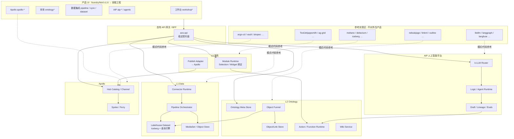
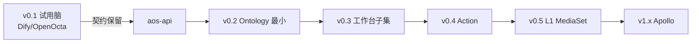

# 20 · AOS 整体技术方案

> **文档性质**：目标态（01～09）**总技术架构** · 新系统蓝图（非开源拼装部署手册）  
> **版本**：v1.0.3 · 2026-07-17（挂 **25** · 可观测日志见 T-CROSS §3.2）  
> **状态**：整体架构 + 全部分层/横切/契约详稿 **已完成**；交叉口径已对齐；实现按 [T-EVO](T-EVO-v0.1到目标态替换阶梯.md)  
> **对齐产品**：[03 PRD](../03-对标Palantir-AOS-PRD框架.md) · [05](../05-数据集成Connectors-Pipeline-Dataset产品方案.md)～[09](../09-Apollo交付引擎产品方案.md) · [foundry/html](../foundry/html/) **v1.6.1** · [10 §5](../10_v01/10-v0.1技术方案.md) · [11 开源缺口](../10_v01/11-目标态开源缺口清单.md)  
> **详稿入口**：[00-技术方案索引](00-技术方案索引.md) · [一致性自检](一致性自检报告.md) · [21 选型](21-AOS开源选型与功能清单.md) · [22 维护](22-AOS开源产品维护清单.md) · **[23 军规](23-AOS开源引用与交付军规.md)** · **[24 SOP](24-AOS客户侧前置组件安装SOP.md)** · **[25 演进补丁](25-LLM-Wiki启示与L2演进补丁.md)**

---


## 使用的 Rules


| Rule   | 应用                                   |
| ------ | ------------------------------------ |
| 中文     | 全文中文                                 |
| 先方案后代码 | 本文只定架构与边界；不改业务代码                     |
| 产品对齐   | §4 矩阵逐条挂产品文档；缺口显式备注                  |
| UI     | §5 强制 `foundry/html` 为产品 UI 真源       |
| 开源参考   | §6 映射 `mybuddy-v01` 已下载仓；解释「懂什么、抄什么」 |
| 可演化    | §7 从 v0.1 阶梯长出目标态；契约优先               |


---


## 0. 一句话结论


| 问题           | 结论                                                                                |
| ------------ | --------------------------------------------------------------------------------- |
| 目标态是什么？      | **自有企业 AI 操作系统（AOS）**：L1 数据集成 → L2 Ontology → **AIP 人工智能平台** → L3 工作台 → Apollo 交付 |
| 是不是「把开源装起来」？ | **不是**。开源只是 **参考实现 / 可抄代码**；交付物是 **自有产品工程 + 自有契约 + 自有 UI**                        |
| UI 跟哪套？      | **直接沿用** `[docs/palantier/foundry/html](../foundry/html/)`（售前蓝图 = 目标产品视觉/信息架构）    |
| 和 v0.1 什么关系？ | v0.1 = Local-First **试用切片**；目标态 = 按 §7 阶梯 **替换缝合件**，不是推倒重来                        |
| 现在写到哪？       | **整体架构 ✅ · 分层/横切/契约详稿全部 ✅ v1.0**；进入实现阶段（T-EVO）                                    |


---


## 1. 系统定位与非目标


### 1.1 定位

**AOS = 数据融合 · 业务建模 · AI 决策 · 持续运维** 的一体化平台（对标 Foundry + AIP + Workshop + Apollo），工程上是 **一个新产品仓库族**，不是某个上游的发行版皮肤。

> **目标态决策层口径（2026-07-16）：** 决策层对外 / 技术方案统一称 **AIP 人工智能平台**（即原「左引擎」）。原「右引擎 / 双引擎」**本期不写入目标态技术方案**；产品侧若另有备忘，不在本系列展开。


### 1.2 非目标（写进边界，防跑偏）


| 非目标                                          | 说明                                                             |
| -------------------------------------------- | -------------------------------------------------------------- |
| ❌ 以 Dify / OpenOcta / Appsmith 部署包对外当 AOS    | 试用引擎 ≠ 目标产品                                                    |
| ❌ 在上游内核里堆业务 Ontology / Module                | 开发组织铁律同 10 §0.1：自有目录为主                                         |
| ❌ 另起一套与 foundry/html 无关的 UI                  | 目标版视觉已定                                                        |
| ❌ 强制做满 200+ Connector / 一次铺开全球气隙舰队           | **不强制**凑齐官方级全量连接器矩阵；气隙舰队分期。文件类 **必做**；常见企业连接器 **尽量多做**（见 §1.4） |
| ❌ 把 RAG Chatbot 话术升级成「已建成 Ontology/Workshop」 | 话术红线同 10 / 11                                                  |


### 1.3 工程原则（实现侧）

```text
1. 契约钉死：UI / 桌面 / 外部集成只依赖「自有 API 面」
2. 引擎可换：检索、编排、图存、ETL 运行时均可换实现，不换契约
3. 参考开源：读懂后「移植模式 / 抄模块」，包进自有服务边界
4. UI 资产：foundry/html → 前端工程组件化（T-UI 详稿）
5. 数据主权：私有化 / Local-First / 气隙路径在 Apollo 层收口
6. 横向扩展插件化：Connector / LLM / 解析器 / Widget 等见 §3.1
```


### 1.4 L1 本期接入范围（强制备注）


| 优先级         | 范围                           | 结论                                     |
| ----------- | ---------------------------- | -------------------------------------- |
| **P0 必做**   | 文件 / 文档类接入与解析                | 对标 MediaSet + Doc Intel 最小闭环；格式见下表「文件」 |
| **P1 尽量多做** | 常见企业连接器（SAP / SaaS / JDBC 等） | **能做多少做多少**，不设「必须凑满 N 个」的硬指标；插件框架先就绪   |
| **不强制**     | 官方级 **200+** 全量 Connector 矩阵 | 不作为验收门槛；按客户与排期增量补齐                     |


**P0 · 文件必支持格式：**


| 类别     | 扩展名 / 类型                        | 说明                                         |
| ------ | ------------------------------- | ------------------------------------------ |
| Word   | `.doc` · `.docx`                | 办公文档；解析为可检索文本 + 保留 MediaSet 原件             |
| Excel  | `.xls` · `.xlsx`                | 表格；可进 Dataset/结构化预览或按表抽取                   |
| PDF    | `.pdf`                          | 含文本层优先；扫描件走 OCR 插件（**默认 PaddleOCR**，见 T05） |
| 文本与类文本 | `.md` · `.txt` · `.csv` · 同类纯文本 | Markdown / 纯文本 / CSV 等                     |


**P1 · 企业连接器（尽量多做 · 示例，非封闭清单）：**


| 类别               | 示例                                        | 说明                              |
| ---------------- | ----------------------------------------- | ------------------------------- |
| **JDBC / 关系数据库** | **MySQL（必做）** · PostgreSQL · SQL Server 等 | JDBC 通用能力优先落地；**连 MySQL 本期要可用** |
| SaaS / API       | 按已下载参考仓与客户频率选型                            | 能接通多少做多少，不强制清单打满                |
| SAP 等大型套件        | 有参考实现则优先移植                                | 复杂度高，可分期；**不因做不到 200+ 而阻塞主路径**  |


> **备注：**  
>
> - **验收底线** = P0 文件全格式可用 + **JDBC→MySQL** 可用 + 连接器**插件扩展点**就绪。  
> - P1 其余连接器：**鼓励尽量多做**，写入 T05 的「已交付 / 进行中 / 待排期」清单滚动，**不写死强制数量**。  
> - 详稿 ✅ **[T05](T05-L1数据集成详细技术方案.md)**。

---


## 2. 总技术架构


### 2.1 逻辑分层（与产品 03 / 05～09 对齐）

```text
┌─────────────────────────────────────────────────────────────────┐
│  L3  交互与应用工厂（产品 08）                                      │
│      工作台 Module / Widget / Selection · Buddy · COP            │
│      UI 真源：foundry/html/workshop*.html                        │
└────────────────────────────▲────────────────────────────────────┘
                             │ Object / Action / Function / Draft
┌────────────────────────────┴────────────────────────────────────┐
│  AIP 人工智能平台（产品 07 / 07a · 对标 Palantir AIP）              │
│      k-LLM · Logic · Chatbot/Agents · Draft · Lineage · Evals    │
│      UI：aip-*.html · agents.html（Chatbot Studio）               │
└────────────────────────────▲────────────────────────────────────┘
                             │ 读/写 Ontology 名词动词（Query / Function / Action）
┌────────────────────────────┴────────────────────────────────────┐
│  L2  语义本体（产品 06 / 06b）                                      │
│      Object / Link / Property · Funnel · Wiki                    │
│      Action（壳+Criteria）· Function（核）                        │
│      UI：ontology*.html · ontology-wiki/action/function          │
└────────────────────────────▲────────────────────────────────────┘
                             │ Curated Dataset / MediaSet 契约
┌────────────────────────────┴────────────────────────────────────┐
│  L1  数据集成（产品 05 / 05a / 05b）                                 │
│      Connection · Pipeline · Dataset/Iceberg · MediaSet          │
│      本期：文件 P0 必做 · JDBC/MySQL 等连接器尽量多做（不强制 200+） │
│      UI：data-connection / pipeline / dataset / media-sets …     │
└────────────────────────────▲────────────────────────────────────┘
                             │ 制品 / 配置 / 灰度
┌────────────────────────────┴────────────────────────────────────┐
│  L0  交付与运维底座（产品 09 Apollo）                                 │
│      Hub-Spoke · Ferry · Catalog · OPS-001～010（含 Lite Spoke）   │
│      UI：workshop-publish 入口 + apollo-*.html 专页（html v1.6）   │
└─────────────────────────────────────────────────────────────────┘
```


### 2.2 运行时总图（Mermaid）




### 2.3 部署拓扑（目标态 · 分期）


| 形态                  | 谁用        | 技术要点                     | 阶段                                    |
| ------------------- | --------- | ------------------------ | ------------------------------------- |
| **Local-First 工作站** | 试用 / 单机主权 | 桌面壳 + 本机服务；v0.1 已验证路径    | **现有 v0.1** → 阶梯替换内核                  |
| **单机房私有化**          | 标准企业      | K8s 或 Compose 增强；单 Spoke | v0.5～v1.0                             |
| **Hub + 多 Spoke**   | 集团 / 多租户  | Apollo 子集；制品通道           | v1.x                                  |
| **气隙 / Ferry**      | 高安全       | Bundle + 单向摆渡            | ✅ [T09 §9.1](T09-Apollo交付引擎详细技术方案.md) |


> **备注**：Ferry 介质 = 签名 tar.gz + manifest（T09 已定）。

---


## 3. 自有工程结构（建议）

> 目标态代码落在 **自有仓**，与 `mybuddy-v01` 上游参考区隔离。名称可调整，角色不可混。

```text
aos-platform/                    # 新系统主仓（示意）
├── apps/
│   ├── web/                     # 由 foundry/html 组件化而来
│   └── desktop/                 # 桌面端（壳保留、页替换）
├── services/
│   ├── aos-api/                 # BFF / 契约面（自 /v1/buddy/ask 演化）
│   ├── data-connection/         # L1
│   ├── pipeline/                # L1
│   ├── ontology/                # L2 meta + funnel API
│   ├── action-runtime/          # 06b
│   ├── aip-logic/               # AIP Logic / Agent
│   ├── aip-model-gateway/       # k-LLM 路由（参考 litellm）
│   └── apollo-control/          # 交付控制面
├── packages/
│   ├── ui-kit/                  # 自 html/assets/demo.css Token 提炼
│   ├── ontology-sdk/            # 对内 OSDK 雏形
│   └── contracts/               # OpenAPI / AsyncAPI / 事件 schema
└── deploy/
    ├── compose/ · helm/ · ferry/

mybuddy-v01/                     # 参考实现 + v0.1 交付（保留）
├── desktop/ · adapter/ · …      # 试用产品（可演化源）
├── A1_ETL/ · B1_GraphStore/ …   # 开源参考树（只读理解 / 抄模块）
└── dify/ · openocta/            # 试用引擎（替换阶梯上的临时脑）
```

**铁律：** 业务功能默认合入 `aos-platform`（或等价自有目录）；禁止以修改 `dify/api` / 上游 monorepo 为主开发方式（同 10 §0.1）。

### 3.1 插件化扩展（强制架构原则）

> **一句话：** 能「横向加一种」的能力，做成 **插件**；核心只认 **契约**，不认具体厂商实现。新增/下架一个插件不得改核心代码、不得拖垮其他插件。


#### 为什么


| 好处     | 说明                                      |
| ------ | --------------------------------------- |
| 隔离失败域  | 一个 Connector / 一个 LLM Provider 挂了，不影响其余 |
| 并行交付   | 团队可按插件分仓或分目录开发、测试、发版                    |
| 客户可裁剪  | 私有化只装需要的插件包（气隙友好）                       |
| 对齐产品增长 | 连接器、模型、Widget 种类会持续涨，硬编码不可持续            |


#### 典型插件域（详稿必须覆盖）


| 域                        | 例子                          | 核心只提供                                          | 插件提供                         | 参考（懂·抄）                        | 详稿    |
| ------------------------ | --------------------------- | ---------------------------------------------- | ---------------------------- | ------------------------------ | ----- |
| **Connector**            | JDBC·MySQL、文件、SaaS…         | 注册表 · Sync 调度 · 凭证槽 · 健康检查                     | Source 协议实现 · Schema 探测 · 拉数 | meltano / Airbyte connector 模式 | ✅ T05 |
| **文件解析器**                | Word / PDF / Excel / md…    | MediaSet 入库 · 解析流水线钩子                          | 按格式的 extract 实现              | PaddleOCR 等插件                  | ✅ T05 |
| **LLM Provider**         | OpenAI 兼容 · 本地 vLLM · 国产云   | **Model Gateway**（统一 chat/embed API · 路由 · 配额） | 鉴权 · base_url · 模型清单 · 限流适配  | **Dify 模型供应商** · litellm 边车    | ✅ T07 |
| **Embedding / Rerank**   | 向量化、重排                      | 统一 embed 接口                                    | 具体模型后端                       | 同上                             | ✅ T07 |
| **Widget**               | Object Table · Filter List… | Module 画布 · 变量绑定                               | Widget 渲染与配置 schema          | html 蓝图 + ToolJet 思路           | ✅ T08 |
| **Action / Function 类型** | 写回、校验、计算                    | Runtime · Criteria                             | 具体 Action 模板/执行器             | 06b                            | ✅ T06 |
| **通知 / 通道**（若有）          | Webhook、邮件…                 | 事件总线                                           | 通道适配器                        | Action Side Effects            | ✅ T06 |


#### 插件契约最低要求（每节详稿照抄填空）

```text
1. 清单清单（manifest）：id · version · capabilities · 配置 JSON Schema · 权限声明
2. 注册 / 发现：启动扫描或显式 install；热插拔策略（支持与否写明）
3. 生命周期：install → configure → health → run → uninstall
4. 隔离：进程内接口隔离 或 边车；配置与密钥按插件分槽（参考 Vault）
5. 兼容：契约版本 semver；核心升级不得无声破坏已装插件
6. UI：若插件有配置端面，引用 foundry/html 对应页（如 source-new / aip 模型配置）或 ☐ html 待补
```


#### LLM 安装集成（特别强调）

对标产品「模型集成 / k-LLM」：平台侧是 **统一模型网关**，**每种模型供应商 = 一个插件**（或一份 Provider 包），行为参考 **Dify「模型供应商」**：填写凭证、选模型、测连通、出现在路由候选里——**不是**把某个 SDK 写死进 AIP 核心。

```text
aos-api / AIP Logic
       → Model Gateway（自有）
            → plugin:openai-compatible
            → plugin:local-vllm
            → plugin:vendor-X
```

参考路径：`mybuddy-v01/dify`（模型供应商配置与调用链，**只读理解**）· `mybuddy-v01/C1_ModelRouter/litellm`（多后端统一 API 模式）。

#### 工程目录示意（插件落点）

```text
aos-platform/
├── services/...                 # 核心运行时（无具体厂商 if/else 丛林）
└── plugins/
    ├── connectors/
    │   ├── jdbc-mysql/
    │   ├── file-local/
    │   └── ...
    ├── parsers/                 # docx · pdf · xlsx · md …
    ├── llm-providers/
    │   ├── openai-compatible/
    │   └── ...
    └── widgets/
```

> **详稿检查清单：** T05～T09 每一节若出现「可横向扩展」点，必须有 **「插件化」专小节**（契约表 + 首批插件清单 + 非插件硬编码红线）。缺则视为方案不完整。

---


## 4. 产品 ↔ 技术对齐矩阵


| 产品文档               | 产品能力（摘要）                                                                             | 技术落点（本系列）                | UI（foundry/html）           | 详稿状态                                           |
| ------------------ | ------------------------------------------------------------------------------------ | ------------------------ | -------------------------- | ---------------------------------------------- |
| **05 / 05a / 05b** | Connector 框架 · Pipeline · Dataset/MediaSet · Doc Intel；P0 文件；P1 JDBC/MySQL；128KB/DLQ | L1 服务                    | `data-connection` …        | ✅ [T05](T05-L1数据集成详细技术方案.md)                   |
| **06 / 06a**       | Funnel · OMA · Wiki 双向                                                               | Ontology · AGE           | `ontology`*                | ✅ [T06](T06-Ontology与Action-Function详细技术方案.md) |
| **06b**            | Action/Function · ACT-07～10                                                          | Action/Function Runtime  | `ontology-action/function` | ✅ T06                                          |
| **07 / 07a**       | AIP · 熔断/预热/Draft/Evals                                                              | Gateway+LiteLLM · Logic  | `aip-`* `agents`           | ✅ [T07](T07-AIP人工智能平台详细技术方案.md)                |
| **08 / 08a**       | Module · Selection 护栏                                                                | Module Runtime           | `workshop`*                | ✅ [T08](T08-Workshop工作台详细技术方案.md)              |
| **09**             | Apollo OPS-001～010                                                                   | Apollo Control           | `apollo-`*                 | ✅ [T09](T09-Apollo交付引擎详细技术方案.md)               |
| **10_v01**         | 试用 Local-First                                                                       | 已实现切片；契约 `/v1/buddy/ask` | 桌面已对齐 html Token（10 §0.3）  | ✅ 已有                                           |
| **11**             | 开源缺口搜集                                                                               | 参考选型输入，不定中标              | —                          | ✅ 已有                                           |


### 4.1 已标注的技术缺口（不允许装聋）


| ID  | 缺口               | 说明                | 处置                   |
| --- | ---------------- | ----------------- | -------------------- |
| G1  | 分层详稿             | ✅ 全集 v1.0         | 见 [00](00-技术方案索引.md) |
| G2  | Apollo UI        | ✅ 已关闭             | html v1.6            |
| G3  | airbyte 主仓       | 不阻塞；用轻量仓          | clone_airbyte_refs   |
| G4  | 200+ Connector   | 不强制               | T05 §3.3 滚动表         |
| G4a | 文件/OCR/128KB/DLQ | ✅ T05 已写          | —                    |
| G4b | 连接器清单            | ✅ T05 §3.3        | —                    |
| G5  | 鉴权               | ✅ T-CROSS + T-API | —                    |
| G6  | 产品护栏工程化          | ✅ 各 T0x + §6.6    | —                    |


---


## 5. 产品 UI 策略（强制）


### 5.1 真源

- **信息架构 + 视觉 + 关键主路径** 以 `[foundry/html](../foundry/html/README.md)` **v1.6.0** 为准（见 [HTML 补页改页任务清单](../foundry/html/HTML补页改页任务清单.md)）。  
- 侧栏叙事：**工作台 L3 → AIP → 本体 → 数据集成 → 交付 Apollo**（使用优先；Apollo 置底不抢业务入口）。  
- 页 ↔ 线框映射已在 html README 固化，技术实现不得改名拆散。  
- **注意命名：** `agents.html` = **Chatbot Studio**；边缘同步代理 = `**data-connection-agents.html`**（勿混）。


### 5.2 落地方式（T-UI 详述 · 此处定原则）


| 阶段  | 做法                                                  |
| --- | --------------------------------------------------- |
| 现在  | 售前 / 评审继续用静态 html **v1.6**                          |
| 工程化 | 抽 `demo.css` Token → `ui-kit`；按页迁 React/Vue（与桌面栈统一） |
| 桌面  | v0.1 Tauri **壳保留**；内容区逐步换成与 html 同构的路由页面            |
| 禁止  | 再发明第三套「管理后台」皮肤冒充 AOS                                |


### 5.3 页 → 服务映射（摘要）


| html                                                                                               | 主消费服务                                                                         |
| -------------------------------------------------------------------------------------------------- | ----------------------------------------------------------------------------- |
| `workshop*.html`                                                                                   | Module Runtime · Selection · AIP Chat API                                     |
| `ontology*.html` · `ontology-wiki.html` · `funnel.html` · `ontology-graph-health.html`             | Ontology Meta · Funnel · Action/Function · Wiki · 图谱健康 · Constitution         |
| `pipeline*.html` / `data-connection*.html` / `dataset.html` / `schedules.html` / `media-sets.html` | L1 Pipeline / Connection / Schedule / MediaSet / Dataset API                  |
| `aip-*.html` / `agents.html`（Chatbot Studio）                                                       | Logic · Agent · Model Router · Draft · Lineage · Evals · **Insight Backfill** |
| `apollo-*.html` · `workshop-publish.html`                                                          | Apollo Hub / Channel / Spoke / Ferry / Asset / Change / Config                |
| `lineage.html` / `health.html` / `builds.html`                                                     | L1 血缘 · 质检 · 构建（**≠** L2 图谱健康）                                                |


> **L2 演进（25）：** Insight Backfill · 图谱健康 · TTL · Constitution → [25-LLM-Wiki启示与L2演进补丁](25-LLM-Wiki启示与L2演进补丁.md)；实现不抢 M1。


### 5.4 详稿写 UI 时如何引用蓝图（强制）

平台蓝图 **已经有了**（`foundry/html`）。T05～T09 / T-UI 写到「功能 · 组件 · 交互逻辑」且涉及端面时：

1. **先挂链接**：相对路径指向具体 `.html`（可本地 `python -m http.server` 打开对照）。
2. **再点名组件区**：如画布页的 Layout 树、Section·筛选/主表、Overlay·Drawer、右侧 Widget 选择、「变量 / Events」、构建态 vs 预览运行态。
3. **再写实现映射**：该区对应的 API / 状态模型 / 事件（例如 Object Set 变量 → Widget 绑定）。
4. **html 没有对应页**：标 `☐ html 待补`，仍写后端/契约；**不得**另起无关 UI 顶替。
  （主链路与 Apollo / AIP 门控页在 **v1.6 已齐**；新增能力仍按此条处理。）

**示例（画布编辑 · 与现蓝图一致）：**

> **UI 蓝图：** `[workshop-canvas.html](../foundry/html/workshop-canvas.html)`  
>
> - 壳：侧栏「工作台 L3 → 画布编辑」+ 顶栏「预览运行态 / 发布」  
> - 左：Layout（Header / Page·Inbox / Section / Overlay）+ 变量/Events  
> - 中：Canvas 空态提示「先建 Object Set 再拖 Widget」；筛选 / 主表 / Drawer  
> - 右：Section 属性 · Widget 类型（如 Object Table）·「构建态 · 非运行态」  
> - 实现：Module Schema ↔ Layout；Widget Registry ↔「+ 添加 Widget」；运行态预览走同一 Schema 的 render 路径

完整引用模板见 [00-技术方案索引 · UI 引用规范](00-技术方案索引.md)。

---


## 6. 开源参考策略（懂 · 抄 · 边界）


### 6.1 总原则

```text
读懂上游解决问题的方式
  → 抽出「模式 / 模块 / 协议」
  → 迁入自有服务边界（可拷贝代码，须改包名与许可证合规）
  → 产品行为对齐 05～09，而不是对齐上游产品名
```

**禁止话术：**「我们基于 XXX 二次开发的平台」。  
**允许话术：**「AOS 自研；实现上参考了业界成熟开源模块」。

### 6.2 分层参考地图（已下载 · `mybuddy-v01`）


| 层          | 参考仓（路径）                                                                                       | 建议「抄什么」（模式级）            | 明确「不抄什么」                  |
| ---------- | --------------------------------------------------------------------------------------------- | ----------------------- | ------------------------- |
| **L1**     | `A1_ETL/meltano`                                                                              | Singer/ELT 插件协议 · 调度与状态 | 整站 UI；Airbyte 未就绪时不绑死     |
|            | `A3_CDC/debezium`                                                                             | CDC 事件模型 · 位点           | 强绑 Kafka Connect 运维语义到产品名 |
|            | `A4_Lakehouse/iceberg` + `duckdb`                                                             | 表格式事务 · 本地/湖仓查询         | 把 DuckDB 当唯一生产仓           |
| **L2**     | `B1_GraphStore/nebula                                                                         | age                     | memgraph`                 |
|            | `B4_Metadata/linkml`                                                                          | Schema DSL · 校验         | 生物信息学默认模型                 |
|            | `B5_Workflow/temporal                                                                         | conductor`              | 长事务 / Funnel 编排           |
|            | `B7_Wiki/outline                                                                              | wiki`                   | 文档协作 · 权限                 |
| **AIP**    | `C1_ModelRouter/litellm`                                                                      | 多模型统一 API               | 默认 SaaS 密钥模式              |
|            | `C5_AgentOrchestration/langgraph`                                                             | 有状态 Agent 图             | 无 Ontology 工具约束的自由 Agent  |
|            | `C2_Evals/promptfoo` · `C3_Trace/langfuse`                                                    | 评测与追踪                   | 替代业务 Evals 门禁产品           |
|            | `C8_RightEngine/qdrant                                                                        | milvus`                 | 向量检索（RAG/工具侧）             |
| **L3**     | `D1_WorkshopFactory/ToolJet                                                                   | appsmith`               | 低代码画布 / 组件模型 **思路**       |
|            | `D3_HighPerfGrid/ag-grid` · `D4_Map/kepler.gl` · `B3_GraphViz/`*                              | 表格 / 地图 / 图可视组件         | 业务对象协议                    |
| **Apollo** | `E1_GitOps/argo-cd` · `E3_Secrets/vault` · `E4_AirGap/skopeo` · `E7_Observability/prometheus` | GitOps · 密钥 · 镜像摆渡 · 指标 | 「装了 Argo = Apollo」        |
| **横切**     | `F1_Identity/keycloak` · `F2_Authz/openfga`                                                   | IdP · 关系型授权             | 绕过 Object 级权限模型           |
| **试用脑**    | `dify` · `openocta`                                                                           | 仅 v0.1 问答路径；API 调用方式    | 目标态永久内核                   |


> **详解义务**：T05～T09 写到具体模块时，必须点名 **参考仓内目录/类职责**（例如 meltano 的 plugin 契约、OpenFGA 的 tuple 模型），证明「懂源码」而非只写产品名。本整体篇只定地图。


### 6.3 许可证与合规（摘要）


| 风险                                                     | 动作                                                     |
| ------------------------------------------------------ | ------------------------------------------------------ |
| GPL / **AGPL** 强传染（MinIO Server · Grafana · ToolJet 等） | **禁止捆进客户交付包**；客户自装 + 适配层；详见军规 [23](23-AOS开源引用与交付军规.md) |
| BSL（Vault · Outline · Redpanda 等）                      | 有源码可读，非商用发行包/客户侧；不嵌源码；法务备案                             |
| 前端组件许可证                                                | ui-kit 引入前过白名单                                         |
| 上游商标                                                   | 交付面去品牌（已有 10g 实践可延续）                                   |
| 仓址与补拉                                                  | [22](22-AOS开源产品维护清单.md) · `clone_aos_deps.ps1`         |


MinIO Server: 对象IO服务 用来存非结构化数据——文件、图片、日志、备份、模型 artifact 等，通过 HTTP API 读写，兼容 S3 协议

Grafana：监控可视化，部署后的运维工具，CPU、内存、QPS、Pipeline 跑成啥样、MinIO 桶用了多少空间等

ToolJet： 低代码内部工具，比如运营要个"数据查看 + 改状态"的页面，不用写前端，拖个 Table + Form，连一下数据源（PostgreSQL / Mongo / MinIO / API 都行）就出来了。内置 45+ 组件，还能插 JS/Python；给客户做个轻量控制台，避免每个小需求都走正式迭代

Vault（密钥管理相关）、Outline（知识库相关）、Redpanda（流数据消息处理，轻量级kafka）

### 6.4 开源引用军规 · 客户先装 SOP（强制）


| 文档                                       | 作用                                                                  |
| ---------------------------------------- | ------------------------------------------------------------------- |
| **[23 军规](23-AOS开源引用与交付军规.md)**          | refs 不进编译 · AGPL 不进包 · CI/SBOM 门禁 · 违规处理                            |
| **[24 客户前置 SOP](24-AOS客户侧前置组件安装SOP.md)** | **先客户安装前置组件，后装 AOS**；总检签署前禁止开工；活文档变更日志                              |
| 示例交接                                     | `[docs/examples/customer-prereq/](../../examples/customer-prereq/)` |


**安装铁律：** 地基（PG / 对象仓 / IdP / Vault / Redis / 观测…）由客户 IT 按 24 就绪 → AOS 安装器只做探针与对接 → 再拉起自有服务。

---


## 6.5 高风险护栏（与 03 §6 对齐 · 技术方案必避坑）


| ID    | 护栏                        | 工程含义                                          |
| ----- | ------------------------- | --------------------------------------------- |
| HR-01 | 禁止 LLM 直写 Ontology        | CI/代码扫描禁止直调写接口；只允许 Action（Wiki 方向 B 同此）       |
| HR-02 | Funnel Backing Dataset 唯一 | ObjectType 发布前唯一性校验                           |
| HR-03 | Channel 不跨破坏性大版本裸升        | Apollo 晋升门禁；Asset Bundle 与平台 Channel **版本同绑** |
| HR-04 | AOS Adapter               | `/v1` 契约稳定；上游可换                               |
| HR-05 | 全链路血缘强制                   | Dataset→Object→Widget→Action 埋点不可关；熔断/死信事件入谱  |


详见 [03 §6](../03-对标Palantir-AOS-PRD框架.md)。

### 6.6 产品补强 → 详稿必写清单（总纲索引 · 不展开实现）

> 产品侧 05～09 / 03 已定口径；**总架构不因此改分层**。下列条款 **必须**在对应 T0x 成文，禁止实现时遗漏。


| 层      | 必写条款（摘要）                                                 | 详稿    | UI 蓝图（已有）                                                                      |
| ------ | -------------------------------------------------------- | ----- | ------------------------------------------------------------------------------ |
| L1     | 小文件 <128KB；DocIntel DLQ；MediaReference；Schedule；边缘 Agent | ✅ T05 | `sync-routing` · `pipeline-doc-intel` · `schedules` · `data-connection-agents` |
| L2     | ACT-07～10；FUNC 上限；解法 B/C；Wiki A/B                        | ✅ T06 | `ontology-action/function/link/wiki`                                           |
| AIP    | L4 熔断；预热；Edits 合并；Draft；Evals                            | ✅ T07 | `aip-`*                                                                        |
| L3     | Selection≤10；分页；Marking；幂等                               | ✅ T08 | `workshop-module` · `workshop-object-view`                                     |
| Apollo | 出站；Lite Spoke；Vault；hotfix；Asset Bundle；Ferry            | ✅ T09 | `apollo-*`                                                                     |


---


## 7. 从 v0.1 可演化到目标态


### 7.1 不变的钉（禁止推翻）


| 钉                      | 说明                                      |
| ---------------------- | --------------------------------------- |
| **Local-First / 三端可装** | 桌面形态长期保留为一种 Spoke/Client                |
| **自有目录开发**             | desktop / adapter / 未来 aos-*            |
| **UI 语言**              | foundry/html                            |
| **契约演化**               | `/v1/buddy/ask` → 更完整 `aos-api`（兼容或版本化） |
| **替换阶梯显式**             | 同 10 §5，技术侧加「完成定义」                      |


### 7.2 阶梯工程化（摘要）


| 阶段         | 用户可见                | 技术动作                               | 对齐        |
| ---------- | ------------------- | ---------------------------------- | --------- |
| **v0.1** ✅ | 三栏助手 · 问答+溯源        | Tauri + adapter + Dify/OpenOcta    | 10        |
| **v0.2**   | 真 Object/Wiki 可点    | 上 Ontology Meta 最小集；检索可仍用 Dify     | 06        |
| **v0.3**   | 工作台 Inbox/一页 Module | Module Runtime 固定页；Selection→Buddy | 08 · html |
| **v0.4**   | Action Draft 写回     | Action Runtime + Criteria          | 06b       |
| **v0.5**   | 语料进 MediaSet/湖仓     | L1 MediaSet + Pipeline 最小          | 05b       |
| **v1.x**   | 机房多节点 · 升级通道        | Apollo 子集                          | 09        |





### 7.3 演化期依赖倒置

```text
UI / Desktop
    → 只依赖 aos-api（自有）
        → 适配器后面可挂：Dify | 自研检索 | Logic | Ontology
```

任何「先抄开源跑通」的尖兵项目，**必须先挂到适配器后**，禁止 UI 直连上游 SDK 导致锁死。

---


## 8. 横切能力


| 能力   | 目标态做法                                    | 参考                                     | 详稿                                 |
| ---- | ---------------------------------------- | -------------------------------------- | ---------------------------------- |
| 身份认证 | OIDC · 企业 IdP                            | Keycloak                               | ✅ [T-CROSS](T-CROSS-横切能力详细技术方案.md) |
| 授权   | 关系型 / Object 级                           | OpenFGA + Markings                     | ✅ T-CROSS · T06                    |
| 可观测  | Trace · Metrics · **App Log 分级** · Audit | Langfuse + Prometheus；日志见 T-CROSS §3.2 | ✅ T-CROSS · T07/T09                |
| 密钥   | 密封存储 · 轮换                                | Vault                                  | ✅ T09 · T-CROSS                    |
| 多租户  | Org/Project                              | 自研字段强制                                 | ✅ T-CROSS                          |


---


## 9. 里程碑建议（技术侧）


| 里程碑    | 退出标准                                                      | 依赖文档       |
| ------ | --------------------------------------------------------- | ---------- |
| **M0** | 本文 20 评审通过；索引缺口表确认                                        | 本文         |
| **M1** | T-UI + T08 起步：html→组件库 + 一页 Module 通 API                  | 08a · html |
| **M2** | T06 最小 Ontology + Funnel 读路径                              | 06         |
| **M3** | T07 Draft→Action 闭环                                       | 06b · 07   |
| **M4** | T05：P0 文件 + JDBC/MySQL + MediaSet/Pipeline 最小；其余连接器滚动尽量多做 | 05b · §1.4 |
| **M5** | T09 单机房升级通道                                               | 09         |


> 排期人周由项目经理另表填写；技术方案不编造。里程碑定义见 [T-EVO](T-EVO-v0.1到目标态替换阶梯.md)。

---


## 10. 风险


| ID  | 风险           | 等级  | 缓解                                                |
| --- | ------------ | --- | ------------------------------------------------- |
| R1  | 详稿未出就开工导致烟囱  | 高   | 强制：无对应 T0x 不进主干大功能                                |
| R2  | 把参考仓当产品外壳    | 高   | §6 话术 + 代码审查门禁                                    |
| R3  | UI 分叉        | 高   | html 真源；T-UI Token 对比测试                           |
| R4  | 契约被上游掏空      | 高   | adapter/aos-api 单点                                |
| R5  | Apollo 范围膨胀  | 中   | UI 已齐；T09 按 OPS-001～010 **分期实现**（Lite 先于 Full 舰队） |
| R6  | 大仓克隆失败影响选型心态 | 低   | 多参考；不单点 airbyte                                   |


---


## 11. 下一步（实现，非再写半截方案）

1. **评审签字**本系列（[00 索引 v1.0](00-技术方案索引.md)）。
2. **开工 M1**：按 T-UI + T08 + T-API Mock 打通运营台 Inbox。
3. 选型已全部落为「已决」；实现中若推翻须走变更评审并回写文档版本号。

---


## 12. 关联

- 产品：[00-索引](../00-索引.md) · [03](../03-对标Palantir-AOS-PRD框架.md) · 05～09  
- UI：[foundry/html/README](../foundry/html/README.md)  
- 试用与阶梯：[10](../10_v01/10-v0.1技术方案.md) · [11](../10_v01/11-目标态开源缺口清单.md)  
- 本系列：[00-技术方案索引](00-技术方案索引.md) · [一致性自检报告](一致性自检报告.md)

---


## 13. 修订记录


| 版本         | 日期         | 说明                                                       |
| ---------- | ---------- | -------------------------------------------------------- |
| v0.1.5     | 2026-07-16 | §3.1 插件化；LLM 接入参考 Dify                                   |
| v0.1.6     | 2026-07-16 | 同步 html v1.6：关闭 G2；§2.1/§4/§5 UI；§6.6 产品补强→详稿清单；OPS-010  |
| v0.1.7     | 2026-07-17 | G1 关闭（详稿首版齐）；§11 下一步改为评审/选型/开工                           |
| **v1.0.0** | 2026-07-17 | **技术方案全集完成**：T-API/T-CROSS；关闭全部开口；矩阵/缺口表全部 ✅             |
| v1.0.1     | 2026-07-17 | 交叉一致性自检通过；见 [一致性自检报告](一致性自检报告.md)                        |
| v1.0.4     | 2026-07-17 | 可观测增补：**应用日志分级** → [T-CROSS §3.2](T-CROSS-横切能力详细技术方案.md) |


---

*v1.0.4 · 整体技术方案 · 分层详稿全集完成 · 一致性自检通过*