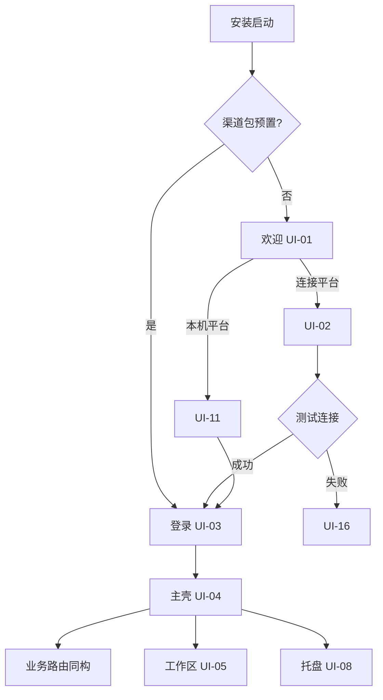

# 20c · AOS 桌面端详细技术方案

> **版本**：v1.0.2 · 2026-07-19  
> **状态**：📝 **方案定稿（暂不编码）** — 实现排期见 [26 §14.6 TWC.*](26-AOS目标态开发计划.md)  
> **性质**：相对 [20b](20b-AOS端云分离与交付形态方案.md) 端侧的 **桌面实现详稿**；补齐工程落点、壳能力与 **全套 UI 界面**；**功能集合 ≥ Web（§5.4）**  
> **对齐**：[20](20-AOS整体技术方案.md) · [20a](20a-多用户与工作区整站隔离方案.md) · [20b](20b-AOS端云分离与交付形态方案.md) · [T-UI](T-UI-前端工程与foundry-html落地规范.md) · [T08 §4.5](T08-Workshop工作台详细技术方案.md) · [T-CROSS](T-CROSS-横切能力详细技术方案.md) · [T-API](T-API-aos-api稳定契约.md) · [23](23-AOS开源引用与交付军规.md) · [24](24-AOS客户侧前置组件安装SOP.md) · [72](72-系统启停与健康检查手册.md) · 蓝图 [`foundry/html`](../foundry/html/) **v1.6.5** · Web 真源 `apps/web/src/nav.ts`  
> **触发**：目标态「操作系统」叙事要求 **桌面为标准产品位**；现状桌面仍在 `mybuddy/desktop`（v0.1 三栏 Buddy），`aos-platform/apps/desktop` **尚未创建**

---

## 使用的 Rules

| Rule | 应用 |
| --- | --- |
| 中文 | 全文中文；产品 UI 文案中文 |
| 先方案后代码 | 本文定稿后方可开 **TWC.1+** 编码 |
| UI = foundry/html | 业务内容区 **禁止另起皮肤**；壳层仅加 OS 获得感控件 |
| 契约优先 | 桌面 **只**调 `aos-api`（R-ARCH-01） |
| 最小更改 | 壳自 v0.1 Tauri **保留并迁入**；内容区换同构路由，不推倒 |
| R-PROD | 禁止「演示桌面」精简壳；桌面即产品 |
| **≥ Web** | **R-PARITY-01**：业务功能集合 **不得少于** `apps/web`（§5.4） |

---

## 0. 一句话结论

| 问题 | 结论 |
| --- | --- |
| 桌面是什么？ | **AOS 桌面**（安装器/关于页可称「AOS 工作站」）= **主座舱入口**：Tauri 壳 + 与 `apps/web` **同构且功能 ≥ Web** 的业务 UI |
| UI 真源？ | 内容区 = [T-UI](T-UI-前端工程与foundry-html落地规范.md) + foundry/html + **`nav.ts` 全量**；壳专有页见本文 **§6** |
| 与 Web 差在哪？ | 业务页 **不少於** Web；桌面**多**：平台地址、托盘、离线只读、更新、深链、`本机平台`、Buddy 并存 |
| Apollo？ | **页全保留**；默认侧栏可收（20b），admin 展开与 Web 同全（§5.4.3） |
| 与 Web 比？ | **功能 ≥ Web**（§5.4）；禁止桌面精简版 |
| 现在编码吗？ | **否**；须人点名后按 §13 / 26 TWC 开刀 |

---

## 1. 目标与非目标

### 1.1 目标

| # | 目标 |
| --- | --- |
| G1 | `aos-platform/apps/desktop` 可安装、可连客户机房 / SaaS / 本机平台 |
| G2 | 主窗口内容区与 Web **同路由、同 ui-kit、同工作区语义**（20a） |
| G3 | 具备可陈述的 OS 获得感：安装器 · 托盘 · 关于/版本 · 更新通道 · 平台地址 |
| G4 | 离线只读 + 待同步队列（T08 §4.5）；**禁止**离线直写生产 |
| G5 | 私有化 / SaaS 仅差 **默认 API Base / 渠道包**，不叉业务 UI 仓库 |
| **G6** | **功能 ≥ Web**：`nav.ts` 全量 + 嵌套深页；无桌面精简裁剪（§5.4） |

### 1.2 非目标（本期）

| 非目标 | 原因 |
| --- | --- |
| ❌ 桌面独有一套业务导航 / 皮肤 | 成本与缺陷翻倍 |
| ❌ 端直连 DB / MinIO / LiteLLM / Vault | R-ARCH-01 |
| ❌ 把工作区数据全量镜像到本机当主库 | 仅缓存 |
| ❌ 用桌面冒充 Apollo 运维台 | 20b：Apollo → 运维面 |
| ❌ Electron 另起栈 | 已决沿 Tauri（v0.1 路径） |
| ❌ 「桌面精简版」砍业务页 / 砍 Apollo 路由 | 违反 R-PARITY-01（§5.4） |

---

## 2. 现状与差距（诚实）

| 项 | 现状 | 目标 |
| --- | --- | --- |
| 工程位 | `mybuddy/desktop`（Tauri 2 + React） | `aos-platform/apps/desktop` |
| 主 UI | 三栏 Buddy（对象 / Chat / Citations） | **业务座舱同构** + Buddy **可并存** |
| 产品名 | 「AOS 本地工作站」窗口标题 | 「AOS 桌面」；Local-First = **本机平台**（禁称 Apollo） |
| 托盘 / 深链 / 更新 | **未实现** | §7～§10 |
| 平台地址配置 | 环境变量为主 | 首次启动向导 + 设置页（可 MDM 锁） |
| 工作区切换 | Web 亦未产品化（20a） | 与 Web 同一控件语义；桌面切区清本地缓存 |
| 离线 SQLite | **无** | T08 §4.5 |

---

## 3. 架构总览

```text
┌─────────────────────────────────────────────────────────────┐
│  AOS 桌面（Tauri 壳）                                         │
│  · 窗口 / 托盘 / 深链 aos:// / 自动更新 / 安全存储 Refresh      │
│  · 可选：本机平台（拉起/探活本机 compose，文案禁 Apollo）        │
├─────────────────────────────────────────────────────────────┤
│  WebView 内容区 = 共享前端包（与 apps/web 同构路由）             │
│  · AppShell：顶栏 + 侧栏 + 主区（foundry/html IA）              │
│  · 桌面注入：platform bridge（地址、离线态、更新态、托盘事件）   │
└──────────────────────────┬──────────────────────────────────┘
                           │ HTTPS · Bearer
                           ▼
                    aos-api（唯一契约面）
                           │
              ┌────────────┼────────────┐
              ▼            ▼            ▼
           Ontology     AIP/L1      IdP / OpenFGA …
```

| 层 | 技术 | 说明 |
| --- | --- | --- |
| 壳 | **Tauri 2**（自 mybuddy 迁） | Rust commands：配置、钥匙串、离线库、更新、本机平台 |
| 内容 | React 18+TS · React Router · ui-kit | **优先**：desktop 依赖 `packages/*` + 共享 `app-routes`；禁止复制整份 page 树长期分叉 |
| 契约 | `contracts-client` | 只打 `aos-api`；保留 `/v1/buddy/ask` 兼容 |
| 本地库 | SQLite（壳侧） | 只读快照 + 待同步队列元数据 |

**已决共享策略（防双仓）：**

1. **D1**：desktop WebView 加载与 web **同一构建产物**（或 monorepo 共享 `src/routes` 包）  
2. **禁止**长期维护「desktop 专用业务页副本」  
3. Buddy 三栏 = **模式/路由**（`/workshop/buddy` 或 `/desktop/buddy-classic`），不是第二套产品

---

## 4. 工程落点与迁移

### 4.1 目标目录

```text
aos-platform/
├── apps/
│   ├── web/                      # 已有
│   └── desktop/                  # 新建（自 mybuddy/desktop 迁入）
│       ├── src/                  # 壳专有 UI + bridge 注入（薄）
│       ├── src-tauri/            # Tauri 工程
│       └── package.json
├── packages/
│   ├── ui-kit/
│   ├── page-shell/               # 若尚未独立，可从 web 抽
│   ├── app-routes/               # 【建议】Web/Desktop 共享路由与页
│   └── contracts-client/
```

### 4.2 迁移原则

| 原则 | 做法 |
| --- | --- |
| 壳保留 | 窗口配置、打包流水线、icon 资产可沿用并去「试用」话术 |
| 页替换 | 删除「仅三栏」为唯一首页；默认进业务座舱 `/` |
| 品牌 | 延续去 Dify 品牌；产品名统一 **AOS 桌面** |
| 依赖 | 不把 AGPL 服务端/上游 SDK 打进桌面包（23） |

### 4.3 配置键（建议）

| 键 | 存哪 | 说明 |
| --- | --- | --- |
| `apiBaseUrl` | 壳配置文件（可 MDM 只读） | 例 `https://aos.customer.local` |
| `idpMode` | 同上 | oidc / dev（生产禁 dev） |
| `channel` | 渠道包预置 | `private` \| `saas` \| `local` |
| `appearance` | 与 Web 同：`aos-appearance` | light/dark/system |
| Refresh Token | OS 钥匙串 / Credential Manager | **禁止**明文落盘 |

---

## 5. UI 总则

### 5.1 视觉与 IA 真源

| 钉 | 值 |
| --- | --- |
| 业务页视觉 | foundry/html **v1.6.5** · ui-kit Token · Appearance（T-UI §4.4） |
| 侧栏叙事（业务） | 概览 → 工作台 → AIP → 本体 → 数据集成（顺序锁） |
| Apollo | **从业务一级主导航降级**（见 §6.8）；蓝图 html 页仍可存在于运维入口 |
| 中文产品名 | 工作区 / 组织 / AOS 桌面 / 本机平台 / 网页版 |

### 5.2 三层 UI（继承 20b，桌面落点）

| 层 | 桌面如何呈现 |
| --- | --- |
| ① 业务座舱 | **默认主窗口**；侧栏全员可见 |
| ② 工作区/组织管理 | 顶栏「工作区」旁 · 或「设置 → 工作区/成员」；权限收紧 |
| ③ 运维与交付 | **不**进默认侧栏；「平台管理」需 `platform_admin`，可外链运维控制台 |

### 5.3 桌面相对 Web 的 UI 增量（唯一允许分叉处）

| 增量 | Web | 桌面 |
| --- | --- | --- |
| 首次连接向导 | 可选 | **必有**（或渠道包跳过） |
| 顶栏平台徽章 | 弱/无 | **平台地址短名 + 连通灯** |
| 离线横幅 | IndexedDB 弱 | **强横幅 + 托盘态** |
| 更新 | 浏览器刷新 | **更新对话框** |
| 托盘菜单 | — | **有** |
| 本机平台面板 | — | **有**（试用） |
| Buddy 经典三栏 | 单页即可 | **可并存为窗口模式** |

### 5.4 相对 Web 的功能对等（硬规则 · 不得少于 Web）

> **R-PARITY-01：** AOS 桌面的 **业务功能集合 ≥ 现网 `apps/web`**。允许桌面**多**壳能力；**禁止**桌面少页、少路由、少交互能力。  
> **实现手段：** 共享同一 `NAV_ITEMS` / `app-routes` / 页面组件；桌面 WebView 跑与 Web **同一路由树**，不是「桌面精简版」。

#### 5.4.1 对等范围（必须覆盖）

| 维度 | Web 现状（2026-07-19） | 桌面要求 |
| --- | --- | --- |
| 侧栏一级页 | `nav.ts` 全部 `status: live` 项（下表 §5.4.2） | **逐条可达**，标签/路径一致 |
| 嵌套深页 | 如 `/ontology/object-types/:typeId` · `link-types` · `action-types`（S2 routes） | **同样可进入**（从本体页钻入） |
| 壳能力 | AppShell：品牌 · 侧栏 · 面包屑 · 外观三态 · ApiStatusBar | **同等**；另加桌面顶栏增量（§5.3） |
| API | 只打 `aos-api` 的既有业务调用 | **同等**（同一 contracts-client） |
| Appearance | light / dark / system | **同等**（同 storage key） |
| 分析建模 | `/analytics` | **同等** |
| Buddy/助手 | `/workshop/buddy` | **同等**；另可选经典三栏模式（≥ 不替代） |

#### 5.4.2 Web 侧栏全量清单（桌面必须全部具备）

> 真源：`aos-platform/apps/web/src/nav.ts`（与 foundry/html DEMO_PAGES 叙事锁定）。下表为对照快照；**以仓库 `nav.ts` 为准**，有增删则以 nav 更新为准并回写本表。

| 分区 | 路由 | 产品名 | 桌面 |
| --- | --- | --- | --- |
| （顶） | `/` | 概览 | ✅ 必须 |
| 工作台 | `/workshop` | 应用列表 | ✅ |
| 工作台 | `/workshop/canvas` | 画布编辑 | ✅ |
| 工作台 | `/workshop/inbox` | 运营台 | ✅ |
| 工作台 | `/workshop/graph` | 知识图谱 | ✅ |
| 工作台 | `/workshop/buddy` | 智能助手 | ✅ |
| 工作台 | `/workshop/cop` | 态势大屏 | ✅ |
| 工作台 | `/workshop/publish` | 发布入口 | ✅ |
| 工作台 | `/workshop/module-interface` | 模块接口 | ✅ |
| 工作台 | `/workshop/events` | 事件配置 | ✅ |
| 工作台 | `/analytics` | 分析建模 | ✅ |
| AIP | `/aip/studio` | 对话工作室 | ✅ |
| AIP | `/aip/logic` | AIP 逻辑画布 | ✅ |
| AIP | `/aip/tools` | 智能体管理工作台 | ✅ |
| AIP | `/aip/capabilities` | 重能力接入 | ✅ |
| AIP | `/aip/drafts` | 提案审批台 | ✅ |
| AIP | `/aip/evals` | 评测门控 | ✅ |
| AIP | `/aip/lineage` | 决策谱系 | ✅ |
| AIP | `/aip/model-providers` | 大模型接入(插件) | ✅ |
| AIP | `/aip/model-router` | 模型路由 | ✅ |
| AIP | `/aip/maturity` | 成熟度楼梯 | ✅ |
| 本体 | `/ontology` | 本体管理（数字孪生） | ✅ |
| 本体 | `/ontology/funnel` | 漏斗管道 | ✅ |
| 本体 | `/ontology/okf-funnel` | OKF 行业漏斗 | ✅ |
| 本体 | `/ontology/graph-health` | 图谱健康度 | ✅ |
| 本体 | `/ontology/wiki` | 活知识 Wiki | ✅ |
| 本体 | `/ontology/branches` | 分支管理 | ✅ |
| 数据 | `/data` | 数据连接 | ✅ |
| 数据 | `/data/agents` | 边缘代理 | ✅ |
| 数据 | `/data/media-sets` | 媒体集 | ✅ |
| 数据 | `/data/pipelines` | 管道构建 | ✅ |
| 数据 | `/data/pipeline-proposals` | 管道提案 | ✅ |
| 数据 | `/data/schedules` | 计划编辑器 | ✅ |
| 数据 | `/data/builds` | 搭建 | ✅ |
| 数据 | `/data/datasets` | 数据集预览 | ✅ |
| 数据 | `/data/code-repos` | 代码库 | ✅ |
| 数据 | `/data/lineage` | 数据沿袭 | ✅ |
| 数据 | `/data/health` | 数据健康 | ✅ |
| Apollo | `/apollo` | Hub 舰队 | ✅ **路由必须在**（见 §5.4.3） |
| Apollo | `/apollo/release` | Release 通道 | ✅ |
| Apollo | `/apollo/spoke` | Spoke 详情 | ✅ |
| Apollo | `/apollo/ferry` | Ferry 摆渡 | ✅ |
| Apollo | `/apollo/assets` | FDE 资产包 | ✅ |
| Apollo | `/apollo/change` | 变更审批 | ✅ |
| Apollo | `/apollo/config` | 配置与密钥 | ✅ |

**计数：** 侧栏页 **44** 条（与当前 `nav.ts` live 项一致）+ 嵌套编辑路由（object/link/action types 等）随 Web 一并带上。

#### 5.4.3 Apollo：导航位置可收，功能不可少

| 项 | 口径 |
| --- | --- |
| 与 20b | 业务默认侧栏 **不以 Apollo 为一级推销导航** |
| 与「不少於 Web」 | Web **今天已有**完整 Apollo 分区页 → 桌面 **必须保留全部 Apollo 路由与页面能力** |
| 默认展示 | 普通业务角色：Apollo 可收入「平台管理 / 更多」或需 `platform_admin` 展开，**但不得删除路由或换成 501 空壳** |
| Dev/管理员 | 可一键展开与 Web **同序同全** 的「交付 Apollo」分区（功能对等开关，默认对 admin 开） |
| 禁止 | 「桌面版砍掉 Ferry/Change/Config」；禁止仅深链外挂浏览器却无同构页 |

#### 5.4.4 明确「桌面多于 Web」的部分（不算超范围）

托盘 · 安装器 · 平台地址向导 · 离线只读 · 签名更新 · 深链 · 本机平台 · 钥匙串会话 — 这些是 **增量**，不替代任一 Web 业务页。

#### 5.4.5 对等验收（门禁）

| ID | 门禁 |
| --- | --- |
| P1 | CI/脚本：遍历 `nav.ts` 全部 path，桌面路由表 **差集为空** |
| P2 | 手工：工作台/AIP/本体/数据各抽 2 页，交互与 Web 同组件 |
| P3 | Apollo 七页在桌面可打开且非空白占位（权限不足仅 403，不是缺页） |
| P4 | Web 新增侧栏项后，合并 PR 须同步桌面共享包（否则 P1 红） |

---

## 6. 界面清单与线框（全面）

> 下列界面均为 **产品 UI 规格**；线框用结构描述，视觉实现须贴 ui-kit，禁止另起紫渐变/卡片堆砌皮肤。

### 6.0 界面总表

| ID | 界面 | 优先级 | 宿主 |
| --- | --- | --- | --- |
| **UI-01** | 首次启动 · 欢迎 | P0 | 壳窗（未连平台） |
| **UI-02** | 连接平台（API Base） | P0 | 壳窗 / 设置 |
| **UI-03** | 登录（OIDC / Dev） | P0 | 内容区或系统浏览器回调 |
| **UI-04** | 主壳 · 业务座舱 | P0 | 主窗口 |
| **UI-05** | 工作区切换器 | P0 | 顶栏（依赖 20a） |
| **UI-06** | 个人/外观设置 | P0 | 顶栏菜单 |
| **UI-07** | 关于本机 | P0 | 菜单 / 托盘 |
| **UI-08** | 托盘菜单 | P0 | 系统托盘 |
| **UI-09** | 离线横幅与待同步 | P1 | 主壳顶 |
| **UI-10** | 更新可用对话框 | P1 | 模态 |
| **UI-11** | 本机平台 | P1 | 设置或独立小页 |
| **UI-12** | 工作区设置（成员/模型配置） | P1 | 端内② |
| **UI-13** | Buddy 经典三栏模式 | P1 | 可选布局 |
| **UI-14** | 平台管理入口（克制） | P2 | 隐藏/权限 |
| **UI-15** | 深链落地提示 | P1 | Toast / 路由 |
| **UI-16** | 证书/连通失败页 | P0 | 全页错误态 |

---

### 6.1 UI-01 首次启动 · 欢迎

**目的：** 建立「装了本地操作系统」的第一印象；引导连接平台。

```text
┌──────────────────────────────────────────┐
│  AOS 桌面                                 │
│                                          │
│     [品牌标]  AOS 桌面                    │
│     业务操作系统座舱 · 连接您的平台         │
│                                          │
│     [ 连接已有平台 ]   [ 使用本机平台 ]     │
│                                          │
│     已有渠道包？将自动跳过本页              │
└──────────────────────────────────────────┘
```

| 元素 | 规格 |
| --- | --- |
| 品牌 | 「AOS 桌面」为英雄级名称；副文案一行，不堆功能列表 |
| 主 CTA | **连接已有平台** → UI-02 |
| 次 CTA | **使用本机服务**（探测本机平台连通；失败引导联系管理员或本机启动） |
| 禁止 | 统计卡片、演示入口、Apollo 推销条、**工程键名/手册号/运维页名**（话术见 [173](173-桌面欢迎登录产品话术方案.md)） |

---

### 6.2 UI-02 连接平台

```text
┌──────────────────────────────────────────┐
│  连接平台                          [帮助] │
│                                          │
│  平台地址 *                               │
│  ┌────────────────────────────────────┐  │
│  │ https://aos.example.com            │  │
│  └────────────────────────────────────┘  │
│  示例：https://aos.公司域名 或 http://127.0.0.1:8000 │
│                                          │
│  □ 记住此地址（本机）                      │
│  □ 由管理员锁定（MDM 只读时禁用编辑）        │
│                                          │
│  [ 测试连接 ]              [ 下一步 ]      │
│                                          │
│  连通结果：● 正常 · 版本 x.y · Org 可达     │
└──────────────────────────────────────────┘
```

| 规则 | 说明 |
| --- | --- |
| 测试连接 | `GET {apiBase}/v1/health`（或现有 health）；展示版本/延迟 |
| 校验失败 | 进 UI-16，保留「修改地址」 |
| SaaS 渠道包 | 预填地址且可隐藏本页 |
| 私有化 | 支持客户内网域名与自签证书策略（钉扎见 §12） |

---

### 6.3 UI-03 登录

| 模式 | UI |
| --- | --- |
| OIDC | 主按钮「使用企业账号登录」→ 系统浏览器或内嵌 WebView；回调 `aos://auth/callback` |
| Dev（仅非生产） | 开发令牌入口；生产构建 **编译期剔除** |
| 会话 | Access 内存；Refresh → 钥匙串；顶栏显示显示名 |

登录成功后：拉 `/v1/me` → 注入 org/project（20a）→ 进 UI-04。

---

### 6.4 UI-04 主壳 · 业务座舱（核心）

**布局 = Web AppShell 同构 + 桌面顶栏增量。**

```text
┌─ 顶栏 ─────────────────────────────────────────────────────┐
│ [≡] AOS │ 工作区▾ │ ●平台短名 │ 环境只读徽章 │ 🔔 │ 外观 │ 用户▾ │
├─侧栏─┬─ 主内容 ────────────────────────────────────────────┤
│ 概览 │  页面（与 Web 同路由）                                │
│ 工作台│                                                     │
│  …  │                                                     │
│ AIP  │                                                     │
│ 本体 │                                                     │
│ 数据 │                                                     │
│─────│                                                     │
│ 设置 │  ← ② 工作区/组织（权限）                              │
└──────┴─────────────────────────────────────────────────────┘
│ 可选：离线横幅（UI-09）                                      │
└────────────────────────────────────────────────────────────┘
```

#### 6.4.1 顶栏元素（桌面）

| 控件 | 文案/行为 |
| --- | --- |
| 工作区切换 | UI-05；无多区时 Local-First 可隐藏 |
| 平台短名 | 显示 host；点击 → UI-02（未锁定时） |
| 连通灯 | 绿=可达；黄=降级；红=离线 |
| 环境徽章 | 只读：「当前环境：生产/预发」；**无** Promote |
| 外观 | 浅色 / 深色 / 跟随系统（T-UI） |
| 用户菜单 | 个人设置 · 关于 · 检查更新 · 切换平台 · 退出登录 · 退出应用 |

#### 6.4.2 侧栏 · 与 Web 全量同构（不得少于）

> **硬规则见 §5.4。** 实现时以 `apps/web/src/nav.ts` 为**单一真源**；桌面 **不得**维护缩水版 `NAV_ITEMS`。  
> 分区顺序：概览 → 工作台 → AIP → 本体 → 数据 →（Apollo 按 §5.4.3 展示策略）→ 设置。  
> **全量路由对照表：** §5.4.2（44 侧栏页 + 嵌套深页）。

**桌面默认首页：** `/` 概览（非 Buddy 三栏）。

业务分区摘要（完整以 §5.4.2 为准）：

| 分区 | 桌面 |
| --- | --- |
| 工作台（含分析建模） | 与 Web 同全 |
| AIP 决策引擎 | 与 Web 同全 |
| 本体 · 数字孪生 | 与 Web 同全（含 OT/Link/Action 编辑深页） |
| 数据集成 | 与 Web 同全 |
| 交付 Apollo | **页全在**；默认导航可收，admin 可展成与 Web 同序 |

#### 6.4.3 主内容区

- 与 Web **同一路由表**；深链可直达  
- 空态 / 错误态 / Marking 无权限：复用 web 组件  
- **禁止**在内容区再套一层「桌面仪表盘卡片墙」

---

### 6.5 UI-05 工作区切换器

```text
┌ 工作区 ─────────────────────┐
│ 🔍 搜索                      │
│ ● 生产运营工作区              │
│ ○ 测试工作区        [可删除]  │
│ ○ …                         │
│ ───────────────────         │
│ + 创建工作区（管理员）          │
│ 管理工作区成员…               │
└─────────────────────────────┘
```

| 规则 | 对齐 |
| --- | --- |
| 切换后 | 清桌面只读缓存相关键；主列表全部换区（20a A2） |
| 测试工作区 | 可标「可删」；种子数据只进此区（20a） |
| 文案 | 「工作区」；技术字段仍 `project_id` |

---

### 6.6 UI-06 个人与外观

| 区块 | 内容 |
| --- | --- |
| 外观 | 浅色 / 深色 / 跟随系统 |
| 语言 | 本期固定中文（预留） |
| 通知 | 桌面系统通知开关（Draft 待办等） |
| 启动 | 开机启动（可选）；关闭主窗 → 保留托盘 |

---

### 6.7 UI-07 关于本机

```text
AOS 桌面
版本：x.y.z（build …）
渠道：私有化 / SaaS / 本机
平台地址：https://…
协议：aos-api /v1
开源声明与许可证摘要（链接）
[ 检查更新 ]  [ 日志目录 ]
```

满足 20b **C7**（版本号可陈述）。

---

### 6.8 UI-08 托盘菜单

| 项 | 行为 |
| --- | --- |
| 打开主窗口 | show |
| 连通状态 | 只读 |
| 检查更新 | UI-10 |
| 本机平台 | UI-11（若启用） |
| 退出 | 清会话策略按设置 |

托盘图标态：正常 / 离线 / 有更新 / 有待同步。

---

### 6.9 UI-09 离线横幅与待同步

```text
⚠ 当前离线 · 仅可浏览已缓存内容 · 写操作已排队（3）  [查看队列]  [重试连接]
```

| 态 | UI |
| --- | --- |
| 只读浏览 | 页面可用缓存；写按钮禁用或改「加入待同步」 |
| 待同步队列 | 抽屉列表：草稿摘要 · 时间 · 重试/丢弃（丢弃需确认） |
| 上线后 | 自动按 ACT-07 提交；失败项留在队列并红点 |

对齐 T08 §4.5。

---

### 6.10 UI-10 更新对话框

```text
发现新版本 x.y.z
发行说明（摘要，可「更多」）
[ 稍后 ]  [ 下载并安装 ]   （强制更新策略时仅「安装」）
```

签名校验失败 → 阻断并提示运维面/管理员。

---

### 6.11 UI-11 本机平台

> 产品名 **本机平台**；**禁止**界面出现「Apollo」字样。

```text
本机平台
● aos-api  http://127.0.0.1:…  可达
○ 依赖服务（PG/MinIO/…）摘要
[ 打开启停说明 ]  → 链到 72 文档或内嵌简要步骤
[ 重新检测 ]
```

不负责替代完整运维台；仅试用/PoC 壳能力。

---

### 6.12 UI-12 工作区 / 组织管理（端内②）

入口：顶栏工作区菜单 · 或侧栏底部「设置」。

| 页 | 内容 | 禁止 |
| --- | --- | --- |
| 工作区概况 | 名称、角色、成员数 | — |
| 成员与角色 | 邀请、所有者/管理员/编辑者/查看者 | — |
| 已配置大模型 | 选目录项 + secret **ref** | 直链 Vault/网关进程 |
| 已启用采集链路 | 实例级配置 | 平台级插件上架 |
| 组织设置 | 默认工作区等（管理员） | SaaS 计费 |

---

### 6.13 UI-13 Buddy 经典三栏（并存）

```text
┌ 对象列表 ──┬─ 对话 ──────────┬─ 溯源 Citations ─┐
│            │                 │                  │
└────────────┴─────────────────┴──────────────────┘
```

| 项 | 规格 |
| --- | --- |
| 入口 | 工作台「智能助手」内切换「经典三栏」；或菜单「Buddy 窗口」 |
| 契约 | 仍走 `/v1/buddy/ask` |
| 定位 | 兼容 v0.1 获得感；**不是**默认首页 |

---

### 6.14 UI-14 平台管理 / Apollo 入口（克制展示 · 功能不砍）

| 角色 | 侧栏 Apollo 分区 | 路由与页面 |
| --- | --- | --- |
| 普通业务用户 | 默认**折叠/收入「更多」**，不以一级推销 | 深链或「打开平台管理」仍可进**同构页**（权限不足 → 403） |
| `platform_admin` / Dev | **展开**与 Web **同序同全** 的「交付 Apollo」七页 | 与 `nav.ts` Apollo 段 **逐条对等** |

| 规则 | 说明 |
| --- | --- |
| 不少於 Web | Hub / Release / Spoke / Ferry / 资产包 / 变更 / 配置与密钥 **七页皆在** |
| 业务座舱 | 仍遵守 20b：不把 Promote 当一线主路径；审批人仅环境只读徽章 |
| 禁止 | 桌面删除 Apollo 路由、改外链-only、或留空壳冒充 |
---

### 6.15 UI-15 深链落地

| 示例 | 行为 |
| --- | --- |
| `aos://open/workshop/inbox` | 聚焦主窗 · 路由跳转 |
| `aos://open/ontology?id=` | 带查询参数 |
| `aos://auth/callback?...` | 登录回调 |
| 无权限 / 跨工作区 | 403 页或提示切换工作区 |

---

### 6.16 UI-16 连通失败

全页：错误原因（DNS/证书/401/超时）· **修改平台地址** · **重试** · **查看日志**。不出现虚假「演示数据继续」按钮。

---

### 6.17 关键界面流



---

## 7. 壳能力（支撑 UI）

| 能力 | 实现要点 | 对应 UI |
| --- | --- | --- |
| 窗口 | 默认 1280×800；记住位置；关闭→托盘可选 | UI-04/08 |
| 托盘 | 系统托盘图标 + 菜单 | UI-08 |
| 配置 | `apiBaseUrl` 等；MDM 只读文件 | UI-02 |
| 安全存储 | Refresh Token 钥匙串 | UI-03 |
| 离线库 | SQLite：快照 + 队列 | UI-09 |
| 更新 | 签名校验 + 静默下载策略可配 | UI-10 |
| 本机平台 | 探活 localhost health；可选调脚本（不内嵌运维） | UI-11 |
| 深链 | 注册 `aos://` OS handler | UI-15 |
| Bridge | `window.__AOS_DESKTOP__` 或 Tauri invoke：在线态、版本、清缓存 | 顶栏灯 |

---

## 8. 深链协议 `aos://`

| 规则 | 说明 |
| --- | --- |
| 只打开已登记路由 | 与 web router 白名单一致 |
| 必须已登录 | 未登录先 UI-03 再消费深链 |
| 带工作区 | 可选 `project`；无权限则拒 |
| 日志 | Audit：深链打开事件（可抽样） |

---

## 9. 离线与同步（承接 T08 §4.5）

| 项 | 策略 |
| --- | --- |
| 缓存 | 已打开 Module 定义 + 最近 Object Set 页（只读） |
| 失效 | ETag / updatedAt；上线后台刷新 |
| 写 | 禁 Action 直写；仅待同步草稿 |
| 切工作区 | **丢弃或隔离**他区缓存，防串区 |
| UI | §6.9 |

---

## 10. 更新与签名

| 项 | 已决方向 |
| --- | --- |
| 通道 | 私有化：客户更新源 / 内网；SaaS：我方 CDN |
| 签名 | cosign 或平台等价签名；失败拒装 |
| 与 Ferry | 端版本矩阵记入运维面（TWB.7）；端 UI 只展示「有更新」 |
| 强制更新 | 策略来自运维面配置；端只执行 |

---

## 11. SKU 与渠道包

| SKU | 桌面差异（仅配置） |
| --- | --- |
| A 私有化 | 默认空地址或客户域名；更新源内网 |
| B SaaS | 预置 SaaS Base；隐藏「改地址」或需解锁码 |
| 本机 | 默认 `http://127.0.0.1:…`；露出 UI-11 |

**同一安装器内核**；渠道包 = 配置 + 图标/名称微调（可选）。

---

## 12. 安全与合规

| 项 | 要求 |
| --- | --- |
| 契约 | 禁直连上游引擎 |
| Token | Refresh 进钥匙串；锁屏可要求重新解锁（后置可配） |
| 证书 | 企业根证书；钉扎可选 |
| 日志 | 桌面日志不含密钥明文 |
| SBOM | 桌面制品进 SBOM 门禁（23） |
| 生产 | 无 Dev 登录、无演示开关主路径 |

---

## 13. 分阶段（文档级 · 对应 26 §14.6 TWC.*）

| 阶段 | 目标 | 主要 UI | **26 任务** |
| --- | --- | --- | --- |
| **D0** | 本文定稿 · 索引挂接 | — | **TWC.0** |
| **D1** | 工程迁入 + 同构主壳可连 API · 登录 | UI-01～04 · 06 · 07 · 16 | **TWC.1～TWC.3** |
| **D2** | 托盘 · 深链 · 工作区 · 导航对齐 | UI-05 · 08 · 12 · 14 · 15 | **TWC.4～TWC.7** |
| **D3** | 离线只读 + 更新 | UI-09/10 | **TWC.8～TWC.9** |
| **D4** | 本机平台 · Buddy 并存 · 渠道包 | UI-11/13 | **TWC.10～TWC.12** |

**编码门禁：** D0 = TWC.0 ✅；须点名后按 [26 §14.7 / §14.9](26-AOS目标态开发计划.md) 开刀。**TWC.1** 可与 **TWA.1** 并行；**TWC.2** 硬依赖 **TWA.2**（不强制等 TWB.1）。

进度看板以 **[26 §14.6](26-AOS目标态开发计划.md)** 为准。
---

## 14. 验收标准

| # | 标准 |
| --- | --- |
| D-A1 | 安装后可完成：连接平台 → 登录 → 进入与 Web 同构的概览 |
| D-A2 | 侧栏/`nav.ts` **全量**路由可打开；业务分区完整；Apollo 按 §5.4.3 可展可收但**不少页** |
| D-A3 | 仅调 `aos-api`；抓包无引擎直连 |
| D-A4 | 托盘可打开主窗；关于页含版本与平台地址 |
| D-A5 | 断网出现离线横幅；写操作不可直写生产 |
| D-A6 | 切换工作区后列表换区且本地缓存不串区（20a） |
| D-A7 | 深链可打开登记路由 |
| D-A8 | 更新包签名失败不可安装 |
| D-A9 | 「本机平台」文案正确；界面无 Apollo 误称 Local-First |
| D-A10 | 无演示专用桌面壳 / 演示主路径开关 |
| **D-A11** | **功能 ≥ Web**：§5.4.5 P1～P4 绿；桌面无「精简版」业务裁剪 |

---

## 15. 风险与缓解

| 风险 | 缓解 |
| --- | --- |
| web/desktop 页分叉 | 共享 `app-routes`；CI 禁 desktop 复制 page 目录 |
| 先做壳后无工作区 | 排期绑 TWA.3；Local-First 单区可先隐藏切换器 |
| 自签证书痛苦 | UI-16 明确步骤；文档链 24 |
| 更新打挂现场 | 灰度渠道；回滚包；强制更新慎用 |
| Buddy 与座舱抢首页 | 默认概览；Buddy 为模式 |

---

## 16. 与现有文档关系

| 文档 | 关系 |
| --- | --- |
| [20b](20b-AOS端云分离与交付形态方案.md) | **父产品口径**；本文 = 桌面实现 + UI 全表 |
| [20a](20a-多用户与工作区整站隔离方案.md) | 工作区切换与隔离；桌面必须遵守 |
| [T-UI](T-UI-前端工程与foundry-html落地规范.md) | S3 同构；本文展开壳与专有 UI |
| [T08 §4.5](T08-Workshop工作台详细技术方案.md) | 离线策略真源 |
| [26 §14.6](26-AOS目标态开发计划.md) | **TWC.*** 排期与进度看板（待编码/已编码/已测试） |
| [72](72-系统启停与健康检查手册.md) | **启停真源 v1.6**：单机/标准企业/集团/SaaS 四版 SOP |

---

## 17. 修订

| 版本 | 说明 |
| --- | --- |
| v1.0.0 | 首稿：架构 · 迁移 · **UI-01～16 全表与线框** · 深链/离线/更新/SKU · D0～D4 · 验收；**暂不编码** |
| v1.0.1 | §13 映射改为 **26 §14.6 TWC.0～12**（开发计划已合并） |
| v1.0.2 | **§5.4 对 Web 功能对等**：全量 `nav.ts` 对照 · Apollo 可收不少页 · D-A11 · R-PARITY-01 |

---

*20c v1.0.2 · docs/palantier/20_tech · 功能 ≥ Web · 排期见 26 §14.6*
