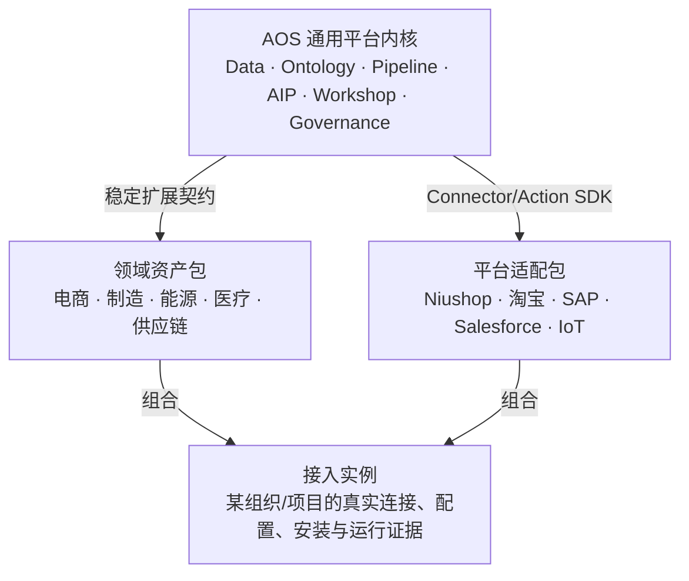

# 228-AOS 通用平台内核与领域资产包模块化分治方案

> 状态：**已评审冻结** · 2026-08-03 评审通过
> 版本：v1.1 · 2026-08-03
> 适用范围：AOS 平台内核、FDE 资产、领域解决方案、平台适配与客户实例
> 首个参考领域：[电商领域包、平台适配包与接入实例交付方案](电商平台接入/228-电商领域包平台适配包与接入实例交付方案.md)
> 编码实施门：[228-M0 资产包注册、解析、安装与证据化接入案例实施方案](电商平台接入/228-M0-资产包注册解析安装与证据化接入案例实施方案.md)
> 核心结论：AOS 是通用平台；电商是第一个标杆领域解决方案，不得成为平台内核

---

## 0. 使用的 Rules

| Rule | 本方案约束 |
|---|---|
| 文档先于编码 | 本方案与首个领域方案已冻结；仍须先评审 M0 编码实施方案，再开始资产注册中心或电商 G0 编码 |
| 平台内核无领域词汇 | `CustomerLite`、增长、内容官、订单等模型不得进入通用内核契约 |
| 依赖倒置 | 内核只识别稳定扩展契约、manifest、capability 和 lifecycle，不识别电商实现 |
| 四层分治 | 平台内核、领域资产、平台适配、接入实例分别版本化、测试、授权和回滚 |
| 资产不可变 | 发布版本内容 hash 不可变；修改必须产生新版本和新 lock |
| 实例不等于资产 | Secret、店铺标识、真实数据源和调度属于租户实例，不进入公共 FDE 包 |
| 证据驱动 | 资产“已验证”和案例“已生产”必须由测试/运行证据计算，不允许手填假状态 |
| 安全失败关闭 | 签名、依赖、权限、迁移、Evals 或回滚门失败时禁止安装/升级 |
| 渐进迁移 | 先旁路建立可信注册中心，再迁移现有页面；不破坏已有 Release/Ferry/Spoke 能力 |

---

## 1. 定位与不可妥协的架构结论

AOS 对标的是可承载多领域数据、本体、决策、应用和运营治理的通用平台。电商增长体系虽然范围巨大、价值重大，但本质上仍是一个具体领域解决方案。

正确关系是：



四个不变量：

1. 没有安装任何领域包时，AOS 内核仍能独立运行。
2. 卸载电商包不得破坏平台的通用数据、Ontology、AIP、Workshop 和 Apollo 能力。
3. 安装另一个领域包不需要复制或修改电商代码。
4. 一个接入实例能精确回答“使用了哪些包、哪些版本、哪些配置、哪些批准和哪些运行证据”。

---

## 2. 当前代码与页面审计证据

审计基线：`aos-platform m1@bc9711a`。

### 2.1 已有可复用基础

- `plugins/` 已按 connectors、actions、widgets、parsers、providers 等类型保存 manifest，说明平台已经具备低层插件化雏形。
- Apollo 已有 Release、Spoke、Ferry、Change 和简化 Asset 元数据链路，可以作为发布/交付外壳。
- Principal 已提供 org/project/role/marking，canonical Logic、DryRun、Evals、publication 等能力可以作为资产内容类型。
- 前端已有“FDE 资产包”和“接入案例”入口，产品信息架构具备改造落点。

### 2.2 FDE 资产页当前不是真实资产注册中心

`apps/web/src/pages/s2/AssetBundlesPage.tsx` 当前：

- 同一列表混合 `platform-runtime`、`fde-module`、`config-pack`，把平台发布与领域资产混为一层。
- 请求 `/v1/assets`，而后端真实简化接口是 `/v1/apollo/assets`。
- 接口无数据或失败时自动展示 `MOCK_ASSET_BUNDLES`，页面无法区分真实资产与演示资产。

后端 `routers/wave_ext.py` + `apollo_ops.py` 当前：

- Asset 仅保存 contents、compatibleChannels、hotfix 等元数据。
- `validated` 创建时固定为 `True`，没有 Evals、签名、依赖、迁移或证据推导。
- list/register 未完整使用 org/project 作为复合租户键。
- 使用通用 KV payload，不能承载不可变版本、安装、升级和回滚真源。

### 2.3 接入案例页当前是静态展示

`apps/web/src/pages/s2/IntegrationCasesPage.tsx` 当前将平台数、连接器数、同步数、日同步量、延迟、平台案例和状态写成前端常量，并把 `live` 映射为“生产”。它没有读取真实 Connection、Pipeline、Dataset、Ontology、Logic、Evals、Workshop 或 Action 证据。

因此当前页面只能认定为产品原型，不能作为完成度真源。

### 2.4 插件目录仍需统一

`plugins/` 文件清单比 `routers/plugins.py` 的硬编码 `_CATALOG` 丰富；后者只列少量插件，实例配置仍为进程内存。后续必须统一 manifest discovery、可信 catalog、安装实例和 secret_ref，不再维护多套平行注册表。

---

## 3. 四层职责与所有权

| 层 | 所有者 | 内容 | 生命周期 | 禁止内容 |
|---|---|---|---|---|
| L0 平台内核 | AOS Core | 通用运行时、SDK、资产注册/解析/安装、租户安全、治理、审计 | 平台 Release | 领域模型、店铺配置 |
| L1 领域/解决方案包 | 领域团队/FDE | Ontology 扩展、指标、Agent/Logic、Workshop、Evals、领域策略 | FDE Bundle SemVer | 具体平台 Secret/表名 |
| L2 平台适配包 | Connector 团队 | 协议、鉴权、capability、Schema、mapping/Pipeline 模板、回执 | Adapter Bundle SemVer | 客户实例和领域经营逻辑 |
| L3 接入实例 | 客户/FDE 项目 | 包锁、安装、真实 source refs、secret_ref、参数、批准、证据 | 租户 revision | 可公开复用代码、明文 Secret |

行业细分（美妆、服饰、生鲜）属于 L1 的 `vertical` 子类型；不是新的平台内核层。

---

## 4. 平台内核与领域模型的契约边界

### 4.1 平台通用基座

内核可以定义：

| 平台契约 | 作用 |
|---|---|
| `EvidenceRef` | 引用内部 revision、外部来源或运行证据 |
| `PlanEnvelope<TSpec>` | 不可变方案 revision、hash、状态和批准外壳 |
| `TaskGraph<TPayload>` | 任务 DAG、依赖、租约、幂等和运行状态 |
| `HandoffEnvelope<TPayload>` | 最小上下文移交、recipient、purpose、marking |
| `ArtifactRef` / `ObservationRef` | 产物与结果观察的通用引用 |
| `ReviewEnvelope<TReview>` | 初步/最终复盘、证据、结论和不确定性 |
| `MemoryCandidateEnvelope<TContent>` | 受治理经验候选和来源 |
| `ActionProposal<TPayload>` | 受控副作用提案、审批、执行和对账 |
| `ExtensionCapability` | 扩展导入/导出能力与安全元数据 |

这些泛型/信封不包含任何电商字段。

### 4.2 领域扩展

电商包在平台外壳上定义：

```text
PlanEnvelope<GrowthPlanSpec>
TaskGraph<EcommerceAgentTaskPayload>
HandoffEnvelope<EcommerceHandoffPayload>
ReviewEnvelope<GrowthEffectReview>
MemoryCandidateEnvelope<EcommerceExperience>
```

`GrowthPlanSpec`、`CustomerLite`、`ContentBrief`、`RecommendationDraft`、`CampaignRevision` 等属于电商包；制造领域可定义完全不同的 Spec，但复用同一平台外壳。

### 4.3 禁止的依赖方向

```text
禁止：aos_api core → import ecommerce_growth
允许：ecommerce_growth → import aos extension SDK
允许：asset runtime → 根据已批准 manifest 加载 entrypoint
禁止：前端导航 → 硬编码某领域页面为平台必选页面
```

---

## 5. 资产类型体系

平台 Release 与 FDE Bundle 必须分开：

| 类型 | `kind` | 示例 | 是否展示在 FDE 资产页 |
|---|---|---|---:|
| 平台发行版 | `PlatformRelease` | AOS 1.7.0 | 否，归 Apollo Release |
| 领域核心包 | `DomainPack` | `domain.ecommerce.core` | 是 |
| 解决方案包 | `SolutionPack` | `solution.ecommerce.growth` | 是 |
| 行业扩展包 | `VerticalPack` | `vertical.ecommerce.fresh` | 是 |
| 平台适配包 | `PlatformAdapterPack` | `platform.ecommerce.niushop` | 是 |
| 通用插件包 | `PluginPack` | `connector.rest-generic` | 是 |
| 交付组合 | `BundleComposition` | 电商增长 + Niushop | 是 |
| 实例覆盖 | `InstanceOverlay` | 栖月汇 revision 12 | 否，归接入实例 |

`config-pack` 需要拆分：可复用默认配置属于相应 Bundle；区域/租户差异属于 InstanceOverlay；平台运行参数属于 PlatformRelease/Spoke 配置。

---

## 6. Canonical Bundle Manifest

```yaml
apiVersion: aos.dev/v1alpha1
kind: SolutionPack
metadata:
  id: solution.ecommerce.growth
  version: 1.0.0
  displayName: 电商增长参谋长
  publisher: aos
  contentHash: sha256:...
  signatureRef: sig://...
  license: internal
spec:
  platformApi: ">=1.7.0 <2.0.0"
  dependencies:
    - id: domain.ecommerce.core
      version: "^1.0.0"
  optionalDependencies: []
  conflicts: []
  exports:
    ontology: [ecommerce-growth-ontology.yaml]
    metrics: [growth-metric-tree.yaml]
    agents: [agents/]
    logic: [logic/]
    workshops: [workshop/]
    evals: [evals/]
    policies: [policies/]
  capabilities:
    provides: [ecommerce.growth.plan, ecommerce.growth.core-agents]
    requires: [aos.plan-envelope.v1, aos.task-graph.v1]
  permissions:
    roles: []
    markings: []
    dataScopes: []
    actionTypes: []
  migrations:
    plan: migrations/plan.json
    downgradePolicy: retain-canonical
  preflight: preflight/spec.yaml
  regression: evals/suites.yaml
  rollback: rollback/manifest.yaml
```

Manifest 约束：

- `id+version+contentHash` 唯一；已发布内容不可覆盖。
- 依赖使用可解析版本范围，最终安装必须固化精确 lock。
- `permissions` 是最小权限声明；安装时显示权限 diff。
- entrypoint、迁移和 UI 注册只能来自签名内容清单。
- Secret 只能声明需要的 secret schema，不保存值。

---

## 7. 依赖解析、Composition 与 Lock

### 7.1 解析输入

用户选择一个或多个 Bundle、目标 platform API、org/project、目标环境和当前安装集合。

### 7.2 确定性输出

```yaml
compositionId: bc_...
requested:
  - solution.ecommerce.growth@1.0.0
  - platform.ecommerce.niushop@1.0.0
resolved:
  - domain.ecommerce.core@1.1.2#sha256:...
  - solution.ecommerce.growth@1.0.0#sha256:...
  - platform.ecommerce.niushop@1.0.0#sha256:...
platformRelease: aos@1.7.0
permissionDiffHash: sha256:...
migrationPlanHash: sha256:...
lockHash: sha256:...
```

同一 registry snapshot + request 必须得到相同 lock。解析器拒绝：依赖循环、版本冲突、平台 API 不兼容、同名 capability 冲突、未签名包和禁止的降级。

### 7.3 组合而非复制

SolutionPack 不复制 DomainPack 内容，PlatformAdapterPack 不复制 SolutionPack。Composition 只引用精确版本；实例只引用 Composition lock 和 overlay revision。

---

## 8. 安装、升级、卸载与回滚状态机

```text
draft composition
  → resolved
  → preflight_passed
  → pending_approval
  → approved
  → applying
  → verifying
  → active

任一阶段 → blocked|failed
active → upgrading|rolling_back|deactivating
```

安装步骤：

1. 解析依赖与精确 lock。
2. 验证 hash、签名、SBOM、许可证和发布状态。
3. 计算权限、数据、API、导航和数据库 migration diff。
4. 在目标 org/project 做 preflight 和冲突检查。
5. 人工批准精确 lock + diff hash。
6. 事务化登记 installation revision，逐组件 apply。
7. 运行 bundle 自测、Evals、路由/OpenAPI、页面与租户负向门。
8. 验证通过才切换 active revision；失败按 rollback manifest 恢复。

卸载不是删除数据库：先检查下游依赖、停用入口和运行，保留 canonical evidence；只有包明确声明且无引用时才物理清理派生数据。

---

## 9. 接入实例不是公共资产

`IntegrationInstance` 绑定：

```yaml
id: integration.qiyuehui.niushop
orgId: ...
projectId: ...
compositionLockRef: lock_...
overlayRevision: 12
sourceRefs: [source_...]
secretRefs: [secret_...]
scheduleRefs: []
approvalRef: approval_...
evidenceSnapshotRef: evidence_...
stage: data_verified
```

实例 overlay 允许保存 shop/store 的不透明引用、字段选择、阈值、调度和功能旗标；禁止明文凭据、可跨客户复用代码和覆盖 Bundle 内不可变安全策略。

InstanceOverlay 可以导出脱敏差异模板，但导出前必须移除 tenant ID、source ID、Secret、PII 和运行数据。

---

## 10. 建议代码与资产目录

> 以下是未来编码目录，当前尚未创建；编码前需在仓库 `AGENTS.md` 与构建系统中冻结实际入口。

```text
aos-platform/
  services/aos-api/aos_api/
    asset_registry/
      contracts.py
      store.py
      manifest_validator.py
      signature_service.py
      dependency_resolver.py
      composition_service.py
      installation_service.py
      evidence_service.py
    extension_runtime/
      sdk.py
      capability_registry.py
      loader.py
      lifecycle.py
    routers/
      asset_bundles.py
      bundle_installations.py
      integration_cases.py

  packages/contracts/
    asset-bundles/
    extension-sdk/
    orchestration-envelope/

  apps/web/src/pages/s2/assets/
    AssetCatalogPage.tsx
    AssetDetailPage.tsx
    CompositionResolverPage.tsx
    InstallationPlanPage.tsx
  apps/web/src/pages/s2/integration-cases/
    IntegrationCasesPage.tsx
    IntegrationCaseDetailPage.tsx
    EvidenceTimeline.tsx

  bundles/
    domains/
    solutions/
    verticals/
    platforms/
```

领域可执行后端代码放在 Bundle 自己的 `backend/<package>/`，通过 extension SDK 注册；不得直接散落成 `aos_api/growth_*`。

---

## 11. PostgreSQL 真源模型

至少新增：

| 表 | 作用 | 关键租户/版本键 |
|---|---|---|
| `asset_bundle` | 稳定资产 ID 与 kind | publisher/id |
| `asset_bundle_version` | 不可变 manifest/hash/signature | bundle_id/version/hash |
| `asset_bundle_evidence` | preflight/Evals/SBOM/签名证据 | version_id/evidence_type |
| `bundle_composition` | 用户请求的组合 | org/project/id |
| `bundle_composition_lock` | 精确解析结果与 diff hash | composition/revision/hash |
| `bundle_installation` | 目标租户安装 | org/project/installation_id |
| `bundle_installation_revision` | 当前/历史 lock、overlay、状态 | installation/revision |
| `bundle_installation_event` | approve/apply/verify/rollback 审计 | installation/sequence |
| `integration_instance` | 接入案例实例 | org/project/id |
| `integration_evidence_snapshot` | 阶段证据与数据截止时间 | instance/revision |

Registry 资产元数据可以全局可读，但安装、实例、证据和 overlay 必须按 org/project 隔离。发布者权限与租户安装权限分离。

---

## 12. Canonical API

```text
GET    /v1/asset-bundles
POST   /v1/asset-bundles
GET    /v1/asset-bundles/{bundle_id}
POST   /v1/asset-bundles/{bundle_id}/versions
POST   /v1/asset-bundles/{bundle_id}/versions/{version}/validate
POST   /v1/asset-bundles/{bundle_id}/versions/{version}/publish
POST   /v1/bundle-compositions:resolve
POST   /v1/bundle-installations
GET    /v1/bundle-installations/{installation_id}
POST   /v1/bundle-installations/{installation_id}/submit
POST   /v1/bundle-installations/{installation_id}/approve
POST   /v1/bundle-installations/{installation_id}/apply
POST   /v1/bundle-installations/{installation_id}/verify
POST   /v1/bundle-installations/{installation_id}/rollback
GET    /v1/integration-cases
GET    /v1/integration-cases/{case_id}
POST   /v1/integration-cases/{case_id}/evidence-snapshots
```

所有 mutation 要求 Principal、角色/marking、Idempotency-Key、expected revision/hash；安装 apply 不接受 body 中的 `approved=true`。API 错误至少区分 manifest invalid、signature invalid、dependency conflict、permission denied、preflight failed、approval stale、migration failed、verification failed 和 rollback blocked。

旧 `/v1/apollo/assets` 在迁移期只读适配到新 registry 或标记 deprecated；不再新增第三套 `/v1/assets` 真源。

---

## 13. “FDE 资产包”页面信息架构

### 13.1 页面定位

FDE 资产页管理可复用扩展，不管理 AOS 平台二进制 Release，也不展示租户 Secret。

建议 Tab：

1. 领域资产：DomainPack。
2. 解决方案：SolutionPack。
3. 行业扩展：VerticalPack。
4. 平台适配：PlatformAdapterPack/PluginPack。
5. 交付组合：BundleComposition。
6. 已安装：当前 workspace 的 BundleInstallation。

### 13.2 资产详情

显示版本、依赖图、提供/需要 capability、内容清单、权限 diff、数据库 migration、Evals、签名/SBOM、兼容平台范围、变更日志、废弃替代和回滚策略。

### 13.3 真实状态

- `draft`：内容可变，不能安装到生产。
- `validated`：指定验证套件通过，但尚未发布。
- `published`：不可变且已签名。
- `deprecated`：允许现有实例保留，不建议新装。
- `revoked`：安全原因禁止新装/升级，触发受影响实例告警。

页面无真实 API 时显示空态/错误，不回退 Mock；演示数据只能在显式 demo workspace 中标记“演示”。

---

## 14. “接入案例”页面信息架构

### 14.1 两类视图

| 视图 | 内容 |
|---|---|
| 参考案例 | 脱敏模板、使用的 Bundle、公开验证证据和可复用说明 |
| 当前实例 | 本 org/project 的真实 installation、配置、阶段和运行证据 |

### 14.2 阶段状态

```text
planned
→ connection_verified
→ data_verified
→ ontology_verified
→ logic_verified
→ workshop_verified
→ production_ready
→ production_active
```

状态只能由阶段证据计算：例如 `data_verified` 至少需要 source 可达、Pipeline 成功、Dataset revision、质量检查与租户负向门；`production_active` 还需要 C0.2、Action、运行与回滚证据。

### 14.3 案例详情

- Composition lock 和所有 Bundle 精确版本。
- InstanceOverlay revision 与批准人。
- Source/Pipeline/Dataset/Ontology/Logic/Workshop/Action 证据时间线。
- 数据新鲜度、最近成功/失败 run、Evals、阻断项和 owner。
- 允许能力与被安全门禁用能力。
- 升级 diff、回滚点和证据截止时间。

统计卡全部由 API 聚合；禁止在前端写“7 已上线”“1.2M 行”等常量。

---

## 15. 安全与供应链治理

- Bundle 发布需 content hash、签名、publisher、SBOM、许可证、扫描和 provenance。
- 安装前验证签名链和撤销列表；Registry 不信任前端传入的 validated 状态。
- Extension entrypoint 只从 allowlisted 类型注册，按 capability 沙箱和最小权限运行。
- Bundle 不能携带 Secret；仅声明 secret schema，值通过 InstanceOverlay 的 secret_ref 绑定。
- Migration 只能操作 pack-owned schema/table namespace；禁止修改无声明的内核表。
- UI 扩展通过 manifest slot 注册，禁止任意覆盖平台路由、导航或安全页面。
- Connector/Action 扩展必须声明 read_only、side_effect、risk、idempotency、reversibility 和 data scope。
- 资产撤销后列出受影响 installation，不自动破坏运行；按风险执行暂停、升级或回滚。

---

## 16. 从现状迁移的分波方案

| 波次 | 工作 | 不做 | 退出门 |
|---|---|---|---|
| M0 文档冻结 | 冻结四层、manifest、API、状态、页面和迁移策略 | 不编码 | 平台/电商两份方案与 G0～G6 自洽 |
| M1 Registry 真源 | PG 模型、manifest、version、evidence、租户门 | 不安装领域代码 | API/OpenAPI/双租户/重启回读通过 |
| M2 Resolver/Installation | 依赖、lock、permission diff、批准、状态机 | 不真实执行 migration | 确定性/冲突/职责分离通过 |
| M3 FDE 页面 | 去 Mock、真实 catalog/detail/composition/install plan | 不改接入案例生产状态 | 浏览器、空态、失败态通过 |
| M4 接入案例 | 实例/证据 API 与数据驱动页面 | 不伪造历史 | 微商城只能显示证据达到的阶段 |
| M5 最小组合验证 | 电商 core、operations-base、growth 与 Niushop test-only 坐标组成的无业务四包闭环 | 不读取真实平台 schema，不实现 Connector/SQL/Pipeline，不生产写回 | 发布、解析、安装、Evidence、安全回滚与累计回归通过；不把 rollback 宣称为 uninstall |

M0～M4 是平台基础，优先于电商 G0；M5 只验证既有通用内核能承载领域包组合，并与电商 G0、具体平台实现保持严格分界。M5 最终 GREEN 后必须先完成路线评审并暂停汇报，不得自动进入 Niushop/微商城、微信小店、抖音或快手编码。

---

## 17. 并行开发边界（未来编码）

| Worker | 独占范围 | 共享冲突点 |
|---|---|---|
| W1 | registry contracts/store/migration | 公共 manifest、migration head |
| W2 | resolver/composition/installation | 状态机、approval API |
| W3 | FDE 资产页与接入案例页 | routes/navigation/前端 client |
| W4 | extension SDK、签名、evidence、测试工具 | plugin discovery/OpenAPI |

总控独占：公共契约、router manifest、OpenAPI 生成、迁移 head、最终集成和累计回归。电商包由后续领域 Worker 负责，不与 M1/M2 共改内核文件。

---

## 18. 测试矩阵

### 18.1 单元与契约

- Manifest schema、SemVer、hash、签名、依赖循环/冲突、capability 冲突。
- Composition lock 确定性、permission/migration diff hash。
- 安装/升级/回滚状态机、幂等、CAS、审批过期。
- OpenAPI 确定性、无重复路径/operationId。

### 18.2 租户与安全

- 双租户同 ID、跨 org/project 安装/实例访问、marking、职责分离。
- Bundle 携带 Secret、越权 migration、恶意 entrypoint、路由覆盖、路径穿越。
- 签名伪造、撤销、SBOM 缺失、content hash 变化、旧批准重放。

### 18.3 集成与浏览器

- 发布 Bundle → resolve → diff → 自批阻断 → 合法批准 → dry apply → verify → active。
- 依赖冲突/验证失败 → rollback → 原 active revision 恢复。
- FDE 页面无数据真实空态、API 失败错误态、无 Mock fallback。
- 接入案例阶段随真实 evidence 变化，刷新/重启可回读。

### 18.4 累计回归

现有 Data、Ontology、Pipeline、AIP、Workshop、Apollo Release/Ferry/Spoke、权限和 Web 主流程必须全部通过。M1～M5 每波都运行本波专项 + 前序波 + 平台全量回归。

---

## 19. 主要风险与控制

| 风险 | 控制 |
|---|---|
| 把所有东西都打成一个巨包 | 资产 kind、依赖、capability 和组合 lock 分离 |
| 动态扩展破坏内核 | 稳定 SDK、allowlist entrypoint、权限和沙箱 |
| Bundle migration 污染平台表 | pack-owned namespace、迁移计划审查和回滚 |
| 客户配置泄漏进公共包 | InstanceOverlay + secret_ref + 导出脱敏 |
| 前端状态继续造假 | evidence-derived stage，去 Mock fallback |
| 依赖升级雪崩 | 不可变 lock、显式升级 diff、逐实例批准 |
| 平台/电商团队并行冲突 | 内核/Bundle 目录所有权与依赖方向门禁 |

---

## 20. M0 最终退出门

开始编码前必须同时满足：

1. 本平台级方案完成评审冻结。
2. 首个电商领域交付方案完成评审冻结。
3. G0～G6 的代码目录和契约所有权已按四层分治校正。
4. FDE 资产页与接入案例当前真实性差距已登记为 M1～M4 工作，不再宣称完成。
5. PlatformRelease、FDE Bundle、InstanceOverlay 三者概念不混用。
6. Registry、Resolver、Installation、Evidence、Case 的 API/状态/租户/回滚契约无歧义。
7. 每波专项与累计回归门已经冻结。

任一项未满足，不进入平台资产中心或电商 G0 编码。
