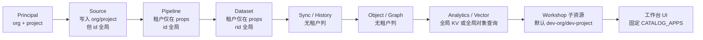
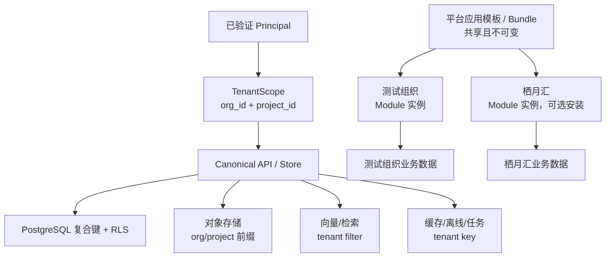
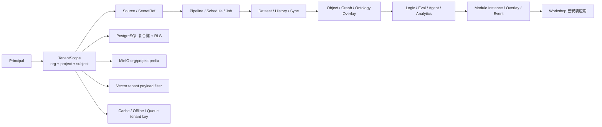
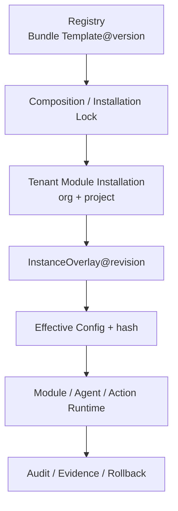

# 228 · 组织与工作区租户隔离全量补强实施方案

> **版本**：v1.12 · 2026-08-04
> **状态**：🔴 TI-1 E3-0 只读证据已生成但门禁 BLOCKED；未解释基线漂移且缺少 E1 逐记录身份证据；TI-1 E2 保持 GREEN，E3-1 及之后未授权
> **适用范围**：AOS 身份与租户面、Data OS、Ontology/Object、AIP、Workshop/Module、电商领域资产及对象/文件/检索/缓存等全部业务数据
> **前置方案**：[20a-多用户与工作区整站隔离方案](20a-多用户与工作区整站隔离方案.md) · [125-TWA5-漏网表读路径盘点销项方案](125-TWA5-漏网表读路径盘点销项方案.md) · [166-TWA11-组织工作区删除与清数据方案](166-TWA11-组织工作区删除与清数据方案.md) · [181m-TWA租户面PG迁库方案](181m-TWA租户面PG迁库方案.md) · [228-AOS通用平台内核与领域资产包模块化分治方案](228-AOS通用平台内核与领域资产包模块化分治方案.md)
> **实施原则**：不重新设计 AOS 四层架构；把已冻结的 `Principal → org_id + project_id → tenant-owned resource` 规则补齐到全部遗留业务链路
> **一句话结论**：`Organization` 是客户/公司硬边界，`Project` 是组织内工作区硬边界；任何业务实例必须同时属于二者。平台模板共享且不可变，但模板安装成具体实例后允许通过受治理的 `InstanceOverlay` 针对组织、工作区乃至用户偏好形成“千组织千面、千工作区千面、有限千人千面”，且任何定制、数据和删除互不影响。

---

## 0. 使用的 Rules

| Rule | 本方案约束 |
|---|---|
| 中文回答 | 文档、错误码说明和验收口径使用中文 |
| 先方案后编码 | 本文评审通过前，不修改业务表、Router、前端应用列表或存量数据 |
| 复用既有租户模型 | 继续使用 `Principal.org_id + Principal.project_id`；产品称“组织 + 工作区”，不新造第三套租户 ID |
| 组织和工作区都是硬边界 | 所有 tenant-owned 数据必须同时携带 `org_id + project_id`；只按组织过滤不算完成 |
| 测试数据归测试组织 | 现有默认组织改名为“测试组织”；历史开发、种子、演示和自动化残留只允许归入该组织的测试工作区 |
| 客户组织默认空 | “栖月汇商贸有限公司”组织不得自动继承测试数据、四个应用实例或任何历史未归属业务数据 |
| 模板与实例分离 | 平台可共享应用模板、Bundle 和插件目录；Module 安装实例、画布、变量、事件、配置和运行数据按组织/工作区隔离 |
| 千面但不分叉 | 组织定制通过版本化 InstanceOverlay、策略和配置完成；不复制并私改平台模板源码，不把客户差异回写公共模板 |
| 删除不跨租户 | 在栖月汇删除“订单管理”，只影响栖月汇当前工作区的 Module 实例；不得影响测试组织、其他组织或栖月汇的其他工作区 |
| 最小且可回滚 | 数据库采用 expand → backfill → validate → switch → contract；迁移先复制/标记，后收口，不直接破坏性清库 |
| 数据安全优先 | 无法证明归属的数据进入隔离清单或测试组织，不得猜测为客户正式数据；禁止静默丢弃 |
| 双层防线 | Service 层强制 TenantScope，同时使用 PostgreSQL 复合键/复合外键和 RLS 防止漏过滤 |
| 失败关闭 | 缺租户上下文、跨租户资源、RLS 上下文未设置、数据归属不明时拒绝操作，不降级为全局查询 |
| 证据化验收 | 方案、迁移、数据归属、跨租户负向测试、空组织证明和回滚演练都要形成证据 |

---

## 1. 用户已决要求

以下内容为本方案的产品决策，不再作为编码阶段的待定项。

### 1.1 组织与存量数据

| 项 | 已决规则 |
|---|---|
| 现有默认组织 | 技术 ID 继续保留 `dev-org`，显示名由“默认组织”改为 **“测试组织”**，避免大面积改 ID 造成兼容风险 |
| 现有默认测试工作区 | `dev-org/dev-project`，UI 名保持 **“测试工作区”** |
| 现有应用和业务数据 | 视为测试数据；经盘点、对账后归入 `dev-org/dev-project`，不得进入客户组织 |
| 栖月汇组织 | 现有技术 ID `org-org`、显示名“栖月汇商贸有限公司”保留 |
| 栖月汇初始工作区 | 当前为 `org-org/dev-project`；显示名后续可改为“默认工作区”或经产品确认的正式名称，但初始业务数据必须为 0 |
| 空数据定义 | 不是“某几个列表为空”，而是租户资源注册表中所有 `BUSINESS_DATA` 实例资源计数均为 0，且对象存储、向量、缓存和任务队列无该租户前缀数据；组织、工作区、成员和审计等 `CONTROL_PLANE` 必需行允许非 0，但必须单独列示且不得混入业务空数据结论 |

### 1.2 工作台四个核心应用

四个核心应用以现有视觉稿和 Workshop 方案为准：

| 应用 | 平台模板标识建议 | 当前测试实例参考 | 主要租户数据 |
|---|---|---|---|
| 订单管理 | `workshop.order-management` | `mod-order-management` | Order、OrderLine、Shipment、查询、筛选、画布、事件、部署 |
| 风险告警管理 | `workshop.risk-inbox` | `mod-ops-inbox` / `dev-module-risk` | 风险项、工单、处置记录、活动日志、草稿、审批 |
| 态势大屏 | `workshop.cop-dashboard` | `mod-cop-dashboard` | 指标快照、聚合结果、钻取状态、告警流、看板配置 |
| Buddy 智能助手 | `workshop.buddy-assist` | `mod-buddy-assist` | 会话、上下文引用、工具执行记录、反馈、记忆候选 |

已决行为：

1. 四个应用的**模板**可以由平台统一提供；模板本身没有客户业务数据。
2. 某组织/工作区安装后的 **Module 实例**、配置和数据是 tenant-owned。
3. 测试组织可以保留现有四个应用和测试数据。
4. 栖月汇初始不自动安装四个应用，应用列表的“已安装”区必须为空；平台模板可在“可安装模板”区展示。
5. 栖月汇以后安装“订单管理”时创建独立实例；其 `moduleId` 即使与测试组织相同，也不能冲突。
6. 栖月汇删除“订单管理”时，测试组织的订单管理必须继续存在、可打开、数据不变。
7. 同一组织的不同工作区同样隔离：A 工作区删除 Module 不影响 B 工作区。
8. 模板安装到具体实例后，组织可以定制品牌、页面、字段、指标、流程、智能体、权限和数据绑定；不同组织基于同一模板可以形成完全不同但可升级、可审计、可回滚的应用形态。

### 1.3 与 228 总路线、M3 和电商任务的关系

本方案是横跨 AOS 四层和工作台的安全补强轨，不取代也不重新命名现有 M0～M5 交付里程碑。

| 现有路线/方案 | 与本文关系 | 统一执行口径 |
|---|---|---|
| [00-开发计划-先通用后细分](电商平台接入/00-开发计划-先通用后细分.md) | 定义“先通用平台能力，后接具体电商平台” | TI-6 GREEN 是栖月汇真实数据和具体平台实例入场前门 |
| [00-开发计划实施排期与里程碑](电商平台接入/00-开发计划实施排期与里程碑.md) | 总排期与交付节奏真源 | 每个 TI 波次完成后回写总计划、228 路线和 AOS 开发上下文 |
| [228-M2-B 安装控制面与 Canonical API](电商平台接入/228-M2-B安装控制面与Canonical-API并行实施方案.md) | M2-B GREEN 是资产安装强租户基线 | 保持现有 Composition/Installation/Integration 契约，不重设计 |
| [228-M3 安装管理 UI 与 SDK](电商平台接入/228-M3-安装管理UI与SDK实施方案.md) | 继续使用已评审 M3 安装能力；TI 专门处理全域租户漏网表/路由/缓存 | M3 名称不与 TI-0～TI-6 混用；租户补强不改 M3 已冻结架构 |
| [带货达人任务](电商平台接入/228-带货达人邀约签约与长期运营任务方案.md)、[控价与比价任务](电商平台接入/228-全网同款控价与同类目竞品比价任务方案.md) | 是新电商领域 tenant-owned 任务实例，依赖 Source/Dataset/Object/AIP/Module/Queue 全链 | 在 TI-4/TI-5 前只使用 synthetic/测试组织数据；真实客户执行等待 TI-6 |

因此执行顺序固定为：**M2-B/M3 已完成能力保持 GREEN → TI-0～TI-6 补齐全域租户底座 → 开始微信小店/抖音/快手/微商城等具体平台客户实例接入**。

---

## 2. 当前全域审计基线

审计时间：2026-08-04；对象为当前本地 `aos-platform` m1 代码、PostgreSQL 开发库、运行中 API/Web 及四个 Worker 工作树。本节是编码前基线，不代表补强已完成。

### 2.1 审计总结

| 层级 | 状态 | 当前结论 |
|---|---|---|
| 身份、组织和工作区上下文 | 🟡 黄绿 | JWT Claim 绑定 `org_id/project_id`，Header 不一致拒绝；开发模式仍允许 `Bearer dev` |
| PostgreSQL 数据边界 | 🔴 红 | 86 张表中只有 31 张把全部租户列纳入主键；27 张弱主键，28 张无租户列；RLS/Policy 均为 0 |
| Data OS | 🔴 红 | Source 只部分挂租户，Pipeline/Dataset/Sync/History/Graph 全局主键、全量启动加载，部分路由无鉴权 |
| Object/Ontology/Graph | 🔴 红 | `obj_instance`、`graph_edge`、Branch Overlay 和全局 Ontology 尚无组织/工作区硬边界 |
| AIP/Analytics | 🟡 黄 | Canonical Logic/Run/Eval/Publication 已强隔离；KV、Notebook、Experiment、部分 Buddy/旧路由仍全局 |
| 资产 Registry/Composition/Installation | 🟢 绿 | Bundle 作为全局不可变模板合理；Composition、Installation、Evidence、Integration Case 已按 org/project 复合隔离 |
| 电商核心对象 | 🟢 绿 | `ecom_object/link/checkpoint/receipt/oauth_token` 使用 org/workspace 复合键；需收口 `workspace_id ↔ project_id` 语义 |
| Workshop Module | 🔴 红 | Module 父列表按租户过滤；Query/Variable/Widget/Interface/Deployment/Event/Config 子链无鉴权或写死默认租户 |
| 工作台前端与本地缓存 | 🟡 黄 | Tenant Header、离线队列和快照已分区；应用列表仍由固定 `CATALOG_APPS` 冒充已安装实例 |
| 清数据、删除和空组织证明 | 🔴 红 | 当前只枚举 Module/Draft/Wiki/少数缓存与 MinIO 前缀，不能证明全域为空 |

**开工结论**：可以进入 TI-0，但在 TI-0/TI-1 GREEN 前不得回填、清理或接入栖月汇真实业务数据；在鉴权缺口失败关闭前，不得把当前 API 当作多租户安全基线。

### 2.2 已经具备的可复用能力

| 能力 | 当前情况 | 结论 |
|---|---|---|
| Principal | JWT Claim 绑定 `org_id/project_id`；Header 不一致返回 403；生产要求完整租户 Claim | 继续作为唯一 TenantScope 入口 |
| M2/M4 安装与接入案例 | 使用 `org_id + project_id` 复合主键、复合外键；跨租户统一 404 | 强隔离参考实现 |
| Canonical AIP Logic/Eval | Graph、Revision、Run、Eval Suite/Report、Publication 全链显式 org/project | 强隔离参考实现 |
| 电商一致性存储 | 对象、连接、Checkpoint、Receipt、OAuth Token 使用 `org_id + workspace_id` 复合主键 | 设计可复用，需统一命名映射 |
| Module 主列表 | Service 查询已按 `org_id + project_id` 过滤 | 仅父资源部分完成 |
| 工作区切换和本地缓存 | Tenant Context、离线队列、离线快照已按 org/project 分键，切区有清理逻辑 | 保留并补齐全部业务缓存 |
| 对象存储前缀 | 已有 `<org>/<project>/...` 约定 | 纳入统一资源注册表和清理证明 |

### 2.3 PostgreSQL 全表快照

| 分类 | 表数 | 定义 | 当前判定 |
|---|---:|---|---|
| 全部 public 业务/元数据表 | 86 | 当前开发库实际表 | 资源注册表必须 100% 分类 |
| 强复合主键 | 31 | 表内已有的 org/project 或 org/workspace 列全部在 PK 中 | 作为强隔离起点，仍需 Store/RLS 验证 |
| 弱租户主键 | 27 | 有租户列，但 PK 不包含全部租户列 | P0/P1 改复合键或内部 PK + tenant unique |
| 无租户列 | 28 | 无 org/project/workspace 列 | 必须判为 SYSTEM_GLOBAL、PLATFORM_TEMPLATE 或迁移为 TENANT_OWNED |
| RLS 已启用 / FORCE RLS | 0 / 0 | PostgreSQL 当前状态 | 无数据库第二道防线 |
| public schema policy | 0 | `pg_policies` 实测 | 任一漏租户 SQL 都可能直接跨区 |

弱主键重点表：

- Workshop：`meta_module`、`module_canvas_config`、`module_query`、`module_variable`、`module_widget_instance`、`module_events`、`module_interface`、`module_deployment`。
- Data OS：`meta_source`、`meta_schedule`。
- 协作/分析：`draft_dataset`、`wiki_page`、`wiki_page_version`、`object_lifecycle`。
- 模型/容量：`model_catalog`、`model_provider`、`model_route`、`provider_health`、`registered_models`、`capacity_limits`、`capacity_usage`。
- 租户面其他：`twa_audit`、`twa_invite`、`twa_join_request`、`theme`、`widget_catalog`、`apollo_spoke`。

无租户列表必须再分类：

- 明确可作全局模板/系统元数据：`alembic_version`、`asset_bundle*`（Registry 模板、版本、Artifact、Dependency、Evidence）、权威组织目录本身。
- 明确需租户化：`obj_instance`、`graph_edge`、`obj_branch_overlay`、`decision_lineage`、`funnel_status`、`meta_pipeline`、`meta_dataset`、`meta_sync`、`meta_dataset_history`、`phase5_pipeline_graph`、`meta_aip_kv`。
- 需模板/实例拆分：`meta_object_type`、`meta_link_type`、`meta_action_type`、`meta_branch`；全局部分必须不可变，租户扩展落 Overlay/Revision。
- 需 ADR 明确：`authz_tuple`、`twa_person_profile`、`twa_otp`、`apollo_channel`；不得因“用户或系统表”跳过数据边界分析。

### 2.4 本地数据和组织快照

| 项 | 当前快照 | 说明 |
|---|---:|---|
| `dev-org` 显示名 | “默认组织” | 尚未执行“测试组织”改名 |
| `dev-org/dev-project` Module | 159 | 包含核心应用、扩展 Module 和自动化测试残留 |
| `dev-org/prj-ops` Module | 1 | 另一个工作区实例 |
| `org-org/dev-project` Module | 0 | 栖月汇 Module 父表当前为空 |
| 栖月汇已强租户化核心资源 | 0 | Installation、Composition、Integration Case、AIP Logic/Eval、ecom object/link、OAuth Token 抽样均为 0 |
| `obj_instance` | 31 | 无租户列，无法证明属于哪个组织 |
| `graph_edge` | 2 | 无租户列 |
| `decision_lineage` | 631 | 无完整租户边界 |
| `meta_dataset/meta_pipeline` | 2 / 2 | 当前只在 props 中可能存租户信息 |
| `meta_dataset_history` | 212 | 无完整租户边界 |
| `meta_sync` | 76 | 无租户列 |
| `meta_aip_kv` | 23 | 全局 key，Analytics Session、Vector Index 等有共享风险 |

因此当前只能证明“栖月汇在部分已租户化强表中为 0”，**不能证明栖月汇全域业务为空**。无租户列历史行不能默认视为“与栖月汇无关”，必须先完成归属 ledger 和资源注册表。

### 2.5 运行态鉴权与隔离探测

| 探测 | 当前结果 | 期望 | 结论 |
|---|---:|---:|---|
| 无 Token `GET /api/datasource/sources` | 200 | 401 | Phase 6 Data Source 路由未鉴权，P0 |
| 无 Token `GET /v1/pipeline-builder` | 200 | 401 | Pipeline Builder 路由未鉴权，P0 |
| 无 Token `GET /v1/modules` | 401 | 401 | Module 父资源入口正确失败关闭 |
| 无 Token `GET /v1/modules/app-orders/queries` | 200 | 401 | Module 子资源路由未鉴权，P0 |
| 带 `dev-org/dev-project` 查 Module | 159 | 159 | 父列表租户过滤生效 |
| 带 `org-org/dev-project` 查 Module | 0 | 0 | 父列表空，但不代表前端和子链空 |

静态复核进一步确认：

- `phase6_agents/connectors/documents/media_sets/schemas/sources/syncs`、`phase5_pipelines`、`pipelines.py` 均没有 `require_principal/Depends` 引用，且已挂载到 Domain Aggregate。
- Module 的 Queries、Variables、Widgets、Interface、Deployments、Config、Events 路由均未接 Principal。
- 一部分路由虽声明 Principal，却立即 `_ = principal`，鉴权不等于数据隔离。

### 2.6 从 Data OS 到工作台的当前串区链



当前链路中，任一个全局 ID 直读、无 TenantScope 异步消息或未清缓存都可以跳过上游 Principal。因此补强必须是“全链同时传递 TenantScope + 存储复合约束 + RLS”，不能只修列表 API。

### 2.7 工程起跑线

| 项 | 当前基线 |
|---|---|
| 代码 m1 | `4d04e1f`，与远端 m1 一致 |
| W1～W4 | 四个 Worker 均在 `4d04e1f`，工作树干净，远端分支一致 |
| 主工作树 | 存在用户的掘金/头条文档改动；租户隔离波次不得夹带或覆盖 |
| 服务 | API 8080、Web 5173正常；PostgreSQL、MinIO、MySQL、OCR、Analytics 健康 |
| 数据库迁移 | `228assetintegration (head)` |
| 当前租户/Workshop 专项回归 | 62 passed，7 warnings |

### 2.8 当前明确缺口

| 缺口 | 当前表现 | 风险 |
|---|---|---|
| 鉴权与数据边界断层 | Data OS Phase 5/6、Pipeline Builder、Module 子资源存在无鉴权路由 | 未登录即可读写全局引擎，生产阻断 |
| Module 主键全局 | `meta_module.id` 是全局主键，虽然有租户字段，同一个 `moduleId` 不能安全存在于两个租户 | 无法真正复制同一应用到多个组织 |
| Module 子表写死默认租户 | Event、Variable、Query 等 Store 使用 `_DEFAULT_ORG/_DEFAULT_PROJECT` | 在非测试组织操作仍可能读写测试组织数据 |
| Module 子表单列主键 | 多数子表 `id` 全局唯一，没有到租户 Module 的复合外键 | 删除和更新可能跨租户命中 |
| 前端应用目录硬编码 | 九个应用卡片由 `CATALOG_APPS` 固定显示，不代表当前租户已安装 | 栖月汇即使空也会看到“已有应用”假象 |
| Object/Graph 全局 | `obj_instance`、`graph_edge` 无 `org_id/project_id` | 订单、工单等业务数据可能串租 |
| Ontology/Action 全局 | 类型和 Action 当前共享，未拆系统模板与租户扩展 | 一个组织修改可能影响所有组织 |
| Data OS 全局 | Pipeline、Dataset、Sync、History 缺租户列/复合键，启动时 `SELECT *` 加载到全局内存 Map | 数据源、同步结果和任务可能串租 |
| 对象索引全局 | Object/Delta/Stream Index 引擎是进程级单例，模型不含 TenantScope | 虽需登录，不同租户仍共享索引数据 |
| Analytics/AIP 全局 KV | Notebook Session、Vertex Experiment、Vector Index 共用 `meta_aip_kv` 全局 key | 会话、实验、向量索引跨租户可见 |
| InstanceOverlay 尚非生产能力 | 当前 Schema 明确为 M5 synthetic file-only contract，Installation 仅保存不透明 `overlayRevision` | “千组织千面”尚无可编辑、生效、审批和回滚的生产 Store/API |
| 清数据清单不全 | `tenant_data.py` 只枚举 Workspace Item、Plugin Config、Module、Draft、Wiki 和 MinIO 前缀 | “已清空”和组织删除门不可信 |
| 数据库无 RLS | 当前 PostgreSQL 未启用 Row Level Security | 任一漏租户 SQL 都可能泄漏 |
| 租户目录双真源 | `twa_org/twa_workspace` 与 `meta_org/meta_workspace` 并存 | 名称、成员和工作区可能漂移 |

### 2.9 审计证据与后续代码定位

| 范围 | 当前关键文件 | 审计用途 |
|---|---|---|
| 身份与 Principal | `services/aos-api/aos_api/auth.py` | JWT/Header 租户绑定、`Bearer dev` 边界、request state |
| Data OS 存储 | `services/aos-api/aos_api/data_os_store.py` | 表结构、全局 PK、`load_all()` 全表加载 |
| Data OS Canonical/旧路由 | `services/aos-api/aos_api/routers/wave_ext.py` | 只按 org 过滤、遗留无标签可见、Sync/Dataset 忽略 Principal |
| Phase 5/6 与 Pipeline | `routers/phase5_pipelines.py`、`routers/phase6_*.py`、`routers/pipelines.py`、`routers/domain_aggregates.py` | 无鉴权 Router 与实际挂载关系 |
| Object/Ontology/Graph | `db.py`、`routers/ontology.py`、`routers/object_sets.py`、`branch_store.py`、`marking.py` | 全局 Object/Edge/Type/Branch，Marking/FGA 不能替代租户过滤 |
| 对象索引与向量 | `object_storage_indexing.py`、`routers/object_storage_indexing.py`、`vector_index.py` | 全局单例引擎、全局 Object 抽样、KV collection |
| AIP/Analytics | `aip_logic_graph_store.py`、`aip_eval_store.py`、`aip_kv_store.py`、`routers/analytics.py` | 区分 Canonical 强隔离链与全局 KV/会话遗留链 |
| 资产模板与安装 | `asset_registry/registry_store.py`、`composition_store.py`、`installation_store.py`、`integration_store.py` | 确认模板全局、实例 org/project 强隔离 |
| InstanceOverlay | `packages/contracts/schemas/asset-bundles/instance-overlay-v1alpha1.schema.json` | 确认当前仅 synthetic file-only contract，不是生产 API |
| 电商核心 | `ecom_consistency_store.py`、`oauth_token_store.py` | org/workspace 复合键和幂等/同步状态参考 |
| Workshop 父子链 | `module_store.py`、`routers/modules.py`、`module_queries.py`、`routers/modules_*.py`、`module_events_router.py` | 父资源已过滤，子资源无鉴权/默认租户/全局 ID |
| 工作台 UI 与缓存 | `apps/web/src/pages/WorkshopListPage.tsx`、`api/tenant.ts`、`lib/offlineQueue.ts`、`lib/offlineSnapshot.ts`、`lib/workspaceCache.ts` | 固定应用目录与本地分区能力对账 |
| 清数据/删除 | `tenant_data.py`、`routers/workspaces.py` | 当前摘要、清理、空数据判定覆盖面 |

---

## 3. 统一术语和边界

### 3.1 Canonical TenantScope

```python
TenantScope(
    org_id: str,       # 组织硬边界
    project_id: str,   # 工作区硬边界；产品 UI 称“工作区”
    subject: str,      # 当前用户/服务账号
)
```

规则：

- `TenantScope` 只能从验证后的 Principal 生成，不能从业务请求 Body 接受。
- 电商历史字段 `workspace_id` 在 API/Store 边界必须显式映射为 `project_id`；禁止同时维护两个独立含义。
- `org_id` 与 `project_id` 均使用稳定技术 ID；改组织显示名不改 ID。
- “当前组织”不等于“只按组织过滤”；组织内所有业务资源仍必须挂到具体工作区。

### 3.2 三类数据

| 类型 | 定义 | 示例 | 是否带 TenantScope |
|---|---|---|---:|
| `SYSTEM_GLOBAL` | AOS 自身运行所需、租户不可修改的系统元数据 | migration version、平台内置 capability 定义 | 否 |
| `PLATFORM_TEMPLATE` | 可供多个租户安装的不可变模板/目录 | Bundle、应用模板、Widget/Connector 插件目录、系统 Ontology 模板 | 模板本身否；安装记录是 |
| `TENANT_OWNED` | 某组织/工作区创建、安装、配置、产生或修改的数据 | Module 实例、对象、订单、数据集、Pipeline、会话、审批、证据 | **必须** |

任何新表必须在 `tenant_resource_registry` 中声明类别；未声明不得进入生产迁移。

### 3.3 组织、工作区、Marking 和权限关系

```text
认证 Principal
  → 组织成员资格
  → 工作区成员资格
  → TenantScope 数据过滤 / RLS
  → OpenFGA 对象权限
  → Marking 字段/标签权限
  → 返回结果
```

租户隔离优先于对象权限。OpenFGA 或 Marking 不能把其他组织的数据“授权回来”。

---

## 4. 目标架构

### 4.1 统一租户防线



### 4.2 关键不变量

1. `TENANT_OWNED` 查询没有 TenantScope 时无法调用。
2. 同一个业务 ID、Module ID 可以在不同组织/工作区重复存在。
3. 跨租户读取已知 ID 统一返回 404；写入失败关闭。
4. 删除租户实例只操作当前 TenantScope。
5. 数据库即使收到漏过滤 SQL，RLS 仍阻止读取其他租户。
6. 平台模板不携带组织业务数据；安装模板生成 tenant-owned 实例。
7. 实例定制只形成不可变 Overlay revision，不修改签名模板；运行时 Effective Config 必须能还原为“模板版本 + 安装锁 + 组织/工作区 Overlay + 允许的用户偏好”。

### 4.3 从数据操作系统到工作台的目标数据链



每一次请求、定时同步、重试、回调、智能体工具调用和前端离线重放都必须保持同一 TenantScope。上游资源引用下游资源时，除资源 ID 外必须同时校验 org/project，禁止“先按全局 ID 取出，再尝试鉴权”。

### 4.4 平台模板到组织实例的目标链



- Registry 模板可全局共享，但发布后不可修改，不含客户数据、Secret 和实例 ID。
- Installation、Overlay、Effective Config、运行、审批和回滚证据都是 tenant-owned。
- 删除某组织 Module 实例不修改 Registry 模板，不修改其他组织 Installation/Overlay，也不默认删除业务事实。

---

## 5. 工作台四应用与 Module 分治

### 5.1 模板与实例

建议采用两个明确概念，不再让前端固定卡片同时冒充模板和实例。

| 概念 | 推荐真源 | 说明 |
|---|---|---|
| 应用模板 `ModuleTemplate` | 资产包 Registry/Bundle manifest 或平台模板目录 | 平台共享、只读、版本化、无客户数据 |
| Module 实例 `ModuleInstallation` | `meta_module` 迁移后的 tenant-owned 表 | 某工作区安装、创建、修改的应用实例 |

应用列表 UI 分为：

- **已安装应用**：只来自 `GET /v1/modules`，严格按当前 TenantScope。
- **可安装模板**：来自 `GET /v1/module-templates` 或资产 Registry。
- 栖月汇为空时，“已安装应用”为 0；可安装模板仍可展示四个核心应用。
- 禁止在 API 失败时用硬编码模板填充“已安装应用”。

### 5.2 组织定制与“千人千面”

模板与实例分离不是要求所有组织使用同一副本，而是要做到：**公共能力共用一套，客户实例各自长成自己的样子。**

更准确的产品口径是：

| 层级 | 定制对象 | 产品含义 | 隔离与治理 |
|---|---|---|---|
| 平台模板 | `ModuleTemplate/Bundle` | AOS 提供的通用订单管理、风险告警、态势大屏、Buddy 等能力骨架 | 全局共享、签名、版本不可变 |
| 组织定制 | `OrganizationProfile` / 组织策略 | 企业品牌、术语、角色体系、统一合规策略、默认指标口径 | 只对该 `org_id` 生效；不能包含跨工作区业务事实 |
| 工作区实例 | `ModuleInstallation + InstanceOverlay` | 某业务线的数据源、页面、字段、流程、看板、智能体和 Action 配置 | `org_id + project_id` 硬隔离，版本化、可回滚 |
| 用户偏好 | `UserViewPreference` | 同一实例中个人保存视图、默认筛选、列宽、首页布局和提醒偏好 | `org_id + project_id + subject`；不得改变权限和业务真相 |

因此本文所说“千人千面”分为三层：

1. **千组织千面（核心）**：栖月汇、测试组织和未来客户都可以基于同一个“订单管理”模板形成不同品牌、字段、指标、流程和智能体配置。
2. **千工作区千面（核心）**：同一组织的销售、供应链、客服等工作区可以安装同一模板，但连接不同数据、展示不同页面、运行不同流程。
3. **有限千人千面（体验层）**：同一工作区内不同用户可以保存个人视图和偏好；个人偏好不得绕过工作区权限、Marking、审批或改变公共业务数据。

#### 5.2.1 可定制范围

| 维度 | 示例 | 落点 |
|---|---|---|
| 品牌与术语 | Logo、主题色、企业名称、“客户/会员”“订单/交易”等显示词 | 组织 Profile + Module Overlay |
| 信息架构 | 首页、导航、页面顺序、Widget 布局、默认入口 | Module Overlay revision |
| 字段与视图 | 可见列、字段别名、表单、详情卡、保存视图、默认筛选 | 工作区 Overlay；个人视图可再覆盖 |
| 数据绑定 | Source、Dataset、Object Type、字段映射、查询和刷新策略 | 工作区实例；SecretRef 严格绑定 TenantScope |
| 指标口径 | GMV、履约、风险、达人、控价等指标定义及阈值 | 组织策略默认 + 工作区 Overlay |
| 流程与 Action | 订单审核、风险处置、通知、审批、自动化事件 | 工作区 Overlay + Action Policy |
| 角色与权限 | 企业角色映射、字段 Marking、审批人、操作上限 | 组织策略 + 工作区权限；只能收紧或在模板声明范围内配置 |
| 智能体 | Buddy 人设、系统提示词、可用工具、知识范围、移交规则 | 工作区 Agent/Logic 实例 revision |
| 功能开关 | 启用某页面、Widget、Action 或领域能力 | 安装 manifest 允许范围内的 Overlay |
| 个人体验 | 列宽、排序、默认筛选、收藏、提醒方式 | UserViewPreference |

#### 5.2.2 继承与生效顺序

```text
签名平台模板 Template@version
  + 安装锁 Installation Lock
  + 组织默认 Profile@revision
  + 工作区 InstanceOverlay@revision
  + Module 实例配置 revision
  + 当前用户允许的 ViewPreference
  = Effective Module Config（含 hash）
```

后层只能覆盖前层明确声明为 customizable 的字段。以下内容禁止被 Overlay 改写：

- 模板签名、content hash、发布者和精确依赖锁。
- TenantScope、复合键、RLS、安全审计和证据链。
- 模板声明的最大权限、强制 Marking、强制审批和不可绕过的 Action 安全门。
- 指向其他组织/工作区的 Source、Dataset、Object、SecretRef、会话或文件。
- 平台内核代码和其他组织的任何 Overlay。

#### 5.2.3 Overlay 数据模型

复用 228 资产包架构中的 `InstanceOverlay` **概念和合约方向**，不另造客户分支。必须明确：当前代码中 `instance-overlay-v1alpha1.schema.json` 自述为 **synthetic file-only contract**，不是生产 InstanceOverlay API；Installation 当前只持久化一个不透明 `overlayRevision` 字段。因此下列数据模型是 TI-2 需实现的目标，不得写成当前已具备能力：

```text
module_instance_overlay
  org_id
  project_id
  module_pk UUID
  overlay_revision BIGINT
  base_template_id TEXT
  base_template_version TEXT
  base_content_hash TEXT
  patch_json JSONB
  effective_config_hash TEXT
  created_by TEXT
  created_at TIMESTAMPTZ

PK (org_id, project_id, module_pk, overlay_revision)
FK (org_id, project_id, module_pk) -> meta_module
```

要求：

- Overlay revision 一经生效不可覆盖修改；任何定制产生新 revision。
- `meta_module.active_overlay_revision` 通过复合外键指向当前生效 revision。
- `patch_json` 只保存差异，不复制完整模板源码；敏感信息只保存 `secret_ref`。
- Effective Config 必须 canonicalize 后计算 hash，进入发布、审批、运行和回滚证据。
- 组织级 Profile 只提供默认值；最终展开到具体工作区实例并生成确定的 Effective Config，业务运行不依赖模糊的运行时全局覆盖。

#### 5.2.4 模板升级与定制保留

模板升级不能覆盖组织定制。升级流程固定为：

```text
旧模板 + 当前 Overlay
        │
        ├── 与新模板做三方 diff
        ▼
自动兼容项 + 冲突项 + 权限变化 + 数据迁移计划
        │
        ├── 预览 / Evals / 审批
        ▼
新 Installation Lock + 新 Overlay revision
        │
        ├── 发布并生成 Effective Config hash
        └── 失败回滚旧 lock + 旧 overlay revision
```

- 模板新增且未被定制的字段可以自动继承。
- 模板修改已被组织覆盖的字段必须进入冲突清单，由管理员选择保留定制、采用新版或重新配置。
- 权限扩大、Action 副作用变化、数据迁移和 Secret Scope 变化必须重新审批，不能静默合并。
- 测试组织的 Overlay 不能作为栖月汇默认 Overlay；如需复用，只能发布为脱敏、审核后的新模板版本。

#### 5.2.5 千面能力边界

| 正确做法 | 禁止做法 |
|---|---|
| 同一模板产生多个 tenant-owned 实例和 Overlay | 为每个客户复制一份平台源码长期私改 |
| 用配置、策略、Ontology overlay、Logic revision 表达差异 | 在平台内核写 `if org_id == 'org-org'` |
| 每次定制可追溯到 actor、revision、diff 和 hash | 直接覆盖 JSON，无法还原是谁改了什么 |
| 用户偏好只影响个人视图 | 用个人偏好改变审批、权限、共享指标或业务事实 |
| 组织经验成熟后脱敏、评审并发布为新模板 | 把客户数据、Secret、专有规则直接回灌公共模板 |

### 5.3 Module 数据模型

为兼容现有 URL 仍使用 `moduleId`，数据库采用内部稳定键：

```text
meta_module
  org_id
  project_id
  module_pk UUID
  module_id TEXT
  template_id TEXT NULL
  template_version TEXT NULL
  installation_id UUID NULL
  active_overlay_revision BIGINT NULL
  effective_config_hash TEXT NULL
  status
  deleted_at NULL

PK      (org_id, project_id, module_pk)
UNIQUE  (org_id, project_id, module_id)
```

所有 Module 子资源必须保留同一租户链：

| 子资源 | 目标键/外键 |
|---|---|
| `module_canvas_config` | `(org_id, project_id, module_pk, revision)` |
| `module_widget_instance` | `(org_id, project_id, widget_pk)` + 复合 FK 到 Module |
| `module_variable` | `(org_id, project_id, variable_pk)` + 复合 FK 到 Module |
| `module_query` | `(org_id, project_id, query_pk)` + 复合 FK 到 Module |
| `module_events` | `(org_id, project_id, event_pk)` + 复合 FK 到 Module |
| `module_interface` | `(org_id, project_id, module_pk, interface_id)` |
| `module_deployment` | `(org_id, project_id, deployment_pk)` + 复合 FK 到 Module |
| `module_lifecycle/event/audit` | 每条包含 TenantScope、actor、module revision |

禁止继续在上述 Store 中使用 `_DEFAULT_ORG/_DEFAULT_PROJECT` 执行业务读写；默认值只能用于显式测试种子入口。

### 5.4 Module 删除语义

删除分为两种动作，避免误删业务数据：

| 动作 | 默认行为 | 权限/保护 |
|---|---|---|
| 移除应用实例 | 当前工作区 Module 软删除/卸载；停止事件和部署；保留独立业务对象 | admin/owner；`If-Match`；幂等；审计 |
| 清除应用数据 | 按 Module 声明的数据所有权清理当前工作区数据 | 单独入口、二次确认、显示计数、建议审批 |

默认“删除订单管理”**不删除 Order/OrderLine 等业务真相数据**，只删除/卸载应用实例和其私有 UI 配置。若用户明确选择“同时清除本应用生成的数据”，必须先展示影响范围、生成清理计划并留证。

删除 SQL 必须等价于：

```sql
UPDATE meta_module
   SET deleted_at = NOW(), status = 'deleted'
 WHERE org_id = :principal_org
   AND project_id = :principal_project
   AND module_id = :module_id;
```

数据库 RLS 继续兜底。跨租户相同 `module_id` 行不受影响。

### 5.5 四应用数据隔离矩阵

| 应用 | 配置/界面 | 业务数据 | 运行数据 | 必须隔离的缓存/文件 |
|---|---|---|---|---|
| 订单管理 | Module、Widget、Query、Variable、Event | Order、OrderLine、Shipment、Customer 引用 | 导入回执、Action、导出任务 | 表格缓存、离线快照、导出文件 |
| 风险告警管理 | 筛选、详情、活动流、处置 Action | RiskAlert、WorkOrder、处置记录 | Draft、审批、通知 | 告警缓存、通知队列 |
| 态势大屏 | 布局、指标卡、钻取配置 | 租户指标聚合和引用 | 刷新任务、告警流、快照 | 指标缓存、截图/导出 |
| Buddy | 工具配置、上下文策略 | 对象引用和经授权的知识 | 会话、消息、tool call、反馈、记忆候选 | Session、向量、附件、流式状态 |

---

## 6. 全量数据分层补强

### 6.1 P0：直接承载业务事实的数据

| 表/链路 | 目标改造 |
|---|---|
| `obj_instance` | 增 TenantScope；主键改为 `(org_id, project_id, object_type, object_id)` 或引入 `object_pk` + tenant unique |
| `graph_edge` | 增 TenantScope；起点、终点复合 FK 必须落在同一 TenantScope，禁止跨租户边 |
| `obj_branch_overlay` / `meta_branch` | 分支和 overlay 按租户；系统 `main` 只能作为模板，不保存租户对象 |
| `decision_lineage` | 每条写入 org/project/actor/source ref；读取按区 |
| `wiki_page/version` | 主键和版本链包含租户；当前只有列但主键不含租户，需补强 |
| Draft / Action Runtime | Draft 到对象写回全过程使用同一 TenantScope，不允许 body 改租户 |
| Connector ingest | Source/Pipeline/Sync/Receipt 到对象落库全链传 TenantScope |

### 6.2 P0：Data OS

当前实现断点：

| 链路 | 当前实现 | 必须收口 |
|---|---|---|
| Source | 有 org/project 列，但 `id` 仍是全局 PK；列表只按 org 过滤；无标签历史数据对当前组织可见 | 复合键、org+project 双过滤，无标签数据失败关闭 |
| Pipeline | 表无正式租户列，org/project 可能只在 `props`；另有无鉴权 Pipeline Builder 全局 Store | 正式租户列、复合 FK、统一鉴权和 TenantScope Store |
| Dataset | `rid` 全局 PK，租户只在 `props`；get/history 按全局 rid 直读 | tenant unique，get/history 跨租户 404 |
| Sync | 表无租户列；create/get 忽略 Principal；可按全局 Source ID 绑定 | Envelope、PK/FK、重试、历史和回调全部带 TenantScope |
| History | 只挂 `dataset_rid`，无 TenantScope | 继承 Dataset org/project，复合 FK，跨区不可见 |
| 启动加载 | `load_all()` 对 Source/Pipeline/Dataset/Sync/Schedule 执行全表 `SELECT *` 并进入共享内存 Map | 按 TenantScope 查询，或内存 key 显式包含 org/project；禁止全局可变 Map |
| Phase 5/6 路由 | 多个 Router 未接 `require_principal`，无 Token 实测可 200 | 首先失败关闭，再进行存储迁移 |

| 表/资源 | 目标 |
|---|---|
| `meta_source` | 主键/唯一键改为 tenant composite，SecretRef 绑定租户 |
| `meta_pipeline` | 正式列化 org/project，不再只藏在 props |
| `meta_dataset` | 正式列化 org/project；RID 在租户内唯一 |
| `meta_sync` | 正式列化 org/project，关联 Source/Pipeline 使用复合 FK |
| `meta_dataset_history` | 继承 Dataset TenantScope；版本不能串租 |
| `phase5_pipeline_graph` | 按租户保存 pipeline graph revision |
| Schedules/Jobs | 调度 key、锁、运行历史、重试和死信队列全部含 TenantScope |

### 6.3 P1：Ontology 与 Action

采用“系统模板 + 租户扩展”模式：

| 类型 | 行为 |
|---|---|
| 系统/领域模板 | 随签名 Bundle 发布，只读；租户通过安装引用版本 |
| 租户 Ontology | 安装后生成租户 revision/overlay；本租户可以扩展或停用，不影响模板和其他租户 |
| Action Type 模板 | 平台/Bundle 定义不可变契约 |
| 租户 Action 配置 | 启用、权限、审批策略、参数和绑定按 TenantScope |

不能继续让组织直接修改全局 `meta_object_type` 或 `meta_action_type` 行。短期兼容可增加 tenant overlay 表，最终把现有全局行明确标成 `PLATFORM_TEMPLATE`。

### 6.4 P1：Analytics 与 AIP

该层不能统一标为“已隔离”或“未隔离”，必须按 Canonical 新链与遗留链分治：

| 子域 | 当前状态 | 处理原则 |
|---|---|---|
| AIP Logic Graph/Revision | org/project 在 PK、Store 和 Router 全链显式传递 | 作为标准参考，不重写架构 |
| AIP Logic Run/Eval/Publication | 复合键和租户查询完整 | 只补 RLS、资源注册和清理纳管 |
| `meta_aip_kv` | `key` 全局 PK，固定 key 存 Model Route、Tool Config、Analytics Session、Vector Index | 拆 SYSTEM_GLOBAL namespace 与 tenant namespace，默认 tenant-owned |
| Analytics Notebook/Vertex | Router 需 Principal，但多处忽略 Principal 并读写全局 KV | Session/Experiment 必须 org+project+subject，Artifact/Dataset 引用同区 |
| ObjectSet/Vector Sample | 从全局 `obj_instance` 按 object_type 取数，未带 TenantScope | Object 迁移后强制 scope；Vector payload 必须包含 tenant filter |
| Buddy/旧 Wave 接口 | 部分仅鉴权但 `_ = principal`，仍使用全局状态 | 逐接口纳入资源注册和通用负向测试 |

| 当前共享项 | 目标 |
|---|---|
| `meta_aip_kv.key` | 改为 `(org_id, project_id, namespace, key)`；只有明确系统配置可用 global namespace |
| Notebook Session | 按 TenantScope + subject；ticket 不能跨区复用 |
| Vertex Experiment | 按 TenantScope；Artifact、Dataset 引用必须同租户 |
| Model Route/Provider Config | 插件/Provider 类型目录可共享，密钥、路由、配额和启用实例按租户 |
| Agent/Logic/Run | 定义模板可共享；实例、运行、输入输出、Evals 和 Publication 按租户 |
| Buddy 对话/记忆 | 会话、消息、附件、检索 filter、记忆候选全部按租户 |

### 6.5 非数据库资源

| 介质 | Canonical Key |
|---|---|
| MinIO/S3 | `{org_id}/{project_id}/{resource_kind}/{resource_id}/...` |
| Vector DB | collection 可共享但 payload 强制 org/project filter；高安全部署可每租户 collection |
| Redis/Cache | `aos:{org}:{project}:{namespace}:{key}` |
| 离线快照 | `{org}/{project}/{api_path_hash}`；切区清内存缓存 |
| 消息队列 | Envelope 必含 org/project；consumer 重建 TenantScope 后处理 |
| Scheduler Lock | `(org, project, job_type, job_id)` |
| 导出文件 | tenant prefix + 短时签名 URL；下载时二次鉴权 |
| 日志/审计 | 每条含 org/project/actor/trace；集中运维访问单独授权 |

Object Storage Indexing 需单独处理：当前 Router 虽要求 Principal，但 `ObjectStorageEngine`、`DeltaIndexEngine`、`StreamIndexEngine` 都是进程级单例，Index/Delta/Pipeline 模型不含 org/project。TI-5 必须将引擎 key 、列表过滤、重建、删除和统计全部纳入 TenantScope，不能只保留路由鉴权。

### 6.6 资产平面与电商领域资产

| 资产链 | 当前实现 | 本方案动作 |
|---|---|---|
| Asset Bundle Registry | `asset_bundle/version/artifact/dependency/evidence/event` 为全局表 | 明确分类为 `PLATFORM_TEMPLATE`；继续签名、不可变，禁放客户实例数据 |
| Composition/Lock | org/project 复合主键、外键和查询 | 保留架构，纳入 RLS、清理和空组织证明 |
| Installation/Revision/Decision/Event/Command | org/project 强隔离，跨区查询已统一按 scope | 作为 Module Installation 和其他 tenant Store 的参考实现 |
| Integration Case/Instance/Evidence/Projection | org/project 复合键和参照链完整 | 保留，补 RLS 与资源注册 |
| InstanceOverlay | 仅有 synthetic file-only schema 与 Installation 的不透明 revision ref | TI-2 建生产 Store/API/Policy/Evidence，打通组织定制、三方 diff 和回滚 |
| 电商 Core Object/Link/Checkpoint/Receipt | org/workspace 复合键，同 ID 跨租户可并存 | 保留实现，在 API/Store 边界使用 Canonical `project_id` 映射 |
| 电商 OAuth Token | org/workspace/platform/account 复合主键 | 纳入 Secret 清理、过期任务和资源注册，禁止跨区后台更新 |

此处的核心原则是：**全局 Bundle 表没有租户列本身不是缺陷，只有在其中混入客户数据或允许租户原地修改时才是缺陷**。补强必须保持已完成的 M2-B/M4 公共契约，不把模板表误迁成每租户一份。

### 6.7 Workshop 资产到工作台呈现

| 层 | 当前状态 | 目标 |
|---|---|---|
| Module 父资源 | Router 鉴权，list/get/create/update 大部分按 org/project；`meta_module.id` 仍全局 | 复合主键/tenant unique，同 moduleId 跨租户并存 |
| Module 子资源 | 路由未接 Principal；Store 写死默认租户或按全局 id 更新/删除 | 路由和 Store 双重 TenantScope，复合 FK 到 Module |
| Module 删除 | 父表删除可按 scope，但子资源、对象、任务和缓存未形成完整 DAG | 卸载与业务数据 purge 分离，资源注册表驱动 |
| 工作台已安装列表 | 前端固定九张 `CATALOG_APPS` 卡片，`touch` 失败也忽略 | 仅以 `/v1/modules` 为当前租户已安装真源；模板单独列表 |
| 工作台本地状态 | Tenant Header、Offline Queue/Snapshot 已分区；部分页面缓存和选中状态仍需盘点 | 切区时清理所有业务内存，保留非业务外观偏好 |

---

## 7. 数据库约束与 RLS

### 7.1 复合键军规

所有 tenant-owned 表满足：

1. `org_id TEXT NOT NULL`。
2. `project_id TEXT NOT NULL`。
3. 主键或业务唯一键包含 `org_id, project_id`。
4. 到其他 tenant-owned 表的外键也包含同一 `org_id, project_id`。
5. 禁止 tenant-owned 子表只凭全局 `id` 关联父表。
6. 高频列表索引以 `(org_id, project_id, ...)` 开头。
7. 租户列不可通过普通 UPDATE 改写；跨工作区搬迁是专门、受审计的迁移操作。

### 7.2 RLS 设计

每个业务事务开始时，由 API 数据库门面设置：

```sql
SET LOCAL aos.org_id = :verified_org_id;
SET LOCAL aos.project_id = :verified_project_id;
SET LOCAL aos.subject = :verified_subject;
```

示意策略：

```sql
ALTER TABLE obj_instance ENABLE ROW LEVEL SECURITY;
ALTER TABLE obj_instance FORCE ROW LEVEL SECURITY;

CREATE POLICY tenant_isolation_obj_instance ON obj_instance
USING (
  org_id = current_setting('aos.org_id', true)
  AND project_id = current_setting('aos.project_id', true)
)
WITH CHECK (
  org_id = current_setting('aos.org_id', true)
  AND project_id = current_setting('aos.project_id', true)
);
```

实施要求：

- API 运行账号不能是表 owner 或拥有 `BYPASSRLS`。
- migration/backup 使用独立受控账号，不能被 Web/API 使用。
- 所有 tenant-owned SQL 必须在显式事务内执行；没有设置租户变量时查询结果为空或失败关闭。
- 连接池归还连接前清理 session state；使用 `SET LOCAL` 避免租户污染下一请求。
- RLS 是第二道防线，不能替代 Service 层显式过滤和代码可读性。

### 7.3 租户资源注册表

新增机器可读注册表，替代当前只覆盖少数表的手工清单。建议位置：

```text
services/aos-api/aos_api/tenant_resources.yaml
```

每项至少包含：

```yaml
- name: obj_instance
  kind: postgres_table
  classification: TENANT_OWNED
  tenantColumns: [org_id, project_id]
  primaryKey: [org_id, project_id, object_type, object_id]
  clearOrder: 320
  retention: retain-unless-explicit-purge
  owner: ontology
```

注册表驱动：schema lint、数据摘要、清数据计划、组织空数据证明、RLS 检查和 CI 漏网门禁。

---

## 8. API 与 Store 契约

### 8.1 Store 签名

tenant-owned Store 必须显式要求 TenantScope：

```python
def get_module(scope: TenantScope, module_id: str) -> Module | None: ...
def delete_module(scope: TenantScope, module_id: str, expected_etag: str) -> Result: ...
def list_objects(scope: TenantScope, object_type: str, query: Query) -> Page: ...
```

禁止：

- 业务 Store 默认 `dev-org/dev-project`。
- `scope: Optional[TenantScope] = None` 后降级全表查询。
- 从 Body 读取 org/project 覆盖 Principal。
- Router 拼 SQL 时遗漏租户列。

需要全局读取的平台目录使用不同接口和类型，例如 `GlobalCatalogScope`，不能复用 tenant Store 的空 scope。

### 8.2 HTTP 行为

| 场景 | 响应 |
|---|---|
| 缺登录或生产 Token 缺租户 Claim | 401 |
| Header 与 Claim 不一致 | 403 `AUTH_TENANT_MISMATCH` |
| 非当前工作区成员 | 403 `WORKSPACE_FORBIDDEN` |
| 已知 ID 属于其他租户 | 404 `NOT_FOUND`，不泄露存在性 |
| Body 携带租户字段 | DTO 拒绝额外字段或忽略且审计；优先采用拒绝 |
| 删除当前租户 Module | 200/204，返回 tenant-scoped receipt |
| 重复删除 | 使用幂等键重放同一结果，不影响其他租户 |

### 8.3 应用目录 API

| API | 数据来源 | 租户语义 |
|---|---|---|
| `GET /v1/module-templates` | Registry/平台模板目录 | 共享目录，经权限过滤 |
| `GET /v1/modules` | 当前租户 Module 实例 | 严格 TenantScope |
| `POST /v1/modules/install` | 模板 + 当前 TenantScope | 创建独立实例和 installation receipt |
| `GET /v1/modules/{moduleId}/effective-config` | 模板 + lock + Profile + Overlay + 允许的用户偏好 | 返回当前租户有效配置、来源 revision 和 hash |
| `POST /v1/modules/{moduleId}/overlays` | 当前 Module 的定制 diff | 创建不可变 Overlay revision；禁止覆盖旧 revision |
| `POST /v1/modules/{moduleId}/overlays/{revision}/activate` | 已验证/批准的 Overlay | CAS 切换 active revision 并生成新 Effective Config hash |
| `POST /v1/modules/{moduleId}/upgrade-preview` | 新模板版本 + 当前 Overlay | 返回三方 diff、冲突、权限变化和迁移计划，不直接升级 |
| `DELETE /v1/modules/{moduleId}` | 当前租户 Module 实例 | 仅卸载/软删当前实例 |
| `POST /v1/modules/{moduleId}/data/purge-plan` | 当前租户资源注册表 | 只生成影响计划 |
| `POST /v1/modules/{moduleId}/data/purge` | 已批准计划 | 仅清当前租户声明归属数据 |

---

## 9. 存量数据迁移方案

### 9.1 迁移目标

迁移后必须满足：

- `dev-org` 显示名为“测试组织”。
- 所有现有开发/测试数据都有明确 TenantScope，默认归 `dev-org/dev-project`。
- `org-org/dev-project` 在全量 tenant resource registry 中计数为 0。
- 不删除无法确认归属的数据；先隔离、导出证据，再处理。
- 同一个 Module/对象 ID 可以在多个租户存在。

### 9.2 迁移前冻结和备份

1. 暂停测试种子写入、后台调度和 Connector ingest。
2. 记录数据库 migration revision、Git commit、各表行数和关键表 hash。
3. 创建 PostgreSQL 逻辑备份及 MinIO tenant prefix inventory。
4. 输出 `tenant-migration-precheck.json`：每表分类、行数、租户列、空值、重复键、孤儿外键。
5. 发现未知生产来源数据立即停门，不猜测归属。

### 9.3 组织目录收口

当前 `twa_org/twa_workspace` 与 `meta_org/meta_workspace` 存在双真源。实施时必须选定单一权威目录，建议：

- `twa_org/twa_workspace` 作为组织、工作区和成员关系权威真源。
- `meta_org/meta_workspace` 在兼容期作为投影，由事务/outbox 同步；最终下线直接写入。
- 将 `dev-org` 两处显示名同步更新为“测试组织”，**不修改 ID**。
- 保证 `org-org` 在权威目录中存在并与“栖月汇商贸有限公司”一致；只补目录，不灌业务数据。

### 9.4 无租户列历史数据归属

迁移规则按优先级执行：

1. 有可信 installation/source/workspace 外键：按证据回填。
2. 有明确 `orgId/projectId` props 且与目录一致：经校验后回填正式列。
3. 属于现有开发种子、自动化测试、演示固定 ID：回填 `dev-org/dev-project`。
4. 无法证明来源：写入迁移隔离清单，默认只允许放入测试组织隔离工作区；不得写入栖月汇。
5. 明确属于某客户但证据不完整：停止该表迁移，等待人工确认，不自动分配。

### 9.5 Expand → Contract

| 阶段 | 动作 | 可回滚点 |
|---|---|---|
| E1 Expand | 新增 nullable tenant 列、新复合索引、新内部 pk；旧读写不变 | DDL 回滚/忽略新列 |
| E2 Dual Write | 新写同时填充旧键和 TenantScope；审计差异 | 关闭 feature flag |
| E3 Backfill | 分批回填测试组织或证据确定的租户；记录 row hash 和 migration ledger | 按 ledger 反向恢复 |
| E4 Validate | 检查空值、重复、孤儿、跨租户 FK、栖月汇零数据 | 不切读路径 |
| E5 Read Switch | Store 强制 TenantScope，API 切新键；影子对读比对 | 切回旧读，仅限维护窗口 |
| E6 RLS | 先 observe/audit，再 ENABLE/FORCE | 临时禁 policy，保留新键 |
| E7 Contract | NOT NULL、复合 FK/PK 收口，删除旧全局唯一约束和兼容写 | 仅在完整备份和稳定观察后执行 |

### 9.6 Module 专项迁移

1. 给 `meta_module` 增 `module_pk`，按现有行生成 UUID。
2. 保留现有 `module_id`，建立 `(org_id, project_id, module_id)` 唯一键。
3. Module 子表增加 org/project/module_pk，按现有 module_id + 明确的测试组织 `dev-org/dev-project` 回填。
4. 对无法匹配父 Module 的子表行进入 orphan ledger，不自动删除。
5. 把四个核心测试应用绑定到对应 `template_id/template_version`；只在测试组织创建实例。
6. 前端“已安装应用”改读 tenant API 后，验证栖月汇为空。
7. 移除业务 Store 的默认租户常量；测试种子通过显式 `seed_test_org(scope)` 调用。

### 9.7 栖月汇空数据证明

迁移完成后生成不可手填的证据：

```json
{
  "orgId": "org-org",
  "projectId": "dev-project",
  "displayName": "栖月汇商贸有限公司",
  "counts": {
    "modules": 0,
    "objects": 0,
    "edges": 0,
    "sources": 0,
    "pipelines": 0,
    "datasets": 0,
    "syncs": 0,
    "drafts": 0,
    "wikiPages": 0,
    "analyticsSessions": 0,
    "aipRuns": 0,
    "installations": 0,
    "objectStoreObjects": 0,
    "vectorRecords": 0,
    "queuedJobs": 0
  },
  "empty": true
}
```

该证据必须由资源注册表驱动扫描生成；任何未注册 tenant-owned 表都会使检查失败，而不是被当作 0。

---

## 10. 清数据与删除治理

当前 TWA.11 只枚举少量资源，补强后改为两阶段：

1. **计划阶段**：根据资源注册表生成删除 DAG、数量、保留策略、依赖和不可逆项。
2. **执行阶段**：携带 plan hash、TenantScope、actor、批准信息执行并生成 receipt。

删除顺序示意：

```text
停止调度/事件/Connector
  → 撤销部署和临时凭据
  → 删除 Module 私有子资源
  → 按用户选择保留或清业务事实
  → 清 Analytics/AIP Session/缓存/向量
  → 清对象存储前缀
  → 校验计数为 0
  → 写不可变审计 Receipt
```

保护规则：

- 删除当前工作区不能触碰同组织其他工作区。
- 删除当前组织不能触碰其他组织。
- 组织/工作区非空时目录删除返回 409，并给出完整 counts。
- `SYSTEM_GLOBAL` 和 `PLATFORM_TEMPLATE` 永远不进入租户清理 DAG。
- Module 卸载默认保留业务事实；数据 purge 必须显式选择。
- 清理失败必须可重试且幂等；部分成功需要返回未完成资源，不得伪报成功。

---

## 11. 前端隔离

### 11.1 当前组织/工作区切换

- 顶栏显示当前组织和工作区，切换后重新获取 `/v1/me`。
- 清空 React Query/API cache、离线快照句柄、当前选择对象、Buddy Session、Module 编辑状态。
- URL 中已有他区 `moduleId/objectId` 时，新租户请求统一 404，页面清空，不显示旧缓存。
- localStorage/indexedDB key 必须包含 org/project；全局 UI 主题等非业务偏好可按用户保存。

### 11.2 工作台应用列表

- 删除 `MOCK_MODULES/CATALOG_APPS` 对“已安装应用”的权威作用。
- 网络失败时显示失败或已标明 tenant scope 的只读离线快照，禁止回退成固定四应用并宣称已安装。
- “可安装模板”和“已安装应用”视觉上明确分区。
- 栖月汇首次进入应看到空态，引导安装模板或创建应用；不能看到测试组织订单数、风险告警或 Buddy 会话。

### 11.3 删除反馈

删除订单管理后：

- 当前工作区应用列表立即移除该实例。
- 当前工作区直链返回 404。
- 切到测试组织后订单管理仍存在。
- 切到栖月汇其他工作区时，其独立实例若存在仍可用。
- UI 明确说明业务订单数据是否保留，避免“删应用 = 删订单”的误解。

---

## 12. 测试与验收矩阵

### 12.1 基础夹具

| 夹具 | 组织 | 工作区 | 初始数据 |
|---|---|---|---|
| T0 | `dev-org` 测试组织 | `dev-project` 测试工作区 | 四应用 + 测试数据 |
| T1 | `org-org` 栖月汇 | `dev-project` | 全量资源 0 |
| T2 | `org-org` 栖月汇 | `qyh-sandbox` | 用于同组织跨工作区测试 |
| T3 | `org-b` 其他组织 | `dev-project` | 最小独立数据 |

### 12.2 通用资源测试模板

每个 tenant-owned Store/API 都必须运行同一组测试：

1. 同组织、同工作区正常 CRUD。
2. 同组织、不同工作区，相同资源 ID 可分别创建。
3. 不同组织、相同工作区 ID、相同资源 ID 可分别创建。
4. A 租户 list 不出现 B 数据。
5. A 租户 get/patch/delete B 已知 ID 返回 404。
6. Body 伪造 org/project 失败。
7. JWT 与 Header 不一致返回 403。
8. 幂等键在不同租户互不冲突。
9. 导出、异步任务、回调、重试保持原 TenantScope。
10. RLS 下故意漏 WHERE 的测试 SQL仍无法读取他租户行。

### 12.3 四应用关键验收

| ID | 场景 | 期望 |
|---|---|---|
| APP-01 | 测试组织进入工作台 | 可看到四个已安装核心应用和测试数据 |
| APP-02 | 栖月汇首次进入 | 已安装应用为 0，全部业务计数为 0 |
| APP-03 | 栖月汇安装订单管理 | 只在栖月汇当前工作区新增实例，测试组织不变化 |
| APP-04 | 两组织均使用 `mod-order-management` | 可同时存在、配置和运行，无唯一键冲突 |
| APP-05 | 栖月汇删除订单管理 | 栖月汇当前实例消失；测试组织实例、配置、数据 hash 不变 |
| APP-06 | 栖月汇 A 工作区删除订单管理 | 栖月汇 B 工作区同名实例不变 |
| APP-07 | 测试组织创建 Order `ORD-001`，栖月汇也创建同 ID | 两行独立；列表、修改、删除互不影响 |
| APP-08 | 栖月汇打开测试组织订单直链 | 404，不泄露存在性 |
| APP-09 | 切组织后浏览器返回旧页面 | 不显示旧缓存，重新请求后 404/空态 |
| APP-10 | 删除 Module 默认行为 | Order 等业务事实保留；仅显式 purge 才清理 |
| APP-11 | 测试组织与栖月汇从同一订单模板安装 | 两者 template hash 相同，但 Overlay、Effective Config 和业务数据完全独立 |
| APP-12 | 栖月汇定制品牌、字段、指标和审批流 | 只生成栖月汇 Overlay revision；模板及测试组织 Effective Config hash 不变 |
| APP-13 | 同一组织两个工作区采用不同 Overlay | 页面、数据绑定和流程各自生效，不能互读或互相覆盖 |
| APP-14 | 两名用户保存不同视图 | 仅列宽、筛选等个人偏好不同；权限、共享指标和业务数据一致 |
| APP-15 | 模板升级且定制字段冲突 | 必须展示三方 diff 并人工决策；可回滚到旧 lock + overlay，禁止静默覆盖 |

### 12.4 栖月汇空组织验收

- 全量资源注册表 coverage = 100%。
- PostgreSQL tenant-owned 表计数全部为 0。
- MinIO/S3 `org-org/dev-project/` 前缀为 0。
- Vector/检索 tenant filter 计数为 0。
- Redis/离线/任务队列无栖月汇业务 key。
- 工作台四应用“已安装”为 0。
- 手工已知测试组织 ID 探测全部 404。
- 空数据报告包含 schema revision、扫描时间、Git commit 和签名/hash。

### 12.5 路由、存储与异步安全门

| ID | 场景 | 期望 |
|---|---|---|
| SEC-01 | 无 Token 访问任一非公开 Data OS/Object/AIP/Workshop 路由 | 401；不返回空列表伪装成功 |
| SEC-02 | 有 Token 但 Principal 缺 org/project | 生产 401，不回退 `dev-org/dev-project` |
| SEC-03 | A 租户持有 B 租户 Source/Dataset/Object/Module/Session 已知 ID | 404，不泄漏存在性 |
| SEC-04 | 两租户创建相同资源 ID | 各自成功，主键、幂等键、锁和缓存不冲突 |
| SEC-05 | 带跨租户 FK 的 Pipeline、Graph Edge、Module 子资源写入 | 复合 FK/Service 拒绝，不产生孤儿或跨区边 |
| SEC-06 | 故意执行漏 `WHERE org/project` 的 SQL | RLS 仍阻止读写他租户 |
| SEC-07 | API 连接池复用前一租户连接 | `SET LOCAL` 不污染下一请求 |
| SEC-08 | Scheduler/Queue 收到无 TenantScope Envelope | 失败关闭/死信，不使用默认租户执行 |
| SEC-09 | Object/Delta/Stream Index 进程级引擎存在同 ID | 引擎 key 和 list/get/update/delete/rebuild/stats 均按 TenantScope 隔离 |
| SEC-10 | 切区后浏览器保留旧 Module/Object/Buddy 状态 | 清空旧业务缓存，重新请求后显示 404/空态 |

### 12.6 回归门

- 现有 M1～M5、M2-B、M4 Integration、AIP Logic/Eval 累计测试必须继续 GREEN。
- Module、Canvas、Publish、Event、Variable、Query 现有功能无回归。
- InstanceOverlay 定制、Effective Config hash、模板升级三方 diff 和回滚链路专项测试 GREEN。
- 组织/工作区创建、切换、成员、邀请、清理、删除流程无回归。
- 电商一致性 Store 的 `workspace_id ↔ project_id` 映射一致性测试 GREEN。

---

## 13. 实施波次

为避免与既有 M0/M1/M2/M3/M4/M5 里程碑冲突，本方案使用 `TI`（Tenant Isolation）编号。

### TI-0：冻结清单和空数据基线

| 内容 | 产物 |
|---|---|
| 全表/对象存储/缓存/队列分类 | `tenant_resources.yaml` |
| 当前数据归属盘点 | precheck + migration ledger |
| 组织目录权威真源决策 | ADR |
| 测试组织改名方案 | DDL/数据迁移计划，不立即执行 |
| 栖月汇空数据当前差距 | baseline report |

门：资源 coverage 未达到 100%，不得进入数据回填。

TI-0 内部按以下小波次执行，避免“盘点、鉴权、迁移同时动”：

| 小波次 | 动作 | 产物 | 红线 |
|---|---|---|---|
| TI-0A 方案冻结 | 本文 v1.2 评审；冻结 TenantScope、资源分类、RLS 变量和错误语义 | ADR-TI-001～013、方案签字版 | 不改代码/数据 |
| TI-0B 机器盘点 | 扫描 86 张表、Router、Store、MinIO、Vector、Cache、Queue、Scheduler | `tenant_resources.yaml`、coverage report、route/store ledger | 未分类即失败 |
| TI-0C 鉴权失败关闭 | 先为无鉴权业务路由增统一 Principal 门，不在该波迁表 | 无 Token 负向测试、route gate report | 鉴权后仍不得宣称数据已隔离 |
| TI-0D 归属 precheck | 生成行数、空值、重复键、孤儿、props 租户标记和前缀清单 | precheck JSON、migration ledger、栖月汇 baseline | 只读，不自动回填 |
| TI-0E 实施分波 | 按 P0/P1、表依赖和 Worker 目录生成 TI-1～TI-5 可执行清单 | migration order、test matrix、rollback point | 所有后续波次必须引用同一注册表 |

#### 13.1 TI-0 实施状态（2026-08-04）

| 小波次 | 状态 | 实现/证据 | 当前结论 |
|---|---|---|---|
| TI-0A | GREEN | 本文 v1.3 评审通过；ADR-TI-001～013 原则冻结 | 允许执行 TI-0，只读盘点优先 |
| TI-0B | GREEN | `aos_api/tenant_resources.yaml`、`tenant_resource_registry.py`、`scripts/tenant_isolation_audit.py`；代码提交 `e7d07b8` | PostgreSQL 86/86 表登记，coverage=100%，无未登记/过期/结构漂移；7 类非表资源族已登记，实时对象级清单转 TI-0D |
| TI-0C | GREEN | 16 组 Router 统一 `require_principal` 门、负向测试与 OpenAPI 清单；代码提交 `570fcc1` | 16 个代表性无 Token 请求均返回 401；只证明鉴权失败关闭，不证明数据已完成租户隔离 |
| TI-0D | GREEN | 行数、空值、重复键、孤儿、JSON 标记、MinIO/Vector/Cache/Queue/Scheduler/Process-memory 实盘；代码 `504a639` | 扫描成功且无写操作；栖月汇业务 0，但未知归属/非表覆盖缺口使空数据证明保持 YELLOW |
| TI-0E | GREEN | 同一注册表内的执行分组、机器生成 migration order、Worker 文件所有权、测试矩阵、回滚点 | 只冻结计划；不得执行 DDL、回填、删除或切换读写路径 |

TI-0B 实库快照仍显示：`STRONG_PK=31`、`WEAK_PK=27`、`NO_TENANT=28`、RLS enabled/force/policy 均为 `0`。这些数字是后续补强输入，不得解读为“租户隔离已完成”。

#### 13.2 TI-0D 只读 precheck 执行契约

TI-0D 不修改任何表、对象、缓存、队列或调度任务，只允许执行系统目录查询、`SELECT`、对象键列表和源代码静态盘点。固定产物如下：

| 产物 | 内容 | 禁止内容 |
|---|---|---|
| `ti0d-precheck.json` | 表行数、租户空值/空字符串、tenant group 计数、现有 FK 孤儿计数、JSON 租户标记计数 | 业务行正文、手机号、姓名、订单内容、Token、Secret |
| `ti0d-migration-ledger.json` | 每资源分类、当前状态、目标列、迁移波次、阻断原因和建议动作 | 自动执行 SQL、自动认领未知数据 |
| `ti0d-qiyue-baseline.json` | `org-org/dev-project` 在可证明资源中的计数、未知归属总量、未覆盖资源及空数据结论 | 把“未覆盖/无法归属”按 0 处理 |
| `ti0d-non-postgres-inventory.json` | MinIO 前缀计数、Vector backend/KV 计数、Cache/Queue/Scheduler/Process-memory 配置与静态发现 | 对象正文、向量内容、缓存值、消息体、内存对象内容 |

执行规则：

1. PostgreSQL 扫描必须在 `READ ONLY` 事务中执行；扫描 SQL 只允许使用注册表和系统目录解析出的表/列标识符。
2. 已有 `org_id/project_id` 或 `org_id/workspace_id` 的表输出测试组织、栖月汇和其他租户聚合计数；无租户列的 TENANT_OWNED 表全部记入 `unattributedRows`，不得猜测归属。
3. 对已有外键逐项计算孤儿数；未建立目标复合外键的资源在 ledger 中记为结构缺口，不能以 orphan=0 表示复合边界安全。
4. JSON/JSONB 只检查租户标记键是否存在及数量，不输出值；对象存储只输出 Bucket、规范前缀计数和未知前缀数，不输出完整对象键。
5. 未配置 Redis/Qdrant/外部 Broker 等后端必须标记 `NOT_CONFIGURED`；进程内 Map/Queue 采用源代码静态发现，标记 `STATIC_ONLY`，不能按空数据处理。
6. 栖月汇 `isProvenEmpty=true` 的前提是：全部 TENANT_OWNED 资源探测成功、目标租户计数为 0、未知归属为 0、未知对象前缀为 0。任一条件缺失即为 `false`。
7. TI-0D 退出门只要求扫描成功、证据可复现和缺口不被隐藏；发现客户组织已有数据或未知数据不会触发清理，只会阻断后续迁移。

代码文件所有权：W2 负责 `tenant_precheck.py`、CLI 和专项测试；W4/总控负责实环境证据、方案对账与 TI-0E 输入。TI-0D 不修改 Router、业务 Store、数据库 migration 或前端。

#### 13.3 TI-0D 实扫结论（2026-08-04）

| 扫描面 | 结果 |
|---|---|
| PostgreSQL | 86/86 表扫描成功；总计 2,854 行；空租户值 0；现有 FK 孤儿 0 |
| 栖月汇业务数据 | 64 张 BUSINESS_DATA 表合计 0 行 |
| 栖月汇控制面 | 5 行：`meta_workspace=1`、`meta_membership=1`、`twa_audit=3`；属于组织存在所需记录，不算业务数据 |
| 测试组织 | 已带租户列的 TENANT_OWNED 表合计 1,749 行 |
| 未知归属 | 12 张无租户列业务/控制表合计 993 行；不得自动认领或回填 |
| MinIO | 70 个对象：测试组织前缀 68、栖月汇 0、未知前缀 2；未读取对象正文 |
| Vector | `meta_aip_kv` backend 1 个记录，未分租户；未读取向量内容 |
| Scheduler | `meta_schedule` 0 个任务；栖月汇 0 |
| Cache/Queue/Offline/Memory | Redis/Broker 未配置，租户 Offline Store 未实现，进程内静态发现 832 个可变全局/单例候选；均不能按“空”处理 |
| Migration ledger | 53 个资源需补强；13 张缺租户列、27 张租户列未进入主键、53 张缺目标租户复合 FK、12 张存在未知归属行 |

TI-0D 扫描器执行成功，因此 TI-0D 标记 GREEN；但栖月汇 `isProvenEmpty=false`，阻断原因为 `UNATTRIBUTED_POSTGRES_ROWS`、`UNKNOWN_NON_POSTGRES_PREFIXES`、`NON_POSTGRES_PROBES_INCOMPLETE`。该结论为 YELLOW 安全结论，不授权清理、回填或迁移。

#### 13.4 TI-0E 实施分波执行契约

TI-0E 只把 TI-0B 注册表和 TI-0D ledger 编译成后续可执行计划，不执行任何 DDL/DML、对象搬迁、缓存清理、消息消费或读写切换。资源唯一真源仍为 `aos_api/tenant_resources.yaml`；执行分组必须写回该注册表的 `executionPlan`，禁止另建一份脱离注册表维护的人工表格。

固定产物：

| 产物 | 内容 | 退出门 |
|---|---|---|
| `ti0e-migration-order.json` | TI-1～TI-5 顺序、资源、依赖组、Worker、授权边界、TI-0D 阻断项 | 注册表内全部 86 张表和 7 类非表资源恰好出现一次 |
| `ti0e-test-matrix.json` | 每波 schema、Store/API、跨租户、数据对账、非表资源和回滚测试 | 每波至少有前置、负向、对账和回滚验证 |
| `ti0e-rollback-points.json` | E1～E7 的停门、可逆动作、不可逆门与恢复证据 | E7 Contract 未经 TI-6 授权不得进入 |
| TI-0E evidence | 输入 commit、TI-0D 证据 hash、计划摘要和验证结果 | 不含业务正文、Secret 或自动执行 SQL |

执行顺序冻结如下，不改变第 7～9 章已经冻结的架构：

| 波次 | 首责 | 领域边界 | 依赖 | 本波允许进入的最高阶段 |
|---|---|---|---|---|
| TI-1 | W1 | TenantScope、权威组织目录、成员/鉴权、复合 FK 模板、RLS 运行边界、schema lint | TI-0E GREEN | E1 Expand；回填仍需单独授权 |
| TI-2 | W2 | Module、四应用实例、资产安装实例、模板/实例/Overlay 分离 | TI-1 公共契约 GREEN | E1；既有强键表可先做 RLS observe 设计 |
| TI-3 | W3 | Object、Graph、Ontology、Draft、Action、Wiki Runtime | TI-1 公共契约 GREEN | E1；未知归属行不得自动回填 |
| TI-4 | W4 | Data OS、Connector、电商 workspace alias、调度、Apollo 运行资源 | TI-1 公共契约 GREEN | E1；异步 Envelope 未带 TenantScope 不得切换 |
| TI-5 | W4 | AIP、Analytics、模型目录、向量、对象存储、缓存、队列、离线与进程内状态 | TI-1 公共契约 GREEN；TI-3/TI-4 数据边界可用 | E1；未配置后端只能验契约，不能宣称实盘 GREEN |

统一阶段门：`E1 Expand → E2 Dual Write → E3 Backfill → E4 Validate → E5 Read Switch → E6 RLS → E7 Contract`。TI-0E 只冻结每个资源的目标波次和依赖；当前授权止于“生成计划”。TI-1 评审即使通过，也默认只授权 E1；E2～E7 必须按波次证据逐门授权，不能一次评审后连跑。

未知归属决策冻结：

| 资源族 | TI-0D 未知量 | 目标波次 | 决策 |
|---|---:|---|---|
| `authz_tuple` | 9 | TI-1 | 仅可通过对象/主体目录证据认领；无法双向验证的记录进入 quarantine ledger |
| `obj_instance/graph_edge/meta_branch/funnel_status` | 37 | TI-3 | 以对象、分支和端点闭包共同取证；任何孤立记录不默认归栖月汇 |
| `meta_source/pipeline/dataset/history/sync/phase5_pipeline_graph` | 369 | TI-4 | 以 Source→Pipeline→Dataset→Sync 父子链取证；history 继承父 Dataset，断链即停门 |
| `decision_lineage` | 631 | TI-5 | 以输入/输出对象与执行上下文共同取证；无法证明时隔离，不按创建时间猜测 |
| `meta_aip_kv` | 23 | TI-5 | 先按 key namespace 设计映射，仅输出聚合；不读取或输出 payload 正文 |
| MinIO 未知前缀 | 2 | TI-5 | 只用受控前缀和引用关系取证；不得浏览或复制对象正文来“猜租户” |

阻断范围采用最小安全原则：TI-1 公共契约、组织目录和 schema lint 未 GREEN 会阻断所有后续波次；某领域未知数据只阻断该领域 E3 及之后，不阻断其他领域继续 E1；栖月汇 `isProvenEmpty=false` 阻断客户数据接入和 TI-6 生产门，但不阻断只读盘点与 nullable expand。

#### 13.5 TI-0E 测试矩阵与回滚门

每个 TI 波次必须包含以下六类验证，并在机器计划中列出稳定 ID：

1. `SCHEMA`：注册表覆盖、列/键/FK/RLS 漂移失败关闭。
2. `STORE`：所有读写和删除显式传递 `TenantScope`，无默认客户租户。
3. `CROSS_TENANT_NEGATIVE`：同 ID 双租户、跨租户父子引用、故意漏 WHERE 均失败关闭。
4. `RECONCILIATION`：迁移前后总量、租户聚合、hash、孤儿和未知归属数量对账。
5. `QIYUE_BASELINE`：业务数据仍为 0，控制面数据单独计数，未知资源不得按 0。
6. `ROLLBACK`：feature flag、双写、读切换、RLS 与 ledger 反向恢复均有演练证据。

回滚点固定为：E1 只回滚/忽略新增 nullable 结构；E2 关闭双写开关；E3 按不可变 ledger 反向恢复且禁止覆盖原值；E4 失败不切读；E5 切回旧读；E6 保留新键并撤销 policy；E7 属于 TI-6 不可自动执行，必须有全量备份恢复演练。

#### 13.6 TI-0E 完成结论（2026-08-04）

- `tenant_resources.yaml` 内已冻结 TI-1～TI-5 唯一执行分组，覆盖 86 张 PostgreSQL 表和 7 类非表资源，无遗漏、无重复。
- 机器计划只读取注册表与 TI-0D ledger，输出资源顺序、阻断项、测试矩阵和回滚点，不连接数据库、不生成或执行 SQL。
- 早期 ledger 的粗粒度 `migrationWave` 仅保留为 TI-0D 历史快照；后续执行统一读取 `executionPlan`，消除 Module、Data OS、AIP 波次命名冲突。
- TI-0E GREEN 不授权 TI-1 自动开工；下一步必须先评审 TI-1 E1 文件清单、Alembic 编号、TenantScope API 和备份/恢复准备。

#### 13.7 TI-1 E1 评审通过与执行清单（2026-08-04）

用户已明确确认 TI-1 E1 “通过，可继续”。本次授权严格限定在 expand 阶段，不包含任何历史数据认领或运行路径切换。

文件所有权与最小改动：

| Worker | 文件 | 动作 |
|---|---|---|
| W1 | `aos_api/tenant_scope.py` | 新增不可变 TenantScope、严格值校验、ContextVar 和 PostgreSQL transaction-local GUC 写入器 |
| W1 | `aos_api/db.py` | `connect()` 增加可选 scope；无 scope 的全部旧调用保持原行为 |
| W1 | `alembic/versions/228ti1e1_tenant_scope_expand.py` | 单一新 head；只增加 nullable 列、索引和 `NOT VALID` FK |
| W1 | `aos_api/tenant_schema_lint.py` | 只读检查 E1 列、nullable、约束、validated 状态和 RLS 未提前启用 |
| W1 | `aos_api/tenant_resources.yaml` | 把 `authz_tuple` 当前结构从 NO_TENANT 更新为 E1 后 WEAK_PK；不改执行分组 |
| W1 | `tests/tenant_isolation/` | TenantScope、迁移 SQL、安全边界、schema lint 与实库升级/降级专项 |

`TenantScope` 冻结字段为 `org_id/project_id`；`workspace_id` 仅是电商适配边界的 project alias，不进入公共底座形成第三种 Scope。合法值必须去除首尾空白后保持原值，长度 1～160，不含控制字符；空值、前后空格或超长值失败关闭。数据库会话变量固定为 `aos.org_id`、`aos.project_id`，通过 transaction-local `set_config(..., true)` 设置，禁止 session-global 泄漏。

E1 DDL 清单：

1. `authz_tuple` 新增 nullable `org_id/project_id`，不设默认值、不执行 UPDATE。
2. 增加 `idx_authz_tuple_tenant_lookup` 部分索引，仅覆盖两个租户列均非空的新记录。
3. 为 `meta_workspace → meta_org`、`meta_membership → meta_workspace`、`twa_ws_member/twa_invite/twa_join_request/twa_audit → twa_workspace`、`authz_tuple → twa_workspace` 增加命名稳定的 `NOT VALID` FK。
4. `NOT VALID` 只跳过历史全表验证，新写仍受约束；E1 不执行 `VALIDATE CONSTRAINT`。
5. 不创建 RLS policy，不执行 `ENABLE/FORCE ROW LEVEL SECURITY`，不修改现有 PK/唯一键。

回滚固定为逆序删除新增 FK、索引和 `authz_tuple` 两列。E1 尚无合法写路径使用新增列，因此降级不得造成业务数据损失；一旦进入 E2 双写，禁止再直接使用 E1 downgrade，必须走 ledger/备份恢复流程。

E1 退出门：

- Alembic 单一 head/current 更新为 `228ti1e1expand`，upgrade → downgrade → upgrade 可重复。
- 升级前后所有表行数不变；`authz_tuple` 9 行保持两列 NULL，未自动归属任何组织。
- schema lint 确认 7 个新增 FK 均存在且未 validate，RLS 仍为 0。
- TenantScope GUC 仅在事务内可见，事务结束后不泄漏到下一连接。
- TI-0D precheck 和 TI-0E plan 必须重新生成；栖月汇 baseline 继续 YELLOW，不得因为列已存在而减少未知归属总量。

#### 13.8 TI-1 E1 完成结论（2026-08-04）

- 代码 `621a1bb` 完成 TenantScope、transaction-local GUC、`228ti1e1expand`、schema lint 和专项测试。
- Alembic upgrade → downgrade → upgrade 成功，最终单一 head/current 为 `228ti1e1expand`。
- 86 表逐表行数保持 2,854，差异 0；`authz_tuple` 9 行全部保持 NULL，未执行归属。
- 注册表 coverage 为 100%，结构更新为 STRONG_PK 31、WEAK_PK 28、NO_TENANT 27，RLS 仍为 0。
- 新 FK 暴露 `meta_membership=57`、`twa_ws_member=4`、`twa_audit=3`，共 64 行历史断链；未修复、未删除，阻断后续 validate/E3。
- 栖月汇业务 0、控制面 5，`isProvenEmpty=false`；未知归属仍为 993，新增 `BLANK_TENANT_VALUES` 阻断符合失败关闭预期。
- 本机缺少 `pg_dump/psql`，生产/客户库迁移前的逻辑备份恢复演练仍是硬门；本地 E1 依靠可逆 DDL 和逐表零差异完成收口。

#### 13.9 TI-1 E2 评审通过与执行契约（2026-08-04）

用户已明确确认“下一波继续”，授权 TI-1 E2 首批双写实现。E2 只处理 E1 已展开 nullable 列的 `authz_tuple` 新写路径，不扩大到 Module、Object、Data OS 或历史数据。

固定文件范围：

| 文件 | 动作 |
|---|---|
| `aos_api/tenant_dual_write.py` | 三态 feature flag、tuple key hash、差异 ledger 写入和失败语义 |
| `aos_api/openfga.py` | `write_tuple` 增可选 TenantScope；OFF 保持旧 SQL，SHADOW/ENFORCE 使用 scoped insert |
| `aos_api/routers/authz.py` | 从 Principal 构造 TenantScope，并将 scope 绑定到同一数据库事务 |
| `alembic/versions/228ti1e2_authz_dual_write.py` | 新增 append-only `tenant_dual_write_ledger`，不修改历史 authz 行 |
| `tenant_resources.yaml` | 注册 ledger 为 TI-1 CONTROL_PLANE 资源并纳入唯一执行组 |
| `tenant_schema_lint.py` | 在 E1 lint 基础上增加 E2 revision、ledger schema 和默认关闭门 |
| `tests/tenant_isolation/` | OFF 兼容、SHADOW 匹配/冲突、ENFORCE 失败关闭、无原文 ledger 和迁移回滚测试 |

环境变量固定为 `AOS_TENANT_DUAL_WRITE_AUTHZ`：

| 值 | 行为 | 用途 |
|---|---|---|
| `off`（默认） | 执行原 legacy insert，不写 scope/ledger | 快速回滚和默认安全起点 |
| `shadow` | 新 tuple 写 org/project；冲突时不覆盖旧行，写差异 ledger 并保持旧 API 行为 | E2 本地/灰度观测 |
| `enforce` | 新 tuple 必须写 scope；发现旧行 NULL/异租户冲突即失败关闭 | 仅负向验证，未授权设为默认 |

差异 ledger 只保存：resource、operation、SHA-256 key hash、请求 scope、观察到的 scope、`MATCH/MISMATCH` 状态和时间；严禁保存 user/object/relation 原文、Token 或业务 payload。ledger 没有业务 Router，不提供修改或删除 API。

核心规则：

1. `ON CONFLICT` 不得 UPDATE `authz_tuple.org_id/project_id`；旧 NULL/异租户行保持不变，避免把双写夹带成回填。
2. SHADOW 的 mismatch 必须 durable 记录但不改变旧 API 成功语义；ENFORCE mismatch 返回稳定 `TENANT_DUAL_WRITE_CONFLICT`。
3. 新写 scope 必须来自已认证 Principal，禁止从请求 body 接收 org/project。
4. OFF 必须与 E1 前 SQL 和返回语义一致；切 OFF 是代码级第一回滚点。
5. E2 不改变 check/list/delete 的 legacy 读路径，不宣称跨租户授权读取已隔离；读切换属于 E5。
6. ledger 表是新空表，可在本地 downgrade；一旦生产产生审计记录，禁止通过 downgrade 丢弃，必须先归档并走审批。

E2 退出门：默认 OFF；本地 SHADOW 新 tuple 得到 MATCH，既有 NULL tuple 得到 MISMATCH 且原行不变；ENFORCE 对 MISMATCH 失败关闭；原始 tuple 文本不进入 ledger；迁移 upgrade/downgrade/upgrade 可逆；TI-0D/TI-0E 重新实扫必须保留并如实报告当前库的未知归属和历史断链，不得把双写误当回填。

#### 13.10 TI-1 E2 完成结论（2026-08-04）

- 代码 `a7df658` 完成 authz 首批双写；`AOS_TENANT_DUAL_WRITE_AUTHZ` 默认 `off`，`shadow` 只观测，`enforce` 冲突时返回 `TENANT_DUAL_WRITE_CONFLICT`。
- 新增 `228ti1e2dual` 和强租户键 `tenant_dual_write_ledger`；ledger 只保存 hash/scope/status，不保存 tuple 原文、Token 或业务 payload。
- 真实 PostgreSQL 完成 upgrade → downgrade → upgrade，最终单一 head/current 为 `228ti1e2dual`；schema lint GREEN，7 个 E1 FK 仍为 NOT VALID，RLS 仍为 0。
- 真实事务探针验证 SHADOW MATCH、既有 NULL 行 MISMATCH 不回填、ENFORCE 失败关闭；整个探针回滚后 tuple/ledger 均为 0 残留。
- 资源注册实扫为 87 张 PostgreSQL 表、94 个总资源，coverage 100%，STRONG/WEAK/NO_TENANT 为 32/28/27。
- E2 专项 26 项、租户隔离与迁移累计 74 项、authz 相关 15 项通过；已有 TWA 共享数据库回归中的非幂等残留失败可在未含 E2 的 worker 基线复现，不归因于 E2，也未通过删数据伪造 GREEN。
- 下一门为 `228-TI-1-E3历史归属隔离区与可逆回填实施方案.md` 评审；E3 会处理历史数据，未获得逐门单独授权前不执行。

### TI-1：TenantScope 与数据库公共底座

- 新增 TenantScope 类型和 transaction context。
- 建立 RLS 运行账号与 migration 账号边界。
- 建立 schema lint、SQL lint、资源注册表测试。
- 新增组织/工作区复合 FK 公共迁移模板。

门：故意漏 WHERE 的 RLS 测试必须失败关闭。

### TI-2：Module 与四应用闭环

- 模板/实例分离。
- 建立组织 Profile、工作区 InstanceOverlay、Module revision 和有限用户偏好的继承边界。
- `meta_module` 和全部子表复合键/复合外键迁移。
- 移除 Module Store 默认租户常量。
- 工作台“已安装/可安装”分离。
- 打通定制 revision、Effective Config hash、升级预览和旧 revision 回滚。
- 完成测试组织四应用、栖月汇空态、跨组织删除矩阵。

门：APP-01～APP-15 全 GREEN。

### TI-3：Object/Graph/Draft/Action Runtime

- 迁移 `obj_instance/graph_edge/branch_overlay/wiki`。
- Connector ingest、Object Set、Marking、Branch、Runtime Write 全链 TenantScope。
- 回填现有对象为测试组织数据。

门：同 ID 双租户和跨租户 Graph 邻接负向测试 GREEN。

### TI-4：Data OS 与 Connector

- Source/Pipeline/Dataset/Sync/History/Schedule/Job 全链迁移。
- 所有异步任务 Envelope 携带 TenantScope。
- 电商 `workspace_id` 统一映射。

门：测试组织同步不在栖月汇产生任何行、文件或任务。

### TI-5：Ontology、AIP、Analytics 与非数据库资源

- 系统模板/租户 overlay 分离。
- AIP KV、Notebook、Experiment、Buddy Session、记忆、向量隔离。
- MinIO、Redis、离线、导出和消息队列统一 tenant key。

门：跨租户检索、会话、附件和导出全部失败关闭。

### TI-6：迁移收口与生产门

- 启用/强制 RLS。
- 所有 tenant 列 NOT NULL、复合 FK VALIDATE。
- 生成测试组织归属报告和栖月汇空数据证明。
- 完成备份恢复、回滚、数据清理和组织删除演练。
- 更新总计划、228 路线、AOS 项目开发上下文和 evidence。

门：全量回归 GREEN、数据对账为 0 差异后方可接入栖月汇真实电商数据。

---

## 14. 代码落点建议

本节只定义后续编码目录，本轮不修改这些文件。

### 14.1 后端

```text
/Users/ddt/work/projects/ai_agent/aos-platform/services/aos-api/aos_api/
  auth.py
  tenant_scope.py                         # 新增：TenantScope 与事务上下文
  tenant_resources.yaml                  # 新增：全量资源注册表
  tenant_data.py                         # 改：注册表驱动摘要/清理/空数据证明
  db.py                                  # 改：RLS transaction context
  module_store.py
  module_events.py
  module_variables.py
  module_queries.py
  module_interfaces.py
  module_deployments.py
  canvas_config.py
  widget_instances.py
  data_os_store.py
  aip_kv_store.py
  branch_store.py
  ecom_consistency_store.py
  routers/modules.py
  routers/object_sets.py
  routers/ontology.py
  routers/actions.py
  routers/analytics.py
  routers/runtime_write.py
```

数据库迁移建议统一放到现有 Alembic 目录，按 TI 波次拆迁移，不在运行时 `ensure_*_schema()` 中长期维护生产 DDL。

### 14.2 前端

```text
/Users/ddt/work/projects/ai_agent/aos-platform/apps/web/src/
  api/tenant.ts
  api/client.ts
  pages/WorkshopListPage.tsx
  pages/s2/WorkshopModulePage.tsx
  pages/OrgMembershipPage.tsx
  shell/AppShell.tsx
  lib/workspaceCache.ts
  lib/offlineSnapshot.ts
  lib/offlineQueue.ts
```

### 14.3 测试与证据

```text
/Users/ddt/work/projects/ai_agent/aos-platform/services/aos-api/tests/tenant_isolation/
/Users/ddt/work/projects/ai_agent/aos-platform/apps/web/src/**/*.tenant.test.ts(x)
/Users/ddt/work/projects/ai_agent/docs/palantier/20_tech/evidence/tenant-isolation/
/Users/ddt/work/projects/ai_agent/docs/palantier/AOS项目开发上下文/
```

---

## 15. 四 Worker 开发拆分建议

进入编码后可按互斥目录拆分，主控统一维护迁移顺序和公共 TenantScope：

| Worker | 责任 | 主要目录 | 前置 |
|---|---|---|---|
| W1 | TenantScope、RLS、Schema lint、组织目录、迁移框架 | `db.py`、新 tenant 公共模块、Alembic | TI-0 |
| W2 | Module/四应用/前端已安装与模板分离 | Module Stores、modules Router、Workshop 页面 | W1 公共契约 |
| W3 | Object/Graph/Ontology/Draft/Action | db/ontology/object/runtime 路径 | W1 公共契约 |
| W4 | Data OS/AIP/Analytics/对象存储/缓存/异步资源 | data_os、analytics、AIP、tenant_data | W1 公共契约 |

当前分支名称保留历史 M3 命名，不为本次租户隔离制造无意义的分支重命名；真实工作范围以本文 TI 波次和提交说明为准：

| Worker | 当前分支 | TI 首责 |
|---|---|---|
| W1 | `feature/228-m3-w1-contract-types` | TI-0B 资源注册 schema、TenantScope/RLS 公共契约 |
| W2 | `feature/228-m3-w2-registry-contract` | Workshop Module 父子链、模板/实例和前端已安装列表 |
| W3 | `feature/228-m3-w3-openapi-contract` | Object/Graph/Ontology/Draft/Action 资源盘点和跨租户契约 |
| W4 | `feature/228-m3-w4-operation-map` | Data OS/AIP/Analytics/Index/Cache/Queue 全链资源盘点 |

合并纪律：

1. 主控先冻结 `TenantScope`、资源注册表 schema 和迁移编号。
2. Worker 不得分别发明租户参数或 RLS 变量名。
3. 每波先更新方案/ADR，再编码、专项测试、累计回归。
4. 每个 Worker 提交后先合并到 m1；四个 worker 再 merge 最新 m1，保持五分支同一起跑线。
5. TI-2 未 GREEN 前不迁真实客户数据；TI-6 未 GREEN 前不宣布栖月汇可正式接入。

---

## 16. ADR 清单

| ADR | 决策 | 状态 |
|---|---|---|
| ADR-TI-001 | `org_id + project_id` 是唯一业务租户边界 | 本文已决 |
| ADR-TI-002 | `project_id` 为 Canonical 字段，`workspace_id` 仅作映射别名 | 本文已决 |
| ADR-TI-003 | 保留 `dev-org` ID，显示名改“测试组织” | 本文已决 |
| ADR-TI-004 | 栖月汇初始全量业务为空，不继承测试种子 | 本文已决 |
| ADR-TI-005 | 应用模板共享，Module 实例和全部子资源 tenant-owned | 本文已决 |
| ADR-TI-006 | 删除 Module 默认不删除业务事实 | 本文已决 |
| ADR-TI-007 | Service 显式 scope + PostgreSQL RLS 双防线 | 本文已决 |
| ADR-TI-008 | `twa_*` 与 `meta_*` 组织目录单一真源选择 | 本文已决：`twa_*` 权威、`meta_*` 兼容投影 |
| ADR-TI-009 | Ontology 系统模板 + 租户 overlay | 原则已决；TI-5 冻结细化契约 |
| ADR-TI-010 | 存量未知归属数据的隔离和人工确认规则 | 本文已决 |
| ADR-TI-011 | 公共模板不可变；组织/工作区定制使用 InstanceOverlay revision，不建立客户源码分支 | 本文已决 |
| ADR-TI-012 | “千人千面”分为千组织、千工作区和有限个人偏好；个人偏好不得改变安全与业务真相 | 本文已决 |
| ADR-TI-013 | 鉴权只是入口门，不等于租户隔离；业务路由必须同时满足 Principal、TenantScope Store、复合约束和 RLS | 本文已决 |

---

## 17. 风险与缓解

| 风险 | 等级 | 缓解 |
|---|---:|---|
| 把历史全局数据误分给栖月汇 | P0 | 默认只归测试组织；无证据即隔离；迁移 ledger 可回滚 |
| 无鉴权业务路由暴露全局引擎 | P0 | TI-0C 先失败关闭；OpenAPI/Router 静态扫描 + 无 Token 动态门禁 |
| Module 子表仍写死默认租户 | P0 | TI-2 全量 Store 签名改 TenantScope；CI 禁默认常量进入业务方法 |
| 前端固定卡片造成“空组织有应用” | P0 | 已安装与模板目录分离；失败不 mock 成成功 |
| 客户定制演化成长期源码分叉 | P1 | 只允许受 schema 约束的 Overlay/Policy/Logic revision；成熟能力经脱敏评审后升级公共模板 |
| 模板升级覆盖组织定制 | P0 | 三方 diff、冲突门、权限 diff、Evals、审批和旧 lock + overlay 回滚 |
| 用户个性化绕过权限 | P0 | UserViewPreference 白名单；服务端不接受其修改 Role、Marking、Action Policy 或数据范围 |
| 复合键迁移导致现有 URL/ID 失效 | P1 | 保留外部 moduleId/objectId；内部加 UUID；tenant unique |
| RLS 配置错误导致全站不可用 | P1 | observe → enable → force；独立账号；逐表开关和回滚演练 |
| RLS 被 owner/BYPASSRLS 绕过 | P0 | API 专用非 owner、无 BYPASSRLS 账号；自动检查 |
| 全局单例/内存 Map 跳过数据库约束 | P0 | 内存 key 强制 org/project；list/get/update/delete 统一 scope；不允许可变业务全局降级 |
| 异步任务丢 TenantScope | P0 | Envelope schema 强制；consumer 无 scope 直接死信 |
| 清数据漏资源 | P0 | 资源注册表 coverage 门；未注册表使空数据检查失败 |
| 删除应用误删订单事实 | P0 | 卸载与 purge 分离；默认保留；影响计划 + hash + 审批 |
| 双组织目录漂移 | P1 | 选单一真源；兼容期投影只读和对账 |
| 存量测试残留过多 | P2 | 全部归测试组织；另做可审计清理，不夹带进租户迁移 |

---

## 18. Definition of Done

本方案只有同时满足以下条件才能标记完成：

- [ ] `tenant_resources.yaml` 覆盖全部业务表、对象存储、向量、缓存和任务资源。
- [x] 当前 86 张 public 表均被机器可读注册表分类；新增表未注册或结构漂移时审计失败。
- [ ] 所有 tenant-owned 表具备 org/project 非空列、tenant unique/PK 和复合 FK。
- [ ] 所有 tenant-owned 表启用并验证 RLS；API 账号不能绕过。
- [ ] 所有业务 Store 显式接收 TenantScope，没有默认租户降级。
- [x] TI-0C 已识别的 Data OS Phase 5/6、Pipeline Builder、Module 子资源无 Token 返回 401，并具备 Router 静态门；全域剩余 Router 扫描继续由 TI-0D/TI-0E 对账。
- [ ] 所有进程级单例、内存 Map、Scheduler、Queue、Cache 的业务 key 包含 org/project。
- [ ] `dev-org` UI 显示为“测试组织”，现有测试数据归其测试工作区。
- [ ] 栖月汇生成全量空数据证明，四个核心应用已安装数为 0。
- [ ] 栖月汇可独立安装并删除订单管理，不影响测试组织及其他工作区。
- [ ] 四应用业务数据、运行数据、缓存、附件和导出均通过跨租户负向测试。
- [ ] Module 模板/实例分离，前端不再把固定模板冒充当前租户已安装应用。
- [ ] 同一模板可在不同组织生成不同 Overlay 和 Effective Config；任一定制不修改公共模板或其他租户实例。
- [ ] 模板升级对组织定制执行三方 diff，冲突、权限变化和迁移均有审批及可验证回滚。
- [ ] 用户级个性化仅限视图偏好，不能改变租户边界、权限、共享指标和业务事实。
- [ ] 清数据与删除由资源注册表驱动，支持计划、计数、幂等、审计和失败重试。
- [ ] 存量迁移前后行数/hash 对账一致；未知归属数据无静默丢失。
- [ ] 当前全部累计回归保持 GREEN。
- [ ] 方案、ADR、迁移记录、测试结果、空数据证明和回滚演练写入 evidence 与 AOS 项目开发上下文。

---

## 19. 非目标

- 本文不改变 AOS 平台内核/领域包/平台适配包/实例覆盖的四层分治。
- 本文不把栖月汇真实商城数据接入系统；正式接入必须等待 TI-6 GREEN。
- 本文不把所有平台模板复制到每个组织；只复制/创建租户实例。
- 本文不以 Marking/OpenFGA 替代组织和工作区硬隔离。
- 本文不为了兼容历史测试保留生产业务 Store 的默认租户降级。
- 本文不直接清理当前 `dev-org/dev-project` 的 159 个测试 Module 或其他残留；清理另走可审计计划。
- 本文不直接执行数据库或用户数据变更；评审通过后的代码变更必须按 TI 小波实施，数据库迁移、回填、清理仍需单独门禁。

---

## 20. 评审结论

2026-08-04，用户明确确认“评审通过，立即执行”。以下八项全部转为已决实施约束：

1. 保留 `dev-org` 技术 ID，仅把显示名改为“测试组织”。
2. 栖月汇初始“已安装应用 = 0”，四应用只出现在可安装模板区。
3. 删除 Module 默认保留订单等业务事实，数据清除使用独立动作。
4. `twa_*` 作为组织/工作区权威真源，`meta_*` 逐步收敛为投影或下线。
5. 先完成 TI-0/TI-1 公共底座，再由四 Worker 并行执行 TI-2～TI-5。
6. “千人千面”采用“模板 + 组织 Profile + 工作区 InstanceOverlay + 有限用户偏好”的版本化继承模型，禁止客户源码分叉。
7. TI-0C 先将 Data OS Phase 5/6、Pipeline Builder 和 Module 子资源无鉴权路由失败关闭，再执行各域存储迁移。
8. 当前 InstanceOverlay 视为 synthetic 合约基础，生产 Store/API/Policy/Evidence 由 TI-2 按既有资产安装架构实现。

评审通过后的 **TI-0** 已全部完成；TI-1 E1 nullable expand 和 E2 authz 首批双写也已按单独授权完成。下一步为 TI-1 E3 历史归属/隔离区方案评审；当前不自动授权回填、读切换、RLS 强制或 contract。

---

## 21. 修订记录

| 版本 | 日期 | 说明 |
|---|---|---|
| v1.0 | 2026-08-04 | 首版：纳入测试组织改名、栖月汇空数据、四应用数据隔离、Module 模板/实例分离、全量表补强、RLS、迁移、删除治理和 TI-0～TI-6 |
| v1.1 | 2026-08-04 | 加强模板与实例分离后的组织定制：千组织/千工作区/有限千人千面、InstanceOverlay revision、Effective Config hash、升级三方 diff、回滚和 APP-11～APP-15 验收 |
| v1.2 | 2026-08-04 | 收口数据操作系统到工作台的全域审计：86 表强/弱/无租户分类、无鉴权路由实测、Data OS/Object/AIP/Asset/Ecom/Workshop 对应关系、InstanceOverlay 现状校正、TI-0A～0E、安全门和当前分支映射 |
| v1.3 | 2026-08-04 | 记录用户评审通过，冻结 ADR-TI-008/009 原则，授权进入 TI-0；客户数据回填、删除和迁移仍未授权 |
| v1.4 | 2026-08-04 | 记录 TI-0B/TI-0C GREEN：86 表机器注册表与实库 coverage、16 组业务 Router 统一鉴权门、OpenAPI/负向测试证据；下一步进入只读 TI-0D |
| v1.5 | 2026-08-04 | TI-0D 只读实扫收口：业务/控制面基线拆分、86 表归属与 FK/JSON 检查、MinIO/Vector/Scheduler/Memory 盘点、migration ledger 和栖月汇 YELLOW 空数据结论；下一步 TI-0E |
| v1.6 | 2026-08-04 | TI-0E 实施分波收口：同一注册表冻结 93 个资源唯一执行组、Worker/依赖/测试矩阵/回滚门和未知归属决策；TI-1 仍需单独评审且默认仅可授权 E1 |
| v1.7 | 2026-08-04 | TI-1 E1 评审通过：冻结 TenantScope/GUC、`228ti1e1expand`、authz nullable expand、7 个 NOT VALID FK、schema lint、升级/降级与零行数变化退出门 |
| v1.8 | 2026-08-04 | TI-1 E1 GREEN：真实 upgrade/downgrade、86 表零行数差异、GUC 不泄漏、7 个 NOT VALID FK；发现 3 表 64 行历史断链并保持阻断，下一步 E2 另行评审 |
| v1.9 | 2026-08-04 | TI-1 E2 授权：首批 authz 新写采用默认 OFF、SHADOW 观测、ENFORCE 失败关闭；差异 ledger 仅存 hash/scope/status，禁止冲突 UPDATE 和历史回填 |
| v1.10 | 2026-08-04 | TI-1 E2 GREEN：`a7df658` 完成 authz 双写与差异 ledger，真库升降级、SHADOW/ENFORCE 矩阵、schema lint 和累计回归收口；下一步 E3 必须单独评审 |
| v1.11 | 2026-08-04 | TI-1 E3 方案评审通过；本波仅授权 E3-0 只读重基线与快照守恒对账，未授权账本 DDL 和任何历史 DML |
| v1.12 | 2026-08-04 | E3-0 只读快照收口：7 项聚合指标漂移，且 E1 无逐记录身份指纹；门禁 BLOCKED，未进入 E3-1 |
