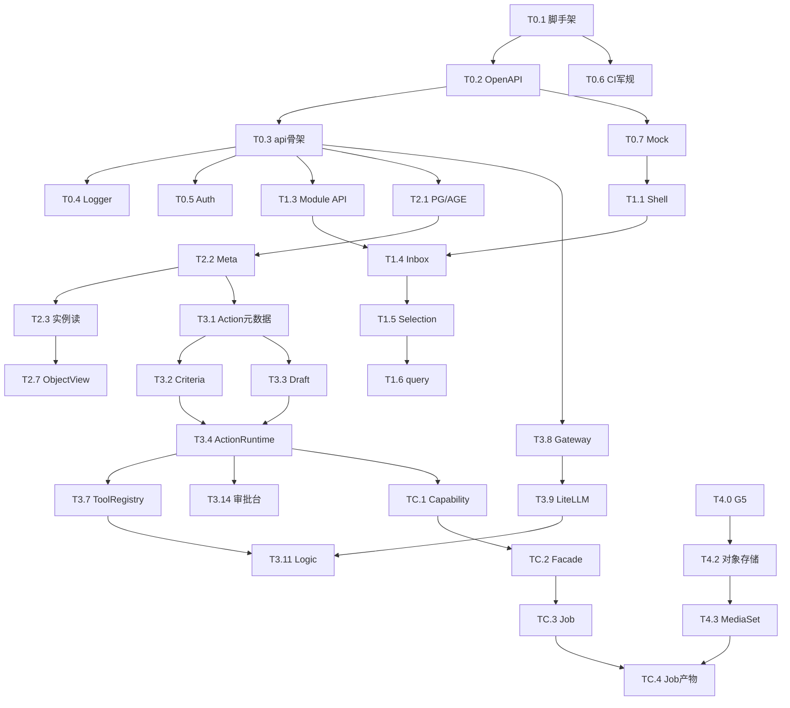

# 26 · AOS 目标态开发计划（单人版）

> **文档性质**：**可开工判定** + **全部开发任务细节** + **任务点依赖**（实现排期真源）  
> **版本**：v1.39 · 2026-07-17  
> **状态**：Wave-0～5 MVP ✅；G-ALIGN-01～08 ✅；**TX.2/3/4 ✅**；**Module PG ✅**；JWKS 形 ✅；**Dev Keycloak / HA 路径 ✅**；**OpenFGA 边车路径 ✅**；**Ferry skopeo archive 演练 ✅**；**T0.9/T0.10 ✅**；**syft/trivy 加严 ✅**；**Marking 继承+OpenFGA Facade ✅**；**Ferry 镜像层 ✅**；**字段级 Marking ✅**；**Ferry MVP ✅**；**S2 31 live**；进度 **§10**  
> **对齐**：[20](20-AOS整体技术方案.md) · [T-EVO](T-EVO-v0.1到目标态替换阶梯.md) · [00 索引](00-技术方案索引.md) · [23](23-AOS开源引用与交付军规.md) · [24](24-AOS客户侧前置组件安装SOP.md) · [07b](../07b-Capability-Adapter重能力接入.md) · [T-UI](T-UI-前端工程与foundry-html落地规范.md) · **[27 本机门禁记录](27-本机开发基础设施与工程门禁记录.md)**（G1～G5 活结果）  
> **不替代**：各 T0x / 07b 技术详稿（本文只定任务切分与先后）

---

## 使用的 Rules


| Rule   | 应用                  |
| ------ | ------------------- |
| 中文     | 全文中文                |
| 先方案后代码 | 方案齐；本文定**任务与依赖**    |
| 单人可执行  | 无「小组」编制；顺序以关键路径为准   |
| 契约优先   | 只经 `aos-api`（T-API） |
| 军规/前置  | 23/24 随里程碑加严        |
| 最小烟囱   | 无 DoD 不宣称 Wave 完成   |


---

## 0. 可以开干


| 问题                 | 答案                                         |
| ------------------ | ------------------------------------------ |
| 方案是否够实现？           | **是**（20 + T-API～T09 + 21～25 + 07b）        |
| 一人能否开干？            | **能**，严格按任务 ID 依赖；禁止跳过写路径先做数字人             |
| Capability / 重智能体？ | **Wave-C**，须 Action+Draft 绿；C1 还须 MediaSet |
| v0.1？              | **不推倒**；契约兼容 `/v1/buddy/ask`               |


### 0.1 开工门禁（一人自检）

> **用途：** 编码前勾选；**详稿本身已齐、你已阅过的不重写**，本节只把 20_tech 里「开干前必须钉死」的判定收成清单。  
> **依据真源：** [00 索引](00-技术方案索引.md) 阅读序 · [20](20-AOS整体技术方案.md) §9/§11 · [T-EVO](T-EVO-v0.1到目标态替换阶梯.md) M0 · [23](23-AOS开源引用与交付军规.md) · [24](24-AOS客户侧前置组件安装SOP.md) §4。

#### 0.1.1 总表


| ID      | 门禁（一句话）                                                                | 未过               |
| ------- | ---------------------------------------------------------------------- | ---------------- |
| **G0**  | 方案采纳：本文 **v1.3** + 20_tech 全集口径已确认                                     | **不开主干**         |
| **G0a** | 非目标 / 军规 / 话术红线已内化（见下表勾选）                                              | 不开写路径大功能         |
| **G1**  | 自有仓骨架：`aos-api` + `apps/web`（[T-UI](T-UI-前端工程与foundry-html落地规范.md) §3） | 不开               |
| **G2**  | OpenAPI 从 [T-API](T-API-aos-api稳定契约.md) 落仓（含 `/v1/buddy/ask`）          | 前端只用 Mock        |
| **G3**  | [23](23-AOS开源引用与交付军规.md)：CI 禁 UI 引上游 SDK + refs 不进编译                   | 不得合入污染依赖         |
| **G4**  | Logger（[T-CROSS](T-CROSS-横切能力详细技术方案.md) §3.2）进脚手架                      | Wave-1 起强制       |
| **G5**  | [24](24-AOS客户侧前置组件安装SOP.md) §4 Dev 缩小版前置（PG/对象存储等）                     | **最迟 Wave-4 前绿** |


**开干主干 = G0 + G0a + G1～G4 绿；G5 可推迟到做 L1/Media 前（与 T0.8 备忘联动）。**

#### 0.1.2 G0 · 方案采纳（文档层 · 一人勾选）

对照 [00](00-技术方案索引.md)「阅读与开工顺序」；**已阅且无异议打 ✅**（不要求再写新详稿）。


| ☐   | 文档                                                                       | 自检要点（来自方案，非新口径）                                                                            |
| --- | ------------------------------------------------------------------------ | ------------------------------------------------------------------------------------------ |
| ☐   | [20](20-AOS整体技术方案.md)                                                    | 层级 L1→L3+AIP+Apollo；契约只经 `aos-api`；v0.1 **不推倒**；§1.4 非目标（不凑 200+ Connector、不以 Dify 为永久内核等） |
| ☐   | [00 索引](00-技术方案索引.md)                                                    | 全集状态 ✅；关键已决（React、AGE、LiteLLM Facade、OCR 独立进程、Ferry 格式、Org/Project）                        |
| ☐   | [T-API](T-API-aos-api稳定契约.md)                                            | `/v1` 基线；错误体/`traceId`/`Idempotency-Key`；`**POST /v1/buddy/ask` 永久兼容**                     |
| ☐   | [T-CROSS](T-CROSS-横切能力详细技术方案.md)                                         | Bearer/OIDC；多租户 Org/Project；**§3.2** 开发 DEBUG / 生产 INFO；Audit/WARN+ 不可关                    |
| ☐   | [T-UI](T-UI-前端工程与foundry-html落地规范.md)                                    | React 18+TS 已决；蓝图真源 `foundry/html` **v1.6.5**；侧栏叙事不可改；Appearance `light/dark/system`       |
| ☐   | [T08](T08-Workshop工作台详细技术方案.md)                                          | Module/Inbox/Selection≤10；Marking；事件幂等；先 M1 可见                                             |
| ☐   | [T06](T06-Ontology与Action-Function详细技术方案.md)                             | Meta→读→Action/Draft 写；HR-02 发布门禁；AGE 已决                                                    |
| ☐   | [T07](T07-AIP人工智能平台详细技术方案.md) + [07b](../07b-Capability-Adapter重能力接入.md) | Studio=脑；重能力走 Capability **Wave-C**，不得早于 Action+Draft                                      |
| ☐   | [T05](T05-L1数据集成详细技术方案.md)                                               | P0 文件+MySQL+MediaSet；OCR 独立进程；供数对齐 Ontology                                                |
| ☐   | [T09](T09-Apollo交付引擎详细技术方案.md)                                           | 先 Lite；Ferry/Full 舰队按本文 **T5.6 延期**                                                        |
| ☐   | [T-EVO](T-EVO-v0.1到目标态替换阶梯.md)                                           | M0～M5 与本文 §7 对照；替换缝合件而非推倒                                                                  |
| ☐   | [21](21-AOS开源选型与功能清单.md) · [22](22-AOS开源产品维护清单.md)                       | 抄/不抄已决；P0 参考仓路径；`clone_aos_deps`；**不进客户包**                                                 |
| ☐   | [23](23-AOS开源引用与交付军规.md)                                                 | R-DIR / R-LIC / R-ARCH / R-INST；AGPL 服务端不进包；UI 只调 aos-api                                  |
| ☐   | [24](24-AOS客户侧前置组件安装SOP.md)                                              | 先客户前置后 AOS；Dev≈Prod 形状（§4）；现场装机最迟 Wave-4/5                                                 |
| ☐   | [25](25-LLM-Wiki启示与L2演进补丁.md)                                            | Insight Backfill / Constitution / 图谱健康：**知悉排期**（见本文 T2.9+ / T3.17），不挡 G0                   |
| ☐   | 本文 **26 v1.3**                                                           | §4 推荐总序；§6「现在不要干」；§11.2 显式延期不抢主路径                                                          |


**G0 通过条件：** 上表全部 ✅（或书面注明「跳过项 + 理由」，且不得与 §6 / 23 冲突）。

#### 0.1.3 G0a · 红线内化（开干前必答）


| ☐   | 红线             | 方案出处                 | 自检问句（答「是」才过）                                                       |
| --- | -------------- | -------------------- | ------------------------------------------------------------------ |
| ☐   | 业务进自有目录        | 20 · 23 R-DIR        | 默认合入 `aos-platform`（或约定自有仓），**不以**改 `dify/api` / 上游 monorepo 为主开发？ |
| ☐   | UI 不直连上游       | 23 R-ARCH-01 · T-UI  | `apps/web` **绝不** import LiteLLM/厂商 LLM/Airbyte/OpenFGA/Vault SDK？ |
| ☐   | 参考仓 ≠ 产品       | 20 · 21/22 · 23      | `mybuddy-v01` / `refs` 只参考，**不进**客户交付编译与镜像？                        |
| ☐   | 试用脑不扩张         | 23 R-ARCH-05 · T-EVO | 目标态新功能**不**扩大对 Dify/OpenOcta UI 依赖？                                |
| ☐   | 无 Draft 不自动写库  | T06 · 本文 §6          | 生产写回必经 Action/Draft（A-02）？                                         |
| ☐   | 重能力不进 Function | 07b CAP-01           | 短视频/数字人等走 Capability Adapter，**不**塞进 ≤60s Function？                |
| ☐   | 话术             | T-EVO §4             | 不因 RAG Chatbot 可用就宣称「已建成 Ontology/Workshop」？                       |


#### 0.1.4 G1～G5 · 工程门禁（对照任务）

> **主驾驶：** Agent（人只审 [27](27-本机开发基础设施与工程门禁记录.md) §1）。  
> **活结果真源：** [27](27-本机开发基础设施与工程门禁记录.md)（安装 / 探针 / 日志证据写在那里，不在本表重复粘贴）。  
> **2026-07-17：** G1～G5 **全部 ✅**（见 27 v0.2）。


| ID     | 依据                         | 自检要点                                                                                      | 对应任务                          | 状态  |
| ------ | -------------------------- | ----------------------------------------------------------------------------------------- | ----------------------------- | --- |
| **G1** | T-UI §3 · 20 仓结构           | 存在可 `build` 的 `aos-api` + `apps/web`；README 有启动命令；目录在自有仓非上游树内                             | **T0.1**                      | ✅   |
| **G2** | T-API 全文                   | 仓内 `openapi.yaml`（或生成物）路径表与 T-API 一致；含 `/v1/buddy/ask`；错误体字段约定一致                          | **T0.2**                      | ✅   |
| **G3** | 23 §3/§5                   | CI（可先 warn→error）：禁 UI 上游 SDK import；黑名单路径/refs 不进编译产物；故意违规样例能红                           | **T0.6**（**T0.10** SBOM 可后加严） | ✅   |
| **G4** | T-CROSS §3.2 · T-EVO §6.0  | 统一 Logger；请求带 `trace_id`；开发默认 debug、可配；禁裸 print 当生产日志；Audit 通道预留                          | **T0.4**                      | ✅   |
| **G5** | 24 §4 Dev 缩小版 · §2 Lite 矩阵 | 本机/Docker：**PostgreSQL** 可连；**对象存储**（MinIO 或 S3 兼容）经探针可通；缺口记 27；**不**把 MinIO Server 打进客户包 | **T0.8** → Wave-4 **T4.0**    | ✅   |


#### 0.1.5 与 Wave-0 关系

```text
G0 + G0a  ──(文档/红线)──►  允许开始 T0.1
G1～G4    ──(与 T0.1～T0.6 重叠)──►  Wave-0 退出前必须绿
G5        ──(可晚)──►  最迟进入 Wave-4 / Media 前绿
```

一人建议：先勾 **0.1.2 + 0.1.3**（今日可完成）→ 再开 **T0.1** 拿 G1 → 按 §3.0 单人序推进至 G2～G4。

---

## 1. 层级地图（仍有效）

```text
Apollo(T09)
  ↑
工作台 L3(T08) + 前端(T-UI)
  ↑
AIP(T07) + Capability(07b)*
  ↑
Ontology L2(T06)
  ↑
数据 L1(T05)
  ↑
横切 T-CROSS + 契约 T-API
```

 Capability 不得早于 L2 **写路径**（Action/Draft）。

UI 蓝图真源：`foundry/html` **v1.6.5**（含 Appearance）。

---

## 2. 任务编号约定


| 前缀       | Wave        | 含义              |
| -------- | ----------- | --------------- |
| **T0.*** | Wave-0      | 地基              |
| **T1.*** | Wave-1 / M1 | 工作台可见           |
| **T2.*** | Wave-2 / M2 | Ontology 读      |
| **T3.*** | Wave-3 / M3 | 写回 + AIP        |
| **TC.*** | Wave-C      | 重能力（增强，不挡主路径）   |
| **T4.*** | Wave-4 / M4 | L1 供数           |
| **T5.*** | Wave-5 / M5 | Apollo Lite     |
| **TX.*** | 横切常驻        | 贯穿多 Wave，随主任务带做 |


**依赖写法：** `依赖: T0.2, T0.4` = 所列任务均须 **DoD 完成** 后才能开工本任务。  
**单人穿插：** 标「可穿插」的任务，仅在**等待**（装环境、跑构建、等评审）时切入，**不可**打乱 §4 关键串行链。

---

## 3. 全部开发任务细节

### 3.0 Wave-0 · 地基


| ID        | 任务                        | 细节（做到什么）                                                                 | 依赖         | 产出 / DoD             |
| --------- | ------------------------- | ------------------------------------------------------------------------ | ---------- | -------------------- |
| **T0.1**  | 仓与脚手架                     | monorepo 或约定多仓；`aos-api`、`apps/web` 可 `build`；README 启动命令                | G0         | 空服务可本地启动             |
| **T0.2**  | OpenAPI 落仓                | 按 [T-API](T-API-aos-api稳定契约.md) 写/生成 `openapi.yaml`；含 `/v1/buddy/ask` 兼容 | T0.1       | 契约文件进仓；路径表与 T-API 一致 |
| **T0.3**  | aos-api 路由骨架              | 健康检查、统一错误体、`traceId`、Idempotency-Key 中间件占位                               | T0.2       | `GET /health` 绿      |
| **T0.4**  | Logger                    | T-CROSS §3.2：开发 DEBUG / 可配；Audit 通道预留                                    | T0.3       | 请求日志带 trace          |
| **T0.5**  | Auth 占位                   | Bearer 解析占位或 Dev token；Org/Project 上下文进 request                          | T0.3       | 受保护路由无 token 401     |
| **T0.6**  | 军规 CI 最小                  | 23：扫 UI 禁 import 上游 SDK；refs 不进编译（钩子可先 warn→error）                       | T0.1       | 故意违规样例 CI 红          |
| **T0.7**  | API Mock                  | 按契约返回与 html Demo 同构的 JSON（Module/Inbox 等）                                | T0.2       | `apps/web` 可脱后端点通壳   |
| **T0.8**  | Dev 数据面备忘                 | 记录 PG/AGE/对象存储是否本机或 Docker；对照 24 Lite 列缺口                                | —          | 文档一页；**不阻塞** T0 退出   |
| **T0.9**  | 开源参考仓对齐                   | 按 21/22 跑 `clone_aos_deps`（P0 OCR/MinIO 等）；记本地路径                         | T0.1       | P0 仓可浏览；不进客户包        |
| **T0.10** | SBOM 钩子                   | 23：生成/阻断策略最小（可先 warn）                                                    | T0.6       | 流水线有 SBOM 步骤         |
| **TX.1**  | Appearance Token 进 ui-kit | 从 demo.css 迁 `--aos-`*；React 主题 `light/dark/system`                      | T0.1       | 与 html v1.6.5 同键名    |
| **TX.2**  | 指标/Trace 最小               | T-CROSS 可观测：请求延迟计数；可选 OTel 出口                                            | T0.4       | 一 dashboard 或日志可聚合   |
| **TX.3**  | IdP 对接                    | Keycloak（或 Dev 等价）发真 JWT · **JWKS 形 ✅** [48](48-Module落PG与JWKS及OpenAPI深化方案.md) | T0.5       | 非 Dev token 可登录      |
| **TX.4**  | 授权 Marking 模型             | 角色/Marking 进上下文；供 T1.9/T08 · **MVP ✅** [47](47-技术方案全面对齐补缺方案.md)           | T0.5, TX.3 | API 可判无权限            |


**Wave-0 退出：** T0.1～T0.7 全绿（T0.8～T0.10 / TX.* 可穿插；**TX.4 建议 Wave-1 前完成**）。  
**2026-07-17 状态：** T0.1～T0.8 ✅（见 [27](27-本机开发基础设施与工程门禁记录.md) / [28](28-Wave-0全链路集成测试方案.md)）；T0.9/T0.10/TX.* 可穿插后补。

**单人建议序：** T0.1 → T0.2 → T0.3 → T0.4 → T0.5 → T0.6 → T0.7；（穿插）T0.9、T0.10、TX.1、T0.8、TX.2；Wave-1 前 TX.3→TX.4。

---

### 3.1 Wave-1 · M1 · 工作台看得见


| ID        | 任务                | 细节                                                | 依赖                 | DoD                          |
| --------- | ----------------- | ------------------------------------------------- | ------------------ | ---------------------------- |
| **T1.1**  | ui-kit + AppShell | 侧栏=DEMO_PAGES 叙事；顶栏；Appearance；路由骨架               | T0.7 或 T0.3+Mock   | 打开 Web 见壳                    |
| **T1.2**  | 迁「概览+应用列表」        | `index` / `workshop` 信息架构落地为路由页                   | T1.1               | 侧栏可进工作台                      |
| **T1.3**  | Module API        | `GET/POST /v1/modules`、`GET .../runtime`（可先内存/PG） | T0.3, T0.5         | 契约测绿                         |
| **T1.4**  | Inbox 运营台页        | 对齐 `workshop-module.html`：列表+筛选条                  | T1.1, T1.3（或 Mock） | 有数据可点                        |
| **T1.5**  | Selection ≤10     | 维数计数；超限禁加；驱动 object-sets/query                    | T1.4               | 超 10 维 UI 拒绝                 |
| **T1.6**  | object-sets/query | filters≤10、分页；接 Inbox                             | T1.3, T1.5         | 翻页/筛选可用                      |
| **T1.7**  | 发布入口壳             | 按钮→占位路由（不接真 Apollo）                               | T1.2               | 可点不报错                        |
| **T1.8**  | 护栏：Table 分页提示     | >1万示意/强制分页标记（可先 UI）                               | T1.4               | 蓝图行为可见                       |
| **T1.9**  | Widget Marking    | 无权限不挂载 Widget（T08 §3.3）                           | T1.4, T0.5         | 无 Marking 用户看不到受限区           |
| **T1.10** | 事件幂等              | 按钮/`idempotencyKey` 与 ACT-07 同源                   | T1.4               | 连点一次成功                       |
| **T1.11** | 画布编辑最小            | `workshop-canvas`：Layout 树+一页预览                   | T1.3               | 可打开构建态                       |
| **T1.12** | Buddy 嵌入壳         | `workshop-aip-chat`；Context=Selection；先 Mock chat | T1.5               | 芯片带 Selection；真 chat 待 T3.18 |


**Wave-1 退出：** Inbox + Selection + Marking/幂等护栏可演示。≈ T-EVO **v0.3**。  
**2026-07-17：** Wave-1 **全部 T1.1～T1.12 编码✅ 自测✅**（见 §10.3 · [29](29-Wave-1全链路集成测试方案.md)）。

**单人建议序：** T1.1 → T1.2 → T1.3 → T1.4 → T1.5 → T1.6 → T1.9 → T1.10 → T1.7 → T1.8 → T1.11 → T1.12。  
**可穿插：** 等 API 时先做 T1.1/T1.2（打 Mock）。

---

### 3.2 Wave-2 · M2 · Ontology 可读


| ID        | 任务                   | 细节                                          | 依赖               | DoD                        |
| --------- | -------------------- | ------------------------------------------- | ---------------- | -------------------------- |
| **T2.1**  | PG + AGE 就绪          | 本地/Dev 库；AGE 扩展可用                           | T0.8 或等价         | 可跑简单 Cypher/AGE            |
| **T2.2**  | Meta Store           | Object/Link/Property 类型 CRUD；发布门禁占位         | T0.3, T2.1       | 至少 1 个 Object Type         |
| **T2.3**  | 实例读 API              | `GET /v1/objects/{type}` · `/{id}`          | T2.2             | 列表+详情                      |
| **T2.4**  | Graph 读最小            | 1-hop 邻居或固定示例图                              | T2.2, T2.3       | Object View 可展一层           |
| **T2.5**  | Wiki 只读              | `GET /v1/wiki/...` 结构化字段                    | T2.3             | 字段非空可展                     |
| **T2.6**  | Funnel 状态只读          | 四阶段展示 API+页                                 | T2.2             | 状态条可见                      |
| **T2.7**  | Object View 页        | 对齐 `workshop-object-view`；接真 Object         | T1.1, T2.3, T2.4 | 「点到真对象」                    |
| **T2.8**  | Inbox 绑真 Object      | Selection → 真 query（替 Mock）                 | T1.6, T2.3       | 工作台读真数                     |
| **T2.9**  | Constitution Lint 子集 | OKF `constitution/` 校验；失败不可 Publish（25/T06） | T2.2             | Lint 红不可发                  |
| **T2.10** | 图谱健康只读               | GH 指标扫描+页（≠ L1 health）                      | T2.3, T2.4       | `ontology-graph-health` 有数 |
| **T2.11** | Branch 只读            | 分支列表/切换查看（写合并后置）                            | T2.2             | 分支页可打开                     |


**Wave-2 退出：** 1 个 Object Type 只读闭环 + Constitution Lint 子集。≈ **v0.2～v0.3**。

**单人建议序：** T2.1 → T2.2 → T2.3 → T2.5 → T2.4 → T2.6 → T2.9 → T2.7 → T2.8 → T2.10 → T2.11。  
**禁止：** 无 Schema 盲写；一上来 Nebula；向量库冒充 Ontology。

---

### 3.3 Wave-3 · M3 · 写回 + AIP（顺序强制）

> **硬规则：** 未完成 **T3.1～T3.3**，不得宣称 Logic「可写生产」。


| ID        | 任务                       | 细节                                          | 依赖               | DoD                 |
| --------- | ------------------------ | ------------------------------------------- | ---------------- | ------------------- |
| **T3.1**  | Action Type 元数据          | Action 定义、参数、权限声明                           | T2.2             | 可配置 1 个 Action      |
| **T3.2**  | Submission Criteria      | 不可空声明；校验引擎最小                                | T3.1             | 不满足则拒写              |
| **T3.3**  | Draft Dataset            | 与生产隔离；CRUD drafts                           | T3.1, T0.5       | 提案可存可列              |
| **T3.4**  | Action Runtime 执行        | 批准后写 Object；幂等键                             | T3.2, T3.3, T2.3 | 批准→落库               |
| **T3.5**  | Side Effect / Webhook 骨架 | 声明式；失败重试/DLQ 占位（ACT-10）                     | T3.4             | 可挂 1 个回调 URL        |
| **T3.6**  | Function Runtime         | TS/Python 二选一先落地；**≤60s/2GB** 强制杀           | T2.2             | 超时可证                |
| **T3.7**  | Tool Registry            | Query / Function / Action / Wiki；写必落 Action | T3.4, T3.6, T2.5 | Agent 只「请求」工具       |
| **T3.8**  | Model Gateway Facade     | 仅 `/v1/aip/`*；插件注册表                         | T0.3, T0.5       | UI 不直连厂商            |
| **T3.9**  | LiteLLM 边车               | 进程隔离；密钥 Vault ref                           | T3.8             | chat 通 1 个 Provider |
| **T3.10** | 预热 + 路由策略                | 冷模型状态；任务类型路由最小                              | T3.9             | UI 可见预热/就绪          |
| **T3.11** | Logic Runtime            | 图执行；**试跑 dryRun 不落库**（A-07）                 | T3.7, T3.8       | 试跑出提议 edits         |
| **T3.12** | Logic 画布页                | 对齐 `aip-logic.html` 三栏最小                    | T1.1, T3.11      | 可跑通示例图              |
| **T3.13** | Chatbot Studio 最小        | 绑 Tool；试对话                                  | T3.7, T3.9       | 一轮工具调用可复盘           |
| **T3.14** | Draft 审批台页               | 批准/拒绝 → T3.4                                | T3.3, T3.4       | HITL 闭环             |
| **T3.15** | Decision Lineage         | 读→模型→工具→输出；熔断事件位                            | T3.11            | 一条谱系可打开             |
| **T3.16** | Evals 门控                 | 未绿不可勾 L4                                    | T3.11            | L4 开关受控             |
| **T3.17** | Insight Backfill 最小      | 高置信→Draft→Insight（25）；可后置本 Wave 末           | T3.14, T2.5      | 1 条 Backfill 可演示    |
| **T3.18** | buddy/ask 切 Facade       | 桌面/Web 走 aos-api，上游可仍 Dify Adapter          | T3.8, T3.9       | 试用路径不破              |
| **T3.19** | L4 熔断                    | 失败率>5% 降 L3；入 Lineage（T07）                  | T3.15, T3.16     | 可演练降级               |
| **T3.20** | Ontology Edits 合并        | 多 Logic 并发字段冲突策略（07 §3.5.1）                 | T3.4, T3.11      | 同字段冲突不静默盖           |
| **T3.21** | Wiki 提议写                 | PUT 仅经 Action/Draft，禁直写（WIKI）               | T3.4, T2.5       | 提议可审可落              |


**Wave-3 退出：** Draft 批准 → Object 变更 + Lineage + L4 门控/熔断位。≈ **v0.4**。

**单人强制序（关键链）：**  
`T3.1 → T3.2 → T3.3 → T3.4 → T3.7`（中段可穿插 T3.6）  
同时段可穿插：`T3.8 → T3.9 → T3.10`  
然后：`T3.11 → T3.12 → T3.14 → T3.15 → T3.16 → T3.19`；`T3.5/13/17/18/20/21` 收尾穿插。

---

### 3.4 Wave-C · Capability（增强 · 不挡 M4/M5 主退出）


| ID       | 任务                  | 细节                                  | 依赖             | DoD           |
| -------- | ------------------- | ----------------------------------- | -------------- | ------------- |
| **TC.1** | Capability Registry | Manifest；kind=sync                  | job            | session       |
| **TC.2** | Facade API          | `/v1/aip/capabilities`*；禁 UI 直连 SDK | TC.1, T3.8     | 契约测绿          |
| **TC.3** | Job 状态机             | submit/status/cancel/artifact；回调验签  | TC.2, T3.5     | 1 Job 跑完      |
| **TC.4** | Job→MediaSet        | 产物 RID 经 **Action** 写入              | TC.3, **T4.3** | Media 可打开     |
| **TC.5** | C0 稿件 sync          | LiveScript Object + Action          | TC.2, T3.4     | 稿件落 Object    |
| **TC.6** | Session 网关          | open/push/close；AV 外置               | TC.2, T3.4     | 场次 Object 状态对 |
| **TC.7** | 工具面板挂 Capability    | Call Capability                     | TC.2, T3.7     | Studio 可调     |


**最早：** T3.4 绿后可做 TC.1～TC.2。  
**C1 成片：** 必须 **T4.3 MediaSet MVP** 后做 TC.4。  
**禁止：** GPU/数字人进 Function 沙箱。

---

### 3.5 Wave-4 · M4 · L1 供数


| ID        | 任务                | 细节                                              | 依赖                | DoD                  |
| --------- | ----------------- | ----------------------------------------------- | ----------------- | -------------------- |
| **T4.0**  | G5 闭环             | 24 Lite Dev 总检绿或书面豁免                            | G5                | 检查表勾完                |
| **T4.1**  | Connector 插件框架    | 注册/配置/运行接口；禁把 Airbyte monorepo 当产品              | T0.3, T0.5        | 可装「空插件」              |
| **T4.2**  | 对象存储适配            | S3/MinIO；客户前置优先（23/24）                          | T4.0              | 可 put/get            |
| **T4.3**  | MediaSet MVP      | 创建/列表/预览；RID                                    | T4.2              | 上传文件可见               |
| **T4.4**  | 文件 P0 接入          | 格式按 20 §1.4；进 MediaSet/Dataset                  | T4.1, T4.3        | P0 格式抽检过             |
| **T4.5**  | Pipeline 最小       | 跑通「文件→Dataset」一条                                | T4.4              | Build 成功             |
| **T4.6**  | JDBC/MySQL        | 抽数+映射                                           | T4.1, T2.2        | MySQL→Object/Dataset |
| **T4.7**  | Dataset→Object 映射 | 防两张皮                                            | T4.5 或 T4.6, T2.2 | 供数可被 T2.3 读到         |
| **T4.8**  | OCR 边车            | PaddleOCR 独立进程                                  | T4.4              | 一页 OCR 结果入链路         |
| **T4.9**  | DLQ               | 失败可见、可重试（含 DocIntel）                            | T4.5              | 死信列表页                |
| **T4.10** | 其它连接器滚动           | 不挡退出；维护 21/T05 §3.3 清单                          | T4.1              | 按客户加，非必达             |
| **T4.11** | <128KB 存储短路       | sync-routing：小文件可进 Dataset                      | T4.1, T4.3        | 选项可用（T05 A3）         |
| **T4.12** | MediaReference    | Dataset 列→原件指针+预览                               | T4.3, T4.5        | 单元格可点开原件             |
| **T4.13** | Schedule          | Cron / 上游触发与 Sync 对齐                            | T4.5              | 一条定时跑通               |
| **T4.14** | Builds 可观测        | Task 状态·日志·失败钻取                                 | T4.5              | builds 页可用           |
| **T4.15** | 边缘 Agent 最小       | 出站上报/拉配置（WF-DC-05）                              | T4.1              | 一节点 Probe            |
| **T4.16** | Funnel Worker 最小  | Changelog→Merge→Index→Hydration 可观测（≠ Backfill） | T4.7, T2.6        | 四阶段有进度               |
| **T4.17** | DocIntel 管线       | 解析/OCR/抽取；失败进 DLQ                               | T4.8, T4.9        | 单文件失败不卡批             |


**Wave-4 退出：** 文件 P0 + MySQL + MediaSet + 128KB/MediaReference/Schedule/DLQ。≈ **v0.5**。

**单人建议序：** T4.0 → T4.1 → T4.2 → T4.3 → T4.4 → T4.5 → T4.14 → T4.13 → T4.7 → T4.11 → T4.12 → T4.6 → T4.8 → T4.17 → T4.9 → T4.16 → T4.15。

---

### 3.6 Wave-5 · M5 · Apollo Lite


| ID       | 任务                           | 细节                                     | 依赖                     | DoD             |
| -------- | ---------------------------- | -------------------------------------- | ---------------------- | --------------- |
| **T5.1** | 可安装构建                        | 版本号、产物包                                | Wave-3 或 Wave-4 主路径可演示 | 一键/文档可装 Dev     |
| **T5.2** | Spoke Probe                  | 版本/心跳上报                                | T5.1                   | Hub 或本地可见 Probe |
| **T5.3** | Lite 升级通道                    | Catalog + 升级                           | T5.2                   | 一次升级演练          |
| **T5.4** | Vault ref                    | 配置无明文密钥                                | T5.1, T0.5             | 密钥只 ref         |
| **T5.5** | 现场 24 签署流程                   | 检查表+禁止无签安装                             | T4.0, T5.3             | 流程文档可执行         |
| **T5.6** | Ferry / Full 舰队 / Channel 全集 | **MVP+镜像层 ✅**；**Channel/Spoke 目录 ✅** [66]；**Release/Change UI ✅** [67](67-Apollo-Change与Release通道UI方案.md)；Full **运行时**仍后置 | — | 缺签拒导 · 目录+UI 可演示 |
| **T5.7** | Asset Bundle 最小              | OKF/Module 与版本同绑（OPS-008 · T09 **P0**） | T5.3, T2.9             | 一次打包+校验         |
| **T5.8** | hotfix 通道占位                  | 紧急发布标记+事后审计位（OPS-009）                  | T5.3                   | 可标记 hotfix      |


≈ T-EVO **v1.0**（Lite + Asset Bundle；Ferry 仍延期）。

---

## 4. 单人推荐总序（照着做）

```text
【地基】
T0.1 → T0.2 → T0.3 → T0.4 → T0.5 → T0.6 → T0.7
        └─(穿插) TX.1, T0.8

【工作台】
T1.1 → T1.2 → T1.3 → T1.4 → T1.5 → T1.6 → T1.7 → T1.8

【本体读】
T2.1 → T2.2 → T2.3 → T2.5 → T2.4 → T2.6 → T2.7 → T2.8

【写回 · 不可跳】
T3.1 → T3.2 → T3.3 → T3.4 → T3.6 → T3.7
【网关 · 可在等 T3.1～3 时穿插】
T3.8 → T3.9 → T3.10
【编排与治理】
T3.11 → T3.12 → T3.14 → T3.15 → T3.16
        └─ T3.5, T3.13, T3.17, T3.18

【L1】
T4.0 → T4.1 → T4.2 → T4.3 → T4.4 → T4.5 → T4.7 → T4.6 → T4.8 → T4.9

【重能力 · 可选增强】
T3.4 后: TC.1 → TC.2 → TC.5
T4.3 后: TC.3 → TC.4 → TC.7
更后: TC.6

【交付】
T5.1 → T5.2 → T5.3 → T5.4 → T5.7 → T5.8 → T5.5
```

### 4.1 依赖总图（关键边）




### 4.2 绝对不能反的串行链

```text
契约/api → Auth/Logger → Meta读 → Action/Draft写 → Logic真写回 / Capability回调写
```

---

## 5. Wave 进出检查（一人勾选）


| Wave | 进入                | 退出勾选                       |
| ---- | ----------------- | -------------------------- |
| 0    | G0+G0a+G1～G4      | ☐ T0.1～T0.7                |
| 1    | Wave-0            | ☐ Inbox+Selection 可演示      |
| 2    | T2.1              | ☐ 1 个 Object Type 只读闭环     |
| 3    | T2.2 + Vault/密钥方案 | ☐ Draft 批准落库 + Lineage     |
| C    | T3.4；（C1）T4.3     | ☐ 1 Job 或 1 Session 按 07b  |
| 4    | T4.0              | ☐ 文件 P0 + MySQL + MediaSet |
| 5    | 可演示主路径            | ☐ Lite 升级 + 24 签署流程        |


---

## 6. 现在不要干


| 事项                       | 原因           |
| ------------------------ | ------------ |
| Dify 内核堆 Ontology        | 20 非目标 · 23  |
| UI 直连 LiteLLM/厂商         | R-ARCH-01    |
| 无 Draft 自动写库             | A-02         |
| 先 Full Apollo/Ferry      | T5.6 延期      |
| 凑 200+ Connector         | 20 §1.4      |
| 数字人/短视频进 Function        | CAP-01       |
| 跳过 T3.1～T3.4 做 Logic 写生产 | 写路径必经 Action |


---

## 7. 与 T-EVO / 里程碑对照


| Wave | 里程碑 | 用户可见          | 主详稿                  |
| ---- | --- | ------------- | -------------------- |
| 0    | M0  | —             | T-API · T-CROSS · 23 |
| 1    | M1  | ≈ v0.3 工作台    | T-UI · T08           |
| 2    | M2  | ≈ v0.2 Object | T06                  |
| 3    | M3  | ≈ v0.4 Draft  | T06 · T07 · 25       |
| C    | 增强  | 重能力           | 07b                  |
| 4    | M4  | ≈ v0.5 L1     | T05 · 24             |
| 5    | M5  | ≈ v1.0 Lite   | T09 · 24             |


---

## 8. 风险（单人向）


| ID  | 风险                | 缓解                                |
| --- | ----------------- | --------------------------------- |
| E1  | 前后端互相等            | 先 T0.7 Mock，UI 不阻塞                |
| E2  | 先做 AIP 导致直写       | 无 T3.4 不接生产写                      |
| E3  | L1 与 Ontology 两张皮 | **T4.7** 为 Wave-4 必达              |
| E4  | 重能力分心             | TC.* 仅主路径阻塞或演示需要时做                |
| E5  | 开源污染包             | T0.6 尽早 error 级                   |
| E6  | 一人范围膨胀            | 每 Wave 只盯「退出勾选」；T4.10/T5.6 永不抢主路径 |


---

## 9. 文档落点


| 项   | 路径                                                      |
| --- | ------------------------------------------------------- |
| 本计划 | `docs/palantier/20_tech/26-AOS目标态开发计划.md`               |
| 阶梯  | [T-EVO](T-EVO-v0.1到目标态替换阶梯.md)                          |
| 契约  | [T-API](T-API-aos-api稳定契约.md)                           |
| UI  | [T-UI](T-UI-前端工程与foundry-html落地规范.md) · html **v1.6.5** |


个人进度：以本文 **§10** + **[31 波次台账](31-波次交付结果台账.md)** 为准；聊天摘要须与台账一致。

---

## 10. 任务进度看板（编码 / 自测）

> **图例：** ✅ 完成 · 🔄 进行中 · ☐ 未开始 · ⚠ 有阻塞但已绕行  
> **规则：** 阻塞写入 §10.1，**不停止**后续可并行任务。

### 10.1 阻塞项（不停开发）


| ID                    | 阻塞                                                   | 影响任务           | 绕行 / 状态                                                            | 是否停编码 |
| --------------------- | ---------------------------------------------------- | -------------- | ------------------------------------------------------------------ | ----- |
| **B-AGE-01**          | `postgres:16-alpine` **无** AGE 扩展（`age.control` 不存在） | T2.1 原口径       | 用 `graph_edge` 邻接表做 1-hop；真 AGE 镜像后补换                              | **否** |
| **B-WSL-HOSTPORT-01** | Windows 访问 `127.0.0.1:5433/9000` 偶发拒绝（Docker 在 WSL）  | G5 / 本机联调      | 用 `wsl hostname -I` 首 IP 作 `AOS_DATABASE_URL`；LLM 边车用 host 模式脚本    | **否** |
| **B-LITELLM-IMG-01**  | 官方 `litellm[proxy]` 镜像/重依赖构建过慢或不可达                   | T3.9           | Dev 用 **LiteLLM 契约形** 进程隔离边车（`deploy/dev/litellm`）；可换官方镜像不改 Facade | **否** |
| **B-TX3-01**          | 生产 HA Keycloak 未装（可选）                              | TX.3 深度 | **✅ 关闭（Dev）**：[50] 单机 · [57](57-Dev-HA-Keycloak缓解B-TX3方案.md) 双节点+JWKS 故障切换；生产联调规程 [60](60-生产IdP联调手册.md)（IdP 仍客户自备） | **否** |
| **B-T09-01**          | P0 参考仓 clone / SBOM CI 未跑                            | T0.9 / T0.10   | **✅ 关闭**（[51](51-T0.9参考仓与T0.10-SBOM钩子方案.md) · inventory + sbom gate） | **否** |
| **B-OCR-PADDLE-01**   | 真 `paddleocr` 全量依赖未装入 Dev 边车                       | T4.8 深度       | 边车 shaped ✅；装 paddle 后 `engine=paddleocr` 自动升                    | **否** |
| **G-ALIGN-01**        | Word/Excel/PDF 文本解析插件（已关闭）                   | T4.4 / T05-A1  | **T4.4b ✅** · [39](39-T4.4b-文件解析插件方案.md)                         | **否** |


### 10.2 Wave-0


| ID    | 编码完成 | 自测完成 | 证据                                   |
| ----- | ---- | ---- | ------------------------------------ |
| T0.1  | ✅    | ✅    | `aos-platform` 可启动                   |
| T0.2  | ✅    | ✅    | `packages/contracts/openapi/v1.yaml` |
| T0.3  | ✅    | ✅    | pytest health/errors                 |
| T0.4  | ✅    | ✅    | JSON 日志含 `service`/`trace_id`        |
| T0.5  | ✅    | ✅    | 401 /me · Bearer dev                 |
| T0.6  | ✅    | ✅    | CI 脚本 + ExpectFail                   |
| T0.7  | ✅    | ✅    | modules / object-sets Mock           |
| T0.8  | ✅    | ✅    | [27](27-本机开发基础设施与工程门禁记录.md) §3.5     |
| T0.9  | ✅    | ✅    | P0 inventory · [51](51-T0.9参考仓与T0.10-SBOM钩子方案.md) |
| T0.10 | ✅    | ✅    | SBOM + gate · [51](51-T0.9参考仓与T0.10-SBOM钩子方案.md) |
| TX.1  | ✅    | ✅    | Appearance + tokens                  |
| TX.2  | ✅    | ✅    | `/v1/metrics` · RED · traceparent · [44](44-TX.2-指标Trace最小方案.md) |
| TX.3  | ✅    | ✅    | Dev JWT · JWKS · Dev KC [50] · **HA Dev [57]** · **生产手册 [60](60-生产IdP联调手册.md)** · [41]/[48] |
| TX.4  | ✅    | ✅    | 对象+字段+**继承/OpenFGA Facade** · [52](52-TX.4字段级Marking-MVP方案.md)/[55](55-TX.4-Marking继承与OpenFGA-Facade方案.md) |


### 10.3 Wave-1


| ID    | 编码完成 | 自测完成 | 证据                           |
| ----- | ---- | ---- | ---------------------------- |
| T1.1  | ✅    | ✅    | AppShell · vitest appearance |
| T1.2  | ✅    | ✅    | Overview / WorkshopList      |
| T1.3  | ✅    | ✅    | API modules + pytest         |
| T1.4  | ✅    | ✅    | InboxPage                    |
| T1.5  | ✅    | ✅    | selection.test.ts            |
| T1.6  | ✅    | ✅    | object-sets + Inbox          |
| T1.7  | ✅    | ✅    | PublishPage                  |
| T1.8  | ✅    | ✅    | paginationGuard · wave1.test |
| T1.9  | ✅    | ✅    | marking.test.ts              |
| T1.10 | ✅    | ✅    | 幂等发布 + API idempotency       |
| T1.11 | ✅    | ✅    | CanvasPage · layoutNodeCount |
| T1.12 | ✅    | ✅    | BuddyPage + chips            |


**Wave-1 退出：** ✅（集成方案 [29](29-Wave-1全链路集成测试方案.md)）

### 10.4 Wave-2


| ID    | 编码完成 | 自测完成 | 证据                              |
| ----- | ---- | ---- | ------------------------------- |
| T2.1  | ⚠    | ✅    | PG ✅；AGE 绕行邻接表（B-AGE-01）        |
| T2.2  | ✅    | ✅    | Meta Store + pytest             |
| T2.3  | ✅    | ✅    | `/v1/objects/{type}`            |
| T2.4  | ⚠    | ✅    | neighbors adjacency             |
| T2.5  | ✅    | ✅    | wiki                            |
| T2.6  | ✅    | ✅    | funnel status                   |
| T2.7  | ✅    | ✅    | OntologyPage（详情+邻居+健康+分支）       |
| T2.8  | ✅    | ✅    | object-sets `source=pg` + Inbox |
| T2.9  | ✅    | ✅    | constitution lint + 发布门禁        |
| T2.10 | ✅    | ✅    | `/v1/ontology/graph-health`     |
| T2.11 | ✅    | ✅    | `/v1/ontology/branches` + UI 切换 |


**Wave-2 退出：** ✅（集成 [30](30-Wave-2全链路集成测试方案.md) · smoke 脚本绿）

### 10.5 Wave-3


| ID    | 编码完成 | 自测完成 | 证据                                                                              |
| ----- | ---- | ---- | ------------------------------------------------------------------------------- |
| T3.1  | ✅    | ✅    | `/v1/actions/types`                                                             |
| T3.2  | ✅    | ✅    | `/v1/actions/validate` + submission.py                                          |
| T3.3  | ✅    | ✅    | `/v1/aip/drafts` · DraftInboxPage · 不写生产                                        |
| T3.4  | ✅    | ✅    | `POST .../approve` → obj_instance + 幂等                                          |
| T3.5  | ✅    | ✅    | `/v1/actions/webhooks` 骨架                                                       |
| T3.6  | ✅    | ✅    | `/v1/functions/invoke` · ≤60s 杀（408）                                            |
| T3.7  | ✅    | ✅    | `/v1/aip/tools`                                                                 |
| T3.8  | ✅    | ✅    | `/v1/aip/`* Facade                                                              |
| T3.9  | ✅    | ✅    | LiteLLM 形边车进程隔离 · `llm_gateway` · vault ref；见 [33](33-T3.9-LiteLLM边车去stub方案.md) |
| T3.10 | ✅    | ✅    | `/v1/aip/models/warmup`                                                         |
| T3.11 | ✅    | ✅    | logic dryRun 不落库                                                                |
| T3.12 | ✅    | ✅    | LogicPage UI                                                                    |
| T3.13 | ✅    | ✅    | StudioPage + toolCalls                                                          |
| T3.14 | ✅    | ✅    | DraftInbox 批准按钮                                                                 |
| T3.15 | ✅    | ✅    | `decision_lineage` + GET                                                        |
| T3.16 | ✅    | ✅    | `/v1/aip/evals/*`                                                               |
| T3.17 | ✅    | ✅    | `/v1/aip/insights/backfill`                                                     |
| T3.18 | ✅    | ✅    | buddy/ask → Facade                                                              |
| T3.19 | ✅    | ✅    | circuit trip/reset · chat 503                                                   |
| T3.20 | ✅    | ✅    | 冲突字段 409，须 `X-Allow-Conflicts`                                                  |
| T3.21 | ✅    | ✅    | Wiki PUT 409 → 仅 Draft/Action                                                   |


**Wave-3 退出：** ✅（集成 [32](32-Wave-3全链路集成测试方案.md)）

### 10.5b Wave-C


| ID   | 编码完成 | 自测完成 | 证据                                     |
| ---- | ---- | ---- | -------------------------------------- |
| TC.1 | ✅    | ✅    | Capability Registry                    |
| TC.2 | ✅    | ✅    | `/v1/aip/capabilities`*                |
| TC.3 | ✅    | ✅    | submit/status Job（同步 mock succeed）     |
| TC.4 | ⚠    | ✅    | artifact rid 返回；真 Media 落库依赖 T4.3 元数据面 |
| TC.5 | ✅    | ✅    | sync manuscript                        |
| TC.6 | ✅    | ✅    | session open（AV 外置声明）                  |
| TC.7 | ✅    | ✅    | CapabilityPage 可调                      |


**Wave-C：** ✅ MVP（不挡主路径）

### 10.5c Wave-4


| ID    | 编码完成 | 自测完成 | 证据                                                                                         |
| ----- | ---- | ---- | ------------------------------------------------------------------------------------------ |
| T4.0  | ✅    | ✅    | G5 见 [27](27-本机开发基础设施与工程门禁记录.md)                                                           |
| T4.1  | ✅    | ✅    | `/v1/sources` 插件注册                                                                         |
| T4.2  | ✅    | ✅    | MinIO 真 put/get · `/v1/object-store/health` · content 往返（[35](35-T4.2-MinIO真put-get方案.md)） |
| T4.3  | ✅    | ✅    | MediaSet create/list/get                                                                   |
| T4.4 | ✅ | ✅ | 文件→MediaSet/pipeline + **T4.4b 解析**（txt/md/csv/docx/xlsx/pdf）· [39](39-T4.4b-文件解析插件方案.md) · G-ALIGN-01 关闭 |
| T4.5  | ✅    | ✅    | Build SUCCEEDED                                                                            |
| T4.6  | ✅    | ✅    | PyMySQL live probe/ingest · [36](36-T4.6-MySQL去stub方案.md) · `aos-dev-mysql:3307`           |
| T4.7  | ✅    | ✅    | MySQL 行 → `obj_instance` 映射（ingest）                                                        |
| T4.8  | ✅    | ✅    | OCR 边车 · [37](37-T4.8-OCR边车去stub方案.md) · `sidecar=ocr`（shaped；真 paddle 可选）                 |
| T4.9  | ✅    | ✅    | DLQ list/push/retry · DataPage                                                             |
| T4.10 | ⚪    | —    | 滚动连接器（§11.2）                                                                               |
| T4.11 | ✅    | ✅    | sync-routing <128KB                                                                        |
| T4.12 | ✅    | ✅    | MediaReference                                                                             |
| T4.13 | ✅    | ✅    | schedules                                                                                  |
| T4.14 | ✅    | ✅    | builds 列表                                                                                  |
| T4.15 | ✅    | ✅    | edge agent probe                                                                           |
| T4.16 | ✅    | ✅    | funnel worker 四阶段                                                                          |
| T4.17 | ✅    | ✅    | DocIntel 失败入 DLQ 不卡批                                                                       |


**Wave-4 退出：** ✅ **MVP 契约面**（T4.2/T4.4b/T4.6/T4.7/T4.8 ✅）

### 10.5d Wave-5


| ID   | 编码完成 | 自测完成 | 证据                                    |
| ---- | ---- | ---- | ------------------------------------- |
| T5.1 | ⚠    | ✅    | Dev 可跑文档+compose；正式安装包后置              |
| T5.2 | ✅    | ✅    | spoke probe                           |
| T5.3 | ✅    | ✅    | `/v1/apollo/upgrade`                  |
| T5.4 | ✅    | ✅    | vault refs only                       |
| T5.5 | ⚪    | —    | 流程见 [24](24-AOS客户侧前置组件安装SOP.md)（签署现场） |
| T5.6 | ✅    | ✅    | **MVP+镜像层** [53](53-T5.6-Ferry气隙MVP方案.md)/[56](56-T5.6-Ferry镜像层Skopeo-cosign方案.md) |
| T5.7 | ✅    | ✅    | Asset Bundle validate                 |
| T5.8 | ✅    | ✅    | hotfix 标记位                            |


**Wave-5 退出：** ✅ Lite MVP；**Ferry MVP+镜像层 ✅**（真 skopeo archive / Full 仍后置）

### 10.6 测试覆盖审计（2026-07-17）


| 层            | 状态  | 数量 / 入口                                                              |
| ------------ | --- | -------------------------------------------------------------------- |
| API 单测       | ✅   | **56 相关绿**（OCR +4；偶发 object-sets 计数污染 2 条与 OCR 无关）                   |
| Web 单测       | ✅   | **11** + build OK                                                    |
| 自动集成冒烟       | ✅   | `run-integration-smoke.ps1`（approve/lineage/logic/chat/media/apollo） |
| Wave 集成方案 MD | ✅   | 28/29/30/**32**；总账 [31](31-波次交付结果台账.md)                              |


**曾遗漏（已补）：** 波次结果落档 31；Wave-3+ 写生产/熔断/冲突；C/4/5 契约面。

### 10.7 与 §11 实现对齐摘要


| 类别                                    | 状态                                                            |
| ------------------------------------- | ------------------------------------------------------------- |
| 文档挂点（§11.1）                           | ✅ 无漏挂任务 ID                                                    |
| 显式延期（§11.2）                           | ⚪ 含 T4.10 · Full Channel；**Ferry 镜像层+skopeo 演练 ✅** [56]/[59]（大镜像策略客户自配） |
| 实现死角                                  | **无未标注缺口**；⚠=MVP stub；OCR shaped 非生产 GPU |
| TX.2 指标 / TX.3 真 IdP / TX.4 真 Marking | **TX.2 ✅** · TX.3 Dev KC+**HA ✅**（[57]；**B-TX3-01 关**）· **生产联调手册 ✅**（[60]）· **TX.4 ✅**（[55]）· **OpenFGA 模型 ✅**（[61]）· **对象级 JWT∪bearer ✅**（[63]）· **字段级 JWT∪bearer ✅**（[65](65-字段级Marking与FGA-bearer方案.md)） |
| T0.9/T0.10 SBOM/军规扫描                  | **✅** · [51](51-T0.9参考仓与T0.10-SBOM钩子方案.md)；**syft/trivy ✅** [54](54-syft-trivy-SBOM加严方案.md)；**B-T09-01 关闭** |


---

## 11. 与 20_tech 对齐审计（v1.2）

### 11.1 文档覆盖（有无挂上）


| 20_tech 文档 | 26 中落点                                | 结论                                                   |
| ---------- | ------------------------------------- | ---------------------------------------------------- |
| 20 总纲      | 门禁·层级·非目标                             | ✅                                                    |
| T-API      | T0.2～T0.3 · 各 Wave API                | ✅                                                    |
| T-CROSS    | T0.4/5 · TX.2～TX.4                    | ✅（v1.2 补齐 IdP/Marking/指标）                            |
| T-UI       | T1.1 · TX.1 Appearance                | ✅                                                    |
| T08        | T1.* · T1.9～T1.12                     | ✅（v1.2 补 Marking/幂等/Canvas/Buddy）                    |
| T06        | T2.* · T3.1～T3.6 · T2.9～T2.11 · T4.16 | ✅（v1.2 补 Constitution/健康/Branch/Funnel Worker）       |
| T07        | T3.8～T3.21 · TC.*                     | ✅（v1.2 补熔断/Edits 合并/Wiki 写）                          |
| T05        | T4.*                                  | ✅（v1.2 补 128KB/MediaRef/Schedule/Builds/边缘/DocIntel） |
| T09        | T5.* · T5.7～T5.8                      | ✅（v1.2 补 Asset Bundle；Ferry 显式延期）                    |
| T-EVO      | §7 对照表                                | ✅                                                    |
| 21/22      | T0.9                                  | ✅（v1.2）                                              |
| 23         | T0.6 · T0.10                          | ✅                                                    |
| 24         | G5 · T4.0 · T5.5                      | ✅                                                    |
| 25         | T2.9/T2.10 · T3.17 · TTL 见下           | ✅/⚠                                                  |
| 一致性自检      | 不单独编码；发版前人工对照；**G0 勾选可代替重复自检**        | ⚪ 流程项                                                |


### 11.2 仍为「显式延期 / 后置」（不是漏写）


| 项                                                           | 出处               | 26 处理                                                                |
| ----------------------------------------------------------- | ---------------- | -------------------------------------------------------------------- |
| Ferry 气隙 / Full 舰队 / Channel 全集                             | T09 P1/P2        | **T5.6 MVP+镜像层 ✅** [56](56-T5.6-Ferry镜像层Skopeo-cosign方案.md)；Full 后置 |
| TTL/遗忘归档作业                                                  | 25 P2 · T06 §7.5 | **T2.x+** 后置：规模痛点再开（建议 ID `T2.12` 待立）                                |
| Module interface / Loop 嵌套                                  | T08 P2           | 后置 v1.1 执行器                                                          |
| Scenario 沙箱分叉                                               | 07               | 后置                                                                   |
| MCP 供数附录                                                    | T05 §4.5         | 可选，不进主路径                                                             |
| 桌面 Tauri 深度改造                                               | T-UI S3 · T-EVO  | Wave-5 后 / 与 T3.18 并行最小兼容即可                                          |
| 200+ Connector                                              | 20 §1.4          | **T4.10** 滚动                                                         |
| Nebula 换引擎                                                  | T06              | 规模触发，非现                                                              |
| 真 LiteLLM 官方 proxy 镜像 / 真 Java JDBC 驱动 / 真 PaddleOCR pip 全量 | T07/T05          | T3.9 边车+Agnes ✅；T4.6 PyMySQL ✅；T4.8 边车 shaped ✅（**B-OCR-PADDLE-01**） |
| Word/Excel/PDF 文本解析插件 | T05-A1 · 20 §1.4 | **✅ T4.4b** · [39](39-T4.4b-文件解析插件方案.md)（G-ALIGN-01 关闭） |
| `POST /v1/actions/execute`（OpenAPI 有、实现无） | T-API · T08 | **✅ G-ALIGN-02 关闭** · [40](40-G-ALIGN-02-actions-execute契约对齐方案.md) |
| `/v1/ontology/link-types` CRUD | T-API · 03 ONT-002 | **✅ G-ALIGN-03 关闭** · [42](42-G-ALIGN-03-04-link-types与datasets契约补齐方案.md) · `LINK_SCALE_BLOCKED` |
| `/v1/datasets/*` · `/v1/syncs` | T-API · T05 | **✅ G-ALIGN-04 关闭** · [42](42-G-ALIGN-03-04-link-types与datasets契约补齐方案.md) · Facade |
| foundry/html 全页 1:1（Graph/Pipeline 多页/Evals 专页等） | T-UI S2 · 34 §3 | **✅ S2 31 live** · [43](43-T-UI-S2业务深页按域方案.md)+[45](45-T-UI-S2余量第二刀方案.md)+[49](49-T-UI-S2余量第三刀与Ferry叙事方案.md)；Ferry=MVP 签名包 [53] |
| modules publish / PATCH · evals/fleet/invoke 形变 · OpenAPI 漂移 · TX.4 | T-API · T08/T09/T-CROSS | **✅ G-ALIGN-05～08** · [47](47-技术方案全面对齐补缺方案.md) |


### 11.3 审计结论


| 问题                    | 答案                                                                               |
| --------------------- | -------------------------------------------------------------------------------- |
| v1.1 相对 20_tech 有无遗漏？ | **有**（T08 护栏、T05 路由/Schedule、T06 Constitution/健康、T09 Asset Bundle、T-CROSS IdP 等） |
| v1.2？                 | **主路径与 20_tech P0/P1 必达已拉齐**；P2/可选见 §11.2 显式延期                                   |
| 是否还要再写新详稿？            | **否**；缺的是任务 ID，不是技术方案                                                            |
| **v1.6 实现审计？**        | **主路径任务 ID 均有编码落点**；无「文档有、实现无、且未标注」死角；⚠/⚪ 已显式                                    |
| **v1.11 产品对齐？**       | 审计发现 4 项虚标/未标 → 已收 **G-ALIGN-01～04**；详见 §11.5 / [31 §9](31-波次交付结果台账.md) |


### 11.4 实现覆盖核对（2026-07-17）


| Wave  | 任务范围               | 实现结论                                           |
| ----- | ------------------ | ---------------------------------------------- |
| 0～2   | T0.* / T1.* / T2.* | ✅ 已退出                                          |
| 3     | T3.1～T3.21         | ✅ DoD（T3.9 边车 ✅；官方 proxy 镜像见 B-LITELLM-IMG-01） |
| C     | TC.1～TC.7          | ✅ MVP                                          |
| 4     | T4.0～T4.17         | ✅ 契约面；T4.2/T4.4b/T4.6/T4.7/T4.8 ✅；T4.10 滚动 |
| 5     | T5.1～T5.8          | ✅ Lite；T5.1 ⚠；T5.5 流程；**T5.6 MVP ✅** [53](53-T5.6-Ferry气隙MVP方案.md) |
| CROSS | TX.1～4             | TX.1～4 ✅；JWKS+Module PG [48](48-Module落PG与JWKS及OpenAPI深化方案.md)；AI OS [46](46-AI操作系统实质化-模型插件模块方案.md) |


### 11.5 产品方案对齐（2026-07-17 · 与台账 31 §9 同步）

| 问题 | 答案 |
| --- | --- |
| 产品 05～09 P0 主路径是否有编码落点？ | **是**（Wave 0～5 MVP） |
| 是否存在「文档有、实现无、且未标注」？ | **G-ALIGN-01～08 已关闭**；Ferry **MVP+镜像层 ✅**；Full Channel / 真 skopeo 现场仍后置 |
| 产品蓝图 html 全页？ | **S2 31 页已接线**；Ferry 页 = MVP 签名包 [53](53-T5.6-Ferry气隙MVP方案.md) |
| 下一刀建议？ | 现场 IdP 真 token · Full Spoke **运行时**（Channel 目录+UI ✅ [66]/[67]；运行时仍延期） |


---

## 12. 变更记录


| 版本    | 日期         | 变更                                                                                                             |
| ----- | ---------- | -------------------------------------------------------------------------------------------------------------- |
| v1.0  | 2026-07-17 | 初稿：Wave · 门禁 · 多组并行示意                                                                                          |
| v1.1  | 2026-07-17 | **单人版**：全量任务 ID（T0～T5/TC）· 依赖边 · 推荐总序；删除团队切分                                                                   |
| v1.2  | 2026-07-17 | **对齐 20_tech 审计**：补 T1.9～12 · T2.9～11 · T3.19～21 · T4.11～17 · T5.7～8 · T0.9～10 · TX.2～4；§11 矩阵                 |
| v1.3  | 2026-07-17 | **§0.1 开工门禁补齐**：G0 文档勾选表 · G0a 红线 · G1～G5 依据/自检/任务映射（口径来自 20_tech，不新写详稿）                                       |
| v1.4  | 2026-07-17 | **§10 进度看板**（编码/自测）· §10.1 阻塞不停 · Wave-0/1 收口 · Wave-2 Meta/实例/Wiki/Funnel/邻接图                                 |
| v1.5  | 2026-07-17 | Wave-3 T3.1～3；台账 31；测试审计 §10.6                                                                                 |
| v1.6  | 2026-07-17 | **Wave-3/C/4/5 MVP 收口** · §10 全表 · §11.4 实现核对 · 集成 32 · pytest 43                                              |
| v1.7  | 2026-07-17 | **T3.9 去 stub**：LiteLLM 形边车 · llm_gateway · [33](33-T3.9-LiteLLM边车去stub方案.md) · B-WSL-HOSTPORT / B-LITELLM-IMG |
| v1.8  | 2026-07-17 | **T4.2 MinIO 真 put/get** · [35](35-T4.2-MinIO真put-get方案.md) · object_store · smoke content 往返                  |
| v1.9  | 2026-07-17 | **T4.6/T4.7 MySQL→Object** · [36](36-T4.6-MySQL去stub方案.md) · aos-dev-mysql · ingest                            |
| v1.10 | 2026-07-17 | **T4.8 OCR 边车** · [37](37-T4.8-OCR边车去stub方案.md) · ocr_gateway · pipeline 入链路 · B-OCR-PADDLE-01                 |
| v1.11 | 2026-07-17 | **产品/技术方案对齐**：G-ALIGN-01～04 · T4.4→⚠ · §11.5 · 台账 [31](31-波次交付结果台账.md)→v1.7 |
| v1.12 | 2026-07-17 | **T4.4b 文件解析** · [39](39-T4.4b-文件解析插件方案.md) · G-ALIGN-01 关闭 · parsers/extract |
| v1.13 | 2026-07-17 | **G-ALIGN-02** · [40](40-G-ALIGN-02-actions-execute契约对齐方案.md) · `/v1/actions/execute` |
| v1.14 | 2026-07-17 | **TX.3** · [41](41-TX.3-IdP-OIDC对接方案.md) · Dev JWT · `/v1/auth/token` |
| v1.15 | 2026-07-17 | **G-ALIGN-03/04** · [42](42-G-ALIGN-03-04-link-types与datasets契约补齐方案.md) · link-types · datasets/syncs |
| v1.16 | 2026-07-17 | **T-UI S2 第一刀** · [43](43-T-UI-S2业务深页按域方案.md) · 21 页 live · GET /v1/schedules |
| v1.17 | 2026-07-17 | **TX.2** · [44](44-TX.2-指标Trace最小方案.md)；**S2 第二刀** · [45](45-T-UI-S2余量第二刀方案.md) · 24 live |
| v1.18 | 2026-07-17 | **AI OS 实质化** · [46](46-AI操作系统实质化-模型插件模块方案.md) · plugins/models/tools.invoke · Module entryPath |
| v1.19 | 2026-07-17 | **全面对齐补缺** · [47](47-技术方案全面对齐补缺方案.md) · G-ALIGN-05～08 · TX.4 · OpenAPI |
| v1.20 | 2026-07-17 | **Module 落 PG · JWKS 形 · OpenAPI 深化** · [48](48-Module落PG与JWKS及OpenAPI深化方案.md) |
| v1.21 | 2026-07-17 | **S2 余量第三刀 · Ferry 叙事** · [49](49-T-UI-S2余量第三刀与Ferry叙事方案.md) · 31 live · ferry 501 |
| v1.22 | 2026-07-17 | **Dev Keycloak 联调** · [50](50-Dev-Keycloak联调缓解B-TX3方案.md) · profile oidc · password grant |


---

| v1.23 | 2026-07-17 | **T0.9/T0.10** · [51](51-T0.9参考仓与T0.10-SBOM钩子方案.md) · SBOM 钩子 · 关 B-T09-01 |


---

| v1.24 | 2026-07-17 | **字段级 Marking MVP** · [52](52-TX.4字段级Marking-MVP方案.md) · redact + write FORBIDDEN |


---

| v1.25 | 2026-07-17 | **Ferry 气隙 MVP** · [53](53-T5.6-Ferry气隙MVP方案.md) · HMAC tar.gz · 缺签拒导 |


---

| v1.26 | 2026-07-17 | **syft/trivy SBOM 加严** · [54](54-syft-trivy-SBOM加严方案.md) · WSL `/mnt` bind · license 扫描 |


---

| v1.27 | 2026-07-17 | **Marking 继承 + OpenFGA Facade** · [55](55-TX.4-Marking继承与OpenFGA-Facade方案.md) · authz/check |


---

| v1.28 | 2026-07-17 | **Ferry 镜像层** · [56](56-T5.6-Ferry镜像层Skopeo-cosign方案.md) · images.json + cosign-dev |


---

| v1.29 | 2026-07-17 | **Dev HA Keycloak** · [57](57-Dev-HA-Keycloak缓解B-TX3方案.md) · JWKS 故障切换 · 关 B-TX3-01 |


---

| v1.30 | 2026-07-17 | **OpenFGA 真边车** · [58](58-OpenFGA真边车Dev方案.md) · profile openfga · remote Check |


---

| v1.31 | 2026-07-17 | **Ferry skopeo archive 演练** · [59](59-Ferry-skopeo-archive现场演练方案.md) · Docker 回落 · alpine |


---

| v1.32 | 2026-07-17 | **生产 IdP 联调手册** · [60](60-生产IdP联调手册.md) · claim 别名 · probe-prod-idp |


---

| v1.33 | 2026-07-17 | **OpenFGA 生产模型扩展** · [61](61-OpenFGA生产模型扩展.md) · org/project/editor·owner/marking |


---

| v1.34 | 2026-07-17 | **Ferry 大镜像现场打包** · [62](62-Ferry大镜像现场打包策略.md) · 清单/onsite pack · MAX_MIB · 修 trivy skip-dirs |


---

| v1.35 | 2026-07-17 | **OpenFGA↔Markings 组合** · [63](63-OpenFGA与Markings组合判定方案.md) · JWT∪bearer · AND viewer |


---

| v1.36 | 2026-07-17 | **Ferry 真 cosign 密钥链** · [64](64-Ferry真cosign密钥链方案.md) · PATH/docker · REQUIRED · Full 仍延期 |


---

| v1.37 | 2026-07-17 | **字段级 Marking↔FGA bearer** · [65](65-字段级Marking与FGA-bearer方案.md) · 读/写 JWT∪bearer |


---

| v1.38 | 2026-07-17 | **Apollo Channel/Spoke 目录骨架** · [66](66-Apollo-Channel与Spoke目录骨架方案.md) · promote/recall · Full 元数据 |


---

*v1.38 · docs/palantier/20_tech/26 · 进度见 §10 · 实现审计见 §11.4/§11.5 · Agent 主驾驶*