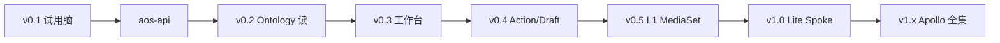

# T-EVO · v0.1 → 目标态替换阶梯工程化

> **版本**：v1.0.2 · 2026-07-17  
> **状态**：✅ **方案完成**（M1 起强制统一 Logger · [T-CROSS §3.2](T-CROSS-横切能力详细技术方案.md)）  
> **对齐**：[10 §5](../10_v01/10-v0.1技术方案.md) · [20 §7](20-AOS整体技术方案.md) · [11](../10_v01/11-目标态开源缺口清单.md) · 本目录全套详稿 + [T-API](T-API-aos-api稳定契约.md) · [T-CROSS](T-CROSS-横切能力详细技术方案.md) · [23 军规](23-AOS开源引用与交付军规.md) · [24 SOP](24-AOS客户侧前置组件安装SOP.md)

---

## 使用的 Rules

契约优先 · 依赖倒置 · 试用引擎可换 · 禁止 UI 锁死上游 · 完成定义可验收 · **军规/前置 SOP 随里程碑加严**

---

## 1. 不变的钉


| 钉                  | 说明                                |
| ------------------ | --------------------------------- |
| Local-First / 三端可装 | 桌面长期为 Spoke/Client 形态之一           |
| 自有目录开发             | `desktop` / `adapter` / `aos-`*   |
| UI 语言              | foundry/html → T-UI               |
| 契约                 | `/v1/buddy/ask` → `aos-api` 版本化兼容 |
| 开源定位               | 参考实现，非发行壳                         |
| 交付形态               | 客户先装前置（24）；AGPL 不进 AOS 包（23） |


---

## 2. 依赖倒置（强制）

```text
UI / Desktop
  → 只依赖 aos-api（自有 OpenAPI）
      → Adapters：Dify | OpenOcta | 自研检索 | Ontology | Logic | L1
```

任何尖兵「先抄开源跑通」必须挂 Adapter 后；**禁止**前端 import 上游 SDK。

---

## 3. 阶段完成定义（DoD）


| 阶段         | 用户可见                | 技术 DoD                                    | 依赖详稿       |
| ---------- | ------------------- | ----------------------------------------- | ---------- |
| **v0.1** ✅ | 三栏助手 · 问答+溯源        | Tauri + adapter + Dify/OpenOcta；去品牌       | 10         |
| **v0.2**   | 真 Object/Wiki 可点    | Ontology Meta 最小读路径；检索可仍 Dify             | T06        |
| **v0.3**   | Inbox / 一页 Module   | Module Runtime；Selection→Buddy；**import 扫描启用**（23 R-ARCH-01） | T08 · T-UI · 23 |
| **v0.4**   | Action Draft 写回     | Action Runtime + Criteria + Draft Dataset | T06 · T07  |
| **v0.5**   | 语料进 MediaSet/湖仓     | P0 文件 + MediaSet + Pipeline；**路径黑名单+SBOM 阻断**；按 24 跑通 Lite 前置总检（Dev） | T05 · 23 · 24 |
| **v1.0**   | Lite Spoke 升级通道     | OPS-010 + Catalog + Vault ref；**现场无 24 签署不得装 AOS** | T09 · 24 |
| **v1.x**   | 多环境 Channel / Ferry | OPS-004+ · Full Spoke 分期；气隙前置矩阵见 24 | T09 · 24 |





---

## 4. 替换矩阵（试用脑）


| 能力   | v0.1            | 目标态                          | 切换信号                        |
| ---- | --------------- | ---------------------------- | --------------------------- |
| 问答编排 | Dify / OpenOcta | AIP Logic + Gateway          | `/v1/aip/chat` 绿 + Evals 基线 |
| 检索   | Dify 数据集        | Ontology + Wiki 字段 +（可选）向量工具 | Object 可点且 Wiki 只读工具可用      |
| 连接器  | 上传/手工           | L1 Connector 插件              | MySQL + 文件 P0 验收            |
| 发布   | 无               | Apollo Lite                  | Spoke Probe 回报              |


**话术红线：** 不得声称「已建成 Ontology/Workshop」仅因 RAG Chatbot 可用（同 10/11）。

话术允许：我们的AI操作系统 对标 palantier

---

## 5. 开源引入门禁（工程）

引入或加深某参考仓前检查：

1. 本地路径是否在 `mybuddy-v01/<Gap>/`？
2. 对应 T0x 是否写了「抄/不抄」？
3. 是否只经 Adapter？
4. 许可证是否过白名单？
5. 交付面是否去品牌？

Airbyte：**用** agent-sdk / pyairbyte / python-cdk（已拉）；**不用** monorepo 当产品。

---

## 6. 里程碑与详稿（对齐 20 §9）


| 里程碑 | 退出                       | 详稿         |
| --- | ------------------------ | ---------- |
| M0  | 20 + 本系列索引评审             | 20 · 00    |
| M1  | ui-kit + 一页 Module 通 API；**统一 Logger**（T-CROSS §3.2） | T-UI · T08 · T-CROSS |
| M2  | Ontology 最小读 + Funnel 状态 | T06        |
| M3  | Draft→Action 闭环          | T06 · T07  |
| M4  | P0 文件 + MySQL + MediaSet | T05        |
| M5  | Lite Spoke 升级            | T09        |


### 6.0 工程纪律（全程）

| 项 | 要求 |
| --- | --- |
| 日志 | 开发默认 `AOS_LOG_LEVEL=debug`；交付/生产默认 `info`；**禁止** off；Audit/WARN+ 不可关 |
| 实现 | 各服务统一 Logger；禁裸 `print`/`console.log` 当生产日志；JSON + `trace_id` |
| 详规 | [T-CROSS §3.2](T-CROSS-横切能力详细技术方案.md) |


### 6.1 排期占位（不编造人周）


| 里程碑   | 依赖前提                | 备注                            |
| ----- | ------------------- | ----------------------------- |
| M0    | 本系列文档评审签字           | **方案层已完成**                    |
| M1    | 前端 1～2 人 + Mock API | 先通 Inbox                      |
| M2～M5 | 按依赖序加人              | 具体人周由项目经理填《排期表》，**不在技术方案内虚构** |


---

## 7. 风险（演化专属）


| 风险              | 缓解                      |
| --------------- | ----------------------- |
| 双轨长期（Dify+自研）拖垮 | 每阶段 DoD；过期 Adapter 标废弃日 |
| 契约被上游掏空         | aos-api 单点；契约测试         |
| UI 分叉           | T-UI Token CI           |


---

## 8. 方案完成声明


| 项                      | 状态              |
| ---------------------- | --------------- |
| 总纲 20                  | ✅               |
| T-UI · T05～T09 · T-EVO | ✅ v1.0          |
| T-API · T-CROSS        | ✅ v1.0          |
| 篇内选型缺口                 | ✅ 已决（见各篇「已决结论」） |


**下一步是工程实现，不是继续写「半截方案」。**

---

## 9. 关联

- [20](20-AOS整体技术方案.md) · [00 索引](00-技术方案索引.md) · [T-API](T-API-aos-api稳定契约.md)  
- [10](../10_v01/10-v0.1技术方案.md) · [11](../10_v01/11-目标态开源缺口清单.md)

---

*T-EVO v1.0 · docs/palantier/20_tech*