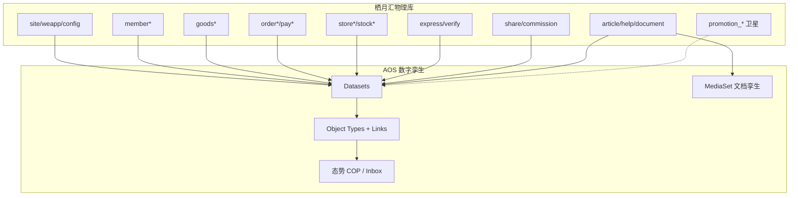

# 栖月汇微商城 · AOS 整体数字孪生方案

| 字段 | 内容 |
|------|------|
| 状态 | **方案 only · 暂不编码（平台配置实施）** |
| 版本 | **v2.0** · 2026-07-19（整体孪生重写；废止「抽样测试夹具」口径） |
| 目录 | `docs/palantier/20_tech/niushop电商案例/` |
| 物理世界 | **栖月汇** 微信小程序商城（Niushop B2C v5 · `site_id=1` · 多 weapp） |
| 数字世界 | AOS（数据连接 → Dataset → Ontology 孪生 → 态势/运营/AIP） |
| 同目录 | [01 JOIN 核查](01-Pipeline多表JOIN能力核查与接入路径调整.md) · [02 孪生数据文件](02-Excel与Word-PDF夹具清单.md) · [对象关系](niushop-数据表与核心对象关系.md) · `export_fixtures_excel.py` · `.env` |
| 对齐 | [20](../20-AOS整体技术方案.md) §3.1 · [09](../../09-Apollo交付引擎产品方案.md) · [T05](../T05-L1数据集成详细技术方案.md) · [T06](../T06-Ontology与Action-Function详细技术方案.md) · [36](../36-T4.6-MySQL去stub方案.md) · [39](../39-T4.4b-文件解析插件方案.md) · [97](../97-Connector插件化整改方案.md) · [100](../100-Connector运行时插件分发方案.md) · [74](../74-数据连接页蓝图信息架构对齐方案.md) · [75](../75-去演示端面壳方案.md) · [45](../45-T-UI-S2余量第二刀方案.md) · [72](../72-系统启停与健康检查手册.md) |

---

## 使用的 Rules

| Rule | 应用 |
|------|------|
| 中文 | 全文 |
| 先方案后代码 | 通过前不写行业定制码；缺口回馈**通用平台** |
| **整体孪生** | 目标是栖月汇业务世界在 AOS 可运营、可感知、可治理；不是抽几列做 demo |
| 零行业定制码 | 配置 Connector / OT / Link / OKF / Action / Module；禁止 `niushop-*` Host 分支 |
| 上线态 UI | 产品页无演示种子/一镜钮（75） |
| 写回 | Draft→Approve；默认不反写支付/库存到商城 |

---

## 1. 一句话目标

> 把 **栖月汇** 线上微商城（人 · 货 · 场 · 单 · 钱 · 履约 · 分润 · 内容）  
> **整体映射**为 AOS 数字孪生，使运营在 AOS 态势/运营台看见真实变化，  
> 并以此 **检验与完善** AOS 平台能力——**不是**再造一个商城后台，也**不是**测试假数据。

```text
物理世界                         数字世界（AOS）
────────                         ──────────────
微信小程序 C 端下单/支付/售后  →   Object/Link 孪生 + Funnel 状态
线上 MySQL（真相源 · 只读）    →   Source/Sync/Dataset（JDBC 主路径）
协议/商品介绍/客服 PDF·Word    →   MediaSet + parsers + Wiki
店主分润 / 分享体验 / 三 weapp →   属性 + Link（栖月汇特色）
运营盯盘                       →   COP 态势 · Inbox · Buddy · Analytics
```

---

## 2. 物理世界画像（栖月汇）

| 项 | 内容 |
|----|------|
| 引擎 | Niushop B2C v5 · 约 **302** 张 `ns_*` 表 |
| 租户 | `site_id = 1`（邓州市栖月汇商贸等） |
| 多小程序 | `weapp_id`：栖月汇 **11** / 源仓集 **10** / 聚味台 **9**（横切订单·商品可见·支付·会员绑定） |
| 特色扩展 | 店主分润、分享体验码、`is_self_shop_*`、引流品槽位（见对象关系 §3） |
| 接入现况 | 本机 **SSH 隧道** `127.0.0.1:13306` → 线上库 `niushop_b2c_v5`（`.env`） |
| 已落盘孪生包 | `fixtures/excel/mall-order.xlsx`（订单 **全 130+71 列**）等（见 02） |

领域真源：[niushop-数据表与核心对象关系.md](niushop-数据表与核心对象关系.md) · SQL · API 清单。

---

## 3. 整体孪生范围（按域 · 不是 302 表无脑进 OT）

> **原则：** 302 表 **都能进 L1 Dataset**（可配置 Sync）；Ontology **按业务对象建模**。  
> 营销 55+ 表等进「卫星域」——数据可进湖，OT 可后置，**不挡核心孪生退出**。

### 3.1 孪生域总图



### 3.2 域分级

| 级 | 名称 | 业务含义 | 进 Dataset | 进 Ontology（OT） | 波次 |
|----|------|----------|------------|-------------------|------|
| **T0** | 租户与端 | 站点、三小程序、关键配置 | ✅ | Site / Weapp | W1 |
| **T1** | 人 | 会员主档、等级、端绑定、地址 | ✅ | Member / MemberLevel / MemberAddress | W1 |
| **T2** | 货 | SPU/SKU/分类/端可见/引流槽 | ✅ | Goods / GoodsSku / Category + Links | W1 |
| **T3** | 单与钱 | 订单头行、支付、退款轨迹 | ✅ | Order / OrderLine / Payment | W1 |
| **T4** | 场与履约 | 门店、门店库存、包裹、核销 | ✅ | Store / Package / Verify | W2 |
| **T5** | 栖月汇特色 | 分享体验、分润流水、店主标记 | ✅ | ShareExperience / CommissionLog | W2 |
| **T6** | 内容与知识 | 文章、帮助、协议、公告 + Word/PDF | ✅ + Media | Document / Article + MediaRef | W2 |
| **T7** | 行为与车 | 购物车、评价、收藏、浏览 | ✅ | Cart / Evaluate（可薄） | W3 |
| **T8** | 库存单据 | stock_* 调拨盘点 | ✅ | StockDoc（可薄） | W3 |
| **T9** | 营销卫星 | promotion_* 55+、礼品卡、分销深表 | ✅ 可延后 | 后置 / 宽表统计即可 | W4+ |
| **T10** | 系统噪声 | cron/diy 深装修/升级日志等 | 可选 | 一般不建 OT | 停车场 |

**整体孪生退出（MVP）** = **T0～T6 在 AOS 可检索、可关联、可上态势**；T7～T10 有清单与接入策略，不宣称「零表遗漏 OT」。

---

## 4. Ontology 目标态（对象与关系）

### 4.1 Object Type 清单（核心）

| Object Type | 主键 | Backing 主表 | 说明 |
|-------------|------|--------------|------|
| **Site** | siteId | `ns_site` | 租户根 |
| **Weapp** | weappId | `ns_weapp` | 三端切片 |
| **Member** | memberId | `ns_member` | 含店主资格等；PII 重 |
| **MemberLevel** | levelId | `ns_member_level` | |
| **MemberAddress** | addressId | `ns_member_address` | PII |
| **Goods** | goodsId | `ns_goods` | SPU；体验配额字段入属性 |
| **GoodsSku** | skuId | `ns_goods_sku` | 交易落点 |
| **GoodsCategory** | categoryId | `ns_goods_category` | 树 |
| **Order** | orderId | `ns_order` | **故事核 · 态势主对象**；130 列属性可分必备/扩展 |
| **OrderLine** | orderGoodsId | `ns_order_goods` | 71 列 |
| **Payment** | payId / outTradeNo | `ns_pay` | |
| **Store** | storeId | `ns_store` | |
| **ExpressPackage** | packageId | `ns_express_delivery_package` | |
| **ShareExperience** | id | `ns_member_shop_share_experience` | 栖月汇 |
| **CommissionLog** | id | `ns_member_shop_commission_log` 等 | 栖月汇 |
| **Article** | articleId | `ns_article` | |
| **HelpDoc** | id | `ns_help` | |
| **PolicyDoc** | id | `ns_document` | 用户/隐私协议 |
| **Notice** | id | `ns_notice` | |

### 4.2 Link Type（核心）

| Link | from → to |
|------|-----------|
| `Order.buyer` | Order → Member |
| `Order.sharer` | Order → Member（share_member_id） |
| `Order.lines` | Order → OrderLine |
| `OrderLine.sku` | OrderLine → GoodsSku |
| `GoodsSku.ofGoods` | GoodsSku → Goods |
| `Goods.inCategory` | Goods → GoodsCategory |
| `Goods.visibleOn` | Goods → Weapp（经 goods_weapp） |
| `Order.paidBy` | Order → Payment |
| `Order.onWeapp` | Order → Weapp |
| `Order.fulfillStore` | Order → Store |
| `Order.hasPackage` | Order → ExpressPackage |
| `Order.fromShare` | Order → ShareExperience |
| `Member.boundWeapp` | Member → Weapp |
| `Member.hasLevel` | Member → MemberLevel |
| `ShareExperience.leadGoods` | ShareExperience → Goods |

### 4.3 Funnel（订单）

```text
created → unpaid → paid → delivering → completed
                 ↘ refunding → closed
```

OKF Bundle（配置包）：`okf.qiyuehui.mall.twin.v1`（名示意；无通用导入则产品页等价配置）。

---

## 5. 数据接入策略（整体）

### 5.1 总原则

| 路径 | 用途 | 栖月汇用法 |
|------|------|------------|
| **A. JDBC MySQL 只读** | **运行态孪生主路径** | SSH 隧道 + `jdbc-mysql`；按域 Sync→Dataset→水合；Schedule 保态势新鲜度 |
| **B. Excel 全字段包** | 离线孪生包 / 对照 / 解析能力 | 订单等已全列导出（02）；可进 file-local→Dataset |
| **C. Word/PDF/PPT** | 非结构化文档孪生 | MediaSet + parsers（39） |
| **D. HTTPS API** | 增量/无库权备选 | `rest-generic`；stub 则平台缺口 |

**PB 多表 JOIN：非 live**（01）。宽表用 **库侧 VIEW** 或 **分表 + Link**，缺口记 G-PB-01。

### 5.2 本机连接（已通）

```text
本机 AOS / 导出脚本
  → 127.0.0.1:13306（SSH LocalForward）
  → 线上 niushop_b2c_v5 · 只读账号（.env）
```

探活参考：`mysql -h 127.0.0.1 -P 13306 -u niushop`；脚本：`export_fixtures_excel.py`。

### 5.3 按域：谁走 JDBC / Excel / Media

| 域 | JDBC（运行态） | Excel 全字段包 | Media |
|----|----------------|----------------|-------|
| T0 租户/端 | ✅ 主 | 可选并入 catalog | — |
| T1 会员 | ✅ 主（PII Marking） | 慎导出外传 | — |
| T2 商品 | ✅ **主**（多子表分 Sync 或 VIEW） | `mall-goods.xlsx` 对照 | 商品图 URL→MediaSet |
| T3 订单/支付 | ✅ **主**（短周期 Schedule） | `mall-order.xlsx` **全 130+71 列** 孪生包 | — |
| T4 门店/履约 | ✅ | catalog/stores | — |
| T5 分享/分润 | ✅ | 可增导 | — |
| T6 内容 | ✅ 表内 HTML | catalog 全列 | **Word/PDF 原件** |
| T7～T8 | ✅ W3 | 按需 | — |
| T9 营销 | Dataset 可延后 | 不优先 | — |

> **纠正：** 订单 Excel 不是「测一下解析」；是 **真实全字段孪生数据包**。运行态感知仍以 **JDBC Schedule** 为准（下单后 COP 能变）。

### 5.4 JDBC 商品多子表（无 PB Join 时）

**路径 A：** `ns_goods` / `ns_goods_sku` / `ns_goods_weapp` / `ns_goods_category` 各 Dataset + Ontology Link。  
**路径 B：** 只读 VIEW `v_aos_goods_sku_flat` 单表采集（01 §3）。

### 5.5 Dataset 命名建议

`ri.dataset.qyh.{domain}.{table}`，如 `qyh.trade.order`、`qyh.goods.sku`；`objectTypeHint` 对齐 §4。

---

## 6. 从物理到孪生的主链路

```text
栖月汇线上 MySQL（只读）
        │ jdbc-mysql + Schedule
        ▼
  Source → Sync → Pipeline/Build → Dataset（按域）
        │
        ├─ file-local：mall-order.xlsx 等全字段包（对照/离线）
        └─ MediaSet：Word/PDF/PPT/商品图
        ▼
  OKF 映射 → Funnel 水合 → Object / Link
        ▼
  ┌─────────┬──────────┬────────────┬───────────┐
  ▼         ▼          ▼            ▼
 COP态势   Inbox运营  Graph/Buddy  Analytics
 新单/未发货/分润异常    读孪生写Draft
        ▼
  Action → Draft → Approve → Lineage（默认只改孪生标注）
```

---

## 7. 态势感知（整体孪生是否「活」）

**是。** 物理世界有人下单/发货/退款 → 库变更 → Schedule Sync → 水合 → **`/workshop/cop` + Inbox** 应反映。

| 指标建议（COP） | 对象 |
|-----------------|------|
| 今日新单 / 未支付 / 待发货 | Order |
| 三 weapp 单量切片 | Order.weappId |
| 低库存 SKU | GoodsSku.stock |
| 待核销 / 待分润异常 | Verify / CommissionLog |
| 文档新鲜度 | Media / Article |

延迟 = Schedule 周期（建议交易 **1～5 min**）。秒级推送 = 平台缺口（CDC/Webhook），记 G-RT-01。

---

## 8. 治理与写回

| 类 | 策略 |
|----|------|
| 手机/地址/openid | Marking `pii`/`secret`；分析导出拒绝或脱敏 |
| Excel 本机包 | gitignore；外传前 `NIUSHOP_EXCEL_MASK_PII=1` |
| 写回 | `AnnotateOrder` / 风险标签等 → Draft；**不**直写 pay_status/库存 |
| 反写商城 | 后置 NS.W；通用 Adapter + 审批 |

---

## 9. AOS 能力全覆盖（整体孪生走查）

| 域 | 产品面 | 栖月汇怎么用 | 必测 |
|----|--------|--------------|------|
| 数据 | `/data` jdbc-mysql | 隧道连线上库 | ✅ |
| 数据 | Sync/Pipeline/Dataset/Schedule | T0～T6 表进湖；订单短周期 | ✅ |
| 数据 | media-sets + parsers | 订单 Excel 全字段 + Word/PDF | ✅ |
| 数据 | lineage/health | 源→孪生沿袭 | ✅ |
| 本体 | Discover/OT/Link/Funnel/OKF | §4 | ✅ |
| 本体 | wiki/graph | 订单备注、邻接图 | ✅ |
| AIP | drafts/lineage/Marking | 标注闭环 | ✅ |
| 工作台 | **cop / inbox** | 态势与运营 | ✅ |
| 工作台 | buddy/graph | Order 上下文 | ○ |
| 分析 | `/analytics` | Order/Member 读数 | ✅ |

---

## 10. 实施波次（QYH.*）

| ID | 主题 | DoD |
|----|------|-----|
| **QYH.0** | 本方案评审冻结 | v2.0 范围/分级无异议 |
| **QYH.1** | 隧道 + Source 绿 | probe；列出台账 T0～T6 表清单 |
| **QYH.2** | JDBC 商品族 + Link/VIEW | Goods/Sku 可检索 |
| **QYH.3** | JDBC 订单/支付 + 短 Schedule | 新单可 Sync；与 `mall-order.xlsx` 对照 |
| **QYH.4** | 会员/门店/履约/支付 OT | T1/T4 可图 |
| **QYH.5** | 分享体验 + 分润 | T5 可讲栖月汇故事 |
| **QYH.6** | 内容 + Media 文档 | T6；Word/PDF 入 MediaSet |
| **QYH.7** | Funnel + COP + Inbox | 态势活；下单可感知 |
| **QYH.8** | Marking + Draft 一条 | 治理与写回纪律 |
| **QYH.9** | 全矩阵走查 + 缺口台账 | §9；平台债清晰 |
| **QYH.A** | T7～T8 行为/库存单据 | 扩展 |
| **QYH.P** | T9 营销卫星 | 后置 |
| **QYH.R** | 近实时 CDC/Webhook | 平台能力 |
| **QYH.W** | 商城反写 | 高门槛后置 |

编码边界：仅 **平台通用能力补齐** + **配置**；禁止栖月汇专用业务包。

---

## 11. 平台缺口（整体孪生暴露）

| ID | 缺口 | 影响 | 优先级 |
|----|------|------|--------|
| G-PB-01 | Pipeline 无多表 Join | 商品宽表靠 VIEW/分表 | P0 |
| G-JDBC-01 | jdbc 单表/弱多 query | 多 Dataset 或 VIEW | P0 |
| G-RT-01 | 无 CDC/真推送 | 态势非秒级 | P1 |
| G-REST-01 | rest-generic stub | HTTPS 备路 | P1 |
| G-COP-01 | COP 指标难绑自定义 OT | 态势配置化不足 | P0（待验证） |
| G-OKF-01 | Bundle 一键导入 | 配置效率 | P2 |

---

## 12. 验收（栖月汇整体孪生 MVP）

- [ ] 线上库经隧道 JDBC 绿；T0～T6 关键表有 Dataset  
- [ ] Ontology：Site/Weapp/Member/Goods/Sku/Order/OrderLine/Payment/Store 可检索  
- [ ] Link：订单→会员→行→SKU→商品；订单→weapp/门店  
- [ ] `mall-order.xlsx` 与库 **列级对齐**（130/71），作孪生包而非抽样  
- [ ] 真实下单后，Schedule 内 COP/Inbox 可见变化  
- [ ] 至少 1 套商品 PDF + 协议 Word 进 MediaSet 可解析  
- [ ] Marking + Draft 一条；无 Host 行业定制码  
- [ ] 话术：**栖月汇整体数字孪生 MVP（T0～T6）**；不宣称替代商城后台、不宣称营销 55 表全进 OT  

---

## 13. 文档地图（本目录）

| 文档 | 角色 |
|------|------|
| **本文 00 v2.0** | **整体孪生主方案** |
| 01 | PB Join 能力核查与商品多表路径 |
| 02 | Excel/Word/PDF 孪生数据文件（全字段） |
| 对象关系 / SQL / API | 领域真源 |
| `export_fixtures_excel.py` · `.env` | 本机导出与连接 |

旧版「P0 仅四对象 · 抽样 Excel 测解析」口径以本文为准废止。

---

## 14. 评审清单

- [ ] 确认目标 = **栖月汇整体孪生**（T0～T6 MVP）  
- [ ] 确认运行态 = JDBC；Excel = 全字段孪生包；文档 = Media  
- [ ] 确认 PB Join 非 live，用 VIEW/Link  
- [ ] 确认态势依赖 Schedule；秒级后置  
- [ ] 确认零行业定制码 · 缺口进 §11  
- [ ] 通过后开 **QYH.1**（配置 + 隧道），非开定制开发  

---

## 15. 修订记录

| 版本 | 日期 | 说明 |
|------|------|------|
| v1.x | 2026-07-19 | 对接/检验/夹具演进（见 git 历史） |
| **v2.0** | 2026-07-19 | **重写**：栖月汇整体数字孪生；域分级 T0～T10；QYH 波次；废止抽样测试口径 |

---

*v2.0 · `niushop电商案例/00-Niushop微商城AOS对接方案.md`*
