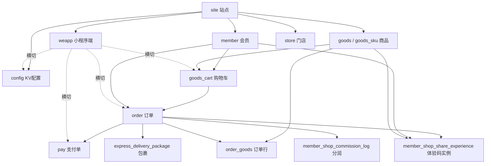
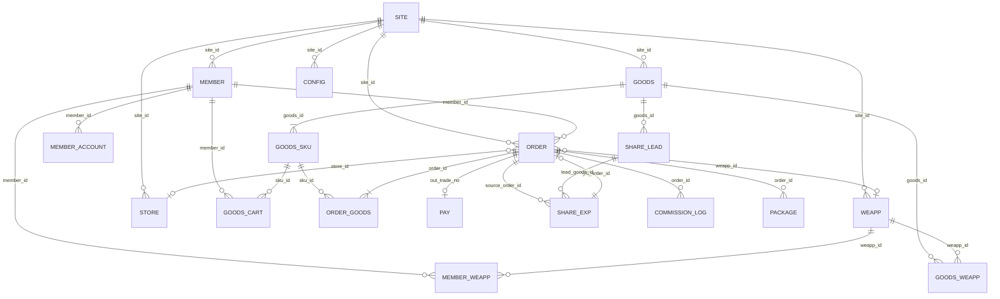

# Niushop B2C v5 — 数据表关系与核心对象关系

> **依据**  
>
> - 库结构：`docs/niushop_b2c_v5.sql`（线上库导出，约 **302** 张表，前缀 `ns_`）  
> - 代码：`niushop/app`（ThinkPHP 模型/服务；`model('order')` ≡ 物理表 `ns_order`）  
> **约定**：下文表名多写逻辑名（去掉 `ns_`）；本站常见 `site_id = 1`。  
> **说明**：Niushop 多数「外键」为逻辑关联（应用层保证），库内很少声明 FOREIGN KEY。

---

## 0. 总览心智模型（四条横切轴）


| 轴          | 关键键                                    | 含义                      |
| ---------- | -------------------------------------- | ----------------------- |
| **多租户**    | `site_id`                              | 站点隔离；几乎所有业务表都有          |
| **交易**     | `order_id` / `sku_id` / `out_trade_no` | 下单、支付、售后、库存             |
| **多小程序**   | `weapp_id`                             | 栖月汇 11 / 源仓集 10 / 聚味台 9 |
| **人货关系扩展** | `member_id` + 店主/分享/分润字段               | 栖月汇店主分润、分享体验、推广绑定       |





---

## 1. 表数量按域（来自 SQL 前缀统计）


| 域前缀                 | 约计      | 说明              |
| ------------------- | ------- | --------------- |
| promotion_*         | 55      | 营销活动（多在 addon）  |
| member_* / member   | 39      | 会员及扩展           |
| goods_* / goods     | 29      | 商品主数据           |
| giftcard_*          | 14      | 礼品卡             |
| store_* / store     | 11      | 门店              |
| stock_*             | 11      | 库存单据            |
| order_* / order     | 9       | 订单主链（行少、字段重）    |
| fenxiao_*           | 9       | 分销插件            |
| express_* / local_* | ~10     | 物流/同城           |
| pay_* / pay         | 6       | 支付              |
| diy_* / site_diy_*  | 6+      | 装修              |
| weapp_* / weapp     | 5       | 小程序             |
| 其它                  | ~89     | 系统、消息、统计、内容、收银等 |
| **合计**              | **302** |                 |


完整表清单见附录 A。

---

## 2. 核心对象关系（业务语义）

### 2.1 站点 Site / 小程序 Weapp / 配置 Config


| 对象    | 表                                        | 代码入口                      | 关系                                                                      |
| ----- | ---------------------------------------- | ------------------------- | ----------------------------------------------------------------------- |
| 站点    | `site`                                   | `app\model\system\Site`   | 根租户                                                                     |
| 小程序端  | `weapp`                                  | `app\model\weapp\Weapp`   | `weapp.site_id → site`；`is_default` 默认端                                 |
| KV 配置 | `config`                                 | `app\model\system\Config` | 唯一业务键大致：`site_id + app_module + config_key (+ weapp_id)`；`value` 为 JSON |
| 后台用户  | `user` / `user_group` / `group` / `menu` | `system\User` 等           | **≠** C 端会员；管后台权限                                                       |
| 插件    | `addon`                                  | `system\Addon`            | 营销/分销等能力开关                                                              |


**多小程序切片（本项目）**：订单、购物车、支付、会员绑定、商品可见、分润配置、体验码实例均带 `weapp_id`。

---

### 2.2 会员 Member


| 对象     | 表                                         | 要点字段 / 关系                                                                                                                                                   |
| ------ | ----------------------------------------- | ----------------------------------------------------------------------------------------------------------------------------------------------------------- |
| 会员主档   | `member`                                  | PK `member_id`；`site_id`；等级 `member_level`；资产 `point/balance/balance_money`；推荐 `source_member`；分享人 `share_member`；分销 `fenxiao_id`；店主资格 `has_shop_qualified` |
| 端绑定    | `member_weapp`                            | `(member_id, weapp_id)` → openid/unionid                                                                                                                    |
| 账户流水   | `member_account`                          | `member_id`；`account_type`；常关联订单 `type_tag` / `related_id`                                                                                                  |
| 地址     | `member_address`                          | `member_id`                                                                                                                                                 |
| 等级定义   | `member_level`                            | `level_id`；付费卡规则等                                                                                                                                           |
| 等级订单   | `member_level_order`                      | 购卡/升级订单，可回挂 `order`                                                                                                                                         |
| 会员等级可见 | `member_level_weapp`                      | 等级 × weapp                                                                                                                                                  |
| 提现     | `member_withdraw` / `member_bank_account` | 余额提现                                                                                                                                                        |
| 标签/分群  | `member_label` / `member_cluster`         | 运营分层                                                                                                                                                        |


**会员 ↔ 订单**：`order.member_id`；分享成交侧还有 `order.share_member_id`、`share_bind_`*。

---

### 2.3 商品 Goods / SKU / 分类


| 对象       | 表                                                       | 关系                                                                                                                    |
| -------- | ------------------------------------------------------- | --------------------------------------------------------------------------------------------------------------------- |
| SPU      | `goods`                                                 | PK `goods_id`；默认 SKU `sku_id`；分类 `category_id`；品牌 `brand_id`；体验配额 `share_experience_quota`；引流主品 `share_lead_goods_id` |
| SKU      | `goods_sku`                                             | `goods_id`；价格/库存/规格；店主特价 `self_shop_special_price`                                                                    |
| 分类       | `goods_category`                                        | 树 `pid/level`                                                                                                         |
| 端可见      | `goods_weapp` / `goods_category_weapp`                  | 商品/分类对某 weapp 是否展示                                                                                                    |
| 购物车      | `goods_cart`                                            | `member_id + sku_id + site_id + weapp_id`                                                                             |
| 引流映射     | `goods_share_lead`                                      | 主品 `goods_id` → 引流品 `lead_goods_id`，槽位 `slot_count`                                                                   |
| 评价/收藏/浏览 | `goods_evaluate*` / `goods_collect` / `goods_browse`    | 行为数据                                                                                                                  |
| 虚拟核销     | `goods_virtual`                                         | 与核销域联动                                                                                                                |
| 次卡       | `goods_card` / `goods_card_item` / `member_goods_card*` | 次卡资产                                                                                                                  |


**交易落点永远是 SKU**：车 → `order_goods.sku_id`；库存扣减多落在 `goods_sku` 或门店 `store_goods_sku`。

---

### 2.4 订单 Order / 支付 Pay / 售后


| 对象     | 表                                      | 关系                                                                                                                                                                                                                        |
| ------ | -------------------------------------- | ------------------------------------------------------------------------------------------------------------------------------------------------------------------------------------------------------------------------- |
| 订单头    | `order`                                | PK `order_id`；`order_no`；`member_id`；`out_trade_no`；金额簇；状态簇；`weapp_id`；门店 `store_id` / `delivery_store_id`；券 `coupon_id`；业务子类型 `order_biz_type`；体验 `share_instance_id` / `share_owner_member_id`；店主单 `is_self_shop_order` |
| 订单行    | `order_goods`                          | `order_id` + `goods_id` + `sku_id`；售后字段挂在行上                                                                                                                                                                               |
| 订单日志   | `order_log`                            | 状态轨迹                                                                                                                                                                                                                      |
| 促销明细   | `order_promotion_detail`               | 活动分摊（视版本使用）                                                                                                                                                                                                               |
| 支付单    | `pay`                                  | `out_trade_no`；`relate_id≈order_id`；`member_id`；`weapp_id`；`event` 如 `OrderPayNotify`                                                                                                                                     |
| 退款支付   | `pay_refund` / `pay_refund_notify_log` | 渠道退款                                                                                                                                                                                                                      |
| 余额支付辅助 | `pay_balance`                          | 余额抵扣                                                                                                                                                                                                                      |
| 售后日志   | `order_refund_log`                     | 售后过程                                                                                                                                                                                                                      |


**标准链路（代码：`OrderCreate` → `Pay::addPay` → `event\OrderPay`）**：

```
member + sku(s)
  → goods_cart（可选）
  → order + order_goods
  → pay(out_trade_no, relate_id=order_id)
  → 支付成功：改 order.pay_status / order_status
  → 可选：销量、分润、分享体验槽位生成
```

**订单类型（对象级）**：普通快递 / 门店 / 同城 `LocalOrder` / 虚拟 `VirtualOrder` 等，共用 `order` 表，靠 `order_type`、`delivery_type`、`goods_class` 分流状态机。

---

### 2.5 门店 Store / 库存 Stock


| 对象   | 表                                                       | 关系                       |
| ---- | ------------------------------------------------------- | ------------------------ |
| 门店   | `store`                                                 | `site_id`；可关联后台 `uid`    |
| 门店商品 | `store_goods` / `store_goods_sku`                       | `store_id` × 商品/SKU 库存与价 |
| 门店会员 | `store_member`                                          | 门店侧会员关系                  |
| 结算   | `store_settlement` / `store_account` / `store_withdraw` | 门店账                      |
| 库存单据 | `stock_`*                                               | 调拨/盘点/出入库单据头行            |
| 统计   | `stat_store` / `stat_store_hour`                        | 门店统计                     |


订单可带 `store_id`（下单门店）与 `delivery_store_id`（自提/履约门店）。

---

### 2.6 物流 Express / 核销 Verify


| 对象   | 表                                           | 关系                                   |
| ---- | ------------------------------------------- | ------------------------------------ |
| 运费模板 | `express_template` (+ item / free_shipping) | 商品 `shipping_template` 引用            |
| 快递公司 | `express_company`                           | 发货选司                                 |
| 发货包裹 | `express_delivery_package`                  | `order_id` + 行 id 数组 + `delivery_no` |
| 同城   | `local` / `local_delivery_package`          | 同城履约                                 |
| 核销码  | `verify` / `verify_record` / `verifier`     | 虚拟/到店核销                              |


---

### 2.7 营销 Promotion（表多、核心 app 薄）

核心下单引擎通过事件/addon 挂活动；SQL 中主要族：

- 券：`promotion_coupon_type` → `promotion_coupon`（领取）→ `order.coupon_id`
- 秒杀 / 拼团 / 砍价 / 预售 / 满减 / 满送 / 套餐 / 主题 / 接龙 / 红包 / 游戏…：`promotion_*`
- 商品挂载：`goods.promotion_addon`（JSON）
- 端隔离：`promotion_weapp`

**对象关系共性**：活动定义表 → 活动商品表 →（可选）活动订单/成团记录表 → 回写 `order.promotion_id` / 金额字段。

---

### 2.8 内容 / DIY / 消息（卫星域）


| 域     | 代表表                                             | 用途              |
| ----- | ----------------------------------------------- | --------------- |
| DIY   | `diy_template`* / `site_diy_view` / `diy_theme` | 小程序/H5 装修       |
| 广告    | `adv` / `adv_position`                          | 位与素材            |
| 文章/帮助 | `article*` / `help*` / `notice`                 | CMS             |
| 消息    | `message*` / `sms_template`                     | 短信/微信/邮件模板与发送日志 |
| 相册    | `album` / `album_pic`                           | 素材库             |
| 统计    | `stat_shop*`                                    | 店铺经营统计          |


---

## 3. 本项目定制扩展（相对原版 Niushop）

### 3.1 分享体验 Share Experience


| 层    | 位置                                                              |
| ---- | --------------------------------------------------------------- |
| 服务   | `app\model\share_experience\ShareExperienceService`             |
| 后台补发 | `app\service\share_experience\ShareExperienceAdminIssueService` |
| 字典   | `app\dict\order\OrderBizDict::SHARE_EXPERIENCE_GIFT`            |


**表关系**：

```
goods（主品配额 / share_lead_goods_id）
  + goods_share_lead（主品→引流品槽位）
  → 母单 order（普通购买）支付成功
  → member_shop_share_experience × N
       owner_member_id, source_order_id, source_goods_id, lead_goods_id,
       slot_index, share_token, weapp_id, status, order_id(体验子单)
  → 扫码领取 → 创建 order(order_biz_type=share_experience_gift,
                          share_instance_id, share_owner_member_id)
  → 发货 → shipped_consumed
```

### 3.2 店主分润 / 超级卡 / 推广


| 概念    | 表 / 字段                                                                             |
| ----- | ---------------------------------------------------------------------------------- |
| 店主资格  | `member.has_shop_qualified`；订单 `is_self_shop_order` / `is_self_shop_special_price` |
| 分润配置  | `member_shop_commission_config`（按 `site_id+weapp_id`）                              |
| 商品覆盖  | `member_shop_goods_commission`                                                     |
| 超级卡比例 | `member_shop_super_card_commission`                                                |
| 分润流水  | `member_shop_commission_log` (+ `*_line`)                                          |
| 技术服务费 | `member_shop_tech_service_log`                                                     |
| 分享绑定  | `member_shop_share_bind_log`；订单 `share_member_id` / `share_bind_*`                 |
| 推广成交  | `member_promote_log`；会员 `source_member`                                            |


### 3.3 多小程序并存

见 `docs/site1-三小程序并存-技术实现与实施方案.md`。数据上贯穿：`weapp`、`goods_weapp`、`member_weapp`、`order.weapp_id`、`pay.weapp_id`、`goods_cart.weapp_id`、`config.weapp_id`。

---

## 4. 核心表「逻辑外键」速查


| 从表                             | 字段                                                             | 指向                                |
| ------------------------------ | -------------------------------------------------------------- | --------------------------------- |
| *多数业务表*                        | `site_id`                                                      | `site.site_id`                    |
| `weapp`                        | `site_id`                                                      | `site`                            |
| `member`                       | `member_level`                                                 | `member_level.level_id`           |
| `member`                       | `source_member` / `share_member`                               | `member.member_id`                |
| `member_weapp`                 | `member_id`,`weapp_id`                                         | `member`,`weapp`                  |
| `goods`                        | `sku_id`                                                       | 默认 `goods_sku`                    |
| `goods_sku`                    | `goods_id`                                                     | `goods`                           |
| `goods_weapp`                  | `goods_id`,`weapp_id`                                          | `goods`,`weapp`                   |
| `goods_cart`                   | `member_id`,`sku_id`,`weapp_id`                                | 会员/SKU/端                          |
| `order`                        | `member_id`,`out_trade_no`,`coupon_id`,`store_id`,`weapp_id`   | 会员/支付/券/门店/端                      |
| `order`                        | `share_instance_id`                                            | `member_shop_share_experience.id` |
| `order_goods`                  | `order_id`,`goods_id`,`sku_id`                                 | 订单/商品                             |
| `pay`                          | `out_trade_no`,`relate_id`,`member_id`                         | 与订单对齐                             |
| `express_delivery_package`     | `order_id`                                                     | `order`                           |
| `promotion_coupon`             | `member_id`,`coupon_type_id`,`use_order_id`                    | 会员/券种/订单                          |
| `member_shop_share_experience` | `owner_member_id`,`source_order_id`,`order_id`,`lead_goods_id` | 会员/母单/体验单/引流品                     |
| `member_shop_commission_log`   | `order_id`,`buyer_member_id`,`commission_member_id`            | 订单/买卖双方会员                         |
| `member_account`               | `member_id`,`related_id`                                       | 会员/业务单                            |
| `store_goods_sku`              | `store_id`,`sku_id`                                            | 门店/SKU                            |
| `config`                       | `site_id`,`weapp_id`                                           | 站点/端                              |


---

## 5. 代码对象 ↔ 表（核心类）


| 域      | 代表类（`niushop/app/model/...`）                            | 主表                             |
| ------ | ------------------------------------------------------- | ------------------------------ |
| 下单     | `order\OrderCreate` + `ordercreate\`*                   | `order`,`order_goods`,`pay`    |
| 订单生命周期 | `OrderCommon`,`Order`,`LocalOrder`,`VirtualOrder`       | `order`                        |
| 支付回调   | `order\event\OrderPay`；`system\Pay`                     | `order`,`pay`                  |
| 售后     | `OrderRefund` + `orderrefund\*`                         | `order_goods`,`pay_refund`     |
| 商品     | `goods\Goods`,`GoodsSku` 逻辑在 Goods                      | `goods`,`goods_sku`            |
| 购物车    | `goods\Cart`                                            | `goods_cart`                   |
| 会员     | `member\Member`,`Login`,`Register`,`MemberAccount`      | `member`,`member_account`      |
| 配置     | `system\Config`；各域 `*\Config`                           | `config`                       |
| 小程序    | `weapp\Weapp`；`goods\GoodsWeapp`                        | `weapp`,`goods_weapp`          |
| 门店     | `store\Store`；`storegoods\StoreGoods`                   | `store`,`store_goods*`         |
| 体验码    | `share_experience\ShareExperienceService`               | `member_shop_share_experience` |
| 分润     | `member\MemberShopCommission*` + `app\service\member\*` | `member_shop_commission_*`     |


---

## 6. 核心表关键字段清单（摘自线上 SQL）

### 6.1 `order`（130 列，最重）

身份与端：`order_id, order_no, site_id, member_id, weapp_id, weapp_appid, weapp_openid, store_id, delivery_store_id`  
支付：`out_trade_no, pay_status, pay_type, pay_money, balance_money, pay_time`  
金额：`goods_money, delivery_money, promotion_money, coupon_money, order_money, adjust_money`  
状态：`order_status, delivery_status, refund_status, order_type, delivery_type`  
分享/分润扩展：`share_member_id, share_bind_*, commission_risk_*, order_biz_type, share_instance_id, share_owner_member_id, is_self_shop_order, is_self_shop_special_price`

### 6.2 `order_goods`（71 列）

`order_goods_id → order_id + goods_id + sku_id + member_id`；行级售后全套 `refund_*`；次卡 `card_item_id` / `card_holding_id`。

### 6.3 `goods` / `goods_sku`

SPU 含体验：`share_experience_quota, share_lead_goods_id, share_lead_goods_quantity`。  
SKU 含店主价：`self_shop_special_price`；库存 `stock` / `real_stock`。

### 6.4 `member`

关系网：`share_member, source_member, fenxiao_id, has_shop_qualified`。  
资产：`point, balance, balance_money, growth`。  
消费汇总：`order_money, order_num, …`。

### 6.5 `pay` / `config` / `weapp`

- `pay`：`out_trade_no, relate_id, member_id, weapp_id, pay_status, event`  
- `config`：`site_id, weapp_id, app_module, config_key, value`  
- `weapp`：`weapp_id, site_id, appid, is_default`

### 6.6 `member_shop_share_experience`

`id, site_id, weapp_id, owner_member_id, source_order_id, source_goods_id, lead_goods_id, slot_index, share_token, status, order_id, shipped_consumed, qrcode_*`

---

## 7. ER 总图（逻辑）




---

## 8. 读写时建议路径（查数 / 排障）


| 问题       | 建议起点                                                                     |
| -------- | ------------------------------------------------------------------------ |
| 一笔钱是否付成功 | `order.order_no` → `out_trade_no` → `pay`                                |
| 用户买了什么   | `order` → `order_goods` → `goods_sku`                                    |
| 某端是否可见商品 | `goods_weapp` + `goods_category_weapp` + `weapp_id`                      |
| 体验码状态    | `member_shop_share_experience.share_token` → 母单/子单                       |
| 店主分润     | `order` → `member_shop_commission_log` + `member_shop_commission_config` |
| 某配置项     | `config` where `config_key` + `weapp_id`                                 |
| 券是否核销    | `promotion_coupon.use_order_id`                                          |


---

## 附录 A. 全表清单（302，`ns_` 前缀）

`addon`, `addon_quick`, `adv`, `adv_position`, `album`, `album_pic`, `area`, `article`, `article_category`, `blindbox*`, `cashier_*`, `change_shifts_record`, `config`, `cron`, `cron_log`, `diy_*`, `document`, `export`, `express_*`, `fenxiao_*`, `finance_cost_expense`, `form`, `form_data`, `giftcard_*`, `goods*`, `group`, `help*`, `link`, `local*`, `member*`, `menu`, `message*`, `notes*`, `notice`, `order*`, `pay*`, `pc_*`, `poster*`, `printer*`, `promotion_*`, `reserve*`, `scale`, `service_*`, `servicer*`, `shop*`, `site*`, `sms_template`, `split_word`, `stat_*`, `stock_*`, `store*`, `supplier`, `sys_*`, `user*`, `v3_upgrade_log`, `verifier`, `verify*`, `virtual_stock`, `weapp*`, `wechat_*`

（与 `docs/niushop_b2c_v5.sql` 中 `CREATE TABLE` 一一对应；完整排序列表可用：  
`Select-String -Path docs/niushop_b2c_v5.sql -Pattern '^CREATE TABLE'`）

---

## 附录 B. 文档维护


| 项     | 值                                        |
| ----- | ---------------------------------------- |
| 初版依据  | 线上导出 SQL + `niushop/app` 模型扫描            |
| 若结构变更 | 重新导出 SQL 后更新 §1/§4/§6 与附录 A              |
| 相关文档  | `docs/site1-三小程序并存-技术实现与实施方案.md`；体验码方案文档 |


---

*本文只描述关系与对象，不包含改库/发版操作。*