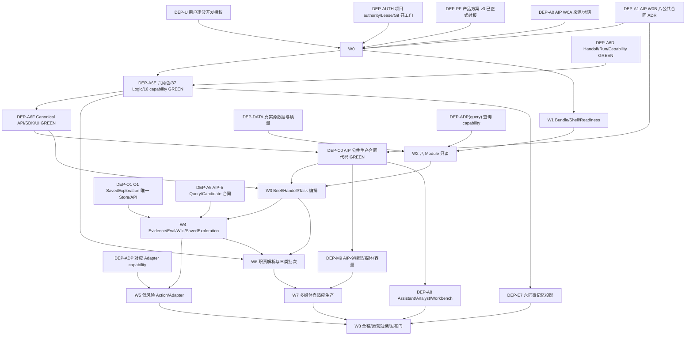

# WORKSHOP-TECH-FORMAL-REVIEW 工作台层开发详细清单与依赖关系

> 日期：2026-08-14  
> 方案版本：v4.1（连续授权与 W1-E 实施事实校准）  
> 当前清单状态：`W0_COMPLETED_GREEN / W1～W8_CONTINUOUS_IMPLEMENTATION_AUTHORIZED / W1_E_PARTIAL_GREEN_UNINSTALL_MIGRATION_BLOCKED`  
> W0 任务：`workshop-w0-implementation-preparation-20260813`  
> 适用工作树：`aos-platform-w2-workshop` / 分支 `w2-workshop`；`m1` 是稳定集成线，`w1-aip` 是 AIP 开发线  
> 唯一真实业务范围：`org-org/dev-project`  
> 负向隔离 canary：`dev-org/dev-project`，不得作为真实完成证据  
> 边界：本清单是可执行计划，不表示代码、数据库、Provider、账号、数据或页面已经就绪。

> 长任务执行总入口：[`00-工作台长任务开发计划总清单.md`](00-工作台长任务开发计划总清单.md)。总入口负责逐项勾选和中断恢复；本文负责详细依赖、交付物、验证、停止与回滚合同。

## 0. 使用方式

1. 每次只授权一个明确 Wave 或子 Wave；不得把“审核通过”解释为 W0～W8 全量编码授权。
2. 开工前重新读取项目 authority、01/06、活动 Lease、Git、Alembic single head、AIP/Adapter readiness；状态漂移则重开该波审查。
3. 任务状态只使用：`PLANNED`、`BLOCKED_DEPENDENCY`、`AUTHORIZED`、`IN_PROGRESS`、`IMPLEMENTED_GREEN`、`OPERATIONAL_READY`、`CANCELLED`。
4. `planned`、`code_green`、`operational_ready` 必须分栏；文档、测试、页面或静态视觉任一单项不能跨栏升级。
5. 每个 Task 均须登记 Task Receipt/Lease；完成后先写 Delivery Receipt、更新本分支 D-waves 并安全提交。`authority.json`、01/06、共享记忆与 Prime 核心投影只在 m1 串行集成阶段 CAS 更新。
6. 本清单中“候选文件”只用于评估冲突和工作量。每波开工前必须依据实时代码冻结精确文件清单；未经 W0 ADR，不预建空目录、表或 API。

## 1. 总依赖图



主关键路径：

```text
DEP-PF + DEP-A0 + DEP-A1
  → W0
  → W1
  → W2
  + DEP-A6D/A6E/A6F + DEP-C0
  → W3
  → W4
  → W6
  + DEP-M9
  → W7
  → W8
```

W5 可在 W4 后与 W6 的无副作用部分并行，但任何共享 Adapter、账号、幂等域、预算或 ActionType 的开闸必须串行。

## 2. 外部依赖门

| ID | 依赖 | 当前事实 | 阻断范围 | 关闭证据 |
|---|---|---|---|---|
| DEP-U | 用户对具体 Wave/子 Wave 的开发授权 | 用户已于 2026-08-14 授予 W1～W8 按清单连续实施授权 | 授权门已关闭；依赖、安全、迁移、真实副作用与发布门仍逐 Task 生效 | Task Receipt 精确登记；连续授权不得用于绕过未满足依赖或 Lease |
| DEP-AUTH | 项目 authority、强一致记忆、Lease、Git/迁移开工门 | W0 以 `AOS-000019` 登记，强投影 CURRENT；authority/Prime 对最近 AIP/产品事实存在内容滞后，已用 01/06/Git 校准 | W1～W8 | 每波重新核验 authority/01/06/Git/Alembic/active lease；投影漂移先修复 |
| DEP-PF | 工作台产品方案正式审查、整改与用户封板 | `APPROVED_DETAILED_PRODUCT_BASELINE_V3`，R3～R7 P0=0/P1=0 | 已关闭；后续产品实质变化重开受影响项 | 产品 14 号审查账本及用户批准 |
| DEP-A0 | AIP W0A 来源、术语、10 capability crosswalk | 方案冻结且 A6E 已发布 6/37/10 | 已关闭 W0/A6E 定义门；运行 readiness 仍独立 | exact catalog/alias/crosswalk 回读；不固定运行 Agent 数量 |
| DEP-A1 | AIP W0B 八类公共合同 ADR + 第九共同基础裁决 | 21 号 ADR `APPROVED_FOR_W2_IMPLEMENTATION` | W0 owner 裁决已关闭；W3+ 仍按对象分项依赖代码 | owner/API/store/RLS/CAS/idempotency/migration/failure/rollback 逐项实现 |
| DEP-A6D | AIP-6 Handoff、AgentRun、CapabilityBinding | `code_green`，Run 在运行依赖不齐时失败关闭 | 已关闭定义/控制前置；不等于 runnable | exact refs、一次性 Handoff、Run snapshot、revoke/unknown 证据 |
| DEP-A6E | 六角色、37 Logic、10 capability 领域包 | 6/37/10 exact revision 已发布 | 关闭定义门；operational readiness 仍 blocked | exact revision 回读；标题 alias 唯一；Coordinator 非新增实体 |
| DEP-A6F | AIP Agent Canonical API、唯一 SDK、页面切换 | Principal API、组织安装、唯一 SDK/UI GREEN；真实 6 实例、0 runnable | 关闭身份/API/UI 门；W3 仍受 Binding/Provider/Eval/公共合同约束 | 双租户、旧 singleton 退出、真实 readiness/browser GREEN |
| DEP-A6R | AIP CapabilityBinding、AgentRun、Handoff runtime-control Canonical API | AOS-000041 已交付 CapabilityBinding/SkillBinding API 与 14 个 OpenAPI path family；AgentRun/Handoff API、BIND1-5 strict SDK/UI/browser、固定集成基线与真实 operational binding 仍缺失 | 组合门部分关闭，继续阻断 W3-01 完整 readiness/交接及 W3-06～10；不得由 Workshop 自建第二 client/BFF authority | BIND1-4 Receipt + 后续 AgentRun/Handoff/BIND1-5 Delivery Receipt + m1 fixed SHA；exact refs、revoke/unknown/drift、一次性交接与双租户证据 |
| DEP-C0 | 八公共生产合同代码 authority | W2-A/B 已有历史 GREEN；W2-C 在 `w1-aip@0957b9f` 有代码 Delivery Receipt，状态 `W2C_CODE_GREEN_BROWSER_PENDING_M1`，尚未串行集成/释放 Lease；W2-D 未关闭 | 按对象阻断 W3～W8；W2-C 提交或候选 migration 不等于整体 GREEN | AIP W2-B～D Delivery Receipt；m1 集成/浏览器/Lease release；跨租户、drift、revoke、unknown 失败关闭 |
| DEP-A5 | AIP-5 Query/Knowledge/MemoryCandidate 接口与治理合同 | AIP-5 主线已有实现/审查证据；Workshop 尚需按实时代码核对 exact API 与 operational readiness | W4-05、W8-04 | exact revision/API/SDK、Candidate 不自动 promote、citation/revoke/minimum disclosure 与真实 HTTP 证据 |
| DEP-O1 | SavedExploration 唯一 PostgreSQL API/Store | PostgreSQL authority 已有，旧内存实现仍残留 | W4 保存/分享、W8 | 唯一 API 回读、重启持久、share/revoke/expiry、旧内存入口关闭/只读迁移 |
| DEP-E7 | 六数字同事个人记忆与共享投影 | 必须等待 A6E exact identity | W8 六同事长期场景；不阻断无记忆只读 | exact AgentInstance subject、最小披露、撤销、Candidate 治理与负向测试 |
| DEP-A8 | AIP-8 Assistant/Analyst/Workbench | 未整体 GREEN | 经营参谋高级分析、通用查询体验、W8 | 真实 Query/SavedExploration/Task/Evidence 同链与浏览器 EvidencePack |
| DEP-M9 | AIP-7/9 模型、媒体、Harness、容量与自适应生产 | AIP-7 A7-1～A7-3 code-green；真实 Provider/Route/Eval 为 0，AIP-9/媒体/容量未整体 GREEN | W7、相关 W8 | Provider exact operational readiness、capacity/budget/Usage、MediaJob/Artifact/Eval/Checkpoint GREEN |
| DEP-ADP | L2 平台 Adapter 单 capability | 查询能力与写能力分项不齐 | W2 查询、W5/W6/W7/W8 写动作 | capability contract、账号 scope、dryValidate、idempotency、Receipt/reconcile、kill switch |
| DEP-DATA | 真实源数据与质量 | 仅 `org-org/dev-project` 可作真实正向证据 | W2+ 各业务视图 | cutoff/quality/freshness/row & ref reconciliation；PII policy；无静态/Mock 兜底 |

### 2.1 AIP 支撑审查 P0 对应关系

| AIP 审查项 | 本清单关闭任务 |
|---|---|
| P0-01 新来源未纳入 AIP 全量覆盖 | DEP-A0、W0-01、W0-10 |
| P0-02 八公共合同缺 L0 authority ADR | DEP-A1、W0-05、DEP-C0 |
| P0-03 A6D～A6F 未闭合 | DEP-A6D/A6E/A6F、W3-01/06/07 |
| P0-04 10 capability 无 canonical catalog | DEP-A0/A6E、W0-06、W6-01 |
| P0-05 HandoffContext 冲突 | DEP-A0、W0-06、W3-06；新代码/表/API 只允许 HandoffEnvelope |
| P0-06 E7 早于 A6E exact identity | DEP-A6E → DEP-E7；W8 前回读 |
| P0-07 AIP-9 固定 Agent 团队 | DEP-C0/DEP-M9、W7-01～04；以 ResponsibilityPlan + capability 解析 |

## 3. 每波共同交付包

每一波必须交付以下 12 项，缺一项不得标 `IMPLEMENTED_GREEN`：

1. 当波精确文件/接口/operationId/migration/flag 清单；
2. Task Receipt、Lease 和基线 revision/commit；
3. 方案/ADR 与产品追踪更新；
4. Red test 或能证明旧行为不满足合同的基线测试；
5. 最小实现与 `git diff --check`；
6. 定向测试 + 相邻 AIP/Bundle/Adapter 回归 + 累计门；
7. OpenAPI deterministic diff、operationId 唯一；
8. Alembic single head/current、RLS/无 scope/跨租户；无 migration 时明确 `N/A`；
9. `org-org/dev-project` 正向 HTTP/浏览器证据和 `dev-org/dev-project` 负向隔离；不适用时给出原因；
10. loading/empty/forbidden/stale/partial/failed/unknown/blocked 与 keyboard/三视口验收；
11. rollback/roll-forward/compensation 演练及历史 Receipt/Lineage 守恒；
12. Delivery Receipt、本分支 D-waves 与安全提交；m1 串行集成阶段再完成 01/06、authority CAS、共享记忆与 Prime exact readback。

## 4. W0 · 方案、authority 与兼容性冻结

> Wave 状态：`COMPLETED_GREEN / W1～W8_CONTINUOUS_IMPLEMENTATION_AUTHORIZED`  
> W0 已由用户授权，Task Receipt 为 `workshop-w0-implementation-preparation-20260813`；结论与证据见 24 号 ADR 和 W0 追踪矩阵。

| Task | 工作项 | 依赖 | 交付物/候选文件 | 验证与停止门 |
|---|---|---|---|---|
| W0-01 | 冻结上位来源、当前代码、Bundle/AIP/OT/Adapter 清单与 hash | DEP-U、DEP-AUTH、DEP-PF | 24 §1 与 W0 矩阵 | `GREEN`：三 worktree、AIP、4,121 route、12 OT、Alembic head 已冻结 |
| W0-02 | 冻结 Workshop contract 兼容 ADR | W0-01 | 24 §2 | `GREEN`：单 loader + canonical JSON contract + legacy adapter |
| W0-03 | 冻结 W01/W02/W03 能力归并与 route 迁移 | W0-02 | 24 §4 | `GREEN`：能力守恒、read-switch、previous lock rollback |
| W0-04 | 冻结八 Module ID、display alias、canonical route、slot/order、legacy redirect | W0-02/03 | 24 §3 | `GREEN`：8/8 唯一，legacy alias 完整 |
| W0-05 | 把 AIP 八公共合同 owner 裁决展开为 Workshop 消费 ADR | DEP-A1、W0-01 | 24 §5 | `GREEN`：8/8 + 共同基础；L1 无第二 authority |
| W0-06 | 冻结六角色、37 Logic、10 capability 与 ResponsibilitySlot crosswalk | DEP-A0、W0-05 | 24 §3/5 | `GREEN`：标题 alias、Coordinator、HandoffEnvelope 边界明确 |
| W0-07 | 冻结领域 namespace、Command、错误、strict SDK 和兼容策略 | W0-04/05 | 24 §6 | `GREEN`：W1 仅 list/readiness；view/command 延后 |
| W0-08 | 冻结 Store/RLS/index/migration/retention/backup/DR 决策 | W0-05/07 | 24 §7 | `GREEN`：W1 无 migration/新表，目录为可重建投影 |
| W0-09 | 冻结安全、PII/Secret、marking/purpose/consent、媒体许可与供应链门 | W0-05/06/08 | 24 §8 | `GREEN`：Secret ref/minimum disclosure/供应链负向门 |
| W0-10 | 形成需求→技术→Task→Test/Evidence 双向矩阵和最终实现 DAG | W0-01～09 | W0 全量追踪矩阵 | `GREEN`：新增 W3-11～14，总 Task 96，隐藏实现项 0 |
| W0-11 | 冻结 W1 实施文件包并请求用户开发授权 | W0-10 | W0 矩阵 §5～7 | `GREEN`：文件/测试/子波/回滚已冻结；W1 保持未授权 |

可并行：W0-02/05/09 在 W0-01 后可分别审查；W0-03 依赖 02，W0-06 依赖 05；W0-07/08 依赖 owner 裁决；W0-10/11 必须串行收口。

## 5. W1 · Bundle 迁移、Shell、Readiness 与唯一 SDK

> Wave 状态：`IN_PROGRESS / CONTINUOUS_AUTHORIZED / W1_E_PARTIAL_GREEN_UNINSTALL_MIGRATION_BLOCKED`  
> 硬前置：W0 全 GREEN + 用户对 W1 或其子波的明确授权（`DEP-U`）；W0-11 只冻结施工包，不代替授权。

| Task | 工作项 | 依赖 | 交付物/候选文件 | 验证与停止门 |
|---|---|---|---|---|
| W1-01 | 实现批准的 Workshop asset contract/loader/schema | W0-11 | `packages/contracts/schemas/asset-bundles/*`、asset registry/Resolver tests | 旧/新资产兼容；未知字段/签名/冲突失败关闭 |
| W1-02 | 发布八 contribution draft revision，不激活写能力 | W1-01、W0-04 | `bundles/solutions/*/content/workshops/*`、bundle version/evidence | 8/8 schema/signature；required capability 未就绪显示 blocked |
| W1-03 | 迁移 W01/W02/W03 并做能力守恒/对读 | W1-01/02、W0-03 | migration map、comparison tests、source refs | row/widget/permission/action 目标守恒；0 静默删除；无双写 |
| W1-04 | 实现 route projection、legacy redirect 和 active lock read-switch | W1-02/03 | Web Router、installation projection | 旧 route 不生成新链接；rollback 恢复 previous lock；0 双 active |
| W1-05 | 实现领域 API read envelope/readiness contract | W0-07、W1-01 | `services/aos-api/aos_api/...ecommerce_workshop...` 候选模块 | Principal scope；七态/错误/cutoff/ref strict；不推进 canonical 状态 |
| W1-06 | 实现唯一 `api/ecommerceWorkshop` strict SDK | W1-05 | `apps/web/src/api/ecommerceWorkshop/*` | parser/ref/enum mismatch fail-closed；不复制 AIP contracts |
| W1-07 | 实现 `EcommerceWorkshopShell`、安装导航、收纳/Focus | W1-04/06 | `components/workshop/*`、route host | H1/nav/aria-current/折叠恢复/三视口；未安装不显示 |
| W1-08 | 实现 AsyncStateBoundary/CapabilityBlocker | W1-05/07 | 公共状态组件 | loading/empty/forbidden/stale/partial/failed/unknown/blocked 全覆盖；无 sample fallback |
| W1-09 | 安装/卸载/版本升级/回滚集成 | W1-01～08 | integration tests、EvidencePack | 两租户不同 lock；旧版本回滚；历史 Receipt/Lineage 保留 |
| W1-10 | 正式 HTTP 浏览器验收 | W1-09 | 1280/1440/1920、keyboard、network/console evidence | console error=0；0 假按钮/alert 成功；canary 不泄漏 |

并行泳道：W1-01/02/03 为 Bundle；W1-05/06 为 API/SDK；W1-07/08 为 Web。三泳道在 W1-09 前合流，W1-04 read-switch 和 W1-09/10 必须串行。

回滚：先全局/Module flag 禁止新命令，再恢复 previous active installation lock 和旧 route；不删除新 schema、历史 bundle revision 或 Receipt。

## 6. W2 · 八 Module 真实只读基座

> Wave 状态：`BLOCKED_DEPENDENCY / CONTINUOUS_AUTHORIZED_DEPENDENCIES_UNMET / DEP_DATA_RED / DEP_ADP_OPERATIONAL_QUERY_RED`  
> 硬前置：W1、DEP-DATA；各 Module 可因 Adapter/query source 不同分别 blocked。

| Task | 工作项 | 依赖 | 核心交付 | 验证与停止门 |
|---|---|---|---|---|
| W2-00 | 冻结 12 OT/Metric/Event 源、cutoff、quality、PII 与 query capability | DEP-DATA、DEP-ADP(query) | source/readiness matrix | `AOS-000057` 已形成 12/12 fresh succeeded，P08/P12 rows=53/412、P08 PII key matches=0、canary 0/0，故 DEP-DATA GREEN；`AOS-000058` BIND-R0 确认 6 installed / 0 runnable，AgentRun/CapabilityBinding/SkillBinding/ModelRoute 与九类 external dependency 仍缺失，故 operational query RED；28 号文档 §12.5 已冻结 Data/Adapter 产生、AIP exact 消费、Workshop Module 聚合的 `SourceReadinessEnvelope`；catalog lock cutoff、Content-0B migration 或 synthetic health 均不是 production readiness；§12.6 的非 12 源领域 authority 继续独立门控，缺源是 unknown/blocked 而不是 empty |
| W2-01 | 统一运营只读 read model：订单/库存/履约/售后/事件 | W1-10、W2-00 | OperationCase projection、timeline | W01/W02 能力守恒；事件 originals；金额/地址最小披露 |
| W2-02 | 日常总控只读 Task/Run/Stage/阻塞投影 | core：W1-10、DEP-AIP-TASK-READ；enrichment：W2-00 与各领域 exact reader | CockpitReadModel | `ea20ee5`、`57a351a`、`eb38c3e`、`09e6fdf` 已完成 Task/latest Run core、typed Step/Checkpoint 子资源、不可变 membership cursor、状态指纹过期 409、安装可见性门、GET-only API、strict Web SDK 与 partial 页面 Store；Module unknown 时依赖阻断与独立只读 evidence view 同时可见。`108` 号 ADR 的 `W2-02-VISUAL` 子波现由 `ac8739d` 与内置浏览器证据闭合：专项 `9/9`、Web 累计 `192 files / 1950 tests`、TypeScript/build GREEN；`org-org/dev-project` 在 1920/1440/1280 均无水平溢出，8 菜单、唯一 H1、4 条 canonical Task、4 条 latest Run、3 条 warning blocker、0 cockpit command input、0“下达”按钮、0 console error。缺失 authority 继续在视觉原位失败关闭，未复制静态经营值或数字同事状态。只关闭视觉子波；整项仍等待 exact Stage、Responsibility/Handoff/Approval/Issue、Action reconcile、W2-00 enrichment、真实非空明细与完整目标态 EvidencePack，不勾选 |
| W2-03 | 内容与活动只读 plan/calendar/master/variant 投影 | W1-10、W2-00 | ContentCampaignReadModel | 母稿/Variant/ref/cutoff 清楚；未有 Brief authority 时 Draft disabled |
| W2-04 | 达人五阶段只读候选/合同/履约/关系投影 | W1-10、W2-00 | CreatorReadModel | PII/许可/Preliminary；无静态达人 fallback |
| W2-05 | 多媒体只读资产/Job readiness/目标态投影 | W1-10、W2-00 | MediaStudioReadModel | Provider/模型未就绪 target-state/disabled；preview 不冒充 Artifact |
| W2-06 | 经营参谋真实指标/质量/证据/计划只读投影 | W1-10、W2-00 | AnalystReadModel | definition/cutoff/quality；unknown 不显示 0；无私有思维链 |
| W2-07 | 价格治理报价/Match/Policy/Observation 只读投影 | W1-10、W2-00 | PriceReadModel | 同款置信/证据/freshness；采集可用不点亮调价 |
| W2-08 | 客户关系 CustomerLite/consent/segment/journey 只读投影 | W1-10、W2-00 | CustomerReadModel | 稳定 identity、purpose/consent/retention、小群体保护 |
| W2-09 | 八 Module shared ref/timeline/navigation 集成 | W2-01～08 | cross-module read integration | 切页/刷新 ref 不丢；跨 Module 不复制 payload |
| W2-10 | 八页浏览器矩阵与数据对账 | W2-09 | 8×3 视口、七态、canary、安全 EvidencePack | 正向只认 org-org；0 水平页面溢出；network/console/DOM 断言 |

可并行组：`W2-01+02`、`W2-03+04`、`W2-05+06`、`W2-07+08` 四组可在公共 DTO 冻结后并行；同组共享对象多，组内优先串行或分文件开发。W2-09/10 串行收口。

动态门补充（AOS-000088）：fresh probe 已确认 12/12 succeeded、canary 0/0；`aip-wks-dep0-p08p12-live-20260816` 关闭 P08/P12 数据与最小披露门，`aip-wks-dep0b-bind-r0-20260816` 则确认 6 installed / 0 runnable。在既有 R1 code authority 基础上，Authority 与最新 Delivery Receipt 已以 `574e78b` 关闭 R1-02 exact Keychain secret-version binding 与 payload-free existence probe；targeted 32 tests、w1-aip/m1 累计各 667 tests、compileall 和 diff check GREEN。但 owner-configured versioned Keychain item 仍不存在或不可达，Region/external destination unknown，无 live Provider/Model/Policy/Route/Eval/Health/Capacity/Price/Budget/Binding/runnable AgentRun。因此 `DEP-DATA=GREEN`，但 `DEP-ADP(query)` 继续为 `CODE_CONTRACT_GREEN / OPERATIONAL_QUERY_RED`，W2-00 仍不勾选。metadata-only probe 不读取 payload，也不创建 live runtime 或真实业务行，不构成 Provider 调用成功证据。历史根因与隐私整改证据仍见 `.evidence/workshop/2026-08-15-w2-00-pipeline-root-cause-aos45.json`、`.evidence/workshop/2026-08-15-w2-ssh-lifecycle-contract-receipt.json` 与 `.evidence/workshop/2026-08-15-w2-p08-p10-contract-audit-receipt.json`，后续执行准备见 `../106-W2至W8依赖并行执行准备与冲突控制ADR.md`。Lease 已释放只关闭资源互斥等待；任何 Receipt、Lease 或数据 fingerprint 变化都只触发重核，不能直接改变其余未闭合门。

动态门差量（AOS-000091，2026-08-18）：`m1@730c1f6` 已完成 R2 canonical executor 的 code/control 集成，但 real start 仍未授权，Workshop 也未收到 `DEP-ADP(query)` operational handoff。当前只读数据探针回退为 `9/12 succeeded`，P01/P02/P05 为 `PIPELINE_EXECUTOR_FAILED`，canary 保持 `0/0`；故 AOS-000088 的 `DEP-DATA=GREEN` 仅是历史 cutoff，当前按 `DEP-DATA=RED`。canonical SourceReadiness owner/API 与同版 EvidencePack 仍缺失，W2-00/W2-00B 均不勾选；等待数据恢复、SourceReadiness 证据及 R2 实启交接在同一 cutoff GREEN 后再开工。

最新数据差量（2026-08-18）：P07 在 `2026-08-18T00:00:09.675451+00:00` 开始的最新运行也变为 `PIPELINE_EXECUTOR_FAILED`，`rowsWritten=0`；因此当前为 `8/12 succeeded`，失败集合为 P01/P02/P05/P07，canary 仍为 source/projection `0/0`。Authority、m1 SHA、SourceReadiness owner/API、EvidencePack、R2 real-start 授权与 `DEP-ADP(query)` handoff 均无新 GREEN；故 W2-00/W2-00B 继续 `NOT_STARTED/BLOCKED`，总进度保持 `21/96`。

## 7. W3 · 公共生产合同消费、Task 与 Handoff

> Wave 状态：`BLOCKED_DEPENDENCY / CONTINUOUS_AUTHORIZED_DEPENDENCIES_UNMET`  
> 硬前置：W2、DEP-A6D/A6E/A6F/A6R、DEP-C0。

| Task | 工作项 | 依赖 | 核心交付 | 验证与停止门 |
|---|---|---|---|---|
| W3-01 | 接入 AIP Agent/Capability/Handoff 唯一 SDK 与 exact refs | DEP-A6F、DEP-A6R | L1 adapter/readiness mapping | AOS-000041 已有 Binding API/OpenAPI；仍等 AgentRun/Handoff API、BIND1-5 strict SDK/browser 与固定集成基线；0 第二 client/BFF authority；预检见 29 号 ADR |
| W3-02 | 发布八 Module typed Brief/Evidence selection/Eval/Responsibility profiles | DEP-C0、DEP-C0-PROFILE-RESOLVER、W0-05/06 | L1 schema/template bundle assets | Skill/Binding API 不替代 profile；8/8 refs 非空、placeholder=0；不建 common authority；安装签名 Artifact exact resolver GREEN；预检见 30 号 ADR |
| W3-03 | `prepare` 聚合：编辑 Brief、Evidence build request、职责建议 | W2-10、W3-01/02 | domain command + UI | prepare 0 provider fee、0 TaskRun、0 external Action |
| W3-04 | `freeze`：CAS 固定四 exact refs | W3-03、W4-01 early bridge、DEP-PRODUCTION-CONTEXT-FREEZE | ProductionContext freeze command/Receipt/Diff | 一次 server-side CAS；missing/conflict/drift/unknown 阻断；同 key 同 hash重放；ImpactPreview 不冒充 pre-compile freeze |
| W3-05 | 显式 `compile → ImpactPreview → Proposal/Approval → start` 分段编排 | W3-04、DEP-AIP-W2D3、DEP-PRODUCTION-CONTEXT-PROPAGATION、DEP-AIP-START-AUTHZ、DEP-AIP-REAL-PREVIEW | ProductionContext→Plan→Preview→StartDecision→TaskRun exact lineage | BFF 无本地 Job；compile/start 各自幂等；不自动批准；依赖漂移不升级 latest；started 不冒充 running |
| W3-06 | HandoffEnvelope 安全传输 + accepted/rejected/request_more/returned 独立领域决定 | W3-01/05、DEP-A6R、DEP-AIP-ACTIVE-INSTANCES、DEP-MODULE-HANDOFF-COMPILER、DEP-HANDOFF-DECISION-AUTHORITY | 唯一 ModuleHandoffCompiler + AIP Handoff transport + append-only HandoffDecisionRevision；预检见 94 号 ADR | consume 为终态；request-more 新 Envelope/新 token/correlation；过期/重复/跨租户/超 allowlist 失败；reject 不取消来源 Task；HandoffContext 0 新实现 |
| W3-07 | structural coverage、operational readiness、启动前 reassign、运行中 takeover 分层 | W3-01/04、DEP-RESPONSIBILITY-TEMPLATE-RESOLVER、DEP-EXACT-ASSIGNEE-RESOLVER、DEP-ASSIGNEE-BINDING-OWNERSHIP、DEP-FROZEN-PLAN-SUCCESSOR、DEP-RUNTIME-ASSIGNMENT-FENCE、DEP-TAKEOVER-DECISION-AUTHORITY | ResponsibilityMatrix + AssigneeResolutionReceipt + frozen plan successor + TakeoverDecision/lease/fence；预检见 95 号 ADR | coverage 不冒充 runnable；binding 属于 selected assignee；职责不因 Agent 合并消失；独立审核/批准不可兼任吞并；旧 fence 拒写 |
| W3-08 | 派发 Intent/确认、业务优先级 Decision、审批 exact 跳转 | W2-02、W3-05/06/07、DEP-DISPATCH-INTENT-AUTHORITY、DEP-TASK-PRIORITY-AUTHORITY、DEP-APPROVAL-NAVIGATION-READINESS | DispatchIntentRevision + TaskPriorityDecisionRevision + ApprovalNavigationTarget；预检见 96 号 ADR | 只调用 canonical service；ViewPreference 不写 Task；打开审批不等于批准；0 optimistic mutation；刷新/数量守恒/Receipt 可达 |
| W3-09 | 唯一公共生产 UI 包：Brief/Evidence/Eval/Responsibility/Stage/Artifact/Issue/Preview | W3-03～07、DEP-COMMON-PRODUCTION-READ-MODELS、DEP-IMPACT-PREVIEW-STRICT-SDK、DEP-ACCESSIBLE-DIALOG-DIFF-PRIMITIVES | 9 components + 5 primitives + typed intents；预检见 97 号 ADR | 九态；键盘/焦点/Diff/文本替代；Receipt refresh；组件不存业务状态；八 Module 0 复制 |
| W3-10 | 同 release Contract/Store/API/Web/Browser 累计门 | W3-01～09 | 五层 EvidencePack/Delivery Receipt；预检见 98 号 ADR | 8 Module 行为一致；org-org 正向/dev-org 负向；跨租户/重启/Ref lineage GREEN |
| W3-11 | 内容/活动 authority 适配：CampaignRevision、CalendarEntry、MasterContentIntent、ContentVariant projection、排期命令 | W3-10、W2-03、DEP-C0、DEP-CONTENT-CANONICAL-NAMING、DEP-CAMPAIGN-CALENDAR-AUTHORITY、DEP-CONTENT-INTENT-ARTIFACT-BRIDGE、DEP-SCHEDULE-CONFLICT-POLICY、DEP-PUBLICATION-ACTION-ADAPTER | L1 typed profile/service/projection；ContentVariant 为唯一 canonical 读模型名，复用 Brief/Artifact relation/Action；预检见 99 号 ADR | 0 Variant 正文双写；幂等/CAS、DST/冲突、drift、取消/改期 successor、排期与发布分离 GREEN；当前 runtime NOT_STARTED |
| W3-12 | 统一运营 authority 适配：OperationCase、事件分类、AggregationPolicyRevision、SLA/kill | W3-10、W2-01、DEP-C0、DEP-OPERATION-EVENT-CONTRACT、DEP-OPERATION-CASE-AUTHORITY、DEP-AGGREGATION-POLICY-AUTHORITY、DEP-CASE-REVERSIBLE-MEMBERSHIP、DEP-SLA-POLICY-AUTHORITY、DEP-AUTOMATION-KILL-AUTHORITY | L0/O1 originals + event-sourced L1 Case + append-only classification/membership/SLA/kill decisions；预检见 100 号 ADR | 重放幂等、策略换版显式接受、拆并 predecessor/successor 与数量守恒、SLA clock、kill 三检查点/in-flight GREEN；当前 runtime NOT_STARTED |
| W3-13 | 经营参谋 authority 适配：InsightRevision、DecisionSummary、GrowthPlanRevision、TaskGraph、EffectReview | W3-10、W2-06、DEP-C0、DEP-A8、DEP-ANALYST-METRIC-OBSERVATION-QUALITY、DEP-INSIGHT-DECISION-AUTHORITY、DEP-GROWTH-PLAN-AUTHORITY、DEP-GROWTH-PLAN-TASKGRAPH-MATERIALIZER、DEP-EFFECT-REVIEW-AUTHORITY、DEP-EFFECT-MATURITY-POLICY、DEP-A8-GENERIC-ANALYST-SHELL | AIP-8 通用壳 + 电商 L1 authority + canonical AIP Task；DecisionSummary 仅存决策摘要/证据链/假设/不确定性；预检见 101 号 ADR | Plan CAS/漂移、TaskGraph 原子幂等与 mapping/count 守恒、Effect maturity/late-data/inconclusive/correction、MemoryCandidate 非自动晋升 GREEN；无私有思维链；当前 runtime NOT_STARTED |
| W3-14 | W3 最终累计门 | W3-10～13 | 同一 immutable release identity 的三领域 authority + 公共编排 EvidencePack；预检见 102 号 ADR | Contract/Store/API-SDK/Web/Browser/Security-Tenant/Recovery-Replay 七轴 GREEN；org-org 正向/dev-org 负向；跨域 exact-ref 协调、partial/unknown/rebuild 守恒、0 第二 Task/Handoff/Action/Workflow 真源；当前 runtime NOT_STARTED / CUMULATIVE_GATE_RED |

并行：W3-02 与 W3-01 可并行；W3-03 后先执行 W4-01 early bridge，再串行 W3-04/05；W3-07 可在 W3-04 与自身外部门关闭后启动，W3-06 还必须等待 W3-05，故只在 W3-05 完成后两者才可能并行；W3-08/09 在各自依赖满足后并行并于 W3-10 合流。W3-11～13 共享公共合同但领域文件隔离，可在 W3-10 后分支并行；W3-14 串行收口。文件所有权与冲突规则见 `../106-W2至W8依赖并行执行准备与冲突控制ADR.md`。

## 8. W4 · Evidence、Eval、Wiki、Query 与 SavedExploration

> Wave 状态：`BLOCKED_DEPENDENCY / CONTINUOUS_AUTHORIZED_DEPENDENCIES_UNMET`  
> 硬前置：W4-01 为 W3-04 early bridge，依赖 W3-02/W3-03、DEP-C0 与 Evidence immutable/revoke；W4-02～08 仍依赖 W3-14、DEP-C0、DEP-O1，知识正向还受 AIP-5 readiness。

| Task | 工作项 | 依赖 | 核心交付 | 验证与停止门 |
|---|---|---|---|---|
| W4-01 | EvidenceBundle Build Job 与八领域 required-facts profile；W3-04 early bridge | W3-02、W3-03、DEP-C0、DEP-EVIDENCE-IMMUTABILITY-REVOKE | manifest/coverage/missing/conflict/uncertainty refs | 不依赖 W3-14；不复制 Evidence payload；source revoke/hash drift 产生新 revision/readiness；不提前开放 W4-02～08 |
| W4-02 | Evidence Drawer/Citation/三层披露 | W3-14、DEP-C0、DEP-O1、W4-01 | Drawer/secure fetch | purpose/marking/license/PII；无引用文本不兜底 |
| W4-03 | EvalContract exact binding、Diff 与同版运行 | W3-14、DEP-C0、DEP-O1 | Eval adapter/UI | publication drift 失效受影响批准/Stage；标准不静默换版 |
| W4-04 | ReviewIssue/ReturnDecision/新 attempt/Artifact lineage | W3-14、DEP-C0、DEP-O1、W4-03 | issue panel/return command | 原产物/Issue/Eval 不覆盖；returnToStage 精确 |
| W4-05 | KnowledgeQuery、MemoryCandidate 与治理投影 | W3-14、DEP-C0、DEP-O1、W4-01、DEP-A5 | Query/Candidate UI | Working 不 promote；DATA/PROVIDER/EVAL blocked 诚实显示 |
| W4-06 | SavedExploration PostgreSQL 唯一 API/Store 收敛 | W3-14、DEP-C0、DEP-O1 | save/share/revoke/expiry/URL ref | 重启回读；旧内存/双写/localStorage authority=0 |
| W4-07 | QueryJob/ResearchJob partial/cancel/resume/Delivery Receipt | W3-14、DEP-C0、DEP-O1、W4-01 | long job UI/recovery | 刷新恢复、AbortSignal、cursor/退避；provider UI 非真源 |
| W4-08 | 跨 Bundle/Eval/Wiki/Saved view 浏览器与安全门 | W3-14、DEP-C0、DEP-O1、W4-01～07 | EvidencePack | stale/conflict/revoked/expiry/partial/forbidden/unknown 全覆盖 |

## 9. W5 · 低风险受控 Action 与 Adapter

> Wave 状态：`BLOCKED_DEPENDENCY / CONTINUOUS_AUTHORIZED_DEPENDENCIES_UNMET`  
> 硬前置：W3/W4、DEP-ADP；每个 ActionType 独立安全专项。退款、调价、库存、支付、赔付等高风险动作不因本波自动开放。

| Task | 工作项 | 依赖 | 核心交付 | 验证与停止门 |
|---|---|---|---|---|
| W5-00 | 冻结 ActionType/capability/risk/账号/预算矩阵 | DEP-ADP、W4-08 | allowlist 与禁止清单 | 未在矩阵的写动作一律 disabled；高风险不混入低风险 canary |
| W5-01 | Adapter capability contract suite | W5-00 | schema/dryValidate/idempotency/reconcile/usage/kill tests | account scope/revision/Secret/PII/timeout/webhook 负向齐全 |
| W5-02 | ImpactPreview exact binding | DEP-C0、W5-01 | calculator + dry validation ref | Preview 不等于 Approval；任一 drift 使 Approval/Lease 失效 |
| W5-03 | Draft→Proposal→Approval→Lease adapter | W5-02 | domain command/AIP Action refs | maker-checker、lease expiry/revoke、同 key 重放 |
| W5-04 | Executor/Receipt/Usage/lineage | W5-03 | provider execution adapter | 只消费有效 Lease；Receipt hash/Usage quality；不由 UI 宣称成功 |
| W5-05 | unknown/reconcile/manual reconcile/compensation | W5-04 | Reconciler + UI | timeout 不盲重试；manual capability 明示；补偿为新 Proposal |
| W5-06 | Webhook inbox、验签、防重放、乱序对账 | W5-01/04 | tenant-scoped inbox/Observation | webhook 不越过 AIP 推进成功；乱序/重复守恒 |
| W5-07 | org-org 小流量 canary 与 kill 演练 | W5-03～06 | EvidencePack/Receipt | canary 精确 scope、预算/频控/投诉门、停止恢复 |
| W5-08 | 累计安全/浏览器/回滚门 | W5-00～07 | Delivery Receipt | 低风险清单逐项 GREEN；高风险仍 disabled 且原因可见 |

## 10. W6 · 职责解析与达人/价格/客户批次

> Wave 状态：`BLOCKED_DEPENDENCY / CONTINUOUS_AUTHORIZED_DEPENDENCIES_UNMET`  
> 硬前置：W3/W4、DEP-A6E、DEP-C0；涉及写动作再依赖 W5 对应 capability。

| Task | 工作项 | 依赖 | 核心交付 | 验证与停止门 |
|---|---|---|---|---|
| W6-01 | exact capability/assignee resolver 与 readiness | DEP-A6E、W3-07 | profile/slot/binding resolver | 6/6、10/10 exact refs；运行 Agent 数量可变；无显示名身份 |
| W6-02 | LITE/STANDARD/FULL 建议与 merge policy | W6-01 | ResponsibilityPlan proposal | 独立审核、合规、批准、Receipt 不可合并；用户确认后才 freeze |
| W6-03 | 达人 discovery/evidence/match/batch prepare | W4-08、W6-01 | OutreachBatch/Brief/Eval/Impact refs | 来源许可、去重、频控、PRELIMINARY、prepare 0 触达 |
| W6-04 | 达人显式 start、partial、合同/履约/关系 | W6-03、W5-00～06（对应 capability code-green/operational-ready） | Task/Action/Receipt lineage | 私信/寄样/合同/佣金分 capability；一个批准不可跨项 |
| W6-05 | 价格 ResearchJob/match/policy/batch prepare | W4-08、W6-01 | PriceCase/Observation/Policy refs | 同款误判、freshness/originals/rate；采集不点亮调价 |
| W6-06 | 价格通知/建议/调价分门 | W6-05、W5-00～06（对应 capability code-green/operational-ready） | Draft/Impact/Action refs | 调价高风险专项未过则 Draft-only；unknown reconcile |
| W6-07 | 客户 segment/journey/dialogue batch prepare | W4-08、W6-01 | Segment/Journey/Brief/Eval refs | identity/consent/purpose/retention/k-anonymity；prepare 0 发送 |
| W6-08 | 客户显式 start、频控、撤回竞态、触达 | W6-07、W5-00～06（对应 capability code-green/operational-ready） | Action/Receipt/EffectReview | consent unknown/withdrawn 阻断；发送 timeout 不重放 |
| W6-09 | 三 Module partial/usage/效果成熟窗口与 Handoff | W6-03～08 | shared batch/timeline | 部分失败不伪装全成；跨 Module 最小 refs；未成熟不写定论 |
| W6-10 | 累计 contract/service/browser/security 门 | W6-01～09 | EvidencePack/Delivery Receipt | 三类批次 prepare/start/unknown/consent/策略全覆盖 |

## 11. W7 · 多媒体自适应生产

> Wave 状态：`BLOCKED_DEPENDENCY / CONTINUOUS_AUTHORIZED_DEPENDENCIES_UNMET`  
> 硬前置：W3/W4/W6-01/02、DEP-C0、DEP-M9；发布再依赖 W5 capability。

| Task | 工作项 | 依赖 | 核心交付 | 验证与停止门 |
|---|---|---|---|---|
| W7-01 | 发布签名 Stage/Responsibility template 与 10 capability mapping | W6-01/02、DEP-M9 | LITE/STANDARD/FULL templates | 八影视职责 8/8；不固定八 Agent/十 Agent；模板撤销生效 |
| W7-02 | Profile 建议、成本区间、用户确认 | W7-01 | advisor + Impact/unknown UI | 建议不自动降级硬门；未确认不 freeze/start |
| W7-03 | StageTemplate compiler → PlanStep/TaskRun | DEP-C0、W7-01/02 | compiler/DSL/signature | 环检测、schema、deterministic DAG；不建第二 StageRun |
| W7-04 | Stage executor、lease、Checkpoint、暂停/恢复/接管 | W7-03、DEP-M9 | Task execution adapter | 输入 hash、幂等 attempt、崩溃恢复；人工接管有 Handoff/Receipt |
| W7-05 | Artifact family/Master/Variant/supersedes | DEP-C0、W7-04 | immutable Artifact/Lineage projection | preview/draft/approved/executed 不混；旧 Variant 不被覆盖 |
| W7-06 | 四门 Eval、ReviewIssue、ReturnDecision、新 attempt | W4-03/04、W7-05 | issue/eval loop | 事实/品牌/版权/平台同版；退回不重复未漂移收费 Stage |
| W7-07 | 媒体/模型/provider adapter 与恶意资产门 | DEP-M9、W7-04 | acquire/generate/TTS/render adapters | exact provider、短时 URI、malware/license/肖像/商标/prompt-injection |
| W7-08 | Capacity/budget/Usage/取消与最终对账 | W7-07 | measured/estimated/unknown usage | 取消不声称费用撤销；unknown 计入预算风险 |
| W7-09 | Media Studio 生命周期、职责矩阵、Stage/Artifact/Issue UI | W7-03～08 | 三 Tab 真实 UI | 全生命周期可见/可干预；静态视觉不冒充后端事实 |
| W7-10 | 发布 Variant 的 Impact/Action/Receipt | W7-05/06、W5-00～06（发布 capability code-green/operational-ready） | publish Draft/Action | 批准 exact Variant；发布后 Receipt/reconcile；平台无 API 转手工 Handoff |
| W7-11 | 多媒体累计测试、浏览器、安全、故障注入 | W7-01～10 | EvidencePack/Delivery Receipt | 8 职责、3 profile、drift/invalidation、checkpoint、usage、四门 GREEN |

## 12. W8 · 六场景、八 Module、运营就绪与发布门

> Wave 状态：`BLOCKED_DEPENDENCY / CONTINUOUS_AUTHORIZED_DEPENDENCIES_UNMET`  
> 硬前置：各场景所需 W0～W7、DEP-E7、DEP-A8 分项 GREEN；产品与技术正式封板。W1～W8 连续开发授权已经生效，但 W8-12 的生产发布决定仍须针对 exact release candidate 单独取得用户批准。

| Task | 场景/工作项 | 依赖 | 关键证明 |
|---|---|---|---|
| W8-01 | 洞察→GrowthPlan→内容/达人/媒体→发布→复盘 | W2-10/W3-14/W4-08/W5-08/W6-10/W7-11、DEP-A8 | Brief/Evidence/Task/Handoff/Artifact/Eval/Action/Receipt/Candidate 同链 |
| W8-02 | 价格异常→运营 Case→客户补救 | W2-10/W4-08/W5-08/W6-10 | Match/Policy/Impact、订单/Case scoped ref、consent、双 Receipt lineage |
| W8-03 | 日常总控跨域派发/拒绝/request-more/人工接管 | W3-14/W6-10/W7-11 | Task 数量守恒、职责覆盖、Handoff Receipt、Stage 不复制 |
| W8-04 | EffectReview→MemoryCandidate→Wiki 治理/撤销 | W4-08、DEP-E7 | Candidate 不自动 promote、citation/cutoff/withdraw/minimum disclosure |
| W8-05 | 复杂短视频 FULL 生产与故障恢复 | W7-11 | 8 职责、Stage/Artifact/Eval/Issue/Checkpoint/Usage、同版返工 |
| W8-06 | 批量准备→显式启动→partial/unknown/reconcile | W4-08/W5-08/W6-10 | prepare 0 副作用、start 幂等、originals/partial/unknown 守恒 |
| W8-07 | 八 Module × 三视口 × 七态/blocked × 键盘 | W1-10/W2-10/W3-14/W4-08/W5-08/W6-10/W7-11 | route/nav/focus/a11y/刷新/console/network；H1/ID/focus 语义 |
| W8-08 | 安装、升级、卸载、rollback 与旧 route retirement | W1-10/W2-10/W3-14/W4-08/W5-08/W6-10/W7-11 | active lock、W01/W02/W03 能力守恒、previous lock 恢复、历史 refs 可读 |
| W8-09 | SLO/告警/unknown backlog/reconcile age/Usage 与 runbook | W5-08/W6-10/W7-11 | unknown 不从成功率剔除；事故演练、Secret rotation、provider 限流 |
| W8-10 | 备份恢复、投影重建、RLS、灾难恢复 | W1-10/W2-10/W3-14/W4-08/W5-08/W6-10/W7-11 | authority row/hash/revision 守恒；无 scope 零可见；跨租户 0 泄漏 |
| W8-11 | 累计测试/OpenAPI/Alembic/Bundle Eval/security/diff 门 | W8-01～10 | 所有定向+累计门 GREEN；Mock/placeholder/false success 扫描 0 |
| W8-12 | Operational readiness 与 release decision | W8-11 | 分 capability 标 READY/BLOCKED；用户批准；Delivery Receipt/authority/Prime 回读 |

W8 可并行执行场景 A～F，但它们共享的 migration、bundle lock、外部账号、ActionType 和 release flag 不得并行变更；W8-11/12 必须串行。

## 13. 计划文件边界

以下是候选边界，不是现在授权创建的文件：

| 层 | 候选目录/资产 | 硬约束 |
|---|---|---|
| L0 Bundle/Workshop | `packages/contracts/schemas/asset-bundles/`、asset registry/Resolver、Workshop shell runtime | 先 W0 兼容 ADR；不得并存第二 registry/loader |
| L0 AIP | 现有 Task/Action/Evidence/Eval/Artifact/Memory/Agent 模块及 AIP W0 批准的 additive contract | 由 AIP 波次实现；Workshop 不复制 |
| L1 ecommerce | `bundles/solutions/ecommerce-growth/`、`ecommerce-operations-base/`、领域 read-model/command adapter | 只贡献 schema/template/policy/Eval/领域 Case，不持通用 authority |
| L2 Adapter | `bundles/platforms/*`、受控 adapter runtime | 只提供 capability、provider Job/Receipt/reconcile；不持经营策略 |
| L3 Overlay | Installation/InstanceOverlay/Secret refs | 不写回模板；无明文 Secret；真实账号分 capability 开闸 |
| Web | `apps/web/src/api/ecommerceWorkshop/`、`components/workshop/`、目标 pages/routes | 唯一 strict SDK；无 localStorage 业务 authority；真实 handler 或 disabled reason |
| Tests/Evidence | contract/store/service/integration/web/browser/security、AOS 上下文 EvidencePack | 正向只认 org-org；dev-org 仅负向 canary |

## 14. 全局停止条件

出现任一情况立即停止对应波，不用 Mock、旧入口或人工改库绕过：

1. 项目 authority/memory 强一致投影不是 CURRENT；
2. Scope 不是 `org-org/dev-project`，或请求允许 body/header 注入 org/project；
3. 需要创建第二 Task/Agent/Evidence/Eval/Artifact/Action/Memory/SavedExploration/Workshop registry 真源；
4. AIP/Adapter/Provider/数据状态 unknown，却要求按钮点亮或写动作继续；
5. Alembic 多 head、RLS 无 scope 可见、跨租户 ref/FK/缓存命中；
6. 旧 W01/W02/W03 能力、历史 installation、Receipt、lineage 无法守恒；
7. prepare 产生费用/TaskRun/外部副作用，或 unknown 后盲重试；
8. 独立审核、合规、批准、Receipt 被职责合并吞掉；
9. 测试/浏览器只能靠 sample/fixture/静态 HTML 证明业务成功；
10. 工作树出现与本波同文件的未知并发修改，且无法安全合并。

## 15. 审查退出门

本清单达到 `FORMALLY_REVIEWED_AND_FROZEN` 的条件如下；开发授权是独立状态。当前用户已另行授予 W1～W8 连续实施授权，但不改变以下依赖和停止门：

- 外部依赖、W0～W8、Task ID、依赖边、并行/串行关系无环且无孤儿；
- AIP 支撑审查 P0-01～07 全部有对应阻断任务；
- 八 Module、八 canonical route、六数字同事、10 capability、八公共合同、六 E2E 场景计数一致；
- 产品需求 → 技术方案 → Task → Test/Evidence 双向追踪完整；
- 旧 W01/W02/W03 与 SavedExploration 的迁移/唯一真源门明确；
- 每 Task 有交付、验证、停止/回滚；每 Wave 有共同 12 项交付包；
- 本地链接 0 缺失，旧批准状态有历史说明；
- 用户已明确要求本轮按“审查—优化—再审查—再优化”达到最终审核通过；该技术封板指令已满足。封板仍不自动把任何 Task 改为 `AUTHORIZED`。
