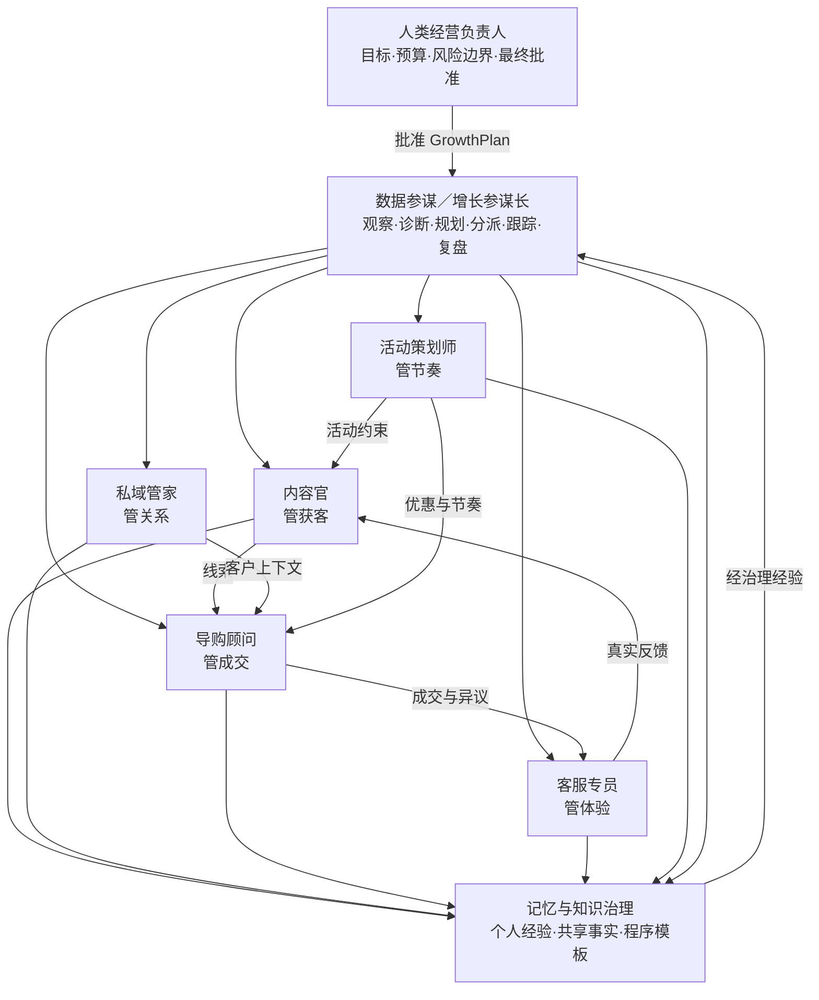

# 228-电商增长参谋长与六数字同事协同进化实施方案

> 状态：**通用母方案 · 实施前冻结稿（不授权直接编码或生产写回）**
> 版本：v1.0 · 2026-08-02
> 适用范围：初创及成长型电商店铺；平台型、独立站、私域商城均可配置复用
> 首个实例：栖月汇 Niushop 微商城
> 权威关系：本文件定义通用经营模型；各平台专项只补充数据映射、渠道能力与行业差异，不得重写本文件的审批、任务、复盘和记忆契约
> 实施文档：[G0～G6 索引与路线图](228-电商增长参谋长实施文档索引与分波路线图.md) · [G0 契约与安全底座](228-电商增长参谋长G0契约与安全底座实施方案.md)

---

## 0. 使用的 Rules

| Rule | 本方案约束 |
|---|---|
| 业务目标优先 | 解决健康、快速、稳定增长，而不是堆叠智能体或页面 |
| 数据参谋总控 | 数据参谋观察、诊断、制定方案、拆解任务、跟踪和复盘；人类经营负责人拥有最终决策权 |
| 人工批准后执行 | 方案版本、预算、触达、发布、优惠和写回在批准前均为 Draft |
| 内外数据有据可查 | 内部数字孪生与外部网络情报必须记录来源、时间、可信度和适用范围 |
| 多智能体契约协作 | 通过任务 DAG 和 Handoff 契约协作，不共享无边界上下文 |
| 记忆受治理 | 六个数字同事各有记忆；经验经证据、复盘和 Evals 后才能晋升为长期能力 |
| 租户与隐私隔离 | 客户、会话、订单、记忆和任务均绑定 org/project；PII 默认最小化、脱敏和限时保留 |
| 失败关闭 | 搜索、工具、模型、执行器或数据源未注册时明确失败，不用假数据或假成功补齐 |
| 分波回归 | 每波均通过契约、单元、集成、权限、负向、浏览器主流程和上一波回归后才能推进 |

---

## 1. 定位与核心结论

### 1.1 产品定位

本系统不是“六个聊天机器人”，而是一套面向电商经营的多智能体增长操作系统：

> 数据参谋融合店铺本体数字孪生和外部网络情报，持续研究增长机会，形成可解释的经营方案；方案经人工批准后拆解为任务 DAG，协调其他数字同事执行；完成后自动观察业务效果、归因、复盘，并把经验证的经验沉淀到各自记忆中。

### 1.2 组织模型



### 1.3 优先级纠偏

旧方案中“数据参谋 P2、内容官 P2、Customer 延后”的口径不再适用。通用优先级调整为：

| 级别 | 数字同事 / 能力 | 原因 |
|---|---|---|
| P0 总控 | 数据参谋 | 没有全局观察、计划和复盘，就只是六套孤立功能 |
| P0 核心增长链 | 内容官、导购顾问、客服专员 | 分别解决获客、成交、体验与复购反馈 |
| P1 客户经营 | 私域管家 | 承接身份沉淀、分层、触达、关系和复购 |
| P1/P2 节奏放大 | 活动策划师 | 核心日常链路稳定后再放大流量与成交，避免用促销掩盖基础问题 |
| P0 数据前置 | CustomerLite、内容触点、咨询、推荐、订单反馈 | 三个核心数字同事缺少这些数据无法形成闭环 |

---

## 2. 增长目标与健康边界

### 2.1 目标不是单一 GMV

每个店铺在首次实施时由人类经营负责人选择北极星指标，系统不得自行固定唯一公式。建议同时观察：

| 维度 | 核心指标示例 |
|---|---|
| 获客 | 有效曝光、有效互动、新增线索、获客成本、内容到咨询率 |
| 成交 | 有效咨询、推荐接受率、加购率、支付转化率、客单价、成交周期 |
| 客户 | 新客数、复购率、活跃客户、沉默客户、流失预警、客户终身价值区间 |
| 体验 | 首次响应时间、解决率、履约超时、退款率、投诉率、满意度 |
| 经营质量 | 毛利、优惠成本、库存周转、退货损失、渠道投入产出 |
| 合规 | 内容违规、承诺越界、触达退订、隐私越权、高风险动作拦截 |

### 2.2 增长护栏

任何增长方案必须同时定义停止条件。例如：

- 退款率、投诉率或退订率超过阈值立即暂停。
- 毛利低于批准下限不得继续扩大活动。
- 库存不足或履约能力不足时降低获客与促销节奏。
- 内容或直播出现高风险功效承诺时停止发布并转人工审核。
- 外部情报证据过期、冲突或来源不可靠时不得据此执行客户触达。

---

## 3. 数据参谋的情报体系

### 3.1 内部：店铺本体数字孪生

内部数据回答“店铺真实发生了什么”：

- 店铺、渠道、账号和组织边界。
- 商品、SKU、分类、价格、库存和毛利区间。
- 客户生命周期、授权、标签、触点和关系。
- 内容、曝光、互动、线索和咨询。
- 推荐、异议、加购、订单和支付状态。
- 履约、售后、工单、投诉和满意度。
- 活动、优惠、预算、成本和效果。
- 每次 GrowthPlan、AgentTask、执行产物和复盘结论。

### 3.2 外部：网络与平台情报

外部数据回答“市场正在发生什么”：

- 搜索趋势、热点、季节与节日。
- 竞品内容、卖点、价格、活动和用户反馈。
- 视频号、朋友圈、抖音、小红书、今日头条、闲鱼等渠道的公开内容信号。
- 行业新闻、监管要求、平台政策和内容规范。
- 用户公开讨论、高频问题、种草主题与购买顾虑。

外部网络搜索是只读研究工具，不等于已获得对应平台账号的发布、评论或私信权限。具体平台 API、自动发布和账号操作必须另做 Connector 专项核验。

### 3.3 外部证据契约 `IntelligenceEvidence`

每条外部情报至少保存：

```yaml
evidence_id: ev-...
org_id: org-...
project_id: project-...
source_url: https://...
source_domain: example.com
source_type: official|news|social|competitor|community|other
published_at: 2026-08-01T00:00:00Z
retrieved_at: 2026-08-02T00:00:00Z
summary: 脱敏摘要
claim: 被该证据支持的具体判断
confidence: 0.0-1.0
expires_at: 2026-08-09T00:00:00Z
content_hash: sha256:...
prompt_injection_checked: true
human_verified: false
```

强制规则：

- 搜索内容当作不可信输入，不得携带系统权限、密钥或执行指令进入智能体上下文。
- 涉及平台规则、价格、政策、热点等时效信息必须重新联网核验。
- 方案中的重要判断必须能回到内部数据 revision 或外部证据链接。
- 单一竞品帖子、匿名评论或模型推测不能直接触发客户触达和价格动作。

---

## 4. 数据参谋的每日经营循环

### 4.1 每日节奏

| 时段 | 工作 | 产物 |
|---|---|---|
| 数据就绪后 | 检查数据新鲜度、质量、异常和外部情报有效期 | `DailyDataReadiness` |
| 营业前 | 生成经营晨报、问题清单和机会清单 | `DailyBrief` |
| 晨报后 | 形成 3～5 项高价值增长任务草案 | `GrowthPlan.DRAFT` |
| 人工批准后 | 冻结方案 revision，建立任务 DAG 并分派 | `GrowthPlan.APPROVED`、`AgentTask[]` |
| 营业中 | 跟踪执行、阻塞、预算、风险和先行指标 | `ExecutionObservation[]` |
| 营业后 | 检查交付、观察结果、形成初步复盘 | `EffectReview.PRELIMINARY` |
| 效果窗口结束 | 完成归因、经验提炼和记忆候选 | `EffectReview.FINAL`、`MemoryCandidate[]` |

不要求固定自然时刻；各店铺按时区、数据延迟和营业节奏配置。数据未就绪时晨报必须显示缺口，不能使用旧数据伪装为今日判断。

### 4.2 数据参谋 6 条核心 Logic

| ID | Logic | 核心节点 | 输出 |
|---|---|---|---|
| D01 | 数据与经营健康巡检 | input → query_internal → validate_freshness → detect_anomaly → handoff | 健康评分与阻断项 |
| D02 | 内外机会研究 | query_internal → web_search → evidence_filter → compare → rank | 有证据的机会清单 |
| D03 | 增长方案生成 | read_goals → read_constraints → compose_plan → risk_check → handoff | `GrowthPlan.DRAFT` |
| D04 | 审批后任务拆解 | load_approved_plan → decompose → validate_dag → assign | `AgentTask[]` |
| D05 | 执行监控与调整建议 | observe_tasks → observe_metrics → check_guardrails → branch | 继续、调整、暂停建议 |
| D06 | 效果归因与复盘 | collect_outcomes → compare_baseline → attribution → review → memory_candidates | 最终复盘和经验候选 |

说明：`query_internal`、`web_search`、`assign`、`attribution` 均是目标态受控 Tool adapter；未注册时对应 Logic 不得发布。

---

## 5. 方案、审批与任务 DAG

### 5.1 `GrowthPlan` 契约

```yaml
plan_id: gp-...
revision: 1
org_id: org-...
project_id: project-...
status: DRAFT|PENDING_APPROVAL|APPROVED|RUNNING|OBSERVING|REVIEWED|CANCELED
period:
  start_at: ...
  end_at: ...
business_problem: ...
baseline_metrics: []
objectives: []
guardrails: []
internal_evidence_refs: []
external_evidence_refs: []
assumptions: []
tasks: []
budget: {}
risk_level: low|medium|high|critical
approval_policy: ...
approved_revision: null
approved_by: null
approved_at: null
effect_window: ...
stop_conditions: []
```

任何目标、任务、预算、渠道或风险边界变化都产生新 revision；旧批准不得自动覆盖新 revision。

### 5.2 `AgentTask` 契约

每项任务至少包含：

- `task_id`、`plan_id`、`plan_revision`、org/project。
- 负责数字同事、协作数字同事和人工负责人。
- 目标、输入引用、前置依赖和验收指标。
- 允许的数据域、工具、模型、渠道、预算和最长执行时间。
- 风险等级、审批策略和禁止动作。
- 预期产物、产物版本和证据引用。
- 效果观察窗口、停止条件和回滚说明。

### 5.3 状态机

```text
DISCOVERED → PLANNED → PENDING_APPROVAL → APPROVED → ASSIGNED
          → RUNNING → DELIVERED → ACCEPTED → OBSERVING
          → REVIEWED → MEMORY_CANDIDATE → CLOSED

任一阶段可进入：BLOCKED / REJECTED / PAUSED / CANCELED / FAILED
```

### 5.4 审批分级

| 风险 | 示例 | 默认策略 |
|---|---|---|
| 低 | 只读分析、生成草稿、沙箱演练 | 可自动执行但完整留痕 |
| 中 | 内容发布、普通客户触达、低额度优惠草案 | 人工批准后执行 |
| 高 | 批量触达、价格调整、公开直播、售后处置 | 双人或指定角色批准 |
| 严重 | 支付、退款、库存扣减、账户权限、不可逆操作 | 专项安全评审；默认禁止自动执行 |

当前平台 C0.2 安全闭环完成前，所有对外发布、触达和业务写回均保持 Draft-only。

---

## 6. 六个数字同事的职责与 Logic 地图

### 6.1 总体分工

| 数字同事 | 核心问题 | 主要输入 | 主要输出 | 核心效果指标 |
|---|---|---|---|---|
| 数据参谋 | 今天怎样健康、快速、稳定增长 | 全域数字孪生 + 外部情报 | 方案、任务、跟踪、复盘 | 方案命中率、任务效果、护栏违规率 |
| 内容官 | 客户从哪里来、为什么愿意了解 | 商品、人群、平台、趋势、内容历史 | 内容策略、素材、发布草稿、线索 | 有效线索、内容到咨询率、获客成本 |
| 导购顾问 | 客户为什么买 | 客户上下文、商品、库存、咨询 | 诊断、推荐、对比、促单建议 | 推荐接受率、咨询支付转化、客单 |
| 客服专员 | 客户为什么信任并留下 | 客户、订单、履约、政策、会话 | 解答、工单、升级、反馈 | 解决率、满意度、退款/投诉、响应时间 |
| 私域管家 | 如何建立长期客户关系 | CustomerLite、触点、订单、授权 | 分层、排期、触达草稿、复购任务 | 可触达客户、复购、沉默召回、退订率 |
| 活动策划师 | 何时放大、如何控制节奏 | 商品、库存、毛利、客户、历史活动 | 活动方案、预算、节奏、复盘 | 增量成交、毛利、库存健康、活动 ROI |

### 6.2 内容官：跨平台获客增长系统

内容官不是文案生成器，而是跨平台获客、内容生产、线索识别和效果优化的专业数字同事。

#### 8 条 Logic

| ID | 能力 | 输出 |
|---|---|---|
| C01 | 热点、竞品与获客机会研究 | 有证据的选题机会池 |
| C02 | 人群与内容策略 | `ContentBrief`、渠道目标、CTA |
| C03 | 文案与种草内容生产 | 朋友圈、小红书、头条、闲鱼等内容变体 |
| C04 | 短视频策划 | 钩子、口播、分镜、字幕、画面和 CTA |
| C05 | 多平台适配 | 各平台独立 `ContentVariant` |
| C06 | 事实、品牌与合规审核 | 审核报告和发布 Draft |
| C07 | 评论、私信、直播互动线索识别 | `LeadSignal` 并 Handoff 给导购顾问 |
| C08 | 内容到成交归因与优化 | 复盘、A/B 结论、记忆候选 |

#### 渠道矩阵

| 渠道 | 主要形态 | 内容官重点 | 首期交付边界 |
|---|---|---|---|
| 微信视频号 | 短视频、直播 | 视频脚本、直播策划、私域承接 | 草稿与演练；账号操作另做 Connector 核验 |
| 微信朋友圈 | 图文、短视频、客户案例 | 分人群种草、信任和复购内容 | 生成审核后的触达素材，不假设自动发布 API |
| 抖音 | 短视频、直播 | 钩子、口播、互动、直播转化 | 脚本、素材和线索契约优先 |
| 小红书 | 笔记、测评、攻略、搜索内容 | 种草、搜索词、真实体验表达 | 笔记草稿、多版本审核与效果复盘 |
| 今日头条 | 图文、资讯、视频 | 专业内容、信息流和搜索获客 | 长图文与视频脚本草稿 |
| 闲鱼 | 商品描述、帖子、咨询 | 高意向流量、场景化描述、议价承接 | 商品文案和咨询 Handoff；不自动改价 |

平台规则、开放接口和账号授权具有时效性，专项实施前必须联网核验官方规则，不能把此矩阵当作现成自动发布能力。

#### 数字人交互式直播

数字人直播作为内容官的独立子系统：

```text
直播目标 → 商品与人群 → 直播脚本 → 商品知识校验
        → 数字人演练 → 实时问答 → 高意向线索 Handoff
        → 风险转人工 → 直播归因与复盘
```

至少包含直播主题、商品排期、讲解/转场、数字人形象与声音、商品知识、实时问答、敏感问题拒答、人工接管、商品卡草稿、线索交接和效果复盘。

实施分级：

1. 脚本、分镜、排期和离线问答演练。
2. 沙箱数字人直播与合规 Evals。
3. 有人值守的真实直播。
4. 只有稳定通过安全、版权、平台规则和人工接管演练后，才评估有限自动化。

### 6.3 导购顾问：咨询到成交

| ID | Logic | 目标 |
|---|---|---|
| G01 | 客户需求诊断 | 形成结构化需求、预算、场景和禁忌 |
| G02 | 商品检索与推荐 | 在可售、库存、价格和客户约束下给出 Top N |
| G03 | 商品成分/属性解释 | 解释事实，医疗或功效越界转人工 |
| G04 | 商品对比与搭配 | 透明说明差异、优缺点和使用顺序 |
| G05 | 异议识别与处理 | 处理价格、效果、信任、物流等顾虑 |
| G06 | 促单与成交 Handoff | 生成可解释建议；优惠和承诺需审批 |

导购顾问只能读取当前客户授权范围内的上下文，不得利用敏感属性做歧视性定价或不透明操纵。

### 6.4 客服专员：体验、信任与真实反馈

| ID | Logic | 目标 |
|---|---|---|
| S01 | 意图与情绪识别 | 分类咨询、订单、物流、售后、投诉并识别紧急度 |
| S02 | 身份与订单安全查询 | 最小信息验证后返回脱敏订单事实 |
| S03 | 物流查询与异常分诊 | 识别延迟、丢失、破损、退回并生成处理草案 |
| S04 | 售后资格与工单 | 依据政策形成退款、退换、补发等工单草稿 |
| S05 | 投诉与人工升级 | 共情、收集证据、按风险移交人工 |
| S06 | 满意度与问题反哺 | 将真实问题反馈给内容官、导购和数据参谋 |

客服反馈是内容真实性和导购质量的重要监督信号：高频误解、退款原因和投诉必须反向约束内容与推荐。

### 6.5 私域管家：客户关系与复购

| ID | Logic | 目标 |
|---|---|---|
| P01 | 客户身份沉淀 | 在授权前提下关联渠道身份与 CustomerLite |
| P02 | 客户标签与分层 | 基于可解释规则生成标签和生命周期阶段 |
| P03 | 跟进与触达排期 | 控制时机、频率、渠道和退订边界 |
| P04 | 沉默客户与复购机会 | 识别窗口并生成召回任务草案 |
| P05 | 关系反馈 | 记录客户反应，更新导购与内容上下文 |

### 6.6 活动策划师：经营节奏与放大

| ID | Logic | 目标 |
|---|---|---|
| A01 | 活动机会与目标 | 根据库存、客户、内容和季节确定是否需要活动 |
| A02 | 人群、商品与机制 | 选择适合的对象、商品、优惠和门槛 |
| A03 | 预算与毛利模拟 | 在批准预算与毛利护栏内模拟方案 |
| A04 | 跨同事任务编排 | 给内容、私域、导购、客服分配活动子任务 |
| A05 | 执行监控与止损 | 观察库存、毛利、投诉和履约并建议暂停 |
| A06 | 活动复盘 | 判断增量效果和长期客户质量 |

### 6.7 Logic 总量与分波原则

目标态共 37 条 Logic：数据参谋 6、内容官 8、导购顾问 6、客服专员 6、私域管家 5、活动策划师 6。它们是能力地图，不代表首波一次开发完成。每条 Logic 必须单独拥有：

- 版本化图、输入输出 Schema、Tool allowlist。
- 正向、边界、缺字段、越权、下游失败和提示词注入 Evals。
- 可追踪运行历史、Handoff、产物和 EffectReview。
- 未满足数据、适配器或安全前置时保持 Blocked。

---

## 7. 三个核心增长闭环

### 7.1 新客获客与成交

```text
数据参谋发现机会
  → 内容官生产并审核多平台内容
  → 内容互动形成 LeadSignal
  → 导购顾问诊断、推荐和处理异议
  → 订单/支付状态反馈
  → 客服专员保障体验
  → 数据参谋归因
  → 内容官/导购/客服形成经验候选
```

### 7.2 老客复购

```text
数据参谋识别复购窗口
  → 私域管家筛选已授权客户并安排触达
  → 内容官生成分人群复购内容
  → 导购顾问推荐适配商品
  → 客服专员处理订单与售后
  → 数据参谋观察复购、毛利、退订和投诉
```

### 7.3 客户问题驱动产品与内容优化

```text
客服专员聚合问题/投诉/退款原因
  → 数据参谋判断规模与影响
  → 内容官修正容易误解的表达
  → 导购顾问修正推荐和承诺
  → 活动策划师暂停不合适的推广
  → 后续退款/投诉指标验证效果
```

---

## 8. 通用本体与数据契约

### 8.1 当前内核与目标模型的区别

当前平台已冻结的电商核心 7 OT 为 `Shop`、`Product`、`ProductSku`、`Category`、`Order`、`OrderLine`、`Shipment`。本方案定义的增长模型是下一阶段目标，不能在实现前宣称已经存在。

### 8.2 第一业务波次必须新增的最小对象

| 对象 | 目的 | 隐私边界 |
|---|---|---|
| `CustomerLite` | 支撑人群、咨询、推荐、客服和复购 | 使用脱敏主键；默认不含姓名、手机号、地址、OpenID |
| `ContentBrief` | 统一人群、商品、渠道、目标和 CTA | 不嵌入客户明细 |
| `ContentAsset` | 管理文案、脚本、图片/视频引用和版权信息 | 保存资产引用与版本，不复制未经授权内容 |
| `ContentVariant` | 管理各平台独立版本、审核和发布状态 | 发布凭证使用 secret_ref |
| `LeadSignal` | 表达互动产生的高意向线索 | 最小上下文、来源、同意状态和有效期 |
| `ConsultationSession` | 记录咨询目标、关键需求和 Handoff | 会话脱敏、限时保留、按客户授权访问 |
| `Recommendation` | 记录推荐、理由、候选商品和客户反馈 | 不存隐含敏感推断 |
| `ServiceCase` | 记录问题、订单引用、风险和处理状态 | 客服权限隔离；敏感附件单独治理 |

后续对象包括 `Campaign`、`ChannelAccount`、`PublishPlan`、`LiveSession`、`Experiment`、`GrowthPlan`、`AgentTask`、`EffectReview` 和 `MemoryItem`。

### 8.3 `CustomerLite` 最小字段

- 脱敏 `customer_id`、org/project、source/`site_id`、渠道/`weapp_id`。
- 首次/最近成交时间、订单次数、成交额区间而非不必要明细。
- 生命周期阶段、可解释偏好标签、会员/店主等业务标签。
- 授权状态、允许渠道、允许用途、触达频率和退订状态。
- 数据来源、更新时间、保留期限和字段敏感等级。

姓名、手机号、详细地址、OpenID、完整聊天记录和支付凭据不进入普通 Logic 上下文。

---

## 9. 多智能体 Handoff 契约

智能体之间只传递完成下一任务所需的最小上下文：

```yaml
handoff_id: ho-...
plan_id: gp-...
task_id: task-...
from_agent: content_officer
to_agent: shopping_guide
org_id: org-...
project_id: project-...
purpose: 承接高意向咨询
input_refs:
  - lead:lead-...
  - content_variant:cv-...
summary: 客户关注补水与敏感肌适配
allowed_fields: [intent, product_ids, source_channel, consent_scope]
forbidden_fields: [phone, address, credential]
expires_at: ...
expected_output_schema: recommendation_v1
risk_level: medium
```

必须验证：来源任务已批准、目标智能体允许接收、字段在授权范围内、引用存在且未过期、org/project 一致。跨租户、超字段或过期 Handoff 必须失败关闭。

---

## 10. 自动复盘与效果归因

### 10.1 复盘状态

```text
交付完成 → 产物验收 → 业务执行确认 → 效果观察
        → 基线/对照比较 → 归因判断 → 最终复盘
        → 记忆候选 → 记忆治理 → 关闭
```

任务完成不等于方案有效。复盘必须区分：

- `EFFECTIVE`：有足够证据支持目标改善。
- `INEFFECTIVE`：已执行但没有达到目标。
- `HARMFUL`：触发退款、投诉、毛利、合规等负向护栏。
- `INCONCLUSIVE`：数据不足、观察期不足或干扰因素太多。
- `NOT_EXECUTED`：产物存在但未真正发布、触达或应用。

### 10.2 归因要求

- 优先使用 A/B、分组、分批或前后对照。
- 记录价格、库存、节日、平台流量、活动等干扰因素。
- 无对照或样本不足时只能表述为相关性推断。
- 内容曝光、互动、咨询、推荐、订单和支付必须通过可追踪 ID 关联。
- 不能把自然增长全部归功于智能体。

### 10.3 `EffectReview`

至少包含基线、目标、实际值、护栏、任务完成情况、归因方法、置信度、有效/无效结论、意外影响、继续/扩大/停止建议和记忆候选。

---

## 11. 六个数字同事的记忆与协同进化

### 11.1 四层记忆

| 层 | 用途 | 生命周期 | 示例 |
|---|---|---|---|
| Working | 当前任务上下文和中间结果 | 任务级 TTL | 当前商品、客户需求、待审批内容 |
| Episodic | 做过什么、当时条件和结果 | 可检索、可过期 | 某类笔记在某人群中的转化结果 |
| Semantic | 稳定事实与经验证知识 | 版本化治理 | 品牌规则、商品事实、售后政策、平台规范 |
| Procedural | 怎样更好完成任务 | 严格评测后发布 | 需求诊断步骤、短视频钩子模板、投诉升级流程 |

### 11.2 每个智能体的专业记忆

| 数字同事 | 重点记忆 |
|---|---|
| 数据参谋 | 指标规律、诊断树、方案组合、归因误区和护栏经验 |
| 内容官 | 平台风格、选题、钩子、脚本、素材、发布时间和获客效果 |
| 导购顾问 | 需求模式、推荐理由、异议、搭配和成交反馈 |
| 客服专员 | 问题类型、解决方式、情绪处理、升级和满意度 |
| 私域管家 | 分层、触达节奏、客户反应、复购窗口和退订边界 |
| 活动策划师 | 机制、预算、毛利、库存、节奏和活动增量效果 |

### 11.3 共享记忆

共享区只存经过权限和事实治理的内容：商品事实、品牌规范、客户授权状态、平台规则、售后政策、已验证经营知识和跨智能体协作契约。一个智能体不得直接读取另一个智能体的全部工作记忆或敏感会话。

### 11.4 经验晋升流程

```text
任务经验
  → MemoryCandidate（附计划、任务、条件和效果证据）
  → 去敏、去重、冲突与适用范围检查
  → 多次结果或明确对照验证
  → Agent Evals + 全局回归
  → 人工/治理策略批准
  → 发布为版本化长期记忆
  → 持续监控，失效时降级或撤回
```

禁止：

- 一次偶然成功直接变成长期规律。
- 将客户敏感明细写入共享记忆。
- 自动修改系统提示词、生产代码、权限或安全规则。
- 使用其他租户经验中的业务数据；跨租户最多复用脱敏、抽象、经授权的通用方法。
- 记忆与当前商品事实、政策或平台规则冲突时仍继续使用。

### 11.5 “越来越聪明”的可验证定义

智能体能力增强必须反映在版本化 Evals 中：任务成功率、事实准确率、护栏违规率、人工修改率、首次交付通过率、业务效果和置信度校准持续改善。仅仅积累更多文本不等于变聪明。

---

## 12. 增长参谋长工作台

### 12.1 首页

- 今日经营健康与数据就绪状态。
- 数据参谋晨报：核心问题、机会、证据和不确定性。
- 今日 3～5 项增长任务草案。
- 待批准方案、预算、内容、触达和高风险动作。
- 六个数字同事的任务、状态、阻塞和产物。
- 正在观察的业务效果和已触发护栏。
- 昨日/上周复盘与新增记忆候选。

### 12.2 方案详情

- 指标树、基线、目标、护栏和假设。
- 内部 Dataset revision 与外部证据链接。
- 可视化任务 DAG、负责人、依赖、预算和时间。
- 方案版本差异、批准记录和撤回能力。
- 执行日志、产物、效果观察和最终复盘。

### 12.3 数字同事详情

- 角色边界、当前可用 Logic 和被阻断 Logic。
- 今日任务、历史任务、成功率和人工修改率。
- Working/Episodic/Semantic/Procedural 记忆分层视图。
- 记忆来源、适用范围、证据、版本、置信度和撤回记录。
- Evals、发布 revision 和工具权限。

---

## 13. FDE 交付包

```text
ecommerce-growth-fde/
  manifest.yaml
  goals/metric-tree.yaml
  ontology/core-growth.yaml
  evidence/source-policy.yaml
  agents/
    data_strategist.yaml
    content_officer.yaml
    shopping_guide.yaml
    customer_service.yaml
    private_domain_keeper.yaml
    campaign_planner.yaml
  logic/D01..D06.yaml
  logic/C01..C08.yaml
  logic/G01..G06.yaml
  logic/S01..S06.yaml
  logic/P01..P05.yaml
  logic/A01..A06.yaml
  evals/
  handoff/contracts.yaml
  memory/policies.yaml
  workshop/growth-command-center.yaml
  approval/policies.yaml
  evidence/preflight.json
  evidence/regression.json
  rollback/manifest.yaml
```

FDE 只生成可审查配置和差异计划。任何 apply 都必须显式指定不可变 `bundle_id`、目标 org/project、批准 revision 和回滚 manifest。

---

## 14. 分波实施计划

### G0：契约、证据与安全底座

- 冻结 GrowthPlan、AgentTask、Handoff、EffectReview、MemoryItem 契约。
- 完成 org/project、PII、审批、工具 allowlist 和 C0.2 前禁写边界。
- 建立外部搜索只读适配器、来源引用、时效与提示词注入防线。
- 建立“未注册适配器必须失败”的负向门禁。

### G1：增长参谋长最小闭环

- 数据参谋 D01～D06 全部进入最小闭环；外部搜索是参谋长的 P0 只读研究能力，不后置。
- 内部数字孪生 + G0 受控网络搜索适配器；搜索结果必须带引用和时效，但不自动操作平台账号。
- 方案 Draft → 人工批准 → 任务分派 → 交付 → 观察 → 复盘。
- 增长参谋长工作台首版。
- 先具备任务级 Working Memory 和完整运行历史；长期经验晋升仍由 G4 治理。

### G2：CustomerLite 与三个核心数字同事

- CustomerLite、ContentBrief/Variant、LeadSignal、ConsultationSession、Recommendation、ServiceCase。
- 内容官 C02-C08，导购顾问 G01-G06，客服专员 S01-S06。
- 跑通“内容获客 → 咨询 → 推荐 → 成交反馈 → 客服反馈 → 内容优化”。
- 所有发布、触达和业务动作仍是 Draft-only。

### G3：私域、活动与完整数据参谋

- 私域管家 P01-P05、活动策划师 A01-A06，并扩展数据参谋的跨周期、跨渠道分析能力。
- 老客复购、活动放大、毛利/库存/体验护栏。
- 增加可解释对照与归因能力。

### G4：协同记忆与进化

- 四层记忆、个人/共享边界、MemoryCandidate 和治理工作流。
- 为六个数字同事建立独立 Evals 基线与记忆晋升回归。
- 先推荐记忆、人工批准发布；稳定后才评估低风险自动晋升。

### G5：渠道 Connector 与数字人直播

- 对视频号、朋友圈、抖音、小红书、今日头条、闲鱼逐个平台核验官方能力和账号权限。
- 先预览/草稿，再人工发布，再有限自动化。
- 数字人直播按演练、沙箱、有人值守、有限自动化分级。

### G6：受控生产 Action

- 前置 C0.2、审批、幂等、审计、补偿、回滚和人工接管全部通过。
- 从低风险、可逆动作开始；支付、退款、库存和账户权限继续专项治理。

每波必须独立形成新的 `228-` 实施方案，先方案、再编码、再单测/集成/回归；上一波未通过不得进入下一波。

---

## 15. 测试与验收

| 层 | 必测项 |
|---|---|
| 数据 | 新鲜度、完整性、唯一键、PII 最小化、跨租户、断流和旧数据 |
| 外部搜索 | 来源、时间、引用、冲突证据、虚假内容、提示词注入、失效链接 |
| 方案 | 目标/护栏完整、证据可追溯、revision 批准绑定、修改后失效 |
| 任务 DAG | 无环、依赖、超时、重试、暂停、撤回、幂等、Handoff 最小字段 |
| Agent | 37 Logic 的契约、正负向 Evals、工具未注册失败关闭 |
| 协作 | 获客成交、老客复购、客服反哺三个端到端场景 |
| 复盘 | 未执行、无结论、有害、相关性/因果区分和停止条件 |
| 记忆 | 去敏、去重、冲突、过期、版本、撤回、跨租户与 Evals 回归 |
| Workshop | 真实空态、状态追踪、审批、证据、阻塞、记忆治理和可访问性 |
| 安全 | C0.2、权限、密钥、日志、批量触达、内容合规和人工接管 |

首个可用里程碑必须真实完成：

1. 数据参谋基于真实内部数据和有引用的外部证据生成一个 GrowthPlan Draft。
2. 人工批准指定 revision。
3. 至少向内容官、导购顾问、客服专员分派一组有依赖的任务。
4. 三者产物、Handoff 和状态可追踪。
5. 业务执行后形成 EffectReview；数据不足时诚实输出 INCONCLUSIVE。
6. 生成带证据的 MemoryCandidate，但未经治理不得进入长期记忆。

---

## 16. 与现有文档的关系

| 文档 | 关系 |
|---|---|
| [电商平台接入总方案](000-电商平台接入总方案.md) | 数据接入与跨平台总架构 |
| [AIP 决策引擎升级方案](11-AIP决策引擎升级方案/00-总览-从Mock到真实Harness.md) | 六数字同事原始技能设计；其旧优先级由本文件纠偏 |
| [工作台层方案](12-工作台层方案/00-总览-从OrderManagement到数字同事工作台.md) | Workshop 通用设计；增长参谋长首页以本文件为准 |
| [FDE 技能编排方案](13-FDE技能编排方案/00-总览-从静态文档到可编排技能链.md) | FDE 原始框架；bundle、审批和回归契约以本文件为准 |
| [行业 Wiki 方案](14-行业Wiki基础设施方案/00-总览-三层记忆系统.md) | 知识基础；智能体四层记忆和晋升以本文件为准 |
| [微商城 FDE 规格](微商城电商接入方案/228-微商城专项实施准备与FDE全链路规格.md) | 栖月汇实例；负责 Niushop 数据映射、管道和专项边界 |

发生冲突时按以下优先级解释：平台安全与 C0.2 门禁 → 本通用母方案 → 最新平台专项 `228-` → 旧六数字同事设计稿。

---

## 17. 本文完成边界与下一步

本文已经冻结：

- 数据参谋作为增长参谋长的总控地位。
- 六数字同事的职责、37 条 Logic 能力地图与核心协作链。
- 内外情报、人工批准、任务 DAG、自动复盘和效果归因。
- 四层个人记忆、共享记忆与受治理的协同进化机制。
- 内容官的六渠道获客范围和数字人交互式直播分级。
- CustomerLite 前置、工作台、FDE、分波和验收门禁。

本文不代表相关功能已经开发。G0～G6 实施方案已经全部编写，完整入口见[实施文档索引与分波路线图](228-电商增长参谋长实施文档索引与分波路线图.md)；它们当前仍是方案稿，不代表已评审、已授权或已开发。必须先评审并冻结 [G0 契约与安全底座实施方案](228-电商增长参谋长G0契约与安全底座实施方案.md)，完成 G0 编码、测试和累计回归后，才能按依赖进入下一波。
