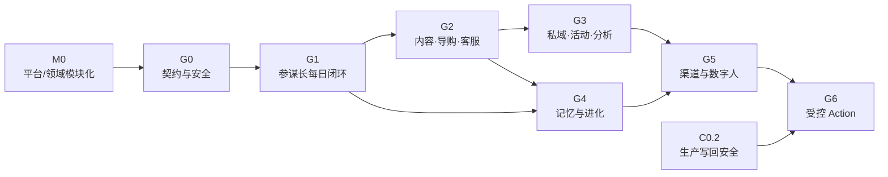

# 228-电商增长参谋长实施文档索引与分波路线图

> 状态：实施文档总索引
> 版本：v1.9 · 2026-08-03
> 目录约束：本系列所有文档均直接放在 `docs/palantier/20_tech/电商平台接入/`
> 通用母方案：[228-电商增长参谋长与六数字同事协同进化实施方案](228-电商增长参谋长与六数字同事协同进化实施方案.md)
> 平台模块化前置：[AOS 通用平台内核与领域资产包模块化分治方案](../228-AOS通用平台内核与领域资产包模块化分治方案.md)
> 电商装箱前置：[电商领域包、平台适配包与接入实例交付方案](228-电商领域包平台适配包与接入实例交付方案.md)
> M0 编码实施门：[228-M0 资产包注册、解析、安装与证据化接入案例实施方案](228-M0-资产包注册解析安装与证据化接入案例实施方案.md)
> M2 公共契约门：[228-M2 Resolver、Lock 与 Installation 公共契约冻结方案](228-M2-Resolver-Lock-Installation公共契约冻结方案.md)
> M2-B 编码门：[228-M2-B 安装控制面与 Canonical API 并行实施方案](228-M2-B安装控制面与Canonical-API并行实施方案.md)

---

## 0. 使用的 Rules

| Rule | 约束 |
|---|---|
| 先方案后编码 | 当前波次方案未冻结，不进入编码 |
| 单波退出 | 当前波次专项、累计与主流程回归全部通过，才能开始下一波 |
| 通用优先 | 先实现平台通用能力，平台/店铺专项只做配置、映射和 Connector |
| 诚实状态 | `已编写`、`已评审`、`开发中`、`已完成`严格区分 |
| 变更隔离 | 每波明确文件所有权，避免多人并行冲突 |
| 风险前置 | C0.2、租户、审批、PII、外部情报和记忆治理先于自动执行 |
| 模块化前置 | 平台通用外壳进入 AOS 内核；电商 Spec 进入 SolutionPack；平台差异进入 AdapterPack；客户差异进入 InstanceOverlay |

---

## 1. 文档体系

| 波次 | 文档 | 目标 | 状态 |
|---|---|---|---|
| M0 架构 | [AOS 平台模块化分治方案](../228-AOS通用平台内核与领域资产包模块化分治方案.md) + [电商模块化交付方案](228-电商领域包平台适配包与接入实例交付方案.md) | 冻结平台内核、领域包、平台适配包、实例、FDE 资产和接入案例边界 | **已评审冻结·2026-08-03** |
| M0 实施 | [M0 资产包注册、解析、安装与证据化接入案例实施方案](228-M0-资产包注册解析安装与证据化接入案例实施方案.md) | M1～M5 的 Registry、Resolver、Installation、Evidence、FDE 页面、接入案例与电商夹具 | **已评审冻结·2026-08-03·开发中** |
| M2 契约 | [M2 公共契约](228-M2-Resolver-Lock-Installation公共契约冻结方案.md) + [M2-B 安装控制面实施方案](228-M2-B安装控制面与Canonical-API并行实施方案.md) | 冻结 M2 DTO、hash、解析预算、immutable revision、CAS/幂等、事务、权限、证据、API 和退出门 | **M2-A、M2-B 最终 GREEN·允许进入 M3** |
| 总纲 | [电商增长参谋长与六数字同事协同进化实施方案](228-电商增长参谋长与六数字同事协同进化实施方案.md) | 冻结组织模型、37 Logic、任务、复盘、记忆和分波 | 已编写 |
| G0 | [G0 契约与安全底座实施方案](228-电商增长参谋长G0契约与安全底座实施方案.md) | GrowthPlan、AgentTask、Evidence、Handoff、Review、Memory 契约；租户、审批、证据和路由门禁 | 已编写 |
| G1 | [G1 每日经营最小闭环实施方案](228-电商增长参谋长G1每日经营最小闭环实施方案.md) | 内外情报 → 晨报 → 方案 → 人工批准 → 任务 → 跟踪 → 初步复盘 | 已编写 |
| G2 | [G2 三个核心数字同事与 CustomerLite 实施方案](228-电商增长参谋长G2三个核心数字同事与CustomerLite实施方案.md) | 内容官、导购顾问、客服专员与 CustomerLite 增长闭环 | 已编写 |
| G3 | [G3 私域活动与跨渠道分析实施方案](228-电商增长参谋长G3私域活动与跨渠道分析实施方案.md) | 私域管家、活动策划师、跨周期/跨渠道数据参谋 | 已编写 |
| G4 | [G4 多智能体记忆与协同进化实施方案](228-电商增长参谋长G4多智能体记忆与协同进化实施方案.md) | 四层记忆、个人/共享边界、候选晋升、Evals 和撤回 | 已编写 |
| G5 | [G5 社交平台 Connector 与数字人直播实施方案](228-电商增长参谋长G5社交平台Connector与数字人直播实施方案.md) | 六类社交流量平台、草稿/发布分级、数字人直播 | 已编写 |
| G6 | [G6 受控生产 Action 与经营自动化实施方案](228-电商增长参谋长G6受控生产Action与经营自动化实施方案.md) | C0.2 后的 Action、Automation、幂等、补偿和人工接管 | 已编写 |

平台实例文档继续放在各平台目录，但必须引用本系列。例如栖月汇实例为：[微商城专项实施准备与 FDE 全链路规格](微商城电商接入方案/228-微商城专项实施准备与FDE全链路规格.md)。

---

## 2. 波次依赖图

允许并行准备方案，不允许绕过依赖进入生产开发：

- G0 是所有波次的代码前置。
- M0 上位架构与编码实施方案均已评审冻结；当前只授权按 M1～M5 开发通用平台能力和最小电商契约/测试夹具，不授权绕入旧 `aos_api/growth_*` 或提前开发 G0～G6。
- G1 只需要任务级 Working Memory，不依赖长期记忆晋升。
- G2 可以与 G4 方案并行，但 G4 开发必须消费 G1/G2 的真实任务与效果证据。
- G5 的只读研究/草稿能力可以提前设计，真实账号操作仍需平台 Connector 和批准。
- G6 必须等待 C0.2 全部退出门关闭。

---

## 3. 每份实施方案的强制章节

每份 `228-` 波次方案必须包含：

1. 使用的 Rules。
2. 业务目标、非目标和真实完成定义。
3. 当前代码/OpenAPI/数据库审计证据。
4. 可复用能力、禁止复用能力和阻断项。
5. 数据模型、状态机、不可变 revision 和租户键。
6. API 请求/响应、错误语义、幂等和并发契约。
7. AIP Logic、Tool adapter、Handoff 和审批边界。
8. Workshop 页面、空态、禁用态和证据追踪。
9. 具体新增/修改文件路径和并行文件所有权。
10. 数据库迁移 upgrade/downgrade 策略。
11. 单元、契约、集成、权限、负向、浏览器和累计回归。
12. 灰度、可观测性、失败处理和回滚。
13. 阶段退出门、证据目录和剩余风险。

禁止在方案中使用：

- “接一下”“调接口”等不可验收描述。
- 把进程内单例、localStorage、mock、固定 expected 当作生产真源。
- 把页面可点击等同于服务端已执行。
- 未注明 org/project、actor、revision、hash、idempotency 的写契约。
- 未注明来源、时间和可信度的外部网络结论。
- 未经复盘和 Evals 的“自动学习”。

---

## 4. 跨波公共契约

以下名词在 G0 冻结，后续不得自行改名或复制定义：

| 契约 | 作用 | 首波所有者 |
|---|---|---|
| `IntelligenceEvidence` | 内部 revision 或外部链接证据 | G0 |
| `GrowthPlan` / `GrowthPlanRevision` | 经营方案与不可变版本 | G0 |
| `GrowthApprovalEvent` | 提交、批准、驳回、撤回审计 | G0 |
| `AgentTask` / `TaskDependency` | 多智能体任务与 DAG | G0 |
| `AgentHandoff` | 智能体间最小上下文移交 | G0 |
| `ExecutionArtifact` | 任务产物与证据引用 | G0/G1 |
| `ExecutionObservation` | 执行与指标观察 | G1 |
| `EffectReview` | 方案效果复盘 | G0 契约、G1 实现 |
| `MemoryCandidate` / `MemoryItem` | 经验候选与长期记忆 | G0 契约、G4 实现 |
| `CustomerLite` | 隐私最小客户增长对象 | G0 边界、G2 实现 |

模块化所有权以 M0 文档为上位约束：`EvidenceRef`、`PlanEnvelope`、`TaskGraph`、`HandoffEnvelope`、`ReviewEnvelope`、`MemoryCandidateEnvelope` 和 `ActionProposal` 属于平台通用外壳；`GrowthPlanSpec`、`CustomerLite`、37 Logic 及其业务 payload 属于 `solution.ecommerce.growth`。后续文档中的旧 `GrowthPlan` 名称应理解为 `PlanEnvelope<GrowthPlanSpec>` 的领域视图。

后续波次只能通过显式版本升级扩展字段，不能创建同义平行模型。

---

## 5. 测试门矩阵

| 测试门 | G0 | G1 | G2 | G3 | G4 | G5 | G6 |
|---|---:|---:|---:|---:|---:|---:|---:|
| 模型/状态机单测 | 必须 | 必须 | 必须 | 必须 | 必须 | 必须 | 必须 |
| 双租户同 ID 隔离 | 必须 | 必须 | 必须 | 必须 | 必须 | 必须 | 必须 |
| OpenAPI 确定性/无碰撞 | 必须 | 累计 | 累计 | 累计 | 累计 | 累计 | 累计 |
| 角色与职责分离 | 必须 | 必须 | 必须 | 必须 | 必须 | 必须 | 必须 |
| 外部内容/提示词注入 | 契约门 | 必须 | 累计 | 累计 | 累计 | 必须 | 累计 |
| AIP Logic Evals | 基础 | 必须 | 必须 | 必须 | 必须 | 必须 | 必须 |
| 浏览器端到端 | 基础页 | 必须 | 必须 | 必须 | 必须 | 必须 | 必须 |
| API/Web 全量回归 | 必须 | 必须 | 必须 | 必须 | 必须 | 必须 | 必须 |
| 生产写回负向门 | 必须 | 必须 | 必须 | 必须 | 必须 | 必须 | 必须+正向 |

---

## 6. 版本、提交与证据规范

- 每波方案冻结后单独提交，提交信息包含 `docs: 冻结 Gx ...方案`。
- 每个开发小波使用独立提交；合并前记录原提交、集成提交和回归结果。
- 证据统一放在 `docs/palantier/20_tech/evidence/` 的相应波次目录，证据中不得出现密码、Token、PII 或完整外部版权内容。
- 文档中的当前状态只在有代码、测试和回读证据后从“方案”改为“已完成”。
- 任何平台专项不得修改通用契约而不更新本索引和通用母方案。

---

## 7. 当前推进状态

截至 2026-08-03：

- 通用母方案已冻结。
- M0 两份模块化上位方案已于 2026-08-03 评审冻结。
- M0 资产包注册、解析、安装与证据化接入案例实施方案已于 2026-08-03 评审冻结，当前按 M1～M5 开发中。
- M1 已在 `aos-platform m1@7c04cf3` 最终累计回归 GREEN；M2-A0 已在 `m1@cc78e01` 完成公共契约和数据库底座，M2-A1 已在 `m1@a6e4d31` 完成三轮风险封口；M2-B0～B3 已在 `m1@d85992b` 完成控制面、Canonical API、独立对抗、聚合/OpenAPI/CORS 与最终累计门，当前允许进入 M3。
- G0 方案已根据 `aos-platform m1@bc9711a` 完成代码级审计与编写，M0 完成后还需按最新基线复核。
- G1～G6 实施方案已完成编写，形成从每日经营闭环到受控生产 Action 的完整分波设计。
- `已编写` 不等于 `已评审` 或 `已开发`；当前仍不授权任何 G0～G6 代码开发。
- 栖月汇数据库只读核验和专项 FDE 准备已完成，但旧全量脚本继续隔离。
- C0.2 生产写回安全闭环未完成，所有对外发布、触达和业务写回保持 Draft-only。

下一步仍是 M0 → G0 → G1 → G2：先完成 M1～M5 与每波累计回归，再校验并评审 G0 平台外壳和领域 Spec 的编码实施门。只有 M0、G0 依次完成开发和累计回归后，G1 才能进入编码。G3～G6 可继续评审和细化，但不得绕过依赖提前实现生产能力。
