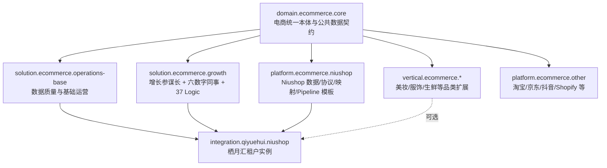

# 228-电商领域包、平台适配包与接入实例交付方案

> 状态：**已评审冻结** · 2026-08-03 评审通过
> 版本：v1.1 · 2026-08-03
> 平台级前置：[AOS 通用平台内核与领域资产包模块化分治方案](../228-AOS通用平台内核与领域资产包模块化分治方案.md)
> 编码实施门：[228-M0 资产包注册、解析、安装与证据化接入案例实施方案](228-M0-资产包注册解析安装与证据化接入案例实施方案.md)
> 电商业务母方案：[电商增长参谋长与六数字同事协同进化实施方案](228-电商增长参谋长与六数字同事协同进化实施方案.md)
> 首个实例：[微商城专项实施准备与 FDE 全链路规格](微商城电商接入方案/228-微商城专项实施准备与FDE全链路规格.md)

---

## 0. 使用的 Rules

- 电商是 AOS 的可安装领域，不是平台内核；所有电商词汇和数据模型留在 Bundle 内。
- 领域共性、经营解决方案、品类扩展、具体平台适配和客户实例分别装箱。
- 新接一个平台应优先新增 PlatformAdapterPack；新接一个客户应只新增 InstanceOverlay，不复制领域代码。
- 新增行业差异优先形成 VerticalPack，不修改电商核心稳定契约。
- Secret、店铺 ID、真实 source/dataset/ontology/run 引用只进入租户实例，不进入公共包。
- 发布包必须不可变、可签名、可评测、可安装、可回滚；实例状态必须由证据计算。
- 栖月汇先作为首个验证实例，不反向定义所有电商平台的通用字段。
- G0～G6 先按本方案校正所有权和文件目录，再评审编码。

---

## 1. 目标与完成定义

本方案把已经设计的电商增长体系拆成可以复用、组合和独立演进的 FDE 资产：



真实完成必须满足：

1. AOS 内核源代码不 import 电商包。
2. 电商包卸载后，平台其他领域能力正常。
3. `solution.ecommerce.growth` 不包含 Niushop 表名、连接参数或栖月汇标识。
4. `platform.ecommerce.niushop` 不包含内容官、导购、私域等经营策略。
5. 栖月汇实例通过精确 composition lock 安装，不复制包内容。
6. FDE 资产页能分别查看领域、解决方案、品类和平台适配包。
7. 接入案例页的栖月汇阶段由真实 Pipeline/Dataset/Ontology/Logic/Workshop 证据计算。

---

## 2. 电商资产包组合

### 2.1 领域与解决方案包

| Bundle ID | kind | 责任 | 主要消费者 |
|---|---|---|---|
| `domain.ecommerce.core` | DomainPack | 统一电商本体、公共枚举、Metric 接口、脱敏和数据质量策略 | 所有电商方案/平台包 |
| `solution.ecommerce.operations-base` | SolutionPack | 数据质量、订单风险、履约、库存和运营摘要等跨平台基础 Logic/Workshop | 需要基础运营闭环的电商实例（可选） |
| `solution.ecommerce.growth` | SolutionPack | GrowthPlanSpec、CustomerLite、六数字同事、37 Logic、增长 Workshop/Evals | 初创/成长电商店铺 |

`domain.ecommerce.core` 是所有电商组合的必选基座；`operations-base`和 `growth` 是可按业务目标独立安装的解决方案包。栖月汇首期同时选择两个解决方案包，不代表后续每个电商实例都必须全量安装。

### 2.2 平台适配包

| Bundle ID | 首批责任 | 明确不负责 |
|---|---|---|
| `platform.ecommerce.niushop` | JDBC/Schema、Niushop 表语义、7 Pipeline 模板、字段映射、能力矩阵 | 六数字同事经营逻辑 |
| `platform.ecommerce.taobao` | TOP/OAuth/签名/限流、字段和事件映射 | 通用电商本体定义 |
| `platform.ecommerce.jd` | 京东平台协议与能力映射 | 栖月汇配置 |
| `platform.ecommerce.douyin` | 抖店数据/内容 capability 和回执 | 通用增长审批 |
| `platform.ecommerce.shopify` | GraphQL/Webhook/Bulk 等适配 | 其他平台条件分支 |

除 Niushop 外的平台当前只定义命名和所有权，不宣称已经开发或具备官方权限。

### 2.3 可选行业包

```text
vertical.ecommerce.beauty
vertical.ecommerce.apparel
vertical.ecommerce.fresh
vertical.ecommerce.food
vertical.ecommerce.consumer-electronics
```

行业包只扩展属性、指标、规则、Evals、Workshop 小组件和默认配置；不得重写核心 Order/Product/CustomerLite 语义或绕过 Action 审批。

### 2.4 接入实例

`integration.qiyuehui.niushop` 是栖月汇在某 org/project 的安装实例，不是可发布公共 Bundle。它引用必选包、Niushop 包和可选行业包的精确版本。

---

## 3. `domain.ecommerce.core` 所有权

### 3.1 统一本体

首版稳定 OT：

- `Shop`
- `Product`
- `ProductSku`
- `Category`
- `Order`
- `OrderLine`
- `Shipment`

后续 Refund、Payment、Full Customer 等通过显式领域版本升级扩展，不由某个平台包私自增加平行同义模型。

### 3.2 公共数据契约

- 电商 ID/时间/金额/币种/订单状态/履约状态的统一语义。
- Source revision → curated Dataset → Ontology revision 的证据引用。
- 电商指标注册接口、数据新鲜度、small-cell 抑制和 PII classification。
- 平台枚举映射的扩展点，不直接包含每个平台映射值。
- 通用 Link：Shop-Product、Product-SKU、Order-Line、Order-Shipment 等。

### 3.3 不进入核心包

- 内容官、活动策划师等 Agent。
- 某个店铺的增长目标和阈值。
- Niushop 表名/SQL、淘宝 API、抖音 Token。
- 栖月汇客户数据和数据库快照。

---

## 4. 电商 SolutionPack 所有权

### 4.1 `solution.ecommerce.operations-base`

该包承载跨平台可复用、但不应进入电商本体核心的基础运营能力：

- 数据质量、订单风险、履约 SLA、库存风险和每日运营摘要 Logic。
- 订单履约、商品库存、客户私域和特色运营 Workshop 的公共声明。
- Logic/Workshop 自身的 Evals、策略和能力依赖声明。
- 微商城专项 L01～L06、W01～W04 首先作为该包的验证样本；经去 Niushop 化和标准 fixture 验证后才能发布为公共资产。

该包不包含 Niushop 表名、栖月汇阈值、真实 Dataset 引用，也不定义六数字同事的增长策略。

### 4.2 `solution.ecommerce.growth`

#### 4.2.1 领域模型

| 分组 | 模型 |
|---|---|
| 方案与任务 | `GrowthPlanSpec`、`EcommerceAgentTaskPayload`、`GrowthEffectReview` |
| 客户增长 | `CustomerLite`、`LeadSignal`、`ConsultationCase` |
| 内容 | `ContentBrief`、`ContentAssetDraft`、`ContentOutcome` |
| 导购 | `RecommendationDraft`、`ConversionOutcome` |
| 客服 | `ServiceCase`、`ServiceReplyDraft`、`ServiceOutcome` |
| 私域/活动 | `CustomerSegmentRevision`、`ContactPolicy`、`CampaignRevision`、`ExperimentRevision` |
| 归因/经验 | `AttributionReport`、`EcommerceExperience` |

这些模型构建在平台 `PlanEnvelope`、`TaskGraph`、`HandoffEnvelope`、`ReviewEnvelope`、`MemoryCandidateEnvelope` 上。

#### 4.2.2 Agent 与 Logic

| Agent | Logic | 数量 |
|---|---|---:|
| 数据参谋 | D01～D06 | 6 |
| 内容官 | C01～C08 | 8 |
| 导购顾问 | G01～G06 | 6 |
| 客服专员 | S01～S06 | 6 |
| 私域管家 | P01～P05 | 5 |
| 活动策划师 | A01～A06 | 6 |
| 合计 |  | 37 |

每个 Logic 是 Bundle 内容资产，引用平台 Tool capability；不能直接 import Niushop adapter。

#### 4.2.3 Workshop

- 增长参谋长总控台。
- 内容官、导购、客服、私域、活动工作台。
- 方案审批、任务 DAG、Handoff、复盘和记忆治理页面声明。
- 页面由包 manifest 注册到允许的 Workshop slot，平台导航在未安装时不显示。

#### 4.2.4 Evals 与策略

- 37 Logic 正负向 Evals。
- 电商事实性、推荐安全、客服承诺、consent/频控、归因和记忆安全套件。
- GrowthPlan 业务护栏和 Draft-only 默认策略。
- 不包含任何平台账号发布权限。

---

## 5. `platform.ecommerce.niushop` 所有权

### 5.1 包含内容

- JDBC/MySQL capability 声明与 Niushop 数据源配置 schema。
- Niushop 版本/表结构 fingerprint、表字段语义和枚举映射。
- 栖月汇已核验数据域的 source selection 模板。
- 7 条通用 Niushop Pipeline 模板及其参数 schema。
- Niushop → `domain.ecommerce.core` 的字段/Link 映射。
- 数据新鲜度、重复、金额、时间、状态和 referential integrity 检查。
- 对 Niushop 可用/不可用能力的 capability manifest。

### 5.2 不包含内容

- 栖月汇数据库 host、port、用户名、密码和真实 SSH 信息。
- 栖月汇真实行数、订单、客户或 shop ID。
- GrowthPlan、六数字同事、内容/推荐/客服策略。
- 对外发布、退款、发货、库存写回能力；这些需后续 Action 专项。

### 5.3 平台版本差异

不同 Niushop 版本通过 schema fingerprint 和 adapter compatibility 表达。发现未知表结构时 preflight 返回 `SCHEMA_UNSUPPORTED`，不自动套用近似映射。

---

## 6. 栖月汇 InstanceOverlay

### 6.1 允许字段

```yaml
apiVersion: aos.dev/v1alpha1
kind: InstanceOverlay
metadata:
  id: integration.qiyuehui.niushop
  revision: 12
spec:
  orgRef: org_...
  projectRef: project_...
  compositionLockRef: lock_...
  sourceRefs:
    niushopPrimary: source_...
  secretRefs:
    niushopCredential: secret_...
  datasetNamespace: qiyuehui-ecommerce
  selectedDomains: [shop, product, sku, category, order, order_line, shipment]
  schedules: []
  featureFlags:
    growthDraftOnly: true
  approvals:
    overlayRevisionRef: approval_...
```

### 6.2 禁止字段

- 明文 password/token/SSH key。
- 客户姓名、手机号、地址、OpenID 或订单明细。
- 修改 Bundle content hash、跳过 Evals 或关闭租户门的配置。
- `productionWritten=true` 等自行宣称完成度字段。

### 6.3 实例 revision

source、包版本、字段选择、调度、阈值和功能旗标变更都产生新 overlay revision；批准绑定精确 overlay hash。运行证据引用实际 revision，不随最新配置漂移。

---

## 7. 电商 Composition 与版本锁

栖月汇第一阶段目标组合：

```yaml
requested:
  - domain.ecommerce.core@1.0.0
  - solution.ecommerce.operations-base@1.0.0
  - solution.ecommerce.growth@1.0.0
  - platform.ecommerce.niushop@1.0.0
optional:
  - vertical.ecommerce.beauty@0.1.0
resolved:
  platformApi: aos@1.7.x
  exactBundles:
    - domain.ecommerce.core@1.0.0#sha256:...
    - solution.ecommerce.operations-base@1.0.0#sha256:...
    - solution.ecommerce.growth@1.0.0#sha256:...
    - platform.ecommerce.niushop@1.0.0#sha256:...
lockHash: sha256:...
```

第一阶段可以暂不安装行业包，避免用未经实证的品类规则污染通用增长闭环。

依赖规则：

- growth 必须依赖 ecommerce core。
- Niushop 只依赖 ecommerce core 和平台 Connector SDK，不依赖 growth。
- vertical 依赖 ecommerce core，可选依赖 growth 的扩展 slot。
- instance 同时选择 solution + platform pack，依赖解析器生成 lock。

---

## 8. FDE Bundle 目录结构

> 以下为未来资产目录，当前只冻结结构，不创建可执行包。

```text
aos-platform/bundles/
  domains/ecommerce-core/
    bundle.yaml
    ontology/
    links/
    metrics/
    data-quality/
    schemas/
    evals/
    migrations/
    rollback/

  solutions/ecommerce-growth/
    bundle.yaml
    backend/ecommerce_growth/
    contracts/
    goals/
    agents/
    logic/
    tools/
    handoff/
    memory/
    policies/
    workshop/
    evals/
    migrations/
    rollback/

  solutions/ecommerce-operations-base/
    bundle.yaml
    backend/ecommerce_operations/
    logic/
    workshop/
    evals/
    migrations/
    rollback/

  platforms/ecommerce-niushop/
    bundle.yaml
    backend/niushop_adapter/
    capabilities/
    connector/
    schemas/
    mappings/
    pipelines/
    data-quality/
    evals/
    migrations/
    rollback/

  verticals/ecommerce-beauty/
    bundle.yaml
    ontology-extensions/
    metric-extensions/
    logic-extensions/
    workshop-extensions/
    evals/
```

InstanceOverlay 保存于平台数据库；只允许通过受控导出产生脱敏 YAML，不在 Git 中保存生产实例。

---

## 9. G0～G6 能力所有权校正

| 波次 | 平台内核资产 | 电商 SolutionPack | PlatformAdapterPack | InstanceOverlay |
|---|---|---|---|---|
| M0 | Registry/Resolver/Installation/Evidence/Case | 包结构冻结 | 包结构冻结 | 实例 schema 冻结 |
| G0 | Plan/Task/Handoff/Approval/Evidence 通用外壳 | Growth Spec 与电商 payload | 无 | 安装/权限配置 |
| G1 | 调度、只读 Research/Metric adapter 基座 | D01～D06、DailyBrief、GrowthReview | 数据 capability | 时区、目标、指标映射 |
| G2 | 通用 Artifact/Observation | CustomerLite、C/G/S Logic、工作台 | 商品/订单只读映射 | consent/启用范围 |
| G3 | 通用 Experiment/Job 外壳（如确需） | 私域、活动、归因业务模型 | 渠道数据映射 | 预算/频控/活动参数 |
| G4 | Memory Candidate/Item/Policy/Retrieval 基座 | EcommerceExperience 与六 Agent 策略 | 无 | scope/retention 配置 |
| G5 | Connector Runtime/OAuth/Webhook 基座 | 内容/直播业务模型与安全策略 | 六社交平台 adapter | 账号 secret_ref/capability snapshot |
| G6 | ActionProposal/Approval/Executor/Automation 基座 | 电商 Action policy/业务 payload | provider executor | 预算、kill switch、批准 |

任何 G 文档的 `aos_api/growth_*` 路径从本方案起视为旧逻辑路径，不得直接照此编码；后续按平台基座或 `bundles/solutions/ecommerce-growth` 重新归属。

---

## 10. API 与能力注册边界

### 10.1 平台 API

- `/v1/asset-bundles*`
- `/v1/bundle-compositions:resolve`
- `/v1/bundle-installations*`
- `/v1/integration-cases*`
- `/v1/extensions/capabilities`

### 10.2 电商包 API

电商业务 API 通过 bundle entrypoint 注册，统一 namespace：

```text
/v1/domains/ecommerce/growth/plans
/v1/domains/ecommerce/growth/tasks
/v1/domains/ecommerce/customer-lite
/v1/domains/ecommerce/content-assets
/v1/domains/ecommerce/campaigns
/v1/domains/ecommerce/memory/candidates
```

电商 API schema 仍进入平台 OpenAPI，但必须带 owner bundle/version，安装冲突检测拒绝重复 operationId/path。

### 10.3 平台适配能力

Niushop 包不暴露自由业务路由；通过 Connector/Metric/Pipeline capability registry 注册，例如：

```text
ecommerce.product.read
ecommerce.inventory.read
ecommerce.order.read
ecommerce.shipment.read
ecommerce.niushop.schema.inspect
```

电商 Logic 只请求 capability，不请求 `niushop.*` 实现；运行时按 instance binding 解析 adapter。

---

## 11. FDE 资产页面的电商视图

安装 `domain.ecommerce.core` 后，FDE 页面应支持：

- 按领域筛选“电商”。
- 查看电商核心、增长解决方案、品类扩展和平台适配四类资产。
- 查看 Growth → Core、Niushop → Core 的依赖图。
- 组合“电商增长 + Niushop”，生成精确 lock 和权限/migration diff。
- 查看 37 Logic、7 Pipeline、Workshop、Evals 等内容清单，但不在资产详情泄露租户数据。
- 在“已安装”查看当前 workspace 的 active version、升级建议、验证证据和回滚点。

平台运行时版本继续在 Apollo Release/Spoke 页面管理，不作为电商 FDE 资产列表的一行。

---

## 12. 接入案例页面的栖月汇视图

### 12.1 状态来源

| 阶段 | 栖月汇必须具备的证据 |
|---|---|
| `planned` | 方案、Composition request、owner |
| `connection_verified` | SSH/JDBC 只读可达、Secret/租户测试 |
| `data_verified` | 7 Pipeline 中相应波次成功、Dataset revision、质量报告 |
| `ontology_verified` | 7 核心 OT/Link 物化与数量/关系对账 |
| `logic_verified` | 6 基础 Logic 或增长 Logic 的 DryRun/Evals/run history |
| `workshop_verified` | 真实数据页面、空态/失败态、浏览器回归 |
| `production_ready` | C0.2、审批、回滚和累计回归全部通过 |
| `production_active` | 真实受控 Action 成功、回执/对账/复盘证据 |

当前 SSH/JDBC 可达只能点亮 `connection_verified` 的部分证据，不能显示“完整模板”或“生产”。

### 12.2 页面详情

- 当前 Composition lock：电商 core/growth/Niushop 精确版本。
- Overlay revision、source/dataset/ontology/logic/workshop refs。
- 每阶段通过/未通过/阻断和证据时间。
- 最近一次 Pipeline、Logic、Evals 和回归。
- 当前 Draft-only/Action disabled 状态。
- 从栖月汇提炼出的可复用改进候选，但不直接发布为公共包。

---

## 13. 从实例经验回流公共资产

栖月汇实施中发现的问题不能直接修改公共包：

```text
实例 Observation/Review
  → AssetImprovementCandidate
  → 判断属于 core / growth / niushop / vertical
  → 去租户化、去 PII、补通用证据
  → Evals 与兼容性测试
  → 人工审查
  → 新 Bundle version
  → 实例显式升级并验证
```

实例经验至少跨 2～3 个同类接入验证后，才考虑进入 core 或通用 solution；仅对 Niushop 成立的进入 Niushop pack；仅对栖月汇成立的继续留在 overlay。

---

## 14. 数据库与迁移分治

| 归属 | 允许操作 |
|---|---|
| 平台 migration | Registry、Installation、Evidence、通用 orchestration/governance 表 |
| DomainPack migration | `ecommerce_core` 自有 namespace/表 |
| SolutionPack migration | `ecommerce_growth` 自有 namespace/表 |
| PlatformAdapterPack migration | `ecommerce_niushop` adapter 元数据/映射，不复制源库 |
| InstanceOverlay | 只产生配置 revision 和 binding，不提交 DDL |

Bundle migration 必须声明 upgrade/downgrade、owned objects、数据保留和依赖。卸载增长包不删除电商核心本体；卸载 Niushop adapter 不删除由其历史运行产生且仍被引用的 canonical evidence。

---

## 15. 测试矩阵

### 15.1 包自身测试

| 包 | 必测 |
|---|---|
| ecommerce core | OT/Link schema、金额/时间/枚举、数据质量、版本兼容 |
| ecommerce growth | 37 Logic、GrowthPlan、CustomerLite、六 Agent、Workshop、Evals、Draft-only |
| Niushop | schema fingerprint、7 Pipeline、映射、数据新鲜度、未知版本失败关闭 |
| vertical | 扩展冲突、默认规则、回退到 core、适用范围 |

### 15.2 组合测试

- core + growth 无任何平台包：Logic 能在标准 fixture 上 DryRun。
- core + operations-base：数据质量、订单风险、履约、库存和运营摘要 Logic 在标准 fixture 上通过。
- core + Niushop 无 growth：数据接入/本体可独立运行。
- core + operations-base + growth + Niushop：栖月汇端到端 Draft-only 闭环。
- 增加/移除 vertical：核心语义、迁移和回滚不受破坏。
- 升级任一包：resolver、diff、approval、Evals 和 rollback。

### 15.3 平台累计回归

每个 Bundle 版本必须同时通过 AOS Data、Ontology、Pipeline、AIP、Workshop、Apollo、OpenAPI、双租户和敏感信息扫描。包测试通过不等于实例已通过；栖月汇还要运行真实数据专项回归。

---

## 16. 实施分波

| 波次 | 内容 | 退出门 |
|---|---|---|
| E-M0 | 本方案、平台方案、G0～G6 所有权回写 | 术语、路径、依赖和状态完全自洽 |
| E-M1 | ecommerce core manifest/骨架/fixture | 可单独 validate，不含平台/实例字段 |
| E-M2 | Niushop pack 拆包 | 7 Pipeline/映射/Schema 进入包，不含栖月汇 Secret |
| E-M3 | growth pack G0 基座对接 | 平台 envelope 与 GrowthSpec 分离、DryRun/Evals 通过 |
| E-M4 | 栖月汇 overlay + dry installation | composition/lock/preflight/approval/verify/rollback 通过 |
| E-M5 | 接入案例证据驱动 | 页面只显示真实阶段，累计回归通过 |

E-M1～E-M5 依赖平台 M1～M5；不得自行在电商包中重造 Registry、Resolver 或 Installer。

---

## 17. 未来并行开发文件所有权

| Worker | 独占资产 |
|---|---|
| 领域 Worker | `bundles/domains/ecommerce-core/**` |
| 增长 Worker | `bundles/solutions/ecommerce-growth/**` |
| 平台 Worker | `bundles/platforms/ecommerce-niushop/**` |
| 交付 Worker | 栖月汇 overlay API/测试/证据，不接触生产 Secret 文件 |

总控负责 composition lock、跨包契约、OpenAPI、迁移 head、页面集成和累计回归。共享内核文件只在平台 M 波修改，领域 Worker 不直接修改。

---

## 18. 风险与控制

| 风险 | 控制 |
|---|---|
| Growth 包变成第二套平台 | 只依赖平台 SDK，不实现租户/审批/任务/记忆基础设施 |
| Niushop 特性污染统一本体 | mapping/adapter 隔离，未知字段走扩展命名空间 |
| 栖月汇实例被误当行业标准 | 经验候选经去实例化和多案例 Evals 后再发布 |
| 巨型 Bundle 无法升级 | core/growth/vertical/platform 分包并使用 lock |
| 包间 API/OT 冲突 | resolver capability/path/schema 冲突门 |
| Secret 进入 Git/Bundle | secret schema + secret_ref + 扫描/发布门 |
| 页面提前显示生产 | evidence-derived stage，去静态常量 |

---

## 19. 本方案退出门与下一步

进入任何电商编码前必须满足：

1. 平台级 M0 方案与本方案评审冻结。
2. 电商母方案及 G0～G6 均引用本方案并校正文件所有权。
3. `domain.ecommerce.core`、`solution.ecommerce.growth`、`platform.ecommerce.niushop` 和栖月汇实例的边界没有重叠。
4. 37 Logic、7 Pipeline、Workshop、Evals 的归属明确。
5. 接入案例的阶段证据与当前真实能力一致。
6. 未来代码目录、依赖方向、迁移、测试和回滚门已冻结。

下一开发顺序不是直接做 Growth G0，而是：平台 M1 Registry → M2 Resolver/Installation → 电商 E-M1/E-M2 骨架与 Niushop 包 → Growth G0 的平台基座/领域 Spec 对接。
