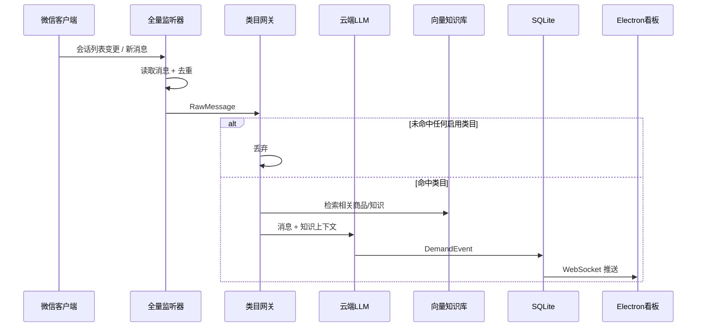

# 谛听（Diting）× 营销智能体（SalesAgent）— 产品设计文档

> **客户端**：**谛听**（Diting），仓库目录 `ditingclient/`  
> **服务端**：**营销智能体**（SalesAgent），仓库目录 `salesagent/`  
> **产品副标题**：私域需求雷达 · 微信聊天监控与需求挖掘  
> **文档版本**：v1.8（PRD Final）  
> **最后更新**：2026-06-15  
> **文档状态**：Final — 产品层定稿；技术细节见 [技术方案-谛听客户端](技术方案-谛听客户端.md)、[技术方案-SalesAgent服务端](技术方案-SalesAgent服务端.md)  
> **关联文档**：`docs/只读接入Niushop商品与内容库说明.md`、`docs/仓库目录结构.md`、`docs/技术方案-谛听客户端.md`、`docs/技术方案-SalesAgent服务端.md`

---

## 1. 产品概述

### 1.1 一句话定义

**谛听（Diting）** 客户端与 **营销智能体（SalesAgent）** 服务端协作 — 微信信息监控与需求挖掘（私域需求雷达）：

- **谛听客户端**（Windows PC，`ditingclient/`）：UIA/OCR 收取微信消息、本地离线资料库、运行时上下文、分析结果展示、本地配置。
- **SalesAgent 服务端**（腾讯 CVM，`salesagent/`）：较重计算（Embedding/VLM/LLM 推理）、向量知识库、Niushop 只读库同步、Ingestion Pipeline。**实验期与商城后端同机**；远期可迁独立 CVM（§4.11，仅配置 + 数据迁移）。

客户端通过 HTTP/WebSocket 将消息与资料变更推送至服务端分析，**不发起任何聊天、不自动回复、不操作微信**。

### 1.2 核心原则


| 原则        | 说明                                                                                |
| --------- | --------------------------------------------------------------------------------- |
| **只读监听**  | **日常消息采集**不 Hook、不注入 DLL、不模拟键鼠、不修改微信内存；**增强身份导入**为可选、用户手工触发的一次性任务（§4.8.1），与监听链路隔离 |
| **全量采集**  | 单聊 + 群聊全部监听，覆盖几千好友、海量群                                                            |
| **类目过滤**  | 用户配置垂直方向，无关信息直接丢弃                                                                 |
| **需求挖掘**  | 输出结构化需求，而非话术建议                                                                    |
| **数据沉淀**  | 客户端展示 + 服务端持久化，UI 为独立管理页面                                                         |
| **零操作微信** | 产品生命周期内不向微信写入任何内容                                                                 |
| **端云分工**  | 依赖微信的放客户端；重计算与外部库连接放服务端                                                           |


### 1.3 产品形态

- **载体**：Electron 桌面管理端（独立窗口，普通 Web 页面）
- **客户端产品名**：**谛听**（Diting）
- **服务端产品名**：**营销智能体**（SalesAgent）
- **角色定位**：私域需求雷达 — 从几千人的微信噪声中，实时挖掘你关心的垂直需求

### 1.4 已确认的核心决策（v1.0）


| #   | 决策项           | 结论                                                                                                                |
| --- | ------------- | ----------------------------------------------------------------------------------------------------------------- |
| 1   | 系统形态          | **客户端 + 服务端** 分离部署                                                                                                |
| 2   | 监听范围          | **感知型雷达**：全量单聊 + 群聊；类目过滤，无关丢弃                                                                                     |
| 3   | 客户端职责         | 微信收取、Level 1 离线资料库、Level 3 运行时上下文、展示、本地配置                                                                         |
| 4   | 服务端职责         | Embedding/VLM/LLM、Level 2 向量库、Niushop 只读库、Ingestion、外部 DB                                                         |
| 5   | 商城数据          | **Niushop MySQL 只读接入**（商品/文章/评价），见关联文档                                                                            |
| 6   | 部署            | **实验期**与商城同 CVM；**远期**可迁独立 SalesAgent CVM；**仅改配置 + 数据迁移**（§4.11）                                                  |
| 7   | 数据路径          | 谛听 `C:/work/diting/data/`；SalesAgent 开发 `C:/work/salesagent/data/`、线上 `/www/wwwroot/salesagent/data/`；**按类目分子目录** |
| 8   | LLM           | 服务端 **DeepSeek API 默认**（**仅需求 analyze**）；混元/TokenHub 备选；**元宝网页**用于**主动学习本地综合**（§3.5、§5.5.4），**禁止**接入 analyze      |
| 9   | Embedding/VLM | **BGE-M3 + Qwen-VL**，部署在**服务端**                                                                                   |
| 10  | 前端            | 客户端 **Electron** 管理页                                                                                              |
| 11  | POC 范围        | **beauty（护肤/防晒）** 单类目                                                                                             |
| 12  | 商业模式          | 类目订阅制；定价走配置文件                                                                                                     |
| 13  | 线上 API 域名     | `**https://yanpanji.com`**（路径前缀 `/api`）                                                                           |
| 14  | Niushop 只读账号  | `**recommend_ro` 编码前创建**                                                                                          |
| 15  | 资料上传 v1       | **仅方式 A** HTTP 上传至服务端 staging                                                                                     |
| 16  | 资料上传 v1.x     | **方式 D** COS 预签名直传（预留）                                                                                            |
| 17  | 百度网盘 / GitHub | **本期不对接**                                                                                                         |
| 18  | 商城 HTTP 接口    | POC/联调用；生产以 MySQL 为主                                                                                              |
| 19  | **首页**        | **需求雷达流**（非需求列表）                                                                                                  |
| 20  | **右侧摘要栏**     | 宽屏常显；窄屏可折叠                                                                                                        |
| 21  | **知识库页**      | 上传 + 本地列表 + **知识图谱** + **知识库地图** + **主动学习**（§5.5.4、§5.7.7）                                                   |
| 22  | **账号鉴权**      | **License Key**；使用时 PC 微信须已登录                                                                                     |
| 23  | **POC 菜单**    | 未做页面显示「即将推出」，可点不可进                                                                                                |
| 24  | **联系人沉淀**     | 单聊/群聊均记录**发言人 + 会话（群）**，为后续回复获客 Agent 预留                                                                          |
| 25  | **UIA POC**   | Inspect.exe 抓控件树 + uiautomation 监听（见 §10.0）                                                                       |
| 26  | **AI 分工**     | Qwen-VL **服务端**；DeepSeek **仅需求 analyze**；元宝网页 **仅主动学习综合**（§3.5、§5.5.4）                                            |
| 34  | **知识库学习模式**   | **被动**：各品类（含 `ai_agent`）人工投喂 + 商城同步；**主动**（仅 `ai_agent` 等可配）：技术群链接 + 元宝综合（§5.5.3a、§5.5.4）                         |
| 35  | **技术知识类目**    | 新增垂直大类 `**ai_agent`（AI 智能体）**；**被动投喂 + 主动学习** 双模式，与 beauty 等投喂机制一致（§3.2、§5.5.3a、§5.5.4）                           |
| 27  | **黑名单**       | **黑名单群 + 黑名单用户**（如老师群、亲友），采集前排除，永不分析                                                                              |
| 28  | **未聚焦可读**     | UIA **只读**后台读会话/消息区，不 SendInput，**不算打扰用户**                                                                        |
| 29  | **监听降级梯**     | 全量 → 扩黑名单 → **白名单群/会话**（非真全量）                                                                                     |
| 30  | **POC 量化验收**  | 24h 漏报率、群发言人 50 条准确率、微信升级映射工时（§10.0）                                                                              |
| 31  | **服务端资源**     | 实验期 CVM **2G 内存 / 50G 盘**；重任务**夜间**执行（§8.2）                                                                       |
| 32  | **平台路线**      | 本期 **PC 微信**；后续手机端 → 小红书/得物/咸鱼公域（§3.7）                                                                            |
| 33  | **商业定位**      | 短期**非普适 SaaS**，自用验证后逐步升级（§13.1）                                                                                   |
| 34  | **多客户端**      | **本期支持**；试用阶段 **2 台客户端** 同时连同一服务端                                                                                 |
| 35  | **成本护栏**      | 客户端预筛 + 服务端限流/日配额，必配（§8.3）                                                                                        |
| 36  | **服务端迁移**     | 商城 CVM → 独立 CVM：**零代码**，配置切换 + `data/` 迁移（§4.11）                                                                  |
| 37  | **发言合并上报**    | 同发言人连续消息，静默 `**idle_flush_seconds`（默认 30s，可配 15s 等）** 后合并 1 次 analyze（§5.2.1）                                     |
| 38  | **产品命名**      | 客户端 **谛听 / Diting**（目录 `ditingclient`）；服务端 **营销智能体 / SalesAgent**（目录 `salesagent`）                                |
| 39  | **增强身份导入**    | 用户手工「同步通讯录」；**优先只读本地微信数据目录**，失败可降级一次性 Hook；导入后监听期仅本地匹配，不再侵入（§3.6、§4.8.1）                                          |


---

## 2. 背景与问题

### 2.1 行业现状

微信官方对个人号 API 极度封闭。市面多数工具依赖 Hook / 模拟操作 / 协议逆向，存在封号与合规风险。

### 2.2 用户痛点


| 痛点          | 描述                           |
| ----------- | ---------------------------- |
| **信息过载**    | 私域几千好友、群聊数不清，真正有价值的「需求信号」被淹没 |
| **人工盯盘不可行** | 不可能 24 小时刷群、看聊天，错过即流失        |
| **需求分散**    | 同一用户在不同群、不同时间表达的需求无法汇总       |
| **品类交叉**    | 同时经营美妆、饮品、服装等多类目，需要按方向分别挖掘   |
| **数据无沉淀**   | 聊天记录是「流式噪声」，无法形成可检索、可统计的需求资产 |


### 2.3 产品机会

把微信私域从「人工刷消息」升级为「AI 需求雷达」：全量监听 → 类目过滤 → 需求结构化 → 数据看板，在**零操作痕迹**的前提下，从噪声中持续提取商业机会。

---

## 3. 产品定位与价值

### 3.1 目标用户

- **主用户**：多品类私域运营者、微商/社群主、垂直类目经销商
- **典型画像**：微信好友 3000+，运营群 50+，同时关注美妆、饮品、服装等方向
- **使用场景**：PC 端微信长期在线，需要后台持续挖掘需求信号
- **非目标用户**：需要自动群发、自动回复、批量养号的用户

### 3.7 平台演进路线（产品定稿）

本期从**最简单的 PC 微信**起步（客户端 + 服务端），不追求一期覆盖所有触点。

```
阶段 1（本期 POC/MVP）  PC 微信 · 只读 UIA/OCR · 需求雷达
        ↓
阶段 2（v1.x）          手机端 · 独立客户端（仍连同一服务端，具体采集方式另定）
        ↓
阶段 3（远期）          公域需求收集端：小红书、得物、闲鱼等（只读/合规采集，独立模块）
```


| 阶段     | 范围              | 说明                    |
| ------ | --------------- | --------------------- |
| **本期** | Windows + PC 微信 | 主战场；手机消息依赖 PC 微信同步    |
| **后续** | 手机端客户端          | 仅做「端」，分析/知识库仍走服务端     |
| **远期** | 公域平台            | 与私域微信并列的需求雷达数据源，架构可插拔 |


> **市场边界**：本期接受「必须 PC 微信在线」的前提；不在一期解决手机独占聊天场景。

### 3.2 垂直类目（可扩展架构）

用户可勾选启用的监控方向，每条消息先过类目网关，不命中则**直接丢弃**。

**设计原则：大类目可插拔扩展** — 新增垂直方向时，只需在配置文件 `shared/config/categories.json` 追加条目（code、关键词种子、子类标签、向量 Collection 名），无需改核心代码。


| 类目代码           | 方向               | 需求示例                     | POC                      |
| -------------- | ---------------- | ------------------------ | ------------------------ |
| `beauty`       | 四季护肤 / 美妆        | 天热防晒、敏感肌、抗老祛皱            | ✅                        |
| `drink`        | 饮品 / 奶昔          | 果茶、奶茶、奶昔、水果捞             | 预留                       |
| `fruit`        | 生鲜水果             | 当季水果、拼单                  | 预留                       |
| `food`         | 食品               | 炒饭、零食、代餐                 | 预留                       |
| `fashion`      | 服装服饰             | 穿搭、尺码、款式                 | 预留                       |
| `appliance`    | 电器               | 小家电、厨房电器                 | 预留                       |
| `**ai_agent`** | **AI 智能体 / 技术栈** | 视频生成、图像、文本处理、大模型对接、直播、影视 | **MVP**（**被动投喂 + 主动学习**） |
| `*`            | **未来扩展**         | 配置追加，如母婴、宠物、旅游…          | —                        |


> 每个**商业**类目独立维护：关键词种子 + ChromaDB Collection + 需求标签树。  
> `**ai_agent` 为技术知识大类**：仅用于知识库 ingest 与检索，**默认不接入**微信消息类目网关与需求雷达。  
> **学习入库不限制为单一方式**：与 beauty 等类目相同，支持 **被动投喂**（拖拽/选文件上传）；另可选 **主动学习**（技术群链接 + 元宝，§5.5.4）。  
> **POC 阶段仅启用 `beauty`** 做需求挖掘；`ai_agent` 知识库在 **MVP** 开放（被动与主动均可）。

#### 3.2.1 `ai_agent` 子类（技术知识标签）


| 子类 code           | 名称    | 典型内容示例                          |
| ----------------- | ----- | ------------------------------- |
| `video`           | 视频    | 文生视频、姿态驱动、数字人、Po/Animate 类论文与工具 |
| `image`           | 图片    | 文生图、ControlNet、头像重建、图像编辑        |
| `text`            | 文本处理  | RAG、切片、Prompt、结构化输出             |
| `llm_integration` | 大模型对接 | DeepSeek / 混元 API、思考模式、流式、配额与降级 |
| `live`            | 直播    | 直播推流、实时互动、带货技术栈                 |
| `film`            | 影视    | 剪辑、特效、短剧工作流                     |


子类写入 ingest 元数据 `sub_category` 与向量切片 `metadata.topic`，**不**单独建 Chroma collection（仍归 `ai_agent/chroma/`）。

### 3.3 价值主张

```
全量雷达  → 几千好友 + 全部群聊，一条不漏地听
精准过滤  → 只留你指定的垂直需求，噪声归零
需求结构化 → 「谁在什么时候表达了什么需求」可检索、可统计
数据资产  → 需求日志沉淀为私域情报库，而非散落在聊天记录里
安全只读  → 不聊天、不操作，微信服务端无感知
```

### 3.4 与竞品差异


| 维度   | 传统私域工具   | 聊天辅助类 AI   | 本产品                    |
| ---- | -------- | ---------- | ---------------------- |
| 核心能力 | 群发 / CRM | 当前会话话术建议   | **全量需求挖掘**             |
| 监听范围 | 无 / 单会话  | 当前窗口       | **全部单聊 + 群聊**          |
| 输出物  | 消息记录     | 话术         | **结构化需求事件**            |
| 技术路径 | Hook 为主  | Hook / UIA | **纯 UIA + OCR**        |
| 是否聊天 | 是        | 辅助发送       | **本期绝不；v2 独立回复 Agent** |


### 3.5 AI 能力分工（Qwen-VL · DeepSeek · 混元 · 元宝网页测试）

本产品使用**多种模型各司其职**，不是「一个模型包打天下」。

```
┌─────────────────────────────────────────────────────────────────┐
│                        服务端 AI 栈                            │
├─────────────────────────────────────────────────────────────────┤
│  BGE-M3（本地）     文本向量化 · 知识库检索 · 类目相似度精筛      │
│  Qwen-VL（本地）    图片理解 · ingest 看图 → 文字（不占 API 账单） │
│  DeepSeek（云端）   默认 · 需求推理 → DemandEvent JSON           │
│  混元/TokenHub      备选 API · 故障或对比测试时切换               │
│  元宝网页（本机）   Playwright/UIA · **仅主动学习综合** · 禁止 analyze   │
└─────────────────────────────────────────────────────────────────┘
```


| 模型/通道             | 类型         | 部署              | 在本产品中的用途                                                                         | 不做什么                          |
| ----------------- | ---------- | --------------- | -------------------------------------------------------------------------------- | ----------------------------- |
| **BGE-M3**        | Embedding  | 服务端本地 CPU       | 资料/商品/文章切片向量化；需求挖掘前 top-K 召回                                                     | 不做自然语言生成                      |
| **Qwen-VL**       | VLM        | **服务端本地**       | 产品主图、证书、上传图、商城封面 → **文字描述** 再入库                                                  | 不做需求推理；**不计入云端 LLM Token 账单** |
| **DeepSeek**      | 云端 LLM API | API             | **默认**需求挖掘：意图/子类/紧迫度/摘要/关联商品；输出 `DemandEvent` JSON                               | 不上传原始图片                       |
| **混元 / TokenHub** | 云端 LLM API | API             | **备选**；DeepSeek 不可用、限流或 A/B 对比时                                                  | 不作为默认（单价偏高）                   |
| **腾讯元宝网页**        | C 端网页自动化   | **主动学习**（本机已登录） | 用户点击「开始学习」后：抓取链接正文 + 图片 → **本机元宝**做结构化综合 → 再上传 ingest；**禁止** `POST /api/analyze` | **禁止**接入需求雷达 analyze          |


**典型一条消息的处理链**：

```
微信消息文本
    → BGE-M3 检索知识库（商品/文章/评价/资料片段）
    → DeepSeek API：消息 + 召回知识 → DemandEvent JSON

用户上传的产品图（ingest 时，非常驻）
    → Qwen-VL（本地）：「金色四件套礼盒，主打美白淡斑」
    → BGE-M3 向量化 → 写入 chroma/
```

**成本口径（产品定稿）**：


| 能力           | 计费方式            | 说明                                                                   |
| ------------ | --------------- | -------------------------------------------------------------------- |
| **Qwen-VL**  | **本地算力**        | 占用 CVM CPU/内存；**不计入** DeepSeek/混元等 API Token 费；实验期限夜间 + 50 张/日（§8.3） |
| **BGE-M3**   | 本地算力            | 同上                                                                   |
| **DeepSeek** | **按 Token 后付费** | 主路径；单价低，适合过滤后 500 条/日有效上报                                            |
| **混元 API**   | 按 Token         | 备选；新人包约 100 万 Token/年，全量生产易耗尽                                        |
| **元宝网页**     | 无 API 账单        | C 端免费；**无服务契约**，仅开发测试对比                                              |


**为何 Qwen-VL 本地、需求推理走云端 API？**


| 考量  | Qwen-VL 本地      | DeepSeek 等云端 API |
| --- | --------------- | ---------------- |
| 输入  | 商品图、内部资料扫描件（敏感） | 已脱敏的聊天文本 + 知识片段  |
| 成本  | ingest 时一次性本地推理 | 按有效上报条数 × Token  |
| 能力  | 擅长「看图说话」        | 擅长推理、JSON 结构化    |


**Provider 选择策略**（`salesagent/config/server.json`）：

1. **默认 DeepSeek API**（`deepseek-v4-flash`，OpenAI-compatible）
2. 失败 / 限流 / 超额 → **混元/TokenHub**（若已配置）
3. 再失败 → **本地规则降级**（关键词提取，`confidence: low`）

**腾讯元宝网页端（主动学习专用 · 产品定稿）**：


| 项                  | 定稿                                                                                    |
| ------------------ | ------------------------------------------------------------------------------------- |
| **能否做**            | 可以。Playwright 或 Electron 控制**用户已提前打开并登录**的元宝窗口/标签页，模拟输入，读 DOM 或截获 SSE；**须支持滚动**读全长篇输出 |
| **用途**             | **主动学习**链路：网页抓取 + 聊天上下文 → 元宝本地综合 → 生成 ingest 稿件；**不进入** `POST /api/analyze`           |
| **与 DeepSeek 边界**  | 主动学习**不得**调用服务端 DeepSeek（成本与职责分离）；服务端仅对最终稿件做 **BGE 向量化 ingest**                       |
| **禁止 analyze 的原因** | 无 API 契约、页面易变；且需求挖掘必须用结构化 JSON 的 DeepSeek 路径                                          |
| **配置**             | `ditingclient/config/active_learning.json#yuanbao_web`；默认 `enabled: false`，用户显式开启     |


```
【需求雷达】POST /api/analyze → DeepSeek API（默认）  ← 与主动学习无关
【主动学习】抓取 → 本机元宝综合 → raw 稿件 → POST /api/ingest/upload → BGE → ai_agent/chroma/
```

### 3.6 联系人/群身份沉淀与后续 Agent 协作（产品定稿）

**本期（监控分析 Agent）**：只读挖掘需求，**不回复**。但必须把「谁、在哪个群、说了什么需求」**完整记下来**，供下一阶段使用。

**未来（回复获客 / 培养客户 Agent）**：独立 Agent，与本产品协作：

```
┌──────────────────────┐         ┌──────────────────────────┐
│ 监控分析 Agent（本期）  │  数据    │ 回复获客 Agent（未来 v2）  │
│ 只读 · 需求雷达        │ ──────→ │ 人工确认后辅助回复/跟进     │
│ 沉淀联系人+群+需求      │         │ 读取 contact_key / 历史需求 │
└──────────────────────┘         └──────────────────────────┘
```

**本期必须记录的标识**（每条 `DemandEvent` 与 `contacts` / `groups` 表关联）：


| 字段                    | 单聊        | 群聊          | 说明                          |
| --------------------- | --------- | ----------- | --------------------------- |
| `session_type`        | `single`  | `group`     | 会话类型                        |
| `session_id`          | 会话稳定 ID   | 群会话 ID      | UIA 生成，配置化映射                |
| `session_name`        | 对方昵称/备注   | **群名称**     | 群聊必填                        |
| `sender_display_name` | 对方昵称      | **群内发言人昵称** | 群聊区分说话人                     |
| `sender_remark_name`  | 备注名（若可见）  | 群成员备注（若可见）  | 最佳努力                        |
| `contact_key`         | 联系人主键     | 同左          | **优先 wxid**；未命中通讯录时降级（见下表）  |
| `group_key`           | —         | 群主键         | 聚合群维度统计                     |
| `wxid`                | 微信号（若已知）  | 同左          | 来自通讯录同步或资料页解析；**追踪同一人的首选键** |
| `avatar_hash`         | 头像指纹（若已知） | 同左          | 辅助消歧，非主键                    |


`**contact_key` 解析优先级（产品定稿）**：


| 优先级   | 规则                                             | 条件               |
| ----- | ---------------------------------------------- | ---------------- |
| **1** | `wxid:{微信号}`                                   | 通讯录同步 / 资料页解析命中  |
| **2** | `remark:{备注名}`                                 | 备注在本地库内唯一        |
| **3** | `group:{group_key}|{sender_display_name}`      | 群聊且未命中通讯录（群维度追踪） |
| **4** | `display:{session_type}|{sender_display_name}` | 兜底               |


**增强身份导入（§4.8.2）**：用户可在设置中**手工触发一次**「同步微信通讯录」，将好友 **微信号、昵称、备注、头像** 写入本地 `contacts` 表。监听采集到 `sender_display_name` 后，**只读匹配**本地库解析 `wxid` 与 `contact_key`——**监听过程中不再 Hook、不读内存、不走协议**。

**能力边界（须写清）**：


| 场景                     | 能否精确到 wxid                  |
| ---------------------- | --------------------------- |
| 单聊 / 群聊发言人 **已在好友通讯录** | ✅ 同步后可稳定追踪                  |
| 群成员 **未加好友**           | ❌ 仅 `group_key + sender` 降级 |
| 好友改昵称后未重新同步            | ⚠️ 可能短暂匹配失败，提示用户「更新通讯录」     |


**UI 展示**：已知 wxid 时显示 `昵称 (微信号)`，例如 `A0--海燕 (Yolo--shy)`；未知时显示昵称 + 「未识别」标记。

**使用前提**：用户 PC 端 **微信已登录且在线**（与 License Key 鉴权一并作为客户端运行前提）；**建议首次使用前完成一次通讯录同步**。

---

## 4. 系统架构

### 4.1 客户端 / 服务端总览

```
┌──────────────────────────────── 客户端（Windows PC）────────────────────────────────┐
│                                                                                      │
│  ┌──────────────┐    ┌─────────────────┐    ┌──────────────────────────────────┐    │
│  │ 微信 PC 客户端 │───→│ M1 消息收取      │───→│ M3 类目网关（轻量关键词预筛）      │    │
│  │ 单聊+群聊     │    │ UIA + OCR 兜底   │    │ 未命中 → 丢弃                    │    │
│  └──────────────┘    └─────────────────┘    └──────────────┬───────────────────┘    │
│                                                             │ 命中                    │
│  ┌──────────────────────────────────────────────────────────▼───────────────────┐  │
│  │ Level 1 离线资料库（本地磁盘，按类目分子目录）                                    │  │
│  │ C:/work/diting/data/{category}/raw/  word / excel / pdf / images          │  │
│  │ 用户投喂 → 变更通知服务端 ingest                                                 │  │
│  └──────────────────────────────────────────────────────────────────────────────┘  │
│                                                                                      │
│  ┌──────────────────────────────────────────────────────────────────────────────┐  │
│  │ Level 3 运行时上下文（内存，客户端维护）                                          │  │
│  │ customer_profile + working_memory(最近N条) + 服务端返回的 retrieved_knowledge    │  │
│  └──────────────────────────────────────────────────────────────────────────────┘  │
│                                                                                      │
│  ┌──────────────────────────────────────────────────────────────────────────────┐  │
│  │ Electron 展示层（Vue3）：需求雷达 / 列表 / 知识库 / 配置 / 关键词系统通知         │  │
│  └──────────────────────────────────────────────────────────────────────────────┘  │
│                                                                                      │
│  本地 SQLite：需求缓存、联系人画像、监听状态、配置缓存                                  │
└───────────────────────────────────────┬──────────────────────────────────────────────┘
                                        │ HTTP / WebSocket
                                        │ POST /api/analyze  ·  POST /api/ingest  ·  WS /events
                                        ↓
┌──────────────────────────────── 服务端（腾讯 CVM，与商城同机）────────────────────────┐
│                                                                                      │
│  ┌──────────────────────────────────────────────────────────────────────────────┐  │
│  │ Ingestion Pipeline（较重计算）                                                 │  │
│  │ Word/Excel/PDF 解析 · 图片 OCR + Qwen-VL · BGE-M3 向量化 · 增量 hash 更新       │  │
│  └──────────────────────────────────────────────────────────────────────────────┘  │
│                                                                                      │
│  ┌────────────────────────────┐    ┌────────────────────────────────────────────┐  │
│  │ Niushop 只读 MySQL 同步     │    │ Level 2 向量知识库（ChromaDB，按类目）       │  │
│  │ 商品 / 文章 / 评价          │───→│ /www/wwwroot/salesagent/data/{cat}/chroma/ │  │
│  │ weapp_id=11 栖月汇          │    │ BGE-M3 embedding                            │  │
│  └────────────────────────────┘    └────────────────────────────────────────────┘  │
│                                                                                      │
│  ┌──────────────────────────────────────────────────────────────────────────────┐  │
│  │ 需求挖掘引擎：类目精筛 → 向量检索 top-K → DeepSeek API（默认）→ DemandEvent │  │
│  └──────────────────────────────────────────────────────────────────────────────┘  │
│                                                                                      │
│  服务端存储：ChromaDB · 同步快照 · ingest 状态 · 可选 PostgreSQL/MySQL（业务库）       │
└──────────────────────────────────────────────────────────────────────────────────────┘
```

### 4.2 职责边界（定稿）


| 能力                 | 客户端 | 服务端 | 原因                      |
| ------------------ | --- | --- | ----------------------- |
| 微信 UIA/OCR 收取      | ✅   | ❌   | 必须在本机，依赖微信窗口            |
| Level 1 离线资料库      | ✅   | ❌   | 用户本机投喂，原始文件不出机（可选同步元数据） |
| Level 3 运行时上下文     | ✅   | ❌   | 每次分析的动态工作台，低延迟本地组装      |
| 类目关键词预筛（L1）        | ✅   | 可选  | 减少网络传输，丢弃 90% 噪声        |
| Embedding BGE-M3   | ❌   | ✅   | CPU/GPU 密集              |
| VLM Qwen-VL        | ❌   | ✅   | 模型较大，统一部署               |
| Level 2 向量知识库      | ❌   | ✅   | 集中管理，多客户端可共享            |
| Ingestion Pipeline | ❌   | ✅   | 解析 Word/Excel/图片，计算重    |
| Niushop MySQL 只读   | ❌   | ✅   | 与商城同机，127.0.0.1 直连      |
| 云端 LLM 需求挖掘        | ❌   | ✅   | API Key 集中管理，便于批处理      |
| 分析结果展示             | ✅   | ❌   | Electron UI             |
| 本地配置               | ✅   | 部分  | 客户端本地项 + 拉取服务端订阅配置      |
| 关键词弹窗提醒            | ✅   | ❌   | 桌面通知需在本机                |


### 4.3 客户端 ↔ 服务端通信（草案）


| 接口                         | 方法        | 方向        | 说明                                             |
| -------------------------- | --------- | --------- | ---------------------------------------------- |
| `/api/analyze`             | POST      | 客户端 → 服务端 | 提交 RawMessage + runtime_context，返回 DemandEvent |
| `/api/ingest/upload`       | POST      | 客户端 → 服务端 | 上传资料文件或变更清单，触发 ingest                          |
| `/api/ingest/status`       | GET       | 客户端 → 服务端 | 查询各类目 ingest / 商城同步状态                          |
| `/api/knowledge/search`    | POST      | 客户端 → 服务端 | 按需检索（调试 / 预览）                                  |
| `/api/config/subscription` | GET       | 客户端 → 服务端 | 拉取套餐配置                                         |
| `/events`                  | WebSocket | 服务端 → 客户端 | 推送新 DemandEvent、同步完成、告警                        |


**本地开发**：客户端连 `http://127.0.0.1:8765`（本机服务端或 SSH 端口转发）。  
**线上**：客户端连 `**https://yanpanji.com`**，API 前缀 `/api`（与 [yanpanji.com](https://yanpanji.com) 同域部署）。

完整示例：`POST https://yanpanji.com/api/ingest/upload`

### 4.4 数据目录规范（按类目分子目录）


| 环境      | `data_root`                     |
| ------- | ------------------------------- |
| 客户端本地开发 | `C:/work/diting/data/`          |
| 服务端本地开发 | `C:/work/salesagent/data/`      |
| 服务端线上   | `/www/wwwroot/salesagent/data/` |


```
{data_root}/
├── beauty/                          # 类目 code，与 categories.json 一致
│   ├── raw/                         # 【客户端】Level 1 离线资料库
│   │   ├── word_docs/
│   │   ├── excel_files/
│   │   ├── images/
│   │   └── pdf/
│   ├── runtime/                     # 【客户端】会话上下文快照（可选持久化）
│   ├── chroma/                      # 【服务端】Level 2 向量库
│   └── snapshots/                   # 【服务端】Niushop 同步 JSON 快照
│       ├── goods_{date}.json
│       ├── articles_{date}.json
│       └── evaluates_{date}.json
├── drink/                           # 预留
│   └── ...
└── _shared/                         # 跨类目共享（如全局 SOP）
    └── raw/
```

> 新增大类目：在 `categories.json` 追加 `code`，自动创建对应子目录。

### 4.5 总体数据流（三级知识库 + 端云分工）

```
【客户端】用户投喂 / 微信消息
        ↓
【客户端】Level 1 raw/（按类目）          【客户端】Level 3 运行时上下文
        ↓ 文件变更通知                              ↑
【服务端】Ingestion Pipeline              【服务端】向量检索 top-K
        ↓                                        │
【服务端】Level 2 chroma/（按类目）  ←── Niushop 只读库定时同步
        ↓
【服务端】LLM 需求挖掘 → DemandEvent
        ↓ WebSocket
【客户端】Electron 需求雷达展示
```

### 4.6 技术栈


| 层级        | 技术选型                                                | 部署位置      |
| --------- | --------------------------------------------------- | --------- |
| 微信监听      | Python 3.11+、`uiautomation`                         | **客户端**   |
| 视觉兜底 OCR  | OpenCV + Windows OCR                                | **客户端**   |
| 展示层       | Electron + **Vue 3** + shadcn-vue / Tailwind        | **客户端**   |
| 客户端本地库    | SQLite                                              | **客户端**   |
| API 服务    | FastAPI / Flask                                     | **服务端**   |
| Embedding | **BGE-M3**                                          | **服务端**   |
| VLM       | **Qwen-VL**                                         | **服务端**   |
| 向量库       | ChromaDB                                            | **服务端**   |
| 商城数据源     | **Niushop MySQL 只读**（主）+ **商城 HTTP API**（POC/联调/降级） | **服务端**   |
| 分析引擎      | **DeepSeek API**（默认）；混元备选                           | **服务端**调用 |
| 业务库（可选）   | PostgreSQL / MySQL                                  | **服务端**   |


### 4.7 Niushop 商城只读接入（概要）

> 完整表结构、SQL、字段说明见：`**docs/只读接入Niushop商品与内容库说明.md`**


| 项      | 值                                                          |
| ------ | ---------------------------------------------------------- |
| 数据库    | `niushop_b2c_v5`，表前缀 `ns_`                                 |
| 站点     | `site_id = 1`                                              |
| 小程序    | **栖月汇 `weapp_id = 11`**（聊天推荐默认端）                           |
| 账号     | 只读 `recommend_ro`，仅 `SELECT`                               |
| 账号状态   | **待创建** — 技术方案定稿后、**编码启动前**在 MySQL 执行（见 Niushop 说明文档 §2.2） |
| 同步内容   | 商品（SPU/SKU/分类）、文章、商品评价、文章内嵌 goods_id                       |
| 图片域名   | `https://yanpanji.com/` + 库内相对路径                           |
| 本地开发连库 | SSH 隧道：`127.0.0.1:13306 → CVM:3306`                        |
| 线上连库   | 由 `server.json#deployment.topology` 决定（见 §4.11）            |


**同步策略**：

```
定时任务（实验期每日 02:00，见 scheduler.niushop_sync_cron）
    ↓
SELECT 商品/文章/评价（weapp_id=11, 上架/已发布/已审核）
    ↓
HTML 清洗 → 自然语言化 → 文章内 goods_id 正则抽取
    ↓
商品主图下载 → Qwen-VL 描述（可选）
    ↓
BGE-M3 向量化 → beauty/chroma/
    ↓
JSON 快照归档 → beauty/snapshots/
```

**评价语料用途**：需求挖掘时提供「社会证明」（如 `social_proof` 字段），增强推荐可信度。

**数据双通道**：


| 通道          | 用途                        | 优先级     |
| ----------- | ------------------------- | ------- |
| MySQL 只读    | 生产环境批量同步商品/文章/评价          | **主路径** |
| 商城 HTTP API | POC 联调、单条验证、MySQL 不可用时的降级 | **辅路径** |


HTTP 接口明细见 **§5.5.1a**。

### 4.8 技术边界（日常监听 vs 增强身份）

#### 4.8.1 日常消息采集（P0 · 默认路径 · 必须遵守）

- ❌ DLL 注入 / Inline Hook（**监听运行期间**）
- ❌ 微信进程内存读写（**监听运行期间**）
- ❌ SendInput / 模拟键鼠 / 自动切换会话发送消息
- ❌ 自动回复 / 自动聊天
- ❌ 协议层抓包 / 逆向（**监听运行期间**）

> **说明**：采集链路**仅读取控件文本**（UIA/OCR），不 SendInput、不模拟点击发消息、不抢焦点输入。**未聚焦会话时，UIA 仍应尝试读取消息区**（POC 验证微信是否暴露控件树）；这属于后台读屏，**不是**向用户或好友发送任何内容。需在 POC 验证：后台只读是否触发微信风控。

#### 4.8.2 增强身份导入（P0.5 · 可选 · 用户手工触发）

**目标**：一次性建立本地好友主档（wxid + 昵称 + 备注 + 头像），供监听期**只读匹配**发言人，提升 `contact_key` 准确率。

**触发方式**：设置 → **身份与通讯录** → 用户点击 **「同步微信通讯录」**；非自动、非后台常驻。

**实现优先级（对用户无感，技术自动选择）**：


| 优先级        | 实现                      | 说明                                                                    |
| ---------- | ----------------------- | --------------------------------------------------------------------- |
| **1 — 首选** | **只读本地微信数据目录**          | 复制/只读打开 `WeChat Files` 下通讯录相关库文件（如 `MicroMsg.db` / 联系人缓存）；**不注入微信进程** |
| **2 — 降级** | **一次性增强模块**             | 仅当路径 1 失败（如库加密、路径不可读）；**独立进程**，任务结束即退出；**不得**与 `diting-listener` 同进程  |
| **3 — 兜底** | UIA/OCR 遍历通讯录 / 资料页被动解析 | 仍属只读，速度慢，作最后备选                                                        |


**用户同意与风险披露（必做）**：

- 首次点击前弹出 **知情同意**：说明将读取本机微信数据目录（或降级时的增强模块风险）、数据仅存本地、不自动发消息。
- 用户勾选「我已了解风险」后方可执行；记录 `contact_import_log.user_consented`。
- 设置页展示：**上次同步时间**、**已导入 N 人**、**同步来源**（`local_db` / `hook_once`）。

**明确禁止（即使增强导入）**：

- ❌ 导入过程中自动发消息、加好友、改资料
- ❌ 将增强模块用于**实时消息采集**或常驻监听
- ❌ 导入模块与 `diting-listener` 合并为同一常驻进程

**与监听的关系**：

```
用户点击「同步通讯录」（一次性 / 可重复更新）
        ↓
  增强身份导入（§4.8.2，优先 local_db）
        ↓
  写入 SQLite contacts（wxid、昵称、备注、头像）
        ↓
  推送 contact_index 至 listener（只读快照）
        ↓
【日常监听】UIA/OCR 采集 → contact_resolver 匹配 → contact_key（§3.6）
        ↓
  不再调用 Hook / 协议 / 内存读取
```

### 4.9 全量监听策略（客户端）

用户的微信规模（几千好友 + 海量群）决定了**不能只监听当前前台窗口**。v1 目标为**尽量全量**采集，并配套黑名单与降级梯（§4.9.2、§9.1）。


| 阶段            | 策略             | 说明                               |
| ------------- | -------------- | -------------------------------- |
| **P0 — 事件驱动** | 订阅会话列表未读变更     | 有新消息的会话优先采集                      |
| **P0 — 轮询补漏** | 低频率扫描会话列表      | 捕获无红点但内容更新的会话                    |
| **P0 — 后台只读** | UIA 读取非聚焦会话消息区 | **不点击发送、不输入**；仅读 ListItem / 消息气泡 |
| **P1 — 历史回溯** | 用户手动触发批量采集     | 可选，按时间范围补采                       |


```
会话列表变更 / 定时扫描
        ↓
  【黑名单过滤】群 / 用户命中 → 直接跳过（不读、不存、不分析）
        ↓
  待采集会话队列（含未聚焦会话，UIA 只读）
        ↓
  UIA 读取该会话消息区（只读，无 SendInput）
        ↓
  【身份匹配】sender_display_name → 本地 contacts 解析 wxid / contact_key（§3.6）
        ↓
  消息去重 → 类目网关
        ↓
  命中类目 → POST /api/analyze → 服务端需求挖掘
  未命中   → 丢弃（不写库）
```

#### 4.9.1 黑名单（P0 · 产品定稿）

**场景**：部分群/联系人**绝不应进入商业分析**（如孩子班主任群、亲友群、公司内部群）。用户可配置：


| 类型        | 配置项                    | 匹配规则                  | 效果                  |
| --------- | ---------------------- | --------------------- | ------------------- |
| **黑名单群**  | `blacklist_groups[]`   | 群名称 / 备注名 **包含或完全匹配** | 该群消息**不采集、不上报、不入库** |
| **黑名单用户** | `blacklist_contacts[]` | 昵称 / 备注名匹配            | 单聊全跳过；群聊中该发言人消息跳过   |


- 黑名单在**类目网关之前**执行，优先级最高。
- 配置位置：设置 → 监听 → 黑名单；持久化 `ditingclient/config/client.json#session_filter` + 本地 SQLite。
- 支持从会话列表「加入黑名单」快捷操作（POC 可先做设置页手动添加）。

**示例**：

```json
{
  "blacklist_groups": ["三年级家委会", "公司全员群"],
  "blacklist_contacts": ["李老师", "张班主任"]
}
```

#### 4.9.2 监听模式与降级梯（产品定稿）

若 POC/MVP 实测全量采集压力过大或漏报过高，按以下顺序降级，**无需改架构**：


| 级别         | 模式                            | 行为                       |
| ---------- | ----------------------------- | ------------------------ |
| **L0（默认）** | `full_collection`             | 尽量全量；仅排除黑名单              |
| **L1**     | `full_collection` + **扩大黑名单** | 用户主动把低价值群/人加入黑名单，缩小采集面   |
| **L2**     | `whitelist_only`              | **仅**监听白名单群 + 白名单单聊；非真全量 |
| **L3**     | `whitelist_only` + 未读队列       | 在白名单内仍优先未读会话（省电省资源）      |


配置项 `listen_mode`: `full_collection` | `whitelist_only`（`ditingclient/config/client.json`）。

**白名单示例**（L2 启用时）：

```json
{
  "listen_mode": "whitelist_only",
  "whitelist_groups": ["宝妈交流群", "护肤种草群"],
  "whitelist_contacts": []
}
```

> 产品策略：**先全量 + 黑名单**；实测不行再扩黑名单；仍不行切白名单。在设置页展示当前模式与「今日跳过黑名单 N 条」统计。

### 4.10 多客户端与服务端并发（本期支持）


| 项        | 定稿                                                     |
| -------- | ------------------------------------------------------ |
| **架构**   | 一台服务端可供**多个客户端**同时连接（不同运营者/不同 PC）                      |
| **试用阶段** | **2 个客户端**同时在线为官方测试上限（`server.json#multi_client`）      |
| **隔离**   | 每客户端 `client_id` + License Key；需求事件、上传配额、成本护栏**按客户端计** |
| **共享**   | Level 2 向量库、Niushop 同步结果**可按类目共享**（同一租户/同一 License 组织） |


客户端连接时携带 `X-Client-Id`（设备指纹 hash）；服务端 S1 网关按客户端限流（§8.3）。

### 4.11 部署拓扑与服务端迁移（配置驱动 · 产品定稿）

**现状**：SalesAgent 服务端与 **Niushop 小程序商城后端** 部署在**同一台腾讯 CVM**（共享 2G 内存 / 50G 磁盘）。

**远期**：可能单独申请 **SalesAgent 专用 CVM**。迁移目标：**尽量不改动业务代码**，仅通过**配置切换 + 数据目录迁移**完成。

#### 4.11.1 部署拓扑（`server.json#deployment.topology`）


| 拓扑       | `topology` 值            | SalesAgent 进程 | Niushop MySQL                         | 典型场景         |
| -------- | ----------------------- | ------------- | ------------------------------------- | ------------ |
| **同机共署** | `colocated_mall`        | 商城 CVM 本机     | `127.0.0.1:3306`                      | **实验期 / 当前** |
| **独立机**  | `dedicated_sales_agent` | 新 CVM         | 商城 CVM **内网 IP** 或授权远程 `recommend_ro` | 算力不足、需隔离时    |


```
【实验期 colocated_mall】
  商城 CVM
  ├── Niushop PHP/API + MySQL :3306
  └── SalesAgent API :8765 + data/ + Chroma

【远期 dedicated_sales_agent】
  商城 CVM                          SalesAgent CVM（新）
  ├── Niushop + MySQL ──只读──→      ├── API :8765
  │   recommend_ro @内网IP          ├── data/ chroma snapshots staging
  └── yanpanji.com 商城 API           └── 夜间 ingest / VLM
         ↑                                    ↑
         └──── HTTP 降级通道（跨机仍可用）──────┘
```

**设计约束（保证可迁移）**：


| 约束        | 说明                                                                                          |
| --------- | ------------------------------------------------------------------------------------------- |
| **零硬编码**  | 主机、端口、路径、域名全部在 `ditingclient/config/client.json`、`salesagent/config/server.json` 或环境变量      |
| **路径可搬迁** | 服务端数据统一在 `{data_root}`（`SalesAgent/data/`），整目录 `rsync` 即可                                   |
| **连库可切换** | `niushop.mysql.profiles` + `active_profile`：`production_colocated` ↔ `production_dedicated` |
| **域名可不变** | Nginx 将 SalesAgent 相关路径反代到新 CVM 时，**客户端 `api_base_prod` 可不改**                               |
| **域名可变更** | 仅改 `client.json#server.api_base_prod` 与 `server.json#api.public_base_url`                   |


#### 4.11.2 迁移清单（独立 CVM · 无代码变更）


| 步骤  | 操作                                                     | 配置项                                                     |
| --- | ------------------------------------------------------ | ------------------------------------------------------- |
| 1   | 新 CVM 部署 SalesAgent 服务（同版本）                            | —                                                       |
| 2   | `rsync` 迁移 `{data_root}`（chroma / snapshots / staging） | `server.json#data_root`                                 |
| 3   | 切换拓扑                                                   | `deployment.topology` → `dedicated_sales_agent`         |
| 4   | MySQL 改连商城 CVM 内网                                      | `niushop.mysql.active_profile` → `production_dedicated` |
| 5   | 商城库授权 `recommend_ro@SalesAgent内网IP`                    | DBA 执行 GRANT（一次性）                                       |
| 6   | Nginx 反代到新机 **或** 改 API 域名                             | `api.public_base_url` / 客户端 `api_base_prod`             |
| 7   | 客户端无需重装（若域名不变）                                         | 仅当步骤 6 改域名时更新 `client.json`                             |
| 8   | 验证 analyze + 商城同步 + 向量检索                               | POC 冒烟清单                                                |


**回滚**：保留商城 CVM 上旧 `data/` 快照；Nginx 指回旧机 + `topology` 改回 `colocated_mall`。

> 技术方案文档补充：Nginx 样例、`production_dedicated` 连接串、防火墙放行 3306 内网。

---

## 4A. 客户端模块（详述）


| 模块                | 职责                      |
| ----------------- | ----------------------- |
| C1 微信消息收取         | UIA 全量监听 + OCR 兜底 + 去重  |
| C2 类目网关（轻量）       | 本地关键词预筛，减少上报            |
| C3 Level 1 资料库    | 按类目 `raw/` 投喂、文件夹监控     |
| C4 Level 3 运行时上下文 | 客户画像 + 最近 N 条 + 服务端召回缓存 |
| C5 Electron 展示    | 需求雷达、上传、配置、弹窗提醒         |
| C6 本地 SQLite      | 需求缓存、联系人、监听状态           |
| C7 服务端通信          | HTTP 上报分析、WebSocket 收结果 |


## 4B. 服务端模块（详述）


| 模块                    | 职责                           |
| --------------------- | ---------------------------- |
| S1 API 网关             | 鉴权、限流、路由                     |
| S2 Ingestion Pipeline | 解析资料 + Niushop 数据 → 向量化      |
| S3 Niushop 同步器        | MySQL 批量拉取 + HTTP 接口（POC/降级） |
| S4 Level 2 向量库        | ChromaDB 按类目 Collection      |
| S5 需求挖掘引擎             | 检索 + 云端 LLM → DemandEvent    |
| S6 配置服务               | 订阅套餐、类目配置在线下发                |


---

## 5. 功能模块

### 5.1 模块总览

**客户端**：C1 消息收取 · C2 类目预筛 · C3 Level 1 资料库 · C4 运行时上下文 · C5 Electron · C6 本地库 · C7 通信

**服务端**：S1 API · S2 Ingestion · S3 Niushop 同步 · S4 向量库 · S5 需求挖掘 · S6 配置

### 5.2 C1 — 微信消息收取（客户端）


| 功能点       | 描述                                          | 优先级    |
| --------- | ------------------------------------------- | ------ |
| 微信进程检测    | 检测运行状态，异常退出告警                               | P0     |
| **黑名单过滤** | 黑名单群/用户采集前排除                                | **P0** |
| **监听模式**  | `full_collection` / `whitelist_only` 可切换    | **P0** |
| 会话列表监听    | 订阅列表 StructureChanged / 轮询未读                | P0     |
| 单聊消息采集    | 读取消息气泡文本 + 发送者（含**未聚焦会话**）                  | P0     |
| 群聊消息采集    | 读取群名 + 发送者昵称 + 正文（含未聚焦）                     | P0     |
| 消息去重      | `(session_id, sender, content_hash, ts)` 幂等 | P0     |
| 视觉兜底      | UIA 失败时 OCR 补采                              | P1     |
| 多开支持      | 选择监听的微信实例                                   | P2     |


**输出**：标准化 `RawMessage` 对象。

```json
{
  "msg_id": "hash_xxx",
  "session_id": "session_xxx",
  "session_name": "宝妈交流群",
  "session_type": "group",
  "sender_display_name": "李小姐",
  "sender_remark_name": "李小姐-护肤意向",
  "contact_key": "contact_hash_xxx",
  "group_key": "group_hash_xxx",
  "content": "最近天热了，有没有推荐的防晒霜？敏感肌能用吗",
  "source": "uia",
  "captured_at": "2026-06-15T14:30:00"
}
```

> 单聊时 `group_key` 为空；`session_name` 为对方昵称/备注。群聊必须同时记录 **群名** 与 **发言人**。

#### 5.2.1 发言合并缓冲（「让子弹飞一会儿」· 产品定稿）

**问题**：用户常连续发多条气泡才表达完整意思（如「有防晒吗」→「敏感肌」→「不要太贵」）。若每条立刻 `POST /api/analyze`，会浪费 API、拆碎语义、雷达刷屏。

**定稿**：客户端**采集仍实时**，但**上报 analyze 前合并**——同一发言人在同一会话内，连续消息进入缓冲；**静默满 `idle_flush_seconds` 秒**（**默认 30**，可配置，如 **15**）后，将缓冲内多条合并为**一次**上报。

```
每条新气泡（UIA 采集）
    ↓
写入缓冲区 key = (session_id, sender)   ← 群聊按发言人分开缓冲
    ↓
重置静默计时器（滑动窗口）
    ↓
[静默 ≥ idle_flush_seconds 无新气泡]   ← 默认 30s，设置页可改
    ↓
合并正文（换行拼接）→ 类目网关 → 命中则 1 次 POST /api/analyze
```


| 项        | 定稿                                                            |
| -------- | ------------------------------------------------------------- |
| **缓冲维度** | `(session_id, sender_display_name)`；群聊不同发言人**独立缓冲**           |
| **触发条件** | 该 key 下 `**idle_flush_seconds` 无新消息** → `flush`               |
| **可配置**  | `client.json#message_batching.idle_flush_seconds`；设置 → 监听页可编辑 |
| **默认值**  | **30** 秒                                                      |
| **推荐值**  | **15**（雷达更快）/ **30**（默认，更省 API）/ **60**（话痨群）                  |
| **合法范围** | **5～120** 秒（技术方案校验，防误填）                                       |
| **合并方式** | 按时间序 `\n` 拼接；保留首条 `msg_id`、最新 `captured_at`                   |
| **配额计数** | **1 次 flush = 1 次有效上报**（计入 500/日）                             |
| **延迟预期** | 雷达比逐条即时晚约 `**idle_flush_seconds` + LLM**                      |


**与紧急关键词的关系**（双通道）：


| 通道                 | 行为                                                |
| ------------------ | ------------------------------------------------- |
| **需求 analyze**     | 走合并缓冲，静默后上报                                       |
| **紧急关键词弹窗**（§5.11） | **命中即提醒**，不等待 `idle_flush_seconds`，可不等 analyze 完成 |


**边界**：

- 合并后超过 `max_merged_chars`（2000）→ 截断尾部并标记 `truncated: true`
- 单缓冲超过 `max_buffered_messages`（如 20 条）→ 强制提前 flush
- 客户端退出 / 监听关闭 → 对所有非空缓冲 **立即 flush**
- 仅文本气泡；图片/语音本期可跳过合并或单独 flush（技术方案细化）

**好不好做**：**好做（P0）**。客户端内存字典 + 定时器即可；POC 无需 LLM 参与合并。难点在 UIA **稳定识别「同一气泡新增」**，与现有去重逻辑配合。

```json
// ditingclient/config/client.json#message_batching
{
  "enabled": true,
  "idle_flush_seconds": 30,
  "idle_flush_seconds_min": 5,
  "idle_flush_seconds_max": 120,
  "idle_flush_recommended": [15, 30, 60]
}
```

### 5.3 C2 — 类目网关（客户端轻量预筛）

**目标**：在**上报服务端之前**，用低成本方式丢弃 90%+ 无关消息。

```
单条/合并后消息（§5.2.1 flush 产出）
    ↓
[启用类目列表] → beauty / drink / fruit / ...
    ↓
关键词命中？──否──→ 丢弃（结束）
    │是
    ↓
进入 POST /api/analyze（服务端深度分析）
```

> **注意**：类目网关在 **发言合并 flush 之后**执行，避免对每条气泡重复判断。


| 过滤层      | 方式           | 部署          |
| -------- | ------------ | ----------- |
| L1 关键词   | 本地词典         | **客户端**     |
| L2 正则    | 模式匹配         | **客户端**     |
| L3 向量相似度 | embedding 比对 | **服务端**（精筛） |


**用户可配置**：每个类目独立启用/禁用、自定义关键词、调整阈值。

### 5.4 S5 — 需求挖掘引擎（服务端）

**输入**：客户端上报的 RawMessage + runtime_context；服务端向量检索结果  
**输出**：结构化 `DemandEvent`（WebSocket 推回客户端）

```json
{
  "demand_id": "d_20260615_001",
  "category": "beauty",
  "sub_category": "防晒",
  "demand_type": "产品咨询",
  "summary": "敏感肌用户寻求天热防晒产品推荐",
  "keywords": ["防晒", "敏感肌", "天热"],
  "urgency": "中",
  "matched_products": [
    {
      "goods_id": 41,
      "goods_name": "重组胶原蛋白紧致淡纹精华水",
      "price": "128.00",
      "mini_path": "/pages_sub/goods/detail?goods_id=41",
      "social_proof": "打卡第五天，皮肤越来越亮…"
    }
  ],
  "knowledge_refs": ["敏感肌选防晒指南"],
  "contact_key": "contact_hash_xxx",
  "sender_display_name": "李小姐",
  "sender_remark_name": "李小姐-护肤意向",
  "session_id": "session_xxx",
  "session_name": "宝妈交流群",
  "session_type": "group",
  "group_key": "group_hash_xxx",
  "original_message": "最近天热了，有没有推荐的防晒霜？",
  "confidence": 0.87,
  "created_at": "2026-06-15T14:30:05",
  "agent_source": "monitor",
  "reply_agent_ready": true
}
```

> `reply_agent_ready: true` 表示联系人/群信息已齐全，可供未来回复获客 Agent 消费。本期不触发任何回复。

**LLM 调用策略**：


| 策略              | 说明                                                            |
| --------------- | ------------------------------------------------------------- |
| **默认 Provider** | **DeepSeek API**（`deepseek-v4-flash`，低价、稳定、OpenAI-compatible） |
| **备选 Provider** | 混元 / TokenHub（故障或 A/B 时；`server.json` 可选配置）                   |
| **测试专用**        | 腾讯元宝网页（Playwright）；**禁止**生产 analyze                           |
| 抽象层             | 统一 OpenAI-compatible 接口，配置热切换                                 |
| 批处理             | 高频时段合并请求，降低调用次数                                               |
| 降级              | API 不可用时本地规则提取，标记 `confidence: low`                           |


### 5.5 多模态知识库（核心创新 · 端云分工）

**核心理念**：资料库（客户端磁盘）→ 知识库（服务端向量存储）→ 内存上下文（客户端运行时）。


| Level  | 名称      | 部署      | 职责                                |
| ------ | ------- | ------- | --------------------------------- |
| **L1** | 离线资料库   | **客户端** | 原始文件物证柜，按类目 `raw/`                |
| **L2** | 在线向量知识库 | **服务端** | BGE-M3 向量化，ChromaDB 按类目 `chroma/` |
| **L3** | 运行时上下文  | **客户端** | 客户画像 + 工作记忆 + 服务端召回结果             |


**知识来源（五路并行 · 含主动/被动）**：


| 来源             | 模式     | 说明                                         | 处理位置                                    |
| -------------- | ------ | ------------------------------------------ | --------------------------------------- |
| 用户投喂           | **被动** | Word/Excel/图片/PDF/文本；**含 `ai_agent` 技术资料** | 客户端 `{category}/raw/` → 上传服务端 ingest    |
| **Niushop 商城** | **被动** | 商品/文章/评价（只读 MySQL）                         | **服务端**定时同步                             |
| **对接模型经验**     | **被动** | 如 DeepSeek-v4 思考/非思考模式联调笔记、prompt 模板       | 客户端 `ai_agent/raw/experience/` → ingest |
| **微信技术群链接**    | **主动** | 如「AGI技术交流群」中的链接卡 + 发言上下文                   | 客户端抓取 + 元宝综合 → ingest（§5.5.4）           |
| 运行时召回          | —      | 向量检索 top-K（**需求 analyze 用**）               | **服务端**检索 → 填入客户端 context               |


> **被动学习**：用户上传或商城同步；**所有已开放知识类目**（beauty、`ai_agent` 等）均可用同一套「选类目 → 上传 → ingest」流程。  
> **主动学习**：`ai_agent`（及未来可扩展类目）的**增量能力**；用户点「开始学习」后自动采集链接 + 元宝综合（§5.5.4）。**不替代**被动投喂。

```
【客户端】用户投喂 → beauty/raw/
        ↓ 上传 / 变更通知
【服务端】Ingestion：解析 → Qwen-VL(图) → BGE-M3 → beauty/chroma/

【服务端】Niushop MySQL（只读）→ 商品/文章/评价
        ↓ 定时同步
【服务端】自然语言化 → beauty/chroma/ + beauty/snapshots/

【客户端】微信消息 + Level 3 context
        ↓ POST /api/analyze（仅商业类目 · 如 beauty）
【服务端】检索 chroma → DeepSeek LLM → DemandEvent → WebSocket 推送

【主动学习 · 与上链路无关】
【客户端】技术群消息/链接队列 → 网页抓取 → 本机元宝综合 → ai_agent/raw/
        ↓ POST /api/ingest/upload（仅向量化，无 DeepSeek）
【服务端】BGE-M3 → ai_agent/chroma/
```

---

#### 5.5.3a `ai_agent` 知识入库双模式（定稿）

`**ai_agent` 不限制为一种学习方式**。与早期 beauty 等商业类目一样，完整支持：


| 模式             | 触发                    | 典型内容                           | 与 beauty 被动投喂                                                 |
| -------------- | --------------------- | ------------------------------ | ------------------------------------------------------------- |
| **被动投喂**       | 用户选文件 / 拖入上传区         | 技术白皮书、API 文档、联调笔记 Markdown、架构图 | **同一套** 知识库页 UI；`ai_agent` 用 `[开始上传]` 直传 ingest               |
| **被动投喂（商业大类）** | 添加资料 → **▶ 开始学习**     | 产品培训 PDF、成分表、SOP               | **M3-S1**：pending → 元宝挂接商品树（[M3-1 方案](M3-1-元宝文档挂接知识网技能方案.md)） |
| **主动学习**       | 主动学习 Tab · **▶ 开始学习** | AGI 技术群链接 + 网页抓取 + 本机元宝综合      | **额外 Tab**，见 §5.5.4；**与 M3-S1 无关**                            |


**被动投喂路径 — `ai_agent`（与 beauty 旧规划对齐，无元宝挂接）**：

```
知识库页 → 归属类目选 [ai_agent ▼] → 子类可选 [大模型对接 ▼]
    → 拖拽 docx/md/pdf/图片…
    → 复制到 {data_root}/ai_agent/raw/word_docs|images|…
    → [开始上传]
    → POST /api/ingest/upload?category=ai_agent&source=user_upload
    → 服务端 BGE → ai_agent/chroma/（无 DeepSeek analyze）
```

**被动投喂路径 — 商业大类 beauty 等（M3-S1 · 挂接商品知识网）**：

```
知识库页 → 归属类目选 [beauty ▼]
    → 拖拽 pdf/docx/xlsx… → [添加资料]（可多批）
    → 复制到 {data_root}/beauty/raw/_pending_learn/
    → 全部传完后 [▶ 开始学习]
    → 本机元宝读文档 → yuanbao JSON
    → POST /api/knowledge/ingest/document_with_links
    → 服务端 BGE + related_product/mentions 边 → beauty/chroma/
    → 归档至 beauty/raw/ · source=user_upload_yuanbao
```

**说明**：

- 被动投喂 **不需要** 需求雷达 analyze。  
- `**ai_agent` 被动** 不需要元宝、不需要微信技术群。  
- **商业大类 M3-S1** 需要本机元宝，但 **不走** 主动学习 Tab，也 **不走** `POST /api/analyze`。  
- `ai_agent/raw/experience/` 仅为推荐子目录（模型联调笔记）；用户也可直接投到 `word_docs/` 等标准子目录。  
- 向量预览、本地资料列表按 **类目 + 来源** 筛选：`user_upload_yuanbao` / `user_upload` / `active_learning` / `niushop` / `experience` 并存。  
- **唯一与 beauty 的差异**：`ai_agent` 内容 **不参与** 需求雷达类目网关；ingest 后仅供知识检索，不触发 DemandEvent。

---

#### 5.5.4 主动学习（Active Learning · MVP P0）

**定位**：在**不调用服务端 DeepSeek**、**不走需求雷达 analyze** 的前提下，把外部技术知识（微信技术群、网页等）经 **本机元宝综合** 后沉淀进 **Level 2 向量库**。  
**与被动投喂关系**：主动学习是 `ai_agent` 的**可选增强**，与 §5.5.3a 被动投喂**并行存在**，用户可只用其一或两者混用。

##### 与被动学习对比


| 维度           | 被动学习                                                   | 主动学习                     |
| ------------ | ------------------------------------------------------ | ------------------------ |
| 触发           | 用户上传文件 / 夜间商城同步                                        | 用户点 **「开始学习」**           |
| 典型来源         | 白皮书、价格表、Niushop 商品；`**ai_agent` 技术文档/笔记**              | AGI 技术群链接卡、公众号文章         |
| 预处理 LLM      | 无（或服务端 Qwen-VL 识图）                                     | **本机元宝网页**做结构化综合         |
| 服务端 DeepSeek | 不用                                                     | **禁止**                   |
| 适用类目         | **beauty 等商业大类**（M3-S1 挂接）；`**ai_agent` 等**（直接 upload） | 默认 `**ai_agent`**（可配置扩展） |
| 与需求雷达        | beauty 召回可进 analyze；`**ai_agent` 不进**                  | **不参与**类目网关与 DemandEvent |


##### 知识条目结构（微信技术群场景）

以「AGI技术交流群」为例，单条待学习条目包含：


| 字段                       | 来源       | 示例                                           |
| ------------------------ | -------- | -------------------------------------------- |
| `entry_title`            | 链接卡标题    | `CVPR 2026 | 让任意角色随心起舞！交大团队推出 PoseAnything…` |
| `entry_url`              | 链接卡 URL  | 公众号 / 知乎 / 论文页                               |
| `chat_context`           | 链接下方发言正文 | PoseAnything 框架、XPose 数据集、时空一致性模块…           |
| `source_group`           | 会话名      | `AGI技术交流群`                                   |
| `sender_display_name`    | 发言人      | `梵高的向日葵`                                     |
| `suggested_sub_category` | 规则或用户选   | `video` / `image` / `llm_integration` …      |


##### 主动学习流水线（用户点击后开始）

> **实现方案**：[M5-1-主动学习链接抓取与元宝综合方案.md](M5-1-主动学习链接抓取与元宝综合方案.md)（2026-07-02 定稿）。核心：**自抓取原文** + **元宝综合意见** → 双源合并 ingest。

```
① 准备（用户手工）
   · 本机元宝网页已登录（yuanbao.tencent.com）
   · 微信已打开，技术源群可读（或队列中已有待学链接）
   · 知识库页选好类目 ai_agent + 子类（可自动推荐）

② 采集入口（客户端）
   · 从配置的 source_sessions 读取待学队列；或
   · 用户在知识库页粘贴链接 + 描述；或
   · 监听进程将「学习源群」内链接卡 + 上下文写入 learning_queue（**不**走 beauty 网关）

③ 网页抓取（客户端 · 仍不上传服务端）
   · 打开 entry_url（Playwright / 系统浏览器受控）
   · 抓取正文 HTML→文本、内嵌图片下载到 staging
   · 合并 chat_context + 页面文本 + 图片 OCR（可选本地 Paddle，非必须）

④ 本机元宝综合（客户端 · 核心）
   · 组装 prompt：「请根据以下资料做技术知识结构化摘要…」+ 抓取正文 + 聊天上下文
   · 向已登录元宝窗口提交（Playwright fill + submit）
   · **滚动阅读全长输出**：模拟滚轮/拖动滚动条，分段读取 DOM 直至输出稳定
   · 得到 yuanbao_synthesis 文本

⑤ 成稿与本地归档
   · 合并为 LearningArtifact（JSON + 附件图）
   · 写入 {data_root}/ai_agent/raw/active/{date}/{entry_id}.json
   · 状态：待上传

⑥ 上传与向量化（此时才触达服务端）
   · POST /api/ingest/upload，category=ai_agent，metadata.source=active_learning
   · 服务端 **仅** 解析 → BGE → ai_agent/chroma/（可走夜间窗口）
   · **不** 调用 /api/analyze
```

##### 模型对接经验（推荐被动；亦可走主动）

已对接能力（如 **DeepSeek-v4-flash** 思考/非思考模式）的联调结论：

- **推荐被动**：Markdown 放入 `ai_agent/raw/experience/`，或任意子目录 → 上传区选 `ai_agent` → 直接 ingest（**无需元宝**）；或  
- **可选主动**：纳入学习队列，与网页条目同样走元宝综合（适合需与群聊上下文合并时）。

##### 产品约束（红线）


| #   | 约束                                               |
| --- | ------------------------------------------------ |
| R1  | 主动学习 **禁止** 调用 `POST /api/analyze` 与服务端 DeepSeek |
| R2  | 元宝仅用于 **ingest 前本地综合**，结果须落盘为稿件再上传               |
| R3  | `ai_agent` 知识 **默认不** 进入 beauty 需求类目网关           |
| R4  | 学习源微信群可配置黑名单式隔离，避免与「老师群」等需求监听混淆                  |
| R5  | 用户未点「开始学习」时，**不** 自动打开外链、**不** 自动占用元宝            |


##### 配置项（产品层）

`ditingclient/config/active_learning.json`（技术细节见客户端技术方案 §6.10）：


| 配置                            | 说明                    |
| ----------------------------- | --------------------- |
| `enabled`                     | 总开关                   |
| `source_sessions[]`           | 学习源群/会话名，如 `AGI技术交流群` |
| `yuanbao_web.window_title`    | 用于附着已打开元宝窗口           |
| `yuanbao_web.scroll_pause_ms` | 滚动读输出时的停顿             |
| `scraper.timeout_seconds`     | 单页抓取超时                |
| `default_category`            | 固定 `ai_agent`         |
| `auto_sub_category`           | 是否用关键词推荐子类            |


---

#### 5.5.5 知识库地图（Knowledge Map · 产品信息架构）

知识库页顶部展示 **知识库地图**，让用户一眼看到「有哪些大类、子类、各有多少条目、来源构成」。

```
┌─ 知识库地图 ─────────────────────────────────────────────────────────────┐
│  [商业垂直]                          [技术智能体]                          │
│  ┌─────────────┐ ┌─────────────┐    ┌─────────────────────────────────┐ │
│  │ 🧴 beauty   │ │ 🥤 drink    │    │ 🤖 ai_agent  AI智能体            │ │
│  │  2,341 条   │ │  （未启用）  │    │  186 条 · 主动 42 · 被动 12      │ │
│  │ 商城+资料   │ │             │    │  ├ 视频 58  图片 31  文本 22      │ │
│  └─────────────┘ │ 🍎 fruit…   │    │  ├ 大模型对接 45  直播 8  影视 22 │ │
│                  └─────────────┘    └─────────────────────────────────┘ │
│  图例：🟦 被动学习（投喂/商城）  🟩 主动学习（链接+元宝）  ⚪ 未启用类目      │
└──────────────────────────────────────────────────────────────────────────┘
```


| 地图节点 | 数据                                                                                                     |
| ---- | ------------------------------------------------------------------------------------------------------ |
| 大类卡片 | `categories.json` + `GET /api/ingest/status` 条数                                                        |
| 子类分布 | Chroma metadata `sub_category` 聚合                                                                      |
| 来源占比 | `metadata.source`：`niushop` / `user_upload_yuanbao` / `user_upload` / `active_learning` / `experience` |
| 点击大类 | 下方 Tab 筛选到对应类目                                                                                         |


商业类目（beauty 等）与 `**ai_agent` 分栏展示**，避免用户误以为技术知识会触发需求雷达。

---

#### Level 1 — 离线资料库（客户端 Raw Assets）

本地磁盘存储原始文件，作为「物证柜」**永不修改**，按类目分子目录。

```
C:/work/diting/data/              # 客户端本地（Windows）
├── beauty/
│   └── raw/
│       ├── _pending_learn/           # M3-S1：待学习队列（多批累积，未 ingest）
│       ├── word_docs/                # 产品介绍、SOP、合同（已学习归档）
│       ├── excel_files/              # 价格表、SKU
│       ├── images/                   # 产品图、证书
│       └── pdf/
├── drink/
│   └── raw/
├── ai_agent/                         # 技术知识（被动 + 主动）
│   └── raw/
│       ├── word_docs/                # 被动：与 beauty 同规则
│       ├── excel_files/
│       ├── images/
│       ├── pdf/
│       ├── experience/               # 被动：模型联调笔记（推荐目录，非强制）
│       ├── active/                   # 主动学习成稿 JSON + 附件图
│       └── links_staging/            # 主动：抓取中间态
└── _shared/raw/                      # 跨类目共享资料
```


| 原则    | 说明                                              |
| ----- | ----------------------------------------------- |
| 只读归档  | 原始文件入库后不改动                                      |
| 按类目隔离 | 与 `categories.json` 的 `code` 一一对应               |
| 变更上报  | 新增/修改文件 → 通知服务端 `POST /api/ingest/upload`       |
| 路径可配置 | `ditingclient/config/client.json` → `data_root` |


---

#### Level 2 — 在线向量知识库（服务端 Vector KB）

将非文本信息**翻译成可检索文本**，BGE-M3 向量化后存入 ChromaDB。

```
/www/wwwroot/salesagent/data/         # 服务端线上（Linux CVM）
├── beauty/
│   ├── chroma/                       # ChromaDB 持久化
│   └── snapshots/                    # Niushop 同步 JSON 快照
│       ├── goods_{date}.json
│       ├── articles_{date}.json
│       └── evaluates_{date}.json
└── drink/
    └── chroma/
```

**分类型处理策略**（均在**服务端** Ingestion 执行）：


| 数据类型       | 处理策略                        | 存储示例                                                                           |
| ---------- | --------------------------- | ------------------------------------------------------------------------------ |
| Word       | 按标题层级切片                     | `{content: "核心优势...", metadata: {source: "白皮书", type: "word"}}`                |
| Excel      | **行转自然语言**                  | `"产品X200：功率1500W，保修3年"`                                                        |
| PDF        | 按页/段落切片                     | 同 Word                                                                         |
| Image      | **OCR + Qwen-VL 描述**        | `"图片显示ISO证书..."`, `image_path`                                                 |
| Niushop 商品 | SQL 结果 → 自然语言               | 见 5.5.1                                                                        |
| Niushop 文章 | HTML 清洗 → 切片；正则抽 `goods_id` | 见 5.5.1                                                                        |
| Niushop 评价 | 好评 content 作 social_proof   | 关联 goods_id                                                                    |
| **主动学习成稿** | JSON 稿件按段落切片                | `{source: "active_learning", type: "web+chat+yuanbao", sub_category: "video"}` |
| **模型经验稿**  | Markdown 按标题切片              | `{source: "experience", type: "llm_integration"}`                              |


**Embedding**：BGE-M3（服务端 CPU/GPU）  
**VLM**：Qwen-VL（服务端，商品主图/证书/用户上传图）

---

#### Level 3 — 运行时上下文（客户端 Runtime Context）

每次需求挖掘的**动态工作台面**，在**客户端内存**维护，随 `POST /api/analyze` 一并上报：

```json
{
  "session_id": "group_xxx",
  "customer_profile": {
    "name": "李小姐",
    "tags": ["价格敏感", "敏感肌"],
    "stage": "objection",
    "history_demands": ["防晒咨询"]
  },
  "retrieved_knowledge": [
    {
      "type": "niushop_product",
      "content": "399白钻逆龄双效套装：专项价398元，原价399，含...",
      "source": "商城-明星品",
      "score": 0.92
    },
    {
      "type": "article",
      "content": "皮肤类型、功效成分及市面产品全解析：敏感肌应避开...",
      "source": "商城文章",
      "score": 0.85
    },
    {
      "type": "excel",
      "content": "X200参数：功率1500W，保修3年",
      "source": "价格表.xlsx",
      "score": 0.78
    }
  ],
  "working_memory": [
    {"role": "user", "content": "最近天热了，有没有推荐的防晒霜？敏感肌能用吗", "sender": "李小姐"}
  ],
  "enabled_categories": ["beauty"]
}
```


| 组成                  | 生命周期             | 说明                      |
| ------------------- | ---------------- | ----------------------- |
| customer_profile    | 会话级，可持久化到 SQLite | 从联系人历史需求聚合              |
| retrieved_knowledge | **单次分析**         | Level 2 top-K 召回，分析完即释放 |
| working_memory      | **最近 N 条**       | 当前会话上下文，默认 N=5          |


---


| 组成                  | 生命周期            | 维护位置              |
| ------------------- | --------------- | ----------------- |
| customer_profile    | 会话级，可持久化 SQLite | **客户端**           |
| working_memory      | 最近 N 条（默认 5）    | **客户端**           |
| retrieved_knowledge | 单次分析，服务端返回      | **服务端**检索 → 客户端展示 |


---

#### 5.5.1 Niushop 商城数据同步（服务端 · MySQL 主路径）

> **完整接入说明**：`docs/只读接入Niushop商品与内容库说明.md`

**接入方式（生产）**：服务端通过 **MySQL 只读账号** 直连 Niushop 库。


| 数据类型  | 源表                                             | 用途                  |
| ----- | ---------------------------------------------- | ------------------- |
| 商品    | `ns_goods` + `ns_goods_sku` + `ns_goods_weapp` | 需求关联真实 SKU、价格、库存    |
| 分类    | `ns_goods_category`                            | 映射到垂直类目 `beauty` 等  |
| 文章    | `ns_article` + `ns_article_category`           | 专业知识、功效说明           |
| 商品评价  | `ns_goods_evaluate` + append                   | `social_proof` 社会证明 |
| 文章内商品 | 正文 HTML 正则 `goods_id=\d+`                      | 「聊功效 → 推对应商品」       |


**业务常量**：


| 常量         | 值                               |
| ---------- | ------------------------------- |
| `site_id`  | 1                               |
| `weapp_id` | **11**（栖月汇，默认推荐端）               |
| 商品上架       | `goods_state=1` 且 `is_delete=0` |
| 文章发布       | `status=1`                      |
| 评价展示       | `is_show=1` 且 `is_audit=1`      |
| 图片 CDN     | `https://yanpanji.com/` + 相对路径  |


**商品 → 自然语言示例**：

```
商品【399白钻逆龄双效王炸套装】，goods_id=41。
分类：明星品/面护。专项价 398 元，原价 399 元。
关键词：防晒 抗老 紧致。销量 1200+。
小程序路径：/pages_sub/goods/detail?goods_id=41
来源：Niushop 栖月汇，同步 2026-06-16。
```

**文章 → 切片示例**：

```
标题：皮肤类型、功效成分及市面产品全解析
栏目：美妆调肤
摘要：你的皮肤，你真的了解吗？...
关联商品：goods_id=41, 56（从正文 HTML 抽取）
```

**评价 → social_proof 示例**：

```
商品 41 好评："打卡第五天，皮肤越来越亮，敏感肌用着也不刺激"（5星）
```

**连接配置**（`salesagent/config/server.json`）：


| 环境    | MySQL 连接方式                            |
| ----- | ------------------------------------- |
| 本地开发  | SSH 隧道 `127.0.0.1:13306` → CVM `3306` |
| 线上服务端 | 本机 `127.0.0.1:3306`（与商城同 CVM）         |


```bash
# 本地开发 SSH 隧道示例
ssh -4 -N -L 127.0.0.1:13306:127.0.0.1:3306 root@118.195.194.208
```

**同步策略**：


| 策略   | 说明                                             |
| ---- | ---------------------------------------------- |
| 首次全量 | 部署后拉取 weapp_id=11 全部商品/文章/评价                   |
| 定时增量 | 默认每 6 小时，可配置                                   |
| 变更检测 | `update_time` / content hash                   |
| 快照归档 | `beauty/snapshots/goods_{date}.json`           |
| 大字段  | `goods_content`、`article_content` 定时同步，避免高频全表扫 |


---

#### 5.5.1a 商城 HTTP 接口（POC / 联调 / 降级）

> 基址：`**https://yanpanji.com`**（与线上一致）  
> 已实测可用；**不替代** MySQL 批量同步，用于开发测试、单商品调试及 MySQL 未就绪时的临时数据源。

##### 公共约定


| 项      | 值                                                                 |
| ------ | ----------------------------------------------------------------- |
| 基址     | `https://yanpanji.com`                                            |
| 栖月汇端   | 请求头 `**x-weapp-id: 11`**（必带，对应 `weapp_id=11`）                     |
| 图片 CDN | `https://yanpanji.com/` + 响应内相对路径（如 `upload/1/common/images/...`） |
| 小程序商品页 | `/pages_sub/goods/detail?goods_id={goods_id}`                     |


##### 接口一：商品详情


| 项        | 说明                                                     |
| -------- | ------------------------------------------------------ |
| **URL**  | `GET /api/goodssku/detail?goods_id={goods_id}`         |
| **完整示例** | `https://yanpanji.com/api/goodssku/detail?goods_id=25` |
| **方法**   | GET                                                    |
| **请求头**  | `x-weapp-id: 11`                                       |
| **关键参数** | `goods_id` — 商品 SPU ID（⚠️ 勿与 `sku_id` 混淆）              |


**响应结构**（`code=0` 时）：

```json
{
  "code": 0,
  "message": "操作成功",
  "data": {
    "goods_sku_detail": {
      "goods_id": 25,
      "sku_id": 28,
      "goods_name": "断黑王钻石光感4件套",
      "price": "1280.00",
      "market_price": "1580.00",
      "self_shop_special_price": "1180.00",
      "stock": 199,
      "sale_num": 1,
      "introduction": "促销语…",
      "keywords": "关键词…",
      "goods_content": "<p>详情 HTML…</p>",
      "goods_image": "upload/1/common/images/...",
      "category_id": ",2,6,",
      "goods_state": 1,
      "evaluate_count": 1,
      "evaluate_list": []
    }
  }
}
```

**ingest 重点字段**：


| 字段                                                   | 用途                    |
| ---------------------------------------------------- | --------------------- |
| `goods_name` / `introduction` / `keywords`           | 自然语言化、向量检索            |
| `price` / `market_price` / `self_shop_special_price` | 价格话术、需求卡片展示           |
| `goods_content`                                      | HTML 清洗后切片入库          |
| `goods_image` / `sku_images`                         | 主图 URL → 可选 Qwen-VL   |
| `category_id`                                        | 映射垂直类目 `beauty` 等     |
| `evaluate_list`                                      | 仅**预览**（条数少）；完整评价走接口二 |


**测试用例**：


| goods_id | 说明                                        |
| -------- | ----------------------------------------- |
| `59`     | 399白钻逆龄双效王炸套装；**无评价**（`evaluate_count=0`） |
| `25`     | 断黑王钻石光感4件套；**有评价**（`evaluate_count=1`）    |


##### 接口二：商品评价分页


| 项                | 说明                                                                         |
| ---------------- | -------------------------------------------------------------------------- |
| **URL**          | `POST /api/goodsevaluate/page`                                             |
| **完整示例**         | `https://yanpanji.com/api/goodsevaluate/page`                              |
| **方法**           | POST                                                                       |
| **Content-Type** | `**application/x-www-form-urlencoded`**（⚠️ 实测 JSON body 会报「缺少参数 goods_id」） |
| **请求头**          | `x-weapp-id: 11`                                                           |


**请求体**：

```
goods_id=25&page=1&page_size=10
```


| 参数          | 说明        |
| ----------- | --------- |
| `goods_id`  | 商品 ID     |
| `page`      | 页码，从 1 开始 |
| `page_size` | 每页条数      |


**响应结构**（`code=0` 时）：

```json
{
  "code": 0,
  "message": "操作成功",
  "data": {
    "page_count": 1,
    "count": 1,
    "list": [{
      "evaluate_id": 5,
      "goods_id": 25,
      "scores": 5,
      "explain_type": 1,
      "content": "首评正文…",
      "again_content": "追评摘要…",
      "images": "upload/1/evaluate_img/...",
      "videos": "upload/1/evaluate_video/....mp4",
      "is_show": 1,
      "is_audit": 1,
      "append_list": [
        { "append_id": 6, "content": "打卡第二天", "images": [], "is_audit": 1 }
      ]
    }]
  }
}
```

**ingest 重点字段**：


| 字段                                        | 用途                      |
| ----------------------------------------- | ----------------------- |
| `content`                                 | 首评 → `social_proof` 主文案 |
| `again_content` / `append_list[].content` | 打卡追评，增强真实感              |
| `scores` / `explain_type`                 | 1=好评；过滤展示               |
| `images` / `videos`                       | 拼 CDN 后可选 OCR/VLM       |
| `is_show=1` 且 `is_audit=1`                | 与 MySQL 评价过滤条件一致        |


**social_proof 示例**（来自 `goods_id=25`）：

```
打卡第五天，早上醒来第一件事就是照镜子，肤色越来越亮，素颜也发光（5星好评）
```

##### 双接口协作流程

```
GET  goodssku/detail?goods_id=N     → 商品基础信息 + 详情 HTML
POST goodsevaluate/page           → 完整评价 + append_list（social_proof 主来源）
        ↓
HTML 清洗 · 自然语言化 · 关联 goods_id
        ↓
BGE-M3 向量化 → {category}/chroma/
```

##### HTTP 与 MySQL 分工


| 维度       | MySQL 只读（生产）               | HTTP API（POC/降级）         |
| -------- | -------------------------- | ------------------------ |
| 批量同步     | ✅ SQL 一次拉全量                | ❌ 需逐 `goods_id` 调用       |
| 前置条件     | SSH + `recommend_ro`       | 仅需公网 HTTPS               |
| weapp 过滤 | `JOIN ns_goods_weapp`      | 请求头 `x-weapp-id: 11`     |
| 评价追评     | `ns_goods_evaluate_append` | `append_list`            |
| 文章       | `ns_article`               | 仍走 MySQL（HTTP 文章接口待补）    |
| 推荐使用阶段   | **v1 生产 ingest**           | **POC / 联调 / MySQL 未就绪** |


##### curl 示例（Windows 开发机）

```bash
# 商品详情
curl.exe "https://yanpanji.com/api/goodssku/detail?goods_id=25" -H "x-weapp-id: 11"

# 评价分页
curl.exe -X POST "https://yanpanji.com/api/goodsevaluate/page" ^
  -H "x-weapp-id: 11" ^
  -H "Content-Type: application/x-www-form-urlencoded" ^
  -d "goods_id=25&page=1&page_size=10"
```

##### 配置预留（`salesagent/config/server.json` → `niushop.http`）

```json
{
  "niushop": {
    "http": {
      "enabled": true,
      "base_url": "https://yanpanji.com",
      "weapp_id_header": "11",
      "endpoints": {
        "goods_detail": "/api/goodssku/detail",
        "evaluate_page": "/api/goodsevaluate/page"
      },
      "use_for": ["poc", "fallback"]
    }
  }
}
```

---

#### 5.5.2 知识库摄取流水线（服务端 Ingestion Pipeline）

**模块名**：`ingest`（设计阶段，部署在**服务端**）

```
ingest_knowledge(category, sources[])
    │
    ├─ 1. 客户端上传资料 / 扫描服务端 staging
    │      beauty/raw/ → Word/Excel/PDF/图片解析
    │
    ├─ 2. Niushop 数据同步
    │      生产：只读 MySQL（商品/文章/评价）
    │      POC/降级：HTTP goodssku/detail + goodsevaluate/page（§5.5.1a）
    │      HTML 清洗 · goods_id 正则 · 主图 Qwen-VL
    │
    ├─ 3. 清洗 + 去重（content_hash）
    │
    ├─ 4. BGE-M3 向量化（服务端）
    │
    └─ 5. 写入 {category}/chroma/ + metadata
           metadata: source, type, category, goods_id, ingested_at
```

**增量更新规则**：


| 场景           | 行为                    |
| ------------ | --------------------- |
| 客户端监控文件夹新增文件 | 上传服务端 → 自动 ingest     |
| Niushop 商品改价 | hash 变更 → 更新向量条目      |
| Niushop 文章更新 | 删除旧 chunk → 重新 ingest |
| 用户删除知识       | 软删除 + 向量库移除           |
| 手动「重建索引」     | 全量 re-ingest          |


#### 知识库功能清单


| 功能点                            | 部署    | 优先级              |
| ------------------------------ | ----- | ---------------- |
| Level 1 按类目目录                  | 客户端   | P0               |
| 资料上传 → 服务端 ingest              | 端云协作  | P0               |
| Niushop MySQL 同步               | 服务端   | P0               |
| BGE-M3 + ChromaDB              | 服务端   | P0               |
| Qwen-VL 图片理解                   | 服务端   | P0               |
| Level 3 上下文组装                  | 客户端   | P0               |
| 增量 hash 更新                     | 服务端   | P0               |
| **知识库地图**                      | 客户端   | P0（MVP）          |
| `**ai_agent` 技术类目**            | 双端配置  | P0（MVP）          |
| **被动投喂**（含 `ai_agent`）         | 客户端   | P0（与 beauty 同链路） |
| **主动学习**（链接抓取 + 本机元宝 + ingest） | 客户端主导 | P0（MVP，**可选**）   |
| 知识统计 / 同步状态页                   | 客户端展示 | P1               |
| 关键词触发提醒                        | 客户端   | P1               |


#### 5.5.3 客户端资料上传方案（v1 定稿）

**本期（v1 / POC / MVP）仅实现方式 A**，方式 D 写入路线图预留，百度网盘 / GitHub / 共享目录均不对接。

##### 方式 A：HTTP 上传至服务端 Staging（v1 主路径 ✅ · 本期实现）

```
客户端 beauty/raw/ 新文件
    ↓ 校验扩展名 + 大小（客户端预检）
POST https://yanpanji.com/api/ingest/upload
    ↓ 服务端再次校验 + 写入 _staging/
Ingestion Pipeline → beauty/chroma/
    ↓ 成功后
客户端保留 raw/ 原件；服务端 staging 48h（2天）后清理
```


| 优点                                     | 缺点                            |
| -------------------------------------- | ----------------------------- |
| **适配你的部署**：Windows 客户端 + 远端 CVM，无需共享磁盘 | 文件经网络传输，占带宽                   |
| 上传入口即安全边界，便于限流、鉴权、审计                   | 客户端与服务端各存一份（raw + staging 临时） |
| 天然支持**文件类型白名单、大小限额、分批上传**              | 超大文件需分片（chunked upload）       |
| 客户端可离线排队，联网后补传                         | —                             |
| 与 Electron 拖拽上传 UX 一致                  | —                             |


##### 方式 B / C：共享目录、GitHub 中转（不采用）

已讨论，不进入本期及 v1 路线图。详见历史版本记录；GitHub 存在 git 历史残留与出境合规问题。

##### 方式 D：腾讯云 COS 预签名直传（v1.x 预留 · 本期不实现）

**适用场景**：多客户端规模化、上传流量大、需减轻 CVM 带宽与磁盘压力时启用。

```
客户端请求预签名 URL ← GET https://yanpanji.com/api/upload/presign
    ↓
客户端 PUT 直传 COS（不经过 CVM  body）
    ↓
服务端从 COS 拉取 → staging → ingest → chroma/
    ↓
COS 生命周期规则：2 天自动删除；CVM staging 48h 后清理
```

**配置预留**：`upload.mode: cos_presigned`（未来与 `http_upload` 并存，客户端可配置切换）。

##### 上传方案路线图（定稿）


| 阶段            | 方案                  | 状态         |
| ------------- | ------------------- | ---------- |
| **本期 v1**     | 方式 A HTTP 上传        | ✅ **唯一实现** |
| **v1.x 多客户端** | 方式 D 腾讯云 COS        | 📋 预留设计    |
| **不计划**       | 百度网盘 / GitHub / SMB | ❌ 不对接      |


##### 5.5.4 未来方案参考：COS 费用与速率 · 百度网盘说明

###### 腾讯云 COS（方式 D）— 费用粗算

> 价格随地域/存储类型浮动，以 [腾讯云 COS 定价](https://cloud.tencent.com/product/cos/pricing) 为准。以下为 **广州地域、标准存储** 量级估算。


| 计费项               | 参考单价（量级）              | 本业务特点                 |
| ----------------- | --------------------- | --------------------- |
| 存储                | ≈ ¥0.10–0.12 / GB / 月 | 生命周期 **2 天**删除，峰值存量很低 |
| 写请求（PUT）          | ≈ ¥0.01 / 万次          | 每日上传有限，可忽略            |
| 读请求（GET）          | ≈ ¥0.01 / 万次          | 服务端 ingest 拉取，可忽略     |
| 外网下行流量            | ≈ ¥0.50–0.80 / GB     | 客户端直传 COS，**不上 CVM**  |
| **同地域 CVM ↔ COS** | 内网流量 **极低或免费**        | 与商城同 CVM 时 ingest 走内网 |


**按当前限额粗算**（单客户端 500MB/日，staging 2 天）：

```
10 个活跃客户端 × 500MB/日 × 2 天峰值 ≈ 10GB 同时在 COS
存储费：10GB × ¥0.12 ≈ ¥1.2 / 月
流量费：上传走客户端→COS 外网；服务端 ingest 走内网 → 几乎不计
合计：通常 **¥几元 / 月** 量级，可忽略
```

结论：对本产品的「小文件、短留存、按类目 ingest」场景，**COS 成本远低于 CVM 带宽扩容**。

###### 腾讯云 COS（方式 D）— 速率（体验）


| 链路                   | 典型速率                 | 说明                |
| -------------------- | -------------------- | ----------------- |
| 客户端 → COS（公网 PUT）    | **5–30 MB/s**（视用户宽带） | 预签名直传，不占 CVM 上传带宽 |
| CVM → COS（同地域内网 GET） | **100 MB/s+**        | ingest 拉取极快       |
| 对比方式 A               | 文件先进 CVM 再处理         | 并发多时 CVM 磁盘/带宽成瓶颈 |


方式 D 的核心价值不是「更便宜」（方式 A 对小规模也够用），而是 **多客户端并发上传时不压垮 CVM**。

###### 百度网盘（5T 免费空间）— 为何不纳入路线图


| 维度          | 说明                                           |
| ----------- | -------------------------------------------- |
| 空间          | 个人号 **5TB 免费**，存储成本看似为零                      |
| **官方 API**  | **无稳定开放**的企业级「上传→服务端自动拉取→删除」流水线；开放平台以合作/付费为主 |
| 自动化         | 第三方非官方 API **违反 ToS 风险**，账号易封；不适合产品化         |
| 服务端 consume | CVM 难以像 COS 一样 **内网定时拉取 + 生命周期删**            |
| 限额控制        | 难做「20MB/文件、500MB/日」等产品级 enforce              |
| 合规          | 资料存放在百度个人网盘账号，**多租户 / 客户资料**边界不清             |
| 适用场景        | **个人手动备份**资料可以；**产品自动 ingest 通道**不适合         |


**结论**：5T 免费适合你自己存资料备份；**不作为谛听上传通道**。若未来要强解耦，优先 **COS（方式 D）**，而非百度网盘。

###### 三种通道一句话对比


|          | 方式 A HTTP | 方式 D COS  | 百度网盘 5T |
| -------- | --------- | --------- | ------- |
| 本期实现     | ✅         | ❌         | ❌       |
| 与 CVM 同云 | 是         | **是（内网）** | 否       |
| 多客户端扩展   | 中         | **优**     | 差       |
| 产品化 API  | **成熟**    | **成熟**    | 不成熟     |
| 月成本（小规模） | CVM 磁盘    | **≈¥几元**  | ¥0（个人）  |
| 推荐       | **v1**    | **v1.x**  | 不采用     |


##### 防「超大文件袭击」— 上传安全策略

所有限额写入 `ditingclient/config/client.json`（客户端预检）与 `salesagent/config/server.json`（服务端强制校验，**不可信任客户端**）。


| 策略               | 默认值                                                                      | 说明                              |
| ---------------- | ------------------------------------------------------------------------ | ------------------------------- |
| **扩展名白名单**       | `.txt` `.md` `.docx` `.xlsx` `.csv` `.pdf` `.jpg` `.jpeg` `.png` `.webp` | 禁止 `.exe` `.zip` `.bat` `.sh` 等 |
| **MIME 类型校验**    | 与扩展名双检                                                                   | 服务端读取文件头 magic bytes，防伪造扩展名     |
| **单文件上限（文档）**    | **20 MB**                                                                | Word/PDF/Excel 等                |
| **单文件上限（图片）**    | **10 MB**                                                                | jpg/png/webp                    |
| **单次批量上限**       | **20 个文件**                                                               | 超出则分批                           |
| **每客户端每日配额**     | **500 MB**                                                               | 防持续轰炸                           |
| **分片阈值**         | > 5 MB 走 chunked upload                                                  | 每片 2 MB                         |
| **拒绝未知扩展名**      | `reject_unknown_extension: true`                                         | —                               |
| **文件名消毒**        | 去除 `../`、特殊字符                                                            | 防路径穿越                           |
| **staging 自动清理** | ingest 成功后 **48h（2天）** 删除临时文件                                            | 可配置；向量库已持久化                     |
| **鉴权**           | 上传需携带客户端 Token / License                                                 | 未授权拒绝                           |


**客户端 UX**：

- 拖拽/选择时：不合规文件**灰色不可选**或即时提示
- 超限：「单文件不超过 20MB，今日剩余配额 XXX MB」
- 上传进度条；失败可重试（断点续传仅对 >5MB 分片文件）

**服务端拒绝响应示例**：

```json
{
  "ok": false,
  "error": "FILE_TOO_LARGE",
  "message": "文件超过 20MB 上限",
  "max_mb": 20
}
```

##### `recommend_ro` 创建时机（与上传无关，单独说明）


| 阶段       | 动作                                                           |
| -------- | ------------------------------------------------------------ |
| 当前（产品设计） | 仅文档 + 配置预留，`server.json` 标记 `account_status: pending`        |
| 技术方案定稿后  | 在 CVM MySQL 执行 `只读接入Niushop商品与内容库说明.md` §2.2 的 GRANT 脚本      |
| 编码启动前    | 配置环境变量 `NIUSHOP_DB_USER` / `NIUSHOP_DB_PASSWORD`，验证 SSH 隧道连通 |


---

### 5.6 数据存储（端云分工）

**客户端 SQLite**（本地缓存与画像）：


| 表名                    | 用途                                                                |
| --------------------- | ----------------------------------------------------------------- |
| `demand_events_cache` | 服务端推送的需求事件（含 contact_key / group_key）                             |
| `contacts`            | **联系人主档**：contact_key、**wxid**、昵称、备注、头像、历史需求数、标签、最近活跃、`synced_at` |
| `contact_import_log`  | **通讯录同步记录**：来源、条数、状态、用户是否同意                                       |
| `contact_sessions`    | 联系人出现在哪些单聊/群（为回复 Agent 预留触达路径）                                    |
| `groups`              | **群主档**：group_key、群名、需求分布、活跃发言者                                   |
| `runtime_snapshots`   | Level 3 上下文快照（可选）                                                 |
| `listener_stats`      | 今日采集量、过滤率                                                         |
| `config_cache`        | 服务端下发的配置缓存                                                        |


**服务端存储**：


| 存储                      | 用途                           |
| ----------------------- | ---------------------------- |
| `{category}/chroma/`    | ChromaDB 向量知识库               |
| `{category}/snapshots/` | Niushop 同步 JSON 快照           |
| `niushop_sync_log`      | 同步时间、条数、错误（SQLite 或 PG）      |
| `knowledge_chunks`      | 向量条目索引（source、hash、goods_id） |
| `demand_events`         | 需求事件主库（可选集中存储）               |


**存储策略**：

- 未命中类目的消息：**不存储**（或仅计数，不存正文）
- 命中类目的消息：存 `raw_messages` + 生成 `demand_events`
- 用户可配置数据保留天数（默认 90 天）

### 5.7 C5 — Electron 管理端（客户端）

**不做微信悬浮窗**，而是独立桌面应用，重点：**看数据、管知识库、配类目**。

#### 页面结构

```
├── 需求雷达（首页）     ← 实时滚动，最新需求卡片
├── 类目看板            ← 按美妆/饮品/服装等分 Tab 统计
├── 需求列表            ← 可搜索、筛选、导出
├── 联系人洞察          ← 某人历史需求汇总
├── 群洞察              ← 某群需求热力
├── 知识库管理          ← 投喂/预览/删除/手动同步商城
├── 商城同步状态        ← 商品数、文章数、最近同步时间
├── 类目配置            ← 启用类目、关键词、过滤阈值
├── 关键词规则          ← 触发提醒配置
├── 数据报表            ← 日/周/月趋势
└── 设置                ← LLM 密钥、监听状态、订阅信息
```

#### 需求雷达卡片（示例）

```
┌─────────────────────────────────────────────────────┐
│ 🧴 美妆 · 防晒 · 14:30                    置信度 87% │
│ 李小姐 @ 宝妈交流群                                   │
│ 「最近天热了，有没有推荐的防晒霜？敏感肌能用吗」         │
│ ─────────────────────────────────────────────────── │
│ 📌 需求：敏感肌防晒产品咨询                            │
│ 🏷️ 关联商品：399白钻逆龄双效套装（商城 ¥398）          │
│ 📚 知识：文章《皮肤类型、功效成分全解析》               │
│ 🔔 关键词命中：防晒、敏感肌                            │
└─────────────────────────────────────────────────────┘
```


| 功能点     | 描述                 | 优先级 |
| ------- | ------------------ | --- |
| 实时需求流   | WebSocket 推送新需求    | P0  |
| 类目筛选    | 按启用类目过滤视图          | P0  |
| 搜索      | 按关键词/联系人/群名        | P0  |
| 右侧摘要栏   | 宽屏常显；窄屏折叠          | P0  |
| 导出      | CSV / Excel 导出需求列表 | P1  |
| 趋势图表    | 类目需求量的日/周趋势        | P1  |
| 联系人/群洞察 | 聚合历史需求             | P1  |


#### 5.7.1 全局布局（线框初稿）

**窗口**：1280×800 起，可缩放；浅色主题默认，支持暗色（v1.x）。

```
┌──────────────────────────────────────────────────────────────────────────────┐
│ 谛听 Diting    [beauty POC]  🟢监听中  │ 通讯录 1,842人 │ 今日需求 12 │  ⚙ 设置 │
├────────────┬─────────────────────────────────────────────────────────────────┤
│  📡 需求雷达 │  【主内容区 · 默认首页 = 需求雷达流】                            │
│  📋 需求列表 │                                                                 │
│  📊 类目看板 │  即将推出                                                       │
│  👤 联系人   │                                                                 │
│  👥 群洞察   │                                                                 │
│  ─────────  │                                                                 │
│  📚 知识库   │                                                                 │
│  🛒 商城同步 │                                                                 │
│  ─────────  │                                                                 │
│  🏷️ 类目配置 │  即将推出                                                       │
│  🔔 关键词   │                                                                 │
│  📈 数据报表 │                                                                 │
│  ─────────  │                                                                 │
│  ⚙️ 设置    │                                                                 │
│  v0.1 POC  │                                                                 │
└────────────┴─────────────────────────────────────────────────────────────────┘
```

**顶栏状态指示**：


| 状态     | 显示       | 颜色          |
| ------ | -------- | ----------- |
| 监听中    | 🟢 监听中   | 绿           |
| 微信未运行  | 🟡 等待微信  | 黄           |
| 服务端断开  | 🔴 服务端离线 | 红           |
| 仅本地预筛  | 🔵 离线模式  | 蓝           |
| 通讯录未同步 | 🟠 身份未就绪 | 橙（提示完成一次同步） |


**顶栏快捷操作**：`同步通讯录`（与 设置 → 身份与通讯录 等价）；同步成功后顶栏显示 `通讯录 N 人 · 上次同步 MM-DD HH:mm`。

**POC 阶段侧边栏**：`需求雷达`、`需求列表`、`知识库`、`商城同步`、`设置` 可点击；其余菜单**可见、标「即将推出」、不可进入**（点击提示「将在 MVP 开放」）。

**运行前提**：PC 微信**已登录在线**；License Key 已验证。

---

#### 5.7.2 需求雷达（首页 · 已定稿）

**首页定稿**：默认 landing 为 **「需求雷达流」**（非需求列表）。需求列表为二级页，用于回溯与搜索。

**目标**：实时滚动展示最新挖掘到的需求；宽屏右侧摘要栏**常显**，窄屏**可折叠**。

```
┌─ 筛选条 ─────────────────────────────────────────────────────────────────┐
│ [全部类目 ▼] [beauty ✓]   时间：今日 ▼   排序：最新 ▼    🔄 自动刷新 ON   │
└──────────────────────────────────────────────────────────────────────────┘

┌─ 实时需求流 ─────────────────────────────────────────────────────────────┐
│ ┌──────────────────────────────────────────────────────────────────────┐ │
│ │ 🧴 美妆 · 防晒 · 14:32                              置信度 87%  [详情]│ │
│ │ 李小姐 · 宝妈交流群                                                   │ │
│ │ 「最近天热了，有没有推荐的防晒霜？敏感肌能用吗」                         │ │
│ │ ─────────────────────────────────────────────────────────────────── │ │
│ │ 📌 敏感肌防晒产品咨询                                                 │ │
│ │ 🏷️ 断黑王钻石光感4件套  ¥1180   📚 皮肤类型成分全解析                  │ │
│ │ 🔔 防晒 · 敏感肌                                                     │ │
│ └──────────────────────────────────────────────────────────────────────┘ │
│ ┌──────────────────────────────────────────────────────────────────────┐ │
│ │ 🧴 美妆 · 抗老 · 14:28                              置信度 72%  [详情]│ │
│ │ 王姐 · 单聊                                                           │ │
│ │ 「有没有淡纹紧致比较好的套装推荐」                                       │ │
│ │ …                                                                    │ │
│ └──────────────────────────────────────────────────────────────────────┘ │
│                         ↓ 滚动加载更多                                   │
└──────────────────────────────────────────────────────────────────────────┘

┌─ 右侧摘要栏（宽屏 ≥1280 常显；窄屏 [展开/折叠]）──────────────────────────┐
│ 今日 beauty 需求        12                                              │
│ 关键词 TOP3   防晒(5) 抗老(3) 敏感肌(2)                                  │
│ 关联商品 TOP   goods_id=25 (3次)                                        │
│ 活跃群 TOP     宝妈交流群(5)                                             │
│ [查看类目看板 →]  （MVP 前灰显）                                          │
└──────────────────────────────────────────────────────────────────────────┘
```

**需求卡片必显身份**（为后续回复 Agent 预留）：

```
│ 李小姐 · 宝妈交流群  （群聊：发言人 + 群名）
│ 王姐 · 单聊          （单聊：仅联系人）
```

**空态**：

```
┌────────────────────────────────────────┐
│         📡 暂无新需求                   │
│  监听已开启，等待微信消息命中 beauty 类目  │
│  今日已过滤 1,284 条无关消息              │
└────────────────────────────────────────┘
```

**新需求到达**：卡片从顶部滑入 + 可选桌面通知（关键词命中时强制通知）。

**点击 [详情]** → 跳转需求列表并展开该条。

---

#### 5.7.3 需求列表（POC P0）

**目标**：可搜索、可筛选、可回顾历史需求事件。

```
┌─ 工具栏 ─────────────────────────────────────────────────────────────────┐
│ 🔍 搜索联系人/群名/关键词…    [类目▼] [子类▼] [日期范围]  [导出 CSV]      │
└──────────────────────────────────────────────────────────────────────────┘

┌─ 表格 ─────────────────────────────────────────────────────────────────┐
│ 时间     │ 联系人 │ 来源      │ 需求摘要           │ 类目   │ 商品    │ 置信度 │
│──────────┼────────┼───────────┼────────────────────┼────────┼─────────┼────────│
│ 14:32    │ 李小姐 │ 宝妈交流群 │ 敏感肌防晒咨询      │ 防晒   │ #25     │ 87%    │
│ 14:28    │ 王姐   │ 单聊      │ 淡纹紧致套装推荐    │ 抗老   │ #59     │ 72%    │
│ 13:05    │ 张阿姨 │ 护肤群    │ 询问成分是否安全    │ 护肤   │ —       │ 65%    │
└──────────────────────────────────────────────────────────────────────────┘
                                              < 1 2 3 … >  每页 20 条

┌─ 展开行（点击行）──────────────────────────────────────────────────────┐
│ 原始消息：「最近天热了，有没有推荐的防晒霜？敏感肌能用吗」                  │
│ 需求类型：产品咨询   紧迫度：中   关键词：防晒, 敏感肌, 天热               │
│ 关联商品：断黑王钻石光感4件套  goods_id=25  ¥1180                        │
│ 社会证明：「打卡第五天，肤色越来越亮…」（来自商城评价）                    │
│ 召回知识：文章《皮肤类型、功效成分全解析》片段…                           │
└──────────────────────────────────────────────────────────────────────────┘
```

---

#### 5.7.4 类目看板（MVP P1）

```
┌─ Tab ────────────────────────────────────────────────────────────────────┐
│  [beauty ✓]  [drink 即将推出]  [fashion 即将推出]     周期：近7天 ▼       │
└──────────────────────────────────────────────────────────────────────────┘

┌─ 指标卡 ───────────────────────────────────────────────────────────────┐
│  总需求 47    │  日均 6.7   │  过滤率 94%   │  关联商品点击 12            │
└──────────────────────────────────────────────────────────────────────────┘

┌─ 子类分布（柱状）─────────────┐  ┌─ 趋势（折线）────────────────────────┐
│ 防晒 ████████ 18            │  │     ╱╲                                │
│ 抗老 █████ 12                 │  │    ╱  ╲___                            │
│ 护肤 ███ 9                    │  │  一 二 三 四 五 六 日                   │
│ 敏感肌 ██ 8                   │  └──────────────────────────────────────┘
└───────────────────────────────┘

┌─ 热词云 / TOP 关键词 ────────────────────────────────────────────────────┐
│  防晒(18)  抗老(12)  敏感肌(8)  淡斑(6)  紧致(5)                          │
└──────────────────────────────────────────────────────────────────────────┘
```

---

#### 5.7.5 联系人洞察（MVP P1）

```
┌─ 左：联系人列表 ──────────┐  ┌─ 右：详情 ──────────────────────────────┐
│ 🔍 搜索昵称…              │  │  👤 李小姐                                 │
│──────────────────────────│  │  出现 3 次需求 · 最近活跃：今天 14:32         │
│ 李小姐          3  今天   │  │  标签（自动）：防晒关注 · 敏感肌             │
│ 王姐            2  今天   │  │────────────────────────────────────────────│
│ 张阿姨          1  昨天   │  │  需求时间线                                 │
│ …                        │  │  ● 14:32 防晒咨询 @宝妈交流群               │
│                          │  │  ● 06-14 抗老咨询 @单聊                     │
│                          │  │  ● 06-10 护肤品比价 @宝妈交流群             │
└──────────────────────────┘  └────────────────────────────────────────────┘
```

---

#### 5.7.6 群洞察（MVP P1）

```
┌─ 左：群列表（按需求数排序）────┐  ┌─ 右：群详情 ─────────────────────────┐
│ 宝妈交流群           8        │  │  👥 宝妈交流群                          │
│ 护肤打卡群           5        │  │  7日需求 8 · 活跃发送者 12人             │
│ 同城好物分享         2        │  │────────────────────────────────────────│
│ …                              │  │  子类分布：防晒40% 抗老30% 护肤30%       │
│                                │  │  高热发送者：李小姐(3) 王姐(2)           │
│                                │  │  近期需求列表 [跳转需求列表并筛选该群]     │
└────────────────────────────────┘  └────────────────────────────────────────┘
```

---

#### 5.7.7 知识库管理（POC P0 · MVP 扩展主动学习）

> **与 M3-S1 方案对齐**：[M3-1-元宝文档挂接知识网技能方案.md](M3-1-元宝文档挂接知识网技能方案.md)（商业大类文档 pending → 元宝挂接 → 写图边）。  
> **页面定位**：侧栏「知识库」为 **Level 1 投喂 + Level 2 预览** 的主入口；技能集「元宝文档挂接知识网」为 **同一套能力的快捷/debug 入口**（见 M3-1 §四）。

**知识库地图**（页顶常驻，见 §5.5.5）+ **四 Tab**：本地资料 · **知识图谱** · 上传记录 · **主动学习**（仅 `ai_agent` 相关）

> **知识图谱 Tab**（M3-S2）：替代原「已入库向量条目」主视图；展示大类下 **知识网**（子类 → 文档树 → 段落/媒体，可收缩）。P0 **仅 beauty 有图数据**；其他大类空态。详见 [M3-S2 方案](M3-S2-知识库大类图谱Tab方案.md)。

##### Tab 与数据层对应（定稿）


| Tab         | 数据层         | 主要内容                  | 商业大类 beauty（M3-S1）                 | `ai_agent` 被动投喂      | `ai_agent` 主动学习          |
| ----------- | ----------- | --------------------- | ---------------------------------- | -------------------- | ------------------------ |
| **本地资料**    | Level 1 客户端 | 本机原始文件 + manifest 状态  | `_pending_learn/` 待学习 + `raw/` 已学习 | `raw/word_docs` 等    | `raw/active/` 成稿         |
| **知识图谱** | Level 2 服务端 | **知识网森林**（子类→文档树→段落/媒体）+ 切片明细折叠 | `source=user_upload_yuanbao` 挂接边 | `source=user_upload` | `source=active_learning` |
| **上传记录**    | 客户端 job 日志  | 批次 / 单次学习 / ingest 历史 | 每批 pending 与学习 job                 | 每次 POST upload 批次    | 每条链接学习 job               |
| **主动学习**    | 客户端队列       | 技术群链接 + 元宝综合          | **不适用**（隐藏或置灰）                     | —                    | 学习队列 + ▶ 开始学习            |


```
┌─ 知识库地图（§5.5.5）────────────────────────────────────────────────────┐
│  商业垂直：beauty …   │   AI智能：ai_agent、视频/图片/文本/大模型/直播/影视）│
└─────────────────────────────────────────────────────────────────────────┘

┌─ Tab ────────────────────────────────────────────────────────────────────┐
│  [本地资料]  [知识图谱]  [上传记录]  [主动学习 · ai_agent]             │
└──────────────────────────────────────────────────────────────────────────┘

┌─ 上传区（随当前地图选中大类切换行为）──────────────────────────────────────┐
│  ┌ ─ ─ ─ ─ ─ ─ ─ ─ ─ ─ ─ ─ ─ ─ ─ ─ ─ ─ ─ ─ ─ ─ ─ ─ ─ ─ ─ ─ ─ ─ ─ ┐  │
│  │   📁 拖拽文件到此处，或 [选择文件]                                   │  │
│  │   支持：txt md docx xlsx csv pdf jpg png webp                       │  │
│  │   单文件≤20MB · 图片≤10MB · 每次≤20个                                │  │
│  └ ─ ─ ─ ─ ─ ─ ─ ─ ─ ─ ─ ─ ─ ─ ─ ─ ─ ─ ─ ─ ─ ─ ─ ─ ─ ─ ─ ─ ─ ─ ─ ┘  │
│  归属类目：[beauty ▼ | ai_agent ▼ | …]   子类（ai_agent）：[大模型对接 ▼]      │
│  【beauty 等商业大类】  [添加资料]（仅入 pending，不 ingest）  [▶ 开始学习] [停止] │
│  【ai_agent 被动】      [开始上传]（复制 raw → POST /api/ingest/upload）          │
└──────────────────────────────────────────────────────────────────────────┘
```

**商业大类（beauty）上传与学习（M3-S1 · 与 §5.5.3a 被动投喂扩展）**：

1. **添加资料**：多批选文件 → `{data_root}/{category}/raw/_pending_learn/`；**不调元宝、不调 ingest**；
2. **▶ 开始学习**：用户确认全部传完后一次触发；本机元宝读文档 → 挂接 JSON → `POST /api/knowledge/ingest/document_with_links`；
3. 成功后文件归档至 `{category}/raw/`，在 **知识图谱 Tab** 可见（含切片明细与挂接边），`metadata.source=user_upload_yuanbao`，知识网写入 `related_product` / `mentions` 边。
4. 详见 [M3-1 方案](M3-1-元宝文档挂接知识网技能方案.md)。

`**ai_agent` 被动投喂**仍走 §5.5.3a：选文件 → `[开始上传]` → `POST /api/ingest/upload?source=user_upload`（**不需要** pending / 元宝挂接商品树）。

```
┌─ Tab：本地资料（Level 1 · 合并 pending + 已归档）──────────────────────────┐
│ 文件名              │ 类型   │ 类目      │ 来源           │ 大小   │ 状态        │
│ 产品培训手册.pdf     │ PDF    │ beauty    │ 投喂·待学习     │ 2.1MB  │ ⏳待学习     │
│ 成分对照表.xlsx      │ Excel  │ beauty    │ 投喂·待学习     │ 0.5MB  │ ⏳待学习     │
│ 防晒产品白皮书.docx  │ Word   │ beauty    │ 投喂·已挂接     │ 2.1MB  │ ✅已学习     │
│ DeepSeek-v4联调.md  │ Markdown│ ai_agent │ 投喂           │ 0.1MB  │ ✅已上传     │
│ PoseAnything条目.json│ JSON   │ ai_agent  │ 主动学习成稿    │ 0.3MB  │ ✅已学习     │
│ 价格表Q2.xlsx       │ Excel  │ beauty    │ 投喂·已挂接     │ 0.5MB  │ ❌学习失败   │
└──────────────────────────────────────────────────────────────────────────┘
```

**状态枚举（本地资料 · 商业大类 M3-S1）**：`待学习` → `元宝解析中` → `上传入库中` → `已学习` / `失败`（失败可重试，保留 `yuanbao_raw_text`）。

```
┌─ Tab：知识图谱（Level 2 · M3-S2）──────────────────────────────────────────┐
│ beauty · 973 边 · 303 媒体 · 71 商品树    [展开全部] [全部收缩]              │
│ 🔍 图谱内搜索…  来源：[全部|商城|投喂·挂接|投喂]                            │
│──────────────────────────────────────────────────────────────────────────│
│ ▼ 防晒 (12)          ▼ 护肤 (28)          ▶ 未归类 (8)                     │
│   ▶ 断黑王…4件套       ▼ 栖月汇面膜…                                      │
│                          📄 段落 …  🖼 图片×2                              │
│ ▶ 展开 document 见 section / media（默认收缩）                              │
├─ 折叠：切片明细（Chroma 预览 · debug）─────────────────────────────────────┤
│ 切片摘要 … │ 来源 │ 入库时间 │ （原向量列表，默认收起）                      │
└──────────────────────────────────────────────────────────────────────────┘
│ 非 beauty / 无图数据大类：空态「该类目暂无知识网」                          │
```

`**metadata.source` 与 Tab 筛选（与 M3-1 对齐）**：


| 展示标签  | `metadata.source`     | 产生路径                         |
| ----- | --------------------- | ---------------------------- |
| 商城    | `niushop`             | M1 Niushop 同步                |
| 投喂·挂接 | `user_upload_yuanbao` | 商业大类 M3-S1（元宝 + 图边）          |
| 投喂    | `user_upload`         | `ai_agent` 等直接 upload ingest |
| 主动学习  | `active_learning`     | §5.5.4 主动学习 Tab              |


```
┌─ Tab：上传记录（批次 / job 日志 · 只读）──────────────────────────────────┐
│ 时间        │ 类目   │ 类型       │ 批次/条目数 │ 成功 │ 失败 │ 挂边数 │ 操作   │
│ 06-28 14:02 │ beauty │ 文档学习   │ 3 文件      │ 2    │ 1    │ 12     │ [详情] │
│ 06-28 10:15 │ beauty │ 添加资料   │ 2 文件      │ —    │ —    │ —      │ [详情] │
│ 06-18 09:00 │ ai_agent│ 被动上传  │ 1 文件      │ 1    │ 0    │ —      │ [详情] │
│ 06-18 08:30 │ ai_agent│ 主动学习  │ 1 链接      │ 1    │ 0    │ —      │ [详情] │
└──────────────────────────────────────────────────────────────────────────┘
```

**Tab：主动学习**（MVP · **仅 `ai_agent`** · 与需求雷达无关 · 与 M3-S1 **无关**）

```
┌─ 环境就绪检查 ───────────────────────────────────────────────────────────┐
│  [✓] 本机元宝网页已登录    [✓] 微信在线    [ ] 学习队列 3 条待处理          │
│  学习源群：AGI技术交流群（可配置）   归属大类：ai_agent  子类：[自动推荐 ▼]   │
└──────────────────────────────────────────────────────────────────────────┘

┌─ 学习队列 ───────────────────────────────────────────────────────────────┐
│ 状态   │ 标题/链接摘要              │ 来源群      │ 子类   │ 操作          │
│ 待学习 │ CVPR2026 PoseAnything…    │ AGI技术交流群│ 视频   │ [预览][移除]   │
│ 抓取中 │ DeepSeek-v4 思考模式笔记   │ 模型经验    │ 大模型 │ [预览]         │
│ 元宝中 │ …                         │ …           │ …      │ （进度 %）     │
│ 已入库 │ …                         │ …           │ …      │ [向量预览]     │
└──────────────────────────────────────────────────────────────────────────┘

┌─ 操作 ───────────────────────────────────────────────────────────────────┐
│  [+ 手动添加链接]   [从当前微信会话导入]   [▶ 开始学习]   [停止]            │
└──────────────────────────────────────────────────────────────────────────┘

进度条阶段：采集入口 → 网页抓取 → 元宝综合（含滚动读全文）→ 本地成稿 → 上传 ingest
```

**状态**：待学习 → 抓取中 → 元宝综合中 → 待上传 → ingest 中 → 已学习 / 失败。

**知识图谱与向量预览**：主视图展示 **知识网结构**（见 [M3-S2](M3-S2-知识库大类图谱Tab方案.md)）；**切片明细**折叠区展示 ChromaDB 已入库切片（只读 debug）。可按 `metadata.source` 区分 **商城**（`niushop`）、**投喂·挂接**（`user_upload_yuanbao` · 商业大类 M3-S1）、**投喂**（`user_upload`）、**主动学习**（`active_learning`）。无 `sub_category` 的 document 先归入 **「未归类」** 分组。

**与 POC 范围**：POC 仍可为占位（当前截图状态）；**MVP M3–M5** 实现知识库四 Tab + 商业大类 M3-S1 挂接 + `ai_agent` 被动投喂与主动学习 Tab（见开发计划 §14、§14.4.1）。

---

#### 5.7.8 商城同步状态（POC P0）

```
┌─ 同步概览 ─────────────────────────────────────────────────────────────┐
│  数据源：Niushop 栖月汇 (weapp_id=11)          最近同步：今天 06:00 ✅     │
│  [立即同步]  （POC 可走 HTTP 测试接口）                                   │
└──────────────────────────────────────────────────────────────────────────┘

┌─ 统计卡 ─────────────────────────────────────────────────────────────────┐
│  商品 128   │  文章 36   │  评价 89   │  向量条目 2,341   │  beauty 类目   │
└──────────────────────────────────────────────────────────────────────────┘

┌─ 最近同步日志 ───────────────────────────────────────────────────────────┐
│ 时间        │ 类型   │ 新增 │ 更新 │ 耗时  │ 状态                        │
│ 06-16 06:00 │ 商品   │ 2    │ 5    │ 12s  │ ✅                           │
│ 06-16 06:00 │ 文章   │ 0    │ 1    │ 3s   │ ✅                           │
│ 06-16 06:01 │ 评价   │ 3    │ 0    │ 5s   │ ✅                           │
│ 06-15 06:00 │ 全量   │ —    │ —    │ —    │ ❌ MySQL 连接失败（降级HTTP）  │
└──────────────────────────────────────────────────────────────────────────┘
```

---

#### 5.7.9 类目配置（MVP P0）

```
┌─ 启用类目（POC 仅 beauty 可编辑）────────────────────────────────────────┐
│  [✓] beauty  四季护肤/美妆    关键词：防晒 护肤 抗老 敏感肌 …  [编辑]      │
│  [ ] drink   饮品/奶昔        （专业版解锁）                              │
│  [ ] fashion 服装服饰         （专业版解锁）                              │
└──────────────────────────────────────────────────────────────────────────┘

┌─ beauty 关键词编辑（弹窗）───────────────────────────────────────────────┐
│  种子词（每行一个）：                                                      │
│  ┌────────────────────────────────────────────────────────────────────┐  │
│  │ 防晒                                                               │  │
│  │ 护肤                                                               │  │
│  │ 抗老                                                               │  │
│  │ 敏感肌                                                             │  │
│  └────────────────────────────────────────────────────────────────────┘  │
│  L3 向量阈值：0.6    [保存]  [恢复默认]                                    │
└──────────────────────────────────────────────────────────────────────────┘
```

---

#### 5.7.10 关键词规则与展示提醒（MVP P1 · 技术定稿）

**展示层按场景选型**（详见 `docs/技术方案-谛听客户端.md` §13.5）：


| 场景               | 实现                                            |
| ---------------- | --------------------------------------------- |
| 关键词紧急命中          | **Electron 原生 Notification**（系统通知，不等 analyze） |
| 需求雷达新卡片          | **shadcn-vue Card + 动画**                      |
| 设置页规则/关键词编辑      | **shadcn-vue Dialog**                         |
| 一般提示（即将推出、保存成功等） | **shadcn-vue Toast**                          |


```
┌─ 规则列表（设置页 · Dialog 编辑）────────────────────────────────────────┐
│ 规则名        │ 类目   │ 关键词              │ 级别   │ 系统通知 │ 操作 │
│ beauty_urgent │ beauty │ 防晒,敏感肌,抗老     │ 高     │ ✓       │ 编辑 │
│ complaint     │ *      │ 退货,投诉,差评       │ 紧急   │ ✓       │ 编辑 │
│                                                      [+ 新增规则]          │
└──────────────────────────────────────────────────────────────────────────┘

紧急命中 → Windows/macOS 系统通知（非应用内模态弹窗）：
┌─ 系统通知区 ─────────────────────────┐
│  🚨 谛听 · 关键词命中：投诉          │
│  张阿姨 @ 售后群                     │
│  「要退货，你们产品是假的」           │
│  [点击聚焦应用并查看详情]             │
└─────────────────────────────────────┘
```

> 原线框「应用内紧急弹窗」改为 **系统 Notification**；用户点击通知后可跳转需求列表，必要时再用 Dialog 展示详情。

---

#### 5.7.11 数据报表（v1.0 P1）

```
周期：[近7天 ▼]   类目：[beauty ▼]   [导出报表]

┌─ 趋势图 ─────────────────────────────────────────────────────────────────┐
│  需求总量 / 过滤量 / 命中率                                               │
└──────────────────────────────────────────────────────────────────────────┘

┌─ 表格：按日汇总 ─────────────────────────────────────────────────────────┐
│ 日期   │ 采集 │ 过滤 │ 命中 │ beauty子类TOP │ 关联商品TOP                │
└──────────────────────────────────────────────────────────────────────────┘
```

---

#### 5.7.12 设置（POC P0 · 已定稿）

**账号鉴权定稿**：**License Key**（服务端校验套餐与类目权限）。

**运行前提**：用户 PC 端 **微信必须已登录且保持在线**；否则监听页显示「等待微信」。

```
┌─ Tab ────────────────────────────────────────────────────────────────────┐
│  [连接]  [监听]  [身份与通讯录]  [黑名单]  [账号]  [关于]                    │
└──────────────────────────────────────────────────────────────────────────┘

── 连接 ──
  环境：  (•) 开发 127.0.0.1:8765   ( ) 线上 yanpanji.com
  服务端状态：🟢 已连接   延迟 45ms   客户端 ID：pc-a1b2…
  [测试连接]

── 身份与通讯录 ──
  状态：  已导入 1,842 位联系人 · 上次同步 2026-06-15 10:30 · 来源 local_db
  [同步微信通讯录]   [查看同步日志]
  ⚠ 首次使用建议同步一次，以便精确识别发言人（微信号 wxid）
  知情同意：  [✓] 我已了解将读取本机微信数据目录，数据仅存本地（必选后方可同步）

── 监听 ──
  微信状态：  🟢 微信已登录（必备）
  监听模式：  (•) 全量采集（排除黑名单）   ( ) 仅白名单群/会话
  微信监听：  [开启 ✓]
  OCR 兜底：  [开启 ✓]   超时 5s
  本地预筛：  [开启 ✓]
  发言合并：  [开启 ✓]   静默 [30 ▼] 秒后合并上报（可选 15 / 30 / 60 秒）
  今日统计：  采集 1,842 条 · 黑名单跳过 326 · 类目过滤 1,501 · 有效上报 12/500

── 黑名单（采集前排除，永不分析）──
  黑名单群：    [三年级家委会 ×]  [公司全员群 ×]   [+ 添加群名]
  黑名单用户：  [李老师 ×]  [张班主任 ×]         [+ 添加昵称/备注]
  提示：适合老师群、亲友群等不宜做商业分析的会话

── 白名单（仅「仅白名单」模式生效）──
  白名单群：    [宝妈交流群 ×]  [护肤种草群 ×]     [+ 添加]
  白名单单聊：  [空]                              [+ 添加]

── 账号（License Key）──
  License Key：  [________________________]  [验证并激活]
  状态：已激活 · 试用版 · beauty 单类目 · 剩余 12 天 · 允许 2 客户端同时在线
  （激活成功后自动开始监听，顶栏显示监听中 / 等待微信）
  绑定：本机设备 ID xxxx（换机需重新授权）

── 关于 ──
  版本 0.1.0 POC   数据目录 C:/work/diting/data/
  提示：本工具仅分析展示，不自动发送微信消息
```

---

#### 5.7.13 页面优先级与 POC 范围


| 页面      | POC | MVP | v1.0 |
| ------- | --- | --- | ---- |
| 需求雷达    | ✅   | ✅   | ✅    |
| 需求列表    | ✅   | ✅   | ✅    |
| 知识库管理   | ✅   | ✅   | ✅    |
| 商城同步状态  | ✅   | ✅   | ✅    |
| 设置      | ✅   | ✅   | ✅    |
| 类目配置    | 只读  | ✅   | ✅    |
| 关键词规则   | —   | ✅   | ✅    |
| 类目看板    | —   | ✅   | ✅    |
| 联系人/群洞察 | —   | ✅   | ✅    |
| 数据报表    | —   | —   | ✅    |


---

#### 5.7.14 交互原则（已定稿）

1. **只读辅助**：全应用显著提示「仅分析展示，请自行在微信回复」。
2. **首页即雷达流**：启动默认进入需求雷达，非需求列表。
3. **默认 beauty**：POC 所有页面默认 beauty 上下文。
4. **身份必显**：单聊显示联系人；群聊**同时显示发言人与群名**；已知 wxid 时显示 `昵称 (微信号)`（§3.6）。
5. **宽屏摘要栏**：≥1280px 右侧摘要常显；窄屏提供折叠按钮。
6. **POC 菜单**：未实现页标「即将推出」，点击 toast 提示，不进入空白页。
7. **服务端优先**：分析结果以服务端推送为准，本地仅缓存。
8. **失败可见**：上传、同步、监听、License 失败均有状态与重试。
9. **微信在线**：未检测到微信时守护进程仍运行，顶栏 **等待微信**；引导用户打开 PC 微信以开始采集
10. **不做微信内嵌**：独立窗口，不覆盖微信。

### 5.8 C6 — 本地配置与日志（客户端）

- 启用/禁用监控类目（`categories.json`）
- 服务端 API 地址（本地/线上）
- LLM Provider 由服务端管理；客户端仅展示
- 监听状态面板
- 本地日志（脱敏）

### 5.9 账号与订阅（License Key · 已定稿）

- **鉴权方式**：客户端 **License Key**，服务端校验套餐与类目（`subscription.json`）
- **运行前提**：PC 微信已登录在线
- **多客户端**：同一 License 组织下，试用阶段允许 **2 台客户端**同时连接（可配置上调）
- 套餐配置在线下发，客户端缓存
- 未激活 License 仅可进入设置页，不可启动监听
- **✅ 已定**：License **验证并激活成功后自动开监听**（拉起守护进程 + WS），无需用户再点「开启」；冷启动且 License 仍有效时同样自动开
- 用户可手动「停止监听」；下次冷启动在 License 有效前提下仍自动恢复

### 5.10 C1 附属 — 屏幕 OCR 监听兜底（客户端）

与知识库图片管线**职责分离**（知识库 OCR+VLM 在服务端）：


| 模块        | 用途                                           | 部署              |
| --------- | -------------------------------------------- | --------------- |
| UIA 监听器   | 主通道                                          | 客户端             |
| 屏幕 OCR 兜底 | 微信 UI 失效时补采聊天（**PaddleOCR PP-OCRv4 mobile**） | 客户端             |
| 知识库图片管线   | 产品图/证书/商城封面                                  | **服务端** Qwen-VL |


**OCR 兜底流程**（监听层，非知识库）：

```
UIA 采集失败 / 超时 N 秒
    ↓
截取微信聊天区域（仅聊天窗口，非全屏）
    ↓
帧差检测是否有新内容
    ↓
OCR 提取文本（PaddleOCR PP-OCRv4 mobile）→ 进入消息队列（与 UIA 去重合并）
```

> 截屏仅内存处理，默认不落盘；与 Level 1 资料库中的「业务图片」用途不同。

### 5.11 C5 附属 — 关键词触发与提醒（客户端）

**场景**：除「需求挖掘」外，用户可配置**高优先级关键词**，命中后**立即**提醒，不必等 LLM 分析完成。

**展示定稿**（技术方案 §13.5）：紧急命中用 **Electron 系统 Notification**；需求雷达新条目用 **shadcn-vue Card 动画**；设置页编辑规则用 **Dialog**；一般反馈用 **Toast**。

**示例规则**：


| 关键词组      | 类目     | 提醒级别 | 动作                           |
| --------- | ------ | ---- | ---------------------------- |
| 防晒、敏感肌、过敏 | beauty | 高    | 系统通知 + 需求雷达置顶                |
| 退货、投诉、差评  | *      | 紧急   | **系统 Notification**（可点击跳转详情） |
| 竞品名 XXX   | beauty | 中    | Toast / 可选系统通知               |


**触发链路**：

```
RawMessage → 类目网关通过
    ↓
本地关键词引擎（毫秒级，不走 LLM）
    ↓
命中 → Electron Notification / 弹窗
    ↓
并行 → 需求挖掘引擎（LLM 深度分析）
```


| 功能点     | 描述            | 优先级 |
| ------- | ------------- | --- |
| 关键词规则配置 | 按类目 / 全局，支持组合 | P1  |
| 桌面通知    | Electron 系统通知 | P1  |
| 弹窗提醒    | 紧急级别全屏弹窗      | P1  |
| 提醒历史    | 记录触发时间与上下文    | P2  |


> v1.x 可扩展：关键词突增趋势预警（如「防晒」1 小时内 +20 条）。

---

## 6. 安全与合规设计

### 6.1 技术合规性


| 手段            | 合规依据                   | 风险等级 |
| ------------- | ---------------------- | ---- |
| UI Automation | 微软官方 Accessibility API | 低    |
| 截屏 OCR        | 用户读取自己屏幕，本地处理          | 低    |
| 不操作微信         | 无服务端请求、无行为日志           | 极低   |


### 6.2 数据安全


| 策略   | 说明                         |
| ---- | -------------------------- |
| 本地存储 | 需求数据默认仅存本机 SQLite          |
| 传输加密 | 云端 LLM 调用 HTTPS            |
| 最小上传 | 发给 LLM 的仅为消息文本 + 知识片段，不含截图 |
| 脱敏   | 可选 masking 手机号等            |
| 用户掌控 | 一键清空、可配置保留天数               |


### 6.3 云端 LLM 说明

- 默认使用用户自有的 **DeepSeek API Key**（按量付费，成本低）
- 首次使用时显式授权：「分析将发送消息文本至云端 LLM（DeepSeek）」
- 产品本身不托管用户聊天数据
- **元宝网页自动化**仅用于**主动学习本地综合**（§5.5.4），**禁止**接入需求 analyze

---

## 7. 核心流程

### 7.1 主流程：全量监听 → 需求入库




### 7.2 明确不做的事

```
❌ 自动回复消息
❌ 自动 @ 用户
❌ 自动加好友 / 拉群
❌ 任何写回微信的操作
```

用户看到需求雷达后，**自行决定**是否、何时、如何跟进 — 这完全在微信之外完成。

---

## 8. 非功能需求


| 类别   | 指标（v1 目标）                   |
| ---- | --------------------------- |
| 采集延迟 | 新消息 → 入库 ≤ 10s（含 LLM，高频时排队） |
| 过滤性能 | 类目网关 ≤ 50ms/条（本地）           |
| 吞吐   | 支持 500 条/小时消息流（峰值群聊）        |
| 过滤率  | 无关消息丢弃 ≥ 90%（可调）            |
| 资源   | 守护进程内存 < 500MB              |
| 稳定性  | 7×24 连续运行，异常自恢复             |
| 兼容   | Windows 10/11 + 微信 PC 版     |
| 多客户端 | 试用 **2 客户端**并发，互不影响配额统计     |


### 8.2 服务端部署与算力（实验期定稿）

**部署拓扑**：见 §4.11。实验期为 `colocated_mall`（与商城共署）；迁独立 CVM 时仅改配置与迁移 `data/`。

**当前 CVM 规格**（商城 + SalesAgent 同机）：


| 资源  | 现状                  | 策略                                                   |
| --- | ------------------- | ---------------------------------------------------- |
| 内存  | **2 GB**            | 白天仅轻量 API + BGE-M3 小批量；**禁止白天全量 Qwen-VL**            |
| 磁盘  | **50 GB（约剩 40 GB）** | Chroma + staging 按类目；staging **48h** 清理；监控磁盘 >80% 告警 |
| CPU | 共享                  | BGE-M3 固定 `cpu`；ingest 队列串行                          |


**实验期调度（夜间学习，白天响应）**：


| 任务                | 建议时段                      | 说明                       |
| ----------------- | ------------------------- | ------------------------ |
| 资料 ingest（用户上传）   | 立即排队，**22:00–06:00 批量执行** | 白天可接收上传，重算延后             |
| Niushop MySQL 同步  | **每日 02:00**（可调）          | 替代原 6h 间隔，减白天争用          |
| 商品图 Qwen-VL       | **随同步夜间执行**               | 图片多时可仅 POC 抽样            |
| 实时 `/api/analyze` | 全天                        | 仅文本 + 检索 + 云端 LLM，内存占用可控 |


```
白天（08:00–22:00）   analyze API · WebSocket · 轻量检索
夜间（22:00–06:00）   商城同步 · 资料 ingest · Qwen-VL · 向量重建
```

**扩容触发**（技术方案细化）：内存持续 >85%、ingest 积压 >24h、双客户端 analyze P95 >30s → 考虑升配至 4G 或拆分析服务。

### 8.3 成本护栏（必配 · 产品定稿）

全量监听场景下，**必须在客户端 + 服务端双侧**限制 LLM 与算力消耗。

**上报计数口径（重要）**：

```
原始采集（UIA/OCR，可数千条/日）
    → 黑名单排除
    → 【发言合并缓冲】同发言人连续气泡，静默 30s 后合并为 1 条
    → 类目网关（未命中 beauty 不上报）
    → 【有效上报】POST /api/analyze  ← 「每日 500 条」限制这一层
    → 服务端 analyze / LLM
```

> **500 条/日** = 客户端**过滤后的有效数据**（已过黑名单 + 类目预筛），**不是**原始微信采集条数。原始采集仅在本地统计展示（如今日过滤 1,501 条）。

**客户端（`ditingclient/config/client.json#cost_guardrails`）**：


| 护栏           | 默认值           | 说明                                                               |
| ------------ | ------------- | ---------------------------------------------------------------- |
| 发言合并         | 开启            | 静默 `**idle_flush_seconds`**（默认 **30s**，可配 15s 等）后合并为 1 次 analyze |
| 类目预筛         | 开启            | 未命中 beauty **不上报、不计入 500**                                       |
| 黑名单优先        | 开启            | 黑名单内 **零上报**                                                     |
| **每日有效上报上限** | **500 条/客户端** | 按 **flush 次数**计，非原始气泡数                                           |
| 超长消息截断       | 2000 字        | 超出部分不参与 LLM                                                      |


**服务端（`salesagent/config/server.json#cost_guardrails`）**：


| 护栏                  | 默认值                    | 说明                           |
| ------------------- | ---------------------- | ---------------------------- |
| 每客户端每日 analyze      | 500 次                  | 与客户端有效上报对齐；超出返回 `429` + 降级提示 |
| 每客户端每日 LLM Token    | 按 Provider 配置          | 超额 → 混元备选（若配置）→ 规则降级         |
| 全局 analyze 队列深度     | 100                    | 超出排队，POC 可告警                 |
| 每 IP / client_id 限流 | 10 req/min             | S1 网关                        |
| Qwen-VL 日调用上限       | 50 张（实验期）              | 夜间批量优先                       |
| 免费额度耗尽              | 规则提取 `confidence: low` | 不静默失败                        |


**用户可见**：设置 → 连接页展示「今日有效上报 12/500（已过滤 1,501 条）」；接近上限时桌面通知。

---

## 9. 风险与限制

### 9.1 技术风险


| 风险        | 影响                 | 缓解措施                               |
| --------- | ------------------ | ---------------------------------- |
| 全量采集可行性   | UIA 能否遍历所有会话（含未聚焦） | POC 量化验收（§10.0）；降级梯 L0→L2          |
| 未聚焦会话可读性  | 微信不暴露后台消息区控件       | OCR 兜底；必要时仅白名单                     |
| 消息量过大     | LLM 成本 / 延迟        | 黑名单 + 类目网关 + **§8.3 成本护栏**         |
| 服务端 2G 内存 | ingest/VLM OOM     | **夜间批处理**；白天仅 analyze              |
| 微信 UI 变更  | 采集失败               | OCR 兜底 + `wechat_uia_map.json` 热更新 |
| 免费 LLM 额度 | 超额后不可用             | 多 Provider 切换 + 本地降级               |
| 群聊发送者识别   | 昵称不完整              | 最佳努力 + 50 条人工抽检（§10.0）             |
| 误采老师/亲友群  | 合规与体验              | **黑名单群/用户 P0**                     |


**监听降级操作手册**（运营自测）：

1. 默认 `full_collection` + 配置老师群等黑名单
2. 若 CPU/漏报不理想 → **扩大黑名单**（低价值群、免打扰群）
3. 仍不满足 → 切换 `whitelist_only`，只盯核心卖货群

### 9.2 产品限制

- 本期仅支持 **Windows PC 微信**（见 §3.7 后续路线）
- 尽量全量采集所有有新消息的会话（含未聚焦）；黑名单与白名单可缩小范围
- 只能采集**微信 UI 上可见/已加载**的消息；未打开过的 ancient 历史需手动回溯
- 「全量」在 L2 白名单模式下为**有意收缩**，非失败
- 需求挖掘准确度依赖 LLM 和知识库质量
- 手机微信独占消息依赖 PC 同步，本期不单独做手机端

### 9.3 合规残余风险

- 微信 ToS 未明确允许第三方读取全部聊天内容
- 产品定位为「用户自主安装的本地读屏分析工具」，用户需自行评估

---

## 10. 版本规划

### 10.0 UIA 监听 POC 路径（采纳元宝建议 · 产品定稿）

> 技术细节与验收标准写入《技术方案文档》；此处记录产品认可的 POC 步骤。

**步骤 1 — 环境准备**

1. 在 Windows 开发机安装微软官方工具 **Inspect.exe**（Windows SDK 自带）。
2. 打开 PC 微信，进入目标单聊/群聊窗口。
3. 用 Inspect 抓取微信窗口 **UI 控件树**，重点确认：
  - 会话列表 `ListControl` 的 **Name / ClassName**
  - 消息区 `ListControl` / 消息气泡 `TextControl` 的 **Name**
  - 群聊发送者昵称控件（若与消息气泡分离）
4. 将确认结果写入 `config/wechat_uia_map.json`（技术方案定义 schema），**不写死代码**，便于微信升级后热更新。

**步骤 2 — 跑通监听 Demo**

1. 使用 Python `**uiautomation`** 库编写最小 Demo。
2. 订阅消息区 `TextChanged` / 列表 `StructureChanged`。
3. 实时打印微信窗口内文本变化（单聊 + 群聊各验证一次）。
4. 输出字段须包含：`session_type`、`session_name`、`sender_display_name`、正文。

**步骤 3 — 与产品链路对接**

```
UIA Demo 打印 RawMessage
    → beauty 关键词预筛
    → POST /api/analyze（可先 mock）
    → DemandEvent 含 contact_key + group_key
    → Electron 需求雷达展示
```

**POC 通过标准（产品层 · 定性）**：

- 单聊：能捕获对方新消息并识别联系人（含未聚焦会话）
- 群聊：能区分**群名 + 发言人**
- 黑名单群/用户：配置后**零采集、零上报**
- 命中 beauty 关键词后生成 DemandEvent
- 联系人/群写入本地 SQLite，同一用户多次出现可聚合

**POC 量化验收（必达 · 产品定稿）**：

测试方法：准备 **2 个单聊** + **2 个群聊**（各含黑名单对照 1 个），连续运行 **24 小时**；人工在平行窗口发送/转发测试消息并记录 ground truth。


| 指标              | 目标            | 测量方式                                    |
| --------------- | ------------- | --------------------------------------- |
| **单聊 24h 漏报率**  | ≤ **5%**      | `(漏抓条数 / 应抓条数)`，应抓 = 非黑名单单聊新消息          |
| **群聊 24h 漏报率**  | ≤ **8%**      | 同上，群聊略放宽（发言人控件复杂）                       |
| **群发言人识别准确率**   | ≥ **90%**     | 人工抽检 **50 条**群消息，发言人昵称与 ground truth 一致 |
| **微信升级后映射恢复工时** | ≤ **4 人时**    | 模拟小版本升级后，从 Inspect 到 Demo 恢复采集的工时记录     |
| **黑名单有效性**      | **100%**      | 黑名单内会话 0 条进入 analyze 队列                 |
| **双客户端并发**      | 2 客户端同时在线无串数据 | 各 client_id 事件隔离                        |


未达标时：执行 §4.9.2 降级梯（扩黑名单 → 白名单），并在《技术方案文档》记录原因与微信版本号。

**POC 报告模板**（技术方案附件）：微信版本、Windows 版本、listen_mode、漏报率表、50 条抽检表、内存/CPU 峰值。

### v0.1 — POC 技术验证（2–3 周）

**目标：感知型雷达 + 知识库最小闭环（beauty）**

- **10.0** Inspect.exe 控件映射 + uiautomation 监听 Demo
- UIA 会话列表变更检测 + 未读队列
- beauty 类目关键词网关
- **联系人/群身份沉淀**（contact_key、group_key、**wxid 匹配**）
- **增强身份导入**：设置页「同步微信通讯录」（local_db 优先；POC 至少验证导入 + 匹配链路）
- Level 1 目录结构定义 + 配置读取
- BGE-M3 + ChromaDB 基础检索 + **向量条目预览**
- 云端 **DeepSeek API** 输出 DemandEvent + Level 3 上下文组装
- （可选）Playwright 元宝网页对比脚本，仅 prompt 抽检，不进生产
- Electron 需求雷达（首页）+ License Key 设置页
- 商城 HTTP 测试接口 ingest（goods_id=25 含评价）
- **黑名单群/用户** + 监听模式切换（全量/白名单）
- **双客户端**联调（2 台 PC 同时在线）
- **成本护栏**联调（日配额、429 降级）

### v0.5 — MVP（6–8 周）

- 全量监听（事件驱动 + 轮询补漏）
- Ingestion Pipeline：Word / Excel / PDF / 图片（OCR + Qwen-VL）
- **Niushop MySQL 同步**（商品 + 文章 + 评价 + 封面图 Qwen-VL）
- 知识库**增量更新**（hash 检测、商城变更 re-ingest）
- SQLite 需求 + 知识索引存储
- Electron 需求雷达 + 知识库管理 + 商城同步状态
- 屏幕 OCR 监听兜底
- 关键词触发 + 桌面弹窗提醒

### v1.0 — 可交付（+4 周）

- 类目看板 + 趋势报表
- 联系人/群洞察
- 数据导出
- 安装包 + 试用/License 框架
- 用户文档

### v1.x — 增强

- 历史消息批量回溯
- 需求预警（关键词 + 阈值通知）
- 团队版（多人共享知识库）
- 更多垂直类目模板

---

## 11. 已确认事项（v0.3 定稿）


| #   | 问题               | 定稿结论                                                                          |
| --- | ---------------- | ----------------------------------------------------------------------------- |
| 1   | 未命中类目的消息是否存储？    | ✅ **不存正文，仅记过滤计数**                                                             |
| 2   | 免费 LLM 超额后？      | ✅ **本地规则降级 + 提醒换 Provider**                                                   |
| 3   | 需求预警？            | ✅ **v1.x 再做**                                                                 |
| 4   | 联系人昵称脱敏？         | ✅ **默认不脱敏**（本地工具）                                                             |
| 5   | 仅 PC 微信在线时工作？    | ✅ **是**                                                                       |
| 6   | 手机微信消息？          | ✅ **依赖 PC 同步，不单独做**                                                           |
| 7   | 知识库格式？           | ✅ **文本/图片/PDF/Word/Excel 全支持**                                                |
| 8   | POC 首个类目？        | ✅ **beauty（护肤/防晒）**                                                           |
| 9   | 定价方案？            | ✅ **走配置文件**，未来后台 + 在线接口                                                       |
| 10  | 大类目扩展？           | ✅ **配置文件插拔，不改代码**                                                             |
| 11  | 知识库架构？           | ✅ **L1 客户端 · L2 服务端 · L3 客户端运行时**                                             |
| 12  | 商城数据？            | ✅ **Niushop MySQL 只读**，SSH 隧道本地开发                                             |
| 13  | 数据路径？            | ✅ 谛听 `C:/work/diting/data/`，SalesAgent `/www/wwwroot/salesagent/data/`，按类目子目录 |
| 14  | 端云拆分？            | ✅ 见第 4.2 节职责边界表                                                               |
| 15  | 黑名单？             | ✅ **黑名单群 + 黑名单用户**，采集前排除                                                      |
| 16  | 未聚焦会话？           | ✅ UIA 只读尽量采集；不 SendInput                                                      |
| 17  | 全量不行怎么办？         | ✅ 扩黑名单 → **白名单模式**                                                            |
| 18  | 多客户端？            | ✅ 本期支持；试用 **2 客户端**                                                           |
| 19  | 服务端算力？           | ✅ **2G/50G**；ingest/同步 **夜间**                                                 |
| 20  | 成本护栏？            | ✅ 客户端 + 服务端双侧配额（§8.3）                                                         |
| 21  | 商业定位？            | ✅ 短期非普适 SaaS，验证后升级                                                            |
| 22  | 平台路线？            | ✅ PC 微信 → 手机端 → 公域平台（§3.7）                                                    |
| 23  | 服务端迁独立 CVM？      | ✅ **零代码**，配置 + `data/` 迁移（§4.11）                                              |
| 24  | 500 条日限额口径？      | ✅ **过滤后有效上报**，非原始采集条数（§8.3）                                                   |
| 25  | 默认 LLM Provider？ | ✅ **DeepSeek API**；混元备选；元宝网页仅测试（§3.5）                                         |
| 26  | 连续气泡是否逐条上报？      | ✅ **否**；静默 `**idle_flush_seconds`（默认 30s）** 合并后 1 次 analyze（§5.2.1）           |


---

## 12. 附录

> **方案评估、模型免费额度对比、DeepSeek 月度成本测算**见 **附录 D**。

### A. 需求挖掘 Prompt 模板（草案）

```
你是私域需求分析助手。请从以下微信消息中提取用户的产品需求。

## 消息
发送者：{sender}
来源：{session_type} - {session_name}
内容：{content}

## 已启用类目
{enabled_categories}

## 相关知识
{knowledge_context}

## 输出要求（JSON）
{
  "is_demand": true/false,
  "category": "beauty|drink|fruit|food|fashion|appliance",
  "sub_category": "具体子类",
  "demand_type": "产品咨询|购买意向|比价|吐槽|其他",
  "summary": "一句话需求摘要",
  "keywords": ["关键词"],
  "urgency": "高|中|低",
  "matched_products": ["关联商品名"],
  "confidence": 0.0-1.0
}

若消息不包含任何产品需求，返回 {"is_demand": false}
```

### B. 术语表


| 术语                 | 含义                                 |
| ------------------ | ---------------------------------- |
| 需求雷达               | 实时展示从微信中挖掘到的结构化需求                  |
| 类目网关               | 本地预过滤层，丢弃无关消息                      |
| DemandEvent        | 结构化需求事件，产品核心数据资产                   |
| 只读模式               | 不向微信写入任何数据或操作                      |
| Level 1 资料库        | 离线原始文件归档，物证柜，不修改                   |
| Level 2 知识库        | BGE-M3 向量化后的 ChromaDB 持久存储         |
| Level 3 运行时上下文     | 单次分析的工作台面：画像 + 召回 + 工作记忆           |
| Ingestion Pipeline | 多源资料 → 文本化 → 向量化 → 入库的统一流水线        |
| 商城同步               | Niushop MySQL 只读拉取商品/文章/评价并 ingest |


### C. 开发路线图（设计阶段 Checklist）

> 以下为功能交付顺序，**当前阶段仅产品设计，不写代码**。


| 阶段    | 任务                                       | 优先级 |
| ----- | ---------------------------------------- | --- |
| POC-1 | UIA 会话监听 + beauty 类目网关                   | P0  |
| POC-2 | Level 1 目录结构 + Word/Excel 基础 ingest 设计验证 | P0  |
| POC-3 | BGE-M3 向量化 + ChromaDB 检索                 | P0  |
| POC-4 | DeepSeek API analyze 联调（默认 Provider）     | P0  |
| POC-5 | （可选）Playwright 元宝网页 prompt 对比测试          | P2  |
| MVP-1 | Niushop MySQL 只读同步（商品 + 文章 + 评价）         | P0  |
| MVP-2 | 集成 Qwen-VL 图片理解管线                        | P0  |
| MVP-3 | 屏幕截屏与 OCR 监听兜底                           | P1  |
| MVP-4 | 关键词触发与 Electron 弹窗提醒                     | P1  |
| MVP-5 | 知识库增量更新（hash 检测 + 商城变更同步）                | P0  |
| v1.0  | Electron 知识库管理 + 商城同步状态页                 | P1  |


### D. 方案评估与成本测算（沟通纪要 · 2026-06）

> 本节收录产品讨论阶段的**独立评估结论**，用于支撑 PRD 定稿；政策与单价以各厂商控制台为准。

#### D.1 产品方案综合评估

**总评**：方向合理、架构成熟、文档质量较高；**是否「优秀」取决于 UIA 全量监听能否在 POC 中验证通过**。在 POC 通过前，宜称「有潜力的可行方案」，而非「已验证的优秀方案」。


| 维度        | 评分    | 要点                         |
| --------- | ----- | -------------------------- |
| 问题与定位     | ★★★★☆ | 私域噪声大、人工盯不住，需求雷达有价值        |
| 产品边界      | ★★★★★ | 只读、不自动回复，利于合规与 v2 回复 Agent |
| 技术架构      | ★★★★☆ | 端云分工、三级知识库、AI 分工清晰         |
| **核心可行性** | ★★★☆☆ | **最大不确定性在 UIA 全量/未聚焦采集**   |
| 商业闭环      | ★★★★☆ | 与自有 Niushop 商城打通，落地场景明确    |
| 交付节奏      | ★★★☆☆ | POC 合理；MVP 6–8 周对小团队偏紧     |


**主要优势**：

- 问题选得准：全量雷达 + 类目过滤 + DemandEvent，与 v2 回复 Agent 路径一致。
- 技术路线克制：日常 UIA + OCR；Hook/增强模块**仅限**用户手工通讯录同步且优先本地只读（§4.8）。
- 与业务强绑定：商品/评价/文章进知识库，可关联 `goods_id`。
- 工程化意识：beauty 单类目 POC、黑名单、成本护栏、配置驱动扩展。

**主要风险与缓解**（已写入正文）：


| 风险                   | 缓解                                             |
| -------------------- | ---------------------------------------------- |
| UIA 全量/未聚焦可读性        | §10.0 量化验收；§4.9.2 降级梯（扩黑名单 → 白名单）              |
| 联系人 `contact_key` 不准 | §4.8.2 通讯录同步 + §3.6 匹配规则；POC 50 条群发言人抽检（含已加好友） |
| 本地库加密导致同步失败          | 降级一次性增强模块；UI 提示风险与重试                           |
| 群陌生人无 wxid           | 产品边界：群维度降级键；不承诺全量 wxid                         |
| 2G CVM 算力            | §8.2 夜间 ingest/VLM；白天仅 analyze                 |
| 误采老师/亲友群             | §4.9.1 黑名单 P0                                  |


**商业定位结论**：短期**非普适 SaaS**（§13.1）；先自用验证「需求雷达 → 人工跟进 → 商城转化」，再谈规模化。

---

#### D.2 大模型免费额度与选型评估

**成本分层（产品定稿）**：

```
本地算力（不计 API Token 账单）    BGE-M3 · Qwen-VL（ingest 看图）
云端 API（按 Token）              DeepSeek（默认）· 混元/TokenHub（备选）
测试专用（禁生产）                腾讯元宝网页 Playwright
```


| 模型/通道                 | 部署        | 免费额度（公开信息摘要）                                 | 在本产品中的结论                                   |
| --------------------- | --------- | -------------------------------------------- | ------------------------------------------ |
| **Qwen-VL**           | **服务端本地** | 云端 API 约 100 万 Token/90 天（北京百炼）；**本期不走云端**   | **本地算力**，不占 DeepSeek 账单；实验期 50 张/日 + 夜间批处理 |
| **腾讯元宝 App**          | C 端网页     | 免费使用，次数动态调整                                  | **≠ 开发者 API**，不能作为生产 analyze 路径            |
| **混元 / TokenHub API** | 云端        | 首开约 **100 万 Token/年**（生文+多模态共享）              | **备选**；单价高于 DeepSeek，全量生产易耗尽               |
| **DeepSeek API**      | 云端        | **无稳定长期免费套餐**；可能有 `granted_balance` 赠送（需查余额） | **默认 Provider**；按量极低价，适合 500 条/日有效上报       |


**为何 DeepSeek 主选、混元备选**（原 PRD「元宝默认」已修订）：


| 考量             | DeepSeek                     | 混元/TokenHub      |
| -------------- | ---------------------------- | ---------------- |
| 单价（Flash）      | 输入约 ¥1/M、输出约 ¥2/M            | HY 2.0 等显著更贵     |
| 500 条/日 × 30 天 | 典型月费约 **¥10～25**（2 客户端见 D.4） | 同量级约 **15～20 倍** |
| 稳定性            | 官方 OpenAI-compatible API     | 可用，作故障切换         |
| 「元宝免费」         | 不适用（C 端产品）                   | 需走混元 API，非元宝 App |


**腾讯元宝网页端**：


| 项     | 结论                                                                                 |
| ----- | ---------------------------------------------------------------------------------- |
| 技术可行性 | Playwright / Electron 无头打开 `yuanbao.tencent.com`，模拟输入、读 DOM 或截获 SSE                |
| 产品定稿  | **仅测试环节**（prompt 对比、抽检 JSON）；`test_only_providers.yuanbao_web`，默认 `enabled: false` |
| 禁止生产  | 无 API 契约、登录风控、页面易变、难监控、商用合规风险（§3.5、§13.9）                                          |


---

#### D.3 DeepSeek 月度成本测算

**测算前提**（对齐 `ditingclient/config/client.json`、`salesagent/config/server.json`）：


| 项    | 取值                                       |
| ---- | ---------------------------------------- |
| 模型   | `deepseek-v4-flash` **非思考模式**（结构化 JSON）  |
| 计费对象 | 仅 **过滤后** `POST /api/analyze` 有效条数       |
| 日上限  | 500 条/客户端                                |
| 试用   | 2 客户端                                    |
| 假设   | 输入**全部缓存未命中**（保守）；不含 Qwen-VL / BGE / CVM |


**参考单价**（[DeepSeek 官方定价](https://api-docs.deepseek.com/zh-cn/quick_start/pricing)，百万 Token）：


| 计费项       | deepseek-v4-flash |
| --------- | ----------------- |
| 输入（缓存未命中） | ¥1                |
| 输出        | ¥2                |


**单条 Token 估算**：


| 场景     | 输入/条  | 输出/条 | 单条费用（约）     |
| ------ | ----- | ---- | ----------- |
| 保守     | 2,000 | 250  | ¥0.0025     |
| **典型** | 4,000 | 400  | **¥0.0048** |
| 偏重     | 6,500 | 600  | ¥0.0077     |


```
月费(元) ≈ 客户端数 × 日有效条数 × 30 × 单条费用
单条费用 ≈ 输入Token/1e6 × 1 + 输出Token/1e6 × 2
```

**单客户端 / 月（30 天 · 典型场景）**：


| 日有效 analyze | 月调用次数  | 月费（典型）    |
| ----------- | ------ | --------- |
| 20（POC 轻量）  | 600    | **¥2.9**  |
| 50（POC 正常）  | 1,500  | **¥7.2**  |
| 100（活跃）     | 3,000  | **¥14.4** |
| 200         | 6,000  | **¥28.8** |
| 500（日上限打满）  | 15,000 | **¥72.0** |


**试用 2 客户端 / 月（典型场景）**：


| 日有效条数/台   | 月费（典型）     |
| --------- | ---------- |
| 20        | **¥5.8**   |
| 50        | **¥14.4**  |
| 100       | **¥28.8**  |
| 500（双机打满） | **¥144.0** |


**推荐结论**：


| 阶段     | 合理日用量/台   | 2 客户端月费（典型）    |
| ------ | --------- | -------------- |
| POC 联调 | 10～30 条   | **¥3～9**       |
| 自用验证   | 30～80 条   | **¥9～23**      |
| 重度运营   | 150～300 条 | **¥43～86**     |
| 顶格护栏   | 500 条     | **¥144**（理论上限） |


> 新注册 DeepSeek 账号可能有约 **¥10 赠送余额**（`GET /user/balance` 查 `granted_balance`），POC 第一个月往往够用。

**控费建议**（与 §8.3 一致）：

1. 坚持 **非思考模式** Flash，避免思考链输出 Token 暴涨。
2. 客户端预筛将有效条数压在 **50～100/日**，比顶格 500 省一个数量级。
3. 知识 **top-K 5→3** 可再降约 20%～30% 输入 Token。
4. 固定系统 Prompt + 前缀缓存，输入侧可再省 10%～30%。

---

#### D.4 评估驱动的 PRD 修订记录（摘要）


| 日期      | 议题                  | 定稿结论                                                           | 正文位置                                            |
| ------- | ------------------- | -------------------------------------------------------------- | ----------------------------------------------- |
| 2026-06 | 产品整体可行性             | POC 前「可行」、UIA 为关键赌注                                            | 本节 D.1；§9、§10.0                                 |
| 2026-06 | 黑名单 / 未聚焦采集 / 多客户端  | 老师群等黑名单 P0；只读后台采集；试用 2 客户端                                     | §4.9、§4.10、§8.3                                 |
| 2026-06 | 服务端迁独立 CVM          | 零代码，配置 + `data/` 迁移                                            | §4.11                                           |
| 2026-06 | 500 条/日护栏口径         | **过滤后有效上报**，非原始采集                                              | §8.3                                            |
| 2026-06 | LLM Provider        | **DeepSeek 默认**；混元备选；元宝网页仅测试                                   | §3.5；`server.json#llm`                          |
| 2026-06 | Qwen-VL 成本          | 本地算力，**不计 API 账单**                                             | §3.5                                            |
| 2026-06 | 发言合并上报              | 同发言人静默 **30s** 合并 1 次 analyze                                  | §5.2.1                                          |
| 2026-06 | 增强身份导入              | 手工同步通讯录；优先 local_db；监听期只匹配不侵入                                  | §3.6、§4.8.2、§5.7.12                             |
| 2026-06 | **主动学习 + ai_agent** | 技术知识大类；**被动投喂与主动学习双模式**；与 DeepSeek analyze 解耦                  | §3.2.1、§5.5.3a、§5.5.4、§5.5.5、§5.7.7             |
| 2026-06 | **M3-S2 知识图谱 Tab** | 向量 Tab→知识图谱；未归类；P0 仅 beauty | §5.7.7；[M3-S2 方案](M3-S2-知识库大类图谱Tab方案.md) |
| 2026-06 | **M3-S1 知识库对齐**     | 商业大类 pending→元宝挂接；§5.7.7 四 Tab 与 M3-1 映射；`user_upload_yuanbao` | §5.5.3a、§5.7.7；[M3-1 方案](M3-1-元宝文档挂接知识网技能方案.md) |


---

## 13. 商业模式与配置化定价

### 13.1 定位

**垂直类目私域工具**（非短期普适 SaaS）：按行业方向收费，而非按消息量或好友数。


| 阶段              | 定位                                         |
| --------------- | ------------------------------------------ |
| **本期（POC/MVP）** | **自用 + 小范围试用**（如 2 客户端），验证 UIA 全量雷达与商城知识闭环 |
| **中期**          | 垂直社群付费用户，仍强调「自己的私域 + 自己的商城」                |
| **远期（产品成熟后）**   | 可升级改造为多租户 SaaS、团队版、公域平台接入；**不在一期追求规模**     |


> 不追求短期内成为普适 SaaS；先跑通「需求雷达 → 人工跟进 → 商城转化」案例，再谈规模化。

### 13.2 配置化设计（已定稿）

**所有套餐、价格、试用规则均不硬编码**，通过配置文件驱动：


| 阶段              | 方案                                           |
| --------------- | -------------------------------------------- |
| **当前（POC/MVP）** | 本地 `shared/config/subscription.json`，应用启动时读取 |
| **未来（运营期）**     | 后台管理页配置 → 发布 → 客户端通过**在线接口**拉取               |
| **降级策略**        | 在线接口不可用时，回退本地缓存配置                            |


**配置文件**：


| 文件                                | 用途                                         |
| --------------------------------- | ------------------------------------------ |
| `ditingclient/config/client.json` | 客户端：data_root、服务端 API、监听、运行时               |
| `salesagent/config/server.json`   | 服务端：chroma 路径、Niushop MySQL、BGE-M3/Qwen-VL |
| `shared/config/knowledge.json`    | 共享：关键词规则、上下文参数                             |
| `shared/config/product.json`      | 双端产品元信息：谛听 + SalesAgent                    |
| `shared/config/categories.json`   | 垂直类目定义                                     |
| `shared/config/subscription.json` | 套餐定价、试用客户端数上限                              |


**本地 API**：

```
GET http://127.0.0.1:8765/api/config/subscription
GET http://127.0.0.1:8765/api/config/categories
```

**未来在线接口（预留）**：

```
GET https://api.{your-domain}/v1/config/subscription
GET https://api.{your-domain}/v1/config/categories
```

客户端逻辑：优先拉在线 → 缓存本地 → 失败读 `shared/config/*.json` 与端内 `config/*.json`。

### 13.3 当前默认套餐（来自 subscription.json）

#### 免费试用


| 项      | 默认值（可配置） |
| ------ | -------- |
| 时长     | 14 天     |
| 类目数    | 1 个      |
| 每日需求上限 | 100 条    |
| 知识库上限  | 500 条    |


#### 付费套餐


| 套餐 ID      | 名称  | 月付   | 年付    | 类目数 |
| ---------- | --- | ---- | ----- | --- |
| `basic`    | 基础版 | ¥99  | ¥899  | 1   |
| `pro`      | 专业版 | ¥199 | ¥1699 | 3   |
| `flagship` | 旗舰版 | ¥399 | ¥3299 | 全部  |


> 以上数值均在 `shared/config/subscription.json` 中，运营时可随时调整，无需发版。

### 13.4 为什么按「类目」而非「消息量」收费


| 维度   | 按消息量      | 按类目（推荐）              |
| ---- | --------- | -------------------- |
| 用户感知 | 「又被扣费了」   | 「我为美妆方向付费」           |
| 匹配场景 | 消息多 ≠ 价值高 | 垂直方向 = 明确价值          |
| 销售话术 | 难解释       | 「开通饮品类目，自动挖掘果茶/奶昔需求」 |
| 扩展性  | 量大了用户会砍   | 做新品类 = 加购类目          |


### 13.5 定价锚点参考

```
免费试用 14 天
    ↓
单类目 ¥99/月  ← 入门，验证 ROI
    ↓
三类目 ¥199/月 ← 主力客群（与你同类用户）
    ↓
全类目 ¥399/月 ← 大私域玩家 / 小型团队
```

**年付折扣统一 25% 左右**，提高 LTV、降低流失。

### 13.6 增值服务（v1.x 后，见 subscription.json addons）


| 服务     | 定价思路                        |
| ------ | --------------------------- |
| 行业知识库包 | ¥199 一次性（如「美妆行业 Starter 包」） |
| 历史回溯   | ¥99/次（批量采集过去 30 天消息）        |
| 团队席位   | ¥49/月/人（共享知识库 + 分别监控）       |
| 定制类目   | ¥999 一次性（帮你建类目词典 + 知识库）     |


### 13.7 获客策略

1. **你自己就是第一个用户**：用真实几千好友数据跑出案例
2. **垂直社群投放**：美妆/私域运营群，展示「需求雷达」截图
3. **内容营销**：「我从 3000 好友里自动挖出 47 条防晒需求」类帖子
4. **试用转付费**：试用结束前 3 天推送「本周为您挖掘 XX 条需求」

### 13.8 成本与利润估算（单用户）


| 成本项                    | 估算                                 |
| ---------------------- | ---------------------------------- |
| LLM（用户自带 DeepSeek Key） | 见 **附录 D.3**；2 客户端典型约 **¥10～25/月** |
| LLM（若产品代付）             | 同上（**受 §8.3 护栏约束**）                |
| 服务器（2G CVM 共享商城）       | 实验期边际低；升配前靠夜间批处理                   |
| Qwen-VL / BGE          | **本地算力**，不计 API 账单（附录 D.2）         |
| 开发维护                   | 固定                                 |


> **关键**：生产默认 **DeepSeek API**；详细测算与免费额度评估见 **附录 D**。

### 13.9 不推荐的模式


| 模式                | 原因                                                  |
| ----------------- | --------------------------------------------------- |
| **元宝网页进 analyze** | 无 API 契约、易变；**仅允许主动学习综合**，禁止需求 analyze（§3.5、§5.5.4） |
| 永久买断              | 无法持续收费，LLM 时代维护成本高                                  |
| 按消息条数             | 全量监听消息量巨大，用户会感知为「惩罚性计费」                             |
| 按好友数              | 几千好友是常态，会吓跑用户                                       |
| 免费 + 广告           | 私域工具不适合广告，且数据敏感                                     |


---

---

## 14. 文档分工说明（PRD vs 技术方案）

产品设计文档（本文）**到此收口**；下列内容在 **《技术方案文档》** 中完成，不重复堆入 PRD：


| 优先级      | 内容                                                         | 归属                                              |
| -------- | ---------------------------------------------------------- | ----------------------------------------------- |
| **P0**   | 仓库目录与配置归属（`docs/仓库目录结构.md`）                                | ✅ 已定稿                                           |
| **P0**   | 客户端鉴权（Token / License）                                     | 技术方案                                            |
| **P0**   | SalesAgent API 完整契约（analyze / upload / events JSON Schema） | [技术方案-SalesAgent服务端](技术方案-SalesAgent服务端.md) §4  |
| **P0**   | POC 验收标准（可测试的检查清单）                                         | 技术方案                                            |
| **P0.5** | 增强身份导入（local_db 优先 + contact_resolver）                     | [技术方案-谛听客户端](技术方案-谛听客户端.md) §6.9                |
| **P1**   | 全量 UIA 可行性验证方案与降级策略                                        | [技术方案-谛听客户端](技术方案-谛听客户端.md) §6                  |
| **P1**   | 独立 CVM 迁移（Nginx / MySQL 内网 / rsync）                        | [技术方案-SalesAgent服务端](技术方案-SalesAgent服务端.md) §13 |
| **P1**   | 主动学习（Playwright 元宝 + 链接抓取 + ingest）                        | [技术方案-谛听客户端](技术方案-谛听客户端.md) §6.10               |
| **P2**   | 文章 HTTP 降级、多租户、运维监控                                        | 技术方案                                            |


**PRD v1.4 已定稿**。技术细节见 **《技术方案-谛听客户端》**、**《技术方案-SalesAgent服务端》**（v0.1 Draft）。

---

**下一步**：

1. ✅ 仓库目录分置（`ditingclient/` · `salesagent/` · `shared/config/`）
2. ✅ 编写技术方案（[谛听客户端](技术方案-谛听客户端.md) · [SalesAgent 服务端](技术方案-SalesAgent服务端.md)）
3. 🔜 POC 启动：Inspect.exe + DeepSeek analyze + 黑名单 + 双客户端压测
4. 🔜 编码前创建 `recommend_ro`；`salesagent/config/server.json` 配置夜间任务 cron

