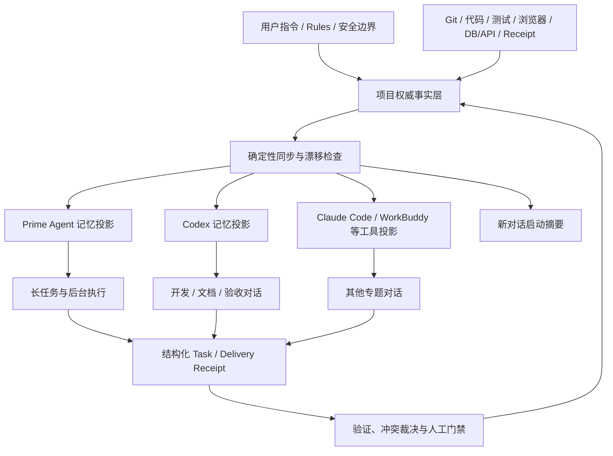

# 多对话共享记忆机制

> 文档状态：v1.2 `IMPLEMENTED_GREEN`（Phase 0～5 已实现并通过故障注入、Prime 回读和运行守护验证）
>
> 适用范围：AOS 项目、Prime Agent、Codex、WorkBuddy、Trae Work、Claude Code 等开发平台及其多个并行对话
>
> 核心原则：**一份权威事实，多套可重建记忆投影；共享事实，不强行共享全部对话历史。**
>
> 安全边界：本文只定义开发协作记忆，不替代 AOS 产品运行时的租户记忆、业务数据、Ontology、Dataset、Pipeline、Receipt 或审计体系。

## 0. 本次评审结论与优化裁决

结论：总体分层、单一权威、Receipt 交接、版本化投影和漂移检查方向正确，可以作为 AOS 多对话共享记忆的总方案；但原基线仍偏“理念完整、实施约束不足”，需要补强以下关键点后再进入自动同步编码：

1. **权威版本必须有唯一分配点**：`project_revision` 不能由多个文档分别手工创造，应由权威 manifest 在封板时以 compare-and-swap 方式分配，状态文档只回显该值。
2. **内容哈希必须可复现**：`content_hash` 只覆盖规范化事实字段，不包含 `generated_at`、本机绝对路径等非确定性字段。
3. **交付状态与记忆健康分离**：已经有工程证据封板的交付不会因某个投影暂时不可用而回滚；但记忆健康必须报告 `YELLOW/RED`，并阻止依赖陈旧强一致事实的下一次状态变更。
4. **同步先只读、后写入**：先实现 `memory-status`，再实现带 dry-run、diff、原子写、写后回读的 `memory-sync`，避免第一步就自动改写多个工具记忆。
5. **工具内置记忆不假装强同步**：无法同步写入或无法回读的平台标记为 `PENDING_ASYNC/UNAVAILABLE`，不能仅凭“已提交更新说明”报告 CURRENT。
6. **凭据与记忆彻底分离**：凭据只允许进入专用认证存储；不得进入启动参数、进程环境快照、模型配置明文、共享投影、Receipt 或日志。
7. **Prime Agent 进程与记忆分别检查**：守护进程存活不等于投影新鲜；supervisor 与 worker 同时存在也不等于重复守护进程，必须按运行时 registry/socket ownership 判断。

上述裁决已在 `aos-platform/scripts/memory/` 和 `AOS项目开发上下文/memory/` 落地。Prime Agent 通过安全启动器从权限为 `0600` 的 `auth.json` 读取认证，命令参数和进程环境不携带 Key；共享记忆已具备唯一 authority、CAS revision、manifest、Schema、Receipt/Lease/Event、只读状态、确定性同步、双状态门和 15 分钟只读健康守护。Codex 内部记忆吸收仍是平台异步能力，系统只生成经用户授权的 ad-hoc 候选并诚实报告 `PENDING_ASYNC`。

## 1. 为什么需要这套机制

AOS 的开发不是在一个永不结束的对话中完成的。实际工作会同时经过：

- 长期持续开发的主对话；
- 临时排障、代码评审、文档编写、浏览器验收等专题对话；
- Codex、Claude Code、WorkBuddy 等不同开发工具；
- Prime Agent 承担的长任务、后台任务、持续推理和独立复审；
- Git、测试、浏览器、数据库、API 和 Receipt 留下的工程证据。

每个工具都可以拥有自己的上下文和记忆，但这些记忆的刷新时机、摘要粒度和生命周期不同。如果每个工具都维护一份“当前项目事实”，迟早会出现：

1. 主开发对话已经完成新波次，其他对话还停留在旧阶段；
2. Prime Agent 的记忆只有人工及时写回才会更新，长期不维护便逐渐滞后；
3. 某个对话把计划、提交说明或旧记忆误当成已验证完成事实；
4. 多个对话分别修改自己的记忆，形成多个可写的“真相中心”；
5. 新对话虽然读到了很多历史，却无法判断哪一份是当前有效版本；
6. 对话摘要丢失细节，或者把调试假设固化成长期结论；
7. 工具之间反复复制长文本，成本高、容易截断，也无法可靠审计。

问题的根因不是“记忆不够多”，而是缺少一份有版本、有证据、有冲突裁决规则的项目事实基线。

## 2. 目标与非目标

### 2.1 目标

本机制要实现以下结果：

- **单一事实基线**：所有开发工具和对话以同一套项目权威文档与工程证据为准。
- **跨对话快速接续**：新对话无须继承全部聊天记录，也能快速知道当前阶段、完成项、风险和下一门。
- **可检测的陈旧状态**：任何工具都能看出自己的记忆版本是否落后，而不是靠感觉判断。
- **可重建的本地记忆**：Prime Agent、Codex 等自身记忆损坏、遗漏或陈旧时，可以从权威事实重新生成。
- **低冲突并行协作**：多个对话同时工作时，有明确的任务范围、基线版本、负责人和交付回执。
- **证据驱动**：提交成功、计划通过、对话声称完成都不是最终事实；完成必须绑定新鲜验证证据。
- **最小敏感信息暴露**：共享的是必要的项目事实和证据索引，不是凭据、Cookie、客户原始数据或完整私密会话。

### 2.2 非目标

本机制不追求：

- 让所有对话拥有完全相同的 token 级聊天历史；
- 把每次思考、试错、临时命令都写进长期记忆；
- 用 Prime Agent 记忆、Codex Memory 或某个工具的摘要取代 Git、测试和运行证据；
- 建立第二套 AOS 生产数据真源；
- 让开发工具直接共享登录态、API Key、Cookie 或其他认证材料；
- 让多个对话无协调地同时修改同一个方案、同一批代码或同一份状态文档。

## 3. 核心理念

### 3.1 一份逻辑事实，多种物理视图

“一份记忆”不是把所有内容塞进一个巨型 Markdown，而是建立一份**逻辑上的权威事实层**：

- 当前项目状态和当前执行检查点回答“现在做到哪里”；
- ADR 和批准方案回答“为什么这样做、边界是什么”；
- Git 和代码回答“实际实现是什么”；
- 测试、构建、浏览器、数据库/API、Receipt 回答“哪些结论有证据”；
- 每波交付回执回答“本次改变了什么、验证了什么、下一步是什么”。

Prime Agent、Codex、Claude Code、WorkBuddy 的记忆都只是这层事实的**消费投影**。投影可以按工具特性优化，但不得独立发明项目事实。

### 3.2 共享事实，不共享全部工作记忆

一个对话中的工作上下文包含大量只对当前任务有用的信息，例如：

- 尚未证实的根因猜测；
- 临时日志和中间变量；
- 被否决的实现路径；
- 未完成的草稿；
- 大量与其他对话无关的页面或代码细节。

这些内容适合留在该对话的 Working Context 中。跨对话共享的应是经过筛选的结构化事实：任务范围、基线版本、决策、结果、证据、风险、阻塞和下一步。

### 3.3 记忆是缓存，不是数据库

各工具自身的长期记忆能够提高接续速度，但存在异步生成、摘要压缩、选择性吸收和人工写回滞后。官方 OpenAI 文档也将 Codex 的 Memories 与项目级 `AGENTS.md`/仓库指导区分开来。因此，必须执行以下原则：

- 必须遵循的规则放在 `AGENTS.md`、项目 Rules 或批准方案中；
- 当前事实放在仓库内的权威状态文档中；
- 工具长期记忆只保存便于检索的摘要和入口；
- 记忆与权威事实冲突时，记忆自动失效并等待重建。

### 3.4 版本比“最后更新时间”更可靠

单看时间无法判断两个记忆是否描述同一份事实。方案引入单调递增的：

```text
project_revision: AOS-000053
```

每次权威事实封板时递增版本。所有记忆投影和任务交接都携带该版本。这样可以直接判断：

- 当前权威版本是 `AOS-000053`；
- 某对话以 `AOS-000048` 开始工作；
- 它在写入前必须先刷新和对账，而不能覆盖新事实。

`project_revision` 是协作版本，不替代 Git commit。一次版本可能引用一个或多个代码、文档和证据提交。本文中的 `AOS-000053`、`AOS-000054`、commit 和时间均为格式示例，**不是对当前项目版本的声明**；首次真实编号由 Phase 0 对账确定。

### 3.5 事实必须有来源和证据等级

每条关键结论至少应能回答：

- 由谁、在什么任务中产生；
- 来自代码、数据库/API、测试、浏览器、Receipt、人工决策还是推断；
- 对应哪些文件、提交、命令或证据；
- 结论覆盖哪个租户、环境、页面或波次；
- 有什么限制，哪些仍未知。

## 4. 总体分层



### 4.0 跨开发平台共享边界

本机制从设计上就是跨开发平台的。Codex、WorkBuddy、Trae Work、Claude Code 或后续接入的其他开发 Agent，可以共享同一份项目事实，但需要准确区分三类内容：

| 内容 | 是否跨平台共享 | 方式 |
|---|---|---|
| 项目权威事实 | 是 | 共同读取仓库状态文档、ADR、Git 与证据索引 |
| Task/Delivery Receipt | 是 | 按统一 schema 提交到共享入口 |
| 各工具生成的项目记忆投影 | 语义共享、物理分开 | 从同一 revision 确定性生成各平台格式 |
| 原始聊天记录、隐藏工作上下文 | 否 | 留在产生它的平台和对话中 |
| 登录态、Cookie、Token、API Key | 否 | 由各平台自己的安全配置管理 |

因此，“跨平台共享记忆”更准确的表达是：

> 多个平台共同消费一份权威事实，并把各自验证完成的工作通过统一 Receipt 提交回来；各平台的原生记忆只是同一事实的本地投影。

如果 Codex、WorkBuddy 和 Trae Work 都能访问同一个本地仓库，最小实现就是共同使用 Git 中的状态文档、Receipt 目录和 revision。如果某个平台不共享同一文件系统，则通过受控的 Git 拉取/推送、内部 API 或 MCP 适配器传递相同 schema；传输方式可以不同，事实 ID、revision、来源和证据语义必须相同。

每个平台需要一个轻量适配器，至少实现：

```text
read_authority()       读取权威 revision、当前门和硬边界
submit_receipt()       提交本对话的结构化交付事实
read_sync_status()     判断本地投影是否陈旧或漂移
refresh_projection()   在权威事实封板后刷新本平台记忆投影
```

适配器不能让平台绕过事实封板流程，也不能把平台自己的聊天摘要直接写成权威事实。

### 4.1 L0：不可绕过的约束层

包括：

- 用户本轮明确指令；
- 根目录和子目录 `AGENTS.md`；
- 安全、权限、租户隔离和保密要求；
- 已批准且尚未被新决策替代的方案军规。

这一层不应只存在于某个工具的记忆中，因为它必须在没有记忆命中的情况下仍然生效。

### 4.2 L1：项目权威事实层

AOS 当前建议以以下仓库材料为主入口：

- `/Users/ddt/work/projects/ai_agent/docs/palantier/AOS项目开发上下文/01-当前项目状态.md`
- `/Users/ddt/work/projects/ai_agent/docs/palantier/AOS项目开发上下文/06-当前执行检查点.md`
- `/Users/ddt/work/projects/ai_agent/docs/palantier/AOS项目开发上下文/04-ADR索引.md`
- 与当前波次对应的批准方案、D-waves 清单和封板对账文档；
- `aos-platform` 当前分支、代码、迁移、测试和证据文件。

这不是说“Markdown 比代码权威”，而是由状态文档负责索引代码与证据，组成可阅读的事实闭环。

### 4.3 L2：协作事实与交付回执层

每个并行任务使用结构化 Task Receipt 和 Delivery Receipt 表达输入与输出。它们让对话之间共享必要事实，而不是复制聊天历史。

### 4.4 L3：工具记忆投影层

包括：

- Prime Agent Harness / RLM 中的项目记忆；
- Codex Memory 的索引、摘要和专项经验；
- `.workbuddy/memory` 或其他开发工具的项目记忆；
- 为具体工具生成的启动摘要。

这些投影应标记为 `generated` 或 `derived`，并携带来源版本。除用户偏好、通用技能等非项目进度内容外，不允许把它们当成独立的项目事实写入口。

### 4.5 L4：对话工作上下文层

每个对话独立保留：

- 当前问题的详细上下文；
- 临时计划、日志和假设；
- 未验证的中间结论；
- 尚未封板的修改。

此层默认不向其他对话同步。只有通过交付回执并完成验证的内容，才能晋升到权威事实层。

## 5. Prime Agent 与各开发 Agent 的职责

### 5.1 Prime Agent 的定位

Prime Agent 的优势是：

- 持久 RLM 上下文；
- 跨轮次的长任务和多轮调试；
- daemon、detach/reattach、heartbeat 等持续运行能力；
- 子任务协作和质量门控；
- 对经验进行复盘、提炼和写回。

在本机制中，Prime Agent 应承担：

1. **长任务执行器**：处理需要持续运行、恢复和反复验证的任务。
2. **独立复审者**：针对方案、代码或证据给出结构化审查结果。
3. **记忆协调器**：检查多个投影是否落后、缺项或互相矛盾。
4. **同步执行者**：在权威事实封板后，生成或更新面向不同工具的只读投影。
5. **漂移监视器**：定期比较权威 `project_revision` 与各工具投影版本。

Prime Agent **不应**成为：

- AOS 当前项目状态的唯一真源；
- AOS 生产 Agent 的租户记忆数据库；
- 绕过方案、审批、Git 和测试的“自动完成证明”；
- 凭据或客户敏感数据仓库；
- 各工具可以随意覆盖的公共便笺。

一句话概括：**Prime Agent 负责持续执行与记忆协调，不负责垄断事实。**

### 5.2 Codex 等开发工具自身记忆的定位

每种工具的记忆系统都可以保留其优势：

- 用户长期偏好；
- 经验证、可复用的工作方法；
- 项目入口和关键文档索引；
- 历史波次的高层摘要；
- 常见陷阱、安全边界和验证纪律。

但不应独立维护：

- 不带版本的“当前下一步”；
- 未经证据封板的完成状态；
- 与当前状态文档重复、却可能分叉的大段进度正文；
- 密钥、Cookie、真实客户隐私数据；
- 只在一个对话中成立的临时假设。

开发工具开始新对话时，不是问“我记得什么”，而是先问：

```text
我的本地投影 revision 是多少？
项目权威 revision 是多少？
两者是否一致？
当前任务需要读取哪些批准方案和新鲜证据？
```

Codex、WorkBuddy、Trae Work 等平台的实现可以不同，例如一个平台使用本地 Memory 文件，另一个平台使用项目知识库或 Rules，但它们对项目当前事实必须遵循同一合同：

- 本地记忆包含 `project_revision` 和来源索引；
- 启动时先与权威 revision 对账；
- 本对话产出的事实以 Delivery Receipt 提交；
- 未封板 Receipt 只能是候选事实；
- 平台不得把自己的摘要时间戳当成项目版本；
- 平台切换不改变任务 ID、租户边界、证据要求和完成状态定义。

### 5.3 主开发对话的特殊责任

长期执行 AOS 开发的主对话通常掌握最新代码、测试和未封板现场，所以由它在**当前波次到达稳定边界后**初始化本机制最合理。这里的“稳定边界”是：

- 当前修改范围明确；
- 关键验证已经完成或阻塞已经诚实记录；
- 提交和工作树状态可确认；
- 状态文档能够准确描述下一门。

不需要等整个 AOS 项目开发完。越晚实施，记忆分叉越多。

主开发对话负责提供最新事实，但它也不能仅凭自己的聊天上下文直接封板；仍需以 Git、测试、浏览器和运行证据校验。

### 5.4 专题对话的责任

排障、文档、评审、浏览器等专题对话必须：

- 启动时声明读取到的 `base_revision`；
- 只在分配的 scope 内工作；
- 不直接覆盖“当前项目状态”；
- 结束时产出 Delivery Receipt；
- 对未验证、推断和阻塞使用明确状态；
- 由协调者合并事实，而不是自行宣布全项目进入新阶段。

### 5.5 谁负责把多对话事实维护进 Prime Agent

答案不是“每个对话都写 Prime Agent”，而是采用**多对话提交、单协调者封板、单通道同步**：

| 角色 | 当前阶段负责人 | 责任 |
|---|---|---|
| 事实提交者 | 各开发/排障/文档/验收对话 | 只提交结构化 Delivery Receipt，不直接修改 Prime Agent 项目进度记忆 |
| 事实封板者 | AOS 主开发对话（或用户明确指定的当班协调者） | 核验 Git、测试、浏览器、DB/API、Receipt，解决冲突，更新权威状态并提升 `project_revision` |
| 投影同步者 | 当前先由事实封板者运行同步；自动化后由 Prime Agent 的 memory coordinator 任务运行 `memory-sync` | 只把已经封板的权威事实投影到 Prime Agent，不接受未经封板的对话陈述 |
| 漂移检查者 | Prime Agent 定时任务或波次退出门 | 运行 `memory-status`，发现 STALE/DRIFTED 时告警，不擅自创造或改判事实 |

这里的“各对话”包括跨平台对话：Codex 对话、WorkBuddy 对话、Trae Work 对话以及其他已接入协议的开发 Agent 都是平等的事实提交者。协调者按 Receipt 和证据判断，不按开发平台品牌判断；任何平台都不能因为拥有较长上下文而自动获得事实封板权。

因此，当前没有自动化工具时，**AOS 主开发对话是 Prime Agent 项目记忆的唯一维护入口**。它在每个稳定波次收尾时按以下顺序执行：

```text
收集各对话 Delivery Receipt
→ 核验真实工程证据
→ 更新项目权威状态
→ 提升 project_revision
→ 更新 Prime Agent 投影
→ 回读 Prime Agent 并校验 revision/hash
```

自动化完成后，AOS 主开发对话不再手工编辑 Prime Agent 的三份摘要，而是触发一次 `memory-sync`；Prime Agent 的协调任务从权威文档生成自己的项目投影。这里 Prime Agent 是**同步执行者**，不是事实审批者。若输入 Receipt 互相冲突、证据缺失或 revision 不匹配，同步必须停止并交回 AOS 主开发对话或用户裁决。

为了避免主开发对话长期繁忙造成同步滞后，可以设置“当班记忆协调者”，但必须满足：

- 每个时段只有一个协调者拥有提升 revision 和触发 Prime 同步的权利；
- 交班时记录当前 revision、未处理 Receipt 和同步健康状态；
- 协调者可以换人，权威入口和同步协议不能变化；
- 用户明确决策始终高于协调者判断。

## 6. 权威事实模型

### 6.1 最小元数据

权威 manifest 负责分配版本，`01-当前项目状态.md` 和 `06-当前执行检查点.md` 顶部回显同一份机器可读元数据：

```yaml
---
project: AOS
project_revision: AOS-000053
source_commit: 81c5f82
status_generated_at: 2026-08-12T14:30:00+08:00
authority_owner: aos-main-development
evidence_cutoff: 2026-08-12T14:20:00+08:00
---
```

字段解释：

| 字段 | 含义 |
|---|---|
| `project_revision` | 项目协作事实版本，单调递增 |
| `source_commit` | 本次状态主要对应的代码基线；多提交时可指向封板 HEAD |
| `status_generated_at` | 状态文档最后生成时间，不作为唯一新旧依据 |
| `authority_owner` | 本次封板协调者，不表示个人永久所有权 |
| `evidence_cutoff` | 本轮采用证据的时间边界 |

版本提升必须满足：

```text
expected_revision == authority_manifest.project_revision
AND receipt/evidence validated
AND atomic compare-and-swap succeeds
```

状态文档之间版本不一致时，整体状态为 `DRIFTED`，任何一个文档都不得自行覆盖另一个文档。

### 6.2 事实状态词

统一使用有限状态，避免自然语言含混：

| 状态 | 定义 |
|---|---|
| `PLANNED` | 已提出但未批准 |
| `PLAN_APPROVED` | 方案获批，但不等于已编码 |
| `IN_PROGRESS` | 已进入实施，尚未满足退出门 |
| `IMPLEMENTED_UNVERIFIED` | 已实现但缺少完整的新鲜验证 |
| `IMPLEMENTED_GREEN` | 实现和约定范围验证均通过 |
| `BLOCKED` | 有明确阻塞，不能安全推进 |
| `SUPERSEDED` | 已被后续决策或版本替代 |
| `UNKNOWN` | 证据不足，不能推断成功或失败 |

### 6.3 证据等级

建议每个完成结论引用以下一种或多种证据：

| 等级 | 证据 | 能证明什么 |
|---|---|---|
| E0 | 对话陈述、计划、提交说明 | 仅是线索或意图 |
| E1 | Git diff/commit、静态检查 | 存在对应修改，不能单独证明运行正确 |
| E2 | 定向测试、累计回归、构建 | 约定测试范围内成立 |
| E3 | 浏览器/API/数据库真实验证 | 指定环境、租户和路径的运行结果 |
| E4 | 不可变 Receipt、审计记录、可复核证据包 | 可追溯的交付或外部动作事实 |

“GREEN”必须说明采用了哪些等级、覆盖哪些范围和有哪些限制。例如本地 API health 异常时，前端失败关闭验收通过不能描述成真实正向 API 验收通过。

## 7. 任务交接协议

### 7.1 Task Receipt：任务开始时

```yaml
task_id: AOS-AIP5-E4C-20260812-01
owner: codex-thread-xxx
base_revision: AOS-000053
scope:
  - Memory Governance 页面
  - 导航接入
excluded_scope:
  - 后端契约改动
  - 真实业务数据写入
source_files:
  - /absolute/path/to/approved-plan.md
  - /absolute/path/to/current-checkpoint.md
expected_outputs:
  - files
  - tests
  - browser evidence
write_lease:
  paths:
    - apps/web/src/...
  expires_at: 2026-08-12T18:00:00+08:00
```

`write_lease` 是跨对话的语义范围租约；同机读写 additionally 使用 `flock` 保护 authority、投影、Lease 和 Receipt 的临界区。`flock` 由内核在进程退出时释放，不依赖可残留的 socket lock 文件；它不能替代跨机器 Lease，二者共同工作。

### 7.2 Delivery Receipt：任务结束时

```yaml
task_id: AOS-AIP5-E4C-20260812-01
base_revision: AOS-000053
result: IMPLEMENTED_GREEN
changed_files:
  - /absolute/path/to/file
commits:
  - abcdef1
verification:
  - command: pnpm test ...
    result: 12 passed
  - evidence: /absolute/path/to/browser-evidence.json
risks:
  - real positive API response was not available
blockers: []
proposed_authority_changes:
  completed:
    - AIP-5 E4C ...
  next_gate: AIP-5 E4D ...
```

协调者必须复核 Receipt 与实际文件、提交和证据一致，才能提升 `project_revision`。

## 8. 启动、执行与收尾流程

### 8.1 新对话启动流程

每个 AOS 开发对话按以下顺序读取：

1. 当前目录及父目录的 `AGENTS.md` / Rules；
2. `01-当前项目状态.md`；
3. `06-当前执行检查点.md`；
4. 当前任务对应的批准方案、产品方案、ADR 和执行清单；
5. Git 分支、工作树、HEAD、相关测试和证据的实时状态；
6. 本工具自己的记忆投影，仅用于补充历史和检索入口；
7. 对比 `project_revision`，不一致时先刷新再工作。

推荐的统一启动口令为：

> 先同步 AOS 权威事实，确认当前 `project_revision`、Git 基线和任务 scope，再开始工作。记忆只作索引，冲突时以权威文档和新鲜工程证据为准。

最终应把这条要求写入 AOS 项目 `AGENTS.md` 或项目技能，使其不依赖用户每次手工提醒。

### 8.2 工作中流程

- 对话保留本任务详细上下文，不频繁写长期记忆；
- 新发现先记录为 `observation` 或 `hypothesis`，验证后才升级为 `fact`；
- 若发现权威文档已被其他任务提升版本，暂停状态写入并重新对账；
- 不在没有授权的情况下扩大 scope；
- 外部动作、数据库写入、发布和审批均使用对应权限与 Receipt，不因“共享记忆”获得额外授权。

### 8.3 波次收尾流程

完整顺序为：

1. 完成定向测试、累计测试、构建及必要的浏览器/数据/租户验证；
2. 生成 Delivery Receipt；
3. 对照批准方案检查范围、逻辑和风险；
4. 更新当前状态、检查点、相关清单、ADR/证据索引；
5. `project_revision` 加一；
6. 运行 `memory-sync` 生成各工具投影；
7. 运行 `memory-status` 并回读所有投影；
8. 所有强一致投影为 GREEN 后，才可以报告“记忆同步闭环完成”。

退出门可表达为：

```text
authority updated
AND project_revision incremented
AND evidence linked
AND memory-sync succeeded
AND all strong projections = CURRENT
AND memory-status = GREEN or GREEN_WITH_WARNINGS only for declared eventual projections
```

交付封板和记忆健康是两个相关但不同的状态：

- `delivery_status` 由方案、代码、测试、浏览器/数据证据和 Receipt 决定；
- `memory_health` 由权威文档及各工具投影的新鲜度决定；
- 投影短暂不可用不回滚已经封板的 `IMPLEMENTED_GREEN`；
- 但 `memory_health != GREEN` 时，必须登记补偿任务，并阻止依赖该陈旧强一致事实的下一次状态变更；
- 最终汇报必须同时写出两个状态，禁止用其中一个替代另一个。

## 9. 同步机制设计

### 9.1 `memory-status`：只读健康检查

第一阶段先实现只读命令，输出类似：

```text
AOS authority revision: AOS-000053
Git head: 81c5f82

Projection                    Revision       Status
Prime/aos-milestones          AOS-000052     STALE
Prime/aos-current-delivery    AOS-000053     CURRENT
Prime/aos-qiyuehui-data       AOS-000051     STALE
Codex project summary         AOS-000053     CURRENT
WorkBuddy project memory      unknown        UNVERSIONED

Overall: YELLOW
```

状态定义：

- `CURRENT`：版本与来源摘要一致；
- `STALE`：投影版本落后；
- `AHEAD`：投影声称的版本高于权威层，属于异常；
- `DRIFTED`：版本相同但内容哈希或关键字段不一致；
- `UNVERSIONED`：旧投影没有版本号；
- `UNAVAILABLE`：对应工具或存储不可访问；
- `CURRENT_WITH_WARNINGS`：版本一致但存在允许的非关键延迟。

### 9.2 `memory-sync`：确定性投影生成

第二阶段实现同步命令，从权威材料读取固定字段，生成不同工具需要的精简投影：

```yaml
projection_schema: aos-memory-projection/v1
project_revision: AOS-000053
source_commit: 81c5f82
generated_at: 2026-08-12T14:35:00+08:00
source_files:
  - .../01-当前项目状态.md
  - .../06-当前执行检查点.md
content_hash: sha256:...
current_phase: AIP-5 E4
last_green_gate: AIP-5 E3
next_gate: AIP-5 E4C
hard_boundaries:
  - org-org/dev-project is real target
  - dev-org/dev-project is negative canary only
evidence_summary:
  - ...
```

同步原则：

- 同样输入生成同样核心内容；
- 各工具可以改变格式，不能改变事实语义；
- 默认只生成摘要和链接，不复制所有正文；
- 写入后必须回读并校验版本及哈希；
- 任一投影失败不得回滚已封板的权威事实，但整体健康状态应为 YELLOW；
- 投影恢复后可以从权威层重建，不需要从另一个投影反向复制。

Prime Agent 投影是特殊的强一致适配器：不得把“找到 global Harness 条目、保留历史、递增版本”交给模型自由执行。实现必须对 `harness_state.json` 做确定性、受锁、原子、可回滚的结构化更新，并额外维护最后成功的条目版本及内容哈希；Prime 原生 Harness CRUD 与 AOS 同步适配器必须共用同一把文件锁，陈旧进程不得覆盖新快照。受管权威块必须位于条目首部，旧正文只能放入显式的“历史材料（仅供追溯，可能过时）”区，避免模型先读旧状态形成语义漂移。若条目版本低于已记录基线、或权威块不在首部，即使 revision/hash marker 正确也必须判定为 `DRIFTED`；恢复时从最后成功版本单调递增，不能从错误的 `v1` 继续。同一 authority revision 重复同步必须幂等。

`content_hash` 的规范化规则必须固定并有测试：字段按 schema 排序、文本统一换行、集合按稳定键排序；排除 `generated_at`、临时目录、进程 PID 和本机绝对路径等运行噪声。`generated_at` 可以不同，但同一 authority revision 的事实核心必须得到相同哈希。

### 9.3 强一致与最终一致

不同内容不应使用相同同步强度。

**强一致内容**：

- 当前执行门和下一门；
- 租户、安全、保密和权限边界；
- 当前批准/禁止编码状态；
- 活跃任务 scope 和写入租约；
- 当前 `project_revision`。

这些内容不一致时，对话不得执行状态变更。

**最终一致内容**：

- 历史里程碑摘要；
- 可复用技巧；
- 长期经验索引；
- 不影响当前安全和执行决策的背景说明。

这些内容短暂滞后可以接受，但要显示版本和警告。

**会话本地内容**：

- 临时调试假设；
- 中间日志；
- 未批准草案；
- 思维过程和被放弃方案。

这些不进行全局同步。

## 10. 冲突裁决

### 10.1 优先级

发生冲突时按以下顺序裁决：

1. 用户本轮明确指令；
2. 安全政策、`AGENTS.md` 和当前适用 Rules；
3. 数据库/API/不可变 Receipt 等真实运行事实；
4. Git 中的实际代码、迁移、测试和证据；
5. 当前项目状态与当前执行检查点；
6. ADR、已批准产品/技术方案与执行清单；
7. 各工具的记忆投影；
8. 单个对话摘要、历史自然语言陈述和未验证推断。

高优先级也有适用范围。例如一次定向测试通过不能覆盖另一个环境的真实失败；旧 ADR 若已明确标记 `SUPERSEDED`，不能压过新 ADR。

### 10.2 旧对话恢复规则

假设一个旧对话的 `base_revision=AOS-000048`，当前权威版本已经是 `AOS-000053`：

- 可以继续读取和解释旧任务；
- 不得直接修改权威状态或相同文件 scope；
- 必须读取 49～53 的变更摘要和当前 Git 状态；
- 若原方案仍适用，生成新的 Task Receipt 后继续；
- 若原方案已被替代，旧任务标记 `SUPERSEDED`；
- 旧对话的本地记忆不能把全局状态“回滚”到 48。

### 10.3 并发写冲突

两个对话试图修改同一 scope 时：

- 后申请者默认只读或等待；
- 如果能拆成不相交文件与契约，可重新划分 lease；
- 如果都已修改，先停止自动合并，由协调者基于基线和语义对账；
- 禁止用覆盖文件、强推或重置来伪造一致性。

## 11. 安全、隐私与治理

### 11.1 禁止写入共享记忆的内容

- API Key、密码、Cookie、Token 和私钥；
- 真实客户联系方式、订单明细、账号或非公开数据样本；
- 本机浏览器认证资料和 CDP 会话秘密；
- 未经批准的部署地址和内部拓扑细节；
- 模型的隐藏思维过程；
- 无来源、无范围、无状态的“经验结论”。

可以记录“凭据由某配置管理，当前是否配置”以及安全的文件入口，但不记录值。

### 11.2 最小披露

投影按角色裁剪：

- 文档对话只需要当前产品边界、公开事实和文宣保密要求；
- 浏览器验收对话需要页面、租户、预期状态和证据目录；
- 后端开发对话需要相关契约、迁移、测试和数据边界；
- Prime Agent 协调器需要投影版本、状态和来源索引，不必默认读取所有客户数据。

### 11.3 写入权限

建议最终只允许“记忆协调器”或封板流程修改权威状态元数据。其他对话通过 Delivery Receipt 提议变更。初期未实现权限控制时，也应先用流程约束：

- 专题对话不直接提升 `project_revision`；
- 主开发对话或指定协调者负责合并；
- 每次提升版本保留 Git diff 和提交记录；
- 失败或阻塞同样要记录，禁止只同步好消息。

### 11.4 Prime Agent 凭据与安全启动

Prime Agent 的认证与记忆同步是两条独立链路，统一执行以下安全基线：

- AGNES 凭据只保存在 `~/.prime/agent/auth.json`，文件权限必须为 `0600`，所有者必须是当前用户；
- `models.json` 只保存 provider、endpoint、模型能力和环境变量**名称**等非秘密元数据，不得保存真实 Key；
- 启动命令禁止使用 `--api-key <value>`，也禁止使用 `AGNES_API_KEY=<value> prime-agent ...`；
- 安全启动器在启动前主动 `unset AGNES_API_KEY`，且不 source `~/.zshrc`；
- 需要常驻时由操作系统用户级服务管理器托管安全启动器，服务配置只引用启动器路径，不重复保存参数或凭据；
- daemon 从 `auth.json` 读取凭据，命令行、进程列表、shell history 和普通日志不得出现 Key；
- 启动前做权限与 JSON 结构检查，失败时关闭启动，不回显凭据内容；
- 启动后分别验证 registry/socket ownership、daemon 状态、真实最小模型调用和投影新鲜度；
- 如果 Key 曾出现在命令行、进程列表、聊天记录或日志中，应视为已暴露：先完成无 Key 启动，再在凭据提供方轮换 Key，并只更新 `auth.json`。

`~/.zshrc` 不再承担 Prime Agent 凭据注入责任，旧导出已经移除并显式清除继承变量。由于凭据曾在历史启动输出中出现，仍须在提供方轮换旧 Key；轮换只更新 `auth.json`，不改启动参数。

## 12. 落地实施计划

实施状态分为：

| 阶段 | 状态 | 当前裁决 |
|---|---|---|
| Phase 0 | `IMPLEMENTED_GREEN` | 已建立真实 AOS authority，并从 `AOS-000001` 连续推进 |
| Phase 1 | `IMPLEMENTED_GREEN` | manifest、5 份 JSON Schema、01/06 管理块、Task/Delivery 模板已落地 |
| Phase 2 | `IMPLEMENTED_GREEN` | `memory-status` 可识别 CURRENT/STALE/AHEAD/DRIFTED/UNVERSIONED/UNAVAILABLE/PENDING_ASYNC |
| Phase 3 | `IMPLEMENTED_GREEN` | `memory-sync` 支持 dry-run/apply、原子写、幂等、Prime 无 Key 同步和 marker 回读 |
| Phase 4 | `IMPLEMENTED_GREEN` | `memory-gate` 分离 delivery/memory；真实 DRIFTED 故障注入返回 RED/exit 2 |
| Phase 5 | `IMPLEMENTED_GREEN` | Receipt、范围 Lease、Event JSONL、CAS、`flock`、15 分钟只读健康守护已落地 |

### Phase 0：由 AOS 主开发对话建立真实基线

目标：不写同步代码，先把当前事实收准。

1. 等当前开发波次进入稳定边界，不必等待整个项目结束；
2. 复核 `aos-platform` 当前分支、HEAD、工作树和最近提交；
3. 运行当前波次约定测试并核对浏览器/运行证据；
4. 对账 `01-当前项目状态.md`、`06-当前执行检查点.md`、ADR、方案和清单；
5. 将冲突和过期内容显式标为 `SUPERSEDED` 或修正；
6. 确定第一个 `project_revision`；
7. 只读盘点 Prime Agent、Codex、WorkBuddy 等现有记忆的版本与差异。

退出条件：任何新对话只读上述入口，都能得到相同的“当前门、完成事实、限制和下一步”。

### Phase 1：协议与元数据

目标：先建立最小可用的人工协议。

建议修改/新增的方案文件：

- 本文档；
- AOS 项目 `AGENTS.md`：增加启动同步和 revision 门禁；
- `01-当前项目状态.md`、`06-当前执行检查点.md`：增加元数据；
- 一个 Task/Delivery Receipt 模板；
- 一个投影 manifest，登记各工具记忆位置和同步责任。

权威 manifest 还必须登记：schema 版本、当前 revision、强/最终一致级别、投影位置、可写方式、回读方式、内容哈希算法和最后一次同步 Receipt。禁止仅靠状态文档里的两份重复 frontmatter 分配 revision。

已先完成人工 RED 基线验证，再进入自动投影；实现顺序未跳过评审门。

### Phase 2：只读 `memory-status`

目标：先发现漂移，不做自动写入。

能力清单：

- 读取权威 revision 和 Git HEAD；
- 读取各投影 revision；
- 检测 `STALE/AHEAD/DRIFTED/UNVERSIONED/UNAVAILABLE`；
- 输出人类可读表格和机器可读 JSON；
- 不读取或输出任何凭据；
- 进程异常时失败关闭，不把“无法检查”报告成 GREEN。

### Phase 3：确定性 `memory-sync`

目标：从权威层生成工具投影。

能力清单：

- 解析权威文档元数据和固定章节；
- 生成 Prime Agent 三类项目摘要；
- 生成 Codex/其他工具的项目入口摘要；
- 每份投影携带 schema、revision、source commit、source files 和 hash；
- 写入前展示 diff 或生成候选；
- 写入后回读验证；
- 不直接修改工具不可控的内部记忆文件；若某平台要求异步吸收，则生成它支持的更新说明并跟踪最终吸收状态。

### Phase 4：接入波次退出门

目标：让同步成为正常交付的一部分。

- 更新权威文档；
- 提升 revision；
- 运行 memory-sync；
- 运行 memory-status；
- 结果为 GREEN 后才能报告“记忆对账完成”；
- 若投影暂不可用，项目交付本身可保持已完成，但必须报告记忆健康为 YELLOW，后续补偿同步。

### Phase 5：并行任务租约与事件日志

在多对话并发明显增加后再实施：

- Task Receipt 注册；
- 文件/scope lease；
- Delivery Receipt 收集；
- append-only memory event log；
- 乐观并发控制：`expected_revision`；
- 冲突告警和人工裁决；
- Prime Agent 定时漂移检查。

不要一开始就建设复杂中心服务。先用仓库文档、CLI 和 Git 完成闭环，确认真实痛点后再服务化。

## 13. 建议的目录与文件

初始阶段建议保持简单：

```text
docs/
├── 多对话共享记忆机制.md
└── palantier/AOS项目开发上下文/
    ├── 01-当前项目状态.md
    ├── 06-当前执行检查点.md
    ├── 04-ADR索引.md
    └── memory/
        ├── projection-manifest.yaml
        ├── task-receipt-template.yaml
        ├── delivery-receipt-template.yaml
        └── events/

aos-platform/
├── AGENTS.md
└── scripts/
    └── memory/
        ├── memory-status
        └── memory-sync
```

这是目标结构建议，不代表本文已经创建其中除本文件外的内容。实际目录、命令语言和集成方式应由 AOS 主开发对话在编码前结合仓库现状完善实施方案。

## 14. 验收标准

### 14.1 功能验收

- 任意新对话能在固定入口读取当前 revision、阶段、下一门、硬边界和证据索引；
- Prime Agent、Codex 和至少一个其他工具的投影均带同一 revision；
- 人为放置一个旧 revision 后，`memory-status` 能报告 `STALE`；
- 人为制造同 revision 不同 hash 后，能报告 `DRIFTED`；
- 旧对话不能用旧 `base_revision` 覆盖新状态；
- `memory-sync` 重复运行具有幂等性；
- 任一工具投影丢失后可从权威层重建。

### 14.2 安全验收

- 无凭据、Cookie、真实客户敏感明细进入共享投影；
- 真实目标 `org-org/dev-project` 与负向 canary `dev-org/dev-project` 不混淆；
- 工具记忆异常或不可用不会绕过项目门禁；
- 记忆同步不获得额外代码、数据库、浏览器或外部发布权限；
- 未分类的记忆写入失败关闭。
- Prime Agent 启动参数和进程命令行不包含 Key；
- daemon 进程环境不包含 `AGNES_API_KEY`；
- `auth.json` 权限为 `0600`，`models.json` 与共享记忆不包含真实 Key；
- 在主动清除 `AGNES_API_KEY` 的环境中，Prime Agent 仍能通过 `auth.json` 完成最小模型调用；
- 凭据曾暴露时完成轮换，并确认旧 Key 不再被使用。

### 14.3 工程验收

- 文档元数据、CLI 输出和投影 schema 一致；
- 有单元测试覆盖解析、版本比较、hash、幂等和冲突；
- 有集成测试覆盖 Prime Agent/本地投影的写后回读；
- 对现有正常开发流程做最小改动；
- 不覆盖用户未提交变更；
- 方案、实现、测试和实际运行结果自洽。

## 15. 运行纪律

### 开始任何 AOS 任务前

- 读 Rules 和 `AGENTS.md`；
- 读权威状态与检查点；
- 确认 `project_revision`；
- 实时检查 Git 和任务证据；
- 读取相关批准方案；
- 登记 Task Receipt 或至少声明 scope。

### 完成任何 AOS 波次前

- 运行新鲜验证；
- 诚实记录失败、跳过项和环境限制；
- 生成 Delivery Receipt；
- 更新权威事实并提升 revision；
- 生成并回读工具投影；
- 检查 Prime Agent 服务和记忆健康；
- 给出下一门及具体任务清单。

### 禁止事项

- 禁止把“对话还记得”当作项目已经同步；
- 禁止把 Prime Agent `MEMORY_HEALTH_OK` 当成当前波次完成证据；
- 禁止把计划批准、commit message 或提交成功当成实现 GREEN；
- 禁止多个工具各自维护无版本的“当前状态”；
- 禁止从旧投影反向覆盖权威状态；
- 禁止在记忆里保存凭据和真实客户敏感数据。

## 16. 一个典型协作示例

假设主开发对话正在执行 `AIP-5 E4C`，文档对话同时编写产品说明，Prime Agent 做独立复审：

1. 三者都读取 `AOS-000053`；
2. 主开发对话领取页面和导航 scope；
3. 文档对话领取公开说明文档 scope，不修改当前状态；
4. Prime Agent 只读领取方案/代码复审 scope；
5. 主开发对话完成代码、测试和浏览器验收，提交 Delivery Receipt；
6. 文档对话提交文档 Receipt，明确没有新增实现事实；
7. Prime Agent 提交审查结论，P0/P1 问题必须先处理；
8. 协调者核验三份 Receipt、Git 和证据；
9. 更新权威状态到 `AOS-000054`；
10. `memory-sync` 生成 Prime/Codex/WorkBuddy 投影；
11. `memory-status` 全部 CURRENT 后，新对话统一从 `AOS-000054` 开始。

这样，各对话并不共享全部聊天内容，却共享了足以继续工作的同一份事实。

## 17. 最终结论

合理利用 Prime Agent 和各开发工具记忆的关键，不是强迫所有工具只用同一个物理记忆文件，而是建立以下秩序：

1. **仓库中的项目事实和工程证据是唯一权威基线。**
2. **Prime Agent 是长任务执行器、独立复审者和记忆协调器。**
3. **Codex、Claude Code、WorkBuddy 等自身记忆是带版本、可重建的只读投影。**
4. **对话保留各自工作上下文，只通过结构化 Receipt 共享已验证事实。**
5. **所有当前事实都携带 `project_revision`，旧对话写入前必须刷新。**
6. **波次完成必须同时闭环方案、代码、证据、权威文档和记忆健康。**

实施已按 Phase 0→5 顺序完成：先完成无 Key 启动和真实 revision，再验证只读漂移识别，随后启用确定性写投影、失败关闭门和 Receipt/Lease/Event。日常使用时，新对话先运行 `scripts/memory/memory-status --json` 与 `scripts/memory/memory-validate --json`；封板协调者使用 `memoryctl.py authority-update --expected-revision ...`、`memory-sync --apply --prime` 和 Receipt 命令。当方案门发生变化时，协调者必须通过可重复 `--hard-boundary` 参数在同一 CAS revision 中整组替换 `hard_boundaries`；禁止为了删除过期边界直接编辑 `authority.json`。健康守护每 15 分钟只刷新 `~/.prime/agent/memory-health.json`，不自动修改项目事实。

完成后，其他对话依靠统一启动门禁和 revision 对账即可跟上；它们不需要得到主对话的全部历史，也不再依赖人工把同一段进度复制到每一个聊天窗口。

## 18. 参考

- AOS 当前项目状态、执行检查点、ADR 与各波次封板材料；
- Prime Agent RLM、Continual Harness、`/refine` 和长任务协作机制；
- [OpenAI Codex 官方文档：Memories](https://learn.chatgpt.com/docs/customization/memories)
- [OpenAI Codex 官方文档：Custom instructions with AGENTS.md](https://learn.chatgpt.com/docs/agent-configuration/agents-md)

以上官方产品能力会演进，实施时应重新核对当前文档；本文对 Prime Agent 和 AOS 的职责划分属于本项目方案，不代表 OpenAI 官方定义。
