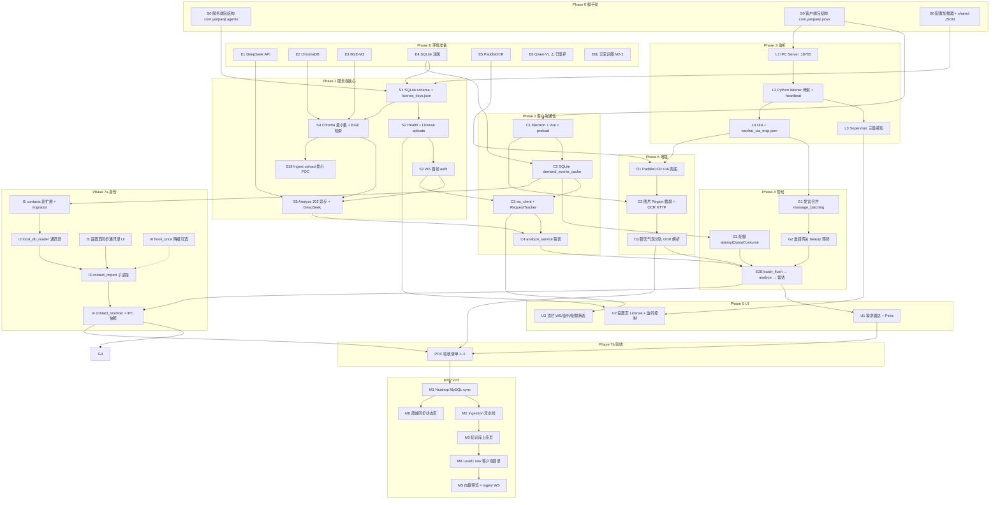
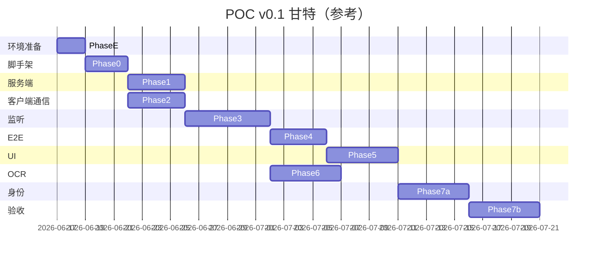

# 开发计划总览 — 谛听 × SalesAgent

> **文档版本**：v1.16  
> **最后更新**：2026-07-02  
> **适用范围**：POC v0.1（Phase 0–7b）→ MVP v0.5 → v1.0 路线图  
> **前置文档**：[技术方案-谛听客户端](技术方案-谛听客户端.md)、[技术方案-SalesAgent服务端](技术方案-SalesAgent服务端.md)、[仓库目录结构](仓库目录结构.md)、[产品设计文档（PRD）](产品设计文档-微信聊天监控分析.md)  
> **知识网架构**：[知识库-结构化入库方案.md](知识库-结构化入库方案.md) **§十四** · [方案评估摘入](知识库-结构化入库方案.md#1413-工程增强路线评审摘入--2026-06-15)（§14.13）· [M3-S2 开发纪要](M3-S2-知识图谱Tab开发纪要-2026-06.md)  
> **环境准备**：[环境准备/00-索引.md](环境准备/00-索引.md)（各外部资源安装对接说明）

**状态图例**：✅ 已完成 · ⏳ 待开发/部分完成 · ⚠️ **方案废弃或基本不可用**（代码/配置可能仍保留，勿按此路径新开发）

---

## 1. 目标与原则

### 1.1 POC v0.1 唯一北极星

打通端到端主链路：

```
微信消息 → UIA 采集 → 发言合并 → 类目预筛 → POST /api/analyze (202)
  → 后台 LLM + Chroma → WS demand_event → 需求雷达展示
```

### 1.2 编码原则


| 原则        | 说明                                                   |
| --------- | ---------------------------------------------------- |
| **配置驱动**  | 环境切换只改 `client.json` / `server.json` / `.env`，不改业务代码 |
| **包路径隔离** | 客户端 `com.yanpanji.pcwx`；服务端 `com.yanpanji.agents`    |
| **服务端先行** | Analyze + WS 可用后，客户端再做 E2E 联调                        |
| **主链路优先** | §16 延后项（签名、PG、Prometheus、demands 列表 API 等）POC 不做     |
| **本地全栈**  | 开发期双端本机；Niushop 库经 SSH 隧道；上线只迁配置 + data              |


### 1.3 开发环境（你的工作站）


| 组件            | 本地做法                                                        |
| ------------- | ----------------------------------------------------------- |
| SalesAgent    | `uvicorn com.yanpanji.agents.main:app --reload --port 8765` |
| 谛听客户端         | `npm run dev` + `python -m com.yanpanji.pcwx.listener`      |
| 客户端连服务端       | `client.json` → `prefer_env: "dev"`                         |
| Niushop MySQL | `ssh -N -L 127.0.0.1:13306:127.0.0.1:3306 user@商城CVM`       |
| 密钥            | `.env`：`DEEPSEEK_API_KEY`（不入库）                              |


### 1.4 跨平台路径备注 ⚠️（Windows 开发 → Linux 上线）


| 环境               | 文件系统                            | 影响                                                   |
| ---------------- | ------------------------------- | ---------------------------------------------------- |
| **本地 Windows**   | **大小写不敏感**（`Config` ≡ `config`） | 错误的大小写在本机可能**照样能跑**                                  |
| **线上 Linux CVM** | **大小写敏感**                       | 路径、import、模块名大小写不一致会 **ModuleNotFoundError / 文件找不到** |


**编码约定（避免踩坑）**：

1. **路径常量统一小写 + 正斜杠**：配置里写 `../shared/config`，代码用 `path.join` / `path.resolve`，不要混用 `Config` 与 `config` 两套目录名。
2. **Python 包路径与目录严格一致**：`com.yanpanji.agents` 对应 `com/yanpanji/agents/`；`import` 大小写与文件夹名逐字匹配。
3. **TypeScript / Vite 别名**：`@/` 指向的路径在 `tsconfig` 与 `vite.config` 中**同一写法**；组件引用路径与磁盘文件名一致（如 `RadarCard.vue` 不可写成 `radarCard.vue`）。
4. **配置 JSON 键名**：`shared_config.dir`、`data_root` 等与 `config_loader` 读取的键**完全一致**，不要 Windows 上临时改大小写。
5. **提交前自检**：在 WSL / Docker Linux 容器里跑一次服务端启动，或在 CI 用 Linux job 编译（MVP 后可加）；POC 最低要求 — 对照 [仓库目录结构](仓库目录结构.md) **逐字核对**新建文件路径。

```text
# 反例（Windows 可能不报错，Linux 必挂）
from com.Yanpanji.Agents.main import app          # 包名大小写错误
open("../Shared/Config/categories.json")          # 目录大小写错误
import { DemandCard } from '@/components/app/radarCard.vue'  # 文件名大小写错误
```

---

## 2. 阶段总览


| 阶段           | 周期（参考）      | 目标                                              | 文档章节                                                                         |
| ------------ | ----------- | ----------------------------------------------- | ---------------------------------------------------------------------------- |
| **Phase E**  | 1–2 天       | **外部资源**安装、对接、验收（按依赖顺序）                         | [环境准备/00-索引](环境准备/00-索引.md)、本文 §2.1                                          |
| **Phase 0**  | 2–3 天       | 工程脚手架、配置加载、目录按包规范落地                             | 本文 §4                                                                        |
| **Phase 1**  | 3–4 天       | 服务端可联调：Health / License / WS auth / Analyze 202 | 服务端 §4–§7                                                                    |
| **Phase 2**  | 3–4 天       | 客户端壳 + SQLite + WS + Analyze 异步链路               | 客户端 §10–§11.5                                                                |
| **Phase 3**  | 5–7 天       | Python 监听 + UIA + Supervisor + IPC              | 客户端 §3、§6                                                                    |
| **Phase 4**  | 3–4 天       | 发言合并、类目网关、batch_flush → analyze E2E             | 客户端 §7–§8、§14                                                                |
| **Phase 5**  | 4–5 天       | 需求雷达 UI、License 设置、顶栏状态                         | 客户端 §12–§13                                                                  |
| **Phase 6**  | 3–5 天       | OCR 兜底 + 图片 Region OCR（§6.8）+ 聊天气泡分轨解析          | 客户端 §6.7–§6.8                                                                |
| **Phase 7a** | 4–6 天       | **增强身份导入**（通讯录同步 + contact_resolver + wxid 匹配） | 客户端 §6.9；PRD §3.6、§4.8.2                                                      |
| **Phase 7b** | 3–5 天       | POC 验收、修 bug、录屏交付物                              | 客户端 §17、服务端 §15                                                              |
| **合计 POC**   | **约 3–4 周** | （含 Phase E；7a 可与 7b 部分并行）                        | —                                                                            |
| **MVP v0.5** | +4–6 周      | 知识库客户端投喂、Niushop 商城同步、**元宝识图**（M2-2）、监听加固 | 本文 §14；[M2-2 元宝技能](M2-2-媒体图片描述-元宝技能方案.md)、[Niushop 说明](只读接入Niushop商品与内容库说明.md) |
| **v1.0**     | +4 周        | 洞察/报表/安装包/代码签名、全量 UIA 加固（视 POC 结论）         | PRD §5.7、客户端 §16                                                              |

### 2.1 Phase E — 外部资源环境准备（编码前必做）

> 每项均有 **独立 MD** 说明下载 / 安装 / 对接 / 验收；总索引见 [环境准备/00-索引.md](环境准备/00-索引.md)。


| 顺序  | 资源                                   | 文档                                       | 阻塞的开发步骤         | POC 必须     |
| --- | ------------------------------------ | ---------------------------------------- | --------------- | ---------- |
| E0  | Python 3.11+、Node 20+、`data_root` 目录 | [00-索引 §2](环境准备/00-索引.md)                | Phase 0 全部      | 是          |
| E1  | SQLite（双端）                           | [04-SQLite](环境准备/04-SQLite-元数据与客户端库.md)  | S1、C2           | 是          |
| E2  | DeepSeek API Key                     | [01-DeepSeek](环境准备/01-DeepSeek-API.md)   | S5 analyze      | 是          |
| E3  | BGE-M3 模型                            | [03-BGE-M3](环境准备/03-BGE-M3-Embedding.md) | S4 Chroma 检索    | 是          |
| E4  | ChromaDB                             | [02-ChromaDB](环境准备/02-ChromaDB.md)       | S4、S5           | 是          |
| E5  | Niushop MySQL（SSH 隧道）                | [Niushop 说明](只读接入Niushop商品与内容库说明.md)     | 商品向量（可 HTTP 降级） | 否          |
| E6  | PaddleOCR                            | [05-PaddleOCR](环境准备/05-PaddleOCR-客户端.md) | O1、O2（Phase 6）  | 是（OCR POC） |
| E7  | Qwen2-VL Int4 ⚠️                     | [06-Qwen2-VL](环境准备/06-Qwen2-VL-Int4.md)  | —（**已废弃**）   | 否          |
| E7b | **元宝桌面识图**（M2-2 当前）              | [M2-2 元宝技能](M2-2-媒体图片描述-元宝技能方案.md) | M2-2 媒体 `vlm_description` | 否（MVP） |
| E8  | 混元 API / 元宝网页                        | [07-混元与元宝](环境准备/07-腾讯混元与元宝网页版.md)        | LLM 备选 / 测试     | 否          |


**Phase E 出口标准**（进入 Phase 0 前）：

- `.env` 中 `DEEPSEEK_API_KEY` 可用（[01 探活](环境准备/01-DeepSeek-API.md) §4.1）
- `SalesAgent/data/beauty/chroma` 可写入测试向量（[02+03](环境准备/02-ChromaDB.md)）
- `salesagent.db` / `client.db` 路径可创建（[04](环境准备/04-SQLite-元数据与客户端库.md)）
- （Phase 6 前）PaddleOCR 单图 OCR 成功（[05](环境准备/05-PaddleOCR-客户端.md)）

### 2.2 能力地图（POC 后仍缺什么）

> 下列能力在 PRD 已定稿，但 **POC v0.1 主链路不包含**；按 Phase 7a → MVP → v1.0 分期补齐。


| 能力域 | POC v0.1 现状 | 计划阶段 | 文档 |
|--------|---------------|----------|------|
| 微信消息采集 | UIA + OCR 兜底（当前窗 / MMUI 受限） | 7b 验收；MVP 全量队列 | 客户端 §6、§4.9 |
| **发言人 wxid 追踪** | 昵称 hash，不准 | **7a** 通讯录同步 + 匹配 | 客户端 §6.9；PRD §3.6 |
| **知识图谱 Tab（M3-S2）** | ✅ P0 + L2-a/b：森林/子树 API、点网 UI、`appears_in` 开关、`mentions`/`related_product` 边 | P2 子类子图（M3-S2-10） | PRD §5.7.7；[M3-S2 方案](M3-S2-知识库大类图谱Tab方案.md) |
| **知识网基本盘成网（L2）** | ✅ L2-a/b 已落地；✅ **L2-c** PPR 有向化 + meta_paths（`verify_m21`） | L2-c-3 mini_path 增强可迭代 | 入库方案 §14.9–14.13；§14.4.3 |
| **Niushop 存量补边（M2-3）** | ✅ `spo_enrich` + 图谱「补齐关联」+ `verify_m23.py` | ⏳ 夜间 Cron 待启用 / `ingest_log` 复核 | §14.3.1 |
| **认知唤醒推演** | ✅ 激活思考 + 联想过程日志 + **思考过程回放** | 回放增强可选 | `KnowledgeGraphSkillPage.vue` |
| **知识库上传挂接（M3-S1）** | ✅ E2E + **linked_media**（URL / 商品图 / BGE 召回） | 维护 | [M3-1 方案](M3-1-元宝文档挂接知识网技能方案.md) |
| **知识库（Level 1 客户端投喂）** | ✅ 四 Tab + pending + 开始学习；挂接走 M3-S1 技能 | **MVP M3–M5** | PRD §5.7.7 |
| **`ai_agent` 技术知识库** | ⏳ 被动直传 `uploadPassive` 可用；主动学习 Tab 占位 | **P1 下一迭代 M5-1** | PRD §3.2.1、§5.5.3a |
| **主动学习**（链接+元宝+双源 ingest） | 未实现（Tab 占位文案） | **暂缓**（后续重点沟通 M5） | [M5-1 方案](M5-1-主动学习链接抓取与元宝综合方案.md) |
| **美妆客服智能体（M6-1）** | 方案定稿；认知推演 + PDS 话术层 | **P1 当前方向** | [M6-1 方案](M6-1-美妆客服智能体-渐进式对话方案.md) |
| **商城商品/文章/评价入向量库** | ✅ M1 `mysql_sync` + 增量 + HTTP 降级；`verify_m1.py` | M2-1 文档 pipeline ⏳ | Niushop 说明、服务端 §10 |
| 需求关联 `goods_id` | analyze 可召回，雷达 UI 未展示 `goods_id` | MVP M6-3 / 雷达产品化 | PRD DemandEvent |
| 联系人/群洞察 | 侧栏「即将推出」 | v1.0 V1 | PRD §5.7.5 |
| 关键词弹窗 / 类目看板 | 未做 | MVP M7 / v1.0 V2 | 客户端 §13.5 |

---

## 3. 模块依赖总图




**关键路径（POC 主链路）**：

`Phase E(E1–E4) → S0 → S1 → … → S5 → C1 → C3 → C4 → L4 → G1 → G2 → E2E → U1 → Phase 7a(身份) → Phase 7b(验收)`

**并行建议**：Phase 6（OCR）与 Phase 5 尾部并行；Phase 7a 可与 Phase 7b 中非身份类验收项并行；MVP 知识库与商城同步在 M1 完成后可拆泳道。

（Phase 6 前完成 **E5 PaddleOCR**；MVP 媒体识图走 **E7b 元宝技能**（非 E7 Qwen）；**E5 Niushop MySQL** 见 [环境准备索引](环境准备/00-索引.md)）

---

## 4. Phase 0 — 工程脚手架（2–3 天）


| 步骤       | 端   | 依赖    | 任务                                                                                          | 产出 / 验收                                |
| -------- | --- | ----- | ------------------------------------------------------------------------------------------- | -------------------------------------- |
| **S0-A** | 服务端 | E2–E4 | 创建 `salesagent/src/com/yanpanji/agents/`；`requirements.txt` 含 chromadb、FlagEmbedding、openai | `uvicorn` 启动；依赖见 [环境准备](环境准备/00-索引.md) |
| **S0-B** | 客户端 | —     | 创建 `ditingclient/src/com/yanpanji/pcwx/`；`package.json`；Vite + Electron 双入口骨架               | `npm run dev` 弹出空窗口                    |
| **S0-C** | 双端  | —     | 实现 `config_loader` 读 `server.json` / `client.json` + `shared/config/`*                      | 启动日志打印 topology、package_id             |
| **S0-D** | 双端  | S0-C  | `salesagent/.env.example` → `.env`；本地 `data_root` 目录自动创建                                    | `C:/work/diting/data` 可写               |
| **S0-E** | 文档  | —     | `scripts/dev-tunnel.sh`（SSH 隧道模板）；`scripts/dev-local.md` 三终端命令                              | 新人 10 分钟起环境                            |


---

## 5. Phase 1 — 服务端核心（3–4 天）


| 步骤      | 依赖       | 任务                                                                                                                | 产出 / 验收                                                             |
| ------- | -------- | ----------------------------------------------------------------------------------------------------------------- | ------------------------------------------------------------------- |
| **S1**  | S0-A,E4  | `salesagent.db` DDL（demand_events、analyze_daily_quota、analyze_errors…）；`license_keys.json` 含 `hardcoded_test_key` | 表创建成功；见 [04-SQLite](环境准备/04-SQLite-元数据与客户端库.md)                     |
| **S2**  | S1       | `GET /api/health`；`POST /api/license/activate`；`X-License-Key` 中间件                                                | curl activate 返回 trial                                              |
| **S3**  | S2       | `WS /events`：首帧 auth → auth_ok → ping/pong；按 client_id 管理连接                                                       | wscat 手测 auth 流程                                                    |
| **S4**  | S1,E3,E4 | `chroma_store`（§8.4）；BGE 写入 beauty ≥10 条测试 chunk                                                                  | `GET /api/ingest/status` 有 chunk_count；[02+03](环境准备/02-ChromaDB.md) |
| **S5**  | S3,S4,E2 | `POST /api/analyze` **202**；BackgroundTasks；Chroma top-K + DeepSeek；WS `demand_event`                             | curl 202 + WS 收到 DemandEvent；[01-DeepSeek](环境准备/01-DeepSeek-API.md) |
| **S5b** | S5       | 配额 `analyze_daily_quota` 原子递增；第 501 次 429                                                                         | 单测或脚本验证                                                             |
| **S19** | S4       | `POST /api/ingest/upload` 落 staging；status 可查（**POC 可不跑夜间 VLM**）                                                  | xlsx 上传成功                                                           |


**Phase 1 里程碑**：用 curl/Postman + wscat **不依赖客户端**完成一次 analyze 全链路。

---

## 6. Phase 2 — 客户端通信层（3–4 天）


| 步骤      | 依赖    | 任务                                                                                | 产出 / 验收                                          |
| ------- | ----- | --------------------------------------------------------------------------------- | ------------------------------------------------ |
| **C1**  | S0-B  | Electron `main` / `preload` / Vue `App.vue`；`contextIsolation`；`window.diting` 空壳 | 渲染进程能 invoke                                     |
| **C2**  | C1,E4 | `better-sqlite3` 单例；`demand_events_cache` 表；WAL                                   | 主进程读写 OK；[04-SQLite](环境准备/04-SQLite-元数据与客户端库.md) |
| **C3**  | C2,S3 | `ws_client.ts`：auth、心跳、重连；`request_tracker.ts`（60s 超时）                            | WS 连本地 8765 auth_ok                              |
| **C4**  | C3,S5 | `analyze_service.ts`：202 + tracker；`analyze_handler` IPC                          | `analyze.dispatch` 调试页收到 DemandEvent             |
| **C4b** | C3    | WS 断线 `clearAll`；`ANALYZE_TIMEOUT`                                                | §11.5.7 前 4 项通过                                  |


**Phase 2 里程碑**：Electron 调试页手动发一条假消息，雷达逻辑可收到 WS 结果。

> **验收备案（2026-06-17）**：C1–C4b 已完成；`ditingclient/npm run verify:phase2` 通过（SQLite + WS auth + analyze 202 + demand_event + 缓存写入）；`npm run build` 通过。
>
> cd C:\work\projects\wchat\ditingclient
>
> npm run dev          # GUI 调试页点「发送假消息 analyze」
>
> npm run verify:phase2  # 无 GUI 自动化验收

---

## 7. Phase 3 — 监听子系统（5–7 天）


| 步骤      | 依赖    | 任务                                                                  | 产出 / 验收                |
| ------- | ----- | ------------------------------------------------------------------- | ---------------------- |
| **L1**  | S0-B  | 主进程 `ipc_server.ts` TCP `:18765` NDJSON                             | Python 能连上并发 heartbeat |
| **L2**  | L1    | `com.yanpanji.pcwx.listener`：`__main__.py`、heartbeat、IPC client     | 子进程启动报 `running`       |
| **L3**  | L2,C1 | `supervisor.ts`：exit / IPC 断连 / 心跳超时；退避重启                           | 杀 Python 进程 <30s 自动恢复  |
| **L4**  | L2    | Inspect 产出 `wechat_uia_map.json`；`uia_session` / `uia_message` 读消息区 | 微信前台时能打印消息文本           |
| **L4b** | L4    | `session_filter` 黑名单；`dedupe`                                       | 黑名单群 100% 不上报          |


**Phase 3 里程碑**：微信发一条消息 → 主进程 IPC 收到 `raw_message` 日志。

> **验收备案（2026-06-17）**：L1–L4b 已完成；`npm run verify:phase3` 通过（IPC heartbeat、raw_message、session_filter、dedupe、进程重启）；`npm run build` 通过。真机 UIA 需安装 `uiautomation` + 微信前台；开发态可设 `DITING_LISTENER_MOCK=1` 走模拟消息。


### **使用说明**

**无微信环境（模拟）：**

$env:DITING_LISTENER_MOCK="1"

cd C:\work\projects\wchat\ditingclient

npm run dev

**真机 UIA：**

pip install -r requirements-listener.txt

*# 微信前台打开，Inspect 完善 wechat_uia_map.json*

npm run dev

**自动化验收：**

npm run verify:phase3

---

## 8. Phase 4 — 采集管线与 E2E（3–4 天）


| 步骤     | 依赖       | 任务                                                               | 产出 / 验收               |
| ------ | -------- | ---------------------------------------------------------------- | --------------------- |
| **G1** | L4       | `message_batching.py`：30s idle flush；`batch_flush` IPC 事件        | 连发 3 条合并为 1 次 flush   |
| **G2** | G1       | `category_gateway`：beauty 关键词预筛                                  | 无关消息 filtered_count++ |
| **G3** | C2       | `quota.ts` `attemptQuotaConsume` 原子事务（§14.1）                     | 并发 flush 不超 500       |
| **G4** | G2,G3,C4 | 主进程 `onBatchFlush` → `dispatchAnalyze` → SQLite → `DEMAND_EVENT` | **E2E：真微信消息 → 雷达卡片**  |
| **G5** | G4       | `runtime_context` 组装（working_memory 5 条）                         | analyze 请求体符合 §4.2    |


**Phase 4 里程碑**：**第一次完整 E2E** — 这是 POC 最重要闸门。

> **验收备案（2026-06-17）**：G1–G5 已完成；`npm run verify:phase4` 通过（batch 合并×3、category_gateway、quota、IPC batch_flush、E2E demand_event）；`npm run build` 通过。

---

## 9. Phase 5 — UI 与账号（4–5 天）


| 步骤     | 依赖    | 任务                                                              | 产出 / 验收    |
| ------ | ----- | --------------------------------------------------------------- | ---------- |
| **U1** | G4    | shadcn-vue 初始化；Radar 页 + `DemandCard`；`useDitingBridge` + Pinia | WS 推送卡片动画  |
| **U2** | S2,L3 | Settings：License 激活；激活后自动 `Supervisor.start()`（§3.3.1）          | 冷启动已激活自动监听 |
| **U3** | C3,L3 | 顶栏：监听 🟢/🟡、服务端连接、配额 X/500                                      | 断线可见状态  |
| **U4** | U1    | 需求列表读本地缓存（**不调**服务端列表 API）                         | 重启后列表仍在    |
| **U5** | U1    | 侧栏中文菜单 + 知识库/商城同步占位页（PRD §5.7.1）                    | 导航与 PRD 对齐   |


> **验收备案（2026-06-17）**：U1–U4 已完成；`npm run verify:phase5` 通过。
>
> **验收备案（2026-06-18）**：U5 已完成；侧栏全中文菜单、顶栏状态中文化、知识库/商城同步占位路由；`npm run build` 通过。

---

## 10. Phase 6 — OCR 增强（3–5 天，可与 Phase 5 尾部并行）


| 步骤     | 依赖    | 任务                                                                  | 产出 / 验收                                                  |
| ------ | ----- | ------------------------------------------------------------------- | -------------------------------------------------------- |
| **O1** | L4,E6 | PaddleOCR 预热；UIA 失败 ROI 兜底（§6.7）                                    | 设置页「OCR 抢救」；验收见 [05-PaddleOCR](环境准备/05-PaddleOCR-客户端.md) |
| **O2** | C1,L4 | `handleScreenshot.ts`；`ocr_http.py` `/ocr`；`image_capture.py`（§6.8） | `[图片]` → 文本 → analyze                                    |
| **O3** | O1,O2 | DPI Lanczos（§6.7.6）；失败不重试不持久化                                       | 三条红线自检                                                   |
| **O4** | O1    | `ocr_chat_parser` 气泡左右分轨；群聊 sender 与本人区分（MMUI 兜底）                  | `verify:phase6` 含 `test_ocr_chat_parser_bubbles`              |


> **验收备案（2026-06-18）**：O1–O4 已完成；`npm run verify:phase6` 通过；`npm run build` 通过。MMUI 微信（`Weixin.exe`）真机：顶栏「监听中」、OCR 可产出 demand_event；全量 UIA 会话列表仍待 Inspect（见 7b-1）。

---

## 11. Phase 7a — 增强身份导入与发言人匹配（4–6 天）

> **产品依据**：PRD v1.7 §3.6、§4.8.2；技术方案 §6.9。  
> **目标**：用户手工「同步微信通讯录」后，监听期用 **wxid** 精确识别已加好友发言人；日常监听**不** Hook、不读内存。

### 11.1 子任务


| 步骤      | 依赖    | 任务                                                                                         | 产出 / 验收                                              |
| ------- | ----- | ------------------------------------------------------------------------------------------ | ---------------------------------------------------- |
| **I1**  | C2    | `schema.sql` 扩展：`contacts.wxid`、`avatar_*`、`synced_at`；新增 `contact_import_log`；migration | 主进程可读写；listener **不**直连 DB（§10.0）                    |
| **I2**  | I1    | `contact_import/local_db_reader.py`：探测 `WeChat Files`；复制 DB 只读；解析 wxid/昵称/备注/头像          | 本机导入 ≥100 联系人（I1 验收）                                 |
| **I3**  | I2    | `ContactImportService`（Electron 主进程）：spawn 子进程；NDJSON 入库；知情同意校验                         | 设置 Tab「身份与通讯录」；顶栏「同步通讯录」                            |
| **I4**  | I3    | `contact_resolver.py` + `config_reload` 下发 `contact_index` 快照；RawMessage 填充 wxid/contact_key | 单聊 `contact_key` 以 `wxid:` 开头；群好友命中率 ≥80%（50 条抽检） |
| **I5**  | I4    | 需求雷达/列表展示 `昵称 (微信号)`；未识别标记；`contact_match_source` 可观测                              | UI 与 PRD §3.6 一致                                      |
| **I6**  | I2    | `hook_once.py` 降级（**可选 MVP**）：local_db 加密失败时二次确认；独立 exe，任务结束退出                      | T15；POC 可仅实现 stub + 错误提示                             |
| **I7**  | I4    | `npm run verify:phase7a`：导入 mock、resolver 单测、IPC 快照、监听进程无 Hook 依赖自检                    | 自动化脚本 + 真机抽检记录                                       |


### 11.2 数据流

```
用户勾选同意 → 点击「同步微信通讯录」
    → contact-import 子进程（优先 local_db_reader）
    → Electron 主进程 upsert contacts + contact_import_log
    → 构建 contact_index → IPC config_reload → listener
    → UIA/OCR 消息 → contact_resolver → contact_key / wxid
    → demand_events_cache 聚合（同一人跨群可合并，限通讯录内好友）
```

### 11.3 能力边界（写入验收报告）

| 场景 | Phase 7a 预期 |
|------|----------------|
| 单聊 / 群内**已加好友** | ✅ wxid 主键追踪 |
| 群成员**未加好友** | ⚠️ `group:{群}\|{昵称}` 降级 |
| 好友改昵称未重同步 | ⚠️ 提示「更新通讯录」 |
| 新版微信 DB 加密 | 降级 hook_once 或人工等待 T16 路径适配 |

### 11.4 Phase 7a 里程碑

**第一次**在需求卡片上看到 `发言人昵称 (微信号)`，且 `contact_key` 稳定跨会话聚合。

**验收命令（规划）**：

```powershell
cd C:\work\projects\wchat\ditingclient
npm run verify:phase7a   # 已实现；7b 联调阶段未正式纳入验收
npm run build
```

---

## 12. Phase 7b — POC 验收（3–5 天）

> **可执行测试步骤**：[测试计划-POC-7b.md](测试计划-POC-7b.md)（**§2 主副驾驶分工**、环境就绪、真机矩阵、广告专项、量化表模板、交付物清单）

| 序号  | 验收项                           | 参考          |
| --- | ----------------------------- | ----------- |
| 1   | `wechat_uia_map.json` + 微信版本号（含 `Weixin.exe` / MMUI） | 客户端 §17     |
| 2   | 24h 跑分（漏报率、黑名单）               | PRD §10     |
| 3   | 50 条群消息发言人抽检（**含 7a wxid 命中率**） | PRD §10、§6.9 |
| 4   | 双 `client_id` WS 隔离           | 服务端 §15     |
| 5   | 录屏：auth + 202 + request_id 匹配 | 客户端 §11.5.7 |
| 6   | 图片消息 OCR 链路演示                 | 客户端 §6.8    |
| 7   | Analyze 超时 / WS 断线            | 客户端 §11.5.7 |
| 8   | **通讯录同步 + 身份匹配**（7a 全项）      | 客户端 §6.9.7 |
| 9   | 侧栏中文菜单 + 核心页可访问               | PRD §5.7    |


**POC 出口标准**：上表 1–9 全部有证据（日志 / 录屏 / 报告）。其中 **8** 为新增硬性项（发言人 wxid 追踪）。

### 12.1 POC 7b 联调备案（2026-06-24）

> **可执行记录**：[测试计划-POC-7b.md](测试计划-POC-7b.md)、证据目录 `docs/poc7b-evidence/`（`run-log.md`、`50条发言人抽检.csv`、`async-chain-evidence.md`、`环境版本记录.md`）。

**结论**：**主链路 E2E 已打通**；**最小可交付草案已收口**。相对全文路线图（POC → MVP → v1.0），整体完成度仍低（早期开发、尚未纳入 git）。

| 区块 | 计划状态 | 实测 / 证据 |
|------|----------|-------------|
| Phase 0–6、主链路 E2E | 已验收 | `verify:phase4/5/6`、`npm run build`；真机矩阵 §5 全绿 |
| Phase 7a 身份 | 代码已有；7b 专项跳过 | 通讯录 / wxid 日常可用；`verify:phase7a` **未在 7b 正式跑** |
| Phase 7b 量化 / 专项 | 部分跳过 | §8.1 24h、§8.4 双客户端、§8.5 OCR、§7 I1–I6 跳过 |
| Phase 7b 硬性通过项 | 已覆盖 | §8.2 五十条（发言人 100%、wxid 92%）；§8.3 异步证据；§9 环境版本 |
| **MVP M1–M9** | **进行中** | M1/M1.5/M1.6、M2-2/M2-3、**M3-S1**、**P1-b ✅**、**L2-c/P1-c ✅**、M3-S2、L2-a/b、M6 主体已落地；**P1 收尾** M2-3-6；M2-1 / M5 WS / M7–M9 待办 |

**7b 跳过项（待 MVP 或条件具备后补）**：24h 跑分、双 `client_id` WS 隔离、OCR 演示、7a 全项专项、正式 git commit 记录。

### 12.2 POC 收尾债（建议 MVP 前，约 1–3 天）

主链路能跑，但 7b 测出或计划仍挂项的问题；**不修会拖累 MVP**。

| 优先级 | 任务 | 依据 |
|--------|------|------|
| **P0** | 修 7b 已知缺陷：群聊 `working_memory` 重测、引用句 UIA 误发言人、杜昊宇卡误归因「我也想要」、合并摘要混入代理文案 | `poc7b-evidence/run-log.md` 失败记录 |
| **P0** | `wechat_uia_map.json` 对齐本机 **Weixin 4.1.10.31**（配置内仍标 3.9.x） | `环境版本记录.md` |
| **P1** | 跑通 `npm run verify:phase7a`，补 7a 自动化证据 | 本文 §11.4 |
| **P2** | 群聊早期 `group_fallback` 无 wxid（抽检 #1–#4）；优化 resolver 冷启动 | §8.2 wxid 92% |

**涉及代码（§12.2 清单）**

| 缺陷 / 任务 | 文件 |
|-------------|------|
| 发言人标签校验、batch 分桶 | `ditingclient/.../listener/sender_sanity.py`（新） |
| 引用块 / 私聊误识 `: ` | `ditingclient/.../listener/uia_message.py` |
| ingest 跳过非法 sender、wxid 升级 | `ditingclient/.../listener/loop.py` |
| 合并批次身份 / sender 清洗 | `ditingclient/.../listener/message_batching.py` |
| 群聊 working_memory 隔离 | `ditingclient/.../electron/services/runtime_context.ts` |
| 广告句不覆盖真需求摘要 | `salesagent/.../analyze/demand_merge.py`；`salesagent/scripts/verify_poc122_merge.py` |
| 垃圾发言人不上雷达/列表 | `ditingclient/.../electron/services/demand_list_policy.ts` |
| UIA 映射版本 | `ditingclient/config/wechat_uia_map.json` |

**统一验收命令**（`ditingclient` 目录）：

```powershell
npm run verify:poc122
```

含：`verify_poc122.py` + `verify_poc122_runtime.ts` + `verify:phase4/5/7a` + `npm run build`。

### 12.3 MVP 入口与推荐排期（POC 草案后）

对照本文 §14。**POC 主链路稳定后**，关键路径为 **M1 商城同步（服务端）**；客户端 **M3 / M6** 可与 M1 并行。

#### 第一层 → 第二层：M1 Niushop（服务端，约 1 周）

| 步骤 | 任务 | 入口 |
|------|------|------|
| M1-1 | CVM 建 `recommend_ro` + SSH 隧道 | [只读接入Niushop商品与内容库说明.md](环境准备/只读接入Niushop商品与内容库说明.md) |
| M1-2 | `niushop/mysql_sync`：商品 / 分类 / 文章 / 评价 → 快照 | `salesagent/.../niushop/` |
| M1-3 | BGE chunk + Chroma upsert | Phase 1 已有 |
| M1-4 | `niushop_sync_log` 增量屏障 | `schema.sql` |
| M1-5 | `cli sync_niushop` 夜间任务 | `cli.py` ✅；`crontab.example` ⏳ 生产机未挂 |
| M1-6 | MySQL 不可用 HTTP 降级 | 复用 S19 upload |
| **M1.5** ✅ | 详情/文章 **文本分段** + HTML **媒体 URL** 结构化快照 | [知识库-结构化入库方案.md](知识库-结构化入库方案.md) §五 |
| **M1.6** ✅ | **知识网**：全局媒体节点 + `knowledge_edges` 边表 + 图 API | 同上 §4.4、§五之二 |

**验收（M1.5）**：`GET /api/ingest/status` 可见 `niushop_sync`（39/9/2）；`verify_m15.py`；analyze 可召回段落与 `knowledge_media` 前身的 doc 内 media chunk。

**验收（M1.6）**：同一图片 URL 跨商品/文章仅 1 个 `media_node`；`GET /api/knowledge/graph/neighbors`；`verify_m16.py`。

#### 当前进度（2026-06-30 · E2E 实测后）

| 模块 | 状态 | 说明 |
|------|------|------|
| **M1（Niushop 同步）** | ✅ | `mysql_sync` + 增量 + HTTP 降级；`verify_m1.py` |
| **M1.5 / M1.6** | ✅ | 结构化快照 + 知识网；`verify_m15.py` / `verify_m16.py` |
| **M1.6 L1 + L2 边** | ✅ | beauty 约 **1381** 边（`contains` 444 / `appears_in` 342 / `references` 187 / `mentions` 399 / `related_product` 9） |
| **M2-2 元宝识图** | ✅ | 谛听技能集 → `apply_yuanbao_vlm_result`；`verify_m22.py` |
| **M2-2b Qwen 本地** | ⚠️ | `vlm.enabled=false`；`get_vlm_pipeline` **硬拦截**；勿用 `cli vlm_enrich` |
| **M2-3 / L2-b** | ✅ | `spo_enrich` CLI + 图谱「补齐关联」+ `verify_m23.py`；⏳ `ingest_log`（M2-3-6） |
| **M3-S2 P0 + L2-a/b** | ✅ | 森林/子树 API、`KnowledgeNetworkGraph`、跨文档开关、`mentions`/`related_product` 虚线 |
| **M3 知识库页** | ✅ 主体 | 四 Tab + 地图 + pending；**开始学习**与技能集共用挂接流程；默认 Tab 投喂学习 + 图谱懒加载 |
| **M6 商城同步页** | ✅ 主体 | `MallSyncPage`：状态/条数/MySQL 可达/手动全量同步 |
| **M3-S1** | ✅ | `verify_m31.py` ✅；E2E 实测；**linked_media** 三路挂接（yuanbao_url / matched_goods / bge_recall） |

#### 与 M1 并行：M3 / M6（客户端）

| 模块 | 任务 | 现状 |
|------|------|------|
| **M3** | 知识库页四 Tab + beauty pending + ai_agent 被动上传 | ✅ 框架 + M3-S1 挂接 |
| **M4** | `{data_root}/{category}/raw/` 本地列表 + hash | ⏳ 部分（`_pending_learn` + SQLite；无 hash 变更提示） |
| **M6** | 商城同步页：最近同步时间、条数、连接状态 | ✅ `MallSyncPage.vue`；⏳ `goods_id` 跳转预览（M6-3） |

M2（Ingestion 文档 pipeline）依赖 M1，宜 **M1 后半周再开**；媒体识图 **仅走元宝技能**，不装 Qwen。

#### 2–3 周执行顺序（参考）

```text
第 1 周
  ├─ POC 债：7b 缺陷 + uia_map 4.1 + verify:phase7a
  └─ M1-1～M1-3：Niushop 只读同步 + 首条商品入 Chroma

第 2 周
  ├─ M1-4～M1-6：增量 + cron + HTTP 降级
  ├─ M6：商城同步状态页（接 ingest/status）
  └─ M3-1～M3-2：知识库上传（接 S19 API）

第 3 周起（2026-06-29 修订 · **先成网后增补**）
  【P1 基本盘 · L2】
  ├─ L2-a：appears_in 跨文档 API + 图谱 Tab「关联文档」列与开关（无 LLM）✅
  ├─ L2-b：M2-3-1 + M2-3-5（同批）→ 存量 section 补 concept/mentions ✅
  ├─ L2-b：M2-3-2/4 → 文章内链 related_product + 同 concept 跨商品 ✅
  ├─ L2-c：PPR 有向化 + meta_paths ✅（`verify_m21` directed 验收）
  └─ M3-S2 P2：子类级子图 API ⏳

  【知识增补 · L2-b 验收后】
  └─ M3-S1：元宝文档上传挂接 ✅ 首版 + **E2E 实测** + **`linked_media` 边** ✅

  【P1 · 可并行收尾】← **当前阶段**
  ├─ M3-S1-7b：`linked_media` 图边补全 ✅
  ├─ M2-3-3：图谱「补齐关联」手工补边 ✅；夜间 Cron 默认关 ⏳ 待启用
  ├─ M2-3-6：`ingest_log` 低置信边复核（可选）⏳
  └─ L2-c-3：analyze 上下文 `mini_path` 增强（可选）⏳

  【并行 · 非 P1 阻塞】
  ├─ M2-2：元宝识图补描述（✅ 主体已交付）
  ├─ M5：ingest 进度 WS（⏳）+ 向量预览（✅）
  ├─ M4：hash 变更提示 UI（⏳）
  └─ M7：关键词通知 + 监听加固（§16 风险：**不砍**）
```

**明确往后放**：v1.0 洞察 / 报表、双客户端 WS（7b-4）、24h 跑分（7b-2）、安装包签名、L3 突触修剪 / Graph RAG。

### 12.4 若只选一件事开工

> **当前阶段：P1 收尾**（**P1-a/b/c 主体已闭环**；可选 M2-3-6 `ingest_log`、L2-c-3 mini_path）。

| 优先级 | 任务 | 说明 |
|--------|------|------|
| **P1-a** | M3-S1 **`linked_media` 边** | ✅ |
| **P1-b** | M2-3-3 **图谱「补齐关联」+ SPO** | ✅ 手工；Cron `cron_spo_enrich_enabled` 默认关 |
| **P1-c** | **L2-c** PPR 有向化 + meta_paths | ✅ `ppr.directed` + `meta_paths`；`verify_m21` |
| **P2** | M2-3-6 `ingest_log` | 低置信边复核；可选 |
| **P2** | L2-c-3 analyze `mini_path` | 跨文档路径注入增强；可选 |
| **P2** | M5-1 `ingest_progress` WS | 上传/学习进度实时推送 |
| **P2** | M3-S2-10 子类子图 | P2 远期 |

---

## 13. 并行开发建议

同一开发者按关键路径串行；若有两人可拆：


| 泳道 A（服务端）                                | 泳道 B（客户端）                  | 汇合点         |
| ---------------------------------------- | -------------------------- | ----------- |
| **Phase E**（E1–E4，见 [索引](环境准备/00-索引.md)） | 同左或分工 E5 PaddleOCR         | 进入 Phase 0  |
| S0-A → S1 → S2 → S3 → S4 → S5            | S0-B → C1 → C2（等 S3 后做 C3） | **C4 联调**   |
| S19 ingest                               | L1 → L2 → L3 → L4          | **G4 E2E**  |
| **I2–I4 身份导入**                         | U5 侧栏 + O3 OCR 分轨        | **7a 里程碑** |
| 商城 HTTP 联调商品 chunk                       | U1 → U2 → U3               | **Phase 7b** |





---

## 14. MVP v0.5 路线图（POC 后，约 4–6 周）

> **排期与当前进度**：见 **§12.1–§12.4**（POC 7b 联调备案与推荐下一步）。

POC 通过后按技术方案与 PRD 展开。**核心补齐**：客户端知识库投喂、商城商品入向量库、夜间重任务、监听加固。

### 14.1 总览


| 阶段 | 模块 | 端 | 状态 | 周期（参考） | 依赖 |
|------|------|-----|------|-------------|------|
| **M1** | Niushop MySQL 只读同步 | 服务端 | ✅ | 1 周 | POC 稳定；`recommend_ro` 账号；SSH 隧道或同机 |
| **M2** | Ingestion 流水线（文档解析） | 服务端 | ⏳ | 1–2 周 | M1；媒体识图见 M2-2 元宝 ✅ |
| **M3** | **知识库页（客户端上传）** | 客户端 | ⏳ 收尾 | 1 周 | M3-S1 E2E ✅；**linked_media ✅**；⏳ M4 hash / M5 WS |
| **M4** | **Level 1 离线资料库** | 客户端 | ⏳ | 与 M3 并行 | `{data_root}/{category}/raw/` 目录约定 |
| **M5** | ingest 进度 WS + 向量预览 | 双端 | ⏳ | 1 周 | M5-2 ✅；M5-1 ⏳ |
| **M6** | **商城同步状态页** | 客户端 | ✅ 主体 | 3–5 天 | M1；`GET /api/ingest/status` |
| **M7** | 关键词 Notification + 监听加固 | 客户端 | ⏳ | 1 周 | E2E 稳定 |
| **M8** | analyze 失败本地重试队列（T7） | 客户端 | ⏳ | 3–5 天 | M7 |
| **M9** | 新 CVM 部署 + Nginx | 运维 | ⏳ | 3–5 天 | M1–M6 |


### 14.2 M1 — Niushop 商城数据同步（服务端）

> 详见 [只读接入Niushop商品与内容库说明.md](只读接入Niushop商品与内容库说明.md)、服务端 §10。


| 步骤 | 任务 | 状态 | 验收 |
|------|------|------|------|
| M1-1 | CVM 创建 `recommend_ro` 只读账号 + GRANT | ✅ | 仅能 SELECT 指定表 |
| M1-2 | `com.yanpanji.agents.niushop.mysql_sync`：商品 SKU + 分类 + 文章 + 评价 | ✅ | 快照 JSON 落 `snapshots/` |
| M1-3 | 商品/文章/评价 → BGE chunk + Chroma Upsert（`metadata.source=niushop_*`） | ✅ | `ingest/status` 有 `niushop_sync` |
| M1-4 | 增量：`niushop_update_time` + `niushop_sync_log` 事务屏障（§10.2） | ✅ | 二次同步不重复全量 |
| M1-5 | Cron `0 2 * * *` → `cli sync_niushop`；白天仅 analyze | ⏳ | CLI ✅；`crontab.example` 待生产挂接 |
| M1-6 | **降级**：商城 HTTP API 单条联调（POC 已有 S19 可复用） | ✅ | MySQL 不可用时 HTTP 兜底 |
| M1.5 | 文本 500/50 分段 + HTML 媒体解析 + `knowledge_document_v1` 快照 | ✅ | `verify_m15.py`；446 chunk |
| M1.6 | **知识网**：`knowledge_media_nodes` + `knowledge_edges`；URL 去重；图 neighbors API | ✅ | [知识库方案 §4.4](知识库-结构化入库方案.md)；`verify_m16.py` |


### 14.3 M2 — Ingestion 流水线（服务端）

> 结构化文档模型（段落 + 图/视频）与 **跨文档知识网** 见 [**知识库-结构化入库方案.md**](知识库-结构化入库方案.md)（§4.3–4.4、§五之二）。**M2 VLM 写入全局 `media_node`，依赖 M1.6 媒体去重。**

| 步骤 | 任务 | 状态 | 验收 |
|------|------|------|------|
| M2-1 | `ingest/pipeline.py`：Word / Excel / PDF 解析 → chunk | ⏳ | staging 文件可入库 |
| M2-2 | **元宝识图技能** → `vlm_description` → **全局 media_node** chunk | ✅ | [M2-2 元宝技能方案](M2-2-媒体图片描述-元宝技能方案.md)；谛听技能集 + `POST …/vlm/apply` |
| M2-2b | ⚠️ **Qwen2-VL-2B GPTQ 本地批补**（`ingest/vlm.py`、`cli vlm_enrich`） | ⚠️ 废弃 | `vlm.enabled=false`；`get_vlm_pipeline` 硬拦截 |
| M2-3 | **通用 LLM SPO**（服务端 DeepSeek 零样本抽 `mentions` / `related_product`）+ `incremental_by_hash` | ✅ | 明细 **§14.3.1**；`verify_m23.py` |
| M2-4 | WS `ingest_progress` 推送 | ⏳ | 客户端可显示进度条 |
| M2-5 | ⚠️ 商品封面图 **Qwen 夜间**抽样 VLM（`server.json` 限额） | ⚠️ 废弃 | 原绑定 Qwen 路径；改 **元宝批补** 或云端 API 另评（M2-2c） |


#### 14.3.1 M2-3 — 通用 SPO 与 Niushop 存量补边（**P1 · 基本盘**）

> **为何单列**：M3-S1 元宝文档技能 **只覆盖用户主动上传的资料**；**不覆盖** Niushop 已同步、但尚无 `mentions` / `related_product` 边的 **存量 section**（当前 beauty 约 **39 商品详情** + **9 文章** 等）。  
> **与 M3-S1 关系**：**2026-06-29 定稿：先做基本盘成网（M2-3 + `appears_in`），M3-S1 资料挂接置后**（M3-S1 为知识增补，非冷启动基本盘）。  
> **方案依据**：[知识库-结构化入库方案.md](知识库-结构化入库方案.md) §12.6、§13.4、§14；[M3-1 方案 §8.1](M3-1-元宝文档挂接知识网技能方案.md)「未覆盖」评估。  
> **L2 任务映射**：见 **§14.4.3**（L2-b-1～L2-b-5 与本表 M2-3-1～6 一一对应）。

| 步骤 | 状态 | 任务 | 验收 |
|------|------|------|------|
| M2-3-1 | ✅ | 服务端 `spo_extractor.py`：DeepSeek **零样本 SPO**，从 section 正文抽 `concept` 节点 + `mentions` 边 | beauty 抽样 section 可写边；边权重默认 0.8 |
| M2-3-2 | ✅ | 从 **商品详情 / 文章 HTML** 解析内链、SKU 提及 → `related_product` 边（`sync_related_products_from_articles`） | 文章→商品显式链接可入库 |
| M2-3-3 | ✅ | **Niushop 存量批量补边**：图谱索引「补齐关联」手工执行；夜间 Cron **默认关闭**（`cron_spo_enrich_enabled`） | CLI/API ✅；`crontab.example` 注释待启用 |
| M2-3-4 | ✅ | **跨商品 concept 关联**：同 concept 连多 goods section，支撑 PPR meta-path MP1 | 共享 `concept` 节点 + `mentions` 边；图谱/neighbors 可扩散 |
| M2-3-5 | ✅ | `incremental_by_hash` / section 内容 hash：文本未变则 **跳过 SPO** | 与 M2-3-1 同批实现 |
| M2-3-6 | ⏳ | 低置信边写入 `ingest_log` 待复核；阈值与 M3-S1 `link_confidence_threshold` 策略对齐 | 当前仅 `logger` 低分跳过，无 `ingest_log` 表 |

**触发条件（建议）**：

- **L2-a**：✅ 已完成  
- **L2-b**：✅ 主体已完成（`verify_m23.py`）→ **可启动 M3-S1**  
- **L2-c**：✅ PPR 有向化 + `meta_paths`（`graph_retrieval._load_adjacency`）；L2-c-3 mini_path 可迭代


### 14.4 M3–M5 — 知识库（客户端投喂 + 服务端入库）

**产品目标**（PRD §5.7 知识库页）：用户在本机选择资料 → 上传服务端 → 向量入库 → 客户端预览已入库切片。

```
【客户端 Level 1】                    【服务端 Level 2】
用户选择文件 → 复制到 raw/     →    POST /api/ingest/upload
         │                              staging/
         │                              ↓ 夜间/即时 pipeline
         └─ 本地列表 + hash      ←    Chroma + knowledge_chunks
              ↓
         知识库页：上传队列 / 状态 / 向量预览（top 条目 content）
```


| 步骤 | 端 | 任务 | 状态 | 验收 |
|------|-----|------|------|------|
| M3-1 | 客户端 | 知识库页：四 Tab 框架；**beauty** `[添加资料]`+M3-S1；**ai_agent** `[开始上传]` | ✅ | 四 Tab ✅；beauty **开始学习 E2E ✅**（2026-06-30） |
| M3-2 | 客户端 | `ai_agent`：`ingestService.upload()` → multipart POST | ✅ | `uploadPassive` → S19 upload |
| M3-3 | 客户端 | **上传记录 Tab** + ingest 队列 UI | ⏳ | jobs 表 ✅；无 `ingest_progress` WS |
| M4-1 | 客户端 | `{data_root}/{category}/raw/` 自动创建；**含 `ai_agent/word_docs|experience/`** | ⏳ | `_pending_learn` + SQLite 文件表 ✅ |
| M4-2 | 客户端 | 文件 hash 变更检测 → 提示重新上传 | ⏳ | hash 已存，无变更提示 UI |
| M5-1 | 双端 | 订阅 `ingest_progress`；进度条 | ⏳ | 双端均未实现 |
| M5-2 | 客户端 | 「向量预览」：按类目查 `GET /api/ingest/status` chunks 列表 | ✅ | 图谱 Tab 下「切片明细」折叠区 |
| M5-3 | 服务端 | 预览接口脱敏（无用户路径泄露） | ✅ | POC 本地可全量 |
| M5-4 | 客户端 | **知识库地图**（商业类目 + `ai_agent` 分栏） | ⏳ | `KnowledgeMapPanel` ✅；服务端 map API 可选 |
| M5-5 | 客户端 | **主动学习**：`learning_queue` + 链接抓取 + **本机元宝滚动读全文** | ⏳ **P1 下一项** | Tab 占位；方案 [M5-1](M5-1-主动学习链接抓取与元宝综合方案.md) |
| M5-6 | 客户端 | `LearningArtifact` 双源合并 → `ai_agent/raw/active/` → ingest | ⏳ | 自抓取 + 元宝综合 |
| M5-7 | 双端 | 学习源群 `learning_source_tap`（不进 beauty 网关） | ⏳ | |
| M5-8 | 产品 | 红线验收：主动学习全流程 **无** `POST /api/analyze` | ⏳ | AL4 |


#### 14.4.1 商业大类文档挂接（M3-S1 · 知识库页 + 技能集）

> **方案**：[M3-1-元宝文档挂接知识网技能方案.md](M3-1-元宝文档挂接知识网技能方案.md) · **PRD** §5.7.7  
> **状态**：**M3-S1 E2E 已验收**（2026-06-30：docx 79 边 + pdf 49 边）；知识库页为 **界面入口**，能力与技能集 **`yuanbao-doc-graph-link`** 共用 `DocGraphLearnService`。  
> **产品入口**：**知识库页** `/knowledge`（添加资料 / 开始学习）；**技能集** `/skills/yuanbao-doc-graph`（同一能力 · 进度与 debug 主界面）  
> **与 M3-1～M3-3 关系**：M3-1～M3-3 为知识库页 **框架 + ai_agent 被动直传**；**商业大类 beauty** 的 pending → 元宝 → 挂边由 **M3-S1** 实现（非「选文件即 POST staging」）。  
> **与 M2-3 关系**：上传场景与 M2-3 **等价补边**；**排在 Niushop 存量成网（L2-b）之后**（[入库方案 §14.9](知识库-结构化入库方案.md)）。  
> **触发开发**：L2-b 验收通过（`mentions` 存量达标 + 图谱可辨跨文档网）。

| 步骤 | 端 | 任务 | 状态 | 验收 |
|------|-----|------|------|------|
| M3-S1-1 | 客户端 | **知识库页**四 Tab 线框（PRD §5.7.7）；商业大类 `[添加资料]` / `[▶ 开始学习]` | ✅ | `KnowledgePage.vue` 已替换占位 |
| M3-S1-2 | 客户端 | 技能集卡片；路由 `/skills/yuanbao-doc-graph` | ✅ | `YuanbaoDocGraphSkillPage.vue` + `SkillSetPage` |
| M3-S1-3 | 客户端 | 多批 → `_pending_learn/`；**本地资料 Tab** 展示待学习/已学习/失败 | ✅ | `knowledge_library_service.ts` + SQLite |
| M3-S1-4 | 客户端 | 「开始学习」：元宝 JSON + multipart POST | ✅ | `DocGraphLearnService` + `yuanbao_doc_graph` 子进程 |
| M3-S1-5 | 客户端 | **上传记录 Tab** job 日志；挂接边在 **知识图谱 Tab** 可见 | ✅ | jobs Tab + `upload_*` 子树（需实测挂接边） |
| M3-S1-6 | 服务端 | `POST /api/knowledge/ingest/document_with_links` | ✅ | `document_link_ingest.py` + `knowledge.py` |
| M3-S1-7 | 双端 | 与 analyze / 知识关系图检索闭环 | ✅ E2E | `verify_m31.py` ✅；本机元宝双文件实测通过（2026-06-30） |
| M3-S1-7b | 双端 | 文档内图 → `linked_media` 边（全局 media_node） | ✅ | URL + 商品图 + BGE 召回；`verify_m31` linked_media 验收 |

**技能集现状（参考）**：

| ID | 名称 | 状态 |
|----|------|------|
| `yuanbao-media-enrich` | 补齐图片知识 | ✅ M2-2 |
| `knowledge-graph` | 知识关系图检索 | ✅ 已有 |
| `yuanbao-doc-graph-link` | 好好学习 | ✅ M3-S1 E2E |
| ~~`qwen-vlm-batch`~~ | Qwen2-VL 本地批补（`cli vlm_enrich`） | ⚠️ **废弃**；`vlm.enabled=false` |


#### 14.4.2 知识库大类图谱 Tab（M3-S2 · 知识图谱）

> **方案**：[M3-S2-知识库大类图谱Tab方案.md](M3-S2-知识库大类图谱Tab方案.md) · **纪要**：[M3-S2-知识图谱Tab开发纪要-2026-06.md](M3-S2-知识图谱Tab开发纪要-2026-06.md) · **PRD** §5.7.7  
> **定稿（2026-06-28）**：Tab 名 **「知识图谱」**；无 sub_category → **「未归类」**；P0 **仅 beauty 展示**，其他大类空态；API/组件 **大类通用**。  
> **状态（2026-06-15）**：**P0 + L2-a/b 已全部落地**；下一迭代 **M3-S1** 或 **M3-S2-10**（子类子图）。

| 步骤 | 端 | 任务 | 状态 | 验收 |
|------|-----|------|------|------|
| M3-S2-1 | 服务端 | `GET /api/knowledge/graph/forest` + `subtree`（含 preview / VLM 字段） | ✅ | beauty 返回子类 + document 索引 |
| M3-S2-2 | 客户端 | Tab「知识图谱」；`KnowledgeForestPanel` + `KnowledgeNetworkGraph` 点网 | ✅ | 文档索引 + 线·点·网 + 收拢展开 |
| M3-S2-3 | 客户端 | **未归类** 分组；无图数据大类 **空态** | ✅ | ai_agent 等不伪造节点 |
| M3-S2-4 | 客户端 | 「切片明细」折叠区（原 vector 列表） | ✅ | debug 回归 |
| M3-S2-5 | 双端 | 与知识库地图 `selectedCategory` 联动 | ✅ | 切 beauty 即加载森林 |
| M3-S2-6 | 客户端 | 右侧详情：段落全文 + 图片预览 + VLM 描述/适用场景 | ✅ | 子树 API 驱动 |
| M3-S2-7 | 服务端 | subtree 扩展 **`appears_in` 跨文档邻居** | ✅ | |
| M3-S2-8 | 客户端 | 图谱「显示跨文档关联」开关 + 关联文档列（MP5） | ✅ | |
| M3-S2-9 | 双端 | 展示 `mentions` / `related_product` 虚线边 | ✅ | M2-3 已写入 |
| M3-S2-10 | 客户端 | 子类级子图 `subgraph?sub_category=`（P2） | ⏳ 远期 | 跨树连通可视化 |

**依赖**：M1.6 知识网；与 M3-S1 **解耦**（M3-S1 置后，挂接边在 L2-b 后随数据自动可展示）。


#### 14.4.4 主动学习（M5-1 · 链接 + 元宝双源入库）

> **方案**：[M5-1-主动学习链接抓取与元宝综合方案.md](M5-1-主动学习链接抓取与元宝综合方案.md) · **PRD** §5.5.4  
> **状态**：**方案定稿 · 待开发**（2026-07-02）  
> **前置**：M3-S1 被动学习 ✅；`ai_agent` 被动 upload ✅；L2-b 验收 ✅（见 §14.7）  
> **与 M3-S1 关系**：M3-S1 = **本地文件 + 商品树挂接**（beauty）；M5-1 = **外链 + 自抓取 + 元宝综合**（默认 ai_agent），**互补不替代**。

| 步骤 | 端 | 任务 | 状态 | 验收 |
|------|-----|------|------|------|
| M5-5 | 客户端 | 主动学习 Tab：`learning_queue` + 粘贴 URL | ⏳ | pending 列表可增删 |
| M5-5b | 客户端 | Playwright 抓取 → `primary_capture.json` | ⏳ | AL1 |
| M5-6 | 客户端 | 元宝综合 + 滚动读全文 → `yuanbao_synthesis` | ⏳ | AL2；共用 yuanbao 锁 |
| M5-6b | 客户端 | 双源合并 `LearningArtifact` → ingest upload | ⏳ | AL3 |
| M5-7 | 客户端 | 微信学习源群 `learning_source_tap`（可选） | ⏳ | 链接卡入队 |
| M5-8 | 双端 | 红线：全流程无 `POST /api/analyze` | ⏳ | AL4 |

**首版范围**：不扩展 beauty 链接挂接（远期 M5-S2）；服务端不新增 API，沿用 `POST /api/ingest/upload`。

> **排期说明（2026-07-02）**：M5-1 **暂缓**；优先 **M6-1 美妆客服智能体**（[方案](M6-1-美妆客服智能体-渐进式对话方案.md)）。


#### 14.5 智能体技能层（M6 · 渐进式对话）

> **方案**：[M6-1-美妆客服智能体-渐进式对话方案.md](M6-1-美妆客服智能体-渐进式对话方案.md) · 演进 **[M6-2](M6-2-通用客服智能体与话术策略知识库方案.md)**  
> **状态**：**M6-1 POC ✅**（2026-07-02）· **M6-2 方案定稿 · 待开发**  
> **实验**：`beauty` L2 + **智能客服** L3 首技能；复用认知推演，新增 **dialogue_compose** 话术层。

| 步骤 | 端 | 任务 | 状态 | 验收 |
|------|-----|------|------|------|
| M6-1-1 | 服务端 | PDS Prompt + `dialogue_compose.py` | ✅ | 单次 LLM · 不复搜 |
| M6-1-2 | 服务端 | `POST /api/knowledge/dialogue/compose` | ✅ | 吃 `search_snapshot` |
| M6-1-3 | 客户端 | `BeautyAgentSkillPage` + Tab | ✅ | 共用 session |
| M6-1-3b | 客户端 | `/skills/knowledge-graph` **原样保留** | ✅ | 独立工程师深链 |
| M6-1-4 | 双端 | 技能集新卡片 | ✅ | `beauty-cs-agent` |
| M6-1-6 | 双端 | `verify_m61.py` | ✅ | 2026-07-02 自测 |
| M6-1-7 | 配置 | `beauty_cs_phrasebook.json` | ✅ | 人话化词典 v1 |
| M6-1-8 | 客户端 | `KnowledgeGraphSkillPage` 共用组件 | ✅ | Trigger + EngineerPanel |

**远期 L3 技能**：智能写作 · 做短视频 · 做直播（见 [M6-3](M6-3-智能写作技能-文案脚手架方案.md)）。

#### 14.5.2 M6-3 — 智能写作 · 文案脚手架（✅ 已落地）

> **方案**：[M6-3-智能写作技能-文案脚手架方案.md](M6-3-智能写作技能-文案脚手架方案.md)  
> **目标**：知识图谱勾选子图 → `doc_writer` 策略 → 四维图文文章（可溯源）。

| 步骤 | 端 | 任务 | 状态 |
|------|-----|------|------|
| M6-3-1 ~ M6-3-7 | 双端 | 见 M6-3 方案 §十 | ✅ `verify_m63` |

#### 14.5.3 M6-3-1 — 子图事实清单 + 元宝闭环（草案）

> **方案**：[M6-3-1-智能写作-子图事实清单与元宝闭环方案.md](M6-3-1-智能写作-子图事实清单与元宝闭环方案.md)  
> **背景**：多产品勾选成文漏促销、无配图；根因 fact sheet 缺失 + slot_extractor 单产品简化。

| 步骤 | 端 | 任务 | 状态 |
|------|-----|------|------|
| M6-3-1-1 ~ M6-3-1-8 | 双端 | 事实清单、促销 L3 检索、元宝 UIA 闭环、article 存储 | 🚧 首期已编码 · `verify_m631` |


#### 14.5.1 M6-2 — 通用客服 + 技能集知识库（三栏地图）

> **方案**：[M6-2-通用客服智能体与话术策略知识库方案.md](M6-2-通用客服智能体与话术策略知识库方案.md)  
> **目标**：话术策略入库（`agent_skills`）；通用客服引擎；知识库地图 **[商业垂直 | AI智能 | 技能集知识库]** 三栏。

| 步骤 | 端 | 任务 | 状态 | 验收 |
|------|-----|------|------|------|
| M6-2-1 | 服务端 | `agent_skills` 目录 + ingest | ✅ | Chroma 可检索 |
| M6-2-2 | 内容 | `pds_v1` / `cs_beauty_v1` 策略入库 | ✅ | 从 M6-1 提炼 |
| M6-2-3 | 服务端 | `skills/retrieve` API | ✅ | 母版+行业变体 |
| M6-2-4 | 服务端 | `compose` 接 `strategy_pack` | ✅ | 对照 M6-1 输出 |
| M6-2-5 | 双端 | 地图三栏 + **AI智能** 改名 | ✅ | `skill_set` 第三列 |
| M6-2-6 | 客户端 | `cs-agent` 通用页 + 类目下拉 | ✅ | beauty 重定向 |
| M6-2-7 | 脚本 | `verify_m62.py` | ✅ | 2026-07-02 自测 |
| M6-2-8 | 双端 | 技能集知识库 Tab（投喂策略） | ✅ | 与地图联动 |


#### 14.4.3 知识网基本盘成网（L2 · 2026-06-29 定稿）

> **架构**：[知识库-结构化入库方案 §十四](知识库-结构化入库方案.md) 生物-数字双模态映射 · **L1 解剖 ✅ → L2 传导 ✅（收尾 M2-3-3/6）→ L3 可塑远期可选**  
> **原则**：**增量演进，不推倒重来**；Chroma + `knowledge_edges` 只增边/节点，不做 `--force` 全量重建（除 schema 迁移）。  
> **beauty 现网（2026-07-02 验收）**：**2415** 边（`mentions` 1273 / `contains` 515 / `appears_in` 384 / `references` 229 / `related_product` 14）；**129** 个 section 含 `mentions`。

##### L2-a — 画出已有网（无 LLM，优先）✅

| 步骤 | 端 | 任务 | 状态 | 验收 |
|------|-----|------|------|------|
| L2-a-1 | 服务端 | `get_graph_subtree` 返回 media 的 `appears_in` 目标文档（`include_cross_doc`） | ✅ | API 含跨文档节点与边 |
| L2-a-2 | 客户端 | 图谱 Tab 展示 MP5（同图多品） | ✅ | 开关控制；见 M3-S2-8 |
| L2-a-3 | 文档 | M3-S2 方案 §4.1 线框更新（树 → 网） | ⏳ | 方案文档待对齐 |

**L2-a 出口**：入库方案 §14.10 L2-a 验收表（A1–A3）— **代码侧已通过**。

##### L2-b — 存量语义补边（M2-3 · P1 基本盘）✅（收尾 2 项 ⏳）

| 步骤 | 任务 | 状态 | 验收 |
|------|------|------|------|
| L2-b-1 | M2-3-1 `spo_extractor.py` + **M2-3-5 `incremental_by_hash` 同批** | ✅ | `mentions` 399 条 |
| L2-b-2 | M2-3-3 图谱「补齐关联」+ 可选 Cron | ✅ | 手工 API ✅；Cron 默认关 |
| L2-b-3 | M2-3-2 文章 HTML 内链 → `related_product` | ✅ | `related_product` 9 条 |
| L2-b-4 | M2-3-4 同 concept 跨商品；图谱 / neighbors 可见 MP1 | ✅ | 共享 concept 节点 |
| L2-b-5 | M2-3-6 低置信边 `ingest_log` 复核 | ⏳ | 仅 logger，无表 |

**L2-b 出口**：入库方案 §14.10 L2-b 验收表（B1–B3）— **主体已通过** → **可启动 M3-S1**。

##### L2-c — 传导层增强 ✅（P1-c · 2026-06-15）

> 评审摘入：[知识库-结构化入库方案评估.md](知识库-结构化入库方案评估.md) → 入库方案 **§14.13**。

| 步骤 | 任务 | 状态 | 说明 |
|------|------|------|------|
| L2-c-1 | PPR **有向化**（出边邻接；消除 `appears_in` 反向 ×0.95） | ✅ | `ppr.directed: true`；`verify_m21` 边 2349 vs 无向 4698 |
| L2-c-2 | `server.json#meta_paths` + `ppr.directed` 接入 PPR | ✅ | 6 条 meta-path 白名单；**业务对照与 MP4 未纳入说明** → 入库方案 **§12.3.1** |
| L2-c-3 | analyze 全量走 `ann_then_ppr` 且上下文含跨文档 `mini_path` | ⏳ 可选 | `verify_m21` analyze 202 ✅；专用 mini_path 断言待补 |

**可选（不阻塞 MVP）**：概念 L1/L2 规则播种（入库 §12.6）；图谱 Hub 默认 + 边粗细映射 `rel_weight`（M3-S2 P2+）。

##### L3 — 可塑层（**远期可选**）

| 能力 | 说明 |
|------|------|
| 突触可塑性 | `props_json.weight` + 查询日志反馈（入库 §14.6） |
| **突触修剪 / staleness** | `last_traversal_at`、`traversal_count`、`staleness`；图谱红色预警「坏死突触」（§14.13） |
| TransE 边权 | 链接预测，不替换 BGE |
| R-GCN / HAN | 边>10万且有标注再议 |
| `co_viewed` 边 | 协同浏览关联，未定义 schema |
| Graph RAG | chunk>5万 时 Leiden 社区 + 摘要节点 |


### 14.5 M6 — 商城同步状态页（客户端）

| 步骤 | 任务 | 状态 | 验收 |
|------|------|------|------|
| M6-1 | 替换侧栏「商城同步」占位页为正式页 | ✅ | `MallSyncPage.vue` |
| M6-2 | 展示 Niushop 连接状态（MySQL / HTTP 降级） | ✅ | `mysql_reachable` Badge |
| M6-3 | 可选：单商品 chunk 预览（goods_id 跳转） | ⏳ | 仅有通用 `vector_preview` |
| M6-4 | 手动触发「立即同步」（调用服务端 admin/CLI 或受限 API） | ✅ | `POST /api/ingest/sync_niushop` |


### 14.6 M7–M9 — 加固与上线


| 模块 | 要点 |
|------|------|
| **M7** | 关键词规则编辑（Dialog）；`keyword_hit` → Electron Notification 节流（§13.5.2）；`session_collector` 全量队列（若 UIA 可用） |
| **M8** | analyze 5xx 本地队列；重启续传 |
| **M9** | 独立 CVM；`server.json` prod；`data/` rsync；Nginx 反代 `yanpanji.com` |


### 14.7 MVP 出口标准

- [x] beauty 类目：Niushop 商品 + 评价 + 至少 1 篇文章已向量化
- [x] **知识网 L2-a**：`appears_in` 跨文档在图谱 Tab 可浏览（MP5）
- [x] **知识网 L2-b**：M2-3 存量 `mentions` 达标；`verify_m23.py` 通过（**2026-07-02 复验**）
- [x] **认知推演 + 美妆智能客服 M6-1**：`verify_m61.py` ✅（2026-07-02）
- [x] 知识库页：知识图谱 Tab + 地图联动 + 切片 debug 区可用
- [x] **M3-S1（L2-b 后）**：`verify_m31.py` 通过；本机元宝 + 真实 docx/pdf **E2E ✅**（2026-06-30）
- [x] **M3-S1 linked_media**：文档内图片与全局 `media_node` 挂接边（`verify_m31`）
- [x] **知识网 L2-c**：PPR 有向化 + `meta_paths`（`verify_m21` directed）
- [x] 商城同步页：展示最近 `sync_niushop` 结果
- [ ] 需求雷达关联商品展示 `goods_id` / 商品名（至少一条端到端）
- [ ] 7a 身份能力在 MVP 仍可用（通讯录可重复同步）

---

## 15. v1.0 预告（MVP 后，约 +4 周）


| 模块 | 说明 |
|------|------|
| V1 | 联系人洞察 + 群洞察（PRD §5.7.5） |
| V2 | 类目看板 + 数据报表 + CSV 导出 |
| V3 | 关键词规则完整版 + 类目配置编辑 |
| V4 | Windows 代码签名 + electron-builder 安装包 |
| V5 | 自动更新（可选） |
| V6 | 回复获客 Agent 接口预留（`reply_agent_ready`） |
| V7 | 全量 UIA 会话队列（视 POC/MMUI 结论；可能长期 OCR 兜底） |


---

## 16. 风险与顺序说明


| 风险                  | 缓解                                              |
| ------------------- | ----------------------------------------------- |
| UIA 漏报/发言人识别不达标     | Phase 3 Inspect；**7a 通讯录**补 wxid；群陌生人接受降级键 |
| MMUI 微信 UIA 空树          | OCR 分轨（O4）+ 7a 身份；全量队列延至 MVP M7              |
| 本地通讯录 DB 加密           | `hook_once` 降级（I6）；PRD 知情同意；记录 `contact_import_log` |
| DeepSeek 延迟导致 WS 超时 | 服务端 202 已异步；客户端 60s 超时；POC 可先 mock LLM 验证链路     |
| 2GB 新机 OOM          | §8.4 batch=50 + Swap；ingest **仅夜间**（M2-1）；**勿跑 Qwen-VL** ⚠️        |
| 微信版本升级 UIA 失效       | `wechat_uia_map.json` 热更新；验收报告记录版本号              |
| Niushop 库不可达          | M1-6 HTTP 降级；商城同步页标红（M6）                        |
| 两人力不足               | 砍 M2-5 Qwen 批补（已废弃 ⚠️）；**不砍** 7a 与 M1 商品同步              |
| **Windows 大小写不敏感**  | 路径/import 严格小写；Linux 冒烟（§1.4）                   |


---

## 17. 每日自检清单（开发期）

- `prefer_env: dev` 且服务端 `8765` 存活  
- WS 首帧 auth 成功（顶栏非 🔴）  
- 本次改动是否只触及 `com.yanpanji.pcwx` 或 `com.yanpanji.agents`  
- 是否误把密钥写入 JSON  
- SQLite 写操作是否仅在 Electron 主进程 / 服务端  
- 新增路径 / import 是否与磁盘**大小写完全一致**（§1.4，防 Linux 上线踩坑）
- 身份相关改动是否**未**把 Hook 依赖打进 `diting-listener` 常驻进程（§6.9）

---

## 18. 文档修订记录


| 版本   | 日期         | 说明 |
| ------ | ---------- | ---- |
| **v1.16** | **2026-07-02** | **M5 暂缓**；**§14.5 M6-1 美妆客服智能体**（渐进式对话策略）方案定稿 |
| **v1.15** | **2026-07-02** | **L2-b 脚本复验**（`verify_m21`/`verify_m23`/`verify_m31`）；**§14.4.4 M5-1 主动学习**方案定稿；能力地图增认知唤醒推演 |
| v1.0   | 2026-06-16 | 初稿：POC Phase 0–7 + 依赖图 + MVP 预告 |
| v1.0.1 | 2026-06-16 | §1.4 Windows/Linux 路径大小写备注 |
| v1.1   | 2026-06-16 | **Phase E** 外部资源准备；链至 `docs/环境准备/*` |
| v1.2   | 2026-06-17 | §6 Phase 2 验收备案（verify_phase2） |
| v1.3   | 2026-06-17 | §7 Phase 3 验收备案（verify_phase3） |
| v1.4   | 2026-06-17 | §8 Phase 4 验收备案（verify_phase4 E2E） |
| v1.4.1 | 2026-06-18 | §10 Phase 6 验收备案（verify_phase6 OCR + O4 气泡分轨） |
| v1.4.2 | 2026-06-18 | §9 U5 侧栏中文菜单验收备案 |
| **v1.5** | **2026-06-18** | **§11 Phase 7a** 增强身份导入；Phase 7→**7b**；**§14 MVP** 扩充知识库投喂 + Niushop 商城；**§15 v1.0**；§2.2 能力地图 |
| **v1.6** | **2026-06-24** | **§12.1–§12.4** POC 7b 联调备案、收尾债、MVP 入口排期；§11 `verify:phase7a` 状态更新 |
| **v1.6.1** | **2026-06-24** | **§12.2** 收尾债代码清单 + `npm run verify:poc122` |
| **v1.14** | **2026-06-15** | **P1-b 索引补齐闭环**；**P1-c / L2-c** PPR 有向化 + `meta_paths`（`verify_m21`）；§12.3/§12.4/§14.4.3 状态同步 |
| **v1.13** | **2026-06-15** | **P1-a / M3-S1-7b `linked_media` 边 ✅**：三路挂接、`backfill_subgraph` 图谱「补齐关联」 |
| **v1.12** | **2026-06-30** | **M3-S1 E2E 实测验收**（断黑王 docx 79 边 + pdf 49 边）；§12.3/§12.4 修订为 **P1 可并行收尾**（linked_media / M2-3-3/6 / L2-c） |
| **v1.11** | **2026-06-29** | **M3-S1 首版落地**：`document_with_links`、`yuanbao_doc_graph` 技能集页、知识库页与技能集共用 `DocGraphLearnService`；`verify_m31.py` |
| **v1.10** | **2026-06-15** | 对齐入库方案 v1.8 / 评估摘入：§2.2、§12.3、§14.4.3 L2-c 认知债与 §14.13 交叉引用；L3 staleness；Qwen 硬拦截 |
| **v1.9** | **2026-06-15** | **⚠️ 废弃标记**：Qwen2-VL 本地（E7/M2-2b/M2-5）标废弃；M2-2 明确为元宝技能；新增状态图例 |
| **v1.8** | **2026-06-15** | **全面对照代码审计**：§2.2 能力地图、§12.1/§12.3、§14.2–14.7 统一 ✅/⏳；L2-a/b、M2-3、M3-S2、M6 标完成；M3-S1 标下一项 |
| **v1.7** | **2026-06-29** | **§14.4.2** M3-S2 P0 落地状态 + L2-a/b 新任务；**§14.4.3** 知识网基本盘 L2 路线图；§2.2 能力地图；§12.3 排期；§14.7 MVP 出口；对齐入库方案 v1.7 |
| **v1.6.6** | **2026-06-29** | 排期修订：M2-3→**P1 基本盘**；M3-S1 置后；入库方案 v1.7（双边冗余、PPR 差距、L2-a/b 验收） |
| **v1.6.5** | **2026-06-28** | **§14.4.2** M3-S2 知识图谱 Tab 定稿（beauty P0、未归类、空态）；[M3-S2 方案](M3-S2-知识库大类图谱Tab方案.md) |
| **v1.6.4** | **2026-06-28** | **§14.4.1** M3-S1 与 PRD §5.7.7 对齐：知识库页为主入口、四 Tab 映射 |
| **v1.6.3** | **2026-06-28** | **§14.3.1** M2-3 通用 SPO + Niushop 存量补边明细表（→ v1.6.6 升为 **P1**） |
| **v1.6.2** | **2026-06-28** | **§14.4.1** M3-S1 元宝文档挂接知识网技能；M2-3 与技能关系；[M3-1 方案](M3-1-元宝文档挂接知识网技能方案.md) |

