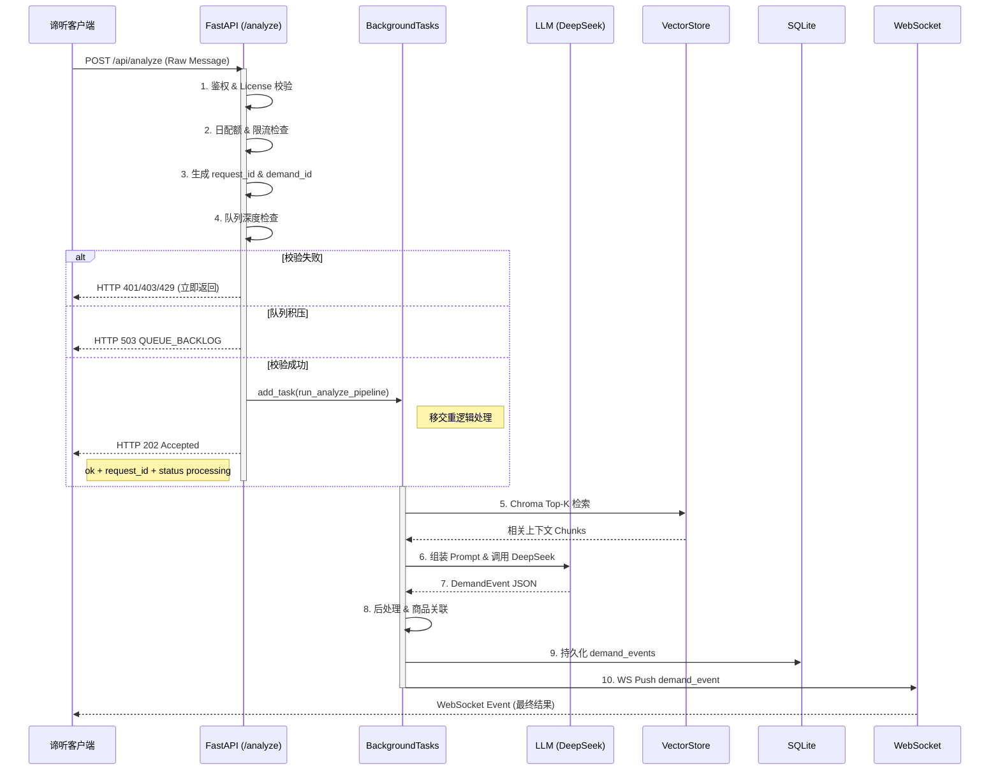

# 技术方案 — 营销智能体（SalesAgent）服务端

> **产品**：营销智能体（SalesAgent）  
> **仓库目录**：`salesagent/`  
> **文档版本**：v0.3.5  
> **最后更新**：2026-06-24  
> **文档状态**：POC Ready — 阻塞项已拍板；v1.0 发布项见 §16.1  
> **关联文档**：[产品设计文档（PRD）](产品设计文档-微信聊天监控分析.md)、[技术方案-谛听客户端](技术方案-谛听客户端.md)、[只读接入Niushop商品与内容库说明](环境准备/只读接入Niushop商品与内容库说明.md)、[**知识库-结构化入库方案**](知识库-结构化入库方案.md)、[仓库目录结构](仓库目录结构.md)

---

## 1. 目标与范围

### 1.1 本文档职责

定义 **SalesAgent 服务端** 的可实施技术方案：API 契约（**权威定义**）、鉴权、analyze/ingest 流水线、向量库、Niushop 同步、调度、部署与 POC 验收。

**不在本文**：谛听客户端 UIA/Electron 实现 → 见 [技术方案-谛听客户端](技术方案-谛听客户端.md)。

### 1.2 阶段范围

| 阶段 | 交付 |
|------|------|
| **POC v0.1** | FastAPI 骨架 + `/api/analyze` + WS `/events` + DeepSeek DemandEvent + beauty Chroma 最小集 + HTTP ingest + 商城 HTTP 联调 |
| **MVP v0.5** | Niushop MySQL 同步 + 完整 Ingestion + 夜间调度 + Qwen-VL 抽样 |
| **v1.0** | 生产部署脚本 + `recommend_ro` + 监控告警 |

### 1.3 部署约束 ✅ 已定（v0.3.3）

| 项 | 值 |
|----|-----|
| **拓扑** | **`dedicated_sales_agent`**（SalesAgent **独立 CVM**；与 Niushop **进程隔离**） |
| 商城 CVM | 仅 Niushop + MySQL；**不再**与 SalesAgent 抢 2GB 内存 |
| SalesAgent CVM 规格 | 2GB RAM / **2Mbps** 带宽 / 50GB 盘（与实验期同档，但**独占**） |
| 对外域名 | **`https://yanpanji.com` 不变**；Nginx 在商城机反代 `/api`、`/events` → 新机（§13.4） |
| Niushop MySQL | 商城 CVM；SalesAgent 经 **`production_dedicated`** 内网只读连接（§10.1） |
| 进程端口 | `8765`（`server.json#api.port`） |
| 重任务 | 夜间 22:00–06:00（`Asia/Shanghai`） |
| **内存预算** | 新机 **独占 2GB**；Chroma 上限 1024MB + Swap 2GB（§8.4）— **优于**同机共署 |
| **带宽** | 2Mbps 够 analyze/WS；大文件 ingest 夜间执行；避免白天批量上传 |
| **Analyze** | HTTP **202** 异步 + WS（§4.2） |
| **调度** | 系统 cron + CLI（§11） |

> 历史拓扑 `colocated_mall` 仍保留在配置中供回滚；**新购独立机后默认 `dedicated_sales_agent`**。

### 1.3.1 三环境矩阵（配置驱动 · 不改业务代码）

| 环境 | SalesAgent 进程 | 客户端 `prefer_env` | API / WS | Niushop MySQL |
|------|-----------------|---------------------|----------|---------------|
| **本地开发** | 本机 `uvicorn :8765` | `dev` | `http://127.0.0.1:8765` / `ws://127.0.0.1:8765/events` | SSH 隧道 `127.0.0.1:13306` → `local_dev` |
| **线上生产** | 新 CVM `:8765` | `prod` | `https://yanpanji.com/api` / `wss://yanpanji.com/events` | 商城 CVM **内网 IP** → `production_dedicated` |
| ~~同机实验~~ | 商城 CVM 本机 | — | 同上 | `127.0.0.1:3306` → `production_colocated`（已弃用） |

**切换原则**：只改 `server.json` / `client.json` / `.env`，**零**业务代码分支（PRD §4.11）。

#### 本地开发（你的 30G 内存工作站）

```bash
# 终端 1：SSH 隧道连商城 MySQL（与现方案一致）
ssh -N -L 127.0.0.1:13306:127.0.0.1:3306 root@<商城CVM公网IP>

# 终端 2：SalesAgent
cd salesagent && export DEEPSEEK_API_KEY=sk-...
export SALESAGENT_DATA_ROOT=C:/work/salesagent/data   # Windows 本地路径
# server.json: deployment.topology=local_dev 或 active_profile=local_dev
uvicorn com.yanpanji.agents.main:app --reload --port 8765

# 终端 3：谛听客户端
# client.json: server.prefer_env=dev  → 自动走 127.0.0.1:8765
npm run dev   # electron + vue
```

本地 **30GB 内存**可放开 Chroma/VLM 调试；上线新机仍遵守 §8.4 1GB 限制。

#### 发布到新 CVM（仅配置 + 数据迁移）

| 步骤 | 操作 |
|------|------|
| 1 | 新机部署 Python venv + `systemd`（§13.2） |
| 2 | `rsync` 本地或旧机 `{data_root}` → 新机 |
| 3 | `salesagent/.env`：`NIUSHOP_MYSQL_HOST=<商城内网IP>`、`DEEPSEEK_API_KEY=...` |
| 4 | `server.json`：`deployment.topology=dedicated_sales_agent` |
| 5 | 商城 MySQL：`GRANT ... TO 'recommend_ro'@'<SalesAgent内网IP>'` |
| 6 | 商城 Nginx：`proxy_pass` `/api/`、`/events` → `<SalesAgent内网或公网IP>:8765` |
| 7 | 客户端：`prefer_env=prod`（`api_base_prod` **可不变**） |

---

## 2. 技术栈

| 层级 | 选型 | 状态 |
|------|------|------|
| Web 框架 | **FastAPI** 0.11x + **Uvicorn** | ✅ 推荐已定 |
| Python | **3.11+** | ✅ 已定 |
| 向量库 | **ChromaDB**（持久化目录） | ✅ 已定 |
| Embedding | **BGE-M3**（`FlagEmbedding` / `sentence-transformers`） | ✅ 已定 |
| VLM | **Qwen2-VL-2B-Instruct-GPTQ-Int4**（CPU Int4，仅夜间 Ingest） | ✅ 已定（§9.3） |
| LLM | **DeepSeek API** `deepseek-v4-flash`（OpenAI-compatible） | ✅ 已定 |
| LLM 备选 | 混元 TokenHub | ✅ 配置已有 |
| 任务调度 | **系统 cron** + `python -m com.yanpanji.agents.cli` 子命令 | ✅ 已定（弃 APScheduler） |
| Niushop | **PyMySQL** / **SQLAlchemy** 只读 | ✅ 已定 |
| 元数据 DB | **SQLite**（`{data_root}/salesagent.db`） | ✅ POC/MVP；PostgreSQL **延至 v1.x** |
| 日配额计数 | **SQLite** `analyze_daily_quota`（**禁止** Redis） | ✅ 已定（§6） |
| 反向代理 | 商城 CVM Nginx 反代至 SalesAgent CVM（域名不变，§13.4） | ✅ 已定 |
| 进程管理 | **systemd** `salesagent.service` | ✅ 推荐 |

---

## 3. 代码目录结构

### 3.0 包命名规范 ✅ 已定

**所有采集 Agent 共用本服务**；服务端 Python 统一包路径 **`com.yanpanji.agents`**（与客户端 `com.yanpanji.pcwx` / `com.yanpanji.wx` 等区分）。

| 角色 | 包路径 | 入口 |
|------|--------|------|
| SalesAgent API | `com.yanpanji.agents` | `uvicorn com.yanpanji.agents.main:app` |
| 夜间任务 CLI | `com.yanpanji.agents.cli` | `python -m com.yanpanji.agents.cli sync_niushop` |

客户端上报 `client_meta.agent_package`（如 `com.yanpanji.pcwx`），服务端用于日志、配额、未来按 Agent 分流策略（POC 仅记录字段）。

```
salesagent/
├── config/
│   └── server.json              # package_id: com.yanpanji.agents
├── src/
│   └── com/yanpanji/agents/   # ← 服务端根包（共用）
│       ├── main.py              # FastAPI app
│       ├── cli.py               # cron：ingest / sync_niushop
│       ├── api/
│       │   ├── routes/          # analyze, ingest, license, health…
│       │   ├── deps.py
│       │   └── ws.py
│       ├── analyze/
│       ├── vector/
│       ├── ingest/
│       ├── niushop/
│       └── core/
├── scripts/
├── requirements.txt
└── README.md
```

### 3.1 模块职责（`com.yanpanji.agents.*`）

| 子包 | 职责 |
|------|------|
| `api/` | 路由、鉴权、WS `/events` |
| `analyze/` | DeepSeek DemandEvent 流水线 |
| `vector/` | BGE-M3 + ChromaDB |
| `ingest/` | 资料 ingest、Qwen-VL |
| `niushop/` | MySQL / HTTP 同步 |
| `core/` | 配置、护栏、日志 |

---

## 4. API 契约

> **权威定义**：客户端以本文为准；变更需同步更新 `技术方案-谛听客户端.md §11`。

**Base URL**：`{api_base}{path_prefix}` → 生产 `https://yanpanji.com/api`

### 4.1 公共约定

#### 请求头

| Header | 必填 | 说明 |
|--------|------|------|
| `X-Client-Id` | ✅ | 设备 ID，`server.json#multi_client.client_id_header` |
| `X-License-Key` | ✅ | License 字符串（**非** OAuth Bearer，与客户端 §11.2 一致） |
| `X-Request-Id` | 否 | UUID，日志追踪 |

#### 统一响应信封

```json
{
  "ok": true,
  "request_id": "uuid",
  "data": { },
  "error": null
}
```

错误时：

```json
{
  "ok": false,
  "request_id": "uuid",
  "data": null,
  "error": {
    "code": "QUOTA_EXCEEDED",
    "message": "今日有效 analyze 已达上限 500",
    "details": { }
  }
}
```

#### 错误码

| code | HTTP | 说明 |
|------|------|------|
| `UNAUTHORIZED` | 401 | License 无效/过期 |
| `FORBIDDEN_CATEGORY` | 403 | 套餐未含该类目 |
| `QUOTA_EXCEEDED` | 429 | 日 analyze 超限 |
| `RATE_LIMITED` | 429 | 分钟限流 |
| `VALIDATION_ERROR` | 422 | 体校验失败 |
| `FILE_TOO_LARGE` | 413 | 上传超限 |
| `FILE_TYPE_REJECTED` | 415 | 扩展名/MIME 不允许 |
| `INTERNAL_ERROR` | 500 | 未预期错误 |
| `QUEUE_BACKLOG` | 503 | BackgroundTasks 队列深度超限（§4.2.3） |
| `ANALYZE_FAILED` | — | 后台 LLM 失败（经 WS `error` 推送，非 HTTP） |

---

### 4.2 `POST /api/analyze`

**用途**：接收谛听客户端合并后的消息，**异步**执行向量检索 + LLM；HTTP 快速返回，**DemandEvent 经 WebSocket 回调**。

> **变更说明（v0.3.1）**：为解决 LLM 高延迟导致的 HTTP 阻塞，Analyze 调整为异步架构。API 层仅负责鉴权与任务分发，实际计算在后台执行，结果通过 WebSocket 推送。

#### 请求体

```json
{
  "raw_message": {
    "msg_id": "hash_xxx",
    "session_id": "session_xxx",
    "session_name": "宝妈交流群",
    "session_type": "group",
    "sender_display_name": "李小姐",
    "sender_remark_name": null,
    "contact_key": "contact_hash_xxx",
    "group_key": "group_hash_xxx",
    "content": "最近天热了，有没有推荐的防晒霜？敏感肌能用吗",
    "content_type": "text",
    "source": "uia",
    "captured_at": "2026-06-16T14:30:00+08:00",
    "batch_meta": {
      "merged_count": 3,
      "truncated": false
    }
  },
  "runtime_context": {
    "session_id": "session_xxx",
    "enabled_categories": ["beauty"],
    "customer_profile": {
      "name": "李小姐",
      "tags": ["敏感肌"],
      "stage": "objection",
      "history_demands": ["防晒咨询"]
    },
    "working_memory": [
      {
        "role": "user",
        "content": "最近天热了，有没有推荐的防晒霜？敏感肌能用吗",
        "sender": "李小姐"
      }
    ]
  },
  "matched_category": "beauty",
  "client_meta": {
    "agent_package": "com.yanpanji.pcwx",
    "app_version": "0.1.0",
    "wechat_version": "3.9.x.x",
    "listen_mode": "full_collection"
  }
}
```

#### 4.2.1 处理流水线（异步）与时序图

**API 层（同步，须 < 200ms）**：

1. 鉴权 & License 校验  
2. 日配额 & 限流检查（SQLite `analyze_daily_quota`）  
3. 校验 `matched_category` ∈ License 允许类目  
4. 生成 `request_id` & 预分配 `demand_id`  
5. 检查 BackgroundTasks 队列深度（§4.2.3）  
6. `add_task(run_analyze_pipeline)` → **HTTP 202**

**后台层（`run_analyze_pipeline`）**：

7. Chroma Top-K 检索  
8. 组装 Prompt & 调用 DeepSeek  
9. 后处理 & 商品关联  
10. 持久化 `demand_events`（SQLite，按 `license_id` 共享 — §5.2）  
11. WS Push `demand_event` → 触发方 `client_id`



#### 4.2.2 请求与响应变更

**HTTP Response（202 Accepted）**

客户端 **不应** 在 HTTP 体中等待完整 DemandEvent；结果经 WS 接收（客户端 **§11.5**）。

```json
{
  "ok": true,
  "request_id": "req_0192837465",
  "data": {
    "status": "processing",
    "request_id": "req_0192837465",
    "message": "Analyze task received and processing in background."
  },
  "error": null
}
```

配额 / 鉴权 / 类目失败仍 **同步** 返回 401 / 403 / 429（不进后台）。

**WebSocket Callback（Final Result）**

```json
{
  "type": "demand_event",
  "request_id": "req_0192837465",
  "ts": "2026-06-16T14:30:05+08:00",
  "payload": {
    "demand_id": "d_20260616_001",
    "category": "beauty",
    "demand_type": "产品咨询",
    "summary": "...",
    "original_message": "...",
    "confidence": 0.87,
    "llm_meta": { "provider": "deepseek", "model": "deepseek-v4-flash", "latency_ms": 1200 }
  }
}
```

`payload` 字段与下方 DemandEvent 完整结构一致。

#### 4.2.3 异常处理策略

| 场景 | 行为 |
|------|------|
| **LLM 超时 / 失败** | 后台 `try/except` → 写 `analyze_errors` 表 + 日志 → WS 推送 `{ "type": "error", "code": "ANALYZE_FAILED", "request_id": "...", "message": "..." }`；**不**影响 HTTP 202 已返回的连接 |
| **队列积压** | 若 `BackgroundTasks` 待处理数 ≥ `cost_guardrails.max_analyze_queue_depth`（默认 100），**拒绝入队**，HTTP **503**，错误码 `QUEUE_BACKLOG` |
| **503 响应体** | 必须含可读原因，便于客户端顶栏告警 |

```json
{
  "ok": false,
  "request_id": "req_xxx",
  "data": null,
  "error": {
    "code": "QUEUE_BACKLOG",
    "message": "后台任务积压，队列深度超过 100，请稍后重试",
    "details": {
      "queue_depth": 100,
      "max_queue_depth": 100
    }
  }
}
```

**实现要点**：

```python
@app.post("/api/analyze", status_code=202)
async def analyze(request: AnalyzeRequest, background_tasks: BackgroundTasks):
    license_ctx = check_auth_and_quota(request)
    check_category(request.matched_category, license_ctx)
    depth = get_background_queue_depth()
    if depth >= config.cost_guardrails.max_analyze_queue_depth:
        raise HTTPException(503, detail={
            "code": "QUEUE_BACKLOG",
            "message": f"后台任务积压，队列深度超过 {depth}",
            "details": {"queue_depth": depth, "max_queue_depth": 100},
        })
    req_id = request.headers.get("X-Request-Id") or str(uuid4())
    demand_id = allocate_demand_id()
    background_tasks.add_task(run_analyze_pipeline, request, license_ctx, req_id, demand_id)
    return {"ok": True, "request_id": req_id, "data": {
        "status": "processing", "request_id": req_id,
        "message": "Analyze task received and processing in background.",
    }}
```

| 原则 | 说明 |
|------|------|
| HTTP | 鉴权/配额/队列 **同步**；重逻辑 **BackgroundTasks**（POC）；MVP 可换 Celery |
| 结果交付 | **仅 WS** `demand_event` |
| Worker | 单 Worker POC 可接受；生产建议 `--workers 2` |

#### DemandEvent 结构（WS `payload` / SQLite 持久化）

与 PRD §5.4 对齐；**不再**作为 analyze HTTP 200 同步体返回。

```json
{
  "demand_id": "d_20260616_001",
  "category": "beauty",
  "sub_category": "防晒",
  "demand_type": "产品咨询",
  "summary": "敏感肌用户寻求天热防晒产品推荐",
  "keywords": ["防晒", "敏感肌", "天热"],
  "urgency": "中",
  "matched_products": [
    {
      "goods_id": 41,
      "goods_name": "重组胶原蛋白紧致淡纹精华水",
      "price": "128.00",
      "mini_path": "/pages_sub/goods/detail?goods_id=41",
      "social_proof": "打卡第五天，皮肤越来越亮…"
    }
  ],
  "knowledge_refs": ["敏感肌选防晒指南"],
  "contact_key": "contact_hash_xxx",
  "sender_display_name": "李小姐",
  "sender_remark_name": null,
  "session_id": "session_xxx",
  "session_name": "宝妈交流群",
  "session_type": "group",
  "group_key": "group_hash_xxx",
  "original_message": "最近天热了，有没有推荐的防晒霜？敏感肌能用吗",
  "confidence": 0.87,
  "created_at": "2026-06-16T14:30:05+08:00",
  "agent_source": "monitor",
  "reply_agent_ready": true,
  "llm_meta": {
    "provider": "deepseek",
    "model": "deepseek-v4-flash",
    "latency_ms": 1200
  }
}
```

#### LLM 输出约束

- 强制 **JSON mode** 或 function calling 返回上述字段  
- `urgency` 枚举：`低` | `中` | `高`  
- `demand_type` 枚举 ✅ 已定：`产品咨询` | `价格异议` | `售后投诉` | `无意图`  
- 解析失败 → 规则降级，`confidence <= 0.3`，`llm_meta.degraded: true`

---

### 4.3 `POST /api/ingest/upload`

**用途**：接收用户资料（v1 方式 A：HTTP 上传至 staging）。

**Content-Type**：`multipart/form-data`

| 字段 | 类型 | 说明 |
|------|------|------|
| `category` | string | 如 `beauty`、`ai_agent` |
| `files[]` | file | 多文件，扩展名见 `upload_policy` |
| `source` | string | `user_upload` \| `active_learning` \| `experience` |
| `sub_category` | string | 可选；如 `video`、`llm_integration`（写入 Chroma metadata） |

**限制**（`server.json#upload_policy`）：

- 单文件 ≤ 20MB；图片 ≤ 10MB  
- 每批 ≤ 20 文件  
- 每客户端日上传 ≤ 500MB  

**响应**：

```json
{
  "ok": true,
  "data": {
    "batch_id": "ingest_20260616_abc",
    "accepted": [
      {"filename": "价格表.xlsx", "staging_path": "_staging/beauty/...", "size_bytes": 102400}
    ],
    "rejected": [],
    "queued_for": "night_window",
    "estimated_start": "2026-06-16T22:00:00+08:00"
  }
}
```

**流水线**（可延迟到夜间）：

```
staging 落盘 → 解析（word/excel/pdf/**learning_artifact**）→ 图片 Qwen-VL → 切块 → BGE-M3 → Chroma upsert
→ 更新 knowledge_chunks 索引 → WS ingest_progress → 清理 staging（48h）
```

**主动学习稿件**（`source=active_learning`）：

- 解析 `final_document` / Markdown；**不**调用 DeepSeek analyze。  
- Chroma metadata 建议：`source`, `sub_category`, `entry_url`, `source_group`, `entry_id`。  
- Collection：`{data_root}/ai_agent/chroma/`，与 beauty 隔离。

**与 analyze 边界**：ingest 流水线 **永不** 触发 `POST /api/analyze`。`ai_agent` 向量（无论 `user_upload` 或 `active_learning`）**默认不**注入 beauty 需求 analyze 的 `retrieved_knowledge`（MVP 不做跨类目召回）。

---

### 4.4 `GET /api/ingest/status`

**Query**：`category=beauty`（可选）

```json
{
  "ok": true,
  "data": {
    "category": "beauty",
    "chroma": {
      "collection": "beauty",
      "chunk_count": 1284,
      "last_ingest_at": "2026-06-16T03:12:00+08:00"
    },
    "staging": {
      "pending_files": 2,
      "pending_bytes": 4500000
    },
    "niushop_sync": {
      "last_sync_at": "2026-06-16T02:00:00+08:00",
      "goods_count": 156,
      "article_count": 42,
      "evaluate_count": 890,
      "status": "ok",
      "last_error": null
    },
    "vector_preview": [
      {
        "chunk_id": "chk_001",
        "source": "niushop_product",
        "goods_id": 25,
        "preview": "商品【断黑王钻石光感4件套】，专项价 1180 元…",
        "ingested_at": "2026-06-16T02:05:00+08:00"
      }
    ]
  }
}
```

`vector_preview` 条数默认 **10**，POC **不分页**；MVP 可加 `?offset=`（非阻塞）。

---

### 4.5 `POST /api/knowledge/search`

**用途**：调试 / 知识库页按需检索。

```json
// 请求
{
  "category": "beauty",
  "query": "敏感肌防晒",
  "top_k": 5
}

// 响应 data.hits[]
{
  "chunk_id": "chk_001",
  "content": "...",
  "source": "article",
  "score": 0.92,
  "metadata": { "goods_id": 25 }
}
```

---

### 4.6 `GET /api/config/subscription`

返回 `shared/config/subscription.json` 内容 + 服务端计算的 **当前 License 生效套餐**（若带鉴权）。

```json
{
  "ok": true,
  "data": {
    "plans": [ ],
    "trial": { },
    "current": {
      "plan_id": "trial",
      "expires_at": "2026-06-30T00:00:00+08:00",
      "allowed_categories": ["beauty"],
      "max_concurrent_clients": 2,
      "daily_analyze_limit": 500
    }
  }
}
```

---

### 4.7 `POST /api/license/activate` ✅ 已定

**状态**：**独立路由**（不与 `GET /api/config/subscription` 合并）。

**URL**：`POST /api/license/activate`

```json
// 请求
{ "license_key": "DITING-XXXX-XXXX", "client_id": "pc-a1b2c3d4e5f6" }

// 响应
{
  "ok": true,
  "data": {
    "status": "active",
    "plan_id": "trial",
    "expires_at": "2026-06-30T00:00:00+08:00",
    "allowed_categories": ["beauty"],
    "max_concurrent_clients": 2
  }
}
```

---

### 4.8 `GET /api/health`

```json
{ "ok": true, "data": { "status": "up", "version": "0.1.0", "topology": "dedicated_sales_agent" } }
```

---

### 4.9 WebSocket `/events` ✅ 已定（T9 / S3）

**URL**：`wss://yanpanji.com/events?client_id={client_id}`  
**鉴权**：连接成功后 **首帧必须为 auth**；**禁止**客户端先发空 ping。校验通过前服务端 **不 push** 任何业务事件。

#### 鉴权时序

```
Client                          Server
  |--- WebSocket connect -------->|
  |--- { type: auth, key, client_id } -->|
  |<-- { type: auth_ok } ---------|  （或 error + close）
  |--- { type: ping } ----------->|  （仅 auth_ok 之后）
  |<-- { type: pong } ------------|
  |<-- { type: demand_event } ----|  （仅已鉴权连接）
```

#### 客户端 → 服务端

```json
{ "type": "auth", "key": "<license_key>", "client_id": "pc-..." }
{ "type": "ping" }
```

| auth 字段 | 说明 |
|-----------|------|
| `key` | License Key；POC dev 可用 `hardcoded_test_key` |
| `client_id` | 与 Query `client_id` 一致 |

**服务端行为**：

- 收到非 auth 首帧 → `{ "type": "error", "code": "AUTH_REQUIRED" }` → 关闭  
- `key` 无效 / 过期 → `AUTH_FAILED` → 关闭  
- 并发超限 → `CONCURRENT_LIMIT` → 关闭（策略见下）

#### 服务端 → 客户端

```json
{
  "type": "demand_event",
  "ts": "2026-06-16T14:30:05+08:00",
  "payload": { }
}
```

| type | 说明 |
|------|------|
| `auth_ok` | 鉴权成功，可开始 ping / 接收 push |
| `demand_event` | 完整 DemandEvent |
| `ingest_progress` | `{batch_id, progress_pct, stage}` |
| `sync_complete` | Niushop 同步完成 |
| `quota_warning` | `{used, limit, pct}` |
| `pong` | 心跳 |
| `error` | `{code, message}` |

**连接管理**：

- 每 `client_id` 独立连接；试用 max 2 — **超限拒绝新连接**（POC）；不踢旧连接  
- 心跳 30s；90s 无 ping 断开  
- **同一 License 多连接**：WS **按触发 analyze 的 `client_id` 定向推送** demand_event（S3）  
- **Demand 数据**：**同一 License 下所有 client 共享** 服务端 `demand_events`（S9 — §5.2）

---

## 5. 鉴权与多客户端

### 5.1 License 校验

| 步骤 | 说明 |
|------|------|
| 1 | 读取 Header **`X-License-Key`**（兼容纳 `Authorization: Bearer` 仅开发联调，生产以 `X-License-Key` 为准） |
| 2 | 查 `license_keys` 表；**POC** 可用 `{data_root}/config/license_keys.json` 静态文件 |
| 3 | 校验过期、类目、并发客户端数 |
| 4 | 绑定 `client_id`；换机解绑策略 **延至 MVP**（POC 允许多 `client_id` 直至并发上限） |

**POC 存储** ✅ 已定（S1）：`{data_root}/config/license_keys.json`，**不**在 POC 阶段写 SQLite `license_keys` 表。

```json
{
  "keys": [
    {
      "key": "hardcoded_test_key",
      "plan_id": "trial",
      "allowed_categories": ["beauty"],
      "expires_at": "2027-01-01T00:00:00+08:00",
      "max_clients": 2
    }
  ]
}
```

生产 v1.0 迁移至 SQLite `license_keys` 表。

### 5.2 并发客户端与 Demand 共享 ✅ 已定（S9）

| 维度 | 策略 |
|------|------|
| **Demand 存储** | **服务端 SQLite** `demand_events`，主键 `demand_id` |
| **共享范围** | **同一 License** 下所有 `client_id` **共享同一份** demand 视图（老板 PC-A + 客服 PC-B 见同一历史） |
| **WS 推送** | **仅**向 **发起本次 analyze 的 `client_id`** 推送 `demand_event`（实时通知不广播） |
| **跨 PC 拉历史** | MVP：`GET /api/demands`（按 `license_id` 列表）；POC **不做**该 API，雷达读本地 `demand_events_cache`（§16.1 #4） |
| **并发连接** | `max_concurrent_clients_trial: 2`；超限 **拒绝新 WS**（POC） |

`server.json#multi_client`：

- `max_concurrent_clients_trial: 2`  
- 同一 License 下维护 `active_clients: {client_id: last_seen}`  
- WS + analyze 均计入  

---

## 6. 成本护栏 ✅ 已定

实现 `core/guardrails.py`，配置 `server.json#cost_guardrails`。

| 护栏 | 实现 |
|------|------|
| 每客户端日 analyze ≤ 500 | **SQLite** `analyze_daily_quota` 原子递增（`BEGIN IMMEDIATE`）；**禁止 Redis** |
| 10 req/min/client | 内存滑动窗口（POC） |
| 队列深度 ≤ 100 | BackgroundTasks 计数；超出 **503 QUEUE_BACKLOG**（§4.2.3） |
| VLM 日 50 张 | SQLite / 日志计数（夜间任务） |
| LLM 失败 | 混元备选 → 规则降级 |

**500 次/日低频下 SQLite WAL 并发锁完全够用**，不引入 Redis。

计数键：`analyze_daily_quota(license_id, client_id, stat_date)` — 与客户端 `attemptQuotaConsume` 双侧护栏对齐。

---

## 7. Analyze 引擎细节

### 7.1 Prompt 结构（纲要）

```
[System]
你是私域需求分析助手。根据微信消息和知识库片段，输出 JSON DemandEvent。
类目：{category}。只输出 JSON。

[Context]
客户画像：{customer_profile}
工作记忆：{working_memory}

[Retrieved]
{top_k_chunks}

[Message]
{content}

[Output Schema]
demand_type 枚举：产品咨询 | 价格异议 | 售后投诉 | 无意图
{demand_event_json_schema}
```

完整 prompt 模板：**POC 迭代**（非阻塞；§7.1 纲要足够开工）。

### 7.2 DeepSeek 调用

```python
client.chat.completions.create(
    model="deepseek-v4-flash",
    messages=[...],
    response_format={"type": "json_object"},  # 若支持
    temperature=0.3,
)
```

- API Key：`DEEPSEEK_API_KEY` 环境变量  
- 超时：30s；重试 2 次  

### 7.3 商品关联

1. LLM 输出 `keywords` / `sub_category`  
2. Chroma 检索 Niushop 商品 chunk（`metadata.source=niushop_product`）  
3. 取 top goods_id → 补全 `matched_products`（价格、mini_path 来自同步快照）  

---

## 8. 向量库（Chroma）

> **结构化入库（分段、段落—媒体关系、跨文档知识网、Skills 消费）** 的完整设计见 [**知识库-结构化入库方案**](知识库-结构化入库方案.md)。本章保留运行时与内存约束；metadata 与 **M1.6 图模型** 以该文档 §4.2–§4.4 为准。

### 8.1 存储路径

`{data_root}/{category}/chroma/`，如 `/www/wwwroot/salesagent/data/beauty/chroma/`

### 8.2 Collection 设计

| Collection | 内容 |
|------------|------|
| `beauty` | 用户资料 + Niushop 商品/文章/评价切片 |

**Document metadata 标准**：

```json
{
  "source": "niushop_product | niushop_article | niushop_evaluate | user_word | user_excel | user_pdf | user_image",
  "category": "beauty",
  "goods_id": 25,
  "file_hash": "sha256...",
  "niushop_update_time": "2026-06-16T01:55:00+08:00",
  "ingested_at": "2026-06-16T02:00:00+08:00"
}
```

`niushop_update_time`：源库行 `update_time` / 等价字段，用于增量 Upsert（§10.2）。

### 8.3 Embedding

- 模型：BGE-M3  
- `chunk_size: 500`，`overlap: 50`  
- 批量 encode **`batch_size: 8`**（2GB 内存默认；可调至 16 需实测）

### 8.4 ChromaDB 内存保护策略 ✅ 已定（Blocking Fix）

**背景**：2GB CVM 同时跑 Niushop（PHP-FPM/MySQL）+ SalesAgent；Chroma Collection 初始化 / Upsert 峰值可达 **1.2–1.5GB**，易触发 **OOM Killer**。Chroma 配置必须严格限制内存占用，防止进程被系统杀死。

配置项：`server.json#chroma`（`memory_limit_mb: 1024`，`upsert_batch_size: 50`）。

#### 8.4.1 Chroma 运行时配置

通过 `Settings` 对象强制限制 Chroma 内部缓存：

```python
# com/yanpanji/agents/vector/chroma_store.py
import os
import chromadb
from chromadb.config import Settings

def get_chroma_client(category: str, data_root: str):
    """初始化 Chroma 客户端，强制开启内存保护。"""
    persist_dir = os.path.join(data_root, category, "chroma")

    settings = Settings(
        chroma_memory_limit_bytes=1024 * 1024 * 1024,  # 1GB Hard Limit
        anonymized_telemetry=False,
        allow_reset=os.getenv("ENV") == "development",
    )

    return chromadb.PersistentClient(path=persist_dir, settings=settings)
```

| 项 | 说明 |
|----|------|
| 白天 Analyze | 仅轻量 Chroma **query**（非 bulk upsert） |
| 夜间 Ingest / Niushop sync | bulk upsert，遵守 §8.4.2 分片 |
| 监控（POC） | 夜间任务前后 `free -m` 写日志；OOM 后 systemd `Restart=on-failure` |

#### 8.4.2 Ingestion（Upsert）限流

批量写入必须分片，**禁止全量一次性 upsert**：

```python
# com/yanpanji/agents/ingest/pipeline.py
import gc

def upsert_chunks_to_chroma(collection, chunks: list, batch_size: int = 50):
    """
    分片插入向量数据。batch_size=50 针对 2GB 内存机器的保守值。
    配置：server.json#chroma.upsert_batch_size
    """
    total = len(chunks)
    for i in range(0, total, batch_size):
        batch = chunks[i : i + batch_size]
        ids = [c["chunk_id"] for c in batch]
        embeddings = [c["embedding"] for c in batch]
        metadatas = [c["metadata"] for c in batch]
        documents = [c["content"] for c in batch]
        collection.upsert(
            ids=ids,
            embeddings=embeddings,
            metadatas=metadatas,
            documents=documents,
        )
        del ids, embeddings, metadatas, documents, batch
        gc.collect()
```

Niushop 同步 Upsert 复用同一函数与 `batch_size`。

#### 8.4.3 系统级 Swap 配置（强制建议）

2GB 物理内存无法满足 DeepSeek 请求高峰 + Chroma 索引 + Qwen-VL 峰值叠加，**必须在宿主机启用 Swap** 作为保底。

```bash
# CVM 上执行（需 sudo）
sudo fallocate -l 2G /swapfile
sudo chmod 600 /swapfile
sudo mkswap /swapfile
sudo swapon /swapfile

# 永久生效
echo '/swapfile none swap sw 0 0' | sudo tee -a /etc/fstab

# Swappiness 10–20：尽量用物理内存，Swap 仅兜底
sudo sysctl vm.swappiness=10
```

与 §1.3 `deployment.experiment_spec.recommend_swap_gb: 2` 一致。

---

## 9. Ingestion Pipeline

> 用户上传、主动学习、**详情 HTML 分段与媒体解析** 的统一文档模型见 [**知识库-结构化入库方案**](知识库-结构化入库方案.md) §4–§6。本章为解析器与 Qwen-VL 运行时配置。

### 9.1 解析器

| 类型 | 库 | 策略 |
|------|-----|------|
| Word | `python-docx` | 按标题层级切片 |
| Excel | `openpyxl` | 行转自然语言 |
| PDF | `pypdf` / `pdfplumber` | 按页/段 |
| 图片 | Qwen-VL + OCR | 夜间执行 |
| 文本 | 直接 | md/txt |

### 9.2 增量

`ingestion.incremental_by_hash: true` — 文件 `sha256` 未变则跳过。

### 9.3 Qwen-VL 配置（Int4 量化）✅ 已定（S4）

宿主机 **2GB 内存**，VLM 必须使用 **Int4 GPTQ 量化**，将 RSS 控制在 **≤1.8GB 峰值**。

#### 9.3.1 模型路径（`server.json`）

```json
{
  "models": {
    "qwen_vl": {
      "path": "/www/wwwroot/salesagent/models/Qwen2-VL-2B-Instruct-GPTQ-Int4",
      "device": "cpu",
      "dtype": "float16"
    }
  },
  "deployment": {
    "vlm_daytime_allowed": false
  }
}
```

与现有 `vlm` 块等价；编码时以 `models.qwen_vl.path` 或 `vlm.model_path` 二选一统一（推荐 `models.qwen_vl`）。

| 项 | 值 |
|----|-----|
| 模型 | **Qwen2-VL-2B-Instruct-GPTQ-Int4** |
| FP16 / Int8 全精度 | **禁止**（必 OOM） |
| 用途 | **仅夜间 Ingestion**（用户上传图 / 商品图描述） |
| 实时 analyze / 白天 | **禁止**（`vlm_daytime_allowed: false` 硬校验） |
| 微信聊天 OCR | 谛听客户端 PaddleOCR（§6.8），**不经**服务端 VLM |

#### 9.3.2 加载代码示例

```python
# com/yanpanji/agents/ingest/vlm.py
import torch
from transformers import AutoProcessor, Qwen2VLForConditionalGeneration

class VLMPipeline:
    def __init__(self, config: dict):
        path = config["path"]
        self.model = Qwen2VLForConditionalGeneration.from_pretrained(
            path,
            torch_dtype=torch.float16,
            device_map="cpu",
        )
        self.processor = AutoProcessor.from_pretrained(path)

    def infer(self, image_path: str) -> str:
        # 图像 → processor → generate → 解码文本
        ...
```

CLI `ingest` 入口须在 `heavy_tasks_window`（22:00–06:00）内调用；窗口外直接拒绝并写日志。

#### 9.3.3 资源占用预估

| 阶段 | RSS |
|------|-----|
| 模型加载 | ~**1.4GB** |
| 推理峰值 | ~**1.8GB** |

**结论**：严禁白天运行；仅允许在 `heavy_tasks_window` 执行，且需确保此时无高并发 Analyze 积压（配合 §4.2.3 队列护栏与 §8.4 Swap）。

---

## 10. Niushop 同步

> 表结构、GRANT 脚本见 [只读接入Niushop商品与内容库说明](环境准备/只读接入Niushop商品与内容库说明.md)。  
> **商品/文章详情分段、图片 URL 与上下文、媒体 VLM 描述** 见 [**知识库-结构化入库方案**](知识库-结构化入库方案.md) §五–§六（M1.5 文本分段 → M2 图像描述）。

### 10.1 连接

| Profile | 场景 |
|---------|------|
| `local_dev` | SSH 隧道 `127.0.0.1:13306` |
| `production_colocated` | `127.0.0.1:3306` |
| `production_dedicated` | 内网 IP via `NIUSHOP_MYSQL_HOST` |

环境变量：`NIUSHOP_DB_USER`、`NIUSHOP_DB_PASSWORD`  
账号：`recommend_ro` — **编码前创建**（`account_status: pending`）

### 10.2 同步任务与事务屏障 ✅ 已定

Cron：`0 2 * * *` → `python -m com.yanpanji.agents.cli sync_niushop`（§11）

#### 顺序（事务屏障）

**必须**严格：**Snapshot → Chroma Upsert → niushop_sync_log**。禁止「Chroma 成功但 Log 失败」导致下次全量重复 Upsert。

```
1. 从 MySQL 拉取 goods / articles / evaluates（weapp_id=11, site_id=1）
2. 映射 category（goods_category_mapping）
3. 自然语言模板化 → 写 snapshots/ JSON（可回滚检查点）；**M1.5+** 快照含 `sections` / `media_assets`（见 [知识库-结构化入库方案](知识库-结构化入库方案.md) §4.1）
4. 增量判定：metadata.niushop_update_time vs 源库 update_time
   → 仅当 源库时间 > 向量库时间 才 Upsert（幂等）
5. Chroma upsert（batch_size=50，§8.4）
6. 全部批次成功 → INSERT niushop_sync_log status=ok
7. 任一步失败 → log status=failed，**不**更新已成功 chunk 的 niushop_update_time 为假值
8. WS sync_complete（仅 status=ok）
```

#### 增量原子性

| 字段 | 作用 |
|------|------|
| `metadata.niushop_update_time` | 源库该行最后变更时间 |
| `metadata.goods_id` + `source` | Upsert id 键；同 goods 重复同步 **update** 而非 duplicate |
| `file_hash`（用户资料） | 用户上传增量（§9.2） |

若 Chroma Upsert 中途失败：**已写入批次保留**；下次 cron 比对 `update_time` 跳过未变更行，仅补写失败批次。

### 10.3 HTTP 降级（POC）

`niushop.http` 用于联调：

- `GET /api/goodssku/detail?goods_id=25`  
- `POST /api/goodsevaluate/page`  

生产以 MySQL 为主。

---

## 11. 调度与夜间任务 ✅ 已定（S6）

**弃用 APScheduler** — 2GB 机器少一个常驻调度进程即省内存。

### 11.1 CLI 统一入口

```bash
# com/yanpanji/agents/cli.py
python -m com.yanpanji.agents.cli sync_niushop
python -m com.yanpanji.agents.cli ingest
python -m com.yanpanji.agents.cli health
```

进程 **执行完即退出**，内存归还 Niushop 白天使用。

### 11.2 crontab 样例（`scripts/crontab.example`）

```cron
# Asia/Shanghai
0 2 * * *  www  cd /www/wwwroot/salesagent && /www/wwwroot/salesagent/venv/bin/python -m com.yanpanji.agents.cli sync_niushop
0 22 * * * www  cd /www/wwwroot/salesagent && /www/wwwroot/salesagent/venv/bin/python -m com.yanpanji.agents.cli ingest
```

### 11.3 白天 vs 夜间

| 时段 | 允许 |
|------|------|
| 白天 | `/api/analyze`（202 异步）、Chroma **query**、upload 入 `_staging` |
| 夜间 22:00–06:00 | `ingest` CLI、Qwen-VL、Chroma **bulk upsert**、Niushop sync 02:00 |

`health_metrics` 定时采集 **延至 MVP**（POC 靠 `GET /api/health` + 日志）。

---

## 12. 持久化

### 12.1 SQLite `{data_root}/salesagent.db`（推荐 POC）

```sql
CREATE TABLE demand_events (
  demand_id TEXT PRIMARY KEY,
  license_id TEXT NOT NULL,
  client_id TEXT NOT NULL,
  category TEXT,
  payload_json TEXT NOT NULL,
  created_at TEXT NOT NULL
);
CREATE INDEX idx_demand_license_created ON demand_events(license_id, created_at DESC);

CREATE TABLE license_keys (
  license_key_hash TEXT PRIMARY KEY,
  plan_id TEXT,
  allowed_categories_json TEXT,
  expires_at TEXT,
  max_clients INTEGER DEFAULT 2,
  status TEXT
);

CREATE TABLE analyze_daily_quota (
  license_id TEXT,
  client_id TEXT,
  stat_date TEXT,
  count INTEGER DEFAULT 0,
  PRIMARY KEY (license_id, client_id, stat_date)
);

CREATE TABLE analyze_errors (
  id INTEGER PRIMARY KEY AUTOINCREMENT,
  request_id TEXT NOT NULL,
  demand_id TEXT,
  license_id TEXT,
  client_id TEXT,
  error_code TEXT,
  error_message TEXT,
  raw_message_json TEXT,
  created_at TEXT NOT NULL
);
CREATE INDEX idx_analyze_errors_request ON analyze_errors(request_id);

CREATE TABLE niushop_sync_log (
  id INTEGER PRIMARY KEY AUTOINCREMENT,
  started_at TEXT,
  finished_at TEXT,
  goods_count INTEGER,
  article_count INTEGER,
  evaluate_count INTEGER,
  status TEXT,
  error TEXT
);

CREATE TABLE knowledge_chunks (
  chunk_id TEXT PRIMARY KEY,
  category TEXT,
  source TEXT,
  goods_id INTEGER,
  file_hash TEXT,
  preview TEXT,
  ingested_at TEXT
);

CREATE TABLE ingest_jobs (
  batch_id TEXT PRIMARY KEY,
  client_id TEXT,
  category TEXT,
  status TEXT,
  created_at TEXT,
  finished_at TEXT
);
```

### 12.2 文件系统

| 路径 | 用途 |
|------|------|
| `{data_root}/{cat}/chroma/` | Chroma |
| `{data_root}/{cat}/snapshots/` | Niushop JSON 快照 |
| `{data_root}/_staging/` | 上传暂存 |

---

## 13. 部署

### 13.1 Nginx 反代 — 同机共署（`colocated_mall` · 历史）

SalesAgent 与 Nginx **同一台**机器时使用（`proxy_pass 127.0.0.1:8765`）。

### 13.4 Nginx 反代 — 独立 CVM + 域名不变 ✅ 推荐

**架构**：`yanpanji.com` DNS 仍指向 **商城 CVM**；商城 Nginx 将 SalesAgent 路径 **转发至新 CVM**。

```
用户 / 谛听客户端
  → https://yanpanji.com/api/*     ──Nginx(商城CVM)──→ http://<SalesAgent内网IP>:8765/api/*
  → wss://yanpanji.com/events      ──Nginx(商城CVM)──→ http://<SalesAgent内网IP>:8765/events
商城业务 /api/goodssku/* 等        ──仍由商城 PHP 处理（注意 location 优先级，§16.3）
```

```nginx
# 商城 CVM — /etc/nginx/conf.d/salesagent-upstream.conf
upstream salesagent_backend {
    server 10.x.x.x:8765;   # SalesAgent CVM 内网 IP（同 VPC）
    keepalive 8;
}

location /api/analyze {
    proxy_pass http://salesagent_backend/api/analyze;
    proxy_http_version 1.1;
    proxy_set_header Host $host;
    proxy_set_header X-Real-IP $remote_addr;
    proxy_read_timeout 120s;
}

location /api/ingest/ {
    proxy_pass http://salesagent_backend/api/ingest/;
    client_max_body_size 25m;
}

location /api/config/ {
    proxy_pass http://salesagent_backend/api/config/;
}

location /api/license/ {
    proxy_pass http://salesagent_backend/api/license/;
}

location /api/knowledge/ {
    proxy_pass http://salesagent_backend/api/knowledge/;
}

location /api/health {
    proxy_pass http://salesagent_backend/api/health;
}

location /events {
    proxy_pass http://salesagent_backend/events;
    proxy_http_version 1.1;
    proxy_set_header Upgrade $http_upgrade;
    proxy_set_header Connection "upgrade";
    proxy_read_timeout 3600s;
}
```

| 项 | 说明 |
|----|------|
| 客户端 `api_base_prod` | **无需修改**（仍 `https://yanpanji.com`） |
| MySQL | SalesAgent CVM → 商城 CVM **内网 :3306**（`NIUSHOP_MYSQL_HOST`） |
| 安全组 | 放行 SalesAgent→商城 **3306**；商城→SalesAgent **8765**；**勿**对公网开放 8765 |
| 2Mbps | 公网入口在商城 Nginx；新机带宽主要承担反代流量 + 夜间 MySQL 同步 |

### 13.1a 同机 location 片段（回滚用）

```nginx
location /api/ {
    proxy_pass http://127.0.0.1:8765/api/;
    proxy_http_version 1.1;
    proxy_set_header Host $host;
    proxy_set_header X-Real-IP $remote_addr;
    client_max_body_size 25m;
}

location /events {
    proxy_pass http://127.0.0.1:8765/events;
    proxy_http_version 1.1;
    proxy_set_header Upgrade $http_upgrade;
    proxy_set_header Connection "upgrade";
}
```

### 13.2 systemd

```ini
[Unit]
Description=SalesAgent API
After=network.target

[Service]
Type=simple
User=www
WorkingDirectory=/www/wwwroot/salesagent
EnvironmentFile=/www/wwwroot/salesagent/.env
ExecStart=/www/wwwroot/salesagent/venv/bin/uvicorn com.yanpanji.agents.main:app --host 0.0.0.0 --port 8765
Restart=on-failure
LimitNOFILE=65535

[Install]
WantedBy=multi-user.target
```

### 13.3 环境变量

| 变量 | 必填 | 说明 |
|------|------|------|
| `DEEPSEEK_API_KEY` | ✅ | LLM |
| `NIUSHOP_DB_USER` | MVP | `recommend_ro` |
| `NIUSHOP_DB_PASSWORD` | MVP | |
| `HUNYUAN_API_KEY` | 否 | 备选 |
| `SALESAGENT_DATA_ROOT` | 否 | 覆盖 server.json |

### 13.4 本地开发

```bash
cd salesagent
python -m venv .venv
pip install -r requirements.txt
export DEEPSEEK_API_KEY=sk-...
# SSH 隧道 Niushop
uvicorn com.yanpanji.agents.main:app --reload --port 8765
```

---

## 14. 可观测性

| 项 | POC | 生产 |
|----|-----|------|
| 日志 | `{data_root}/logs/salesagent.log` | 同上 + 轮转 |
| 指标 | 日志计数 | **Prometheus 延至 v1.0** |
| 磁盘告警 | >80% 写日志 | **通知延至 v1.0** |
| 请求追踪 | `X-Request-Id` | ✅ |

---

## 15. POC 验收（服务端侧）

| 项 | 标准 |
|----|------|
| `/api/analyze` | HTTP **202** + WS 收到合法 `demand_event` |
| DeepSeek | 默认 Provider，后台 P95 < 15s（POC） |
| Chroma | beauty ≥ 50 chunks；Upsert **batch=50** 无 OOM |
| `/api/ingest/upload` | xlsx 入库可查 preview |
| WS | 触发方收到 `demand_event`；**同 License 另一 client** 可在 DB 看到共享 demand（S9） |
| 429 | 第 501 次 analyze 返回 QUOTA_EXCEEDED（SQLite 计数） |
| 夜间 | 白天 upload 进 staging，22:00 cron ingest 完成 |
| Swap | 2GB 机器已配置 Swap 或实测夜间 ingest 内存峰值 < 1.8GB |

---

## 16. 待定项清单

### 16.1 延后项（v1.0 / 非 POC 阻塞）✅ 策略已定

> 下列均为 **工程化 / 运维 / 商业化**，**不涉及核心业务逻辑**。POC 阶段 **列项不做**，集中精力打通「微信 → 采集 → 分析」主链路。

| # | 项 | 目标阶段 | 评价 | POC 策略 | 何时启动 |
|---|-----|----------|------|----------|----------|
| 1 | **代码签名 / 自动更新**（客户端） | **MVP 发布前** | 必要但后置：无签名有 SmartScreen 拦截；无 updater 需手动下新版 | **绿色版**：开发包 / 右键「以管理员身份运行」；设置页提示允许未知来源 | MVP 临近发布时申请 Authenticode + `electron-updater` |
| 2 | **PostgreSQL 迁移**（S5） | **v1.x** | 技术债预警：现 SQLite 轻量够用；迁 PG 多为高并发写入或复杂联表 | **绝对不动** | SQLite 锁表 / 性能瓶颈实测出现后 |
| 3 | **Prometheus + 磁盘告警** | **v1.0 上线前** | 运维基础设施 | **肉眼**看 CVM 磁盘 + `{data_root}/logs`；§14 日志计数即可 | 见 **§16.3 发布前 Checklist（S14）** |
| 4 | **`GET /api/demands` 列表 API** | **MVP**（历史记录本） | 前端展示依赖，非实时分析必需 | POC 核心为 **流式 WS**；雷达用客户端 **`demand_events_cache`（SQLite，WS 写入）** 撑页面，**不调**服务端列表 | 做「跨 PC 历史 / 需求列表页」时再写 SQL + API |
| 5 | **Nginx 路由冲突**（S10） | **上线前** | 商城机 location 与 Niushop API 不冲突 | POC 本地直连 | §13.4 精确前缀 + 冒烟 |
| 6 | **换机 License 解绑** | **MVP 后 / 商业化** | 防盗版核心，依赖授权服务 + HardwareID | **POC 不做**：频繁重装会增阻力；并发上限用 `license_keys.json` `max_clients` 即可 | 正式售卖 + 设备指纹方案定稿后 |

**POC 主链路范围（必须做）**：UIA 采集 → 类目网关 → `POST /api/analyze` 202 → WS `demand_event` → 雷达展示（客户端 §11.5）。

### 16.2 已拍板项

| # | 项 | 结论 |
|---|-----|------|
| ~~S1~~ | License POC 存储 | ✅ **`license_keys.json`**，含 `hardcoded_test_key` |
| ~~S2~~ | activate 路由 | ✅ 独立 `POST /api/license/activate` |
| ~~S3~~ | WS 推送范围 | ✅ 按 **触发 client_id** 定向 |
| ~~S4~~ | Qwen-VL | ✅ **Qwen2-VL-2B-Instruct-GPTQ-Int4**，仅夜间 Ingest |
| ~~S5~~ | 元数据 DB | ✅ POC/MVP **SQLite** → v1.x PostgreSQL |
| ~~S6~~ | 调度 | ✅ **系统 cron + CLI**，弃 APScheduler |
| ~~S7~~ | `demand_type` | ✅ `产品咨询` \| `价格异议` \| `售后投诉` \| `无意图` |
| ~~S8~~ | 向量库 | ✅ **ChromaDB** + §8.4 内存保护 |
| ~~S9~~ | Demand 跨客户端 | ✅ **同 License 共享**服务端 SQLite；WS 仅推触发方 |
| ~~S10~~ | Nginx 冲突 | ✅ 部署前人工验证（非编码阻塞） |

### 16.3 v1.0 发布前 Checklist（S14）

POC / MVP 开发期 **不实施**；**首次生产上线前** 逐项勾选：

| 检查项 | 标准 |
|--------|------|
| Prometheus / 指标 | `/api/analyze`、ingest、Chroma 内存、队列深度可观测 |
| 磁盘告警 | 数据盘 >80% 通知运维（邮件/企微，实现自选） |
| Nginx | `/api/`、`/events` 与 Niushop 无冲突；`client_max_body_size` ≥ 25m |
| Swap | 2GB CVM 已配置 2GB Swap（§8.4.3） |
| Niushop 只读账号 | `recommend_ro` 已 GRANT |
| License | 生产 `license_keys` 迁 SQLite 或后台（§5.1） |
| 客户端签名 | Windows Authenticode（见客户端 §16.8） |

---

## 17. 修订记录

| 版本 | 日期 | 说明 |
|------|------|------|
| v0.1 Draft | 2026-06-16 | 初稿；API 契约为权威定义 |
| v0.2       | 2026-06-16 | T9 WS 首帧 auth；§4.7 activate 独立路由；S2/S3 拍板 |
| v0.3       | 2026-06-16 | **Blocking**：§8.4 Chroma 内存保护、§4.2.8 analyze 202 异步、§10.2 同步事务屏障；**S1/S4–S10 全拍板**；cron+CLI；SQLite 配额；S9 共享 Demand |
| v0.3.1     | 2026-06-16 | §4.2.1 时序图、§4.2.3 队列 503 + analyze_errors；§8.4.1–8.4.3 细化；§9.3 Int4 加载示例与 RSS 预估 |
| v0.3.2     | 2026-06-16 | §16.1 延后项策略拍板 + §16.3 发布前 Checklist（S14） |
| v0.3.3     | 2026-06-16 | **拓扑拍板** `dedicated_sales_agent`；§1.3.1 三环境矩阵；§13.4 跨机 Nginx |
| v0.3.4     | 2026-06-16 | **§3.0** 服务端包路径 `com.yanpanji.agents`；入口与 CLI 模块名更新 |
