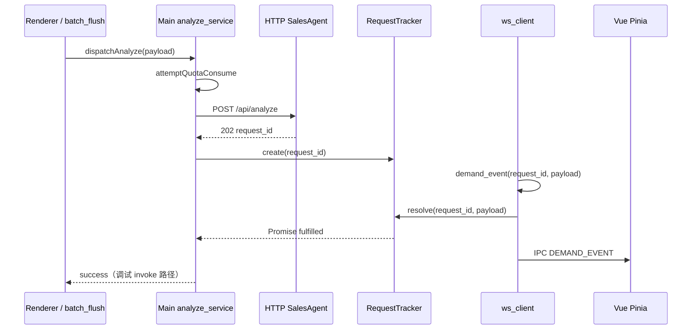

# 技术方案 — 谛听（Diting）客户端

> **产品**：谛听（Diting）  
> **仓库目录**：`ditingclient/`  
> **文档版本**：v0.7  
> **文档状态**：POC Ready — 阻塞项已拍板；v1.0 发布项见 §16.8  
> **关联文档**：[产品设计文档（PRD）](产品设计文档-微信聊天监控分析.md)、[技术方案-SalesAgent服务端](技术方案-SalesAgent服务端.md)、[**知识库-结构化入库方案**](知识库-结构化入库方案.md)、[仓库目录结构](仓库目录结构.md)

---

## 1. 目标与范围

### 1.1 本文档职责

定义 **谛听 Windows 客户端** 的可实施技术方案：进程架构、模块边界、数据模型、与 SalesAgent 的通信契约（消费端）、UIA/OCR 监听、Electron UI、本地 SQLite、POC 验收标准。

**不在本文**：服务端 analyze/ingest 实现细节 → 见 [技术方案-SalesAgent服务端](技术方案-SalesAgent服务端.md)。

### 1.2 阶段范围


| 阶段           | 目标                                                                        | 周期（参考） |
| ------------ | ------------------------------------------------------------------------- | ------ |
| **POC v0.1** | UIA Demo + PaddleOCR 兜底 + **图片气泡 Region OCR（§6.8）** + **增强身份导入（§6.9）** + beauty 预筛 + analyze 联调 + 需求雷达（Vue3）+ License 设置 + WS 首帧鉴权 | 2–3 周  |
| **MVP v0.5** | 全量监听加固 + 知识库上传 + OCR 兜底 + 关键词弹窗                                           | +4–6 周 |
| **v1.0**     | 看板/洞察/导出/安装包                                                              | +4 周   |


### 1.3 硬性约束（来自 PRD，不可违反）

- **日常只读监听**：`diting-listener` 运行期间不 Hook、不注入、不 SendInput、不写微信。
- **增强身份导入（§6.9）**：仅用户手工触发；**优先只读本地 `WeChat Files`**；失败可降级一次性增强模块；**与 listener 不同进程**；导入完成后监听期仅本地 `contact_resolver` 匹配。
- **零操作微信**：不向微信发送任何内容（导入过程亦禁止自动发消息/加好友）。
- **端云分工**：UIA/OCR、Level 1 资料库、Level 3 运行时上下文、展示 → 客户端；Embedding/VLM/LLM/Chroma/Niushop → 服务端。
- **成本护栏**：500 条/日 = **过滤后有效** `POST /api/analyze` 次数（非原始气泡数）。

---

## 2. 技术栈


| 层级     | 选型                                                                                | 状态                               |
| ------ | --------------------------------------------------------------------------------- | -------------------------------- |
| 桌面壳    | **Electron** + **electron-builder**                                               | ✅ 已定                             |
| 前端框架   | **Vue 3**（Composition API）                                                        | ✅ 已定；为后续 **uni-app** 手机端复用业务逻辑伏笔 |
| UI 组件库 | **shadcn-vue** + **Tailwind CSS**                                                 | ✅ 已定                             |
| 状态管理   | **Pinia**                                                                         | ✅ 推荐已定                           |
| 监听守护   | **Python 3.11+**（开发态）/ **PyInstaller exe**（发布态）                                   | ✅ 已定                             |
| UIA    | `**uiautomation`**                                                                | ✅ 已定（PRD §10.0）                  |
| OCR 兜底 | **PaddleOCR PP-OCRv4 mobile**（仅微信聊天窗口）                                            | ✅ 已定（§6.7）                       |
| 本地库    | **SQLite 3**（主进程 `better-sqlite3`）                                                | ✅ 已定                             |
| 配置     | `ditingclient/config/client.json` + `shared/config/*`                             | ✅ 已定                             |
| 打包     | **electron-builder**（桌面包）+ **PyInstaller `--onedir`**（监听 exe 内嵌 `extraResources`） | ✅ 已定（§16）                        |


**端云 OCR 分工（不可混用）**：


| 场景              | 负责方                | 引擎                        |
| --------------- | ------------------ | ------------------------- |
| 微信聊天窗口 UIA 失效抢救 | **谛听客户端**          | PaddleOCR PP-OCRv4 mobile |
| 用户上传资料 / 知识库图片  | **SalesAgent 服务端** | Qwen-VL + Ingestion       |
| Niushop 商品主图    | **SalesAgent 服务端** | Qwen-VL（夜间）               |


---

## 3. 进程架构

### 3.1 双进程模型（推荐）+ 可选身份导入

```
┌─────────────────────────────────────────────────────────────┐
│  Electron 主进程                                             │
│  · 窗口 / 托盘 / 自动更新（v1.0）                             │
│  · SQLite（需求缓存、联系人、配置）                           │
│  · contact_import 编排（§6.9）+ contact_resolver 快照下发      │
│  · HTTP/WS 客户端 → SalesAgent                               │
│  · IPC Server（unix named pipe / localhost TCP）             │
└───────────────┬─────────────────────────┬───────────────────┘
                │ IPC（JSON Lines）          │ 子进程 spawn（按需）
┌───────────────▼─────────────────────────▼───────────────────┐
│  Python 监听子进程（diting-listener）                         │
│  · 微信进程检测                                               │
│  · UIA 会话列表 + 消息区采集（含未聚焦只读）                   │
│  · contact_index 内存匹配（只读快照，§6.9.4）                  │
│  · 黑名单 / 去重 / 发言合并 / 类目预筛                         │
│  · OCR 兜底（UIA 失败时）                                     │
│  · 输出 RawMessage → IPC；flush 后请求主进程上报 analyze        │
└─────────────────────────────────────────────────────────────┘

┌─────────────────────────────────────────────────────────────┐
│  contact-import（按需 · 用户点击同步 · 独立进程）              │
│  · 实现 A：local_db_reader — 只读 WeChat Files 通讯录库       │
│  · 实现 B：hook_once（仅 A 失败时，需用户二次确认）            │
│  · 输出 NDJSON → 主进程写入 contacts；任务结束即退出           │
└─────────────────────────────────────────────────────────────┘
```

**分工理由**：

- Python 生态适合 `uiautomation`；Electron 适合 UI 与网络。
- 监听崩溃可独立重启，不拖垮 UI。
- POC 可先 **纯 Python CLI** 跑通链路，再挂 Electron。

### 3.2 IPC 协议（客户端内部）

**传输**：✅ **已定** — `127.0.0.1:18765` **TCP**（`localhost` only）。**不使用** Named Pipe（Node 侧错误处理与调试工具链不如 TCP 成熟；`curl`/抓包可复现问题）。

**消息信封**（NDJSON，一行一条 JSON）：

```json
{
  "type": "raw_message | batch_flush | batch_flush_chunk | batch_flush_end | listener_status | keyword_hit | error",
  "ts": "2026-06-16T14:30:00+08:00",
  "payload": { }
}
```

| type               | 方向            | 说明                         |
| ------------------ | ------------- | -------------------------- |
| `raw_message`      | Py → Electron | 单条采集（统计用，不一定上报）            |
| `batch_flush`      | Py → Electron | 发言合并完成（小载荷 ≤512KB）        |
| `batch_flush_chunk` | Py → Electron | 大载荷分片（见 §3.2.1）           |
| `batch_flush_end`  | Py → Electron | 分片结束，主进程组装后 analyze        |
| `listener_status`  | Py → Electron | 微信/监听状态变更（含 `ready_for_ocr`） |
| `keyword_hit`      | Py → Electron | 紧急关键词命中                    |
| `config_reload`    | Electron → Py | 黑名单/合并秒数/监听模式/**contact_index** 热更新 |
| `listener_control` | Electron → Py | `start` / `stop` / `pause` |
| `heartbeat`        | Py → Electron | 监听进程存活证明（见 §3.4）           |
| `pong`             | Py → Electron | 响应主进程 `ping`（可选）           |

#### 3.2.1 大数据载荷与背压 ✅ 已定

**风险**：晨间堆积 200+ 条群消息合并后，单个 `batch_flush` JSON 可达数 MB；主进程 `JSON.parse` 触发 GC 卡顿，影响 Vue 流畅度。

| 规则 | 值 |
|------|-----|
| 单条 IPC 消息上限 | **1MB**（含换行） |
| 超过 **512KB** 的 flush | 必须走 **分片协议** |
| 主进程组装 | 收齐 `batch_flush_end` 后再 `JSON.parse` 合并体或流式拼接 |

**分片协议**：

```json
{"type":"batch_flush_chunk","payload":{"flush_id":"f_abc","index":0,"total":3,"data_base64":"..."}}
{"type":"batch_flush_chunk","payload":{"flush_id":"f_abc","index":1,"total":3,"data_base64":"..."}}
{"type":"batch_flush_end","payload":{"flush_id":"f_abc","merged_count":12}}
```

- Python 侧：估算 UTF-8 字节数；超限则拆分 `content` 字段或整条 `raw_message` 序列化结果。  
- Electron 侧：`Map<flush_id, Buffer[]>` 缓存分片；`end` 时组装 → 类目网关 → analyze。  
- 组装超时 **30s** 未收到 `end` → 丢弃并 `WARN ipc_flush_chunk_timeout`。

#### 3.2.2 信道预留（多路复用）

| 阶段 | 方案 |
|------|------|
| **POC / MVP** | 单一 TCP `:18765` 复用 heartbeat + 业务消息 |
| **未来**（IPC 延迟抖动时） | 拆双 Socket：`:18765` Control/Heartbeat，`:18766` Data/Bulk |

配置预留：`listener_supervisor.ipc_data_port: 18766`（默认 `null` = 未启用）。

---

1. Electron 启动 → 读配置 → 初始化 SQLite → 校验 License。
2. **License 未激活**：仅开放设置页（账号 Tab）；**不** spawn 守护进程、**不**建 WS。
3. **License 已激活**（含本次「验证并激活」成功）→ **自动** `Supervisor.start()`（见 §3.3.1），无需用户再点「开启监听」。
4. Python 连接 IPC → `listener_status: starting` → 主循环后 `running` 或 `waiting_wechat`。
5. Electron 建立 WebSocket `/events` → **首帧发送 `auth`**（§11.4），**禁止**先发空 `ping`。
6. 退出应用：Supervisor `stop()` → flush → 关闭 WS。

#### 3.3.1 License 激活后自动开监听 ✅ 已定

| 时机 | 行为 |
| ---- | ---- |
| 冷启动且本地 `license_state.status === active` | 主进程初始化完成后 **立即** `Supervisor.start()` |
| 设置页「验证并激活」成功 | 写入 `license_state` → **同一流程内** `Supervisor.start()` + 连接 WS |
| License 过期 / 校验失败 | `Supervisor.stop()`；不自动重启 |
| 用户手动「停止监听」 | `Supervisor.stop()`；**下次冷启动** License 仍有效时 **仍自动开** |

**与微信在线**：自动开监听 = 拉起守护进程；微信未登录时顶栏 **🟡 等待微信**，不阻止 Supervisor 启动。

**配置**：`listener_supervisor.auto_start_on_license_active: true` + `spawn_on_app_start: true`

```typescript
async function afterLicenseValidated() {
  await saveLicenseState(...);
  if (config.listener_supervisor.auto_start_on_license_active) {
    await supervisor.start();
    await connectWebSocket();
  }
}
```

### 3.4 监听进程监督（Supervisor）— 崩溃感知与自动重启

> **结论**：不是「只靠每 30 秒巡检」。采用 **三层感知**——进程 `exit` 事件（毫秒级）、IPC 断连（秒级）、应用心跳（默认 **10s 一发，连续 3 次未收到即约 30s 判定僵死**）。  
> **重启由 Electron 主进程的 Supervisor 模块负责**；Python 子进程崩溃 **不会** 拖垮 UI 窗口。

#### 3.4.1 职责划分


| 组件                     | 位置                                             | 职责                                                      |
| ---------------------- | ---------------------------------------------- | ------------------------------------------------------- |
| **ListenerSupervisor** | Electron 主进程 `electron/listener/supervisor.ts` | spawn/kill 子进程、感知崩溃/僵死、退避重启、更新 UI 状态                    |
| **diting-listener**    | Python 子进程                                     | UIA 采集；定时发 `heartbeat`；收到 `stop` 时 flush 后退出            |
| **Renderer**           | 前端                                             | 只读 `listenerHealth`；「停止监听」→ `supervisor.stop()`（下次冷启动仍自动开） |


主进程持有 `child_process` 引用；Renderer **不**直接操作 Python 进程。

#### 3.4.2 三层感知机制

```
┌─────────────────────────────────────────────────────────────────┐
│  Layer 1 — 进程 exit（最快，崩溃/被 kill）                        │
│  child.on('exit', (code, signal)) → 非用户 stop → scheduleRestart │
├─────────────────────────────────────────────────────────────────┤
│  Layer 2 — IPC 断连（连接异常、子进程未正常 close）               │
│  socket.on('close'|'error') → 若未在 stopping 态 → restart       │
├─────────────────────────────────────────────────────────────────┤
│  Layer 3 — 应用心跳（僵死：进程还在但不干活）                     │
│  Python 每 heartbeat_interval 秒发 heartbeat                       │
│  主进程 watchdog：超过 heartbeat_timeout 未收到 → kill + restart   │
└─────────────────────────────────────────────────────────────────┘
```


| 层级          | 触发条件                              | 典型延迟        | 说明                                                         |
| ----------- | --------------------------------- | ----------- | ---------------------------------------------------------- |
| **L1 exit** | 未捕获异常、OOM、被系统结束、`exit code ≠ 0`   | **< 1s**    | Node `child_process` 的 `exit` / `error` 事件                 |
| **L2 IPC**  | TCP 断开、JSON 解析连续失败、子进程僵死未写 socket | **1–5s**    | 与 L1 互补（部分崩溃来不及发 exit 前先断连）                                |
| **L3 心跳**   | 进程存活但主循环卡死（如 UIA 调用阻塞）            | **默认 ≤30s** | **不是**「每 30s 才查一次」；而是 **每 10s 应收到一次心跳，连续 3 次未收到（≈30s）判僵死** |


**为何不只用 30s 轮询**：纯 30s 巡检对 **突然崩溃** 反应太慢，且无法区分「正常空闲」与「僵死」。L1+L2 负责 **真崩溃**；L3 负责 **假存活**。

#### 3.4.3 心跳协议

**Python → Electron**（子进程主循环末尾或独立线程定时发送）：

```json
{
  "type": "heartbeat",
  "ts": "2026-06-16T14:30:10+08:00",
  "payload": {
    "state": "running",
    "wechat_attached": true,
    "uptime_sec": 120,
    "last_capture_at": "2026-06-16T14:30:08+08:00",
    "buffers_pending": 2,
    "pid": 12345
  }
}
```

**Electron 主进程**（可选主动探测）：

```json
{ "type": "ping", "ts": "..." }
```

Python 收到后回复 `{ "type": "pong", ... }`。POC **可仅实现单向 `heartbeat`**；`ping/pong` 为 P1 增强。

**Watchdog 逻辑（主进程伪代码）**：

```typescript
let lastHeartbeatAt = Date.now();

childIpc.on('heartbeat', () => { lastHeartbeatAt = Date.now(); });

setInterval(() => {
  if (supervisor.state !== 'running') return;
  if (Date.now() - lastHeartbeatAt > heartbeat_timeout_ms) {
    supervisor.handleHung('heartbeat_timeout');
  }
}, 1000); // 主进程每 1s 检查一次阈值，不是每 30s 才检查
```

#### 3.4.4 自动重启策略


| 项                           | 默认值                     | 说明                                         |
| --------------------------- | ----------------------- | ------------------------------------------ |
| `auto_restart`              | `true`                  | 用户未手动停止时启用                                 |
| `heartbeat_interval_sec`    | **10**                  | Python 发送间隔                                |
| `heartbeat_timeout_sec`     | **30**                  | 超时未收到 → 僵死重启（≈3 个心跳周期）                     |
| `restart_backoff_sec`       | `[1, 2, 5, 10, 30, 60]` | 指数退避，上限 60s                                |
| `max_restarts_per_hour`     | **10**                  | 超限后停止自动重启，UI 提示「监听异常，请查看日志」                |
| `graceful_stop_timeout_sec` | **8**                   | `stop` 后等待 flush；超时 `taskkill` / `SIGKILL` |


**重启流程**：

```
detectCrashOrHung()
  → state = 'restarting'
  → UI：🟡 监听恢复中…
  → killChildIfAlive(graceful_stop_timeout)
  → await backoff[n]
  → spawnNewChild()
  → 重置 lastHeartbeatAt
  → 成功收到 heartbeat → state = 'running'，UI：🟢 监听中
  → restart_count_hour++
```

**不自动重启的情况**：

- 用户点击「停止监听」或退出应用（`user_stop_requested = true`）
- 1 小时内重启次数 ≥ `max_restarts_per_hour`
- License 未激活 / 已过期
- 微信未运行（仅保持 `waiting_wechat`，**不 spawn** 或 spawn 后 idle，见下）

**微信未运行**：子进程保持存活，`heartbeat.state = waiting_wechat`（✅ 已定，不频繁 spawn/kill）。

#### 3.4.5 主进程实现要点（Node / Electron）

```typescript
// electron/listener/supervisor.ts — 纲要
import { spawn, ChildProcess } from 'child_process';

class ListenerSupervisor {
  private child: ChildProcess | null = null;
  private userStopRequested = false;
  private restartsThisHour = 0;

  start() {
    this.userStopRequested = false;
    this.spawnChild();
    this.child!.on('exit', (code, signal) => this.onChildExit(code, signal));
    this.child!.stderr?.on('data', (buf) => logListenerError(buf));
  }

  stop() {
    this.userStopRequested = true;
    this.sendIpc({ type: 'listener_control', payload: { action: 'stop' } });
    setTimeout(() => this.killChildIfAlive(), graceful_stop_timeout_sec * 1000);
  }

  private onChildExit(code: number | null, signal: string | null) {
    if (this.userStopRequested) { this.state = 'stopped'; return; }
    if (code === 0) { this.scheduleRestart('clean_exit'); return; }
    this.scheduleRestart(`crash code=${code} signal=${signal}`);
  }

  private spawnChild() {
    const listenerExe = app.isPackaged
      ? path.join(process.resourcesPath, 'diting-listener', 'diting-listener.exe')
      : pythonPath; // 开发态：python -m listener
    const args = app.isPackaged ? [] : ['-m', 'listener', '--ipc-port', String(ipcPort)];
    this.child = spawn(listenerExe, args, {
      stdio: ['pipe', 'pipe', 'pipe'],
      windowsHide: true,
      cwd: app.isPackaged ? path.dirname(listenerExe) : projectRoot,
    });
  }
}
```

- **独立重启**：仅 `spawn` 新的 Python 进程；Electron 窗口、SQLite、WebSocket **保持不动**。
- **崩溃隔离**：Python 段错误 / 未捕获异常 **不会** 导致 Electron 主进程退出（除非错误地写在主进程里的同步 UIA 调用——故 UIA **必须在 Python 内**）。

#### 3.4.6 配置项（写入 `client.json`）

建议在 `ditingclient/config/client.json` 增加：

```json
"listener_supervisor": {
  "enabled": true,
  "ipc_port": 18765,
  "heartbeat_interval_sec": 10,
  "heartbeat_timeout_sec": 30,
  "watchdog_check_interval_sec": 1,
  "auto_restart": true,
  "restart_backoff_sec": [1, 2, 5, 10, 30, 60],
  "max_restarts_per_hour": 10,
  "graceful_stop_timeout_sec": 8,
  "comment": "L1=进程exit L2=IPC断连 L3=心跳超时(默认10s心跳,30s无心跳判僵死)"
}
```

#### 3.4.7 UI 与日志


| 事件     | 顶栏        | 日志                                         |
| ------ | --------- | ------------------------------------------ |
| 崩溃后重启中 | 🟡 监听恢复中… | `WARN listener_crash code=1 restart_in=2s` |
| 僵死重启   | 🟡 监听恢复中… | `WARN listener_hung heartbeat_timeout=30s` |
| 重启成功   | 🟢 监听中    | `INFO listener_restarted pid=...`          |
| 超限停重启  | 🔴 监听异常   | `ERROR max_restarts_per_hour exceeded`     |


设置页可展示：「过去 1 小时自动恢复 N 次」。

#### 3.4.8 POC 最小实现


| 优先级    | 能力                                                        |
| ------ | --------------------------------------------------------- |
| **P0** | `child.on('exit')` + 退避重启 + `heartbeat` 10s / timeout 30s |
| **P1** | IPC 断连检测、`ping/pong`、小时重启上限                               |
| **P2** | 崩溃原因分类上报、托盘通知                                             |


---

## 4. 代码目录结构

### 4.0 多 Agent 包命名规范 ✅ 已定

未来会有多个**采集 Agent**（PC 微信、手机微信、小红书、咸鱼等），**服务端共用** SalesAgent。源码按 **反向域名包路径** 隔离，避免混在一个扁平 `src/` 里。

| 层级 | 包路径（逻辑 ID） | 物理目录（本次 POC） | 说明 |
|------|-------------------|----------------------|------|
| **采集 Agent** | `com.yanpanji.pcwx` | `ditingclient/src/com/yanpanji/pcwx/` | 谛听 · **PC 微信**（Electron + UIA） |
| 采集 Agent（规划） | `com.yanpanji.wx` | 独立工程或 `ditingclient` 兄弟目录 | 手机微信 |
| 采集 Agent（规划） | `com.yanpanji.xhs` | 远期新目录 | 小红书 |
| 采集 Agent（规划） | `com.yanpanji.xy` | 远期新目录 | 咸鱼 |
| **共用服务端** | `com.yanpanji.agents` | `salesagent/src/com/yanpanji/agents/` | analyze / ingest / Chroma / WS |

**约定**：

| 项 | 规则 |
|----|------|
| Python 监听 | `python -m com.yanpanji.pcwx.listener`；PyInstaller 入口同包 |
| Electron / Vue | TS 源码在 `com/yanpanji/pcwx/electron`、`.../renderer`；`vite`/`tsconfig` 的 `@` 指向该 Agent 的 `renderer` |
| 安装包 `appId` | `com.yanpanji.pcwx`（与包路径一致） |
| 上报服务端 | `client_meta.agent_package: "com.yanpanji.pcwx"`（`client.json#agent.package_id`） |
| 仓库目录名 | `ditingclient/`、`salesagent/` **可不变**；扩展 Agent 时优先加 `src/com/yanpanji/<agent>/` 或新顶层目录 |

```
ditingclient/src/com/yanpanji/
├── pcwx/                    # 本次 POC — PC 微信
│   ├── electron/
│   ├── renderer/
│   ├── listener/            # Python
│   ├── shared/types/
│   └── db/schema.sql
├── wx/                      # 预留：手机微信（v1.1+）
└── common/                  # 预留：多 Agent 共用 TS 类型（T12 后再抽）

salesagent/src/com/yanpanji/
└── agents/                  # 所有采集端共用
    ├── main.py
    ├── api/
    ├── analyze/
    └── ...
```

### 4.1 目录树（`com.yanpanji.pcwx` · 当前实现范围）

```
ditingclient/
├── config/
│   ├── client.json              # agent.package_id = com.yanpanji.pcwx
│   └── wechat_uia_map.json
├── src/
│   └── com/yanpanji/pcwx/     # ← 本次 Agent 根包
│       ├── electron/            # Electron 主进程 + 预加载
│       │   ├── main.ts
│       │   ├── preload.ts
│       │   ├── bridge/
│       │   ├── services/        # ws_client, analyze_service, quota…
│       │   ├── analyze/       # request_tracker
│       │   ├── db/
│       │   ├── notifications/
│       │   ├── listener/      # supervisor, ipc_server
│       │   └── ipc/
│       ├── renderer/            # Vue 3 + shadcn-vue
│       │   ├── pages/Radar/ …
│       │   ├── stores/
│       │   └── composables/
│       ├── shared/types/        # demand-event, bridge（本 Agent）
│       ├── listener/            # Python 包 com.yanpanji.pcwx.listener
│       │   ├── __main__.py
│       │   ├── uia_session.py
│       │   ├── contact_resolver.py   # 只读内存索引匹配（§6.9.4）
│       │   ├── image_capture.py
│       │   └── …
│       ├── contact_import/      # Python 包 com.yanpanji.pcwx.contact_import
│       │   ├── __main__.py
│       │   ├── local_db_reader.py    # 优先：只读 WeChat Files
│       │   ├── hook_once.py          # 降级：一次性增强（可选编译）
│       │   └── models.py
│       └── db/
│           ├── schema.sql
│           └── migrations/
├── package.json
├── pyproject.toml               # packages = com.yanpanji.pcwx.*
└── README.md
```

**前端工程约定**（路径随 Agent 包调整）：

- 构建：**Vite** + `vite-plugin-electron`（或等价方案）  
- 组件：从 [shadcn-vue](https://www.shadcn-vue.com/) 按需引入（Card、Dialog、Toast 等）  
- 样式：Tailwind；设计令牌与 PRD 浅色主题默认对齐  
- **uni-app 伏笔**：POC 阶段类型放 `src/com/yanpanji/pcwx/shared/types/`（**T12 延至 v1.1**）；手机 Agent 目标包 `com.yanpanji.wx`

---

## 5. 配置加载

### 5.1 加载顺序

1. 读取 `ditingclient/config/client.json`
2. 解析 `shared_config.dir` → 加载 `categories.json`、`knowledge.json`、`subscription.json`（降级）
3. 环境变量覆盖（可选）：`DITING_DATA_ROOT`、`DITING_API_BASE`

### 5.2 路径展开

`{data_root}` 替换规则：使用 `client.json#data_root`，默认 `C:/work/diting/data`。


| 逻辑路径   | 物理路径                                                                  |
| ------ | --------------------------------------------------------------------- |
| 类目原始资料 | `{data_root}/{category}/raw/`                                         |
| 类目运行时  | `{data_root}/{category}/runtime/`                                     |
| SQLite | `{data_root}/client.db`                                               |
| UIA 映射 | `ditingclient/config/wechat_uia_map.json`（可同步到 `{data_root}/config/`） |


### 5.3 热更新


| 配置块                                   | 热更新 | 方式                                   |
| ------------------------------------- | --- | ------------------------------------ |
| `session_filter`（黑/白名单）               | ✅   | 设置页保存 → 写 JSON + IPC `config_reload` |
| `message_batching.idle_flush_seconds` | ✅   | 同上                                   |
| `wechat_uia_map.json`                 | ✅   | 文件 watch 或手动「重新加载映射」                 |
| `categories.json`                     | ⚠️  | 重启监听或 IPC reload                     |
| API 地址                                | ⚠️  | 切换环境需重连 WS                           |


---

## 6. C1 — 微信 UIA 监听

### 6.0 Windows 权限、UAC 与兼容性（高危）✅ 已定

UIA + 截屏在 Windows 10/11 上受 **UAC 完整性级别隔离** 影响：微信与谛听 **权限不一致** 时，UIA 常 **静默失败**（空控件树、无异常），是 POC 漏报的首要环境原因之一。

#### 6.0.1 UAC 隔离现象

| 微信进程 | 谛听进程 | 结果 |
|----------|----------|------|
| Admin | User | UIA **失效**（常见） |
| User | Admin | UIA **可能失效** |
| Admin | Admin | ✅ 推荐 |
| User | User | ✅ 可用（双方均非提升） |

**定稿**：**谛听客户端（含 Electron + `diting-listener.exe`）统一以管理员权限运行**，降低与「用户以管理员启动微信」场景的不一致概率；PaddleOCR 截屏在 Admin 下成功率更高。

#### 6.0.2 权限一致性校验（Supervisor）

在 `supervisor.ts` **spawn 前**与 **heartbeat 周期内**检测微信 PID 与当前进程 elevation：

```typescript
import { execSync } from 'child_process'

function isProcessElevated(pid: number): boolean {
  try {
    const cmd = `powershell -NoProfile -Command "(Get-Process -Id ${pid}).Handle"` // 备用：ElevationType
    // 推荐：NtQueryInformationToken / checkTokenMembership 封装
    const out = execSync(
      `powershell -NoProfile -Command "[bool](([Security.Principal.WindowsPrincipal][Security.Principal.WindowsIdentity]::GetCurrent()).IsInRole([Security.Principal.WindowsBuiltInRole]::Administrator))"`,
      { encoding: 'utf8' }
    )
    return out.trim() === 'True'
  } catch {
    return false
  }
}

function assertElevationParity(wechatPid: number) {
  const wechatElevated = isProcessElevated(wechatPid) // 实现：查询目标进程 token
  const selfElevated = isProcessElevated(process.pid)
  if (wechatElevated !== selfElevated) {
    emitListenerHealth({ state: 'error', code: 'UAC_MISMATCH' })
    // UI：Dialog 提示「请以相同权限运行微信与谛听」；设置页链到帮助文档
  }
}
```

> 实现细节：微信进程 elevation 检测可用 `Get-Process -Id $pid | Select-Object -ExpandProperty Path` + `shell32` 或 WMI `Win32_Process`；POC 至少检测 **本进程是否 Admin** 并提示用户。

#### 6.0.3 安装包 Manifest（electron-builder）

```json
"win": {
  "target": ["nsis"],
  "requestedExecutionLevel": "requireAdministrator"
}
```

- 首次启动触发 UAC 提升；**与产品「后台雷达」定位一致**。  
- `diting-listener.exe` 由已提升的 Electron `spawn`，**继承管理员令牌**。  
- 开发态：`package.json` 脚本提示「请以管理员打开终端」。

#### 6.0.4 DPI 与显示缩放

见 **§6.7.6**（OCR 专用）；Electron 主进程启动时：

```typescript
app.commandLine.appendSwitch('high-dpi-support', '1')
```

---

### 6.1 微信版本与映射文件

`**wechat_uia_map.json` Schema（v1）**：

```json
{
  "$schema": "wechat-uia-map-v1",
  "wechat_version": "3.9.x.x",
  "windows_version": "10.0.19045",
  "updated_at": "2026-06-16",
  "main_window": {
    "class_name": "WeChatMainWndForPC",
    "name_pattern": "微信"
  },
  "session_list": {
    "control_type": "ListControl",
    "automation_id": "",
    "name": "会话",
    "search_depth": 12,
    "comment": "POC 由 Inspect.exe 填写，禁止硬编码到 Python"
  },
  "message_list": {
    "control_type": "ListControl",
    "automation_id": "",
    "search_depth": 15
  },
  "message_bubble_text": {
    "control_type": "TextControl",
    "parent_chain": []
  },
  "group_sender_name": {
    "control_type": "TextControl",
    "relative_to": "message_bubble",
    "offset": null
  },
  "image_bubble_region": {
    "comment": "POC 图片采集：相对消息区的矩形偏移，Inspect 标定",
    "offset_x": 0,
    "offset_y": 0,
    "width": 280,
    "height": 200
  },
  "unfocused_read_strategy": "structure_changed_poll",
  "poll_interval_ms": 800
}
```

> POC 第一步用 Inspect.exe 填写上表空字段；**禁止**在 Python 代码硬编码 ClassName。

### 6.2 采集流程

```
[循环]
  检测 WeChat.exe 是否存在
    否 → status=waiting_wechat，sleep 3s
    是 → 定位主窗口
  订阅/轮询会话列表 StructureChanged
  对每个有新未读的会话（含当前未聚焦）：
    只读定位消息 ListControl（不 SetFocus 发消息）
    读取新增 TextControl → 解析 sender / content
    生成 RawMessage
    去重 → 黑名单 → 写入统计
    发言合并缓冲
    关键词规则（并行，不等待 flush）
```

### 6.3 RawMessage 规范

与 PRD §5.2 及服务端 analyze 入参对齐：

```json
{
  "msg_id": "sha256(session_id|sender|content|captured_at)[:16]",
  "session_id": "stable_hash(session_type|session_name)",
  "session_name": "宝妈交流群",
  "session_type": "group",
  "sender_display_name": "李小姐",
  "sender_remark_name": null,
  "wxid": "Yolo--shy",
  "contact_key": "wxid:Yolo--shy",
  "contact_match_confidence": 0.95,
  "contact_match_source": "contacts_sync",
  "group_key": "stable_hash(session_name)|null",
  "content": "最近天热了，有没有推荐的防晒霜？",
  "content_type": "text",
  "source": "uia",
  "captured_at": "2026-06-16T14:30:00+08:00",
  "batch_meta": {
    "merged_count": 1,
    "truncated": false
  }
}
```


| 字段             | 规则                                                                               |
| -------------- | -------------------------------------------------------------------------------- |
| `session_id`   | `stable_hash(session_type + normalized_session_name)`；备注变更见 §10.1.1 `session_alias_history` |
| `contact_key`  | 发言人稳定键；**解析规则见 §6.9.4**；命中 wxid 时为 `wxid:{微信号}` |
| `wxid`         | 微信号；通讯录同步命中时填充；否则 `null` |
| `contact_match_confidence` | `0.0–1.0`；唯一匹配 0.95+，多候选降权 |
| `contact_match_source` | `contacts_sync` \| `remark` \| `group_fallback` \| `display_fallback` |
| `group_key`    | 单聊为 `null`                                                                       |
| `content_type` | `text` \| `image`（POC）；`voice` / `link` **MVP 再议** |


### 6.4 去重

键：`(session_id, sender_display_name, content_hash, time_bucket)`  

- `content_hash = sha256(normalize(content))`  
- `time_bucket`：同一分钟内相同内容视为重复（`dedupe_window_seconds: 60`）

### 6.5 黑名单 / 监听模式

实现 `session_filter.py`，读取 `client.json#session_filter`：


| `listen_mode`     | 行为               |
| ----------------- | ---------------- |
| `full_collection` | 全量采集，**黑名单优先排除** |
| `whitelist_only`  | 仅白名单群/联系人        |


匹配：`match_mode: contains`，对 `session_name` / `sender_display_name` / `sender_remark_name` 做子串匹配（大小写不敏感）。

### 6.6 监听降级梯（实现开关）


| 级别  | 配置                      | 触发条件             |
| --- | ----------------------- | ---------------- |
| L0  | `full_collection` + 黑名单 | 默认               |
| L1  | 扩大 `blacklist_groups`   | POC 漏报/CPU 高（人工） |
| L2  | `whitelist_only`        | L1 仍不满足          |


降级仅改配置 + 重启监听，不改代码。

### 6.7 OCR 兜底 — PaddleOCR（PP-OCRv4 mobile）✅ 已定

**定位**：UIA 失效时的**最后一道消息采集防线**，服务于 POC 漏报率达标（PRD §10.0）。  
**明确不做**：用户上传业务图片、知识库 ingest、Niushop 商品图 — 均由 **SalesAgent + Qwen-VL** 负责。

#### 6.7.1 触发条件

与 `client.json#wechat_listener` 联动：


| 条件                                          | 配置                   |
| ------------------------------------------- | -------------------- |
| UIA 在 `ocr_fallback_timeout_seconds` 内未读到文本 | 默认 **5s**            |
| 同时检测到消息区视觉变化（新气泡占位/列表 StructureChanged）     | `ocr_fallback: true` |
| 仅针对**当前微信聊天窗口消息区 ROI**                      | 非全屏 OCR              |


#### 6.7.2 技术实现


| 项        | 选型                                                               |
| -------- | ---------------------------------------------------------------- |
| 引擎       | **PaddleOCR**，模型 **PP-OCRv4 mobile**（体积与速度平衡）                    |
| 部署位置     | **Windows 客户端本地**，随 PyInstaller `--onedir` 打入 `diting-listener/` |
| 推理设备     | **CPU**（POC/MVP 默认）；GPU 加速 **延至 v1.x**（需实测 Paddle 显卡支持） |
| Python 包 | `paddleocr` + `paddlepaddle`（CPU 版）                              |


**流程**：

```
UIA 读消息失败（超时）
  → 按 wechat_uia_map 定位消息区矩形 ROI
  → mss / PIL 截屏 ROI
  → PaddleOCR PP-OCRv4 mobile 识别
  → 文本清洗 → RawMessage{ source: "ocr" }
  → 进入去重 / 发言合并（与 UIA 路径一致）
```

#### 6.7.3 性能与资源


| 指标        | 目标                                       |
| --------- | ---------------------------------------- |
| 单次 OCR 延迟 | ≤ 2s（mobile 模型，ROI 仅消息区）                 |
| 内存增量      | Paddle + mobile 模型计入守护进程 **< 500MB** 总预算 |
| 调用频率      | 仅 UIA 失败时触发，**禁止**对每条消息全量 OCR            |


模型文件随 `extraResources` 分发，首次启动不联网下载（体积 **POC 实测**，见 §18 T13；约 10–15 MB mobile 量级）。

#### 6.7.4 配置（`client.json`）

见 `ocr_fallback` 块（§配置文件）。

#### 6.7.5 与知识库 OCR 的边界

```
微信聊天 ROI ──PaddleOCR──→ 监听管线 ──analyze──→ SalesAgent
用户 raw/ 图片 ──HTTP 上传──→ SalesAgent ──Qwen-VL──→ Chroma
```

客户端**不得**对用户上传文件调用 PaddleOCR。

#### 6.7.6 DPI 处理策略 ✅ 已定

**风险**：Windows 默认 **125% / 150%** 缩放时，微信窗口按逻辑像素渲染；直接截屏送 PaddleOCR（按物理像素训练）会导致准确率断崖下降。

| 层 | 策略 |
|----|------|
| Electron | `app.commandLine.appendSwitch('high-dpi-support', '1')` |
| Python 截屏 | `mss` 抓取 ROI 后读取 `GetDpiForWindow` / `ctypes` 获取 **缩放因子** |
| 缩放 ≠ 100% | 对 ROI 做 **Lanczos 重采样** 至等价 96 DPI 1:1 像素后再 OCR |
| 可选 | 锐化卷积（`unsharp_mask`）仅在高 DPI 时启用 |

配置：`ocr_fallback.dpi_aware_resample: true`（默认开启）。

```python
def prepare_roi_for_ocr(img, scale_factor: float):
    if scale_factor <= 1.01:
        return img
    w, h = img.size
    target = img.resize((int(w / scale_factor), int(h / scale_factor)), Image.Resampling.LANCZOS)
    return target
```

#### 6.7.7 模型预热（Warm-up）✅ 已定

**痛点**：Paddle 首次 `import` / 首次推理 **2–5s**；若 UIA 失败时才冷加载，用户感知「卡死」。

```
Python 进程启动
  → 并行：UIA 主循环可先运行
  → 后台线程：加载 PP-OCRv4 mobile（warm-up 一次空图推理）
  → 完成 → IPC listener_status: { state: "ready_for_ocr" }
```

| 阶段 | OCR 兜底 |
|------|----------|
| 预热完成前 UIA 失败 | **跳过 OCR**，记 `uia_fail_pre_warmup` 日志；不阻塞采集 |
| `ready_for_ocr` 后 | 正常走 §6.7.1 流程，延迟 ≤2s |

Supervisor / 设置页可展示「OCR 引擎就绪」。

### 6.8 图片消息采集（POC 极简 · Region Capture + OCR）✅ 已定

**目标**：POC 阶段跑通「图片气泡 → 文本 → analyze」；**不**解析微信 XML 图片节点、**不**做图片持久化与断点续传。

#### 6.8.1 职责拆分（Electron + Python 解耦）

| 步骤 | 负责方 | 动作 |
|------|--------|------|
| 1 | Python UIA | 识别 `[图片]` / 图片气泡，计算 **Region** `{x,y,width,height}`（逻辑像素，相对微信窗口客户区） |
| 2 | Python → Electron | IPC `image_capture_request`（含 `region`） |
| 3 | **Electron 主进程** | **Region 截屏**（POC：`robotjs` 或 `desktopCapturer` + 裁剪）；输出 **Base64 PNG** |
| 4 | Electron → Python | HTTP `POST http://127.0.0.1:5000/ocr` `{ "image_base64": "data:image/png;base64,..." }` |
| 5 | Python | PaddleOCR 识别 → `{ "text": "..." }` |
| 6 | Python | 组装 `RawMessage`：`content_type=image`，`content=text`（空则 `""`），走 §7 合并 → analyze |

**HTTP 与 IPC 分离**：控制/心跳走 IPC `:18765`；**大图 Base64 走本地 HTTP**，避免 IPC 分片复杂度（§3.2.1 仍适用于 UIA 文本帧）。

#### 6.8.2 POC 三条红线（禁止）

| 红线 | 说明 |
|------|------|
| **不持久化** | 截屏 → OCR → 丢弃；**禁止** SQLite / localStorage / 磁盘缓存图片 |
| **不做 XML 坐标映射** | 不解析微信内部图片控件树；仅 **Region Capture** |
| **OCR 失败不重试** | 500 / 异常 → 打日志，`content=""`，**不**入队、不保存原图 |

#### 6.8.3 Electron 主进程：截屏 IPC

```typescript
// electron/main/ipc/handleScreenshot.ts
import { ipcMain } from 'electron'

export function setupScreenshotHandler() {
  ipcMain.handle('capture-wechat-image', async (_event, region: Region) => {
    try {
      const robot = require('robotjs') // POC：npm install robotjs
      const img = robot.screen.capture(region.x, region.y, region.width, region.height)
      const buffer = Buffer.from(img.image, 'binary')
      const base64 = `data:image/png;base64,${buffer.toString('base64')}`
      return { success: true, base64 }
    } catch (err) {
      console.error('Screenshot failed:', err)
      return { success: false }
    }
  })
}
```

Preload 暴露：`window.diting.captureWechatImage(region)`（§13.10）。

#### 6.8.4 Python：OCR HTTP 路由（Flask 线程）

与 `diting-listener` 同进程或子线程启动；**只**处理 `/ocr`，与 IPC 监听并行：

```python
# python/ocr_http.py — 由 daemon 启动时 import
from flask import Flask, request, jsonify
from PIL import Image
import io, base64

app = Flask(__name__)
# ocr_engine: PaddleOCR 单例，§6.7.7 预热后可用

@app.route('/ocr', methods=['POST'])
def handle_ocr():
    data = request.json or {}
    img_base64 = data.get('image_base64')
    if not img_base64:
        return jsonify({'error': 'No image'}), 400
    try:
        _, encoded = img_base64.split(',', 1)
        image = Image.open(io.BytesIO(base64.b64decode(encoded)))
        if ocr_fallback.dpi_aware_resample:
            image = prepare_roi_for_ocr(image, scale_factor)  # §6.7.6
        result = ocr_engine.ocr(image, cls=True)
        texts = [line[1][0] for line in (result[0] or [])]
        return jsonify({'text': ' '.join(texts)})
    except Exception as e:
        return jsonify({'error': str(e)}), 500  # 调用方不重试
```

#### 6.8.5 业务串联（Python 侧伪代码）

```python
def on_image_bubble_detected(region, session_id, sender):
    # 经 IPC 请求主进程截屏（或由 Electron 轮询；POC 推荐 Python 发 IPC 请求）
    cap = ipc_client.request_capture(region)
    if not cap.get('success'):
        emit_raw_message(content_type='image', content='', note='capture_failed')
        return
    r = requests.post(f'http://127.0.0.1:{ocr_http_port}/ocr',
                      json={'image_base64': cap['base64']}, timeout=5)
    if r.status_code != 200:
        logger.warning('ocr_failed status=%s', r.status_code)
        emit_raw_message(content_type='image', content='', note='ocr_failed')
        return
    text = r.json().get('text', '')
    emit_raw_message(content_type='image', content=text)
```

#### 6.8.6 配置（`client.json`）

```json
"image_capture": {
  "enabled": true,
  "capture_engine": "robotjs",
  "comment_engine": "POC 主进程 Region 截屏；UIA 只传 region，不截图像素",
  "no_persist": true,
  "no_retry_on_ocr_fail": true
},
"ocr_http": {
  "host": "127.0.0.1",
  "port": 5000,
  "path": "/ocr",
  "timeout_seconds": 5,
  "comment": "与 IPC :18765 分离；大图 Base64 走 HTTP"
}
```

#### 6.8.7 与 §6.7 UIA Fallback 的关系

| 场景 | 路径 |
|------|------|
| 文本消息 UIA 读不到 | §6.7 ROI 截屏 + OCR（消息区条带） |
| **图片消息** | §6.8 **气泡 Region** + OCR（独立触发，**非**每条消息 OCR） |

---

## 6.9 增强身份导入与发言人匹配（Contact Identity）✅ 已定

**产品依据**：PRD §3.6、§4.8.2。  
**目标**：用户手工同步通讯录后，监听期用 **wxid** 精确追踪发言人；日常采集路径**不** Hook、不读内存。

### 6.9.1 模块边界

| 模块 | 进程 | 职责 |
|------|------|------|
| `contact_import` | **独立子进程**（按需 spawn） | 一次性读取通讯录 → NDJSON 输出 |
| `ContactImportService` | Electron 主进程 | 用户同意校验、spawn、写 SQLite、`contact_import_log` |
| `contact_resolver` | `diting-listener` | 只读内存 `contact_index` 快照，生成 `contact_key` / `wxid` |
| `contacts` 表 | Electron 主进程 **独占写** | 好友主档；listener **不**直连 SQLite（§10.0） |

### 6.9.2 导入实现优先级

```
用户点击「同步通讯录」+ 勾选知情同意
        ↓
ContactImportService.start()
        ↓
  ┌─ 1. local_db_reader ─────────────────────────┐
  │  定位 xwechat_files / WeChat Files             │
  │  复制 contact.db 等到临时目录只读               │
  │  sqlite3 查询：wxid, nick, remark, avatar      │
  └──────────────────┬────────────────────────────┘
                     │ 失败（路径 / SQLCipher 加密）
                     ▼
  ┌─ 2. memory_decrypt（增强 · 非 Hook）──────────┐
  │  从运行中 Weixin.exe 只读内存提取 DB 密钥       │
  │  解密 contact.db → 只读查询；需管理员 + 微信运行  │
  │  微信 4.1+ 可能不再缓存 raw key → 常失败       │
  └──────────────────┬────────────────────────────┘
                     │ 失败（memory_key_not_found）
                     ▼
  ┌─ 3. uia_contacts（MsgHelper 同类 · 表层操作）──┐
  │  双轨自动探测 is_mmui_render_mode()：           │
  │  · false → UIA ListControl 遍历读 Name/Note   │
  │  · true  → 坐标点击 + PaddleOCR 读详情页 wxid  │
  │  不注入、不修改微信；需微信窗口在前台             │
  └──────────────────┬────────────────────────────┘
                     ▼
  主进程 upsert contacts + contact_import_log
        ↓
  构建 contact_index → IPC config_reload 推送 listener
```

**与第三方工具（如 MsgHelper）的关系**：

| 层级 | 手段 | 谛听采用 |
|------|------|----------|
| 表层 | FindWindow + 点通讯录 + 读控件 / OCR | ✅ `uia_contacts` |
| 中间 | 本地 DB 只读 / 内存读密钥解密 | ✅ `local_db` / `memory_decrypt` |
| 深层 | 内存偏移调内部回调改备注 | ❌ **不做**（与 PRD 红线一致） |

**`local_db_reader` 要点**：

| 项 | 说明 |
|----|------|
| 微信目录 | 自动探测 `WeChat Files`；支持多账号子目录 |
| 读取方式 | **文件复制到 temp 后只读**；避免与微信进程写锁长期争用 |
| 加密库 | 若 SQLCipher 无法解密 → 标记 `status=failed_encryption` → 提示降级 |
| 头像 | 复制或 hash 原图 → `{data_root}/avatars/{wxid}.jpg`；`avatar_hash = sha256` |

**`memory_decrypt` 要点**（增强 · 非 DLL 注入）：

- 与 `diting-listener` **不同进程**；`ReadProcessMemory` 一次性提 key，任务结束即退出。
- 输出格式与 `local_db_reader` **相同 NDJSON schema**。
- 微信 4.1+ 密钥机制变更时自动降级 `uia_contacts`。

**`uia_contacts` 要点**（MMUI / 加密库最终兜底）：

- 配置见 `wechat_uia_map.json` → `contacts_nav` / `contacts_list` / `contacts_import`。
- `import_source` 展示 `uia_contacts:uia_tree` 或 `uia_contacts:mmui_ocr`。

### 6.9.3 导入输出 Schema（NDJSON 单行）

```json
{
  "wxid": "Yolo--shy",
  "display_name": "A0--海燕",
  "remark_name": "海燕-杭州",
  "avatar_hash": "a1b2c3…",
  "avatar_path": "avatars/Yolo--shy.jpg",
  "region": "浙江 杭州",
  "alias_names": ["A0海燕"]
}
```

主进程写入规则：

- `contact_key = "wxid:" + wxid`（有 wxid 时）
- `profile_json` 存 `region`、`alias_names`、原始 `import_source`
- `synced_at = datetime('now')`

### 6.9.4 `contact_resolver` 匹配算法

监听收到 `sender_display_name`（及可选 `sender_remark_name`）后：

```python
def resolve(sender_display, sender_remark, session_type, group_key, index) -> ResolveResult:
    # 1. 精确：备注名唯一命中
    if sender_remark:
        hits = index.by_remark[sender_remark]
        if len(hits) == 1:
            return wxid_result(hits[0], source="remark", confidence=0.98)

    # 2. 精确：显示昵称唯一命中
    hits = index.by_display[sender_display]
    if len(hits) == 1:
        return wxid_result(hits[0], source="contacts_sync", confidence=0.95)

    # 3. 多候选：avatar_hash / 单聊 session_name 消歧（MVP 可仅降权）
    if len(hits) > 1:
        return ambiguous_fallback(hits, confidence=0.5)

    # 4. 群聊降级
    if session_type == "group":
        return ResolveResult(
            contact_key=f"group:{group_key}|{sender_display}",
            wxid=None,
            source="group_fallback",
            confidence=0.3,
        )

    # 5. 单聊兜底
    return ResolveResult(
        contact_key=f"display:{session_type}|{sender_display}",
        wxid=None,
        source="display_fallback",
        confidence=0.2,
    )
```

**`contact_index` 快照**（经 `config_reload` 下发）：

```json
{
  "version": 3,
  "synced_at": "2026-06-15T10:30:00+08:00",
  "by_display": { "A0--海燕": ["Yolo--shy"] },
  "by_remark": { "海燕-杭州": ["Yolo--shy"] },
  "by_wxid": { "Yolo--shy": { "display_name": "A0--海燕", "remark_name": "海燕-杭州" } }
}
```

### 6.9.5 Electron IPC / UI

| IPC Channel | 方向 | 说明 |
|-------------|------|------|
| `diting:contact-import-start` | Renderer → Main | 需 `userConsented: true` |
| `diting:contact-import-progress` | Main → Renderer | 进度 %、当前阶段 |
| `diting:contact-import-done` | Main → Renderer | 条数、source、失败原因 |
| `diting:contact-import-log` | Renderer → Main | 历史同步记录 |

设置页 Tab **身份与通讯录**（PRD §5.7.12）；顶栏快捷按钮复用同一 Service。

### 6.9.6 配置（`client.json`）

```json
{
  "identity_import": {
    "enabled": true,
    "prefer_local_db": true,
    "allow_hook_fallback": true,
    "wechat_files_roots": [
      "%USERPROFILE%/Documents/WeChat Files"
    ],
    "hook_fallback_requires_double_confirm": true,
    "avatar_cache_dir": "avatars"
  }
}
```

### 6.9.7 POC 验收

| # | 检查项 | 通过标准 |
|---|--------|---------|
| I1 | local_db 导入 | 当前登录账号 ≥100 联系人写入 `contacts`，含 wxid |
| I2 | 匹配单聊 | 同步后单聊发言人 `contact_key` 以 `wxid:` 开头 |
| I3 | 匹配群聊好友 | 群内已加好友发言人命中 wxid（50 条抽检 ≥80%） |
| I4 | 监听隔离 | 同步进行中/完成后，`diting-listener` 进程无 Hook 模块加载（Process Explorer 抽检） |
| I5 | 未同步降级 | 未同步时仍可监听，`contact_match_source=display_fallback` |
| I6 | 群陌生人 | 未加好友发言人 `contact_key` 为 `group:` 前缀，不崩溃 |

---

## 6.10 主动学习（Active Learning · MVP）

> 产品定义见 PRD §5.5.3a（**被动投喂与主动学习双模式**）、§5.5.4、§5.7.7。  
> **`ai_agent` 被动投喂**与 beauty 相同：`raw/` + `ingest/upload`，**不经过**本章模块。  
> 本章仅描述 **主动学习** 编排；与 §11 analyze 链路硬隔离。

### 6.10.1 模块边界

| 模块 | 路径 | 职责 |
|------|------|------|
| `active_learning/` | `src/com/yanpanji/pcwx/active_learning/` | 队列、状态机、编排 |
| `learning_queue.py` | 同上 | SQLite `learning_queue` 表 CRUD |
| `link_scraper.py` | 同上 | Playwright 打开 `entry_url`，抓正文+图片 |
| `yuanbao_driver.py` | 同上 | 附着用户已登录元宝页：输入、等待、**滚动读全长输出** |
| `artifact_builder.py` | 同上 | 合并 chat_context + scrape + yuanbao → `LearningArtifact` JSON |
| `ActiveLearningService` | `electron/services/active_learning_service.ts` | IPC、进度 WS 转发、触发 ingest upload |
| `learning_source_tap.py` | `listener/`（可选） | 从配置的学习源群写入队列；**不走** `category_gateway` |

```
learning_source_tap / 手动添加
    → learning_queue (SQLite)
    → [用户点击 开始学习]
    → link_scraper (本地，不上传)
    → yuanbao_driver (本地 LLM 综合)
    → artifact → ai_agent/raw/active/
    → POST /api/ingest/upload (category=ai_agent)
```

### 6.10.2 元宝网页驱动（`yuanbao_driver.py`）

**前提**：用户已在本机浏览器登录 [yuanbao.tencent.com](https://yuanbao.tencent.com)；配置 `active_learning.json#yuanbao_web.attach_mode`：

| 模式 | 说明 |
|------|------|
| `playwright_cdp` | 连接已有 Chrome（`--remote-debugging-port`） |
| `playwright_persistent` | 独立 userDataDir，仍建议用户预登录 |

**滚动读全文**（产品要求）：

```python
def capture_yuanbao_reply(page, *, max_scrolls=40, stable_rounds=2):
    """分段滚动消息区，拼接 DOM 文本直至高度不再增长。"""
    prev_len = 0
    stable = 0
    parts: list[str] = []
    for _ in range(max_scrolls):
        parts.append(read_reply_container(page))
        page.mouse.wheel(0, 800)  # 或 UIA 滚轮模拟
        page.wait_for_timeout(scroll_pause_ms)
        cur_len = len("".join(parts))
        if cur_len == prev_len:
            stable += 1
            if stable >= stable_rounds:
                break
        else:
            stable = 0
        prev_len = cur_len
    return dedupe_join(parts)
```

- 失败时：状态 `yuanbao_failed`，保留 scrape 原文，允许用户手工编辑后仍 ingest。  
- **禁止**将元宝请求转发到服务端。

### 6.10.3 链接抓取（`link_scraper.py`）

| 项 | 约定 |
|----|------|
| 引擎 | Playwright `chromium.launch` 或 CDP 附着 |
| 输出 | `scrape.text`、`scrape.images[]`（相对 `raw/active/{id}/assets/`） |
| 超时 | `scraper.timeout_seconds`（默认 60） |
|  robots | 仅用户显式队列内 URL；不爬整站 |

公众号 / 外链可能需登录：MVP 记录 `scrape.partial=true`，以 `chat_context` + 元宝补全。

### 6.10.4 LearningArtifact  schema

```json
{
  "schema": "learning_artifact_v1",
  "entry_id": "uuid",
  "category": "ai_agent",
  "sub_category": "video",
  "source": "active_learning",
  "entry_title": "CVPR 2026 | PoseAnything…",
  "entry_url": "https://…",
  "chat_context": "交大团队提出 PoseAnything…",
  "source_group": "AGI技术交流群",
  "sender_display_name": "梵高的向日葵",
  "scrape": { "text": "…", "images": ["assets/01.png"] },
  "yuanbao_synthesis": "结构化技术摘要…",
  "final_document": "用于 ingest 的 Markdown 正文",
  "created_at": "ISO8601"
}
```

`final_document` 由 `artifact_builder` 生成，作为上传主文件（`.md` 或 `.json`）。

### 6.10.5 配置 `ditingclient/config/active_learning.json`

```json
{
  "$schema": "active-learning-v1",
  "enabled": false,
  "default_category": "ai_agent",
  "source_sessions": ["AGI技术交流群"],
  "learning_tap": {
    "enabled": true,
    "detect_link_cards": true,
    "max_context_messages": 3
  },
  "yuanbao_web": {
    "attach_mode": "playwright_cdp",
    "cdp_url": "http://127.0.0.1:9222",
    "input_selector": "[data-testid='chat-input']",
    "reply_selector": "[data-testid='message-list']",
    "scroll_pause_ms": 600,
    "max_scrolls": 40
  },
  "scraper": {
    "timeout_seconds": 60,
    "max_images": 20
  },
  "sub_category_rules": {
    "video": ["视频", "CVPR", "animate", "pose"],
    "llm_integration": ["DeepSeek", "API", "思考模式", "flash"]
  }
}
```

### 6.10.6 Electron IPC

| Channel | 方向 | 说明 |
|---------|------|------|
| `diting:learning:queue` | invoke | 列表/添加/删除队列项 |
| `diting:learning:start` | invoke | 开始主动学习（异步 job） |
| `diting:learning:stop` | invoke | 中止当前 job |
| `diting:evt:learning-progress` | push | `{entry_id, stage, pct, message}` |

阶段枚举：`queued` → `scraping` → `yuanbao` → `artifact` → `uploading` → `done` | `failed`。

### 6.10.7 与监听器关系

- 学习源群消息写入 `learning_queue`，**不**调用 `category_gateway`，**不**占用 `daily_analyze_count`。  
- 与 beauty 需求监听可并行；建议在 `session_filter` 外单独配置 `active_learning.source_sessions`，避免老师群误采。

### 6.10.8 MVP 验收

| # | 项 | 标准 |
|---|-----|------|
| AL1 | 手动添加链接 + 开始学习 | 生成 `LearningArtifact` 落盘 |
| AL2 | 元宝滚动 | `yuanbao_synthesis` 字数 > 仅首屏 DOM |
| AL3 | ingest | `ai_agent/chroma` 可检索；`metadata.source=active_learning` |
| AL4 | 隔离 | 全流程无 `POST /api/analyze` 日志 |
| AL5 | 技术群样例 | AGI 群链接卡 + 下文技术说明可入库 |

---

## 6.11 商业类目文档学习（元宝文档挂接知识网 · MVP）

> **方案全文**：[M3-1-元宝文档挂接知识网技能方案.md](M3-1-元宝文档挂接知识网技能方案.md)  
> **与 §6.10 区别**：§6.10 面向 **`ai_agent` 技术群**（链接 + 聊天上下文 → 综合成稿）；本节面向 **商业大类**（如 `beauty` / 四季换肤·美妆）的 **本地文档批次**，目标是挂接已有 **Niushop 商品树**（`related_product` / `mentions` 边）。  
> **与 M2-2 技能区别**：M2-2 仅补 **图片 URL** 的 `vlm_description`；本节处理 **PDF/Word/Excel 等全文** 并产出结构化挂接 JSON。

### 6.11.1 模块边界

| 项 | 说明 |
|----|------|
| **主入口** | 知识库页 `/knowledge`（PRD §5.7.7）：`[添加资料]` / `[▶ 开始学习]` / 四 Tab |
| **副入口** | 技能集 `yuanbao-doc-graph-link` → `/skills/yuanbao-doc-graph`（共用 `DocGraphLearnService`） |
| 阶段 A | 多批选文件 → `{data_root}/{category}/raw/_pending_learn/`；**本地资料 Tab**；不调 ingest |
| 阶段 B | `[▶ 开始学习]` → 串行：元宝新建对话 → 上传文件 → 挂接提示词 → 读 JSON |
| 阶段 C | `POST /api/knowledge/ingest/document_with_links` → **已入库向量条目 Tab** 可见 |
| job 日志 | **上传记录 Tab** 写 batch / learn job |
| 元宝驱动 | 复用 `yuanbao_media` UIA 子进程；**每文件 `new_chat_per_file: true`**；全局单实例锁 |
| 硬隔离 | ❌ 禁止 `POST /api/analyze`；❌ 禁止服务端 LLM 读用户文档正文 |

### 6.11.2 提示词与产物

- 模板 ID：`knowledge_graph_link_v1`（见 M3-1 方案 §五）  
- 客户端解析 JSON 字段：`sections[]`、`linked_products[]`、`concepts[]`、`linked_media_urls[]`  
- 失败：`status=failed`，保留 `yuanbao_raw_text`，不阻塞队列其余文件

### 6.11.3 配置

`ditingclient/config/yuanbao_doc_graph_skill.json`（规划）：`pending_dir`、`prompt_template`、`server.ingest_path`、`link_confidence_threshold`。

### 6.11.4 Electron IPC（规划）

| Channel | 类型 | 说明 |
|---------|------|------|
| `diting:docGraph:addPending` | invoke | 复制文件到 `_pending_learn`，写 manifest |
| `diting:docGraph:listPending` | invoke | 待学习列表 |
| `diting:docGraph:startLearn` | invoke | 异步 job：逐文件元宝 + 上传服务端 |
| `diting:docGraph:stopLearn` | invoke | 中止当前 job |
| `diting:docGraph:progress` | event | `{ file, stage, edges_count, error? }` |

### 6.11.5 MVP 验收

| # | 项 | 标准 |
|---|-----|------|
| DG1 | 多批 pending | 3 批 5 文件；未学习前 SalesAgent chunk 不变 |
| DG2 | 元宝 JSON | 单 PDF 产出可解析 `knowledge_graph_link_v1` |
| DG3 | 图边 | 服务端写入 `related_product` + `mentions` |
| DG4 | 隔离 | 全流程无 `POST /api/analyze` |

---

实现 `message_batching.py`，配置见 `client.json#message_batching`。

### 7.1 算法

```python
# 伪代码
buffers: dict[tuple[session_id, sender], list[RawMessage]]
timers: dict[key, Timer]

def on_message(msg):
    key = (msg.session_id, msg.sender_display_name)
    buffers[key].append(msg)
    reset_timer(key, idle_flush_seconds)

def on_flush(key):
    merged = merge_by_time(buffers[key], separator="\n", max_chars=2000)
    if len(buffers[key]) >= max_buffered_messages:  # 20
        flush early
    emit batch_flush → category_gateway → maybe analyze
```

### 7.2 配额计数

**每次 flush 且进入 `POST /api/analyze` 计 1 次**，写入 `listener_stats.daily_analyze_count`。

---

## 8. 类目网关（C2）

读取 `shared/config/categories.json` + 用户启用列表（POC 仅 `beauty`）。

### 8.1 预筛逻辑（L1/L2）

1. 消息所属 `enabled_categories` 为空 → 丢弃
2. 对每条 enabled 类目，检查 `keyword_seeds`（子串命中，中文直接包含）
3. 可选 L2 正则：从 `shared/config/knowledge.json#category_regex` 读取（**MVP** 启用；POC 仅 L1 关键词）
4. 全部未命中 → 丢弃，仅 `listener_stats.filtered_count++`
5. 命中 → 携带 `matched_category: "beauty"` 进入 analyze 队列

性能目标：≤ 50ms/条（PRD §8）。

---

## 9. Level 3 运行时上下文

每次 analyze 上报时组装 `runtime_context`（PRD §5.5）：


| 字段                    | 来源                                                   |
| --------------------- | ---------------------------------------------------- |
| `customer_profile`    | SQLite `contacts` + 历史 `demand_events_cache` 聚合      |
| `working_memory`      | 当前会话最近 N 条（`runtime_context.working_memory_size: 5`） |
| `enabled_categories`  | 配置                                                   |
| `retrieved_knowledge` | **不上报预填**；由服务端 analyze 内部检索后回填 DemandEvent           |


---

## 10. 本地 SQLite

文件：`{data_root}/client.db`。✅ **已定**：主进程 **`better-sqlite3` + 原生 SQL**（不用 ORM；迁移与性能可控）。

### 10.0 访问层级隔离（强制）✅ 已定

| 层级 | 是否可触达 `client.db` | 职责 |
|------|------------------------|------|
| **主进程 (Main)** | ✅ **唯一** Read/Write 入口 | `listener_stats` 实时更新；`demand_events_cache` 写入；`contacts` / `groups` 聚合；配额事务（§14.1） |
| **Python 守护进程** | ❌ **禁止** | 仅 IPC 上报 `raw_message` / `batch_flush` / 统计增量；由主进程 `UPDATE listener_stats` |
| **渲染进程 (Renderer)** | ❌ **绝对禁止** | 不得 `require('better-sqlite3')`；不得通过 `@electron/remote` 或 preload 暴露 DB 句柄；**全部**经 `window.diting` IPC（§13.10） |

**数据流**：

```
Python ──IPC──→ Main: ipc_server ──→ db/*.ts (better-sqlite3) ──→ client.db
                                      ↓ webContents.send / ipcMain.handle
Renderer ←── window.diting ── Pinia（只读展示，不做配额/上报决策）
```

**编码检查清单**：

- [ ] `renderer/` 目录下无 `better-sqlite3` import  
- [ ] `preload.ts` 的 `contextBridge` 白名单 **不含** `db` / `sqlite`  
- [ ] `listener/` Python 包无 `sqlite3` 连接 `{data_root}/client.db`  
- [ ] 历史需求列表、联系人洞察等读操作 → `ipcMain.handle('diting:db:...')` 代理

### 10.1 表结构（DDL）

```sql
-- 需求事件缓存（服务端 WS 推送 + analyze 同步）
CREATE TABLE demand_events_cache (
  demand_id TEXT PRIMARY KEY,
  category TEXT NOT NULL,
  sub_category TEXT,
  summary TEXT,
  payload_json TEXT NOT NULL,
  contact_key TEXT,
  group_key TEXT,
  session_id TEXT,
  confidence REAL,
  created_at TEXT NOT NULL,
  synced_at TEXT DEFAULT (datetime('now'))
);
CREATE INDEX idx_demand_created ON demand_events_cache(created_at DESC);
CREATE INDEX idx_demand_contact ON demand_events_cache(contact_key);

-- 联系人
CREATE TABLE contacts (
  contact_key TEXT PRIMARY KEY,
  wxid TEXT,
  display_name TEXT,
  remark_name TEXT,
  avatar_hash TEXT,
  avatar_path TEXT,
  tags_json TEXT DEFAULT '[]',
  demand_count INTEGER DEFAULT 0,
  last_active_at TEXT,
  synced_at TEXT,
  profile_json TEXT DEFAULT '{}'
);
CREATE INDEX idx_contacts_wxid ON contacts(wxid);
CREATE INDEX idx_contacts_display ON contacts(display_name);
CREATE INDEX idx_contacts_remark ON contacts(remark_name);

-- 通讯录同步日志（§6.9）
CREATE TABLE contact_import_log (
  id INTEGER PRIMARY KEY AUTOINCREMENT,
  started_at TEXT NOT NULL,
  finished_at TEXT,
  source TEXT NOT NULL,
  status TEXT NOT NULL,
  contacts_imported INTEGER DEFAULT 0,
  error_message TEXT,
  user_consented INTEGER DEFAULT 0
);

-- 群
CREATE TABLE groups (
  group_key TEXT PRIMARY KEY,
  group_name TEXT,
  demand_count INTEGER DEFAULT 0,
  last_active_at TEXT,
  stats_json TEXT DEFAULT '{}'
);

-- 联系人-会话关联
CREATE TABLE contact_sessions (
  id INTEGER PRIMARY KEY AUTOINCREMENT,
  contact_key TEXT NOT NULL,
  session_id TEXT NOT NULL,
  session_type TEXT NOT NULL,
  session_name TEXT,
  UNIQUE(contact_key, session_id)
);

-- 会话 ID 别名（备注变更时关联旧 session_id，§T5）
CREATE TABLE session_alias_history (
  id INTEGER PRIMARY KEY AUTOINCREMENT,
  session_id TEXT NOT NULL,
  previous_session_id TEXT NOT NULL,
  session_name TEXT NOT NULL,
  reason TEXT DEFAULT 'remark_changed',
  created_at TEXT DEFAULT (datetime('now')),
  UNIQUE(previous_session_id)
);
CREATE INDEX idx_session_alias_current ON session_alias_history(session_id);

-- 监听统计（按日）
CREATE TABLE listener_stats (
  stat_date TEXT PRIMARY KEY,
  raw_captured INTEGER DEFAULT 0,
  blacklist_skipped INTEGER DEFAULT 0,
  category_filtered INTEGER DEFAULT 0,
  analyze_uploaded INTEGER DEFAULT 0,
  keyword_hits INTEGER DEFAULT 0
);

-- 配置与服务端缓存
CREATE TABLE config_cache (
  key TEXT PRIMARY KEY,
  value_json TEXT,
  updated_at TEXT
);

-- License 本地态
CREATE TABLE license_state (
  id INTEGER PRIMARY KEY CHECK (id = 1),
  license_key_hash TEXT,
  client_id TEXT NOT NULL,
  activated_at TEXT,
  expires_at TEXT,
  plan_json TEXT,
  status TEXT  -- inactive | active | expired
);
```

#### 10.1.1 `session_id` 稳定性（T5 ✅）

| 规则 | 说明 |
|------|------|
| 首次见到会话 | `session_id = stable_hash(session_type + normalized_session_name)` |
| 微信备注/群名变更 | 生成新 `session_id`，旧 ID 写入 `session_alias_history` |
| 查询历史需求 | `WHERE session_id = ? OR session_id IN (SELECT previous_session_id FROM session_alias_history WHERE session_id = ?)` |

### 10.2 SQLite 并发配置（WAL）✅ 已定

主进程 `openDatabase()` 后 **立即**执行：

```sql
PRAGMA journal_mode = WAL;
PRAGMA synchronous = NORMAL;
PRAGMA cache_size = -64000;   -- 64MB
PRAGMA temp_store = MEMORY;
PRAGMA foreign_keys = ON;
```

| 模式 | 作用 |
|------|------|
| **WAL** | 主进程写 `listener_stats` / `demand_events_cache` 时，不长时间阻塞读连接 |
| **单写者** | 仅主进程持有连接；Python 统计经 IPC 入库 |

### 10.3 连接生命周期 ✅ 已定

| 规则 | 说明 |
|------|------|
| **单例连接** | 应用 `app.whenReady()` 后 `openDatabase()` **一次**，模块导出 `getDb()` |
| **关闭** | `app.on('before-quit')` / `will-quit` 中 `db.close()` |
| **热路径** | 禁止在 `batch_flush` / heartbeat / IPC 每条消息上 `new Database()` |
| **Prepared statements** | 高频 `UPDATE listener_stats`、配额 `attemptQuotaConsume` 使用预编译语句复用 |
| **迁移** | 启动时检查 `user_version`，缺表/缺列跑 `db/migrations/*.sql` 后再对外服务 |

```typescript
// electron/db/index.ts — 纲要
let db: Database.Database | null = null

export function openDatabase(path: string): Database.Database {
  if (db) return db
  db = new Database(path)
  db.pragma('journal_mode = WAL')
  db.pragma('synchronous = NORMAL')
  db.pragma('cache_size = -64000')
  runMigrations(db)
  return db
}

export function getDb(): Database.Database {
  if (!db) throw new Error('DB not initialized')
  return db
}

export function closeDatabase(): void {
  db?.close()
  db = null
}
```

### 10.4 保留策略

未命中类目：**不存正文**（PRD §11 #1）。  
`demand_events_cache` 保留天数：**90 天**（与 PRD 默认一致；超期定时清理，不备份正文）。

---

## 11. SalesAgent 通信（C7）

完整 API 定义见 [技术方案-SalesAgent服务端 §4](技术方案-SalesAgent服务端.md#4-api-契约)。

### 11.1 基址与环境切换 ✅

| 环境 | `client.json` | HTTP API | WebSocket |
|------|---------------|----------|-----------|
| **本地开发** | `server.prefer_env: "dev"` | `http://127.0.0.1:8765` | `ws://127.0.0.1:8765/events` |
| **线上生产** | `server.prefer_env: "prod"` | `https://yanpanji.com` | `wss://yanpanji.com/events` |

```json
"server": {
  "api_base_dev": "http://127.0.0.1:8765",
  "api_base_prod": "https://yanpanji.com",
  "ws_base_dev": "ws://127.0.0.1:8765",
  "ws_base_prod": "wss://yanpanji.com",
  "prefer_env": "dev"
}
```

主进程 `getApiBase()` / `getWsBase()`：**仅读配置**，禁止硬编码域名。发布新机时改 `prefer_env` → `prod`（或构建时环境变量覆盖），**无需改 TS 业务代码**。

与 [服务端 §1.3.1 三环境矩阵](技术方案-SalesAgent服务端.md#131-三环境矩阵配置驱动--不改业务代码) 对齐。

| 环境  | URL                                                         |
| --- | ----------------------------------------------------------- |
| 开发  | `client.json#server.api_base_dev` → `http://127.0.0.1:8765` |
| 生产  | `client.json#server.api_base_prod` → `https://yanpanji.com`（域名不变；Nginx 反代至独立 CVM） |
| 前缀  | `/api`                                                      |


### 11.2 公共请求头


| Header          | 值                      | 状态                          |
| --------------- | ---------------------- | --------------------------- |
| `X-Client-Id`   | 设备指纹 hash（见 §12）       | ✅ 必填                        |
| `X-License-Key` | License 字符串            | ✅ 必填（非 OAuth，不用 Bearer）     |
| `Content-Type`  | `application/json`     | POST JSON 时                 |


### 11.3 客户端调用的接口


| 方法   | 路径                         | POC | 说明              |
| ---- | -------------------------- | --- | --------------- |
| POST | `/api/analyze`             | ✅   | 上报合并后消息；**202 异步**，结果经 WS `demand_event`（服务端 §4.2） |
| POST | `/api/ingest/upload`       | ✅   | 资料上传（multipart） |
| GET  | `/api/ingest/status`       | ✅   | ingest / 商城同步状态 |
| GET  | `/api/config/subscription` | ✅   | 套餐拉取            |
| POST | `/api/knowledge/search`    | 可选  | 调试检索            |
| WS   | `/events`                  | ✅   | 需求推送            |


### 11.4 WebSocket 客户端 ✅ 已定（T9）

**URL**：`wss://yanpanji.com/events?client_id={client_id}`（`client_id` 仅作连接标识；**License 不放 Query**）。

#### 连接与鉴权时序

```
TCP/TLS 握手成功
  → 客户端 **首帧** 发送 auth（禁止先发空 ping / 空心跳）
  → 服务端校验 key → 回复 auth_ok 或 error 并关闭
  → 鉴权通过后，客户端方可发 ping、服务端方可 push demand_event
```

**首帧（客户端 → 服务端）**：

```json
{
  "type": "auth",
  "key": "<license_key>",
  "client_id": "pc-a1b2c3d4e5f6"
}
```

| 项 | 说明 |
|----|------|
| POC 联调 | 可用固定 Key `hardcoded_test_key`（仅 dev；生产禁用） |
| 生产 | `key` = 用户激活的 License Key，与 HTTP `X-License-Key` 同源 |
| 失败 | 服务端 `{ "type": "error", "code": "AUTH_FAILED" }` 后 **关闭连接** |
| 成功 | 服务端 `{ "type": "auth_ok" }`；此后按 30s 间隔发 `{ "type": "ping" }` |

**主进程实现要点**（`electron/services/ws_client.ts`）：

```typescript
ws.on('open', () => {
  ws.send(JSON.stringify({
    type: 'auth',
    key: licenseKey,
    client_id: getClientId(),
  }))
  // 禁止在此先发 ping；等 auth_ok 后再启动心跳定时器
})
```

订阅事件：


| event             | 处理                                      |
| ----------------- | --------------------------------------- |
| `demand_event`    | 写入 `demand_events_cache` → 通知 UI 雷达插入卡片 |
| `ingest_progress` | 知识库页进度条                                 |
| `sync_complete`   | 商城同步页刷新                                 |
| `quota_warning`   | 桌面通知                                    |
| `error`           | 顶栏状态                                    |


重连：指数退避 1s→30s；离线时雷达仍可读 SQLite 缓存。

### 11.5 Analyze 异步链路（HTTP 202 → WS 回调）✅ 已定

> 与服务端 §4.2 对齐。主进程负责 **HTTP 受理 + request_id 追踪 + WS 撮合**；Vue **不**直连 HTTP/WS，仅感知 loading / success / error。

#### 11.5.1 架构总览

```
Vue Component / batch_flush 主进程
  │ dispatchAnalyze(payload)  或  onBatchFlush 内部调用
  ▼
Preload (contextBridge)
  │ ipc invoke analyze:dispatch（调试页） / 主进程内部直接调 analyzeService
  ▼
Main Process
  │ 1. attemptQuotaConsume（§14.1）
  │ 2. HTTP POST /api/analyze → 202 + request_id
  │ 3. requestTracker.create(request_id) 等待 WS
  │ 4. ws_client 收到 demand_event → requestTracker.resolve
  │ 5. 写 SQLite demand_events_cache → webContents DEMAND_EVENT
  ▼
Vue（Pinia radar / onDemandEvent 或 invoke 返回）
  loading → success | timeout | error
```

| 模块 | 路径 | 职责 |
|------|------|------|
| **RequestTracker** | `electron/analyze/request_tracker.ts` | `request_id` ↔ Promise，60s 超时熔断 |
| **WS 管理器** | `electron/services/ws_client.ts` | auth、心跳、重连、`demand_event` / `error` 分发 |
| **Analyze 服务** | `electron/services/analyze_service.ts` | HTTP 202 + 追踪器撮合 |
| **IPC** | `electron/ipc/analyze_handler.ts` | `analyze:dispatch`（调试 / 手动） |
| **Preload** | `electron/preload.ts` | `window.diting.analyze.dispatch` |
| **Vue** | `pages/Radar/` + Pinia | loading 态；**监听** `onDemandEvent` 为主路径 |

#### 11.5.2 请求追踪器 `request_tracker.ts`

```typescript
/** request_id 与 Promise resolver 映射；WS 回调时撮合 */
type Resolver<T = unknown> = (value: T) => void
type Rejector = (reason: Error) => void

interface TrackedRequest {
  requestId: string
  msgId?: string
  resolve: Resolver
  reject: Rejector
  timer: NodeJS.Timeout
}

class RequestTracker {
  private pending = new Map<string, TrackedRequest>()
  private readonly timeoutMs: number

  constructor(timeoutMs = 60_000) {
    this.timeoutMs = timeoutMs // client.json#analyze_async.ws_wait_timeout_ms
  }

  create<T>(requestId: string, msgId?: string): Promise<T> {
    if (this.pending.has(requestId)) {
      throw new Error('ANALYZE_REQUEST_ID_COLLISION')
    }
    return new Promise((resolve, reject) => {
      const timer = setTimeout(() => {
        this.reject(requestId, new Error('ANALYZE_TIMEOUT'))
      }, this.timeoutMs)
      this.pending.set(requestId, { requestId, msgId, resolve: resolve as Resolver, reject, timer })
    })
  }

  resolve(requestId: string, payload: unknown) {
    const req = this.pending.get(requestId)
    if (!req) return
    clearTimeout(req.timer)
    req.resolve(payload)
    this.pending.delete(requestId)
  }

  reject(requestId: string, error: Error) {
    const req = this.pending.get(requestId)
    if (!req) return
    clearTimeout(req.timer)
    req.reject(error)
    this.pending.delete(requestId)
  }

  /** WS 断线 / 应用退出：拒绝全部 pending，防 UI 无限转圈 */
  clearAll(reason: string) {
    for (const req of this.pending.values()) {
      clearTimeout(req.timer)
      req.reject(new Error(reason))
    }
    this.pending.clear()
  }

  has(requestId: string) {
    return this.pending.has(requestId)
  }
}

export const requestTracker = new RequestTracker()
```

**关键约定**：

- 追踪键 = 服务端 HTTP 202 返回的 **`data.request_id`**（**不是** `msg_id`）。
- `X-Request-Id` Header 可与 `request_id` 相同（服务端生成）；POC 也可客户端预生成 UUID 传入。
- WS `demand_event.request_id` **必须**与 HTTP 202 一致（服务端 §4.2.2）。

#### 11.5.3 WebSocket 管理器 `ws_client.ts`

在 §11.4 鉴权/心跳基础上，增加 **Analyze 回调分发**：

```typescript
// electron/services/ws_client.ts（节选）
import { requestTracker } from '../analyze/request_tracker'
import { getMainWindow } from '../window'
import { IPC } from '../bridge/channels'
import { persistDemandEvent } from '../db/demands'

private authenticated = false

private handleMessage(msg: Record<string, unknown>) {
  switch (msg.type) {
    case 'auth_ok':
      this.authenticated = true
      this.startHeartbeat() // 禁止 auth 前 ping
      this.broadcastWsStatus('connected')
      break

    case 'demand_event': {
      const requestId = msg.request_id as string
      const payload = msg.payload
      if (requestId && payload) {
        requestTracker.resolve(requestId, payload)
      }
      void persistDemandEvent(payload).then(() => {
        getMainWindow()?.webContents.send(IPC.DEMAND_EVENT, payload)
      })
      break
    }

    case 'error': {
      const code = msg.code as string
      const requestId = msg.request_id as string | undefined
      if (requestId) {
        requestTracker.reject(requestId, new Error(code || 'ANALYZE_FAILED'))
      }
      if (code === 'AUTH_FAILED') {
        this.broadcastWsStatus('auth_failed')
        // 跳转设置页，勿 silent quit
      }
      break
    }

    case 'pong':
      break
  }
}

private onClose() {
  this.authenticated = false
  this.stopHeartbeat()
  requestTracker.clearAll('WEBSOCKET_DISCONNECTED')
  this.broadcastWsStatus('disconnected')
  this.scheduleReconnect() // 指数退避 1s→30s
}
```

#### 11.5.4 Analyze 服务 `analyze_service.ts`

**生产路径**（`batch_flush` → 类目网关 → 配额 → analyze）与 **调试路径**（IPC `analyze:dispatch`）共用：

```typescript
// electron/services/analyze_service.ts
import { requestTracker } from '../analyze/request_tracker'
import { attemptQuotaConsume } from './quota'
import { getLicenseKey, getClientId, getApiBase } from './config'

const inflightMsgIds = new Set<string>() // 幂等：同一 msg_id 不重复 POST

export async function dispatchAnalyze(payload: AnalyzePayload): Promise<DemandEvent> {
  const msgId = payload.raw_message.msg_id
  if (inflightMsgIds.has(msgId)) {
    throw new Error('ANALYZE_DUPLICATE_INFLIGHT')
  }
  if (!attemptQuotaConsume()) {
    throw new Error('QUOTA_EXCEEDED')
  }

  inflightMsgIds.add(msgId)
  try {
    const requestId = crypto.randomUUID()
    const res = await fetch(`${getApiBase()}/api/analyze`, {
      method: 'POST',
      headers: {
        'Content-Type': 'application/json',
        'X-License-Key': getLicenseKey(),
        'X-Client-Id': getClientId(),
        'X-Request-Id': requestId,
      },
      body: JSON.stringify(payload),
    })

    if (res.status === 503) {
      const body = await res.json()
      throw new Error(body.error?.message || 'QUEUE_BACKLOG')
    }
    if (res.status !== 202) {
      const body = await res.json()
      throw new Error(body.error?.message || `Analyze failed: ${res.status}`)
    }

    const body = await res.json()
    const serverRequestId = body.data?.request_id ?? body.request_id ?? requestId

    const demandEvent = await requestTracker.create<DemandEvent>(serverRequestId, msgId)
    return demandEvent
  } finally {
    inflightMsgIds.delete(msgId)
  }
}
```

```typescript
// electron/ipc/analyze_handler.ts
export function registerAnalyzeHandler() {
  ipcMain.handle(IPC.ANALYZE_DISPATCH, async (_event, payload: AnalyzePayload) => {
    try {
      const data = await dispatchAnalyze(payload)
      return { success: true, data }
    } catch (e) {
      const message = e instanceof Error ? e.message : 'UNKNOWN'
      return { success: false, error: message }
    }
  })
}
```

**batch_flush 路径**（主进程内部，不经 Renderer）：

```typescript
async function onBatchFlush(merged: RawMessage) {
  if (!categoryGatewayPass(merged)) return
  try {
    await dispatchAnalyze(buildAnalyzePayload(merged))
    // 结果已由 WS → requestTracker → persistDemandEvent → DEMAND_EVENT 推送
  } catch (e) {
    logger.warn('analyze_failed msg_id=%s err=%s', merged.msg_id, e)
    // POC：记日志；MVP：本地重试队列（T7）
  }
}
```

#### 11.5.5 Preload 与 Vue

**Preload**（扩展现有 `window.diting`）：

```typescript
analyze: {
  dispatch: (payload: AnalyzePayload) =>
    ipcRenderer.invoke(IPC.ANALYZE_DISPATCH, payload),
},
onQuotaWarning: (cb) => subscribe(IPC.QUOTA_WARNING, cb),
```

**Vue 调试 / 模拟**（生产雷达主要走 `onDemandEvent`，非 blocking invoke）：

```vue
<!-- renderer/pages/Radar/DebugAnalyze.vue（POC 可选） -->
<script setup lang="ts">
import { ref } from 'vue'

const isLoading = ref(false)
const error = ref('')

async function handleNewMessage(message: RawMessage) {
  isLoading.value = true
  error.value = ''
  try {
    const response = await window.diting.analyze.dispatch({
      raw_message: message,
      runtime_context: { enabled_categories: ['beauty'], customer_profile: {} },
      matched_category: 'beauty',
    })
    if (!response.success) {
      error.value = response.error === 'ANALYZE_TIMEOUT' ? '分析超时（60s）' : response.error
    }
    // success：Radar 由 onDemandEvent → Pinia 更新，此处可不重复写 UI
  } finally {
    isLoading.value = false
  }
}
</script>
```

**Pinia 主路径**（`useDitingBridge` 已有）：

```typescript
window.diting.onDemandEvent((e) => radar.prependEvent(e))
```

监听进程 flush 触发的 analyze **不**经过 Vue invoke；UI 通过 **事件驱动** 插入卡片，避免 Renderer 阻塞。



#### 11.5.6 配置（`client.json`）

```json
"analyze_async": {
  "enabled": true,
  "ws_wait_timeout_ms": 60000,
  "dedupe_inflight_by_msg_id": true,
  "comment": "202 受理后等待 WS demand_event；超时 ANALYZE_TIMEOUT"
}
```

#### 11.5.7 时序对齐检查清单（POC 验收）

| # | 标准 | 验证方式 |
|---|------|----------|
| ✅ | HTTP **202** 后 UI **不卡死**；invoke 路径显示「分析中」 | 调试页 + 主进程日志 |
| ✅ | WS `demand_event.request_id` **=** HTTP 202 `data.request_id` | 抓包 / 双端日志 |
| ✅ | **60s** 无 WS 回调 → `ANALYZE_TIMEOUT`，Promise reject | 断服务端 WS 或 mock 延迟 |
| ✅ | WS **断线** → `requestTracker.clearAll('WEBSOCKET_DISCONNECTED')`，pending 全部 reject | 杀 salesagent WS |
| ✅ | 同一 **`msg_id`** 飞行中不重复 POST（`inflightMsgIds`） | 快速双击 / 重复 flush |
| ✅ | WS `error` + `request_id` → tracker reject，UI 可展示失败 | mock ANALYZE_FAILED |
| ✅ | `demand_event` 写入 SQLite 后 **再** `DEMAND_EVENT` 推 Vue | 重启后列表仍在 |

---

### 11.6 错误处理


| HTTP | 客户端行为                             |
| ---- | --------------------------------- |
| **202** | 正常受理；**不**解析 DemandEvent，等待 WS（§11.5） |
| 401  | 跳转设置页重新激活 License                 |
| 429  | 停止 analyze 上报，顶栏提示「今日配额已满」        |
| **503** | `QUEUE_BACKLOG`：顶栏「服务端任务积压，请稍后」；**不重试**（POC） |
| 5xx  | 其他 5xx 重试最多 3 次；analyze 本地重试队列 **MVP**（T7） |
| WS `ANALYZE_TIMEOUT` | UI 提示「分析超时」；**不回滚**配额（§14.1） |
| WS `WEBSOCKET_DISCONNECTED` | pending analyze 全部失败；顶栏 🔴 WS 断线 |


---

## 12. License 与 Client ID

### 12.1 Client ID 生成

```
client_id = "pc-" + sha256(machine_guid + hostname + salt)[:12]
```

- `machine_guid`：Windows Registry `MachineGuid`  
- `salt`：安装时生成存于 `{data_root}/.device`  
- 算法细节：POC 用上述公式；v1 可增加 `app_salt` 防轻易伪造（**非 POC 阻塞**）

### 12.2 激活流程

1. 用户输入 License Key → **`POST /api/license/activate`**（独立路由，见服务端 §4.7）  
2. 服务端校验 → 返回 `plan`、`expires_at`、`allowed_categories`  
3. 本地 `license_state` 写入  
4. **✅ 已定**：激活成功后 **自动** `Supervisor.start()` + 连接 WS（§3.3.1），无需用户再点「开启监听」  
5. 未激活 License：**禁止** spawn 守护进程，仅可进入设置页

---

## 13. Electron UI 实施

### 13.0 前端技术约定


| 项     | 选型                                          |
| ----- | ------------------------------------------- |
| 框架    | Vue 3 + `<script setup>`                    |
| 组件    | shadcn-vue（Radix-Vue 底层）                    |
| 样式    | Tailwind CSS                                |
| 路由    | Vue Router                                  |
| 状态    | Pinia                                       |
| 后续手机端 | 业务 store / API 层与 Vue 视图解耦，便于移植 **uni-app** |


### 13.1 POC 页面（P0）


| 路由           | 页面   | 要点                                  |
| ------------ | ---- | ----------------------------------- |
| `/`          | 需求雷达 | 默认首页；WS 实时卡片；右侧摘要栏 ≥1280px          |
| `/demands`   | 需求列表 | 表格 + 展开行                            |
| `/knowledge` | 知识库  | 上传 + 本地列表 + 向量条目预览（调 ingest status） |
| `/mall-sync` | 商城同步 | 商品/文章/评价数、最近同步时间                    |
| `/settings`  | 设置   | 连接/监听/黑名单/账号 四 Tab                  |


非 POC 菜单：侧边栏可见 + 「即将推出」+ **shadcn-vue Toast** 提示，不路由。

### 13.2 顶栏状态机


| 状态       | 条件                                                        |
| -------- | --------------------------------------------------------- |
| 🟢 监听中   | 守护进程已常驻 +（微信在线 **或** `waiting_wechat` 心跳正常）+ WS connected |
| 🟡 等待微信  | 守护进程运行中，无 WeChat.exe                                      |
| 🟡 监听恢复中 | Supervisor 重启守护进程（§3.4）                                   |
| 🔴 服务端离线 | WS/HTTP 连续失败                                              |
| 🔵 离线模式  | 仅本地预筛，不上报（用户手动或配额满）                                       |


> **产品体验定稿**：应用启动后 **立即拉起** Python 守护进程并 **7×24 常驻**；顶栏显示 **「监听中」**（或「等待微信」），**不**用「启动中」吓唬用户——守护进程与微信是否在线解耦展示。

### 13.3 需求雷达卡片字段

必显：`category`、`sub_category`、`summary`、`sender_display_name`、`session_name`、`session_type`、`confidence`、`matched_products[]`、`keywords[]`。

### 13.4 知识库页（Level 1 + 知识库地图 + 双模式学习）

- 页顶 **知识库地图**（PRD §5.5.5）：`categories.json` + `ingest/status` 聚合  
- 监视 `{data_root}/{category}/raw/`（`raw_watch`）；**`category` 含 `ai_agent`**  
- 拖拽上传 → 复制到 `raw/` → 选类目（beauty / **ai_agent** / …）→ `POST /api/ingest/upload`（**被动投喂，全类目同一链路**）  
- 展示服务端 `ingest/status` 中向量条数预览  
- 上传文件 **不经过** 客户端 PaddleOCR  
- **Tab「主动学习」**（仅可选增强）：`ActiveLearningService`（§6.10）；**开始学习** 前检查元宝登录态  
- `ai_agent/raw/active/` 仅主动学习成稿；`ai_agent/raw/word_docs|experience/` 等为被动投喂，与 `beauty/raw/` 规则一致

### 13.5 关键词与通知 — 按场景选型 ✅ 已定

PRD §5.11「紧急关键词」与展示层提醒，**按场景使用不同能力**（禁止一律用自定义弹窗）：


| 场景           | 正确做法                               | 实现位置                                    | 说明                                                                 |
| ------------ | ---------------------------------- | --------------------------------------- | ------------------------------------------------------------------ |
| **关键词紧急命中**  | **Electron 原生 `Notification` API** | 主进程 `electron/notifications/notification_manager.ts` | 系统级通知；节流见 §13.5.2 |
| **需求雷达新卡片**  | **shadcn-vue `Card` + 动画**         | `renderer/pages/Radar/`                 | WS `demand_event` 到达时顶部滑入；`@vueuse/motion` 或 Tailwind `animate-in` |
| **设置页配置**    | **shadcn-vue `Dialog`**            | `renderer/pages/Settings/`              | 黑名单编辑、关键词规则编辑、类目关键词编辑                                              |
| **Toast 提示** | **shadcn-vue `Toast`**（Sonner）     | 全局 `Toaster`                            | 「即将推出」、保存成功、配额警告等非紧急反馈                                             |


#### 13.5.1 关键词紧急命中链路

```
Python 采集文本
  → keyword_alerts 规则匹配（不等 idle_flush_seconds）
  → IPC type=keyword_hit
  → Electron 主进程 Notification.show({
       title: '🚨 关键词命中：投诉',
       body: '张阿姨 @ 售后群\n「要退货…」',
     })
  → 可选：点击通知聚焦窗口并跳转需求列表
```

- **不走** shadcn Dialog 做紧急拦截（避免用户正在看其他页面时错过）。  
- PRD 线框中的「紧急弹窗示例」在 MVP 中 **以系统通知替代**；若需应用内二次确认，用 **Dialog** 且仅在被用户点击通知后打开。

#### 13.5.2 通知节流策略 ✅ 已定

为防止高频关键词命中（如群内刷屏「发货了」「下单了」）造成 **Notification Bomb**，节流逻辑 **全部在主进程** `electron/notifications/notification_manager.ts` 实现；Python 只上报 `keyword_hit`，**不**感知节流。

**1. 会话级节流 (Session-level Throttling)**

- 维度：同一 `session_id`（群聊或单聊）。
- 系统 `Notification` 发送频率：**每 60 秒最多 1 次**（从**最后一次成功发送**起算）。
- 配置：`keyword_alerts.throttle_seconds`（默认 **60**）、`throttle_by: "session_id"`。

**2. 应用内计数 (In-app Counter)**

- 节流窗口内第 2–N 次命中：**不**再弹系统 Notification。
- 消息仍进入需求雷达（Radar 正常展示 / 累加）。
- 托盘图标角标 / 侧边栏 Badge 数字累加（如 🔴 **3**）。
- 用户**点击托盘**或**聚焦谛听窗口** → 该 `session_id` 角标清零，节流计时器**重置**（下次命中可立即 Notification）。

**3. 紧急例外 (Emergency Override)**

- 规则 `urgency: "CRITICAL"`（如「投诉」「退款纠纷」）→ **绕过节流**，立即 Notification + 系统提示音。
- 在 `shared/config/knowledge.json#keyword_alerts` 规则项标注 `"urgency": "CRITICAL"`。
- 非 CRITICAL 规则（`HIGH` / `MEDIUM`）受 60s 节流约束。

**4. 实现纲要**

```typescript
// electron/notifications/notification_manager.ts
const lastNotifyAt = new Map<string, number>()
const pendingBadgeBySession = new Map<string, number>()

export function onKeywordHit(hit: KeywordHitPayload) {
  // 始终：写 listener_stats、推 Renderer（Radar / onKeywordHit）
  forwardToRenderer(hit)

  if (hit.urgency === 'CRITICAL') {
    showSystemNotification(hit, { sound: true })
    lastNotifyAt.set(hit.session_id, Date.now())
    return
  }

  const elapsed = Date.now() - (lastNotifyAt.get(hit.session_id) ?? 0)
  if (elapsed < throttleSeconds * 1000) {
    bumpTrayBadge(hit.session_id)
    return
  }

  lastNotifyAt.set(hit.session_id, Date.now())
  showSystemNotification(hit)
}

export function resetThrottleForSession(sessionId: string) {
  lastNotifyAt.delete(sessionId)
  pendingBadgeBySession.delete(sessionId)
  updateTrayIcon()
}
```

Windows：`app.setAppUserModelId('com.yanpanji.pcwx')` 确保通知中心显示应用名。

#### 13.5.3 需求雷达新卡片动画

```vue
<!-- 纲要：shadcn-vue Card + 进入动画 -->
<Card class="animate-in slide-in-from-top duration-300">
  <!-- DemandEvent 字段 -->
</Card>
```

#### 13.5.4 设置页 Dialog 场景


| Dialog        | 内容                              |
| ------------- | ------------------------------- |
| 编辑黑名单         | 群名/联系人搜索添加                      |
| 编辑 beauty 关键词 | `categories.json` 种子 + 用户自定义    |
| 编辑关键词规则       | `knowledge.json#keyword_alerts` |


#### 13.5.5 Toast 场景


| 触发            | 文案示例             |
| ------------- | ---------------- |
| 点击「即将推出」菜单    | 「将在 MVP 开放」      |
| 配置保存          | 「已保存」            |
| 接近 analyze 配额 | 「今日有效上报 480/500」 |


### 13.6 shadcn-vue 工程初始化 ✅ 已定

> 工程骨架搭建时按本节顺序执行；命令在 `ditingclient/` 根目录运行。

#### 13.6.1 前置：Vite + Vue 3 + Electron

```bash
cd ditingclient
npm create vite@latest . -- --template vue-ts
npm i -D electron electron-builder vite-plugin-electron vite-plugin-electron-renderer
npm i vue-router pinia @vueuse/core
npm i -D tailwindcss postcss autoprefixer
npx tailwindcss init -p
```

`vite.config.ts` 需配置双入口：`electron/main.ts`、`renderer/main.ts`（具体插件 wiring 编码阶段落地）。

#### 13.6.2 初始化 shadcn-vue

```bash
# 1. 初始化（交互式；以下为推荐选项）
npx shadcn-vue@latest init

# 推荐回答：
#   Which style?        → New York
#   Which color?        → Slate（基底中性色；品牌色用 §13.9 自定义 token 覆盖）
#   CSS variables?      → yes
#   Tailwind config?    → tailwind.config.ts
#   Components path?    → src/renderer/components
#   Utils path?         → src/renderer/lib/utils
#   Use TypeScript?     → yes
#   Registry URL?       → default
```

生成文件：

- `components.json` — CLI 元数据（**纳入 git**）
- `src/renderer/lib/utils.ts` — `cn()` 工具
- `src/renderer/assets/styles/globals.css` — `@tailwind` + shadcn CSS 变量基底

#### 13.6.3 按需添加 POC 组件

```bash
npx shadcn-vue@latest add button card dialog toast sonner badge tabs table input label switch scroll-area separator sheet sidebar
```

| 组件 | POC 用途 |
|------|----------|
| `card` | 需求雷达卡片 |
| `dialog` | 设置页黑名单/关键词编辑 |
| `sonner` / `toast` | 非紧急 Toast |
| `tabs` | 设置页四 Tab |
| `table` | 需求列表 |
| `badge` | 顶栏状态、类目标签 |
| `switch` | 监听/OCR 开关 |
| `sidebar` | 左侧导航 |

后续新增组件 **只用 CLI**，禁止从文档站复制粘贴裸组件以免与 `components.json` 漂移。

#### 13.6.4 `components.json` 定稿示例

```json
{
  "$schema": "https://shadcn-vue.com/schema.json",
  "style": "new-york",
  "typescript": true,
  "tailwind": {
    "config": "tailwind.config.ts",
    "css": "src/renderer/assets/styles/globals.css",
    "baseColor": "slate",
    "cssVariables": true
  },
  "aliases": {
    "components": "@/components",
    "ui": "@/components/ui",
    "utils": "@/lib/utils"
  },
  "iconLibrary": "lucide-vue-next"
}
```

`tsconfig` / `vite` 配置 `@` → `src/renderer`。

#### 13.6.5 依赖清单（`package.json` 参考）

```json
{
  "dependencies": {
    "vue": "^3.5",
    "vue-router": "^4",
    "pinia": "^2",
    "radix-vue": "^1",
    "class-variance-authority": "^0.7",
    "clsx": "^2",
    "tailwind-merge": "^2",
    "lucide-vue-next": "^0.4",
    "@vueuse/core": "^11"
  },
  "devDependencies": {
    "tailwindcss": "^3.4",
    "typescript": "^5",
    "electron": "^33",
    "electron-builder": "^25"
  }
}
```

---

### 13.7 Notification vs Dialog vs Toast — 职责边界 ✅ 已定

#### 13.7.1 决策原则

| 维度 | Electron `Notification` | shadcn `Dialog` | shadcn `Toast` / Sonner |
|------|-------------------------|-----------------|-------------------------|
| **运行上下文** | **仅主进程** | 渲染进程（Vue） | 渲染进程（Vue） |
| **是否阻塞** | 否（系统层） | 模态，需用户关闭 | 非模态，自动消失 |
| **窗口未聚焦** | ✅ 仍可见（任务栏/通知中心） | ❌ 易被遮挡 | ❌ 仅应用内 |
| **适用紧急度** | **高 / 紧急** | 中（需确认的操作） | 低（反馈） |
| **典型场景** | 关键词命中、配额耗尽（可选） | 编辑规则、确认删除 | 保存成功、即将推出 |

**铁律**：

1. **关键词紧急命中** → 必须 `Notification`；**禁止**用 Dialog 模拟系统告警。  
2. **需要用户填表/确认** → 必须 `Dialog`；**禁止**用 Notification。  
3. **操作结果反馈** → `Toast`；**禁止**为「已保存」弹 Notification（打扰）。  
4. **需求雷达新需求** → 应用内 `Card` 动画；**可选**叠加 Notification（仅 `urgency=高` 且用户设置开启）。  
5. **WebSocket / OCR 状态** → 顶栏 `Badge` + Pinia；**不走** Notification。

#### 13.7.2 决策树

```
事件发生
├─ 用户是否正在看谛听窗口且需操作表单？
│   └─ 是 → Dialog
├─ 是否关键词紧急规则命中（keyword_hit）？
│   └─ 是 → 主进程 Notification（立即）
├─ 是否 WS demand_event 到达？
│   ├─ 是 → Card 动画（渲染进程）
│   └─ urgency=高 且 用户开启「高需求通知」？→ 可选 Notification
├─ 是否 analyze 配额 / 监听异常？
│   ├─ 配额 ≥90% → Toast（应用内）
│   └─ 配额 100% / 监听异常停重启 → Toast + 可选 Notification
└─ 其余（保存、菜单占位、连接成功）
    └─ Toast
```

#### 13.7.3 主进程 vs 渲染进程调用

```typescript
// 主进程 — 仅 Notification
import { Notification } from 'electron';
function notifyKeywordHit(payload: KeywordHitPayload) {
  new Notification({
    title: `谛听 · 关键词：${payload.rule_name}`,
    body: `${payload.sender} @ ${payload.session_name}`,
  }).show();
}

// 渲染进程 — Dialog / Toast
import { toast } from 'vue-sonner';
toast.success('已保存');
```

渲染进程 **不可** `require('electron').Notification`；通过 `window.diting.notify.requestPermission()` 由主进程代理（§13.10）。

---

### 13.8 `components/ui` 目录规范（shadcn 风格）✅ 已定

#### 13.8.1 目录分层

```
src/renderer/components/
├── ui/                    # 【生成区】shadcn-vue CLI 专用
│   ├── button/
│   │   ├── Button.vue
│   │   └── index.ts
│   ├── card/
│   ├── dialog/
│   └── sonner/
└── app/                   # 【业务区】手写组件
    ├── RadarDemandCard.vue
    ├── ListenerStatusBadge.vue
    ├── SummarySidebar.vue
    └── layout/
        ├── AppSidebar.vue
        └── AppHeader.vue
```

| 规则 | 说明 |
|------|------|
| `ui/` **只放** shadcn 生成物 | 升级组件：`npx shadcn-vue@latest add xxx -o` |
| **禁止**在 `ui/` 写业务逻辑 | 不得 import Pinia / 调 `window.diting` |
| 业务组件放 `app/` | 可组合多个 `ui/*`，可读 store |
| 命名 | `ui` 内 PascalCase 与 CLI 一致；`app` 内语义化 `Radar*`、`Listener*` |
| 导出 | 每个 `ui/xxx/index.ts` re-export；`app` 按需 default export |

#### 13.8.2 业务组件包装示例

```vue
<!-- components/app/RadarDemandCard.vue -->
<script setup lang="ts">
import { Card, CardHeader, CardContent } from '@/components/ui/card'
import type { DemandEvent } from '@/shared/types/demand-event'

defineProps<{ event: DemandEvent; highlight?: boolean }>()
</script>

<template>
  <Card :class="highlight && 'border-radar-highlight shadow-radar-glow animate-in slide-in-from-top'">
  ...
  </Card>
</template>
```

#### 13.8.3 修改 shadcn 组件时

- 优先 **props / class / 外层包装** 定制，避免直接改 `ui/button/Button.vue`  
- 若必须改生成文件，在文件头注释 `// diting: customized from shadcn-vue@x.x`  
- 大改考虑 `app/` 包一层而非 fork `ui/`

---

### 13.9 Tailwind 主题 Token（品牌色 · 雷达高亮）✅ 已定

> PRD：浅色默认（§5.7.1）；暗色 v1.x。色板兼顾「私域雷达」科技感与状态色可读性。

#### 13.9.1 品牌语义

| Token | 含义 |
|-------|------|
| `brand` | 谛听主色 — 深青玉（监听/信号） |
| `radar` | 雷达高亮 — 琥珀金（新需求脉冲） |
| `status-*` | 顶栏与 Badge：监听/等待/离线/异常 |

#### 13.9.2 `tailwind.config.ts`

```typescript
import type { Config } from 'tailwindcss'

export default {
  darkMode: ['class'],
  content: ['./src/renderer/**/*.{vue,ts}'],
  theme: {
    extend: {
      colors: {
        brand: {
          DEFAULT: 'hsl(var(--brand))',
          foreground: 'hsl(var(--brand-foreground))',
          muted: 'hsl(var(--brand-muted))',
        },
        radar: {
          DEFAULT: 'hsl(var(--radar))',
          highlight: 'hsl(var(--radar-highlight))',
          glow: 'hsl(var(--radar-glow))',
        },
        status: {
          listening: 'hsl(var(--status-listening))',
          waiting: 'hsl(var(--status-waiting))',
          offline: 'hsl(var(--status-offline))',
          degraded: 'hsl(var(--status-degraded))',
        },
      },
      boxShadow: {
        'radar-glow': '0 0 0 1px hsl(var(--radar-glow)), 0 4px 24px -4px hsl(var(--radar) / 0.35)',
      },
      keyframes: {
        'radar-pulse': {
          '0%, 100%': { boxShadow: '0 0 0 0 hsl(var(--radar) / 0.4)' },
          '50%': { boxShadow: '0 0 0 6px hsl(var(--radar) / 0)' },
        },
      },
      animation: {
        'radar-pulse': 'radar-pulse 2s ease-in-out 3',
      },
    },
  },
  plugins: [require('tailwindcss-animate')],
} satisfies Config
```

#### 13.9.3 `globals.css` CSS 变量（浅色默认）

```css
@tailwind base;
@tailwind components;
@tailwind utilities;

@layer base {
  :root {
    /* shadcn 基底 — slate */
    --background: 0 0% 100%;
    --foreground: 222 47% 11%;
    --card: 0 0% 100%;
    --card-foreground: 222 47% 11%;
    --primary: 173 58% 32%;           /* 与 brand 对齐 */
    --primary-foreground: 0 0% 100%;
    --muted: 210 40% 96%;
    --muted-foreground: 215 16% 47%;
    --border: 214 32% 91%;
    --ring: 173 58% 32%;

    /* 谛听品牌 — 深青玉 #1F7A6E ≈ hsl(173, 58%, 32%) */
    --brand: 173 58% 32%;
    --brand-foreground: 0 0% 100%;
    --brand-muted: 173 35% 92%;

    /* 雷达高亮 — 琥珀 #E5A00D ≈ hsl(42, 90%, 48%) */
    --radar: 42 90% 48%;
    --radar-highlight: 42 96% 56%;
    --radar-glow: 42 90% 48%;

    /* 顶栏状态（对齐 PRD §5.7.1） */
    --status-listening: 142 71% 36%;   /* 绿 */
    --status-waiting: 38 92% 50%;      /* 黄 */
    --status-offline: 0 72% 51%;       /* 红 */
    --status-degraded: 217 91% 60%;    /* 蓝 — 离线模式 */
  }

  .dark {
    --background: 222 47% 7%;
    --foreground: 210 40% 98%;
    --brand: 173 45% 42%;
    --brand-muted: 173 25% 15%;
    --radar-highlight: 42 96% 62%;
    /* …其余暗色变量 v1.x 补齐 */
  }
}
```

#### 13.9.4 使用约定

| UI 元素 | Class |
|---------|-------|
| 侧边栏 Logo / 主按钮 | `bg-brand text-brand-foreground` |
| 新需求卡片边框 | `border-radar-highlight shadow-radar-glow animate-radar-pulse` |
| 顶栏「监听中」 | `text-status-listening` |
| 置信度 ≥85% | `text-brand`；<60% | `text-muted-foreground` |

---

### 13.10 Electron Preload ↔ Vue 通信桥 ✅ 已定

> **安全模型**：`contextIsolation: true`、`nodeIntegration: false`。渲染进程 **禁止** 直连 WebSocket、spawn Python、读写 SQLite；一律经 **主进程 + preload 白名单**。

#### 13.10.1 数据流总览

```
Python listener ──TCP IPC──→ 主进程 ipc_server
                                ├→ SQLite（better-sqlite3）
                                ├→ SalesAgent HTTP / WebSocket
                                └→ webContents.send / ipcMain.handle
                                        ↓ contextBridge
                                   window.diting（preload）
                                        ↓
                              useDitingBridge() / Pinia stores
                                        ↓
                                   Vue 页面

OCR：仅在 Python 内执行；Vue 只读 stats（ocr_fallback_count 等）经 bridge 事件推送
WebSocket：仅在主进程 ws_client.ts；Vue 订阅 demand_event / ingest_progress
```

#### 13.10.2 Channel 常量 `electron/bridge/channels.ts`

```typescript
export const IPC = {
  // invoke（Renderer → Main，请求-响应）
  LICENSE_ACTIVATE: 'diting:license:activate',
  LICENSE_GET_STATE: 'diting:license:get-state',
  LISTENER_STOP: 'diting:listener:stop',
  LISTENER_START: 'diting:listener:start',
  CONFIG_SAVE_SESSION_FILTER: 'diting:config:save-session-filter',
  ANALYZE_DISPATCH: 'diting:analyze:dispatch',   // Renderer → Main（调试/手动）
  ANALYZE_UPLOAD: 'diting:analyze:upload',       // 兼容别名，指向 dispatch
  INGEST_UPLOAD: 'diting:ingest:upload',
  INGEST_STATUS: 'diting:ingest:status',
  DB_DEMANDS_LIST: 'diting:db:demands-list',       // Renderer 读需求列表（§10.0）
  DB_DEMAND_GET: 'diting:db:demand-get',
  DB_CONTACTS_LIST: 'diting:db:contacts-list',

  // events（Main → Renderer，单向推送）
  LISTENER_HEALTH: 'diting:evt:listener-health',      // heartbeat 聚合
  KEYWORD_HIT: 'diting:evt:keyword-hit',              // → 主进程 Notification + 可选转发 Vue
  DEMAND_EVENT: 'diting:evt:demand-event',            // WS 解析后
  WS_STATUS: 'diting:evt:ws-status',                  // connected / disconnected
  OCR_STATS: 'diting:evt:ocr-stats',                  // UIA 失败 OCR 抢救计数
  QUOTA_UPDATE: 'diting:evt:quota-update',
  INGEST_PROGRESS: 'diting:evt:ingest-progress',
} as const
```

#### 13.10.3 Preload 暴露 API `electron/preload.ts`

```typescript
import { contextBridge, ipcRenderer } from 'electron'
import { IPC } from './bridge/channels'
import type { DitingBridgeAPI } from '../shared/types/bridge'

const api: DitingBridgeAPI = {
  // —— invoke ——
  license: {
    activate: (key: string) => ipcRenderer.invoke(IPC.LICENSE_ACTIVATE, { key }),
    getState: () => ipcRenderer.invoke(IPC.LICENSE_GET_STATE),
  },
  listener: {
    start: () => ipcRenderer.invoke(IPC.LISTENER_START),
    stop: () => ipcRenderer.invoke(IPC.LISTENER_STOP),
  },
  analyze: {
    /** 调试页 / 手动触发；生产 batch_flush 走主进程 analyze_service，不经 Renderer */
    dispatch: (payload: AnalyzePayload) =>
      ipcRenderer.invoke(IPC.ANALYZE_DISPATCH, payload),
  },
  ingest: {
    upload: (paths: string[]) => ipcRenderer.invoke(IPC.INGEST_UPLOAD, { paths }),
    status: (category: string) => ipcRenderer.invoke(IPC.INGEST_STATUS, { category }),
  },
  config: {
    saveSessionFilter: (patch: unknown) =>
      ipcRenderer.invoke(IPC.CONFIG_SAVE_SESSION_FILTER, patch),
  },

  // —— events（返回取消订阅函数）——
  onListenerHealth: (cb) => subscribe(IPC.LISTENER_HEALTH, cb),
  onDemandEvent: (cb) => subscribe(IPC.DEMAND_EVENT, cb),
  onKeywordHit: (cb) => subscribe(IPC.KEYWORD_HIT, cb),
  onWsStatus: (cb) => subscribe(IPC.WS_STATUS, cb),
  onOcrStats: (cb) => subscribe(IPC.OCR_STATS, cb),
  onQuotaUpdate: (cb) => subscribe(IPC.QUOTA_UPDATE, cb),
  onIngestProgress: (cb) => subscribe(IPC.INGEST_PROGRESS, cb),
}

function subscribe(channel: string, cb: (payload: unknown) => void) {
  const handler = (_: Electron.IpcRendererEvent, data: unknown) => cb(data)
  ipcRenderer.on(channel, handler)
  return () => ipcRenderer.removeListener(channel, handler)
}

contextBridge.exposeInMainWorld('diting', api)
```

#### 13.10.4 共享类型 `shared/types/bridge.ts`

```typescript
export interface ListenerHealthPayload {
  state: 'starting' | 'running' | 'waiting_wechat' | 'restarting' | 'stopped' | 'error'
  wechat_attached: boolean
  uptime_sec: number
  last_capture_at: string | null
  ocr_fallback_today: number      // OCR 抢救次数（供设置页展示）
  raw_captured_today: number
}

export interface OcrStatsPayload {
  session_id: string
  success: boolean
  latency_ms: number
  source: 'ocr'
}

export interface DemandEventPayload { /* 与服务端 DemandEvent 一致 */ }

export interface AnalyzeDispatchResult {
  success: boolean
  data?: DemandEventPayload
  error?: string // ANALYZE_TIMEOUT | QUEUE_BACKLOG | QUOTA_EXCEEDED | ...
}

export interface DitingBridgeAPI {
  license: { activate(key: string): Promise<unknown>; getState(): Promise<unknown> }
  listener: { start(): Promise<void>; stop(): Promise<void> }
  analyze: { dispatch(payload: AnalyzePayload): Promise<AnalyzeDispatchResult> }
  ingest: { upload(paths: string[]): Promise<unknown>; status(category: string): Promise<unknown> }
  config: { saveSessionFilter(patch: unknown): Promise<void> }
  onListenerHealth(cb: (p: ListenerHealthPayload) => void): () => void
  onDemandEvent(cb: (p: DemandEventPayload) => void): () => void
  onKeywordHit(cb: (p: unknown) => void): () => void
  onWsStatus(cb: (p: { status: string }) => void): () => void
  onOcrStats(cb: (p: OcrStatsPayload) => void): () => void
  onQuotaUpdate(cb: (p: { used: number; limit: number }) => void): () => void
  onIngestProgress(cb: (p: unknown) => void): () => void
}

declare global {
  interface Window {
    diting: DitingBridgeAPI
  }
}
```

#### 13.10.5 Vue 侧 `composables/useDitingBridge.ts`

```typescript
import { onMounted, onUnmounted } from 'vue'
import { useRadarStore } from '@/stores/radar'
import { useListenerStore } from '@/stores/listener'

export function useDitingBridge() {
  const radar = useRadarStore()
  const listener = useListenerStore()
  const unsubs: Array<() => void> = []

  onMounted(() => {
    unsubs.push(
      window.diting.onDemandEvent((e) => radar.prependEvent(e)),
      window.diting.onListenerHealth((h) => listener.applyHealth(h)),
      window.diting.onWsStatus((s) => listener.setWsStatus(s.status)),
      window.diting.onOcrStats((s) => listener.recordOcrFallback(s)),
      window.diting.onQuotaUpdate((q) => listener.setQuota(q)),
    )
  })

  onUnmounted(() => unsubs.forEach((u) => u()))
}
```

在 `App.vue` 根组件 **挂载一次**；各页面只读 Pinia。

#### 13.10.6 主进程职责对照

| 能力 | 主进程模块 | 渲染进程 |
|------|-----------|----------|
| WebSocket `/events` | `services/ws_client.ts` | `onDemandEvent` 消费 |
| Analyze 异步链路 | `analyze/request_tracker.ts` + `analyze_service.ts` | `analyze.dispatch`（调试）；**生产**靠 `onDemandEvent` |
| `POST /api/analyze` | `analyze_service.ts`（202 + 等 WS） | **禁止** Renderer 直连 fetch |
| PaddleOCR | Python listener | `onOcrStats` 只读统计 |
| 关键词 Notification | `notifications/notification_manager.ts` | `onKeywordHit` + 节流/CRITICAL |
| SQLite 读写 | `db/index.ts`（**仅主进程**） | Renderer 经 `ipcMain.handle` / 事件；**禁止**直连 DB |

#### 13.10.7 OCR 与 WebSocket 特别说明

**OCR**：

- 识别在 Python；主进程在 IPC `raw_message` / `batch_flush` 中带 `source: "ocr"` 字段。  
- 每成功一次 OCR 抢救，主进程 `webContents.send(IPC.OCR_STATS, …)`，设置页「今日 OCR 兜底 N 次」。  
- Vue **不**加载 Paddle、**不**接收截图像素。

**WebSocket**：

- 连接、**首帧 auth**、重连、心跳 **全部在主进程**（`ws_client.ts`）。  
- **禁止**连接成功后先发空 ping；必须等 `auth_ok` 再启心跳。  
- 收到 `demand_event` → **`requestTracker.resolve(request_id)`** → 写 SQLite → `DEMAND_EVENT` 推 Vue。  
- 收到带 `request_id` 的 `error` → **`requestTracker.reject`**。  
- **断线** → `requestTracker.clearAll('WEBSOCKET_DISCONNECTED')` + 顶栏 🔴。  
- **禁止**在 renderer 使用 `new WebSocket()`。

**Analyze 异步（§11.5）**：

- HTTP **202** 仅表示受理；DemandEvent **只**来自 WS（或 tracker 超时失败）。  
- `batch_flush` 在主进程调用 `dispatchAnalyze`，Vue **不阻塞**等待 LLM。  
- 雷达 UI **优先**订阅 `onDemandEvent`；`analyze.dispatch` 仅 POC 调试。

**图片 OCR（§6.8）**：

- Region 截屏在 **Electron 主进程**（`capture-wechat-image` IPC）；Vue **不**接触像素。  
- OCR HTTP 由 Python 守护进程提供；失败 **不重试、不持久化**。

---

## 14. 成本护栏（客户端）

实现于 analyze 发送前：


| 检查   | 配置项                                       |
| ---- | ----------------------------------------- |
| 黑名单  | `blacklist_zero_upload`                   |
| 类目预筛 | `pre_filter_before_upload`                |
| 日上限  | `max_daily_filtered_analyze_uploads: 500` |
| 消息长度 | `max_message_chars_for_analyze: 2000`     |


UI：设置 → 监听页展示「有效上报 X/500（已过滤 Y 条）」。

### 14.1 配额扣减的原子性 ✅ 已定

为防止高并发 `batch_flush`（如群消息爆发）突破 `max_daily_filtered_analyze_uploads: 500`，配额操作必须在 SQLite 层保证 **原子性（Atomicity）**。

**1. 事务隔离**

- 每日计数存于 `listener_stats.analyze_uploaded`（按 `stat_date`）。
- 在发起 `POST /api/analyze` **之前**，主进程使用 **`better-sqlite3` 的 `db.transaction()`**（底层 `BEGIN IMMEDIATE`）检查并递增。

**2. 原子递增逻辑**

```typescript
// electron/services/quota.ts
import type Database from 'better-sqlite3'

export function attemptQuotaConsume(db: Database.Database, statDate: string, limit: number): boolean {
  const consume = db.transaction(() => {
    const row = db.prepare(
      `SELECT analyze_uploaded FROM listener_stats WHERE stat_date = ?`
    ).get(statDate) as { analyze_uploaded: number } | undefined

    const current = row?.analyze_uploaded ?? 0
    if (current >= limit) {
      return false
    }

    db.prepare(
      `UPDATE listener_stats SET analyze_uploaded = analyze_uploaded + 1 WHERE stat_date = ?`
    ).run(statDate)

    // 行不存在时 INSERT（当日首条）
    if (db.changes === 0) {
      db.prepare(
        `INSERT INTO listener_stats (stat_date, analyze_uploaded) VALUES (?, 1)
         ON CONFLICT(stat_date) DO UPDATE SET analyze_uploaded = analyze_uploaded + 1`
      ).run(statDate)
    }
    return true
  })

  return consume()
}

// ipc_server：batch_flush 处理
async function onBatchFlush(payload: AnalyzePayload) {
  const limit = config.cost_guardrails.max_daily_filtered_analyze_uploads
  const today = getStatDateAsiaShanghai()

  if (!attemptQuotaConsume(getDb(), today, limit)) {
    setQuotaExhausted(true)           // 顶栏 🔴 今日配额已满
    emitQuotaWarning({ used: limit, limit })
    return                            // 不发起网络 IO
  }

  emitQuotaUpdate({ used: getAnalyzeUploaded(today), limit })
  await postAnalyzeToServer(payload)  // 仅事务成功后才请求
}
```

**3. 异常处理**

| 情况 | 行为 |
|------|------|
| `POST /api/analyze` 网络/5xx 失败 | 配额 **不回滚**（防恶意刷量重复占用同一 slot 的误解；当日 slot 已消耗） |
| 服务端 **429** | 进入退避模式，停止上报直至下一自然日或 License 配额重置；同步 `quota_warning` |
| 并发双 flush | 仅一个事务 `IMMEDIATE` 成功递增第 500 次，第二个 `attemptQuotaConsume` 返回 `false` |

**4. 渲染进程隔离**

- Vue **仅**通过 `window.diting.onQuotaUpdate` 被动展示 `{ used, limit }`。
- **禁止**在 Renderer 做 `500 - used` 等逻辑来决定是否上报；**所有**上报决策权在 **主进程** `onBatchFlush` + `attemptQuotaConsume`。

与客户端预检、服务端 429 形成双侧护栏（§8.3 PRD）。

---

## 15. 日志与可观测性


| 项   | 方案                                   |
| --- | ------------------------------------ |
| 路径  | `{data_root}/logs/diting-{date}.log` |
| 轮转  | 按日，保留 **7 天**（超期删除；不压缩归档）                   |
| 脱敏  | 不记录完整 License Key；消息正文可配置关闭          |
| 崩溃  | Electron `crashReporter` **延至 MVP**（POC 仅写本地 log）    |


---

## 16. 构建与发布 ✅ 已定

**一句话**：**electron-builder** 打整体桌面包；**PyInstaller `--onedir`** 把 Python 守护进程打成 exe 目录，内嵌进 Electron `**extraResources**`；用户机器 **无需安装 Python**。

### 16.1 分工


| 工具                         | 产物                         | 职责                                        |
| -------------------------- | -------------------------- | ----------------------------------------- |
| **electron-builder**       | `谛听 Setup x.x.x.exe`（NSIS） | Electron 壳 + Vue 前端 + 内嵌 listener 目录      |
| **PyInstaller `--onedir`** | `diting-listener/` 文件夹     | `diting-listener.exe` + 依赖 + PaddleOCR 模型 |


### 16.2 为何 `--onedir` 优于 `--onefile`


| 对比            | `--onedir` ✅   | `--onefile` |
| ------------- | -------------- | ----------- |
| 启动速度          | 快（无每次解压）       | 慢           |
| PaddleOCR 模型  | 可与 exe 同目录静态引用 | 打包/解压复杂     |
| Supervisor 重启 | 直接 spawn exe   | 同上但更重       |
| 体积            | 文件夹形式          | 单文件略小       |


### 16.3 目录布局（安装后）

```
C:\Users\{user}\AppData\Local\Programs\diting\
├── 谛听.exe                          # Electron 主程序
└── resources\
    ├── app.asar                      # Vue 前端
    └── diting-listener\              # extraResources
        ├── diting-listener.exe
        ├── _internal\                # PyInstaller 依赖
        └── models\ppocrv4_mobile\    # PaddleOCR 模型（与 ocr_fallback.model 一致）
```

### 16.4 electron-builder 配置纲要

```json
{
  "build": {
    "appId": "com.yanpanji.pcwx",
    "productName": "谛听",
    "directories": { "output": "dist" },
    "extraResources": [
      {
        "from": "dist/diting-listener/",
        "to": "diting-listener",
        "filter": ["**/*"]
      }
    ],
    "win": {
      "target": ["nsis"],
      "icon": "build/icon.ico",
      "requestedExecutionLevel": "requireAdministrator"
    },
    "nsis": {
      "oneClick": false,
      "allowToChangeInstallationDirectory": true
    }
  }
}
```

### 16.5 PyInstaller 构建命令（纲要）

```bash
cd ditingclient
pyinstaller listener.spec   # 推荐 spec 文件固化 hiddenimports（paddleocr 等）

# listener.spec 要点
# - onedir 模式
# - 入口 listener/__main__.py
# - datas: PP-OCRv4 mobile 模型目录
# - hiddenimports: paddle, paddleocr, uiautomation, ...
```

### 16.6 启动与常驻

```
用户双击 谛听.exe
  → Electron main 启动
  → 初始化 SQLite / 读配置 / 校验 License
  → License 有效 → Supervisor.start() 立即 spawn diting-listener.exe
  → 顶栏：🟢 监听中 或 🟡 等待微信
  → 打开 BrowserWindow 加载 Vue
```


| 行为       | 定稿                                                          |
| -------- | ----------------------------------------------------------- |
| License 激活后 / 冷启动 | **自动开监听**（§3.3.1）                                        |
| 守护进程     | License 有效时 **7×24 常驻**                                      |
| 用户「停止监听」 | 本次会话 `stop()`；**下次冷启动仍自动开**                              |
| 开发态      | `electron .` + `python -m listener`；`app.isPackaged` 分支     |


### 16.7 构建流水线（CI **延至 MVP**）

POC 阶段本地脚本手动打包；GitHub Actions / 签名流水线 v1.0 前补齐。

```bash
# 1. 构建 listener
pip install -r requirements-listener.txt
pyinstaller listener.spec --noconfirm

# 2. 构建前端 + Electron
npm ci && npm run build

# 3. 打安装包
npm run dist   # electron-builder
```

### 16.8 延后项（v1.0 / 非 POC 阻塞）✅ 策略已定

> 与 [服务端 §16.1](技术方案-SalesAgent服务端.md#161-延后项v10--非-poc-阻塞策略已定) 对齐。POC **不做**，避免分散「微信 → 采集 → 分析」主链路精力。

| # | 项 | 目标阶段 | POC 策略 |
|---|-----|----------|----------|
| 1 | **Windows 代码签名**（Authenticode） | MVP 发布前 | 绿色版 / dev 包；用户「以管理员身份运行」+ UAC manifest（§6.0） |
| 2 | **自动更新**（`electron-updater`） | v1.0 | 手动替换安装包或覆盖 `resources/` |
| 3 | **安装包体积上限** | POC 实测 | PyInstaller + Paddle 模型打包后记录 MB，不阻塞功能 |

**风险备忘**：无签名 → SmartScreen 警告（可接受）；无 updater → 发版需人工通知用户下载。


---

## 17. POC 验收（客户端侧）

与 PRD §10.0 对齐，交付物：

1. `wechat_uia_map.json`（含微信版本号）
2. 24h 跑分报告（漏报率、黑名单 100%）
3. 50 条群消息发言人抽检表
4. 双客户端 `client_id` 隔离演示
5. 需求雷达录屏（WS 推送 + **首帧 auth** + **202→request_id 匹配**）
6. **图片消息**：`[图片]` 气泡 → Region 截屏 → OCR 文本 → analyze 一条链路演示
7. **Analyze 异步**：202 后 UI 不卡死；60s 超时；WS 断线 pending 清空（§11.5.7）


| 指标         | 目标              |
| ---------- | --------------- |
| 单聊 24h 漏报率 | ≤ 5%            |
| 群聊 24h 漏报率 | ≤ 8%            |
| 群发言人准确率    | ≥ 90%（50 条抽检）   |
| 微信升级映射恢复   | ≤ 4 人时          |
| 守护进程内存     | < 500MB（PRD §8） |


---

## 18. 待定项清单


| #       | 项                   | 状态 | 说明 |
| ------- | ------------------- | ---- | ---- |
| ~~T1~~  | 前端框架                | ✅ | Vue 3 |
| ~~T2~~  | IPC TCP vs Pipe     | ✅ | **TCP localhost:18765** |
| ~~T2b~~ | 微信未运行时常驻子进程         | ✅ | 子进程 `waiting_wechat` + heartbeat |
| ~~T3~~  | OCR 引擎              | ✅ | PaddleOCR PP-OCRv4 mobile |
| ~~T4~~  | License Header      | ✅ | **`X-License-Key`**（非 Bearer） |
| ~~T5~~  | `session_id` 稳定性    | ✅ | 首次 name hash + `session_alias_history` |
| ~~T6~~  | 图片/语音消息             | ✅ **图片 POC** / 语音 **MVP 后** | §6.8 Region OCR |
| T7      | analyze 失败本地重试队列    | **MVP** | — |
| ~~T8~~  | 打包方案                | ✅ | electron-builder + PyInstaller onedir |
| ~~T9~~  | WS 鉴权方式             | ✅ | **首帧 `{type:"auth", key, client_id}`**；禁止先发空 ping |
| ~~T10~~ | SQLite              | ✅ | **better-sqlite3 原生 SQL + WAL** |
| ~~T11~~ | License 后自动监听       | ✅ | 默认 `Supervisor.start()` |
| ~~T12~~ | uni-app 抽离          | **延至 v1.1** | POC 仅 `shared/types` |
| T13     | Paddle 模型打包体积       | POC 实测 | — |
| ~~T14~~ | 增强身份导入架构            | ✅ | **§6.9** local_db 优先 + contact_resolver |
| T15     | `hook_once` 降级实现      | **MVP** | local_db 加密失败时；独立 exe + 二次确认 |
| T16     | 新版微信 `Weixin.exe` 通讯录库路径 | POC 实测 | 与 `local_db_reader` 联调 |

---

## 19. 修订记录


| 版本         | 日期         | 说明                                                                                     |
| ---------- | ---------- | -------------------------------------------------------------------------------------- |
| v0.1 Draft | 2026-06-16 | 初稿；拆分自 PRD v1.6                                                                        |
| v0.1.1     | 2026-06-16 | §3.4 监听 Supervisor：三层感知 + 心跳 10s/超时 30s + 自动重启                                         |
| v0.2       | 2026-06-16 | 定稿 Vue3 + shadcn-vue/Tailwind；PaddleOCR；关键词按场景通知；electron-builder + PyInstaller onedir |
| v0.2.1     | 2026-06-16 | §3.3.1 License 激活后默认自动开监听 |
| v0.2.2     | 2026-06-16 | §13.6–13.10 shadcn 初始化、通知边界、ui 规范、主题 token、preload 桥 |
| v0.3       | 2026-06-16 | §6.0 UAC/Admin；§3.2.1 IPC 背压；§6.7.6–7 DPI/预热；§10.2 WAL；§14.1 配额原子性；§13.5.2 通知节流；T2/T4/T5/T10/T12 拍板 |
| v0.3.1     | 2026-06-16 | §10.0 访问层级隔离；§10.3 连接生命周期；§14.1/§13.5.2 细化（better-sqlite3 事务、CRITICAL 绕节流） |
| v0.4       | 2026-06-16 | **T9** WS 首帧 auth；**§6.8** 图片 Region OCR；正文「待定」收口（日志 7 天、缓存 90 天、activate 路径、5xx 队列 MVP） |
| v0.4.1     | 2026-06-16 | §11.3 同步：`/api/analyze` → **202** + WS 收 DemandEvent（服务端 v0.3） |
| v0.5       | 2026-06-16 | **§11.5** Analyze 异步链路：RequestTracker + ws_client 撮合 + IPC/Vue；§11.5.7 POC 验收清单 |
| v0.5.1     | 2026-06-16 | §16.8 延后项策略拍板（签名/更新/体积 — 对齐服务端 §16.1） |
| v0.5.2     | 2026-06-16 | §11.1 三环境切换 + `ws_base_dev/prod`；对齐服务端独立 CVM 拓扑 |
| v0.6       | 2026-06-16 | **§4.0** 多 Agent 包命名 `com.yanpanji.pcwx`；目录迁至 `src/com/yanpanji/pcwx/` |
| v0.7       | 2026-06-15 | **§6.9** 增强身份导入（local_db 优先 + contact_resolver + hook_once 降级）；PRD §4.8.2 对齐；`contacts` / `contact_import_log` DDL 扩展 |
| v0.8       | 2026-06-15 | **§6.10** 主动学习（链接抓取 + 本机元宝滚动读全文 + ingest）；PRD §5.5.4；与 analyze 硬隔离 |
| v0.9       | 2026-06-28 | **§6.11** 商业类目文档学习（元宝文档挂接知识网技能）；[M3-1 方案](M3-1-元宝文档挂接知识网技能方案.md) |
| v0.9.1     | 2026-06-28 | **§6.11** 主入口改为知识库页 §5.7.7；技能集为副入口 |

