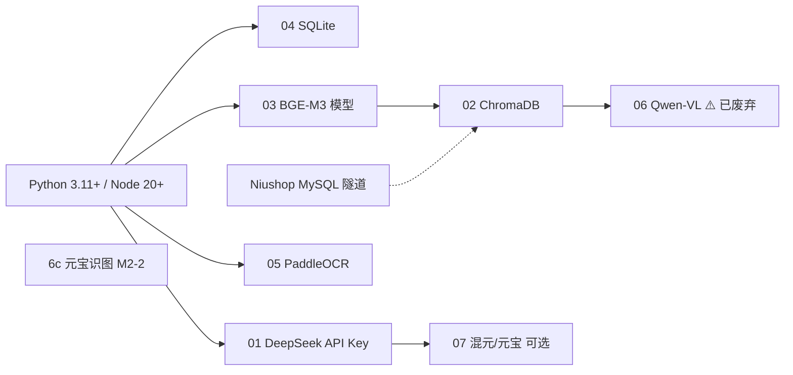

# 外部资源与环境准备 — 索引

> **用途**：编码开发**之前/之中**按依赖顺序完成各外部资源的下载、安装、对接与验收。  
> **原则**：每个资源独立成文；Windows 本地开发与 Linux 线上部署分节说明。  
> **关联**：[开发计划总览](../开发计划-总览.md)、[技术方案-SalesAgent服务端](../技术方案-SalesAgent服务端.md)、[技术方案-谛听客户端](../技术方案-谛听客户端.md)、[**知识库-结构化入库方案**](../知识库-结构化入库方案.md)

---

## 1. 资源清单与 POC 必要性

| # | 文档 | 资源 | 部署位置 | POC 必须 | 开发阶段 |
|---|------|------|----------|----------|----------|
| 1 | [01-DeepSeek-API.md](01-DeepSeek-API.md) | DeepSeek 云端 LLM | 云端 API | **是** | Phase 1 前 |
| 2 | [02-ChromaDB.md](02-ChromaDB.md) | ChromaDB 向量库 | 服务端本地目录 | **是** | Phase 1 前 |
| 3 | [03-BGE-M3-Embedding.md](03-BGE-M3-Embedding.md) | BGE-M3 向量化 | 服务端 CPU | **是** | Phase 1（与 Chroma 同批） |
| 4 | [04-SQLite-元数据与客户端库.md](04-SQLite-元数据与客户端库.md) | SQLite（双端） | 客户端 + 服务端 | **是** | Phase 0–1 |
| 5 | [05-PaddleOCR-客户端.md](05-PaddleOCR-客户端.md) | PaddleOCR PP-OCRv4 | 谛听 Python 守护进程 | **是**（OCR/图片 POC） | Phase 6 |
| 6 | [06-Qwen2-VL-Int4.md](06-Qwen2-VL-Int4.md) | Qwen-VL GPTQ Int4 | 服务端 CPU | **否**（**已暂停**） | — |
| 6b | [M2-2-VLM…§零](../M2-2-VLM图片描述-本地化部署与使用.md) | 原 Qwen2B Runbook | — | **已暂停** | 历史 |
| **6c** | [**M2-2-媒体图片描述-元宝技能方案.md**](../M2-2-媒体图片描述-元宝技能方案.md) | **元宝桌面识图补描述** | **谛听本机** | **M2-2 当前** | **进行中** |
| 7 | [07-腾讯混元与元宝网页版.md](07-腾讯混元与元宝网页版.md) | 混元 API / 元宝网页 | 云端 / 浏览器 | **否**（备选/测试） | 可选 |
| 8 | [只读接入Niushop商品与内容库说明.md](只读接入Niushop商品与内容库说明.md) | Niushop MySQL | 商城 CVM | **否**（POC 可用 HTTP 降级） | MVP 前 |
| 0b | [08-Node.js-独立安装.md](08-Node.js-独立安装.md) | Node.js 20+ LTS | 开发工作站 | **是** | 顺序 0 / Phase 0 前 |
| 9 | [09-Vidu视频生成-SkillHub接入.md](09-Vidu视频生成-SkillHub接入.md) | Vidu API + SkillHub Skill | 本机 Cursor Agent | **否**（做视频 POC） | M6 远期 / 视频 POC |
| — | [skillhub.md](skillhub.md) | SkillHub CLI 安装与优先源 | 开发工作站 | **否**（装 Vidu Skill 时） | 见 [09](09-Vidu视频生成-SkillHub接入.md) |
| — | [**知识库-结构化入库方案.md**](../知识库-结构化入库方案.md) | 知识库分段、图文结构、**知识网** | 服务端 ingest | **M1.6 ✅ / M2-1 ✅** | M2-2 元宝技能 |

---

## 2. 推荐准备顺序（依赖关系）



| 顺序 | 动作 | 阻塞 |
|------|------|------|
| **0** | Python 3.11+、Node 20+、Git；创建 `data_root` 目录 | 一切（本机备案见下 §2.0；Node 安装见 [08-Node.js](08-Node.js-独立安装.md)） |
| **1** | [04 SQLite](04-SQLite-元数据与客户端库.md) 目录与空库 | 服务端 S1、客户端 C2 |
| **2** | [01 DeepSeek](01-DeepSeek-API.md) 注册并写入 `.env` | 服务端 S5 analyze |
| **3** | [03 BGE-M3](03-BGE-M3-Embedding.md) 下载模型 | Chroma 写入与检索 |
| **4** | [02 ChromaDB](02-ChromaDB.md) pip 安装 + 写入测试 chunk | 服务端 S4/S5 |
| **5** | SSH 隧道 + [Niushop 说明](只读接入Niushop商品与内容库说明.md)（可选 POC） | 商城商品向量 |
| **6** | [05 PaddleOCR](05-PaddleOCR-客户端.md) | 客户端 Phase 6 |
| **7** | [06 Qwen-VL](06-Qwen2-VL-Int4.md) ⚠️ | 已废弃（勿装） |
| **7b** | [M2-2 元宝技能](../M2-2-媒体图片描述-元宝技能方案.md) | M2-2 媒体 `vlm_description` |
| **8** | [07 混元/元宝](07-腾讯混元与元宝网页版.md) | 仅对比测试 |
| **9** | [09 Vidu + SkillHub](09-Vidu视频生成-SkillHub接入.md) | 做视频 POC（非 MVP 阻塞） |

### 2.0 本机基础工具备案（顺序 0）

> **检查时间**：2026-06-17（Node 独立安装验收）  
> **工作站**：`DESKTOP-TH91SO5`（Windows 10）  
> **检查方式**：外部 PowerShell 执行 `node -v`、`npm -v`、`where.exe node`（注意：PowerShell 里 `where` 不是查路径命令）

| 工具 | 要求 | 本机版本 | 可执行路径 | 结论 |
|------|------|----------|------------|------|
| **Python** | 3.11+ | **3.14.6** | `C:\Python314\python.exe` | ✅ 满足（Node 装机构建工具时 choco 顺带升级）；PaddleOCR 仍建议 **3.11 venv** |
| **Node.js** | 20+ | **v22.22.3** | `C:\Program Files\nodejs\node.exe` | ✅ 官方 LTS 独立安装完成 |
| **npm** | 随 Node | **10.9.8** | `C:\Program Files\nodejs\npm.cmd` | ✅；`npm ping` → npmmirror PONG 通过 |
| **npx** | 随 Node | **10.9.8** | 随 npm | ✅ |
| **Git** | 任意较新版本 | **2.52.0.windows.1** | `C:\Program Files\Git\cmd\git.exe` | ✅ 满足 |

**本机 Node 一览**（2026-06-17 安装后）：

| 版本 | 路径 | 说明 |
|------|------|------|
| **v22.22.3** ✅ | `C:\Program Files\nodejs\` | **项目默认 Node**（外部 PowerShell 已验收） |
| v22.22.x | Cursor 内置 helpers | 仅 Cursor 部分终端抢先；与官方同主版本，可忽略 |
| v22.19.0 | `C:\Users\daton\.real\.bin\node\` | 钉钉 Real 内置，勿加入 PATH |
| v18.20.1 | DevEco Studio 自带 | 不在 PATH |

**备注**：

1. PowerShell 查路径用 **`where.exe node`**，不要用 `where node`（后者是 `Where-Object` 别名，无输出）。
2. Python 3.14.6 用于 SalesAgent；谛听 PaddleOCR 见 [05-PaddleOCR](05-PaddleOCR-客户端.md) 单独 3.11 venv。
3. `data_root` 已创建：**客户端** `C:/work/diting/data`、**服务端** `C:/work/salesagent/data`（全小写，与 Linux `/www/wwwroot/salesagent/data` 对称）。
4. **Node 版本定稿**：开发机与 Linux CVM（若装）均为 **v22.22.3 + npm 10.9.8**，见 [08 §6](08-Node.js-独立安装.md)。

**顺序 0 自检清单**：

- [x] Python 3.11+ 已安装（本机 3.14.6）
- [x] Node 20+ 独立安装完成（v22.22.3 + npm/npx 10.9.8；`npm ping` 已通过，见 [08](08-Node.js-独立安装.md)）
- [x] Git 已安装（2.52.0）
- [x] `data_root` 目录已创建（客户端 `C:/work/diting/data` + 服务端 `C:/work/salesagent/data`）

### 2.1 顺序 1 — SQLite 备案

> **检查时间**：2026-06-17（Phase 1 服务端验收后更新）  
> **文档**：[04-SQLite-元数据与客户端库.md](04-SQLite-元数据与客户端库.md)

| 项 | 要求 | 本机结果 | 结论 |
|----|------|----------|------|
| Python `sqlite3` 模块 | 可 import | **SQLite 3.50.4**（`python -c "import sqlite3; print(sqlite3.sqlite_version)"`） | ✅ |
| 服务端库路径 | `C:/work/salesagent/data/salesagent.db` | Phase 1 S1 已建表；`demand_events` 等 8 表；`verify_phase1.py` 通过 | ✅ |
| 客户端库路径 | `C:/work/diting/data/client.db` | Phase 2 C2 已建表；`verify_phase2` 通过 | ✅ |

**顺序 1 自检清单**：

- [x] `import sqlite3` 通过（引擎 **3.50.4**）
- [x] 双端 `data_root` 目录可写
- [x] `salesagent.db` 已建表（Phase 1 S1，`verify_phase1.py`）
- [x] `client.db` 已建表（Phase 2 C2，`npm run verify:phase2`）
- [x] 客户端 `better-sqlite3` 安装（Phase 2 C2，`@electron/rebuild`）

### 2.2 顺序 2 — DeepSeek API 备案

> **检查时间**：2026-06-17（Phase 1 全链路验收后更新）  
> **文档**：[01-DeepSeek-API.md](01-DeepSeek-API.md)

| 项 | 要求 | 本机结果 | 结论 |
|----|------|----------|------|
| `DEEPSEEK_API_KEY` | `salesagent/.env` | 已配置 | ✅ |
| API 探活 | `GET /v1/models` 200 | 返回 `deepseek-v4-flash`、`deepseek-v4-pro` 等 | ✅ |
| `server.json` 模型 | `deepseek-v4-flash` | 与官方列表一致 | ✅ |

**顺序 2 自检清单**：

- [x] Key 已写入 `salesagent/.env`
- [x] API 探活通过（模型列表含 **deepseek-v4-flash**）
- [x] `verify_phase1.py`：`POST /api/analyze` 202 + WS `demand_event` + DeepSeek | ✅ |
- [ ] （推荐）§4.2 Python 脚本实际对话一条（可选）

### 2.3 顺序 6 — PaddleOCR 备案

> **检查时间**：2026-06-18（Phase 6 编码前环境准备）  
> **文档**：[05-PaddleOCR-客户端.md](05-PaddleOCR-客户端.md)

| 项 | 要求 | 本机结果 | 结论 |
|----|------|----------|------|
| Python 3.11 | listener 专用 venv | **3.11.9**（`winget install Python.Python.3.11`） | ✅ |
| Paddle 轮子 | 3.14 无包 | 3.14 失败 → 3.11 venv 成功 | ✅ |
| paddlepaddle | CPU 2.6.x | **2.6.2** | ✅ |
| paddleocr | PP-OCRv4 API | **2.9.1**（`ocr_version='PP-OCRv4'`） | ✅ |
| 验收脚本 | 识别「防晒霜」 | `scripts/verify_paddleocr_env.py` → OK | ✅ |
| venv 路径 | `.venv-listener` | `ditingclient\.venv-listener` | ✅ |

**顺序 6 自检清单**：

- [x] Python 3.11 已安装（本机 3.11.9；SalesAgent 仍用 3.14.6）
- [x] `.venv-listener` 已创建（`py -3.11 -m venv`）
- [x] `paddlepaddle==2.6.2` + `paddleocr==2.9.1` 已安装
- [x] PP-OCRv4 模型已下载至 `%USERPROFILE%\.paddleocr\whl\`
- [x] `verify_paddleocr_env.py` 通过

---

## 3. 环境变量总表

> **模板文件**：[salesagent/.env.example](../salesagent/.env.example)  
> **定稿路径**：**仅** `salesagent/.env`（monorepo 内）；线上 **`/www/wwwroot/salesagent/.env`**（`salesagent/` 发布到部署根，无重复目录名）。

```bash
cd salesagent && cp .env.example .env
```

内容摘要：

```bash
DEEPSEEK_API_KEY=sk-xxxxxxxx
SALESAGENT_DATA_ROOT=C:/work/salesagent/data   # 生产：/www/wwwroot/salesagent/data
```

完整项见 [salesagent/.env.example](../salesagent/.env.example)。

客户端数据目录见 `ditingclient/config/client.json#data_root`（默认 `C:/work/diting/data`）。

---

## 4. 跨平台提醒

见 [开发计划 §1.4](../开发计划-总览.md#14-跨平台路径备注-windows-开发--linux-上线)：Windows 路径大小写不敏感，**Linux 线上敏感**；模型路径、`import` 包名、配置键名务必与文档一致。

---

## 5. 修订记录

| 版本 | 日期 | 说明 |
|------|------|------|
| v1.0 | 2026-06-16 | 初稿：8 项资源索引 + 准备顺序 |
| v1.1 | 2026-06-15 | §2.0 本机基础工具版本备案（DESKTOP-TH91SO5） |
| v1.2 | 2026-06-17 | §2.0 定位 Node v22.19.0（`.real`）；用户 PATH 已更新；系统 PATH 待管理员脚本 |
| v1.3 | 2026-06-17 | 新增 [08-Node.js-独立安装](08-Node.js-独立安装.md)；§2.0 改为推荐官方 LTS |
| v1.4 | 2026-06-17 | §2.0 备案 Node v22.22.3 + npm 10.9.8；Python 升至 3.14.6 |
| v1.5 | 2026-06-17 | 链至 [08 §6](08-Node.js-独立安装.md) Linux 与本地同版本定稿 |
| v1.6 | 2026-06-17 | §2.0 创建 `data_root` 双端目录树 |
| v1.7 | 2026-06-17 | 服务端 `data_root` 迁至 `C:/work/salesagent/data`（与谛听目录分离） |
| v1.8 | 2026-06-17 | 运行路径统一**全小写**（`diting` / `salesagent`）；Linux 同步为 `/www/wwwroot/salesagent/` |
| v1.9 | 2026-06-17 | §2.1 顺序 1 SQLite 验收备案（引擎 3.50.4） |
| v2.0 | 2026-06-17 | §3 定稿 `salesagent/.env`；模板迁至 `salesagent/.env.example` |
| v2.1 | 2026-06-17 | §2.2 顺序 2 DeepSeek 探活备案（v4-flash / v4-pro） |
| v2.2 | 2026-06-17 | §2.1 服务端 `salesagent.db` Phase 1 验收；§2.2 `verify_phase1.py` 全链路 |
| v2.3 | 2026-06-17 | §2.1 客户端 `client.db` + `better-sqlite3` Phase 2 验收 |
| v2.4 | 2026-06-18 | §2.3 顺序 6 PaddleOCR 环境验收备案 |
| v2.5 | 2026-07-04 | 新增 [09-Vidu视频生成-SkillHub接入](09-Vidu视频生成-SkillHub接入.md)、[skillhub.md](skillhub.md) 索引 |
